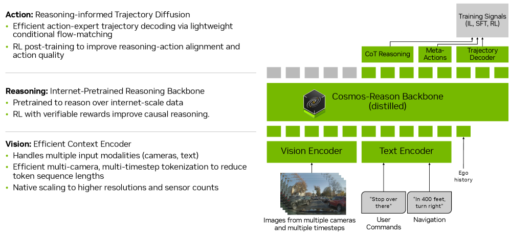
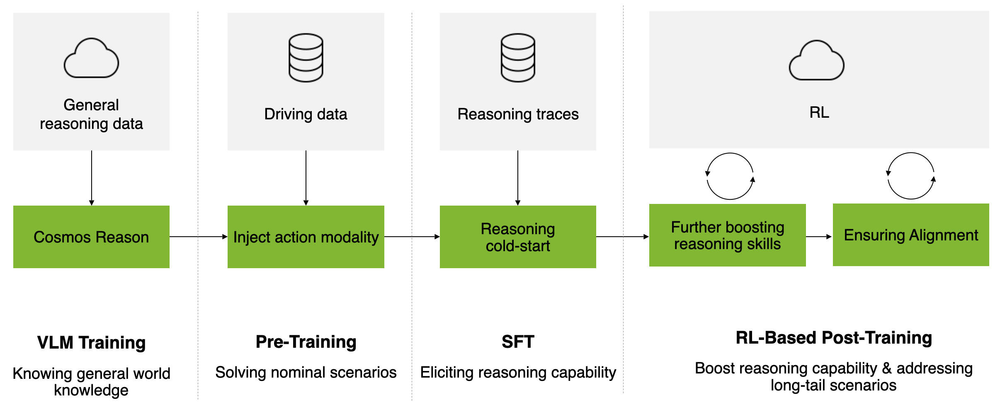
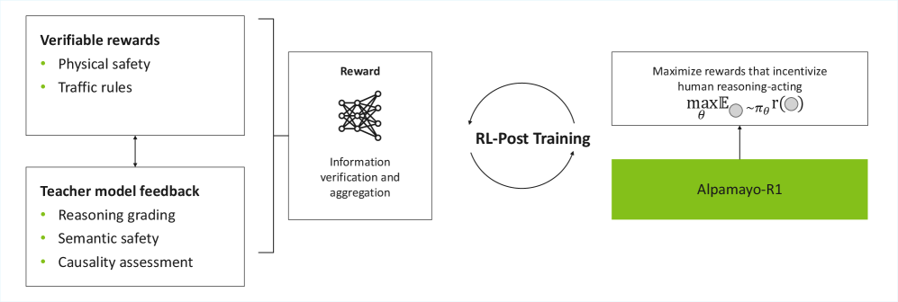
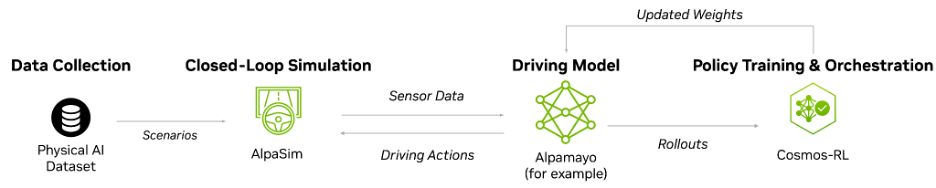

# NVIDIA Alpamayo 1 → 2 무엇이 달라졌나 — 비교 보고서

- 작성일: 2026-07-15 · 모든 출처 접근일 동일
- 근거 자료: 공식 소스 15건+ · 논문 · 서드파티 — 전체 발췌·검증 상태는 [reference/references.md](reference/references.md)
- 표기 규칙: 사실 문장 뒤 괄호에 원문 링크 병기. 검증 등급 ✅(복수 소스 교차검증) / 🔍(원문 직접 확인) / 📄(원문 발췌 확보) / 🎥(영상 발언만, 문서 미확인)
- ⚠️ 미리 알림: ① Alpamayo 2 Super 파라미터 수는 소스 간 **34B(보도자료) vs 32B(그 외)** 표기가 갈림 — [§9.1](#91-파라미터-수-34b-vs-32b)에서 정리 ② "LingoQA 1위", "7+ 카메라"는 영상 발언만 ③ Mercedes CLA 탑재설 기사는 접근 실패(403)로 확인 불가

---

## 1. 한눈 요약

**Alpamayo 2는 "같은 모델의 개선판"이 아니라 세대 교체다.** 10B급 연구용 모델(1, 1.5 — 공식 명칭 "Nano")에서 34B급 robotaxi(Level 4)용 teacher 모델("Super")로 커졌고, 모델과 함께 학습 방법 자체(closed-loop RL, AlpaGym)가 바뀌었다. 단, **2026-07-15 현재 Alpamayo 2 Super 가중치는 미공개**(여름 공개 예정, HF 검색으로 미존재 직접 확인 🔍).

| 달라진 것 | Alpamayo 1 / 1.5 (Nano) | Alpamayo 2 Super | 근거 |
|---|---|---|---|
| 크기·백본 | 10B (백본 Cosmos-Reason/Reason2 8.2B + action expert 2.3B) | 34B 전체, 백본 Cosmos 3 Super Reasoner 32B — 약 3배 | 🔍 [R1 모델카드](https://huggingface.co/nvidia/Alpamayo-R1-10B) · [1.5 모델카드](https://huggingface.co/nvidia/Alpamayo-1.5-10B) · [보도자료 5/31](https://nvidianews.nvidia.com/news/nvidia-alpamayo-2-super-robotaxis) · [HF 블로그 Alpamayo 2](https://huggingface.co/blog/drmapavone/nvidia-alpamayo-2) |
| 카메라 인지 범위 | 전방 중심 4카메라 | 360° (전·측·후방) | 🔍 [R1 모델카드](https://huggingface.co/nvidia/Alpamayo-R1-10B) · [HF 블로그 Alpamayo 2](https://huggingface.co/blog/drmapavone/nvidia-alpamayo-2) |
| 출력 | 궤적 + 추론 텍스트(CoC) | + **Meta-Action** (yield / lane change / stop 같은 상위 판단) | 🔍 [보도자료 5/31](https://nvidianews.nvidia.com/news/nvidia-alpamayo-2-super-robotaxis) |
| 새 용도 | 주행 모델 | + **auto-labeling 모델 겸용** (2D grounding 라벨 생성, 어노테이션 "수개월→수일" 주장) | 🔍 [보도자료 5/31](https://nvidianews.nvidia.com/news/nvidia-alpamayo-2-super-robotaxis) |
| 학습 생태계 | AlpaSim (평가용 시뮬레이터) | + **AlpaGym** (closed-loop RL 학습 프레임워크) + OmniDreams (시나리오 생성) | ✅ [보도자료 5/31](https://nvidianews.nvidia.com/news/nvidia-alpamayo-2-super-robotaxis) · [GitHub alpagym](https://github.com/NVlabs/alpagym) · [AlpaGym 블로그](https://developer.nvidia.com/blog/how-to-post-train-autonomous-vehicle-models-in-closed-loop-with-nvidia-alpamayo/) |
| 타깃 | AV 연구 커뮤니티 | Level 4 robotaxi 개발, teacher → distill → 차량(DRIVE AGX Thor) 탑재 | 🔍 [보도자료 5/31](https://nvidianews.nvidia.com/news/nvidia-alpamayo-2-super-robotaxis) |

---

## 2. 배경 — Alpamayo가 뭔지 3분 정리

**Alpamayo = NVIDIA의 오픈 자율주행 "reasoning" 생태계.** 모델 하나가 아니라 ①모델 시리즈 + ②시뮬레이터(AlpaSim) + ③RL 학습 프레임워크(AlpaGym) + ④대규모 공개 데이터셋 + ⑤auto-labeling 파이프라인 묶음이다. CES 2026(2026-01-05)에서 플랫폼으로 공식 발표됐다. (🔍 [CES 보도자료](https://nvidianews.nvidia.com/news/alpamayo-autonomous-vehicle-development))

핵심 아이디어: 기존 end-to-end 자율주행 모델은 영상→궤적을 바로 뽑는다("블랙박스"). Alpamayo는 궤적을 내기 **전에 "왜 그렇게 운전하는지" 텍스트로 추론 과정을 먼저 생성**한다. NVIDIA는 이 추론 강제가 어려운 상황(long-tail)에서 더 안전한 행동을 만들고, 사후 안전 문서화·규제 대응에도 쓰인다고 주장한다. (🔍 [arXiv 논문](https://arxiv.org/abs/2511.00088), 📄 [The Decoder](https://the-decoder.com/nvidia-bets-big-on-physical-ai-at-gtc-taipei-with-a-new-world-model-driving-brain-and-open-humanoid-robot/))

> 그림 출처: [arXiv 2511.00088v2 Figure 1](https://arxiv.org/html/2511.00088v2) (NVIDIA, Alpamayo-R1 논문)

### 용어 최소셋

| 용어 | 뜻 |
|---|---|
| VLA (Vision-Language-Action) | 영상+텍스트를 입력받아 "행동"(여기서는 주행 궤적)을 출력하는 모델 |
| CoC (Chain-of-Causation) | Alpamayo의 추론 텍스트 형식. 일반 chain-of-thought와 달리 "원인→결정" 인과 구조로 설계·라벨링됨 (🔍 [arXiv](https://arxiv.org/abs/2511.00088)) |
| Meta-Action | "차선 변경", "정지", "양보" 같은 상위 수준 주행 판단. 궤적(좌표열)보다 한 단계 추상적인 출력 (🔍 [보도자료 5/31](https://nvidianews.nvidia.com/news/nvidia-alpamayo-2-super-robotaxis)) |
| Cosmos-Reason / Cosmos 3 Super Reasoner | NVIDIA의 Physical AI용 비전-언어 백본 모델 계열. Alpamayo는 이 위에 주행 능력을 얹음 (🔍 [arXiv](https://arxiv.org/abs/2511.00088) · [HF 블로그 Alpamayo 2](https://huggingface.co/blog/drmapavone/nvidia-alpamayo-2)) |
| Action Expert | 백본이 만든 표현을 실제 궤적으로 바꾸는 diffusion 기반 디코더 (1/1.5에서 2.3B) (🔍 [R1 모델카드](https://huggingface.co/nvidia/Alpamayo-R1-10B)) |
| Open-loop / Closed-loop | open-loop = 녹화 데이터에 대해 1회 예측·채점. closed-loop = 시뮬레이터와 상호작용하며 자기 행동의 결과를 겪음 (자기 실수 복구, 인과 학습에 필요) (📄 [AlpaGym 블로그](https://developer.nvidia.com/blog/how-to-post-train-autonomous-vehicle-models-in-closed-loop-with-nvidia-alpamayo/)) |
| AlpaSim | 오픈소스 end-to-end AV 시뮬레이터. NuRec 재구성 씬 렌더링, 마이크로서비스 구조 (✅ [developer blog](https://developer.nvidia.com/blog/building-autonomous-vehicles-that-reason-with-nvidia-alpamayo/) · [솔루션 페이지](https://www.nvidia.com/en-us/solutions/autonomous-vehicles/alpamayo/)) |
| AlpaGym | AlpaSim(환경) + Cosmos-RL(분산 학습)로 closed-loop RL post-training을 돌리는 프레임워크. GRPO 기본 (✅ [GitHub alpagym](https://github.com/NVlabs/alpagym) · [AlpaGym 블로그](https://developer.nvidia.com/blog/how-to-post-train-autonomous-vehicle-models-in-closed-loop-with-nvidia-alpamayo/)) |
| Nano / Super | NVIDIA 공식 크기 표기. 10B = "Alpamayo 1 Nano", "1.5 Nano" / 34B = "2 Super" (🔍 [보도자료 5/31](https://nvidianews.nvidia.com/news/nvidia-alpamayo-2-super-robotaxis) · [솔루션 페이지](https://www.nvidia.com/en-us/solutions/autonomous-vehicles/alpamayo/)) |
| Distillation | 큰 teacher 모델의 능력을 작은 모델로 압축 — 차량 탑재(DRIVE AGX Thor)용 경로 (🔍 [보도자료 5/31](https://nvidianews.nvidia.com/news/nvidia-alpamayo-2-super-robotaxis)) |

---

## 3. 버전 타임라인

| 시점 | 이벤트 | 근거 |
|---|---|---|
| 2025-10-30 | arXiv 논문 v1 "Alpamayo-R1: Bridging Reasoning and Action Prediction..." 제출 | 🔍 [arXiv](https://arxiv.org/abs/2511.00088) |
| 2025-12-01 | NeurIPS 2025에서 **DRIVE Alpamayo-R1** 오픈 공개 발표("세계 최초 오픈 reasoning VLA for AV" 주장) + AlpaSim 공개 | 📄 [NeurIPS 블로그](https://blogs.nvidia.com/blog/neurips-open-source-digital-physical-ai/) |
| 2025-12-03 | Hugging Face에 가중치 `nvidia/Alpamayo-R1-10B` 릴리스 | 🔍 [R1 모델카드](https://huggingface.co/nvidia/Alpamayo-R1-10B) |
| 2026-01-05 | **CES 2026: Alpamayo 플랫폼 발표.** Alpamayo-R1 → **Alpamayo 1**로 개명. Physical AI AV Dataset(1,727시간) 공개 | ✅ [CES 보도자료](https://nvidianews.nvidia.com/news/alpamayo-autonomous-vehicle-development) · [R1 모델카드](https://huggingface.co/nvidia/Alpamayo-R1-10B) · [GitHub alpamayo](https://github.com/NVlabs/alpamayo) |
| 2026-01-07 | arXiv v2 (개명 반영: "also referred to as Alpamayo 1") | 📄 [arXiv v2](https://arxiv.org/html/2511.00088v2) |
| 2026-03-19 | **Alpamayo 1.5** HF 릴리스 (`nvidia/Alpamayo-1.5-10B`, 코드 repo 분리) | 🔍 [1.5 모델카드](https://huggingface.co/nvidia/Alpamayo-1.5-10B) · [GitHub alpamayo](https://github.com/NVlabs/alpamayo) |
| 2026-05-19 | NVlabs/alpagym repo 생성 (GitHub API 기준) | 📄 [GitHub alpagym](https://github.com/NVlabs/alpagym) |
| 2026-05-21 | COMPUTEX 2026 Best Choice Awards — Alpamayo, Vehicle Technology & Smart Cockpit 부문 수상 | 📄 [GTC Taipei 뉴스 블로그](https://blogs.nvidia.com/blog/nvidia-gtc-taipei-computex-2026-news/) |
| 2026-05-31 | **GTC Taipei (COMPUTEX 2026) 키노트: Alpamayo 2 Super 발표** + AlpaGym·OmniDreams 소개 | 🔍 [보도자료 5/31](https://nvidianews.nvidia.com/news/nvidia-alpamayo-2-super-robotaxis) · 📄 [GTC 뉴스 블로그](https://blogs.nvidia.com/blog/nvidia-gtc-taipei-computex-2026-news/) |
| 2026-06-01 | Marco Pavone HF 블로그(Alpamayo 2) + AlpaGym how-to 블로그 게시. AlpaGym 코드 공개는 이 무렵 라이브스트림 중("released right now" 발언) | 🔍 [HF 블로그 Alpamayo 2](https://huggingface.co/blog/drmapavone/nvidia-alpamayo-2) · 📄 [AlpaGym 블로그](https://developer.nvidia.com/blog/how-to-post-train-autonomous-vehicle-models-in-closed-loop-with-nvidia-alpamayo/) · 🎥 [라이브스트림](https://www.youtube.com/watch?v=kJRVwaYwvt0) |
| 2026-06 (CVPR 2026) | 공개 챌린지 2종 시작: [AlpaSim Closed-Loop E2E Driving](https://huggingface.co/spaces/nvidia/AlpasimE2EClosedLoopChallenge2026) / [Physical AI AV Reasoning](https://huggingface.co/spaces/nvidia/PhysicalAI-AV-OOD-Reasoning-Challenge-2026) | 📄 [AlpaGym 블로그](https://developer.nvidia.com/blog/how-to-post-train-autonomous-vehicle-models-in-closed-loop-with-nvidia-alpamayo/) |
| 2026 여름 (예정) | Alpamayo 2 Super 가중치(HF)·추론 코드(GitHub) 공개 예정 — **2026-07-15 현재 미공개 확인** | 🔍 [보도자료 5/31](https://nvidianews.nvidia.com/news/nvidia-alpamayo-2-super-robotaxis) · HF 검색 직접 확인 |

---

## 4. 버전별 상세 비교표

주요 근거 4개: [arXiv 논문](https://arxiv.org/abs/2511.00088) · [R1 모델카드](https://huggingface.co/nvidia/Alpamayo-R1-10B) · [1.5 모델카드](https://huggingface.co/nvidia/Alpamayo-1.5-10B) · [보도자료 5/31](https://nvidianews.nvidia.com/news/nvidia-alpamayo-2-super-robotaxis) — 칸별 표기는 아래.

| 항목 | Alpamayo 1 (= Alpamayo-R1) | Alpamayo 1.5 | Alpamayo 2 Super |
|---|---|---|---|
| 발표 | NeurIPS 2025 (R1) → CES 2026 개명 (📄 [NeurIPS 블로그](https://blogs.nvidia.com/blog/neurips-open-source-digital-physical-ai/), 🔍 [R1 카드](https://huggingface.co/nvidia/Alpamayo-R1-10B)) | 2026-03-19 HF 릴리스 (🔍 [1.5 카드](https://huggingface.co/nvidia/Alpamayo-1.5-10B)) | 2026-05-31 GTC Taipei 발표 (🔍 [보도자료](https://nvidianews.nvidia.com/news/nvidia-alpamayo-2-super-robotaxis)) |
| 파라미터 | 10B = 백본 8.2B + action expert 2.3B (🔍 [R1 카드](https://huggingface.co/nvidia/Alpamayo-R1-10B)) | 10B 동일 구성 (🔍 [1.5 카드](https://huggingface.co/nvidia/Alpamayo-1.5-10B)) | **34B**(🔍 [보도자료](https://nvidianews.nvidia.com/news/nvidia-alpamayo-2-super-robotaxis)) / 백본 32B(🔍 [HF 블로그](https://huggingface.co/blog/drmapavone/nvidia-alpamayo-2)) — §9.1 |
| 백본 | Cosmos-Reason (🔍 [arXiv](https://arxiv.org/abs/2511.00088)) | **Cosmos-Reason2** (🔍 [1.5 카드](https://huggingface.co/nvidia/Alpamayo-1.5-10B)) | **Cosmos 3 Super Reasoner** (🔍 [HF 블로그](https://huggingface.co/blog/drmapavone/nvidia-alpamayo-2)) |
| 카메라 입력 | 4개 고정(front-wide/front-tele/cross-left/cross-right), 10Hz 0.4s 히스토리 (🔍 [R1 카드](https://huggingface.co/nvidia/Alpamayo-R1-10B)) | 4개 기본 + **flexible camera counts** (🔍 [1.5 카드](https://huggingface.co/nvidia/Alpamayo-1.5-10B)) | **360°** 전·측·후방, 개수 미명시 — 영상에선 "7+" (🔍 [HF 블로그](https://huggingface.co/blog/drmapavone/nvidia-alpamayo-2), 🎥 [라이브스트림](https://www.youtube.com/watch?v=kJRVwaYwvt0)) |
| 그 외 입력 | egomotion 히스토리만, **navigation 입력 없음** (🔍 [GitHub alpamayo](https://github.com/NVlabs/alpamayo)) | + **navigation guidance**(텍스트), 사용자 질문 (🔍 [1.5 카드](https://huggingface.co/nvidia/Alpamayo-1.5-10B)) | navigation 포함(플랫폼 설명 기준) (✅ [솔루션 페이지](https://www.nvidia.com/en-us/solutions/autonomous-vehicles/alpamayo/)) |
| 출력 | CoC 추론 + 6.4s 궤적(64 waypoints @10Hz) (🔍 [R1 카드](https://huggingface.co/nvidia/Alpamayo-R1-10B)) | + **VQA 답변** (🔍 [1.5 카드](https://huggingface.co/nvidia/Alpamayo-1.5-10B)) | + **Meta-Action** + 2D grounding 라벨 (🔍 [보도자료](https://nvidianews.nvidia.com/news/nvidia-alpamayo-2-super-robotaxis)) |
| 학습 | CoC 데이터셋(hybrid auto-label+human) → SFT → RL(GRPO). 단 **공개 가중치는 RL 미적용** (🔍 [arXiv](https://arxiv.org/abs/2511.00088) · [GitHub alpamayo](https://github.com/NVlabs/alpamayo)) | **RL post-trained 공개** (🔍 [1.5 카드](https://huggingface.co/nvidia/Alpamayo-1.5-10B)) | + **closed-loop RL(AlpaGym)** (✅ [보도자료](https://nvidianews.nvidia.com/news/nvidia-alpamayo-2-super-robotaxis) · [GitHub alpagym](https://github.com/NVlabs/alpagym)) |
| 학습 데이터 | 80,000시간, CoC traces 700K (🔍 [R1 카드](https://huggingface.co/nvidia/Alpamayo-R1-10B)) | 80,000시간(10억+ 이미지), **CoC 3M** (🔍 [1.5 카드](https://huggingface.co/nvidia/Alpamayo-1.5-10B)) | 미공개 |
| 벤치마크 | AlpaSim Score 0.73±0.01, minADE_6@6.4s 1.22m (🔍 [R1 카드](https://huggingface.co/nvidia/Alpamayo-R1-10B)). 논문: planning accuracy +12%, close encounter -35%, 실차 99ms (🔍 [arXiv](https://arxiv.org/abs/2511.00088)) | AlpaSim Score **0.81±0.01**, minADE **1.11m**, LingoQA Lingo-Judge **74.2** (🔍 [1.5 카드](https://huggingface.co/nvidia/Alpamayo-1.5-10B)) | 수치 미공개, "state-of-the-art" 주장만 (🔍 [HF 블로그](https://huggingface.co/blog/drmapavone/nvidia-alpamayo-2)) |
| 공개 상태 | 가중치+추론 코드 공개 (gated, ~22GB) (📄 [GitHub alpamayo](https://github.com/NVlabs/alpamayo)) | 가중치+추론 코드 공개 (🔍 [1.5 카드](https://huggingface.co/nvidia/Alpamayo-1.5-10B)) | **미공개**, 여름 예정 (🔍 [보도자료](https://nvidianews.nvidia.com/news/nvidia-alpamayo-2-super-robotaxis)) |
| 라이선스 | 가중치 non-commercial(상업 별도 요청) / 코드 Apache 2.0 (🔍 [R1 카드](https://huggingface.co/nvidia/Alpamayo-R1-10B) · [GitHub alpamayo](https://github.com/NVlabs/alpamayo)) | 동일 구조 (🔍 [1.5 카드](https://huggingface.co/nvidia/Alpamayo-1.5-10B)) | 미발표. CES 시점 "상업 사용 옵션" 예고 (📄 [CES 보도자료](https://nvidianews.nvidia.com/news/alpamayo-autonomous-vehicle-development)) |
| 추론 GPU | ≥24GB VRAM (🔍 [GitHub alpamayo](https://github.com/NVlabs/alpamayo)) | 동급 10B·AlpaGym 학습은 ≥40GB 권장 GPU 2장 (📄 [AlpaGym 블로그](https://developer.nvidia.com/blog/how-to-post-train-autonomous-vehicle-models-in-closed-loop-with-nvidia-alpamayo/)) | 미공개 |
| 코드 위치 | [NVlabs/alpamayo](https://github.com/NVlabs/alpamayo) | [NVlabs/alpamayo1.5](https://github.com/NVlabs/alpamayo1.5) · recipes: [NVlabs/alpamayo-recipes](https://github.com/NVlabs/alpamayo-recipes) | 미공개 (예정: GitHub+HF) |

정리하면 **1 → 1.5**는 같은 10B 틀에서의 기능 확장(RL 적용 공개, navigation/VQA/유연한 카메라 입력, CoC 데이터 4배)이고, **1.5 → 2 Super**는 크기(3배)·인지 범위(360°)·출력(meta-action)·용도(auto-labeler 겸용)·학습 방식(closed-loop RL)이 함께 바뀌는 세대 전환이다.

---

## 5. Alpamayo 2에서 달라진 것 — 상세

### 5.1 모델: 10B Nano → 34B Super, 백본 세대 교체

- 보도자료 원문: "a 34-billion-parameter reasoning-based vision language action (VLA) model" — 이전 세대를 "NVIDIA Alpamayo 1 Nano and NVIDIA Alpamayo 1.5 Nano"로 명명하며 teacher 모델 스케일업으로 설명. (🔍 [보도자료 5/31](https://nvidianews.nvidia.com/news/nvidia-alpamayo-2-super-robotaxis))
- 백본은 Cosmos-Reason(1) → Cosmos-Reason2(1.5) → **Cosmos 3 Super Reasoner 32B**(2 Super)로 매 버전 교체. "3x the number of parameters as prior Alpamayo models". (🔍 [HF 블로그 Alpamayo 2](https://huggingface.co/blog/drmapavone/nvidia-alpamayo-2))
- 포지셔닝 변화: 1/1.5는 "AV 연구 커뮤니티용, 로컬 개발 친화적 10B" (📄 [HF 런치 블로그](https://huggingface.co/blog/drmapavone/nvidia-alpamayo)) → 2 Super는 "safe robotaxi (Level 4) development". 큰 teacher가 추론·인지 품질을 만들고, **distillation으로 압축해 DRIVE AGX Thor 차량 칩에 탑재**하는 구도를 공식화. (🔍 [보도자료 5/31](https://nvidianews.nvidia.com/news/nvidia-alpamayo-2-super-robotaxis))

### 5.2 인지: 전방 중심 → 360° 서라운드

- 1/1.5는 전방 광각+망원, 좌우 크로스 4카메라 — 후방 없음. (🔍 [R1 모델카드](https://huggingface.co/nvidia/Alpamayo-R1-10B) · [1.5 모델카드](https://huggingface.co/nvidia/Alpamayo-1.5-10B))
- 2 Super: "Expands from front-focused cameras to 360-degree situational awareness across front, side and rear views". 카메라 개수는 문서 미명시 — "7+ 카메라"는 라이브스트림 발언. (🔍 [HF 블로그 Alpamayo 2](https://huggingface.co/blog/drmapavone/nvidia-alpamayo-2), 🎥 [라이브스트림](https://www.youtube.com/watch?v=kJRVwaYwvt0))
- robotaxi(무인) 전제에서 후방·측방 인지는 필수라 Level 4 타깃과 맞물리는 변화.

### 5.3 출력: Meta-Action 추가

- "Adds Meta-Action output — including macro actions such as yield, lane change and stop — so the model predicts high-level driving decisions". (🔍 [보도자료 5/31](https://nvidianews.nvidia.com/news/nvidia-alpamayo-2-super-robotaxis))
- 궤적만 출력하던 구조에서, **downstream planner가 소비할 수 있는 상위 판단**을 병행 출력 — 서드파티 보도도 "모델이 궤적과 함께 meta-action을 하위 플래너에 전달"로 해설. (📄 [The Decoder](https://the-decoder.com/nvidia-bets-big-on-physical-ai-at-gtc-taipei-with-a-new-world-model-driving-brain-and-open-humanoid-robot/))
- 참고: meta-action 개념 자체는 R1 논문 실험에도 등장(Fig 7 캡션 "models that ... output meta-actions and trajectories") — **공식 출력 모달리티로 제품화된 게 2 Super의 변화**. (📄 [arXiv v2 Fig 7](https://arxiv.org/html/2511.00088v2))
- 결과적으로 추상 레벨 3층: 텍스트 CoC(왜) → meta-action(무엇을) → 궤적(어떻게).

### 5.4 새 용도: Reasoning Auto-Labeling (2D grounding)

- "Introduces reasoning auto-labeling with 2D grounding so the 34-billion-parameter foundation model can provide high-quality reasoning labels, compressing annotation cycles from months to days". (🔍 [보도자료 5/31](https://nvidianews.nvidia.com/news/nvidia-alpamayo-2-super-robotaxis))
- 의미: 2 Super는 주행 모델이면서 **다른(작은) 모델 학습용 CoC 라벨 생성기**를 겸한다. 1의 CoC 700K → 1.5의 3M으로 라벨을 늘린 것도 auto-labeling 파이프라인 덕인데 (🔍 [R1 카드](https://huggingface.co/nvidia/Alpamayo-R1-10B) · [1.5 카드](https://huggingface.co/nvidia/Alpamayo-1.5-10B)), 2 Super는 그 라벨러 역할을 모델 자체 기능으로 흡수 + 근거를 이미지 내 위치(2D grounding)로 연결.
- "수개월→수일"은 NVIDIA 주장 수치 — 독립 검증 없음.

### 5.5 학습: Closed-loop RL 정식화 (AlpaGym)

Alpamayo 1의 3단계 학습(논문)과, Alpamayo 2에서 그 마지막 단계를 시뮬레이터-in-the-loop로 확장한 구조:

> 그림 출처: [arXiv 2511.00088v2 Figure 5](https://arxiv.org/html/2511.00088v2) (NVIDIA, Alpamayo-R1 논문)

> 그림 출처: [arXiv 2511.00088v2 Figure 6](https://arxiv.org/html/2511.00088v2)

- 배경: 1의 논문 단계 RL(GRPO)은 **open-loop**(녹화 데이터 1스텝 예측에 보상) 중심. 1.5에서 RL post-training이 공개 가중치에 처음 적용. (🔍 [arXiv](https://arxiv.org/abs/2511.00088) · [1.5 카드](https://huggingface.co/nvidia/Alpamayo-1.5-10B) · [GitHub alpamayo](https://github.com/NVlabs/alpamayo))
- Alpamayo 2와 함께 나온 **AlpaGym**은 시뮬레이터를 학습 루프 안에 넣는다: AlpaSim(환경) ↔ 정책 rollout ↔ Cosmos-RL(분산 학습, GRPO)로 "자기 행동의 결과"에서 배움. (✅ [GitHub alpagym](https://github.com/NVlabs/alpagym) · [AlpaGym 블로그](https://developer.nvidia.com/blog/how-to-post-train-autonomous-vehicle-models-in-closed-loop-with-nvidia-alpamayo/))

> 그림 출처: [Hugging Face 블로그 "NVIDIA Alpamayo 2"](https://huggingface.co/blog/drmapavone/nvidia-alpamayo-2) (Marco Pavone, 2026-06-01)

- closed-loop가 필요한 이유(라이브스트림 설명 🎥 [영상](https://www.youtube.com/watch?v=kJRVwaYwvt0)): ①covariate shift — 자기 실수에서 복구하는 법은 전문가 데이터에 없음 ②인과 혼동 — "빨간불이라 정지"와 "앞차가 서니 정지"를 구분하려면 개입(시뮬레이션)이 필요.
- 현재 상태: AlpaGym 공개 초기 단계. **지원 모델은 Alpamayo 1.5 10B뿐**(2 Super 미지원), 10B 학습에 GPU 2장(트레이너/롤아웃 분리), ≥40GB VRAM 권장, NuRec 씬 데이터 최대 ~1.5TB. (📄 [GitHub alpagym](https://github.com/NVlabs/alpagym) · [AlpaGym 블로그](https://developer.nvidia.com/blog/how-to-post-train-autonomous-vehicle-models-in-closed-loop-with-nvidia-alpamayo/))
- 함께 발표된 **OmniDreams**: 포토리얼 주행 시나리오 생성 모델 — 렌더링을 재구성(NuRec) 기반에서 생성형으로 확장하는 방향. (📄 [GTC 뉴스 블로그](https://blogs.nvidia.com/blog/nvidia-gtc-taipei-computex-2026-news/) · [The Decoder](https://the-decoder.com/nvidia-bets-big-on-physical-ai-at-gtc-taipei-with-a-new-world-model-driving-brain-and-open-humanoid-robot/))

---

## 6. 실제 활용 동향

한 줄 요약: **상용 채택 공식 사례는 PlusAI(트럭) 1건이 확인되고, 나머지는 "관심 표명" + 연구 커뮤니티 활용(다운로드·서드파티 최적화·챌린지) 단계.**

### 6.1 상용/산업 채택

| 주체 | 내용 | 근거 |
|---|---|---|
| **PlusAI** (자율 트럭) | Alpamayo foundation model을 대형 트럭용으로 적응 중. "10-billion-parameter reasoning VLA ... trained using reinforcement learning against safety constraints and traffic rules" + **teacher→student distill로 500M 엣지 모델** 학습. DRIVE Hyperion(HW)·Halos(안전)와 3축 결합. 협력: Scania·MAN·International(TRATON), Hyundai, Iveco 등 | 🔍 [PlusAI 발표 2026-03-16](https://www.plus.ai/news-and-insights/2026-03-16-nvidia-alpamayo) |
| 관심 표명 (CES 시점) | Lucid, JLR, Uber, Berkeley DeepDrive | 📄 [CES 보도자료](https://nvidianews.nvidia.com/news/alpamayo-autonomous-vehicle-development) |
| Mercedes CLA 탑재설 | 기사 접근 실패(403)로 Alpamayo 명시 여부 **확인 불가** — NVIDIA DRIVE 풀스택 탑재 보도와 혼동 가능성 있음. 인용 보류 | ❌ [aibusiness 기사](https://aibusiness.com/intelligent-automation/nvidia-s-ai-driving-tech-debuts-in-mercedes-cla-by-2026) |

### 6.2 연구 커뮤니티·생태계 지표

- **다운로드**: 공식 "close to 400,000 times"(2026-05-31 기준 누적, 자체 집계). (🔍 [보도자료 5/31](https://nvidianews.nvidia.com/news/nvidia-alpamayo-2-super-robotaxis)) HF 페이지 기준 최근 30일 다운로드(2026-07-15 확인 🔍): Alpamayo-1.5-10B **58.2k**, Alpamayo-R1-10B 20.1k — 1.5로 무게중심 이동.
- **서드파티 최적화**: z-lab의 [Alpamayo-R1-10B-DFlash](https://huggingface.co/z-lab/Alpamayo-R1-10B-DFlash)·[Alpamayo-1.5-10B-DFlash](https://huggingface.co/z-lab/Alpamayo-1.5-10B-DFlash) 등 추론 가속판 존재(🔍 HF 검색). 라이브스트림에서 UCSD 랩의 추론 최적화 성과로 언급(🎥) — 단 z-lab=UCSD 연결은 문서 미확인.
- **공개 챌린지**: CVPR 2026에서 리더보드 2종 시작 — [AlpaSim Closed-Loop E2E Driving](https://huggingface.co/spaces/nvidia/AlpasimE2EClosedLoopChallenge2026), [Physical AI AV Reasoning](https://huggingface.co/spaces/nvidia/PhysicalAI-AV-OOD-Reasoning-Challenge-2026). (📄 [AlpaGym 블로그](https://developer.nvidia.com/blog/how-to-post-train-autonomous-vehicle-models-in-closed-loop-with-nvidia-alpamayo/))
- **수상**: COMPUTEX 2026 Best Choice Awards — Vehicle Technology & Smart Cockpit 부문. (📄 [GTC 뉴스 블로그](https://blogs.nvidia.com/blog/nvidia-gtc-taipei-computex-2026-news/))
- **데스크톱 연구 스택**: DGX Station에서 Alpamayo 오픈 모델 + Cosmos 가상 환경 closed-loop 데모 — "AV 연구 스택의 데스크톱화" 방향. (📄 [GTC 뉴스 블로그](https://blogs.nvidia.com/blog/nvidia-gtc-taipei-computex-2026-news/))
- 영상 발언(문서 미확인 🎥): "HF 로보틱스 오픈 모델 다운로드 2위", "개발자들이 Alpamayo 구성요소를 부분 채택해 자체 AV 솔루션 개발 중".

### 6.3 읽는 법

NVIDIA의 배포 전략이 보인다: 연구용 10B 오픈(1/1.5) → 커뮤니티 벤치마크·챌린지로 생태계 형성 → 34B teacher(2 Super) + closed-loop RL 도구 → **파트너가 distill해서 자사 차량/칩(DRIVE AGX Thor)에 탑재**. PlusAI 사례(10B teacher → 500M student)가 이 경로의 첫 공개 실증. (🔍 [PlusAI](https://www.plus.ai/news-and-insights/2026-03-16-nvidia-alpamayo) · [보도자료 5/31](https://nvidianews.nvidia.com/news/nvidia-alpamayo-2-super-robotaxis))

---

## 7. 다른 주행 VLA 모델과 비교 (핵심만)

한 줄 요약: **"언어로 추론하는 주행 모델" 자체는 Waymo·Wayve·중국 OEM도 보유. Alpamayo의 차별점은 성능 주장보다 "모델+시뮬레이터+RL 프레임워크+데이터셋 전부 오픈"이라는 공개 범위.**

| 모델 | 개발사 | 공개 여부 | 기반/구조 | 출력 | 비고 |
|---|---|---|---|---|---|
| **Alpamayo 1/1.5/2 Super** | NVIDIA | 가중치+코드+시뮬+데이터셋 오픈 (2 Super는 예정) | Cosmos-Reason 계열 백본 + diffusion action expert | 궤적 + CoC 추론 (+meta-action, VQA) | "세계 최초 오픈 reasoning VLA for AV"는 NVIDIA 주장 (📄 [NeurIPS 블로그](https://blogs.nvidia.com/blog/neurips-open-source-digital-physical-ai/)) |
| **EMMA** | Waymo | 비공개 (논문만) | Google **Gemini** 파인튜닝 | planner 궤적, perception 객체, road graph | 한계 자인: 장시간 영상 추론 제약, LiDAR/radar 미활용 (🔍 [Waymo 블로그 2024-10](https://waymo.com/blog/2024/10/introducing-emma)) |
| **LINGO-2** | Wayve | 비공개 | 비전 모델 + 자기회귀 언어 모델 (VLAM) | 궤적 + 설명 텍스트/VQA | "최초의 closed-loop 공도 테스트 VLAM" 주장, 2024-04 (🔍 [Wayve 블로그](https://wayve.ai/thinking/lingo-2-driving-with-language/)) |
| **MindVLA** | Li Auto (理想) | 비공개 (양산 지향) | 자체 LLM(MoE+Sparse Attention, from scratch) + 3D 공간 인코더 + diffusion 궤적 디코더 | 액션 토큰→궤적, 음성 지시 대응 | GTC 2025(2025-03) 공개, Li i8(2025-07 출시 예정이었음)부터 양산 적용 계획 (🔍 [CnEVPost](https://cnevpost.com/2025/03/18/li-auto-unveils-mindvla-autonomous-driving-architecture/)) |
| **OpenEMMA** | 학술(TAMU 주도) | 오픈 (Apache-2.0) | GPT-4o/LLaVA/Llama-3.2-V/Qwen2-VL 위 EMMA 재현 | 경로 예측 + 판단 근거 | EMMA 비공개에 대한 커뮤니티 대응 (🔍 [GitHub](https://github.com/taco-group/OpenEMMA), [arXiv 2412.15208](https://arxiv.org/abs/2412.15208)) |
| **OpenDriveVLA** | 학술 (AAAI 2026) | 오픈 (Apache-2.0, 0.5B 체크포인트) | 오픈 LLM + 2D/3D instance-aware 표현 | 언어 조건 주행 액션 | 소형·학술 규모 (🔍 [GitHub](https://github.com/DriveVLA/OpenDriveVLA), 📄 [AAAI](https://ojs.aaai.org/index.php/AAAI/article/view/38386)) |
| **AutoVLA** | 학술 | 논문 공개 | adaptive reasoning + RL fine-tuning VLA | 궤적+추론 | Alpamayo의 adaptive thinking과 같은 문제의식 (📄 [arXiv 2506.13757](https://arxiv.org/abs/2506.13757) — 제목·초록 수준만 확인) |

포지셔닝 정리 (위 표 기반 판단):
- **폐쇄 진영**(Waymo EMMA, Wayve LINGO-2, Li Auto MindVLA): 자사 차량/서비스용. 논문·블로그로 방법만 공개.
- **오픈 학술 진영**(OpenEMMA, OpenDriveVLA, AutoVLA): 재현 가능하지만 소규모(0.5B~7B급), 데이터·시뮬레이터는 기존 공개물(nuScenes 등) 의존.
- **Alpamayo**: 유일하게 "산업 규모 모델(10B, 곧 34B) + 전용 시뮬레이터 + closed-loop RL 프레임워크 + 1,727시간 데이터셋 + 리더보드"를 한 묶음으로 오픈. 단 가중치는 non-commercial 라이선스라 "오픈소스"가 아닌 "오픈 웨이트"에 가깝고(🔍 [R1 카드](https://huggingface.co/nvidia/Alpamayo-R1-10B)), 상용은 별도 라이선스 필요.

---

## 8. (부록) Alpamayo 1 학습 파이프라인 요약

논문 기준 3단계 + 데이터: ① CoC 데이터셋 — hybrid auto-labeling + human-in-the-loop ② Stage 1 Action Modality Injection(궤적 토큰+flow matching action expert) → Stage 2 SFT(reasoning 유도) → Stage 3 GRPO 기반 RL(reasoning 품질·행동 일관성 보상) ③ 성능: RL로 reasoning quality +45%, reasoning-action consistency +37%. (🔍 [arXiv](https://arxiv.org/abs/2511.00088), 📄 [arXiv v2 본문](https://arxiv.org/html/2511.00088v2)) — 그림은 §5.5 참조.

---

## 8B. (부록) AI 배경지식 없는 독자용 — 개념 사다리 & 참고자료

이 보고서는 §2 용어표만으로 따라올 수 있게 썼지만, "왜 그게 되는지"까지 이해하려면 아래 개념이 바탕에 깔린다. **볼드 3개만 읽어도 본문 이해엔 충분.**

### 8B.1 개념 사다리 (아래→위 순서로 쌓임)

| # | 개념 | 한 줄 설명 | Alpamayo에서의 역할 | 대표 참고자료 |
|---|---|---|---|---|
| 1 | 딥러닝/신경망 | 데이터에서 패턴을 스스로 학습하는 함수 근사기 | 모든 것의 토대 | 입문은 논문보다 강의: [3Blue1Brown Neural Networks 시리즈](https://www.3blue1brown.com/topics/neural-networks) (시각적 직관) |
| 2 | Transformer | 문장(토큰 열) 처리의 표준 아키텍처. LLM의 뼈대 | 백본(Cosmos-Reason)의 기본 구조 | ["Attention Is All You Need" (arXiv 1706.03762)](https://arxiv.org/abs/1706.03762) |
| 3 | LLM + **Chain-of-Thought** | 답 전에 중간 추론 단계를 텍스트로 생성시키면 어려운 문제 성능↑ | **CoC(Chain-of-Causation)의 원형.** Alpamayo는 이를 주행용 인과 구조로 변형 | [CoT Prompting (arXiv 2201.11903)](https://arxiv.org/abs/2201.11903) |
| 4 | VLM (비전-언어 모델) | 이미지와 텍스트를 같은 표현 공간에서 다루는 모델 | 카메라 영상을 "언어적 추론"에 연결하는 층 | [CLIP (arXiv 2103.00020)](https://arxiv.org/abs/2103.00020) |
| 5 | **VLA (비전-언어-행동)** | VLM에 "행동 출력"을 붙인 것 — 로보틱스에서 정착된 용어 | Alpamayo의 정체. 로봇 팔 대신 주행 궤적을 출력 | [RT-2, Google DeepMind (arXiv 2307.15818)](https://arxiv.org/abs/2307.15818) — VLA 용어를 정착시킨 논문 |
| 6 | End-to-End 자율주행 | perception→planning 모듈 분리 대신 센서→행동을 한 모델로 | Alpamayo가 속한 패러다임 (+추론 텍스트 추가가 차별점) | [UniAD (arXiv 2212.10156)](https://arxiv.org/abs/2212.10156) — CVPR 2023 best paper |
| 7 | Diffusion 모델 | 노이즈에서 점진적으로 출력을 복원하는 생성 모델 | **Action Expert**가 diffusion 기반으로 궤적 생성 | [DDPM (arXiv 2006.11239)](https://arxiv.org/abs/2006.11239) — 수식 무겁다면 "여러 후보 궤적을 자연스럽게 뽑는 생성기" 정도로 이해해도 충분 |
| 8 | RL 후처리 학습 + **GRPO** | 보상 신호로 모델 출력을 다듬는 후반 학습. GRPO는 LLM용 RL 알고리즘 | Stage 3 학습·AlpaGym의 핵심 알고리즘 | RLHF 맥락: [InstructGPT (arXiv 2203.02155)](https://arxiv.org/abs/2203.02155) · GRPO 제안: [DeepSeekMath (arXiv 2402.03300)](https://arxiv.org/abs/2402.03300) |
| 9 | Knowledge Distillation | 큰 teacher의 출력을 작은 student가 모방 학습 | 34B Super → 차량용 소형 모델(예: PlusAI 500M) 경로 | [Hinton et al. (arXiv 1503.02531)](https://arxiv.org/abs/1503.02531) |
| 10 | World Model / Cosmos | 물리 세계의 전개를 예측·생성하는 기반 모델 | 백본 계열의 출신. OmniDreams(시나리오 생성)도 이 계열 | 🔍 [Cosmos WFM Platform (arXiv 2501.03575)](https://arxiv.org/abs/2501.03575) · 🔍 [Cosmos-Reason1 (arXiv 2503.15558)](https://arxiv.org/abs/2503.15558) — 둘 다 NVIDIA, 제목 직접 확인 |

### 8B.2 주행 VLA 분야 전체 조망 (서베이 2편)

- [A Survey on Vision-Language-Action Models for Autonomous Driving (arXiv 2506.24044)](https://arxiv.org/html/2506.24044v1)
- [Vision-Language-Action Models for Autonomous Driving: Past, Present, and Future (arXiv 2512.16760)](https://arxiv.org/html/2512.16760v1) — 2025-12, 최신 조망

(두 편 모두 검색으로 존재 확인, 본문 미검토 — §7 비교표를 더 깊게 파고 싶을 때 출발점)

### 8B.3 읽기 순서 제안

- **최단(30분)**: §2 용어표 → §1 한눈 요약 → §4 비교표. 끝.
- **개념 보강(반나절)**: CoT 논문 초록(#3) → RT-2 초록(#5) → 본 보고서 전체 → HF 블로그 2편([런치](https://huggingface.co/blog/drmapavone/nvidia-alpamayo)·[Alpamayo 2](https://huggingface.co/blog/drmapavone/nvidia-alpamayo-2)) — **사실상 가장 쉬운 공식 입문 문서가 이 블로그 2편**.
- **기술 검증 수준**: [Alpamayo-R1 논문](https://arxiv.org/abs/2511.00088) 전문 + [모델카드](https://huggingface.co/nvidia/Alpamayo-1.5-10B) + 서베이(8B.2).

참고: #2·3·4·5·7·8·9는 분야 표준 논문(고전)이라 arXiv ID가 안정적. Cosmos 2편(#10)은 2026-07-15 제목 직접 확인 🔍. 서베이 2편은 존재만 확인.

---

## 9. 미확인·주의 사항

### 9.1 파라미터 수: 34B vs 32B

| 소스 | 표기 |
|---|---|
| 🔍 [공식 보도자료 5/31](https://nvidianews.nvidia.com/news/nvidia-alpamayo-2-super-robotaxis) | **34B** (본문 2회) |
| 🔍 [공식 HF 블로그 6/1](https://huggingface.co/blog/drmapavone/nvidia-alpamayo-2) | **백본 32B** (Cosmos 3 Super Reasoner), 전체 수치 미명시 |
| ✅ [공식 솔루션 페이지](https://www.nvidia.com/en-us/solutions/autonomous-vehicles/alpamayo/) | "scales to 32 B with Alpamayo 2 Super" |
| 📄 [The Decoder](https://the-decoder.com/nvidia-bets-big-on-physical-ai-at-gtc-taipei-with-a-new-world-model-driving-brain-and-open-humanoid-robot/), 🎥 [라이브스트림](https://www.youtube.com/watch?v=kJRVwaYwvt0) | 32B |

**추정(출처 없음, 계산상 정합)**: 1/1.5처럼 백본+action expert 합산이면 32B(백본)+~2B(expert)≈34B(전체) — 두 표기가 모순이 아닐 수 있음. 단 공식 문서가 이 관계를 명시한 적 없어 추정으로만 기재. 본 보고서는 "전체 34B(보도자료 기준), 백본 32B" 병기.

### 9.2 기타 미확인

| 항목 | 상태 |
|---|---|
| "LingoQA 1위" (1.5) | 🎥 영상 발언만. 문서 확인은 Lingo-Judge 74.2 점수뿐 (🔍 [1.5 카드](https://huggingface.co/nvidia/Alpamayo-1.5-10B)). 리더보드 직접 미확인 |
| "7+ 카메라" (2 Super) | 🎥 영상 발언만. 공식 문서는 "360°"만 명시. 단 [Physical AI AV 데이터셋 카드](https://huggingface.co/datasets/nvidia/PhysicalAI-Autonomous-Vehicles)가 **카메라 7개 구성**(전방 광각/망원, 크로스 L/R, 후방 L/R, 후방 망원)을 명시(🔍 2026-07-15) — 발언과 정합. 모델 입력 스펙 문서는 여전히 미공개 |
| Mercedes CLA에 Alpamayo 탑재 | 기사 403으로 원문 확인 불가 — 미채택. NVIDIA DRIVE 풀스택 보도와 구분 필요 |
| 카메라 외 센서(LiDAR 등) 입력 | 1/1.5는 카메라+egomotion만 (🔍 모델카드). 2 Super 입력 상세 미공개. 데이터셋 자체는 LiDAR 1기·radar 최대 10기 포함(🔍 [데이터셋 카드](https://huggingface.co/datasets/nvidia/PhysicalAI-Autonomous-Vehicles)) |
| 2 Super 벤치마크 수치 | 미공개. "state-of-the-art" 주장만 |
| 2 Super 라이선스 | 미발표. CES 시점 "options for commercial usage" 예고 (📄 [CES 보도자료](https://nvidianews.nvidia.com/news/alpamayo-autonomous-vehicle-development)) |
| "Alpamayo 2" vs "2 Super" 관계 | 공식 문서엔 모델명 "2 Super"만 등장. 영상에선 "Alpamayo 2 = 2 Super 모델 + AlpaGym" 구성으로 설명 🎥 |
| off-road/close-encounter 감소율 세부 | [arXiv 초록](https://arxiv.org/abs/2511.00088) "close encounter -35%" vs [NVIDIA Research 페이지](https://research.nvidia.com/labs/avg/publication/wang.luo.etal.arxiv2025/) "off-road -35%, close encounter -25%" — 지표 배치 상이, 논문 본문 표로 확정 필요 |
| 다운로드 "400,000회" | 공식 2개 소스 일치 — 단 자체 집계 |
| z-lab = UCSD 연결 | 🎥 영상의 "UCSD 최적화" 발언과 HF z-lab 모델 존재는 확인, 동일 주체라는 문서 근거 없음 |
| 라이브스트림 방송 날짜 | 페이지에서 확인 불가. 내용상 2026-06 추정 |

---

## 10. 레퍼런스

전체 발췌·검증 상태: [reference/references.md](reference/references.md) · 원시 수집 기록: [reference/deep_research_claims_raw.json](reference/deep_research_claims_raw.json) · 이미지 4장: [images/](images/) (출처는 각 그림 캡션)

**NVIDIA 공식**
- [arXiv 2511.00088 — Alpamayo-R1 논문](https://arxiv.org/abs/2511.00088) (v1 2025-10-30, v2 2026-01-07) · [HTML v2](https://arxiv.org/html/2511.00088v2)
- [보도자료: Alpamayo 플랫폼 (CES 2026)](https://nvidianews.nvidia.com/news/alpamayo-autonomous-vehicle-development) 2026-01-05
- [보도자료: Alpamayo 2 Super (GTC Taipei)](https://nvidianews.nvidia.com/news/nvidia-alpamayo-2-super-robotaxis) 2026-05-31
- [HF 블로그(Marco Pavone): NVIDIA Alpamayo](https://huggingface.co/blog/drmapavone/nvidia-alpamayo) 2026-01-05 · [NVIDIA Alpamayo 2](https://huggingface.co/blog/drmapavone/nvidia-alpamayo-2) 2026-06-01
- [HF 모델카드: nvidia/Alpamayo-R1-10B](https://huggingface.co/nvidia/Alpamayo-R1-10B) 2025-12-03 · [nvidia/Alpamayo-1.5-10B](https://huggingface.co/nvidia/Alpamayo-1.5-10B) 2026-03-19
- [GitHub: NVlabs/alpamayo](https://github.com/NVlabs/alpamayo) · [NVlabs/alpamayo1.5](https://github.com/NVlabs/alpamayo1.5) · [NVlabs/alpagym](https://github.com/NVlabs/alpagym) · [NVlabs/alpasim](https://github.com/NVlabs/alpasim) · [NVlabs/alpamayo-recipes](https://github.com/NVlabs/alpamayo-recipes)
- [developer blog: Building AVs That Reason](https://developer.nvidia.com/blog/building-autonomous-vehicles-that-reason-with-nvidia-alpamayo/) 2026-01-05 · [AlpaGym closed-loop post-training](https://developer.nvidia.com/blog/how-to-post-train-autonomous-vehicle-models-in-closed-loop-with-nvidia-alpamayo/) 2026-06-01
- [블로그: NeurIPS 2025 오픈 모델](https://blogs.nvidia.com/blog/neurips-open-source-digital-physical-ai/) 2025-12-01 · [GTC Taipei/COMPUTEX 2026 뉴스](https://blogs.nvidia.com/blog/nvidia-gtc-taipei-computex-2026-news/) 2026-05-21~31
- [Alpamayo 솔루션 페이지](https://www.nvidia.com/en-us/solutions/autonomous-vehicles/alpamayo/) · [NVIDIA Research 논문 페이지](https://research.nvidia.com/labs/avg/publication/wang.luo.etal.arxiv2025/)
- [라이브스트림: "Alpamayo 2 Super: The Open Reasoning Model for Robotaxis"](https://www.youtube.com/watch?v=kJRVwaYwvt0) — 자막: reference/youtube_Alpamayo 2 Super

**활용 동향**
- [PlusAI: NVIDIA Alpamayo 채택 발표](https://www.plus.ai/news-and-insights/2026-03-16-nvidia-alpamayo) 2026-03-16
- HF Spaces 챌린지: [AlpaSim Closed-Loop E2E](https://huggingface.co/spaces/nvidia/AlpasimE2EClosedLoopChallenge2026) · [Physical AI AV Reasoning](https://huggingface.co/spaces/nvidia/PhysicalAI-AV-OOD-Reasoning-Challenge-2026)
- z-lab 최적화판: [Alpamayo-R1-10B-DFlash](https://huggingface.co/z-lab/Alpamayo-R1-10B-DFlash) · [Alpamayo-1.5-10B-DFlash](https://huggingface.co/z-lab/Alpamayo-1.5-10B-DFlash)

**타 VLA 비교**
- [Waymo 블로그: Introducing EMMA](https://waymo.com/blog/2024/10/introducing-emma) 2024-10
- [Wayve: LINGO-2 Driving with Language](https://wayve.ai/thinking/lingo-2-driving-with-language/) 2024-04-17
- [CnEVPost: Li Auto MindVLA 공개](https://cnevpost.com/2025/03/18/li-auto-unveils-mindvla-autonomous-driving-architecture/) 2025-03-18
- [GitHub: taco-group/OpenEMMA](https://github.com/taco-group/OpenEMMA) · [arXiv 2412.15208](https://arxiv.org/abs/2412.15208)
- [GitHub: DriveVLA/OpenDriveVLA](https://github.com/DriveVLA/OpenDriveVLA) (AAAI 2026) · [arXiv 2506.13757 — AutoVLA](https://arxiv.org/abs/2506.13757)

**서드파티 보도**
- [TechCrunch: CES 2026 Alpamayo 런칭](https://techcrunch.com/2026/01/05/nvidia-launches-alpamayo-open-ai-models-that-allow-autonomous-vehicles-to-think-like-a-human/) 2026-01-05
- [The Decoder: GTC Taipei Physical AI](https://the-decoder.com/nvidia-bets-big-on-physical-ai-at-gtc-taipei-with-a-new-world-model-driving-brain-and-open-humanoid-robot/) 2026-06-01
- [alphaXiv 요약](https://www.alphaxiv.org/overview/2511.00088v2) — AI 요약 포함, 수치 인용 금지 처리
- ❌ 접근 실패: [aibusiness Mercedes CLA 기사](https://aibusiness.com/intelligent-automation/nvidia-s-ai-driving-tech-debuts-in-mercedes-cla-by-2026) (403)
