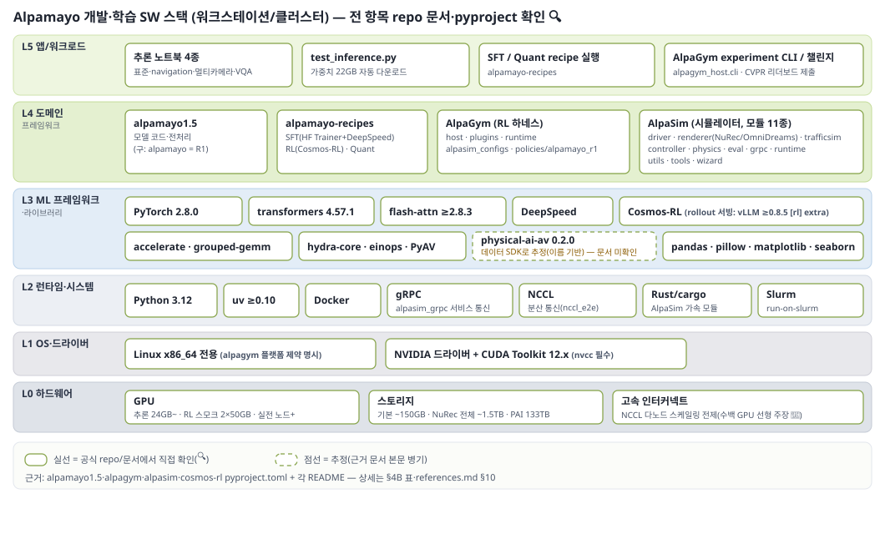
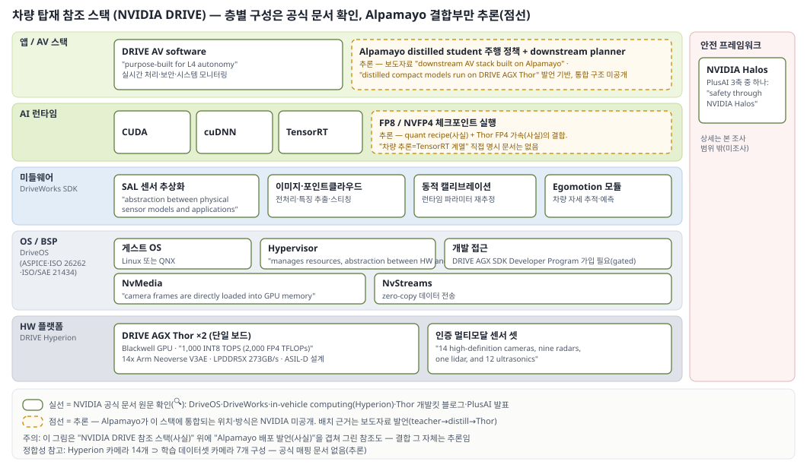

# NVIDIA Alpamayo와 자율주행 패러다임 전환 — 종합 보고서

- 작성일: 2026-07-28 · 조사 기간 2026-07-15 ~ 07-28 · 발췌·검증 이력: [reference/references.md](reference/references.md)
- 검증 등급: ✅ 복수 소스 교차검증 · 🔍 원문 직접 확인 · 📄 원문 발췌 확보 · 🎥 영상 발언만 · ⚠️ 미확인/추정 — **모든 사실 문장 뒤 괄호에 원문 링크 병기**

## 문서 안내 — 읽기 경로

| 독자 | 읽을 구간 | 분량 감각 |
|---|---|---|
| 바쁜 의사결정자 | **PART I** (§1–2) | 4쪽 |
| 흐름·판단 근거까지 | PART I + **PART II** (§3–7) | +15쪽 |
| 실무 재현·기술 검증 | **PART III** (§8–13)까지 전부 | 자료집 |

---
---

# ━━ PART I. 결론과 판단 ━━

## 1. 한눈 요약

**판단 3줄:**

1. **패러다임 전환은 실재하고 가속 중이다. 단 "VLA 단일 승자"가 아니라 "VLA + world model 투트랙"이 업계 공통 패턴이다.** NVIDIA(Alpamayo+Cosmos), Wayve(LINGO+GAIA-2), Li Auto(MindVLA-o1에 latent world model 내장)가 모두 같은 구조이고, Tesla만 언어 추론 없는 pure end-to-end + 자체 world simulator 노선. (🔍 [서베이](https://arxiv.org/html/2512.16760v1) · [GAIA-2](https://wayve.ai/thinking/gaia-2/) · [MindVLA-o1 보도](https://pandaily.com/li-auto-unveils-next-gen-autonomous-driving-foundation-model-mind-vla-o1) — §3)
2. **Alpamayo는 "산업 규모 모델+시뮬레이터+RL 프레임워크+데이터셋+리더보드를 전부 공개한 유일한 생태계"라는 점이 실체이고, 성능 수치는 아직 마케팅과 갭이 있다.** 채택 실체는 모델 채택=Mercedes·PlusAI 2건, 나머지(BYD·Geely·Isuzu·Nissan)는 HW 플랫폼(Hyperion) 채택이며 Nissan은 그 위에서 경쟁사 Wayve 모델을 쓴다. "오픈"의 경계도 명확하다 — 가중치는 공개, **양산용 검증 코드는 비공개(로열티 협상 대상)**. (🔍 [GTC 보도자료](https://nvidianews.nvidia.com/news/drive-hyperion-level-4) · [The Elec](https://www.thelec.net/news/articleView.html?idxno=5760) — §5, §7.4)
3. **지금은 "올라타서 배우는 단계"가 합리적이다.** reasoning 신뢰성(서드파티 실측 충실성 42.5%), 레이턴시(99ms는 reasoning 40토큰 제한 조건), 2 Super 미출시(7/28 확인) 등 미성숙 지점이 명확하므로, 도입 확정이 아니라 체험→자사 시나리오 평가→PoC로 검증 역량을 먼저 쌓는 단계. 차별화는 모델 자체가 아니라 데이터·운영·안전 인증 레이어로 이동 중. (🔍 [faithfulness 논문](https://arxiv.org/html/2605.17268) · [AR1 논문 Table 14](https://arxiv.org/abs/2511.00088) — §7, §2)

**핵심 현황 표 (2026-07-28 기준):**

| 항목 | 상태 | 근거 |
|---|---|---|
| 공개 모델 | Alpamayo 1(10B)·1.5(10B) — 가중치+코드 공개(non-commercial) | 🔍 [1.5 카드](https://huggingface.co/nvidia/Alpamayo-1.5-10B) |
| Alpamayo 2 Super(34B) | **미출시** — "여름 공개" 약속 진행 중 | 🔍 [보도자료 5/31](https://nvidianews.nvidia.com/news/nvidia-alpamayo-2-super-robotaxis) · HF 검색 7/28 |
| 모델 채택 | Mercedes(CLA 양산, L2), PlusAI(트럭, 10B→500M distill) | 🔍 [키노트 자막](https://www.youtube.com/watch?v=kJRVwaYwvt0) · [PlusAI](https://www.plus.ai/news-and-insights/2026-03-16-nvidia-alpamayo) |
| HW 플랫폼 채택 | BYD·Geely·Isuzu·Nissan(Hyperion) + Hyundai/Kia(Hyperion, 모델은 추진 단계) | 🔍 [보도자료 3/16](https://nvidianews.nvidia.com/news/drive-hyperion-level-4) · [WardsAuto](https://www.wardsauto.com/news/hyundai-kia-expanding-partnership-nvidia-drive-hyperion-sdv-adas/814989/) |
| 신뢰성 실측 | 서드파티: CoC 충실성 42.5% — "안전 보증으로 의존 불가" 결론 | 🔍 [arXiv 2605.17268](https://arxiv.org/html/2605.17268) |
| 커뮤니티 | 다운로드 40만+(공식), 서드파티 가속(FlashDrive 4.5×)·2B 파생 활발 | 🔍 [보도자료](https://nvidianews.nvidia.com/news/nvidia-alpamayo-2-super-robotaxis) · [z-lab](https://z-lab.ai/projects/flashdrive/) |

## 2. 시사점과 제안 액션

한 줄 요약: **"채택 여부"가 아니라 "검증 역량 확보"가 지금 단계의 목표 — 그 과정 자체가 전부 공개돼 있어 비용이 낮다.**

### 2.1 우리(SW 선행개발 관점)에게 의미

- **차별화 레이어가 이동한다.** "NVIDIA 스택 위에서는 OEM 차별화가 사라진다"(안드로이드 우려)는 절반만 맞다. 반례: 같은 NVIDIA HW 위에서 Nissan은 Wayve 모델을 쓴다(🔍 [보도자료 3/16](https://nvidianews.nvidia.com/news/drive-hyperion-level-4)) — 모델 레이어가 멀티벤더로 열려 있다. Alpamayo 자체가 fine-tuning·distillation 전제로 공개된 설계라(🔍 [recipes](https://github.com/NVlabs/alpamayo-recipes)), 차별화 후보는 ①지역 롱테일 데이터 ②운영·서비스 ③안전 인증 속도 ④HMI/UX. 진짜 리스크는 차별화 소멸이 아니라 **마진 이동**(플랫폼 수수료·로열티)이다.
- **종속의 실체는 "검증 코드"에 있다.** 가중치는 무료지만 양산 적용 시 NVIDIA validation 소스코드 접근에 로열티 협상이 필요하다는 보도(🔍 [The Elec](https://www.thelec.net/news/articleView.html?idxno=5760)). 오픈 웨이트 → 양산 관문에서 과금하는 구조. 계약 검토 전 이 지점을 파악하는 것이 협상력의 핵심.
- **데이터 플라이휠 방향 주의.** "Hyperion 생태계 참여사들이 수집한 데이터를 활용할 수 있다"(현대 AVP 총괄 발언, 🔍 The Elec) — 반대로 말하면 우리 데이터도 생태계 플라이휠에 기여한다. 데이터 기여·활용 조건이 계약의 2번째 핵심.

### 2.2 제안 액션 3단 (상세 사양: §10)

| 단계 | 내용 | 필요 자원 | 목적 |
|---|---|---|---|
| ① 체험 (즉시 가능) | Alpamayo 1.5 추론 노트북 4종 실행(CoC·navigation·VQA) | GPU 24GB 1장, ~30GB 디스크 | 출력 품질·reasoning 실체 체감 |
| ② 평가 (1~2개월) | AlpaSim으로 자사 관심 시나리오 재현·평가, 공개 챌린지 리더보드 제출로 벤치마크 감각 확보 | GPU 2장(≥40GB), 씬 데이터 ~1.5TB | "우리 기준"으로 성능·한계 실측 |
| ③ PoC (선택) | 자체 데이터 SFT + FP8/NVFP4 양자화 + distill 경로 검증 | 다GPU/노드, recipes | 양산 경로의 기술·계약 리스크 목록화 |

### 2.3 주시 캘린더

| 시점 | 이벤트 | 왜 중요 |
|---|---|---|
| ~2026 여름 | **Alpamayo 2 Super 가중치·코드 공개** 예정 (🔍 [보도자료](https://nvidianews.nvidia.com/news/nvidia-alpamayo-2-super-robotaxis)) | 34B teacher 실체·라이선스 확정 — 본 보고서 §4·§7 갱신 트리거 |
| ~2026 여름 말 | distillation recipe 공개 발언 (🎥 [라이브스트림](https://www.youtube.com/watch?v=kJRVwaYwvt0)) | 차량 배포 경로 완성 여부 |
| 2026 하반기 | MB.DRIVE ASSIST PRO 독일 도심 기능(슈투트가르트·뮌헨) (🔍 [Mercedes](https://group.mercedes-benz.com/innovations/product-innovation/autonomous-driving/mb-drive-assist-pro.html)) | Alpamayo 계열 최초 양산 스택의 실도로 성적 |
| NeurIPS 2026 | AlpaSim 챌린지 시상 (📄 [AlpaGym 블로그](https://developer.nvidia.com/blog/how-to-post-train-autonomous-vehicle-models-in-closed-loop-with-nvidia-alpamayo/)) | 커뮤니티 최고 성능의 공개 검증 |
| 2027 상반기 | Uber 로보택시 LA·SF 개시 (🔍 [보도자료 3/16](https://nvidianews.nvidia.com/news/drive-hyperion-level-4)) | DRIVE AV 풀스택 상용 검증 |

---
---

# ━━ PART II. 분석 본론 ━━

## 3. 왜 지금인가 — 자율주행 SW 패러다임

한 줄 요약: **modular→e2e→VLA 전환의 동력은 "롱테일+설명 가능성"이고, world model은 VLA의 경쟁자가 아니라 짝이다.**

### 3.1 세 패러다임 비교

| 방식 | 구조 | 강점 | 한계 | 근거 |
|---|---|---|---|---|
| Modular (rule 기반 포함) | 인지→예측→계획 모듈 분리 | 검증·책임 분리 용이, 규제 친화 | 모듈 간 오류 누적, 롱테일마다 규칙 추가의 한계 | 🔍 [서베이 2512.16760](https://arxiv.org/html/2512.16760v1) |
| End-to-End (Vision-Action) | 센서→궤적 단일 신경망 | 데이터로 성능 스케일, 파이프라인 단순 | ①블랙박스 ②롱테일 일반화 취약 ③CoT 부재 ④자연어 지시 불가 — 서베이가 명시한 4대 한계 | 🔍 동일 |
| **VLA** | VLM 백본 + 행동 출력 (추론 텍스트 병행) | 상식·인과 추론으로 롱테일 대응 주장, 설명 가능성 | 레이턴시·추론 신뢰성·검증 방법 미성숙 (→§7) | 🔍 동일 |

VLA 내부도 두 갈래(🔍 서베이): **End-to-End VLA**(한 모델이 인지·추론·계획 전부 — Alpamayo가 여기) vs **Dual-System VLA**(VLM은 느린 숙고, 실행은 빠른 플래너로 분리). Alpamayo 2 Super의 meta-action 출력은 downstream planner를 전제한다는 점에서 Dual-System 요소를 흡수하는 방향. (🔍 [보도자료](https://nvidianews.nvidia.com/news/nvidia-alpamayo-2-super-robotaxis))

### 3.2 VLA 말고 다른 흐름 — 실제로는 투트랙

- **World model**: 행동의 결과를 시뮬레이션하는 모델(image/occupancy/latent 3형). 서베이는 VLA와 **직교·상보** 관계로 정리 — VLA는 "추론 투명성", WM은 "결과 예측"을 최적화. (🔍 [서베이](https://arxiv.org/html/2512.16760v1))
- **업계 실황은 "VLA+WM 동시 보유"가 표준 패턴**: NVIDIA(Alpamayo+Cosmos, 🔍 [키노트](https://www.youtube.com/watch?v=kJRVwaYwvt0)) · Wayve(LINGO-2+**GAIA-2** — GAIA-2는 정책이 아니라 합성 데이터 생성·검증용 world model, 🔍 [Wayve](https://wayve.ai/thinking/gaia-2/)) · Li Auto(MindVLA-o1에 **latent world model 내장**, 🔍 [Pandaily](https://pandaily.com/li-auto-unveils-next-gen-autonomous-driving-foundation-model-mind-vla-o1)). AR1 논문도 world model 통합을 future work로 명시. (🔍 [논문 §7](https://arxiv.org/abs/2511.00088))
- **Pure e2e (Tesla)**: FSD V12(2024)부터 언어 추론 없는 단일 신경망, 자체 neural world simulator 병행. (📄 서드파티 종합 — [정리 기사](https://www.allpcb.com/allelectrohub/evolution-of-teslas-driving-autonomy-system), 공식 1차 소스 아님 주의)

### 3.3 "ChatGPT moment" 프레이밍 비평

Jensen 키노트 원문: "The ChatGPT moment for physical AI is nearly here." (🔍 [키노트 자막](https://www.youtube.com/watch?v=kJRVwaYwvt0)) — LLM이 ChatGPT로 하루아침에 실용화됐듯 physical AI도 임계점이라는 주장.

실체와 대조하면: 오픈 생태계·칩 채택 확산·양산 1건(CLA)은 실재 ✅. 그러나 ①모델 채택은 2건뿐(§5) ②플래그십 2S 미출시 ③독립 실측은 "안전 보증 불가" 결론(§7.1) ④양산 CLA도 L4가 아닌 **L2**(🔍 [Mercedes](https://group.mercedes-benz.com/innovations/product-innovation/autonomous-driving/mb-drive-assist-pro.html)). **판정: "moment"는 도래가 아니라 초입 — 인프라는 깔렸고 신뢰성 증거가 아직 임계점 미달.**

## 4. Alpamayo 실체와 버전 진화

한 줄 요약: **1→1.5는 같은 10B 틀의 기능 확장, 1.5→2 Super는 크기·인지·출력·용도·학습이 동시에 바뀌는 세대 교체 — 단 2 Super는 아직 발표 스펙만 존재한다.**

### 4.1 플랫폼에서의 위치 (5-layer cake)

Jensen의 공식 프레임: **car → chips(GPU·Thor) → infrastructure(Omniverse·Cosmos) → model(Alpamayo) → application(Mercedes-Benz)**. (🔍 [CES 키노트 자막](https://www.youtube.com/watch?v=kJRVwaYwvt0)) Alpamayo는 모델 레이어이고, 그 아래(칩·인프라)와 위(양산 앱)를 NVIDIA가 함께 쥔 수직 통합 구조 — §7.4 종속성 논의의 출발점.

### 4.2 버전 타임라인

| 시점 | 이벤트 | 근거 |
|---|---|---|
| 2025-10-30 | arXiv 논문 v1 "Alpamayo-R1" 제출 | 🔍 [arXiv](https://arxiv.org/abs/2511.00088) |
| 2025-12-01 | NeurIPS 2025 — DRIVE Alpamayo-R1 공개("세계 최초 오픈 reasoning VLA for AV" 주장) + AlpaSim | 📄 [NeurIPS 블로그](https://blogs.nvidia.com/blog/neurips-open-source-digital-physical-ai/) |
| 2025-12-03 | HF 가중치 `nvidia/Alpamayo-R1-10B` 릴리스 | 🔍 [R1 카드](https://huggingface.co/nvidia/Alpamayo-R1-10B) |
| 2026-01-05 | **CES 2026: 플랫폼 발표**, R1→"Alpamayo 1" 개명, Physical AI AV Dataset 공개, Mercedes 앱 레이어 발표 | ✅ [CES 보도자료](https://nvidianews.nvidia.com/news/alpamayo-autonomous-vehicle-development) · 🔍 키노트 |
| 2026-03-16 | GTC 2026: **Alpamayo 1.5**를 "interactive, steerable reasoning model"로 소개, Hyperion 채택사 발표 | 🔍 [보도자료 3/16](https://nvidianews.nvidia.com/news/drive-hyperion-level-4) |
| 2026-03-19 | Alpamayo 1.5 HF 릴리스 | 🔍 [1.5 카드](https://huggingface.co/nvidia/Alpamayo-1.5-10B) |
| 2026-05-21 | COMPUTEX 2026 Best Choice Award (Vehicle Tech & Smart Cockpit) | 📄 [GTC 뉴스 블로그](https://blogs.nvidia.com/blog/nvidia-gtc-taipei-computex-2026-news/) |
| 2026-05-31 | **GTC Taipei: Alpamayo 2 Super(34B) 발표** + AlpaGym + OmniDreams | 🔍 [보도자료 5/31](https://nvidianews.nvidia.com/news/nvidia-alpamayo-2-super-robotaxis) |
| 2026-06-01 | AlpaGym 코드 공개(라이브스트림), HF 블로그·how-to 블로그 | 🔍 [HF 블로그 2](https://huggingface.co/blog/drmapavone/nvidia-alpamayo-2) · 🎥 |
| 2026-06 | CVPR 2026 공개 챌린지 2종 개시 | 📄 [AlpaGym 블로그](https://developer.nvidia.com/blog/how-to-post-train-autonomous-vehicle-models-in-closed-loop-with-nvidia-alpamayo/) |
| **2026-07-28 현재** | **2 Super 미출시** (HF에 부재 확인) | 🔍 HF 검색 |

### 4.3 버전 상세 비교표

| 항목 | Alpamayo 1 (=R1) | Alpamayo 1.5 | Alpamayo 2 Super |
|---|---|---|---|
| 파라미터 | 10B = 백본 8.2B + action expert 2.3B (🔍 [R1 카드](https://huggingface.co/nvidia/Alpamayo-R1-10B)) | 10B 동일 구성 (🔍 [1.5 카드](https://huggingface.co/nvidia/Alpamayo-1.5-10B)) | **34B**(🔍 [보도자료](https://nvidianews.nvidia.com/news/nvidia-alpamayo-2-super-robotaxis)) / 백본 32B(🔍 [HF 블로그](https://huggingface.co/blog/drmapavone/nvidia-alpamayo-2)) — §12 검증 로그 |
| 백본 | Cosmos-Reason (🔍 [논문](https://arxiv.org/abs/2511.00088)) | Cosmos-Reason2 (🔍 1.5 카드) | Cosmos 3 Super Reasoner (🔍 HF 블로그) |
| 카메라 | 전방 중심 4개 고정, 10Hz 0.4s (🔍 R1 카드) | 4개 기본+가변 (🔍 1.5 카드) | **360°** 전·측·후방, 개수 미명시(영상 "7+" 🎥) (🔍 HF 블로그) |
| 그 외 입력 | egomotion만, navigation 없음 (🔍 [GitHub](https://github.com/NVlabs/alpamayo)) | +navigation guidance(텍스트)·사용자 질문 (🔍 1.5 카드) | navigation 포함 (✅ [솔루션 페이지](https://www.nvidia.com/en-us/solutions/autonomous-vehicles/alpamayo/)) |
| 출력 | CoC + 6.4s 궤적(64wp@10Hz) (🔍 R1 카드) | +VQA (🔍 1.5 카드) | +**Meta-Action**(yield/lane change/stop)+2D grounding 라벨 (🔍 보도자료) |
| 학습 | CoC SFT→RL(GRPO), **공개 가중치는 RL 미적용** (🔍 GitHub) | **RL post-trained 공개** (🔍 1.5 카드) | +closed-loop RL(AlpaGym) (✅ [alpagym](https://github.com/NVlabs/alpagym)) |
| 학습 데이터 | 80,000h, CoC 700K (🔍 R1 카드) | 80,000h(10억+ 이미지), CoC 3M (🔍 1.5 카드) | 미공개 |
| 벤치마크 | AlpaSim 0.73±0.01, minADE 1.22m (🔍 R1 카드) | AlpaSim **0.81±0.01**, minADE 1.11m, Lingo-Judge 74.2 (🔍 1.5 카드) | 미공개("SOTA" 주장만) |
| 공개·라이선스 | 가중치 non-commercial/코드 Apache 2.0, gated ~22GB (🔍 R1 카드·GitHub) | 동일 구조 (🔍 1.5 카드) | **미출시**·라이선스 미발표 |
| 용도 포지션 | AV 연구용 "Nano" | 연구+실험 확장 "Nano" | **L4 robotaxi teacher "Super"** → distill → DRIVE AGX Thor (🔍 보도자료) |

### 4.4 생태계 지도

| 구성요소 | 역할 | 상태 | 근거 |
|---|---|---|---|
| AlpaSim | closed-loop 시뮬레이터 (NuRec 3DGS 재구성 렌더링 + OmniDreams 생성형) | 공개(Apache 2.0), 공개 씬 ~900개 | 🔍 [alpasim](https://github.com/NVlabs/alpasim) · [논문 §6.1](https://arxiv.org/abs/2511.00088) |
| AlpaGym | closed-loop RL post-training (AlpaSim 환경 + Cosmos-RL 트레이너, GRPO) | 공개, **1.5만 지원** | 🔍 [alpagym](https://github.com/NVlabs/alpagym) |
| alpamayo-recipes | SFT·RL·quantization(FP8/NVFP4) 레시피 | 공개, distill recipe 부재 | 🔍 [recipes](https://github.com/NVlabs/alpamayo-recipes) |
| Physical AI AV Dataset | 1,700h/306,152클립/133TB, 카메라 7·LiDAR 1·radar≤10 | gated, AV 용도 한정 라이선스 | 🔍 [데이터셋 카드](https://huggingface.co/datasets/nvidia/PhysicalAI-Autonomous-Vehicles) |
| OmniDreams | 포토리얼 시나리오 생성 world model | 발표됨 | 📄 [GTC 뉴스](https://blogs.nvidia.com/blog/nvidia-gtc-taipei-computex-2026-news/) |
| 공개 챌린지 | [AlpaSim E2E Closed-Loop](https://huggingface.co/spaces/nvidia/AlpasimE2EClosedLoopChallenge2026) · [AV Reasoning](https://huggingface.co/spaces/nvidia/PhysicalAI-AV-OOD-Reasoning-Challenge-2026) | 진행 중, NeurIPS 2026 시상 | 📄 AlpaGym 블로그 |

## 5. 누가 어떻게 올라탔나 — 채택의 3층 구분

한 줄 요약: **"합류"를 한 덩어리로 보면 오보가 된다 — 모델 채택 / HW 플랫폼 채택 / 풀스택 운영의 3층이 전혀 다른 약속이다.**

| 층 | 회사 | 실체 | 근거 |
|---|---|---|---|
| **① 모델(Alpamayo) 채택** | **Mercedes-Benz** | 5-layer cake의 app 레이어. CLA 양산: 미국 Q1→유럽 Q2→아시아 Q3/4 계획 발언 | 🔍 [CES 키노트 자막](https://www.youtube.com/watch?v=kJRVwaYwvt0) |
| | **PlusAI** (트럭) | 대형 트럭용 적응, 10B teacher→**500M student** distill, Hyperion·Halos 결합 | 🔍 [PlusAI 2026-03-16](https://www.plus.ai/news-and-insights/2026-03-16-nvidia-alpamayo) |
| | Hyundai (추진 단계 ⚠️) | AVP본부가 채택 추진("is moving to adopt") — 확정 아님. 신임 총괄 박민우=전 NVIDIA 부사장, NVIDIA와 정례 미팅 보도 | 🔍 [The Elec 2026-03-13](https://www.thelec.net/news/articleView.html?idxno=5760) |
| **② HW 플랫폼(Hyperion) 채택** | BYD·Geely·Isuzu·Nissan | L4용 컴퓨트+센서 아키텍처 채택 — **모델 채택 아님**. 특히 **Nissan은 "powered by Wayve software"** | 🔍 [보도자료 3/16](https://nvidianews.nvidia.com/news/drive-hyperion-level-4) |
| | Hyundai/Kia | Hyperion 채택 + 2025-10 Blackwell GPU 50,000장 확보 | 🔍 [WardsAuto](https://www.wardsauto.com/news/hyundai-kia-expanding-partnership-nvidia-drive-hyperion-sdv-adas/814989/) · [The Elec](https://www.thelec.net/news/articleView.html?idxno=5760) |
| **③ 풀스택(DRIVE AV) 운영** | Uber | "28개 도시·4대륙, 2028년까지" 로보택시, LA·SF 2027 상반기 개시 | 🔍 [보도자료 3/16](https://nvidianews.nvidia.com/news/drive-hyperion-level-4) |
| 관심 표명 (CES) | Lucid, JLR, Uber, Berkeley DeepDrive | 명단 언급 수준 | 📄 [CES 보도자료](https://nvidianews.nvidia.com/news/alpamayo-autonomous-vehicle-development) |

### 5.1 Mercedes 케이스 — 최초 양산의 실체

- **제품명: MB.DRIVE ASSIST PRO** (Mercedes 제품명 — "엠비"=MB). 신형 CLA의 **SAE Level 2** 도심 point-to-point 지원. 센서 30개(카메라 10·레이더 5·초음파 12 포함). 출시: 중국 2025말→미국 2026→독일 도심 기능 2026말(슈투트가르트·뮌헨). (🔍 [Mercedes 공식](https://group.mercedes-benz.com/innovations/product-innovation/autonomous-driving/mb-drive-assist-pro.html) · [NVIDIA Korea 블로그](https://blogs.nvidia.co.kr/blog/drive-av-software-mercedes-benz-cla/) · [Electrek](https://electrek.co/2026/01/05/nvidia-unveils-open-source-ai-for-autonomous-driving-ships-in-mercedes-benz-cla-in-q1-2026/))
- **이중 스택 안전 구조**: Alpamayo(학습 기반) + 별도 classical AV 스택(6~7년 개발, "fully traceable") + policy/safety evaluator가 상황별로 전환 — "the only car in the world with both of these AV stacks running". (🔍 [키노트 자막](https://www.youtube.com/watch?v=kJRVwaYwvt0)) → §7.1과 직결: NVIDIA 스스로 Alpamayo 단독 신뢰를 전제하지 않음.
- 안전 성적: CLA = Euro NCAP 5성 + **"Best Performer"(2025년 테스트 전 모델 1위**, Adult 94%·Child 89%·VRU 93%·Assist 85%). Jensen의 "world's safest car" 발언은 이 결과에 근거(단 "2025 테스트 차 중" 한정). (🔍 [Mercedes 공식](https://group.mercedes-benz.com/innovations/product-innovation/technology/cla-euro-ncap.html))
- 주의: 양산 CLA는 **L2** — "L4 robotaxi용 34B teacher"(2 Super)와는 별개 트랙. 차량 칩은 dual Orin → 차세대 dual Thor 전환 발언. (🎥 키노트)

### 5.2 커뮤니티·생태계 지표

- 다운로드: 누적 "close to 400,000"(2026-05-31, 자체 집계 🔍 [보도자료](https://nvidianews.nvidia.com/news/nvidia-alpamayo-2-super-robotaxis)) · 3월 시점 "100,000+ automotive developers"(🔍 [보도자료 3/16](https://nvidianews.nvidia.com/news/drive-hyperion-level-4)) · HF 최근 30일(7/15 확인): 1.5-10B 58.2k, R1-10B 20.1k
- 서드파티 파생: z-lab DFlash 가속판, `Alpamayo-R1-2B-step80000`(2B 축소), text-only 변형 등 (🔍 HF 검색 7/28)

## 6. 경쟁 지형

한 줄 요약: **"추론하는 주행 모델"은 이미 여럿 — Alpamayo의 진짜 차별점은 공개 범위(모델+시뮬+RL+데이터+벤치마크)다.**

| 모델 | 개발사 | 공개 | 구조 | 비고 |
|---|---|---|---|---|
| **Alpamayo 1/1.5/2S** | NVIDIA | 가중치+코드+시뮬+데이터 오픈(2S 예정) | Cosmos-Reason 계열+diffusion action expert | "최초 오픈 reasoning VLA" 주장 (📄 [NeurIPS 블로그](https://blogs.nvidia.com/blog/neurips-open-source-digital-physical-ai/)) |
| **EMMA** | Waymo | 비공개(논문만) | Gemini 파인튜닝 | 장시간 영상·LiDAR 미활용 한계 자인 (🔍 [Waymo](https://waymo.com/blog/2024/10/introducing-emma)) |
| **LINGO-2** | Wayve | 비공개 | 비전+자기회귀 언어(VLAM) | "최초 closed-loop 공도 VLAM" 주장, GAIA-2(WM)와 투트랙 (🔍 [Wayve](https://wayve.ai/thinking/lingo-2-driving-with-language/)) |
| **MindVLA-o1** | Li Auto | 비공개(양산 지향) | **native 3D ViT + 카메라+LiDAR + latent world model 내장**, closed-loop RL, HW-SW 공동설계 — GTC 2026(3/17) 발표 | VLA+WM 하이브리드 실례, 로보틱스 확장 선언 (🔍 [Pandaily](https://pandaily.com/li-auto-unveils-next-gen-autonomous-driving-foundation-model-mind-vla-o1)) |
| **OpenEMMA** | 학술(TAMU 주도) | Apache-2.0 | GPT-4o/LLaVA 등 위 EMMA 재현 | (🔍 [GitHub](https://github.com/taco-group/OpenEMMA)) |
| **OpenDriveVLA** | 학술(AAAI 2026) | Apache-2.0, 0.5B | 오픈 LLM+2D/3D 표현 | 소규모 (🔍 [GitHub](https://github.com/DriveVLA/OpenDriveVLA)) |
| **AutoVLA** | 학술 | 논문 | adaptive reasoning+RL | fast/slow thinking (📄 [arXiv 2506.13757](https://arxiv.org/abs/2506.13757)) |

구도 3가지:
1. **폐쇄 진영**(Waymo·Wayve·Li Auto): 자사 서비스/양산용, 방법만 공개. MindVLA-o1은 LiDAR 포함 — 카메라-only인 Alpamayo와 센서 철학이 갈림.
2. **오픈 학술**: 재현 가능하나 0.5B~7B급, 데이터·시뮬은 기존 공개물 의존.
3. **같은 칩 위 모델 경쟁**: Nissan(NVIDIA Hyperion+Wayve SW) 사례 — 플랫폼(칩) 지배와 모델 지배는 별개로 진행 중. Alpamayo는 "오픈 웨이트"(non-commercial)이지 오픈소스가 아니라는 점도 경쟁 계약상 변수. (🔍 [R1 카드](https://huggingface.co/nvidia/Alpamayo-R1-10B) · [보도자료 3/16](https://nvidianews.nvidia.com/news/drive-hyperion-level-4))

## 7. 약점과 리스크 ★

한 줄 요약: **NVIDIA 자신도(이중 스택·논문 한계 절·Pavone 공저 비판 연구) Alpamayo 단독 신뢰를 전제하지 않는다 — 우리도 그래야 한다.**

각 항목: 주장 → 증거 → 판정.

### 7.1 Reasoning(CoC) 신뢰성 — 최대 리스크

- **주장**: CoC가 판단 근거를 설명하고 안전 문서화·규제 대응에 쓰인다. (📄 [The Decoder](https://the-decoder.com/nvidia-bets-big-on-physical-ai-at-gtc-taipei-with-a-new-world-model-driving-brain-and-open-humanoid-robot/))
- **반대 증거 (서드파티 실측)**: Alpamayo-R1-10B 반사실 교란 실험 — **reasoning 충실성 42.5%**, "정지 선언 후 미정지" 37.9%, 보행자 미탐 33.3%, 설명 동일한데 행동만 바뀌는 silent failure 14.3%. 결론 원문: "CoC 추론을 현재 VLA의 안전 보증으로 의존할 수 없다". (🔍 [arXiv 2605.17268](https://arxiv.org/html/2605.17268), CVPR 2026 DriveX)
- **내부 인정**: ①논문 스스로 SFT 4대 한계 명시 — "장면에 없는 인과 요인을 환각할 수 있다"(Fig 10), reasoning-행동 불일치(Fig 11) ②**reasoning 보상만 최적화하면 궤적·일관성 오히려 악화**(ADE 2.12→2.19m, consistency 0.62→0.53) — "유창하지만 인과적으로 단절된 설명" 원문 (🔍 [논문 §5.2·Table 9](https://arxiv.org/abs/2511.00088)) ③**Pavone(개발 총괄) 공저 후속 연구**가 functional(성능 도움)≠faithful(실제 판단 반영)을 공식화하고 자체 기법이 "Alpamayo 대비 causal alignment 1.6×"라고 보고 (🔍 [arXiv 2607.04681](https://arxiv.org/html/2607.04681v1), Stanford+NVIDIA)
- **NVIDIA의 실전 헤지**: Mercedes 양산에서 Alpamayo 위에 별도 classical 스택+safety evaluator를 병행(이중 스택) — 단독 신뢰하지 않는 구조를 스스로 채택. (🔍 [키노트](https://www.youtube.com/watch?v=kJRVwaYwvt0))
- **판정: CoC는 현재 "성능을 올리는 보조 신호 + 사후 해석 참고"까지. 안전 근거·규제 증빙으로 쓰기엔 증거 부족.** 후속 흐름(Neuro-Symbolic Drive 등 faithful reasoning 연구, 📄 [arXiv 2606.23938](https://arxiv.org/pdf/2606.23938)) 주시.

### 7.2 롱테일 — 개선은 실재, "해결"은 아님

- **주장**: "롱테일은 평범한 상황들로 분해되고, 추론으로 풀면 된다." (🔍 [키노트 자막](https://www.youtube.com/watch?v=kJRVwaYwvt0))
- **증거**: CoC 학습 시 챌린지셋 minADE 12% 개선 — 단 **0.5B 모델 실험**(Table 7). closed-loop close encounter 17%→11%(-35%) — 단 **off-road는 3%→4%로 소폭 증가**(Table 8, "comparable"로 서술). 공개 10B은 0.5B 대비 AlpaSim Score 0.35→0.72(Table 10). (🔍 [논문 본문](https://arxiv.org/abs/2511.00088) 직접 열람) ※ NVIDIA Research 페이지의 "off-road -35%" 표기는 본문과 불일치 — 오기로 판정(§12).
- **판정: reasoning이 챌린지 시나리오 성능을 올리는 건 논문 수치로 지지됨. 그러나 "close encounter 11%"는 여전히 9개 중 1개 시나리오에서 사고 근접 — 롱테일 "해결" 주장과는 거리.**

### 7.3 레이턴시 — 99ms는 조건부

- **주장**: 실차 99ms 실시간. (🔍 [논문](https://arxiv.org/abs/2511.00088))
- **조건 (Table 14, RTX 6000 Pro Blackwell)**: vision 3.4 + prefill 16.5 + **reasoning 70ms(40토큰 제한)** + 궤적(flow matching 5 steps) 8.75 = 99ms. reasoning이 지연의 70%. 궤적만이면 29ms, 자동회귀 궤적이면 312ms. (🔍 논문 본문)
- **실측 갭**: z-lab(FlashDrive)은 기본 구성 Alpamayo 1.5를 **716ms**로 실측, 최적화로 159ms(4.5×) 달성 — 스트리밍 추론+DFlash 투기 디코딩+W4A8 양자화. (🔍 [z-lab](https://z-lab.ai/projects/flashdrive/) · [DFlash arXiv 2602.06036](https://arxiv.org/abs/2602.06036), ICML 2026)
- 매 프레임 reasoning 생성은 미해결 — "reasoning on demand"는 논문 future work. (🔍 논문 §7) 관련 최적화 연구 등장 중. (📄 [arXiv 2605.08975](https://arxiv.org/pdf/2605.08975))
- **판정: "실시간 reasoning"은 40토큰 templated trace + 최적 구성 전제. 기본 배포는 초당 1~2회 수준 — 배포 설계에서 reasoning 주기·트리거 결정이 필수.**

### 7.4 종속성·라이선스 — OEM 관점 최대 쟁점

| 층 | 잠금 지점 | 근거 |
|---|---|---|
| 모델 | 가중치 non-commercial — 상업은 NVIDIA 협상 | 🔍 [R1 카드](https://huggingface.co/nvidia/Alpamayo-R1-10B) |
| **양산 관문** | **validation 소스코드 비공개 — 양산 적용 시 로열티 협상 필요** 보도 | 🔍 [The Elec](https://www.thelec.net/news/articleView.html?idxno=5760) |
| 데이터 | 데이터셋 AV-only·파생 재배포 금지 / "Hyperion 생태계 데이터 공유" 플라이휠은 NVIDIA 중심 | 🔍 [데이터셋 카드](https://huggingface.co/datasets/nvidia/PhysicalAI-Autonomous-Vehicles) · The Elec |
| 도구 | RL 스택 세대교체를 NVIDIA가 결정(Cosmos-RL → "Cosmos 3 이동 권장") | 🔍 [cosmos-rl](https://github.com/nvidia-cosmos/cosmos-rl) |
| 평가 | AlpaSim Score·공개 챌린지가 사실상 표준화 — 평가 기준도 NVIDIA 소유 | 📄 [AlpaGym 블로그](https://developer.nvidia.com/blog/how-to-post-train-autonomous-vehicle-models-in-closed-loop-with-nvidia-alpamayo/) |
| 운영 | "We're going to deploy... operate... maintain the stack" — 운영까지 수직 통합(Mercedes 케이스) | 🔍 [키노트](https://www.youtube.com/watch?v=kJRVwaYwvt0) |

- "아이폰(Tesla) vs 안드로이드(NVIDIA+OEM)" 비유의 보정: 안드로이드에서 제조사 차별화는 살아남았지만 **이익은 플랫폼에 집중**됐다 — 공포의 정체는 차별화 소멸이 아니라 마진 이동. 그리고 Nissan-Wayve 사례처럼 모델 레이어는 멀티벤더로 열려 있어 순수 안드로이드보다 느슨한 시장. (🔍 [보도자료 3/16](https://nvidianews.nvidia.com/news/drive-hyperion-level-4)) 키노트도 "some companies work with us full stack, some partial" 명시. (🔍 자막)
- **판정: 기술 종속보다 "양산 관문 과금 + 데이터 플라이휠 방향"이 실질 리스크. 계약 협상 전 validation 코드 접근 조건·데이터 기여 조건을 파악하는 것이 우선.**

### 7.5 증류(distillation) 검증 — 미해결 질문

- 공식 recipe 미출시(목록에 없음 🔍 [recipes](https://github.com/NVlabs/alpamayo-recipes), "여름 말" 발언 🎥). 실물: PlusAI 10B→500M(🔍 [PlusAI](https://www.plus.ai/news-and-insights/2026-03-16-nvidia-alpamayo)), 커뮤니티 2B 체크포인트.
- **미해결**: ①student에 reasoning이 남는가, 궤적만 남는가 — CoC가 안전 논거라면 증류 후 그 논거가 사라지는 역설 ②teacher-student 행동 편차의 인증 방법 ③사고 시 책임 소재(모델 제공자 vs OEM vs 운영자) — CoC를 규제 증빙으로 쓰는 순간 "설명이 틀렸을 때"의 책임 문제가 생김(7.1과 연결).
- **판정: 차량 배포 경로의 마지막 퍼즐이 공개 안 됨 — 2 Super·distill recipe 공개 시 최우선 검증 항목.**

---
---

# ━━ PART III. 기술 상세 ━━

## 8. 모델 해부 (논문 기준)

한 줄 요약: **Cosmos-Reason VLM이 "왜"를 쓰고, 2.3B diffusion action expert가 "어떻게"를 그린다 — 셋을 잇는 접착제가 3단계 학습이다.**

> 출처: [arXiv 2511.00088v2 Figure 1](https://arxiv.org/html/2511.00088v2)

- **구성**: 멀티카메라+egomotion → vision encoder(단일 이미지 토큰화 기본, triplane/Flex 압축 대안 — 토큰 3.6~20× 절감 실험) → **Cosmos-Reason 백본**(8.2B) → CoC reasoning 텍스트 + 이산 궤적 토큰 → **action expert**(2.3B, 백본과 동일 Transformer 구조·작은 임베딩)가 conditional flow matching으로 연속 궤적 복원(추론 시 Euler 적분 5 steps). (🔍 [논문 §5.1·§6.6·§6.7](https://arxiv.org/abs/2511.00088) 본문 열람)
- **flow matching 선택 근거(Table 12)**: 자동회귀 궤적 대비 minADE 0.681→0.644, AlpaSim(at-fault) 0.59→1.27, Comfort 44%→97%, 속도 1.16× — 정확도·승차감·속도 모두 우위. (🔍 논문)
- **CoC 데이터**: "결정 근거(decision-grounded)·인과 연결" 구조화 라벨 — hybrid auto-labeling+human-in-the-loop. 1: 700K → 1.5: 3M. (🔍 [논문](https://arxiv.org/abs/2511.00088) · [1.5 카드](https://huggingface.co/nvidia/Alpamayo-1.5-10B))

> 출처: [arXiv 2511.00088v2 Figure 5](https://arxiv.org/html/2511.00088v2)

- **3단계 학습**: Stage 1 Action Modality Injection(궤적 토큰+flow matching expert 주입) → Stage 2 SFT(CoC로 reasoning 유도 — 단 4대 한계 자인: 라벨 노이즈·일반화 한계·시각 근거 약함(환각)·추론-행동 불일치) → Stage 3 GRPO RL. (🔍 논문 §5)

> 출처: [arXiv 2511.00088v2 Figure 6](https://arxiv.org/html/2511.00088v2)

- **RL 보상 3종**: ①reasoning 품질 — DeepSeek-R1·Cosmos-Reason 같은 대형 추론 모델(LRM)을 심판으로 0~5점 루브릭 채점 ②CoC-행동 일관성 — 궤적을 meta-action으로 변환해 reasoning 서술과 rule 매칭(이진 보상) ③궤적 품질 — L2+충돌 페널티+jerk. **reasoning 보상 단독은 역효과**(Table 9) — 셋의 조합이 필수. (🔍 논문 §5.3)
- **성능 요약(본문 표 직접 확인)**: Table 8 — close encounter 17→11%(-35%), off-road 3→4%(악화). Table 9 — RL로 reasoning 3.1→4.5(+45%), consistency 0.62→0.85(+37%), ADE 2.12→1.94m. Table 10(공개 벤치) — 10B: minADE 0.849/close encounter 4%/off-road 16%/AlpaSim 0.72 (0.5B 대비 전 지표 우위). Table 14 — 99ms 분해(§7.3). (🔍 논문)
- **백본 ablation**: 범용 VLM(DINOv2+Qwen2.5 0.5B/Qwen2.5-VL 3B·7B) 스케일링 실험 후 **Cosmos-Reason 채택** — Physical AI 사전학습 효과로 LingoQA zero-shot 66.2(GPT-4V 59.6, Qwen2.5-VL-7B 62.2 대비). 데이터 스케일링: 100k→2M 세그먼트로 +14%. (🔍 논문 §6.5)
- 학습·평가 데이터는 미국·EU 수집 내부 데이터(80,000h) — 공개 데이터셋(1,700h)은 그 부분집합 성격. (🔍 논문 §6.1 · [데이터셋 카드](https://huggingface.co/datasets/nvidia/PhysicalAI-Autonomous-Vehicles))

## 9. SW 스택 계층

한 줄 요약: **개발 스택은 전부 공개 repo로 확인 가능, 차량 스택은 NVIDIA DRIVE 참조 구조까지가 사실 — Alpamayo가 꽂히는 위치는 아직 미공개.**

> 두 그림 모두 자체 제작(근거: 각 repo pyproject.toml·README + DriveOS/DriveWorks/Hyperion 공식 문서 — 실선=원문 확인, 점선=추론). 층별 상세 표는 [alpamayo_sw_hw_요구사항.md §4B](alpamayo_sw_hw_요구사항.md) 참조.

핵심만:
- **개발 스택**: Linux x86_64 + CUDA 12.x + Python 3.12 + uv 위에 PyTorch 2.8.0·transformers 4.57.1·flash-attn ≥2.8.3, SFT는 HF Trainer+DeepSpeed, RL은 Cosmos-RL(+vLLM rollout)·GRPO, 시뮬은 AlpaSim gRPC 마이크로서비스(11모듈, Rust 가속). 주목: alpagym이 xformers를 의도적 비활성(의존성 충돌 회피 — 스택 결합 민감 신호). (🔍 각 [pyproject](https://raw.githubusercontent.com/NVlabs/alpagym/main/pyproject.toml))
- **차량 참조 스택**: DRIVE Hyperion(2×Thor+센서 14캠·9레이더·1라이다·12초음파) → DriveOS(hypervisor·NvMedia·NvStreams·CUDA/cuDNN/TensorRT, ASPICE·ISO 26262·ISO 21434) → DriveWorks(SAL·캘리브레이션·egomotion) → DRIVE AV(L4). (🔍 [in-vehicle computing](https://www.nvidia.com/en-us/solutions/autonomous-vehicles/in-vehicle-computing/) · [DriveOS](https://developer.nvidia.com/drive/os) · [DriveWorks](https://developer.nvidia.com/drive/driveworks)) Alpamayo distilled 모델의 통합 위치는 보도자료 발언(teacher→distill→Thor)에서 유추한 추론.

## 10. 목적별 SW/HW 요구사항 (요약)

풀 버전: [alpamayo_sw_hw_요구사항.md](alpamayo_sw_hw_요구사항.md) — 아래는 핵심 표.

| 목적 | 최소 HW | 핵심 SW | 근거 |
|---|---|---|---|
| ① 추론 체험 | GPU **24GB** 1장(16샘플 40GB·+CFG 60GB), 디스크 ~30GB | uv·CUDA 12.x·Python 3.12, HF gated 승인 2건 | 🔍 [1.5 repo](https://github.com/NVlabs/alpamayo1.5) |
| ② 파인튜닝(SFT) | 다GPU(수치는 recipe별 README 확인 ⚠️) | recipes(HF Trainer+DeepSpeed) | 🔍 [recipes](https://github.com/NVlabs/alpamayo-recipes) |
| ③ closed-loop RL | GPU 2장(2×50GB 테스트), NuRec 씬 ~1.5TB | AlpaGym=AlpaSim+Cosmos-RL(GRPO) | 🔍 [alpagym](https://github.com/NVlabs/alpagym) · 📄 [블로그](https://developer.nvidia.com/blog/how-to-post-train-autonomous-vehicle-models-in-closed-loop-with-nvidia-alpamayo/) |
| ④ 차량 배포 | DRIVE AGX Thor(1,000 INT8/2,000 FP4 TFLOPS, ASIL-D) | quant recipe(FP8/NVFP4) 有·distill recipe 無 | 🔍 [Thor 블로그](https://developer.nvidia.com/blog/accelerate-autonomous-vehicle-development-with-the-nvidia-drive-agx-thor-developer-kit/) |

공통 관문: HF gated 2건(모델·데이터셋) + 코드 Apache 2.0/가중치 non-commercial/데이터셋 AV-only 라이선스 구조.

## 11. 배경 개념 사다리 (AI 초보용)

풀 버전: [alpamayo_1_vs_2_비교보고서.md §8B](alpamayo_1_vs_2_비교보고서.md). 최소 셋: **CoT**([arXiv 2201.11903](https://arxiv.org/abs/2201.11903) — CoC의 원형) → **VLA**([RT-2, arXiv 2307.15818](https://arxiv.org/abs/2307.15818) — 용어 정착) → **E2E 주행**([UniAD, arXiv 2212.10156](https://arxiv.org/abs/2212.10156)) → **Diffusion**([DDPM, arXiv 2006.11239](https://arxiv.org/abs/2006.11239) — action expert) → **GRPO**([DeepSeekMath, arXiv 2402.03300](https://arxiv.org/abs/2402.03300)) → **Distillation**([arXiv 1503.02531](https://arxiv.org/abs/1503.02531)) → **Cosmos**(🔍 [WFM 2501.03575](https://arxiv.org/abs/2501.03575) · [Reason1 2503.15558](https://arxiv.org/abs/2503.15558)). 서베이 2편: [2506.24044](https://arxiv.org/html/2506.24044v1) · [2512.16760](https://arxiv.org/html/2512.16760v1). 가장 쉬운 공식 입문은 [Pavone HF 블로그 2편](https://huggingface.co/blog/drmapavone/nvidia-alpamayo).

## 12. 검증 로그 (미확인·판정 이력)

| 항목 | 판정 | 근거 |
|---|---|---|
| 2 Super 파라미터 34B vs 32B | 보도자료=전체 34B, 그 외=백본 32B. "백본 32B+expert≈34B"는 계산상 정합하나 공식 명시 없음 — **병기** | 🔍 [보도자료](https://nvidianews.nvidia.com/news/nvidia-alpamayo-2-super-robotaxis) vs [HF 블로그](https://huggingface.co/blog/drmapavone/nvidia-alpamayo-2) |
| NVIDIA Research 페이지 "off-road -35%, close encounter -25%" | 논문 본문(Table 8: close encounter -35%, off-road는 증가)과 불일치 — **오기 판정** | 🔍 [논문 본문](https://arxiv.org/abs/2511.00088) vs [Research 페이지](https://research.nvidia.com/labs/avg/publication/wang.luo.etal.arxiv2025/) |
| Jensen "world's safest car" | Euro NCAP 2025 Best Performer 사실에 근거 — **과장 아님, "2025 테스트 차 중" 한정** | 🔍 [Mercedes 공식](https://group.mercedes-benz.com/innovations/product-innovation/technology/cla-euro-ncap.html) |
| "벤츠·현대·BYD·지리·닛산 Alpamayo 합류" | **부정확** — 벤츠만 모델 채택, BYD·지리·이스즈·닛산은 Hyperion(HW), 닛산 SW는 Wayve, 현대는 추진 단계 | 🔍 §5 |
| "엠비 드라이브 어시스트 프로" | = **MB.DRIVE ASSIST PRO** (Mercedes 제품, L2) — NVIDIA 제품명 아님 | 🔍 [Mercedes](https://group.mercedes-benz.com/innovations/product-innovation/autonomous-driving/mb-drive-assist-pro.html) |
| "MindVLA-o1" | 실존 — Li Auto, GTC 2026(3/17) 발표 | 🔍 [Pandaily](https://pandaily.com/li-auto-unveils-next-gen-autonomous-driving-foundation-model-mind-vla-o1) |
| "LingoQA 1위"(1.5) | 영상 발언만 — 문서는 Lingo-Judge 74.2 점수뿐, 리더보드 미확인 | 🎥 · 🔍 [1.5 카드](https://huggingface.co/nvidia/Alpamayo-1.5-10B) |
| "7+ 카메라"(2S) | 영상 발언 + 데이터셋 7카메라 구성과 정합 — 모델 입력 스펙 문서는 미공개 | 🎥 · 🔍 [데이터셋 카드](https://huggingface.co/datasets/nvidia/PhysicalAI-Autonomous-Vehicles) |
| faithfulness 논문의 "Qwen3-VL-8B 백본" 기술 | NVIDIA 원논문(Cosmos-Reason 백본)과 불일치 — 해당 논문 측 부정확 추정 | 🔍 [2605.17268](https://arxiv.org/html/2605.17268) vs [원논문](https://arxiv.org/abs/2511.00088) |
| z-lab = UCSD | 인물 겹침(Zhijian Liu=AR1 core contributor 겸 z-lab)으로 정황 강함 — 소속 문서 미확인, **추정 표기** | 🔍 논문 저자란 · [z-lab](https://z-lab.ai/projects/dflash/) |
| Mercedes 출시 일정(Q1 미국~) 실제 진행 | 중국 2025말 출시 확인, 미국 2026 예정 — 분기별 실적은 추후 확인 | 🔍 [Mercedes](https://group.mercedes-benz.com/innovations/product-innovation/autonomous-driving/mb-drive-assist-pro.html) |
| Tesla 노선 상세 | 서드파티 종합만 — 공식 1차 소스 부재 표기 | 📄 §3.2 |

## 13. 레퍼런스

본 보고서 인용 전수는 각 문장 옆 링크로 병기. 발췌·검증 이력 전체: **[reference/references.md](reference/references.md)** (§1~13, 소스 40여 건 원문 인용 포함) · 원시 수집: [deep_research_claims_raw.json](reference/deep_research_claims_raw.json) · 영상 자막 2종: `reference/youtube_Alpamayo 2 Super`(기술 라이브스트림) · `reference/youtube_alpamayo_summut_2026.txt.txt`(CES 2026 키노트)

주요 1차 소스 (재인용 빈도순): [AR1 논문](https://arxiv.org/abs/2511.00088) · [2 Super 보도자료](https://nvidianews.nvidia.com/news/nvidia-alpamayo-2-super-robotaxis) · [Hyperion 보도자료](https://nvidianews.nvidia.com/news/drive-hyperion-level-4) · [CES 보도자료](https://nvidianews.nvidia.com/news/alpamayo-autonomous-vehicle-development) · [1.5 모델카드](https://huggingface.co/nvidia/Alpamayo-1.5-10B) · [R1 모델카드](https://huggingface.co/nvidia/Alpamayo-R1-10B) · [Pavone HF 블로그](https://huggingface.co/blog/drmapavone/nvidia-alpamayo-2) · GitHub([alpamayo](https://github.com/NVlabs/alpamayo)·[alpamayo1.5](https://github.com/NVlabs/alpamayo1.5)·[alpasim](https://github.com/NVlabs/alpasim)·[alpagym](https://github.com/NVlabs/alpagym)·[recipes](https://github.com/NVlabs/alpamayo-recipes)) · 비판 연구([2605.17268](https://arxiv.org/html/2605.17268)·[2607.04681](https://arxiv.org/html/2607.04681v1)) · [The Elec](https://www.thelec.net/news/articleView.html?idxno=5760) · [PlusAI](https://www.plus.ai/news-and-insights/2026-03-16-nvidia-alpamayo) · [Mercedes MB.DRIVE](https://group.mercedes-benz.com/innovations/product-innovation/autonomous-driving/mb-drive-assist-pro.html)

---

*자매 문서(상세 원본): [alpamayo_1_vs_2_비교보고서.md](alpamayo_1_vs_2_비교보고서.md) · [alpamayo_sw_hw_요구사항.md](alpamayo_sw_hw_요구사항.md) — 본 보고서가 상위 통합본.*
