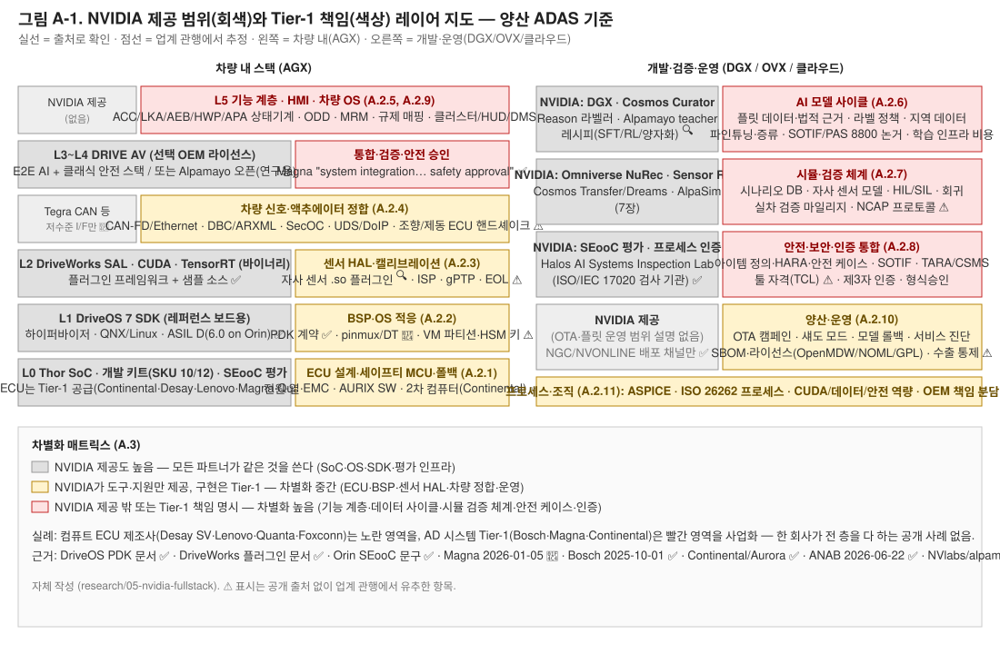

# 부록 A. Tier-1 관점 — NVIDIA가 주는 것 밖에서 양산 ADAS를 위해 해야 할 일

> **작성일**: 2026-09-02 · **관점**: NVIDIA DRIVE 스택·라이브러리·도구를 받은 Tier-1(또는 OEM 자체 개발 조직)이 양산 ADAS/AD 제품을 출시하기까지 **추가로 만들어야 하는 것**
> **입력 문서**: [3장 자율주행 스택](03-autonomous-driving-stack.md) · [7장 Physical AI/Cosmos](07-physical-ai-cosmos.md) · 출처 목록 [reference/references.md](reference/references.md)
> **검증 등급**: ✅ 두 출처 교차검증 · 🔍 1차 출처(GitHub 등) 원문 확인 · 📄 검색 요약·2차 출처만 · ⚠️ 미확인/추정(업계 관행에서 유추)
> **조사 제약**: 이 세션은 nvidia.com·언론사 원문에 직접 접근할 수 없어, NVIDIA 문서의 인용은 검색 엔진 요약(📄)에 의존한다. NVIDIA 문서 URL은 원문 재확인용으로 남긴다.

---

## A.0 한눈 요약

**핵심 결론**: NVIDIA는 "칩 + 레퍼런스 보드 + OS/SDK + (선택 OEM에 한해) 라이선스된 AV 스택 + 안전 평가 인프라"를 준다. 그 위에서 양산 제품을 만들려면 Tier-1은 Android 시절과 구조적으로 같은 일, 즉 **보드 브링업(BSP), 센서 HAL, 차량 신호 정합, 기능 계층, HMI, 아이템 수준 안전 케이스·형식승인**을 해야 하며, 여기에 AI 시대 고유의 일인 **데이터 사이클(수집·라벨·학습·검증)과 AI 안전 논거**가 추가된다.

근거가 되는 세 가지 사실:

1. **커스텀 보드는 PDK 계약이 필요하다.** NVIDIA DriveOS 문서는 "PDK(Platform Development Kit)는 비(非)레퍼런스 DRIVE AGX 하드웨어에서 DriveOS를 돌리도록 수정하는 데 쓰이며, NVIDIA와의 별도 계약이 필요하다"고 명시한다 ([DriveOS 6.0.6 Getting Started](https://developer.nvidia.com/docs/drive/drive-os/6.0.6/public/drive-os-linux-sdk/common/topics/intro_sdk/GettingStarted1.html)) ✅. 즉 NVIDIA는 파트너 보드용 BSP[^bsp]를 만들어 주지 않는다.
2. **NVIDIA 부품은 SEooC로 평가된다.** DRIVE Orin SoC는 "SEooC[^seooc]로서 ISO 26262 ASIL D 체계적 요구사항·ASIL B 랜덤 결함 요구사항을 충족하는 것으로 평가"됐다 ([NVIDIA 블로그](https://blogs.nvidia.com/blog/nvidia-drive-safety-milestones), [Open Robotics 포럼 인용](https://discourse.openrobotics.org/t/drive-orin-achieves-safety-certification-for-iso26262/31027)) ✅. SEooC의 정의상 통합자가 "사용 가정"을 검증하고 아이템 수준 안전 케이스[^safetycase]를 만들어야 한다.
3. **Tier-1들이 실제로 파는 것이 그 공백을 보여준다.** Magna는 DRIVE AGX Thor 위 DRIVE AV 스택에 대해 "시스템 통합, 검증, 밸리데이션, **안전 승인**, 배포" 서비스를 판다고 발표했고(2026-01-05, [Magna](https://www.magna.com/stories/news-press-release/2026/magna-to-offer-drive-hyperion-compatible-ecus-and-tier-1-integration-services-for-nvidia-drive-av)) 📄, Bosch는 "안전 전문성과 고성능 ECU·ADAS 시스템 노하우로 양산 준비 배포"를 담당한다고 밝혔다(2025-10-01, [Bosch](https://us.bosch-press.com/pressportal/us/en/press-release-28736.html)) ✅.

오픈 모델 쪽 경계도 명확하다. Alpamayo 1 GitHub README는 "완전한 주행 스택이 아니며 … 자동차 등급 검증을 거치지 않았고 … 인증된 AV 스택의 대체물이 아니다"라고 쓴다 ([NVlabs/alpamayo](https://github.com/NVlabs/alpamayo)) 🔍.

---

## A.1 프레임: Android 대입표

Android 양산(AAOS[^aaos] 포함) 경험을 NVIDIA DRIVE에 대입하면 아래와 같다. "NVIDIA가 주는 것" 열은 출처가 있는 범위만 적고, "Tier-1이 해야 할 일"은 A.2에서 근거를 단다.

| Android 계층 | Google이 주는 것 | 양산 시 우리가 했던 일 | NVIDIA 대응 계층 | NVIDIA가 주는 것 | Tier-1이 해야 할 일 |
|---|---|---|---|---|---|
| Linux 커널·BSP | AOSP 커널, 레퍼런스 보드 지원 | 자사 보드 BSP·드라이버 | DriveOS 7 (부트로더·Type-1 하이퍼바이저[^hypervisor]·QNX/Linux 게스트 VM) ([DriveOS 7.0.3 소개](https://developer.nvidia.com/docs/drive/drive-os/7.0.3/public/drive-os-linux-sdk/introduction/introduction.html)) 📄 | 레퍼런스 보드(Thor 개발 키트 SKU 10/12)용 SDK; 커스텀 보드는 PDK 계약 | ECU 보드 설계·브링업(pinmux·디바이스 트리), 전원·세이프티 MCU[^smcu] 연동, 세큐어부트 키 |
| HAL[^hal] | HAL 인터페이스 정의 + 레퍼런스 구현 | 벤더 HAL 구현 | DriveWorks SAL[^sal] (센서 추상화) | SAL 프레임워크와 플러그인 SDK(라이다·레이더·GPS·IMU·CAN) ([DriveWorks 센서 플러그인](https://docs.nvidia.com/drive/driveworks-3.5/sensorplugins_mainsection.html)) ✅ | 자사·협력사 센서용 `.so` 플러그인, ISP[^isp] 튜닝, 캘리브레이션, 시각 동기 |
| Framework(AOSP) | 프레임워크 소스 | 확장 스택·커스터마이즈 | CUDA/TensorRT/NvMedia + DriveWorks 라이브러리(바이너리) | 표준 API(NvMedia·CUDA·TensorRT) 📄, DriveWorks는 "샘플은 소스+바이너리, 라이브러리·툴은 바이너리" 📄 | 미들웨어 선택·스케줄링·메모리/VM 파티션 설계, 결정론적 실행 보장 |
| GMS/Play 번들 | 비공개 앱·서비스 (라이선스) | 라이선스 계약·통합 | DRIVE AV 상용 스택(AI E2E + 클래식 안전 스택) / Alpamayo 오픈 가중치 | 선택 OEM에 라이선스(Mercedes CLA 첫 양산) ✅; Alpamayo는 연구용 오픈 모델 🔍 | 기능 계층(ACC·LKA·AEB·HWP 등) 구현·튜닝, 또는 DRIVE AV 위 통합·검증 |
| VHAL[^vhal] (AAOS) | 인터페이스만 | 차량 신호 매핑 | (해당 없음 — DriveOS는 Tegra CAN 등 저수준 인터페이스만 문서화) 📄 | — | CAN-FD/Ethernet 신호 정합, DBC/ARXML[^arxml], 액추에이터 ECU 연동 |
| HMI 앱 | 샘플 앱 | 양산 HMI | (해당 없음; DRIVE IX는 별도 코크핏 제품) | — | 클러스터/HUD/DMS 연계 ADAS HMI |
| CTS/VTS[^cts] | 호환성 테스트 스위트 | 인증 통과 | Halos AI Systems Inspection Lab + 부품 SEooC 평가 | ISO/IEC 17020 인정 검사 기관(2026-06-22 ANAB) ✅; DriveOS 6.0 ASIL D(Orin) ✅ | 아이템 수준 안전 케이스, 제3자 인증, 형식승인 |

**Android와 결정적으로 다른 점 3가지**

- **소스 공개 범위**: AOSP는 프레임워크까지 소스지만 DriveOS·DriveWorks 핵심은 바이너리이고, DRIVE AV 상용 스택은 계약 기반이다. 오픈된 것은 Alpamayo/AlpaSim/Cosmos 같은 **연구·개발 도구**다(3장·7장 참조).
- **안전 인증 체계**: Android에는 없는 ISO 26262·SOTIF[^sotif]·ISO 21434·PAS 8800[^pas8800] 축이 추가된다. NVIDIA는 "부품(SEooC) 평가 + 프로세스 인증 + 검사 랩"까지 제공하고, **아이템 수준 인증과 형식승인은 파트너 몫**이다.
- **데이터 사이클**: Android 앱에는 없는 "데이터 수집→라벨→학습→시뮬 검증→OTA" 루프가 제품의 핵심 경쟁력이 된다. NVIDIA는 도구(DGX·Omniverse·Cosmos·NeMo Curator)를 주지만 데이터·법적 근거·검증 논거는 파트너 몫이다.

---

## A.2 계층별 상세 — NVIDIA 제공 범위 vs Tier-1 책임

각 항목은 "NVIDIA가 주는 것(근거)" → "Tier-1이 해야 할 일" → "근거 등급" 순으로 쓴다. ⚠️ 표시는 공개 출처를 찾지 못해 업계 관행에서 유추한 항목이다.

### A.2.1 하드웨어·ECU

**NVIDIA가 주는 것**
- DRIVE AGX Thor 개발 키트: 2025-08-27 발표, 2025년 9월 출하. SKU 10(벤치)·SKU 12(차량 탑재)는 "전원 입력만 다르다" ([NVIDIA 블로그](https://blogs.nvidia.com/blog/drive-agx-developer-kit-general-availability), [edge-ai-vision](https://www.edge-ai-vision.com/2025/09/accelerate-autonomous-vehicle-development-with-the-nvidia-drive-agx-thor-developer-kit/)) ✅. 인터페이스: GMSL2 16채널 + GMSL3 2채널, 10G-T1 이더넷 3포트 📄.
- 양산용 Thor 시스템은 NVIDIA가 아니라 Tier-1(Continental, Desay SV, Lenovo, Magna, Quanta)이 공급한다 ([NVIDIA 블로그](https://blogs.nvidia.com/blog/drive-agx-developer-kit-general-availability), [eeNews CES 2026](https://www.eenewseurope.com/en/nvidia-drive-hyperion-ecosystem-expands-ces-2026/)) ✅.
- Orin 플랫폼의 세이프티 MCU는 Infineon AURIX TC397 ([DriveOS 6.0.9 MCU 문서](https://developer.nvidia.com/docs/drive/drive-os/6.0.9/public/drive-os-linux-sdk/common/topics/mcu_setup_usage/mcu_setup_and_usage1.html)) ✅. Thor 키트의 MCU 부품 번호는 미확인 ⚠️.

**Tier-1이 해야 할 일**
- 양산 ECU 설계: 전원 트리·PMIC, 열 설계, EMC·진동, 커넥터, 변형(variant) 관리. Desay SV IPU14(Thor-U)·Lenovo AD1(듀얼 Thor)이 이 역할의 실례다 ([Desay SV](https://en.desaysv.com/newsDetails/544.html), [Lenovo](https://news.lenovo.com/pressroom/press-releases/lenovo-works-with-swm-to-develop-next-generation-robotaxi-on-nvidia-drive-agx-thor/)) ✅.
- 세이프티 MCU 소프트웨어: AUTOSAR Classic[^autosar] 기반 워치독·전원 시퀀스·네트워크 관리·진단 게이트웨이. Infineon은 "NVIDIA 개발 플랫폼에서 TC397 같은 SMCU가 전원 제어와 결함 처리 조정을 맡는다"고 설명한다 ([Infineon 커뮤니티](https://community.infineon.com/t5/Blogs/Driving-autonomous-safety-and-efficiency-with-Infineon-and-NVIDIA-DRIVE/ba-p/1161805)) 📄.
- 폴백(2차) 컴퓨터: Continental은 Aurora Driver용으로 "주 컴퓨터 고장 시 운행을 넘겨받는 독립적 2차 시스템"을 개발한다. NVIDIA는 주 컴퓨터(듀얼 Thor + DriveOS)만 공급한다 ([Aurora IR](https://ir.aurora.tech/news-events/press-releases/detail/112/aurora-continental-and-nvidia-partner-to-deploy-driverless-trucks-at-scale)) ✅.
- 공급망: Thor 조달 조건·수량·리드타임은 비공개 ⚠️.

### A.2.2 BSP·OS 적응

**NVIDIA가 주는 것**
- DriveOS SDK는 레퍼런스 보드 대상. 비레퍼런스 보드는 **PDK**, "NVIDIA와의 별도 계약 필요" ([DriveOS 6.0.6](https://developer.nvidia.com/docs/drive/drive-os/6.0.6/public/drive-os-linux-sdk/common/topics/intro_sdk/GettingStarted1.html)) ✅. PDK 프로그램 페이지와 QNX/Linux PDK 패키지 문서가 존재한다 ([PDK 프로그램](https://developer.nvidia.com/drive/agx-pdk-program)) 📄.
- 커스텀 보드 절차(DriveOS 7.0.3 "Customizing DriveOS for a Different Board"): NVIDIA 하드웨어 앱 지원팀에 최신 pinmux XLS를 요청 → 보드별 탭에서 DT 파일 생성 → `drive-foundation/platform-config/.../bct/<BOARD>`에 통합 → 기존 pinmux dtsi와 diff ([DriveOS 7.0.3 문서](https://developer.nvidia.com/docs/drive/drive-os/7.0.3/public/drive-os-linux-sdk/platform-customization/customizing_driveos_for_different_board.html)) 📄. 즉 **브링업은 파트너가 NVIDIA 도구·지원을 받아 수행**한다.
- 배포 채널: 개발자 프로그램(NGC 프라이빗 레지스트리)과 파트너 포털 NVONLINE(Artifactory) 두 갈래 ([DriveOS 7.0.3 설치 문서](https://developer.nvidia.com/docs/drive/drive-os/7.0.3/public/drive-os-linux-installation/config-registry/config-artifactory.html)) ✅.
- QNX OS for Safety 8이 Thor 키트에 통합 출하(ISO 26262 ASIL-D·ISO 21434 사전 인증) ([QNX 보도자료](https://seekingalpha.com/pr/20212880-qnx-os-for-safety-integrated-in-nvidia-drive-agx-thor-development-kit-at-general-availability)) ✅.

**Tier-1이 해야 할 일**
- 보드 브링업(pinmux·디바이스 트리·BPMP 설정·부트 스트랩 GPIO 변형 처리) 📄.
- 하이퍼바이저 파티션·VM 구성(AV VM, 안전 VM, 인포테인먼트 VM 등)과 자원 격리 설계 ⚠️(구성 가능성은 DriveOS 7 구성 요소 설명에서 유추).
- 세큐어부트·HSM[^hsm] 키 프로비저닝, 양산 라인 키 주입 ⚠️.
- 전원 모드(슬립/웨이크)·부팅 시간 최적화 ⚠️.
- LTS·보안 패치 정책: 공개 정보 없음, 파트너 계약 영역으로 추정 ⚠️.

### A.2.3 센서 HAL·시각 동기·캘리브레이션

**NVIDIA가 주는 것**
- DriveWorks SAL과 커스텀 센서 플러그인 프레임워크(라이다·레이더·GPS·IMU·CAN). 개발자는 "장치별 디코더 함수를 구현해 `.so`로 컴파일"한다 ([NVIDIA 자료](https://info.nvidia.com/using-custom-sensors-with-driveworks.html), [DriveWorks 문서](https://developer.nvidia.com/docs/drive/driveworks/latest/nvsdk_dw_html/sensorplugins_canbussensor.html)) ✅.
- 실제 사례: OxTS가 DriveWorks 7.03·Thor 전용 GNSS/IMU 플러그인 `.so`를 GitHub에 배포한다 ([OxTS GitHub](https://github.com/OxfordTechnicalSolutions/nvidia-driveworks-plugin)) 🔍. NVIDIA 공식 DriveWorks 소스는 GitHub에 없다 🔍.
- Hyperion 레퍼런스 센서 세트에 맞춘 "공통 레퍼런스 아키텍처 대비 검증된 ECU·센서 스위트"를 파트너(Aeva, Hesai, Omnivision, Arbe, Sony 등)가 공급 ([eeNews CES 2026](https://www.eenewseurope.com/en/nvidia-drive-hyperion-ecosystem-expands-ces-2026/)) 📄.

**Tier-1이 해야 할 일**
- 자사 센서 구성(레퍼런스와 다르면)용 플러그인·드라이버·GMSL 데시리얼라이저 설정, ISP 튜닝(렌즈·이미저별) ⚠️.
- 시각 동기(PTP/gPTP[^gptp])·타임스탬프 체계, 공장 EOL[^eol] 캘리브레이션 장비·절차와 온라인 캘리브레이션 ⚠️.
- 센서 장착 공차·세정·열화 감시 ⚠️.

### A.2.4 차량 신호·액추에이터 정합

**NVIDIA가 주는 것**
- DriveOS 시스템 구성 요소로 Tegra CAN 등 저수준 인터페이스가 문서화되어 있다 ([DriveOS 5.2 문서](https://docs.nvidia.com/drive/drive-os-5.2.6.0L/drive-os/DRIVE_OS_Linux_SDK_NGC_Development_Guide/Interfaces/sys_components_tegra_can.html)) 📄. AUTOSAR·게이트웨이 통합은 NVIDIA가 제공한다는 언급이 없다 ⚠️.

**Tier-1이 해야 할 일**
- 차량 OS·E/E 아키텍처 통합: Mercedes는 MB.OS, JLR은 자체 OS를 DRIVE 위·옆에서 운영한다 ([JLR](https://media.jaguarlandrover.com/news/2022/02/jaguar-land-rover-announces-partnership-nvidia), [Mercedes](https://group.mercedes-benz.com/technology/autonomous-driving/driving/mb-drive-assist-pro.html)) ✅. LG는 자사 IVI를 Hyperion과 통합한다 ([PR Newswire](https://www.prnewswire.com/news-releases/lg-teams-with-nvidia-to-shape-the-future-with-map-mobility--ai-infra--physical-ai-302793797.html)) 📄.
- 신호 DB(DBC/ARXML) 정합, SOME/IP·DDS 미들웨어, SecOC[^secoc], 조향·제동·파워트레인 ECU 인터페이스와 안전 핸드셰이크, UDS/DoIP[^uds] 진단·DTC ⚠️.

### A.2.5 AV 기능 계층

**NVIDIA가 주는 것**
- DRIVE AV 상용 스택: "코어 주행용 AI E2E 스택 + Halos 위에 구축된 병렬 클래식 안전 스택(중복성·가드레일)" ([NVIDIA 블로그](https://blogs.nvidia.com/blog/drive-av-software-mercedes-benz-cla/), [AVI](https://www.autonomousvehicleinternational.com/news/ai-sensor-fusion/nvidia-drive-av-software-to-support-l2-driver-assistance-in-the-mercedes-benz-cla.html)) ✅. 첫 양산은 Mercedes CLA(MB.DRIVE ASSIST PRO) ✅. 상세는 3장 3.2.
- Alpamayo 오픈 모델·AlpaSim: "연구·실험·평가 목적", "인증된 AV 스택의 대체물 아님" ([NVlabs/alpamayo](https://github.com/NVlabs/alpamayo), [NVlabs/alpasim](https://github.com/NVlabs/alpasim)) 🔍. 상세는 3장 3.1.
- Toyota·Hyundai처럼 "Orin/Thor + 안전 인증 DriveOS"만 채택하고 ADAS 앱은 자체 개발하는 경우도 있다 ([TechCrunch Toyota](https://techcrunch.com/2025/01/06/toyotas-next-generation-cars-will-be-built-with-nvidia-supercomputers-and-operating-system/), [HMG 2025-10-31](https://www.hyundaimotorgroup.com/en/news/hyundai-motor-group-nvidia-blackwell-ai-factory)) ✅. HMG는 2026-03-16 "L2 이상 NVIDIA 자율주행 기술을 일부 모델에 통합"으로 확대했다 ([HMG](https://www.hyundaimotorgroup.com/en/news/hyundai-motor-kia-and-nvidia-expand-strategic-partnership-for-next-generation-autonomous-driving-technology)) ✅.

**Tier-1이 해야 할 일** (DRIVE AV를 라이선스하든, 자체 스택을 올리든 공통)
- 기능 정의·상태 기계: ACC·LKA·AEB·TJA·HWP·APA 각 기능의 활성 조건, ODD[^odd] 관리, 핸드오버·MRM[^mrm] 전략 ⚠️.
- 규제 매핑: UN R79(조향)·R152(AEB)·R157(ALKS)·R155(CSMS)·R156(SUMS), GSR2, Euro NCAP/KNCAP, 중국 GB. NVIDIA는 DRIVE AV에 대해 TÜV Rheinland의 "UNECE 복잡 전자 시스템 안전 평가"를 받았다고 밝혔지만 형식승인 자체는 OEM 몫이다 ([NVIDIA 뉴스룸 2025-01](https://nvidianews.nvidia.com/news/nvidia-drive-hyperion-platform-achieves-critical-automotive-safety-and-cybersecurity-milestones-for-av-development)) 📄.
- 지역 튜닝: 한국 표지판·차선·도로 구조·운전 문화, 지역 지도·측위 소스 ⚠️.
- DRIVE AV를 쓰더라도 "시스템 통합·검증·안전 승인·배포"가 남는다는 것이 Magna 발표의 요지다 📄.

### A.2.6 AI 모델 사이클 (3장·7장 직결)

**NVIDIA가 주는 것**
- "세 대의 컴퓨터": DGX(학습)·Omniverse+Cosmos(시뮬)·DRIVE AGX(차량) ([NVIDIA 블로그 Mercedes CLA](https://blogs.nvidia.com/blog/drive-av-software-mercedes-benz-cla/), [Halos AV 페이지](https://www.nvidia.com/en-us/ai-trust-center/halos/autonomous-vehicles/)) ✅. Cosmos 모델·Curator·데이터셋 공개 범위는 7장 참조.
- Alpamayo 계열 오픈 가중치(연구용)와 AlpaSim, Cosmos-RL 등 후처리 도구(3장·7장).

**Tier-1이 해야 할 일**
- **데이터 확보와 법적 근거**: 자사 플릿 수집 체계, 개인정보(GDPR·개인정보보호법) 처리, 데이터 소유권 계약(OEM vs Tier-1) ⚠️.
- **큐레이션·라벨링 운영**: Cosmos Curator·Reason 같은 도구를 써도 라벨 정책, 품질 관리, 지역 데이터 보강은 자체 몫 ⚠️(7.2 참조).
- **파인튜닝·증류·양자화·온보드 최적화**: 오픈 모델을 쓰면 자사 센서 구성·ODD에 맞춘 재학습과 Thor 예산 내 최적화가 필요(3.1.5 참조) ⚠️.
- **모델 검증과 AI 안전 논거**: SOTIF·PAS 8800 기반 논거 작성. 세계모델 시뮬 결과를 인증 근거로 쓸 수 있는지는 미정 ⚠️(7.4.6 참조).
- **학습 인프라 비용**: DGX 자체 구축 또는 클라우드. HMG는 Blackwell GPU 5만 장 규모 AI 팩토리를 발표했다 ([HMG](https://www.hyundaimotorgroup.com/en/news/hyundai-motor-group-nvidia-blackwell-ai-factory)) ✅.

### A.2.7 시뮬레이션·검증

**NVIDIA가 주는 것**: Omniverse 기반 AV 시뮬 블루프린트, NuRec[^nurec] 신경 재구성, Cosmos 세계모델, AlpaSim(7장·3.2.6 참조).

**Tier-1이 해야 할 일**
- 시나리오 DB(OpenSCENARIO 등)·ODD 커버리지 정의, 자사 센서 모델(레퍼런스 외 센서), HIL/SIL 환경, 회귀 테스트 체계 ⚠️.
- 실차 검증 마일리지·기준(NCAP 프로토콜, 규제 시험) ⚠️.
- Magna·Bosch가 "밸리데이션"을 서비스로 파는 것 자체가 NVIDIA 도구만으로 완결되지 않음을 시사한다 ✅.

### A.2.8 안전·보안·인증 통합

**NVIDIA가 주는 것**
- 부품 평가: Orin SoC SEooC(ASIL D 체계적/ASIL B 랜덤), DriveOS 6.0 ASIL D(Orin 기준; 2025-01 "인증 릴리스 대기" → 이후 "인증"), Thor-X SoC "ASIL D 평가", ISO 21434 **프로세스** 인증(TÜV SÜD) ([NVIDIA 뉴스룸 2025-01](https://nvidianews.nvidia.com/news/nvidia-drive-hyperion-platform-achieves-critical-automotive-safety-and-cybersecurity-milestones-for-av-development), [eeNews](https://www.eenewseurope.com/en/nvidia-certifies-drive-os-to-asil-d-but-on-orin/), [Halos AV](https://www.nvidia.com/en-us/ai-trust-center/halos/autonomous-vehicles/)) ✅. DriveOS 7/Thor의 인증 상태는 미확인 ⚠️ (2장 담당).
- Halos AI Systems Inspection Lab: ISO/IEC 17020 인정(ANAB, 2026-06-22), 범위 ISO 26262·21448·21434·PAS 8800·TR 5469. "파트너의 Halos 통합을 TÜV Rheinland·UL·TÜV SÜD·exida·SGS·CertX 등 제3자 인증에 대비시키는" **검사 기관이지 인증 기관이 아니다** ([ANAB](https://anab.ansi.org/anab-accredits-nvidia-halos-ai-inspection-lab-advancing-independent-assurance-for-physical-ai-safety/)) ✅.

**Tier-1이 해야 할 일**
- 아이템 정의·HARA[^hara]·기능/기술 안전 개념·안전 케이스(ISO 26262 Part 3~4), SEooC 사용 가정 검증. Intertek은 "안전 매뉴얼은 OEM이 SEooC를 어떻게 통합·구성·시험·검증해야 하는지 설명하는 권위 문서"라고 정리한다 ([Intertek](https://www.intertek.com/blog/2026/01-15-exploring-safety-elements-out-of-context/)) 📄. NVIDIA 안전 매뉴얼 원문은 NVONLINE 게이트 뒤로 추정 ⚠️.
- SOTIF(ISO 21448) 분석, PAS 8800 AI 안전 논거, TARA[^tara]·CSMS(R155)·SUMS(R156), 툴 자격(TensorRT·CUDA 등 TCL[^tcl]) — 툴 자격 관련 NVIDIA 공개 자료는 찾지 못함 ⚠️.
- 형식승인 절차(KATRI 등 지역 기관) ⚠️.

### A.2.9 HMI·UX

NVIDIA DRIVE AV 범위에 ADAS HMI는 포함되지 않는다(코크핏은 DRIVE IX 별도 제품, 3장 범위 밖) ⚠️. Tier-1/OEM은 클러스터·HUD·센터 디스플레이의 ADAS 상태 표시, 경고 전략, DMS[^dms] 기반 운전자 개입 관리, 음향을 설계해야 한다 ⚠️. Mercedes CLA는 Euro NCAP 5성을 받았고 이는 HMI 포함 차량 수준 평가다 ([NVIDIA 블로그](https://blogs.nvidia.com/blog/drive-av-mercedes-benz-cla-euro-ncap-safety-award)) 📄.

### A.2.10 양산·운영

- OTA 클라이언트·캠페인 관리, 플릿 모니터링·섀도 모드, 모델 버전·롤백, 서비스 툴·A/S 진단, 부품번호·SW 구성관리는 NVIDIA 제공 범위 설명에 나타나지 않는다 ⚠️. Mercedes·Uber 등이 고객 대면 서비스를 소유한다 📄.
- SBOM·라이선스 컴플라이언스: Alpamayo 코드 Apache-2.0·가중치 OpenMDW-1.1 🔍, Cosmos는 NVIDIA Open Model License(7장), DriveOS 내 Linux/GPL 구성 요소, 수출 통제 검토 ⚠️.
- 비즈니스 모델: Mercedes 2020 계약은 "미래 기능 구매·구독의 반복 수익을 양사가 공유"하는 구조로 알려졌고 조건은 비공개 ([NVIDIA 뉴스룸 2020](https://nvidianews.nvidia.com/news/mercedes-benz-and-nvidia-to-build-software-defined-computing-architecture-for-automated-driving-across-future-fleet), [TechCrunch 2020](https://techcrunch.com/2020/06/23/mercedes-benz-nvidia-partner-to-bring-software-defined-vehicles-to-market-in-2024/)) ✅. Tier-1 입장에서는 OEM–NVIDIA 수익 공유 구조 안에서 자기 몫을 정의해야 한다 ⚠️.

### A.2.11 프로세스·조직

- ASPICE·ISO 26262 프로세스는 NVIDIA 프로세스 인증(TÜV SÜD)과 별개로 Tier-1 자체 프로세스가 필요 ⚠️.
- NVIDIA 파트너 채널: DRIVE 개발자 프로그램(NGC)과 NVONLINE 파트너 포털, 하드웨어 앱 지원, 커스터머 서포트 엔지니어 ✅. NRE·유닛 라이선스 구조는 비공개 ⚠️.
- 사내 역량: CUDA/TensorRT 최적화, 데이터 엔지니어링, 시뮬 엔지니어링, 안전·보안 엔지니어링. Bosch 발표의 역할 분담("NVIDIA는 AI 스택, Bosch는 통합·검증·도메인 지식")이 조직 설계의 참고가 된다 ✅.
- OEM과의 책임 분담: MB.DRIVE는 "Mercedes와 NVIDIA가 파트너십으로 개발"이라고만 공개되어 엔지니어 분담은 비공개 ⚠️.

---

## A.3 종합: NVIDIA 위 Tier-1 작업 지도

*그림 A-1. NVIDIA 제공 범위(회색)와 Tier-1 책임(색상) 레이어 지도. 실선 = 출처로 확인, 점선 = 추정. 자체 작성.*

### 난이도 × 차별화 매트릭스

| 영역 | NVIDIA 제공도 | 양산 필수도 | Tier-1 차별화 가능성 | 비고 |
|---|---|---|---|---|
| SoC·레퍼런스 보드·OS | 높음 | 필수 | 낮음 | 모두 같은 Thor·DriveOS를 쓴다 |
| ECU 설계·브링업·세이프티 MCU | 중간(도구·지원) | 필수 | 중간 | 원가·열·신뢰성에서 차이 |
| 센서 HAL·캘리브레이션 | 중간(SAL 프레임워크) | 필수 | 중간 | 자사 센서 구성 시 필수 |
| 차량 신호·액추에이터 정합 | 낮음 | 필수 | 중간 | OEM E/E별 반복 작업 |
| AV 기능 계층·ODD·규제 매핑 | 중간(DRIVE AV 라이선스 시)~낮음 | 필수 | **높음** | 지역·OEM 특화가 제품 가치 |
| 데이터 사이클·AI 안전 논거 | 중간(도구) | 필수 | **높음** | 데이터와 논거는 대체 불가 |
| 시뮬·검증 체계 | 중간(Omniverse/Cosmos) | 필수 | 높음 | 시나리오·기준이 자산 |
| 안전 케이스·인증·형식승인 | 중간(SEooC·검사랩) | 필수 | **높음** | Magna가 "안전 승인"을 서비스로 파는 이유 |
| HMI·UX | 없음 | 필수 | 중간 | OEM 브랜드 영역 |
| OTA·운영 | 없음 | 필수 | 중간 | 수익 공유 구조와 연결 |

### Tier-1 실례로 본 검증

| 회사 | NVIDIA 위에서 만드는 것(공개) | 출처 |
|---|---|---|
| Bosch | Thor를 자사 컴퓨트·ECU 아키텍처에 통합, "안전 전문성·고성능 ECU·ADAS 노하우로 양산 배포", 통합·검증·도메인 지식 | [Bosch 2025-10-01](https://us.bosch-press.com/pressportal/us/en/press-release-28736.html) ✅ |
| Magna | Hyperion 호환 ECU, DRIVE AV 스택 "시스템 통합·검증·밸리데이션·안전 승인·배포", L2++/L3/L4 런칭 서비스 | [Magna 2026-01-05](https://www.magna.com/stories/news-press-release/2026/magna-to-offer-drive-hyperion-compatible-ecus-and-tier-1-integration-services-for-nvidia-drive-av) 📄 |
| Continental | Aurora Driver 하드웨어 양산화 + 독립 2차(폴백) 시스템, 2027 양산 | [Aurora IR](https://ir.aurora.tech/news-events/press-releases/detail/112/aurora-continental-and-nvidia-partner-to-deploy-driverless-trucks-at-scale) ✅ |
| Desay SV | IPU03(Xavier)→IPU04(Orin, 20개 이상 OEM)→IPU14(Thor-U, GAC Hyptec L4 2025 양산) 도메인 컨트롤러 | [Desay SV](https://en.desaysv.com/newsDetails/544.html) ✅ |
| Lenovo | 듀얼 Thor L4 도메인 컨트롤러 AD1, WeRide GXR 로보택시 탑재 | [Lenovo](https://news.lenovo.com/pressroom/press-releases/lenovo-works-with-swm-to-develop-next-generation-robotaxi-on-nvidia-drive-agx-thor/) ✅ |
| ZF | ProAI 슈퍼컴퓨터 플랫폼(NVIDIA 옵션), CES 2026 Hyperion Tier-1 목록. Thor 기반 OEM 프로그램은 미확인 | [eeNews CES 2026](https://www.eenewseurope.com/en/nvidia-drive-hyperion-ecosystem-expands-ces-2026/) 📄 ⚠️ |
| LG전자·LG이노텍 | 자사 IVI를 Hyperion(듀얼 Thor)과 통합, 통신 모듈·센싱·램프 | [PR Newswire](https://www.prnewswire.com/news-releases/lg-teams-with-nvidia-to-shape-the-future-with-map-mobility--ai-infra--physical-ai-302793797.html) 📄 |
| Hyundai Mobis·HL Klemove·Aptiv·Valeo | NVIDIA DRIVE 특화 프로그램 공개 자료를 찾지 못함(부재 ≠ 없음) | ⚠️ |

**해석**: 컴퓨트 ECU 제조사(Desay SV·Lenovo·Quanta·Foxconn)는 A.2.1~A.2.3을, AD 시스템 Tier-1(Bosch·Magna·Continental)은 A.2.4~A.2.8을 사업화하고 있다. 한 회사가 전 층을 다 하는 사례는 공개 자료에서 확인되지 않는다.

---

## A.4 미확인·가정 목록

| 항목 | 상태 | 확인 방법 |
|---|---|---|
| Thor 개발 키트 세이프티 MCU 부품 번호 | ⚠️ | Thor Hardware Quick Start Guide PDF |
| DriveOS 7 / Thor의 ISO 26262 인증 상태 | ⚠️ | 2장 담당·Halos 페이지 갱신일 |
| DriveOS LTS·패치 정책 | ⚠️ | NVONLINE 파트너 문서 |
| NVIDIA 안전 매뉴얼의 파트너 책임 문구 | ⚠️ | NVONLINE 안전 매뉴얼 |
| TensorRT/CUDA 툴 자격(TCL) | ⚠️ | NVIDIA 안전 보고서·TÜV 범위 |
| Mercedes 수익 공유 비율·NRE | ⚠️(비공개) | — |
| Toyota가 DRIVE AV를 쓰는지 | ⚠️ | 후속 발표 |
| DriveOS 6.0 ASIL D "대기" vs "인증" 시점 | 출처 상충 | Halos 페이지 날짜 확인 |
| 형식승인에서 TÜV Rheinland UNECE 평가의 정확한 범위(R157 등) | ⚠️ | 원문 보도자료 |

---

## 용어집

[^bsp]: BSP(Board Support Package): 특정 보드에서 OS가 부팅·동작하도록 하는 부트로더·커널 설정·드라이버 묶음.
[^seooc]: SEooC(Safety Element out of Context): ISO 26262에서 특정 차량 아이템을 전제하지 않고 "사용 가정"을 정해 개발·평가한 부품. 통합자가 가정을 검증해야 한다.
[^safetycase]: 안전 케이스(Safety Case): 시스템이 충분히 안전하다는 주장·논거·근거를 구조화한 문서 묶음.
[^aaos]: AAOS(Android Automotive OS): 차량 인포테인먼트용 Android 변종. 차량 신호 접근용 VHAL 계층을 둔다.
[^hypervisor]: Type-1 하이퍼바이저: 하드웨어 위에서 직접 돌며 여러 게스트 OS(VM)를 격리 실행하는 소프트웨어.
[^smcu]: 세이프티 MCU(SMCU): 메인 SoC를 감시하고 전원·결함 처리를 맡는 별도 마이크로컨트롤러(예: Infineon AURIX).
[^hal]: HAL(Hardware Abstraction Layer): 상위 소프트웨어가 하드웨어 차이를 몰라도 되게 하는 인터페이스 계층.
[^sal]: SAL(Sensor Abstraction Layer): DriveWorks에서 카메라·라이다·레이더 등 센서를 공통 API로 다루는 계층.
[^isp]: ISP(Image Signal Processor): 카메라 원시 신호를 보정·변환하는 프로세서. 렌즈·이미저별 튜닝이 필요하다.
[^vhal]: VHAL(Vehicle HAL): AAOS에서 차량 속성(속도·기어 등)을 추상화하는 인터페이스. 구현은 제조사 몫.
[^arxml]: DBC/ARXML: 각각 CAN 신호 정의 파일과 AUTOSAR XML 형식의 시스템·신호 기술 파일.
[^cts]: CTS/VTS(Compatibility/Vendor Test Suite): Android 호환성 인증을 위한 테스트 스위트.
[^sotif]: SOTIF(ISO 21448, Safety of the Intended Functionality): 고장이 아니라 성능 한계·오인식에서 오는 위험을 다루는 표준.
[^pas8800]: ISO PAS 8800: 도로 차량 AI 안전(Safety and Artificial Intelligence) 공개 사양.
[^autosar]: AUTOSAR Classic: 마이크로컨트롤러급 차량 ECU용 표준 소프트웨어 아키텍처.
[^hsm]: HSM(Hardware Security Module): 키 보관·암호 연산을 담당하는 하드웨어 보안 모듈.
[^gptp]: gPTP(IEEE 802.1AS): 차량 이더넷에서 노드 간 시각을 동기화하는 프로토콜.
[^eol]: EOL(End-of-Line): 생산 라인 끝에서 수행하는 검사·캘리브레이션 공정.
[^secoc]: SecOC(Secure Onboard Communication): AUTOSAR의 차량 내 메시지 인증 규격.
[^uds]: UDS/DoIP: 차량 진단 프로토콜(ISO 14229)과 IP 기반 진단 전송(ISO 13400).
[^odd]: ODD(Operational Design Domain): 자율주행 기능이 안전하게 동작하도록 설계된 조건(도로·날씨·속도 등)의 범위.
[^mrm]: MRM(Minimal Risk Maneuver): 시스템 한계·고장 시 차량을 안전한 상태로 옮기는 최소 위험 기동.
[^nurec]: NuRec(Neural Reconstruction): 실주행 데이터로 3D 장면을 신경망 방식(가우시안 스플래팅 등)으로 재구성해 시뮬에 쓰는 NVIDIA 기술. 7장 참조.
[^hara]: HARA(Hazard Analysis and Risk Assessment): ISO 26262의 위험원 분석·리스크 평가로 ASIL을 결정한다.
[^tara]: TARA(Threat Analysis and Risk Assessment): ISO 21434의 사이버보안 위협 분석.
[^tcl]: TCL(Tool Confidence Level): ISO 26262에서 개발 도구의 오류가 안전에 미칠 영향에 따라 요구되는 신뢰 수준.
[^dms]: DMS(Driver Monitoring System): 운전자 주의·졸음을 감시하는 시스템.
