# AUMOVIO 센서 세정 시스템 (Sensor Cleaning System) 심층 리서치

> **작성일**: 2026-09-07
> **범위**: AUMOVIO SE의 광학 센서·윈드실드 세정 제품군 기술 해부, 시스템 통합 관점, 경쟁 구도, 2026-09-03 발표된 세정 사업 매각의 함의
> **출처 표기 원칙**: 모든 사실 주장에 출처를 병기한다. 공식 발표 / 서드파티 보도 / 학술 연구 / 시장조사기관 추정을 구분해 표기하며, 확인하지 못한 내용은 **"출처 미확인"**으로 명시한다. 본 보고서가 공개 정보로부터 재구성·해석한 부분은 **"본 보고서 해석"**으로 별도 표기한다.

---

## 0. 세 줄 요약

1. **AUMOVIO의 세정 시스템은 "공기·액체·가열·검출" 4개 수단의 조합**이며, 라이다 커버(lidome)와 카메라 렌즈 세정에는 **Coanda 효과**를 이용해 곡면 전체를 적은 유량으로 덮는 방식을 쓴다. ([AUMOVIO 제품 페이지](https://www.aumovio.com/en/solutions/driver-assistance/optical-sensors-and-windshield-cleaning-systems.html))
2. 설계의 지배적 제약은 **"세정액은 2.5~4.0L뿐인 유한 자원"**이라는 점이다. 먼지는 공기만으로, 물방울도 공기로 제거하고, 액체는 진흙·유막에만 쓰는 계층적 전략이 제품 설명 전반에 일관되게 나타난다.
3. 그런데 **AUMOVIO는 2026년 9월 3일 이 세정 사업 전체를 뮌헨의 CERTINA Group에 매각하기로 합의**했다(체코 Adršpach 거점, 약 700명, 2026년 말 클로징 예정). 센서 본체·인지 소프트웨어는 AUMOVIO에 남고 세정 하드웨어는 회사 밖으로 나가면서, 지금까지 사내에서 조율되던 **"검출–세정" 인터페이스가 회사 간 인터페이스로 바뀐다.** ([AUMOVIO 보도자료 2026-09-03](https://www.aumovio.com/en/company/press/press-releases/20260903-washer-business.html))

**왜 지금 이 주제인가**: 자율주행 리서치는 대개 인지·추론 모델(예: 본 아카이브의 [NVIDIA Alpamayo](../03-nvidia-alpamayo/), [FlashDrive](../04-flashdrive/))에 집중된다. 그러나 아무리 좋은 VLA도 **렌즈에 진흙이 묻으면 입력 자체가 사라진다.** 세정 시스템은 인지 스택의 최하단 "가용성 레이어"이며, 이 레이어가 산업 구조적으로 재편되는 시점이 지금이다.

---

## 1. 왜 센서 세정이 안전 문제인가

### 1.1 오염은 "고장"이 아니라 "성능 한계"다

카메라가 정상 동작하는데 렌즈가 더러워 물체를 놓치는 상황은, 부품 고장이 아니다. 하드웨어는 규격대로 작동하고 있다. 이런 유형의 위험은 기능안전(ISO 26262)이 아니라 **SOTIF(Safety Of The Intended Functionality, ISO 21448)**의 영역이다. ISO 21448은 "고장이 아닌 **기능적 불충분(functional insufficiencies)** 또는 합리적으로 예견 가능한 오사용에서 비롯되는 위험"을 다루며, 그런 위험을 유발하는 환경 조건을 **트리거링 컨디션(triggering condition)**으로 식별하도록 요구한다. ([ISO 21448 표준 페이지](https://www.iso.org/standard/70939.html) · 해설: [ASAM ISO 21448 리포트](https://report.asam.net/iso-21448-sotif))

즉 **진흙·서리·물방울은 SOTIF의 트리거링 컨디션이고, 세정 시스템은 그 트리거링 컨디션을 물리적으로 제거하는 대응책(measure)**이다. 이 관점이 중요한 이유는, 세정 시스템의 요구사양이 "깨끗해 보이면 됨"이 아니라 **"ODD 내에서 인지 성능을 규정 수준 이상으로 유지"**라는 정량 목표로 내려오기 때문이다.

### 1.2 카메라는 특히 취약하다

센서 오염 연구의 기준 논문 중 하나인 **SoilingNet**(Uricar, Krizek, Sistu, Yogamani, arXiv:1905.01492)은 다음과 같이 명시한다.

> "Cameras have a much higher degradation in performance due to soiling compared to other sensors. Thus it is critical to accurately detect soiling on the cameras, particularly for higher levels of autonomous driving."
> ([arXiv:1905.01492](https://arxiv.org/abs/1905.01492))

이 논문은 오염을 **불투명(opaque)**과 **투명(transparent)** 두 유형으로 나눈다. 이 구분은 세정 설계에 직접 영향을 준다 — 불투명 오염(진흙·새똥)은 액체로 물리적으로 밀어내야 하지만, 투명 오염(물방울·유막)은 광학적으로 왜곡만 일으키므로 **공기 분사만으로도 제거 가능**하다. AUMOVIO 제품 설명이 "공기로 물방울 제거", "공기만으로 먼지 제거 — 액체 절약"을 별도 항목으로 강조하는 이유가 여기에 있다. *(오염 유형과 세정 수단의 대응 관계 정리는 본 보고서 해석)*

후속 연구인 **"Let's Get Dirty"**(arXiv:1912.02249)는 GAN으로 오염 패턴을 합성해 학습에 추가하면 오염 검출 정확도가 **18% 향상**된다고 보고했다. ([arXiv:1912.02249](https://arxiv.org/abs/1912.02249v2)) 이는 **오염 검출 자체가 별도의 학습 문제**이며, 세정 시스템이 "언제 작동할지"를 결정하는 소프트웨어가 하드웨어만큼 중요하다는 것을 보여준다.

> 참고로 최근 연구 **"Lost in Fog: Sensor Perturbations Expose Reasoning Fragility in Driving VLAs"**(Priyadershi & Frtunikj, [arXiv:2605.21446](https://arxiv.org/pdf/2605.21446))는 안개·오염·가림 등 센서 교란이 주행 VLA의 추론 능력을 무너뜨린다는 점을 다룬다. **정량 수치는 본 조사에서 원문 표를 직접 확인하지 못했으므로 "출처 미확인"으로 남긴다.**

### 1.3 열화 전파 경로

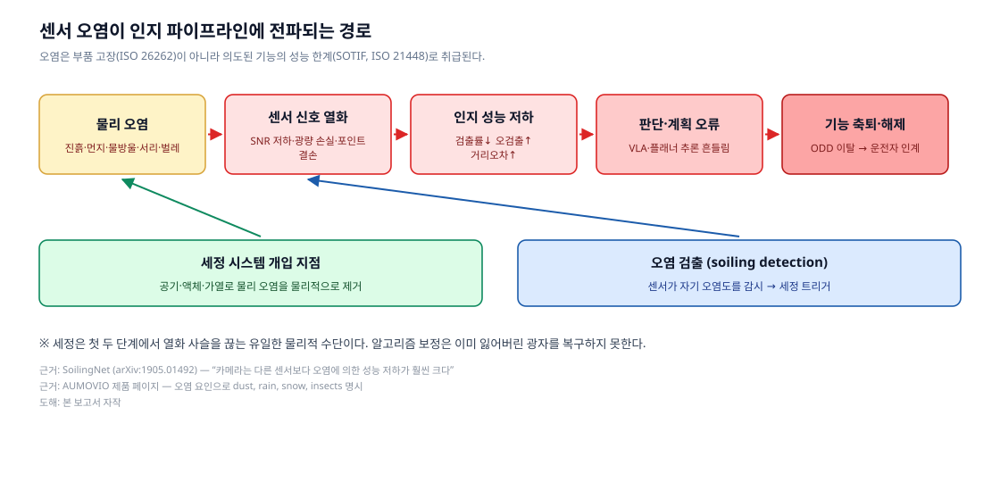

*그림 1. 물리 오염 → 신호 열화 → 인지 저하 → 판단 오류 → 기능 축퇴로 이어지는 사슬. 세정과 검출은 앞 두 단계에서만 개입할 수 있다. **본 보고서 자작 도해** — 근거: [SoilingNet(arXiv:1905.01492)](https://arxiv.org/abs/1905.01492), [ISO 21448](https://www.iso.org/standard/70939.html), [AUMOVIO 제품 페이지](https://www.aumovio.com/en/solutions/driver-assistance/optical-sensors-and-windshield-cleaning-systems.html)*

핵심은 **비가역성**이다. 렌즈가 가린 광자는 알고리즘으로 복원되지 않는다. 오염 보정 네트워크는 "가려졌다"는 사실을 알려줄 수는 있어도 잃어버린 정보를 만들어내지 못한다. 따라서 세정은 파이프라인 앞단에서 사슬을 끊는 **유일한 물리적 수단**이다. *(본 보고서 해석)*

---

## 2. AUMOVIO는 어떤 회사인가

| 항목 | 내용 | 출처 |
|---|---|---|
| 출범 | 2025년 9월 18일 프랑크푸르트 증권거래소 상장(Continental 스핀오프) | [Continental IR](https://www.continental.com/en/investors/events/spin-off-automotive/) |
| 상장 첫날 | 주가 €36.60, 시가총액 약 €37억 | [Bloomberg, 2025-09-18](https://www.bloomberg.com/news/articles/2025-09-18/aumovio-starts-trading-in-frankfurt-after-continental-spinoff) |
| 2025년 실적 | 조정 매출 약 €18.5십억, 임직원 약 82,000명, 80개 이상 거점 | [AUMOVIO Facts & Figures](https://www.aumovio.com/en/company/about-us/facts-and-figures.html) |
| 사업부 | ACM(자율·상용 모빌리티) · ANS(아키텍처·네트워크) · SAM(세이프티·모션) · UX(사용자 경험) | 동일 |
| 파트너십 | Aurora(자율주행 트럭), Ambarella, Horizon Robotics | 동일 |

세정 사업은 **ACM 산하 "Optical Sensors & Windshield Cleaning Systems"** 제품군에 속하며, 조직상 **Head of Washer Systems**(Petr Vanicky)가 이끄는 단위였다. ([AUMOVIO 제품 페이지](https://www.aumovio.com/en/solutions/driver-assistance/optical-sensors-and-windshield-cleaning-systems.html))

이 사업의 뿌리는 Continental 시절로 거슬러 올라간다. Continental Automotive Systems는 이미 **2012년 12월 6일** "Vehicle mounted optical and sensor cleaning system"(US20130146577A1)을 출원했는데, 여기에는 **세정 노즐 + 열선 코일 또는 PTC 칩 기반 제상 소자**라는, 오늘날 제품에도 그대로 남아 있는 조합이 청구되어 있다. ([Google Patents US20130146577A1](https://patents.google.com/patent/US20130146577A1/en))

---

## 3. 기술 해부

### 3.1 세정의 4대 수단

AUMOVIO 제품 설명에서 반복적으로 등장하는 세정 수단은 네 가지다.

| 수단 | 원문 근거 | 역할 |
|---|---|---|
| **공기 (air)** | "Removing of water droplets with pressurized air to ensure the lidar availability and sensitivity even at adverse environment conditions" / "Using air only to remove dust – saves liquid" | 물방울·먼지 제거, 액체 절약 |
| **액체 (fluid)** | "Cleaning of lidome with pressurized liquid using Coanda effect" | 진흙·유막 등 부착성 오염 제거 |
| **가열 (heating)** | "Long experience with heated nozzles and systems" / "Nozzle with heating harmonized with camera" / "Self-regulating heater with Positive Temperature Coefficient (PTC)" | 결빙 방지, 노즐 자체의 동결 방지 |
| **검출 (detection)** | 상위 설명의 "intelligent applications" — 구체 알고리즘은 미공개 | 세정 트리거 판단 |

*(표의 원문 인용은 모두 [AUMOVIO 제품 페이지](https://www.aumovio.com/en/solutions/driver-assistance/optical-sensors-and-windshield-cleaning-systems.html) 2026-09-07 수집분. 전문은 [reference/aumovio-product-page-extract.txt](reference/aumovio-product-page-extract.txt) 보관)*

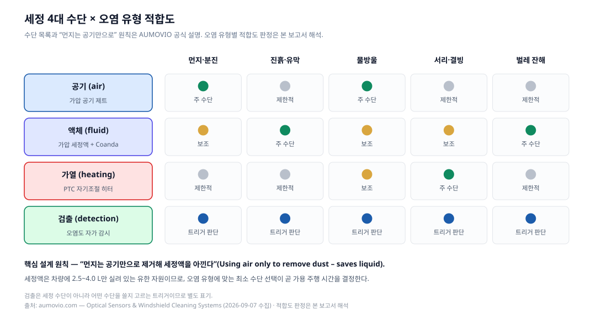

*그림 2. 수단별 적합도 매트릭스. **수단 목록과 "먼지는 공기만으로" 원칙은 AUMOVIO 공식 설명**, 오염 유형별 적합도 판정은 **본 보고서 해석**.*

여기서 읽어야 할 설계 철학은 **"가장 싼 수단부터 쓴다"**이다. 공기는 재생 가능하지만 세정액은 리저버가 비면 끝이다. L4 로보택시가 하루 종일 운행하려면 세정액 보충 없이 버텨야 하고, 이것이 **가용 운행 시간을 직접 제한**한다. *(본 보고서 해석)*

### 3.2 라이다 lidome / 카메라 렌즈 — Coanda 효과

AUMOVIO의 라이다 노즐과 카메라 노즐은 기술 설명이 거의 동일하다. 둘 다 다음을 명시한다.

- 가압 액체 + **Coanda 효과**로 lidome / 렌즈 세정
- 가압 공기로 물방울 제거 → 악조건에서도 **가용성(availability)과 감도(sensitivity)** 유지
- 먼지는 **공기만** 사용 — 액체 절약
- **배수(draining) 기능**
- 카메라와 **조화된(harmonized) 가열 사양**
- **평면(flat)·원형(round) 라이다 모두 대응**
- 최소 설치 공간

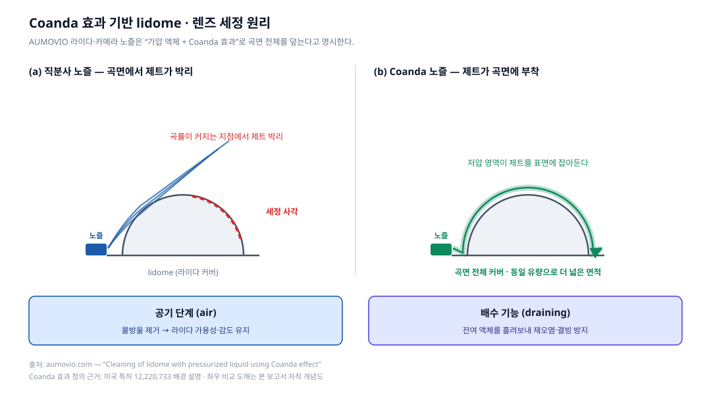

*그림 3. Coanda 효과 세정 원리. **"Coanda 효과 사용"은 AUMOVIO 공식 기술 설명**이며, 좌우 비교 도해와 유동 묘사는 **본 보고서 자작·개념도**다.*

**Coanda 효과란**: 오리피스에서 분출된 제트가 인접 표면을 따라 흐르려는 경향으로, 제트가 주변 유체를 끌어들이면서 제트를 따라 저압 영역이 형성되기 때문에 발생한다. ([Coanda 효과 정의 — 미국 특허 US12220733 배경 설명](https://image-ppubs.uspto.gov/dirsearch-public/print/downloadPdf/12220733))

라이다 커버는 반구 또는 원통 곡면이다. 직분사 제트는 곡률이 커지는 지점에서 표면에서 떨어져 나가(박리) 세정 사각을 남긴다. 반면 Coanda 노즐은 제트를 곡면에 **붙여서** 활주시키므로, **같은 유량으로 훨씬 넓은 면적을 덮는다.** 세정액이 유한 자원이라는 제약을 고려하면, 이는 단순한 성능 개선이 아니라 **운행 가능 시간을 늘리는 설계 선택**이다. *(효과에 대한 해석은 본 보고서)*

**배수 기능**의 의미도 짚어둘 만하다. 세정 후 커버에 남은 액체는 그 자체로 광학 왜곡을 만들고, 영하에서는 얼어붙어 더 나쁜 오염이 된다. 배수는 "세정 후 상태"를 관리하는 기능이다. *(본 보고서 해석)*

| 라이다 노즐 (공기 & 액체) | 카메라 노즐 (공기 & 액체) |
|---|---|
| 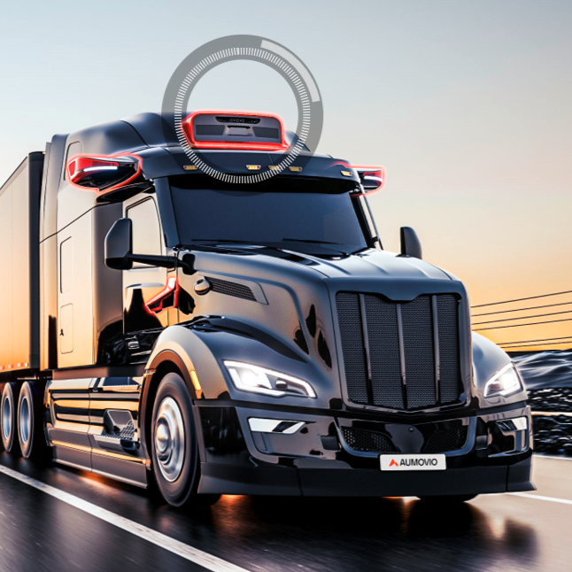 | 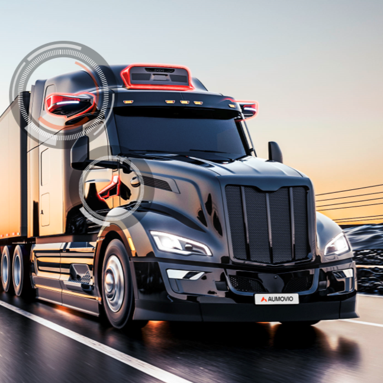 |

*그림 4. AUMOVIO 라이다 노즐 및 카메라 노즐 제품 이미지.
출처: https://www.aumovio.com/en/solutions/driver-assistance/optical-sensors-and-windshield-cleaning-systems.html (© AUMOVIO SE)*

### 3.3 윈드실드 노즐 — 4가지 기술과 wet-arm

윈드실드 세정은 자율주행과 무관해 보이지만, **전방 카메라 대부분이 윈드실드 뒤에 있다.** 윈드실드가 더러우면 카메라도 더럽다. 이 사업이 카메라 세정과 같은 조직에 있는 이유다. *(본 보고서 해석)*

| 노즐 기술 | 특징 | 근거 |
|---|---|---|
| **ball** | 볼 조인트 — 분사각 조정 가능 | 공식 |
| **fluidic** | 유체 진동으로 부채꼴 스윕. **볼 노즐 대비 물 소비 최대 40% 절감**. 유체 인서트 형상 변경으로 분사 패턴 조절 | 공식 |
| **multi-spray** | 다공 분사 | 공식 |
| **laser-drilled** | 레이저 미세 가공 노즐 | 공식 |

공통 설계 요소로 **동일 하우징 설계**(히터·체크밸브 유무와 무관하게 공용), **짧은 응답시간을 위한 통합 체크밸브**, **PTC 자기조절 히터**가 명시되어 있다.

**wet-arm(와이퍼 암 일체형) 시스템**은 별도로 주목할 만하다. 세정액을 와이퍼 블레이드 **바로 앞**에 공급하는 방식으로, 공식 설명은 다음 효과를 든다.

- 기존 노즐 대비 **물 소비 최대 50% 절감**, 더 나은 세정 결과
- 분사 중 **운전자 시야를 방해하지 않음**
- 노즐이 블레이드 뒤 슬립스트림에 위치 → **제트가 주행풍·차속과 무관**
- 굽힘 사이클을 견디는 고유연 저항선(히터), 통합 체크밸브, 전기·유압 결합 커넥터
- 보닛 힌지를 넘는 호스 배선 불필요 → **OEM 조립 시간 단축**
- 윈드실드 상단 오버스프레이 감소

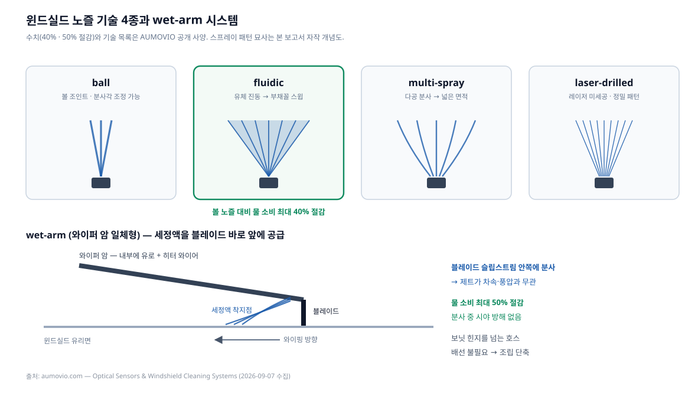

*그림 5. 노즐 기술 4종과 wet-arm 구조. **수치(40%·50%)와 기술 목록은 AUMOVIO 공식 사양**, 스프레이 패턴 묘사는 **본 보고서 자작 개념도**.*

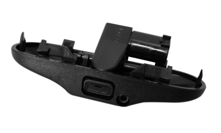

*그림 6. AUMOVIO 윈드실드 세정 노즐.
출처: https://www.aumovio.com/en/solutions/driver-assistance/optical-sensors-and-windshield-cleaning-systems.html (© AUMOVIO SE)*

### 3.4 유체 공급 체인 — 리저버에서 노즐까지

노즐만으로는 시스템이 되지 않는다. AUMOVIO는 **분배 컴포넌트(distribution components)** 전체를 함께 공급한다.

| 구성 요소 | 공개 사양 |
|---|---|
| **리저버** | 블로우 성형 = PE HD / 사출 성형 = PP. 윈드실드용 용량 **2.5L ~ 4.0L**. 레벨 센서는 리드 스위치 또는 2-pin 방식. 필러넥은 블로우·사출·코러게이트 중 선택. 펌프 통합으로 부품 수 감소, 박육 설계로 경량화 |
| **펌프** | 단일 또는 이중 토출구. 압력 **2.0 ~ 4.0 bar**. 하부·측면 흡입구 선택. 고객 요구에 따른 EMC 보호. AMP, K-jetronic 등 고객별 전기 인터페이스. **"AUMOVIO는 유럽 최대 펌프 유통사"**라고 자사 표현 |
| **호스** | 코러게이트: PA·PP·PA/PP. 고무: EPDM·TPV. 압력 손실을 줄이기 위한 대구경 옵션. **공기·액체 분리 배관** |
| **커넥터** | 전/후방 구분을 위한 **색상 구분 클립**. 2세대(고온 내성, 청각적 클릭 체결) / 3세대(코러게이트 호스 직결). 세대 혼용으로 비용 절감. **레이저 용접 — 탄소발자국 감소** |

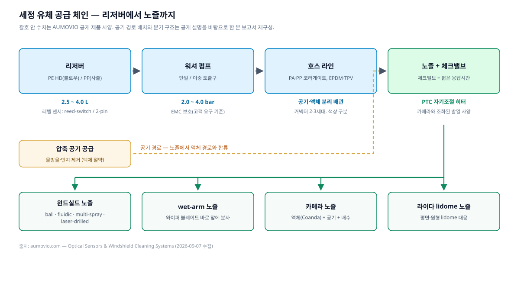

*그림 7. 리저버 → 펌프 → 호스 → 노즐 체인. **괄호 안 수치는 모두 AUMOVIO 공개 사양**, 공기 경로 배치와 분기 구조는 공개 설명을 바탕으로 한 **본 보고서 재구성**.*

| 리저버 | 펌프 | 호스 & 커넥터 |
|---|---|---|
| 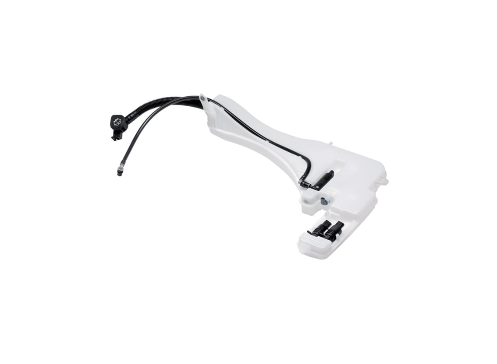 | 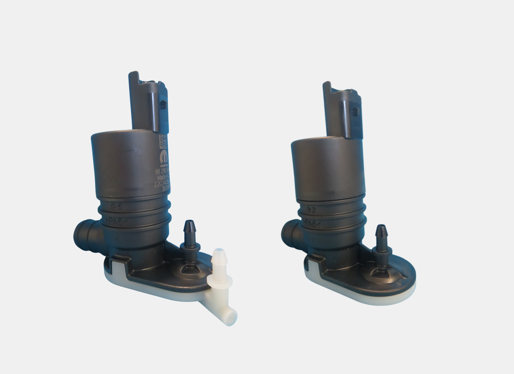 | 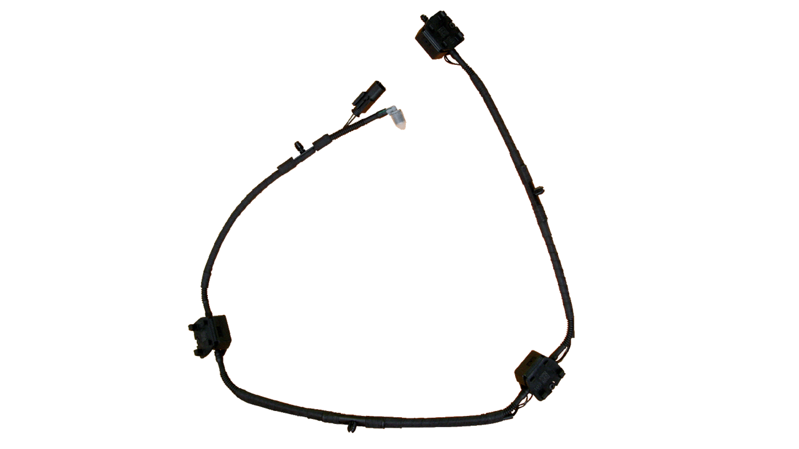 |

*그림 8. AUMOVIO 분배 컴포넌트 제품 이미지.
출처: https://www.aumovio.com/en/solutions/driver-assistance/optical-sensors-and-windshield-cleaning-systems.html (© AUMOVIO SE)*

**엔지니어링 관점에서 눈여겨볼 지점**:

- **체크밸브 = 응답 시간**. 세정 지령 후 노즐까지 액체가 도달하는 시간은 호스 길이와 잔압에 좌우된다. 체크밸브로 라인에 액체를 채워두면 지연이 줄어든다. 자율주행에서 "세정 지령 → 시야 회복"까지의 지연은 곧 **기능 축퇴 시간**이다. *(본 보고서 해석)*
- **공기·액체 분리 배관**. 노즐 하나에 두 개의 유체 경로가 들어가므로, 라우팅·커넥터·패키징 복잡도가 배로 늘어난다. "최소 설치 공간"이 반복 강조되는 배경이다. *(본 보고서 해석)*
- **PTC 자기조절 히터**. 온도가 오르면 저항이 증가해 스스로 전력을 줄인다. 별도 온도 제어 회로 없이 과열을 방지하는 방식으로, 앞서 언급한 2012년 Continental 특허에도 같은 개념이 등장한다. ([US20130146577A1](https://patents.google.com/patent/US20130146577A1/en))
- **"카메라와 조화된 히터"**. 노즐 히터의 발열 사양을 카메라 모듈의 열 사양에 맞춘다는 뜻이다. 이는 세정 부품과 센서 부품이 **함께 설계될 때만 가능한 최적화**이며, 뒤의 7장에서 다룰 매각 이슈와 직결된다. *(본 보고서 해석)*

### 3.5 오염 검출과 세정 트리거

AUMOVIO 제품 페이지는 "intelligent applications"라고만 하고 검출 알고리즘을 공개하지 않는다. 다만 스핀오프 이전 Continental이 발표한 **Sensor Array**에서 동작 방식의 윤곽을 확인할 수 있다.

Continental Sensor Array는 IAA TRANSPORTATION 2022(하노버, 2022년 9월 20~25일)에서 공개된 상용차용 모듈로, 윈드실드 위에 장착되는 **레이더 + 라이다 + 카메라 사전 캘리브레이션 통합체**다. 여기에는 **"Camera and Sensor Cleaning, Cooling and Heating"** 기능이 통합되어 있고, **각 센서가 스스로 오염 정도를 감시해 필요할 때 자동으로 세정을 트리거**한다. ([Continental 보도자료 2022-09-15](https://www.continental.com/en/press/press-releases/20220915-sensor-array-iaa/))

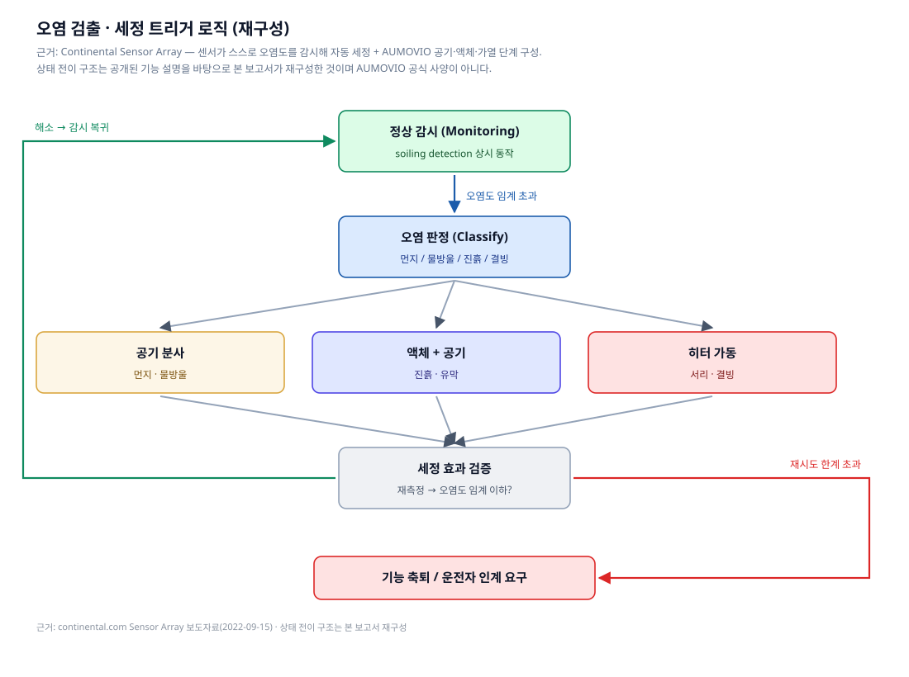

*그림 9. 검출–분류–세정–검증 루프. **"센서 자가 오염 감시 → 자동 세정" 및 공기/액체/가열 3단 수단은 공식 근거**, 상태 전이 구조와 실패 시 기능 축퇴 경로는 **본 보고서 재구성**이며 AUMOVIO 공식 사양이 아니다.*

이 루프에서 실무적으로 어려운 지점은 세 가지다. *(본 보고서 해석)*

1. **오염 유형 분류**. 먼지인지 물방울인지 진흙인지에 따라 최적 수단이 다르다. 잘못 고르면 액체를 낭비하거나(먼지에 액체) 세정에 실패한다(진흙에 공기만).
2. **효과 검증**. 세정 후에도 오염이 남았다면 재시도해야 하고, 재시도 한계를 넘으면 해당 센서를 신뢰할 수 없다고 판단해 기능을 축퇴시켜야 한다. 이 판단은 SOTIF 논증의 일부가 된다.
3. **자원 예산**. 남은 세정액으로 목적지까지 갈 수 있는가. 이는 세정 제어기가 아니라 차량 수준 에너지·자원 관리자가 다뤄야 할 문제로 올라간다.

---

## 4. 시스템 통합 관점

### 4.1 센서 수가 늘면 세정도 비선형으로 늘어난다

L2+ 차량의 카메라 세정점은 몇 개면 충분하지만, L4 로보택시는 라이다 여러 대 + 서라운드 카메라 + 그 각각의 세정점을 갖는다. 세정점마다 **노즐 + 액체 라인 + 공기 라인 + 히터 배선 + 밸브**가 필요하다. AUMOVIO가 "모듈형(modular)"과 "최소 설치 공간"을 반복해 강조하는 것은 이 조합 폭발에 대한 대응이다. *(본 보고서 해석)*

경쟁사 Kautex도 같은 문제를 명시적으로 언급한다 — Allegro 시스템은 "카메라 세정점 하나부터, 카메라·라이다 조합, 고도 자동화 차량의 다중 센서 시스템까지" L1~L5를 커버하도록 스케일링된다. ([Kautex Insights](https://insights.kautex.com/en-WW/208675-sensor-cleaning-for-highly-automated-driverless-vehicles/))

### 4.2 EV·전력 제약

가열은 세정 수단 중 가장 전력을 많이 쓴다. PTC 자기조절 방식이 선택되는 이유 중 하나는 제어 회로 없이 **소비 전력에 자연스러운 상한**이 걸리기 때문이다. 겨울철 EV에서 세정 히터·공기 압축·펌프가 동시에 도는 것은 주행거리에 직접 영향을 준다. *(본 보고서 해석)*

Continental Sensor Array가 세정과 **냉각(cooling)·가열(heating)을 한 묶음**으로 제공하는 것도 같은 맥락이다. 라이다·카메라는 발열체이면서 동시에 결빙 대상이므로, 열 관리와 세정은 분리해서 설계할 수 없다. ([Continental 보도자료 2022-09-15](https://www.continental.com/en/press/press-releases/20220915-sensor-array-iaa/))

### 4.3 세정액 예산

공개된 숫자로 대략적인 감을 잡을 수 있다. 리저버는 **2.5~4.0L**(윈드실드용 기준), 펌프 압력은 **2.0~4.0 bar**다. 세정 1회당 소모량은 공개되어 있지 않다(**출처 미확인**). 다만 AUMOVIO가 fluidic 노즐로 **40%**, wet-arm으로 **50%** 절감을 전면에 내세우는 것 자체가, 이 사업에서 **액체 소비량이 곧 경쟁력 지표**임을 보여준다.

> **주의**: 40%·50% 수치는 AUMOVIO 자사 발표이며, 측정 조건·비교 대상 노즐 사양은 공개되지 않았다. 독립 검증 자료는 **출처 미확인**이다.

---

## 5. 경쟁 구도

| 기업 | 대표 제품/기술 | 차별점 (공개 자료 기준) | 근거 |
|---|---|---|---|
| **AUMOVIO** | 라이다·카메라 노즐, 윈드실드 노즐 4종, wet-arm, 분배 컴포넌트 일체 | **Coanda 효과** 곡면 세정, 공기/액체/가열/배수 통합, 리저버·펌프·호스까지 풀 스택 공급, fluidic 40%·wet-arm 50% 절수 | [AUMOVIO 제품 페이지](https://www.aumovio.com/en/solutions/driver-assistance/optical-sensors-and-windshield-cleaning-systems.html) |
| **Valeo** | everView 계열, Centricam, 라이다용 가열 텔레스코픽 노즐 | 자사 발표 **"세정 시스템 없을 때 55% → 있을 때 100% 영상 확보"**, "경쟁사 대비 액체 36% 적게 쓰는 노즐". Centricam은 2019 CLEPA 어워드 3위, 가열 텔레스코픽 노즐은 2021 PACE 어워드 파이널리스트 | [Valeo 공식](https://www.valeo.com/en/sensor-and-camera-cleaning-system-for-cars/) |
| **Kautex Textron** | Allegro / Allegro Premium | **소프트웨어 제어형 세정 전략** — 속도·날씨·온도·오염 종류를 고려해 세정 방식을 즉석 결정. Allegro Premium은 CAM·PwC의 AutomotiveINNOVATIONS 어워드 수상 | [Businesswire 2022-08-03](https://www.businesswire.com/news/home/20220803005184/en/Kautex-Textron-GmbH-Co.-KG-Receives-AutomotiveINNOVATIONS-Award) · [Kautex Insights](https://insights.kautex.com/en-WW/208675-sensor-cleaning-for-highly-automated-driverless-vehicles/) |
| **Ficosa** | Sensor & Camera Cleaning | 물·공기 **하이브리드 올인원** 장치. 윈드실드 회로에 연결되어 **추가 워터펌프 불필요**, 차내 어디든 장착 가능 | [Ficosa 공식](https://www.ficosa.com/products/underhood/sensor-and-camera-cleaning/) |
| **ARaymond** | ADAS·라이다 세정 노즐, 전자밸브 | 라이다용 **텔레스코픽 노즐 + 저속 충돌 시 자동 후퇴하는 기계적 퓨즈**, 노즐 근처 또는 중앙 배치가 가능한 전자밸브, 자체 오염 시험 랩(고속 카메라 계측) | [ARaymond 공식](https://www.araymond-mobility.com/en/cleaning-systems) |
| **Actasys** (스타트업) | ActaJet | **유체를 전혀 쓰지 않는 방식** — 두께 3mm 디스크형 액추에이터가 압축기·팬 없이 최대 120 m/s 공기 펄스를 생성. Volvo Cars와 개발 협력 | [Fierce Electronics(서드파티 보도)](https://www.fierceelectronics.com/sensors/actasys-uses-tiny-air-jets-clean-and-cool-sensors-self-driving-vehicles) · [Businesswire 2020-12-02](https://www.businesswire.com/news/home/20201202005089/en/Actasys-Announces-%245M-Venture-Capital-Funding-To-Commercialize-Automotive-Sensor-Cleaning-System) |

**기술 노선의 갈림**: *(본 보고서 해석)*

- **유체 효율 노선** — AUMOVIO(Coanda), Valeo(절수 노즐). 액체를 쓰되 최소한으로.
- **기계 노선** — Valeo 텔레스코픽/와이퍼, ARaymond 텔레스코픽, Bosch의 푸시체인 와이퍼 특허([WO2024199756A1](https://patents.google.com/patent/WO2024199756A1/en), 출원인 Robert Bosch GmbH, 우선일 2023-03-27). 물리적으로 닦되 평시엔 숨긴다.
- **무유체 노선** — Actasys의 합성 제트. 리저버 제약 자체를 없애지만 부착성 오염에는 한계.
- **소프트웨어 노선** — Kautex Allegro Premium. 어떤 수단을 언제 쓸지를 지능화.

참고로 세정 시스템 특허 지형은 완성차·자율주행 기업까지 넓게 걸쳐 있다. 예컨대 **US20180015907A1**("Sensor cleaning system for vehicles", 2016-07-18 출원)은 원래 Uber Technologies가 출원해 현재 **Aurora Operations**가 보유하며, **가압 액체 분사 후 슬릿 개구부의 "에어 나이프"로 건조**하는 2단 방식을 청구한다. ([Google Patents US20180015907A1](https://patents.google.com/patent/US20180015907A1/en)) AUMOVIO가 Aurora와 자율주행 트럭 파트너십을 맺고 있다는 점([AUMOVIO 제품 페이지](https://www.aumovio.com/en/solutions/driver-assistance/optical-sensors-and-windshield-cleaning-systems.html))을 함께 놓고 보면 흥미로운 대목이다.

### 시장 규모 (참고 — 신뢰도 낮음)

시장조사기관 추정치로는 자동차 센서 세정 시스템 시장이 **2025년 US$1.8십억 → 2032년 US$2.7십억, CAGR 6.5%**로 제시된다. ([Persistence Market Research 인용 보도](https://www.openpr.com/news/4289799/automotive-sensor-cleaning-system-market-to-touch-us-2-7))

> **신뢰도 주의**: 위 수치는 시장조사기관 추정이며 방법론이 공개되어 있지 않다. 같은 계열 자료가 제시하는 업체별 점유율(예: Continental 24.2%)은 **검증 불가**이므로 본 보고서는 인용하지 않는다. 일부 업계 자료가 제시하는 "2030년까지 US$80십억 규모" 같은 수치도 마찬가지로 **출처 신뢰도 미확인**이다.

---

## 6. 그런데 AUMOVIO는 이 사업을 판다

### 6.1 사실 관계

| 항목 | 내용 |
|---|---|
| 발표일 | **2026년 9월 3일** |
| 대상 | 워셔 및 세정 사업 — **윈도 워셔, 카메라·센서·헤드램프 세정 시스템, 유체 공급 제품** |
| 인수자 | **CERTINA Group** (뮌헨 소재 가족소유 산업 홀딩, 25년 이상 투자 경력, 자동차 부문 연매출 약 **€600백만**) |
| 규모 | 체코 **Adršpach** 본거지, 사업 전체가 체코에서 운영, 약 **700명** |
| 이관 범위 | **생산, R&D, 전 인력, 관련 사업 활동 전부** |
| 대가 | **비공개** (양측 합의) |
| 클로징 | 관례적 선행조건 충족 시 **2026년 말** 예상 |

출처: [AUMOVIO 보도자료 2026-09-03](https://www.aumovio.com/en/company/press/press-releases/20260903-washer-business.html) · 법률자문 확인: [K&L Gates](https://www.klgates.com/KL-Gates-Advises-AUMOVIO-on-Sale-of-Washer-and-Cleaning-Business-Group-to-CERTINA-Group-9-3-2026) · 보도: [just-auto](https://www.just-auto.com/news/aumovio-certina-agrees-unit-sale/)

AUMOVIO CEO **Philipp von Hirschheydt**는 이번 매각을 "핵심 사업에 집중하는 더 큰 전략의 또 한 걸음이며, 성장과 가치의 동인으로 식별한 기술로 자원을 옮기는 것"이라는 취지로 설명했다. ([AUMOVIO 보도자료](https://www.aumovio.com/en/company/press/press-releases/20260903-washer-business.html))

이 매각은 단독 사건이 아니다. AUMOVIO는 벨기에 Mechelen 사이트를 Dumarey Group에 매각했고, 2026년 말까지 최대 4,000명 감원을 수반하는 R&D 개편을 이미 발표한 상태다. ([just-auto](https://www.just-auto.com/news/aumovio-certina-agrees-unit-sale/) — 서드파티 보도)

### 6.2 무엇이 바뀌는가

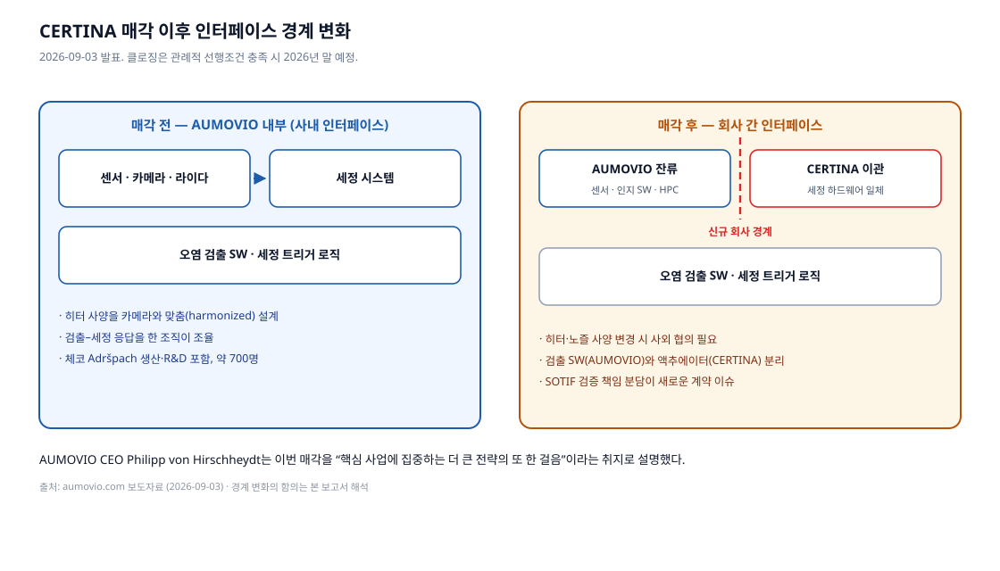

*그림 10. 매각 전후의 인터페이스 경계. **매각 사실·규모·인용은 AUMOVIO 공식 보도자료**, 경계 변화가 갖는 함의는 **본 보고서 해석**.*

기술적으로 가장 중요한 변화는 **조직 경계의 이동**이다. *(이하 본 보고서 해석)*

지금까지 AUMOVIO는 다음을 한 회사 안에 갖고 있었다.

- 카메라·라이다 **센서 본체** (ACM 사업부의 핵심 역량)
- 그 센서를 닦는 **세정 하드웨어**
- 언제 닦을지 판단하는 **인지·검출 소프트웨어**

그래서 "카메라와 조화된 히터"(nozzle with heating harmonized with camera) 같은 **부품 간 사양 정합**이 사내 조율로 가능했다. 매각 후에는 센서와 검출 SW는 AUMOVIO에, 세정 하드웨어는 CERTINA에 남는다. 같은 최적화를 하려면 이제 **회사 간 계약과 사양 협의**가 필요하다.

실무적으로 따라붙는 질문들:

- **SOTIF 검증 책임 분담**. "세정 후에도 오염이 남는다"는 시나리오의 안전 논증은 누가 소유하는가. 센서 공급자인가, 세정 공급자인가, OEM인가.
- **응답 시간 사양**. 세정 지령부터 시야 회복까지의 지연은 두 회사의 부품이 함께 만드는 값이다. 계약상 어느 쪽이 보증하는가.
- **변경 관리**. 카메라 모듈이 개선되면 노즐 히터 사양도 따라 바뀌어야 한다. 사내에서는 설계 변경이었던 것이 이제 사외 협의 항목이 된다.

**다만 반대 해석도 성립한다.** 세정 하드웨어는 사출·블로우 성형과 유체 부품 중심의 비교적 성숙한 기계 사업이고, AUMOVIO의 성장 축(반도체·소프트웨어·HPC·레이더/카메라)과는 원가 구조와 필요 역량이 다르다. 전문 산업 홀딩 산하에서 오히려 더 나은 투자를 받을 수 있고, AUMOVIO는 세정을 **구매 부품**으로 다루면 된다. 어느 쪽이 맞았는지는 클로징 이후 실제 공급 계약 구조가 드러나야 판단할 수 있다.

---

## 7. 시사점 — 차량 HPC·인지 아키텍처 설계자 체크리스트

*(본 보고서 해석. AUMOVIO 공식 권고가 아니다.)*

1. **오염 검출을 인지 스택의 1급 시민으로 취급하라.** 오염 마스크는 검출·분할 결과와 함께 다운스트림으로 전달되어야 한다. 가려진 영역에서 나온 검출 결과는 신뢰도를 낮춰야 한다.
2. **세정을 액추에이터로 모델링하라.** 세정은 "부가 기능"이 아니라 인지 가용성을 회복시키는 액추에이터다. 지령–효과 지연, 성공률, 자원 소모가 있는 제어 대상으로 다뤄야 한다.
3. **세정액을 자원 예산에 포함하라.** 배터리 SoC처럼 세정액 잔량도 ODD 유지 조건이다. L4에서는 "세정액 부족"이 운행 종료 사유가 될 수 있다.
4. **오염 유형별 최소 수단 정책을 세워라.** 먼지에 액체를 쓰면 운행 시간을 낭비한다. AUMOVIO 제품 설명이 "공기만으로 먼지 제거 — 액체 절약"을 반복하는 이유다.
5. **열 설계와 세정 설계를 함께 하라.** 히터 사양은 센서 모듈의 열 사양에 종속된다. 두 사양이 다른 조직·다른 회사에 있으면 인터페이스를 문서로 못 박아야 한다.
6. **공급망 재편을 사양서에 반영하라.** 2026년 말 이후 이 부품군의 공급자는 CERTINA다. 진행 중인 프로그램이라면 변경 관리·품질 보증 주체를 지금 확인해 두는 편이 안전하다.
7. **텔레스코픽·와이퍼식 기구 세정의 공간·신뢰성 비용을 조기에 평가하라.** ARaymond·Bosch·Valeo가 모두 이 방향에 투자하고 있으나, 가동부는 패키징과 고장 모드를 늘린다.

---

## 8. 출처

### 공식 발표 · 1차 자료

| 구분 | 자료 | URL |
|---|---|---|
| AUMOVIO | Optical Sensors & Windshield Cleaning Systems 제품 페이지 (2026-09-07 수집) | https://www.aumovio.com/en/solutions/driver-assistance/optical-sensors-and-windshield-cleaning-systems.html |
| AUMOVIO | 세정 사업 CERTINA 매각 보도자료 (2026-09-03) | https://www.aumovio.com/en/company/press/press-releases/20260903-washer-business.html |
| AUMOVIO | Facts and Figures | https://www.aumovio.com/en/company/about-us/facts-and-figures.html |
| Continental | Sensor Array 보도자료 (2022-09-15, IAA TRANSPORTATION) | https://www.continental.com/en/press/press-releases/20220915-sensor-array-iaa/ |
| Continental | 스핀오프 IR 페이지 | https://www.continental.com/en/investors/events/spin-off-automotive/ |
| K&L Gates | AUMOVIO 매각 법률자문 발표 (2026-09-03) | https://www.klgates.com/KL-Gates-Advises-AUMOVIO-on-Sale-of-Washer-and-Cleaning-Business-Group-to-CERTINA-Group-9-3-2026 |
| Valeo | Sensor and camera cleaning system | https://www.valeo.com/en/sensor-and-camera-cleaning-system-for-cars/ |
| Ficosa | Sensor and camera cleaning | https://www.ficosa.com/products/underhood/sensor-and-camera-cleaning/ |
| ARaymond | Cleaning systems | https://www.araymond-mobility.com/en/cleaning-systems |
| Kautex | Sensor Cleaning for Highly Automated Driverless Vehicles | https://insights.kautex.com/en-WW/208675-sensor-cleaning-for-highly-automated-driverless-vehicles/ |

### 특허

| 번호 | 제목 | 출원인/보유자 | URL |
|---|---|---|---|
| US20130146577A1 | Vehicle mounted optical and sensor cleaning system (2012-12-06 출원) | Continental Automotive Systems | https://patents.google.com/patent/US20130146577A1/en |
| US20180015907A1 | Sensor cleaning system for vehicles (2016-07-18 출원) | Uber Technologies → Aurora Operations | https://patents.google.com/patent/US20180015907A1/en |
| WO2024199756A1 | Lidar cleaning system (우선일 2023-03-27) | Robert Bosch GmbH | https://patents.google.com/patent/WO2024199756A1/en |

### 학술 연구

| 자료 | 내용 | URL |
|---|---|---|
| SoilingNet (arXiv:1905.01492) | 서라운드뷰 카메라 오염 검출, 불투명/투명 오염 분류 | https://arxiv.org/abs/1905.01492 |
| Let's Get Dirty (arXiv:1912.02249) | GAN 기반 오염 데이터 증강 → 검출 정확도 18% 향상 | https://arxiv.org/abs/1912.02249v2 |
| Lost in Fog (arXiv:2605.21446) | 센서 교란이 주행 VLA 추론에 미치는 영향 (**정량 수치 미확인**) | https://arxiv.org/pdf/2605.21446 |
| ISO 21448:2022 (SOTIF) | 의도된 기능의 안전 — 기능적 불충분·트리거링 컨디션 | https://www.iso.org/standard/70939.html |

### 서드파티 보도 · 시장조사 (신뢰도 구분 필요)

| 자료 | 성격 | URL |
|---|---|---|
| just-auto — AUMOVIO/CERTINA 매각 보도 | 업계 매체 | https://www.just-auto.com/news/aumovio-certina-agrees-unit-sale/ |
| Bloomberg — AUMOVIO 상장 첫날 시가총액 | 통신사 | https://www.bloomberg.com/news/articles/2025-09-18/aumovio-starts-trading-in-frankfurt-after-continental-spinoff |
| Businesswire — Kautex AutomotiveINNOVATIONS 수상 | 기업 배포 보도자료 | https://www.businesswire.com/news/home/20220803005184/en/Kautex-Textron-GmbH-Co.-KG-Receives-AutomotiveINNOVATIONS-Award |
| Businesswire — Actasys $5M 투자 유치 (2020-12-02) | 기업 배포 보도자료 | https://www.businesswire.com/news/home/20201202005089/en/Actasys-Announces-%245M-Venture-Capital-Funding-To-Commercialize-Automotive-Sensor-Cleaning-System |
| Fierce Electronics — Actasys ActaJet 기술 소개 | 기술 매체 | https://www.fierceelectronics.com/sensors/actasys-uses-tiny-air-jets-clean-and-cool-sensors-self-driving-vehicles |
| openpr (Persistence Market Research 인용) — 시장 규모 | **시장조사 추정, 방법론 비공개 — 신뢰도 낮음** | https://www.openpr.com/news/4289799/automotive-sensor-cleaning-system-market-to-touch-us-2-7 |

### 그림 출처

| 그림 | 출처 |
|---|---|
| 그림 1·2·3·5·7·9·10 (SVG 다이어그램) | **본 보고서 자작.** 각 그림 캡션에 근거 자료와 해석 범위를 명시 |
| 그림 4·6·8 (제품 사진) | © AUMOVIO SE. https://www.aumovio.com/en/solutions/driver-assistance/optical-sensors-and-windshield-cleaning-systems.html 에서 2026-09-07 수집 |

### 원문 보관

- [reference/aumovio-product-page-extract.txt](reference/aumovio-product-page-extract.txt) — AUMOVIO 제품 페이지 본문 전체 추출본 (2026-09-07)

---

## 부록. 확인하지 못한 항목 (출처 미확인)

정직한 리서치를 위해, 조사 과정에서 **확인에 실패한 항목**을 명시한다.

| 항목 | 상태 |
|---|---|
| 세정 1회당 액체 소모량(ml) | AUMOVIO 공개 자료에 없음 |
| 라이다·카메라 노즐의 공기 압력·유량 사양 | 공개되지 않음 (액체 펌프 2.0~4.0 bar만 공개) |
| PTC 히터의 소비 전력 | 공개되지 않음 |
| 오염 검출 알고리즘 상세 | "intelligent applications"로만 기술 |
| 세정 사업의 매출 규모 및 매각가 | 양측 비공개 |
| 세정 제품의 OEM 수주 실적·차종 | 확인 실패 |
| Valeo everView LiDAR의 세정액 소모량 비교 수치(25ml vs 100ml 등) | 2차 인용만 확인, 공식 페이지 접근 실패(HTTP 404) — 본문에서 제외 |
| 업체별 시장 점유율 | 방법론 미공개 추정치만 존재 — 본문에서 제외 |
| "Lost in Fog"(arXiv:2605.21446)의 정량 열화 수치 | 원문 표 확인 실패 |
