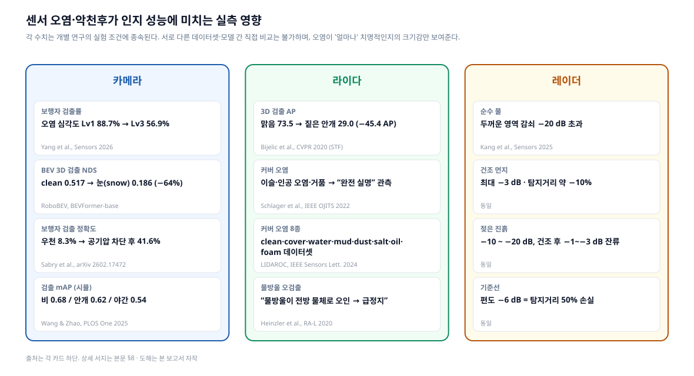
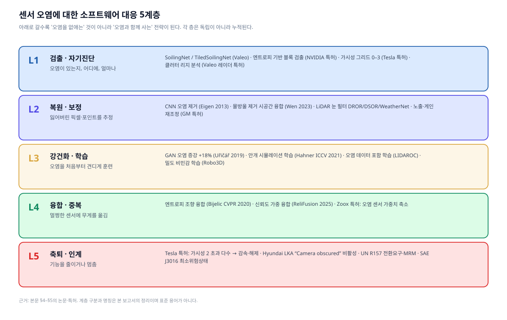
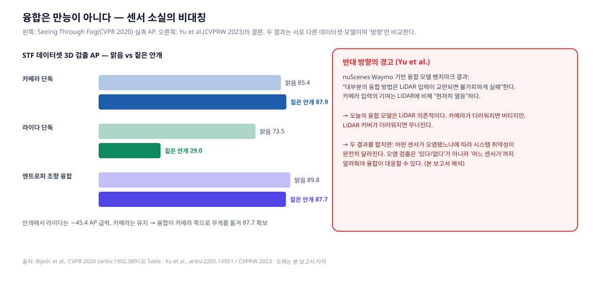
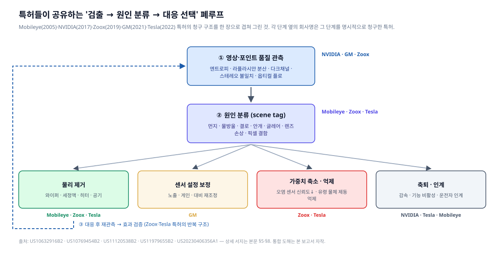
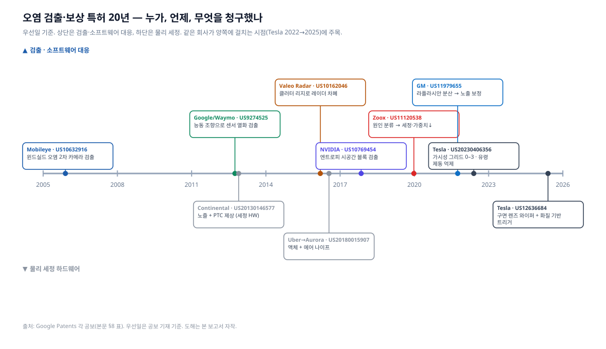
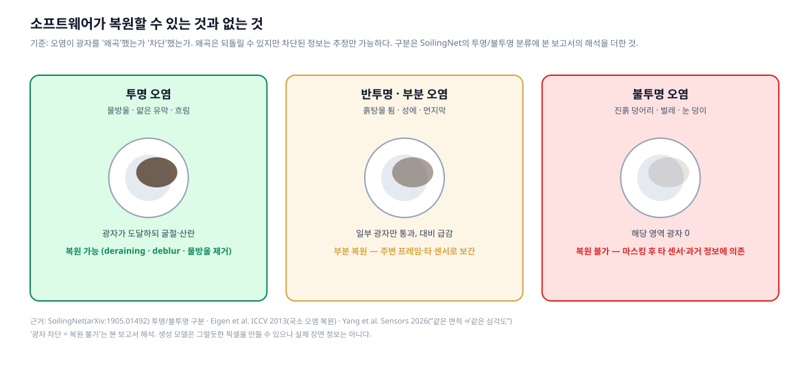

# 센서 오염은 인지를 어떻게 무너뜨리고, 소프트웨어는 어디까지 막아내는가

> **작성일**: 2026-09-14
> **시리즈**: AUMOVIO 센서 세정 리서치 2편. 1편([aumovio-sensor-cleaning.md](aumovio-sensor-cleaning.md))이 "하드웨어로 오염을 없애는 방법"이었다면, 이 편은 **"오염이 인지·판단에 미치는 실제 영향"과 "소프트웨어로 검출·복원·보상·축퇴하는 방법"**을 선행 연구·특허·규제 원문으로 추적한다.
> **출처 표기 원칙**: 모든 수치·주장에 출처를 병기한다. 학술 논문 / 특허 공보 / 규제·표준 / 기업 공식 자료 / 서드파티 보도를 구분하며, 원문을 확인하지 못한 항목은 **"출처 미확인"** 또는 **"2차 인용"**으로 명시한다. 공개 자료로부터 재구성·해석한 부분은 **"본 보고서 해석"**으로 표기한다.

---

## 0. 세 줄 요약

1. **오염의 영향은 '조금 나빠지는' 수준이 아니다.** 카메라 오염 심각도가 1→3단계로 오르면 보행자 검출률이 88.7%→56.9%로 떨어지고(Yang et al., *Sensors* 2026), 라이다는 짙은 안개에서 3D 검출 AP가 73.5→29.0으로 무너지며(Bijelic et al., CVPR 2020), 라이다 커버의 **이슬**만으로도 "완전 실명"이 관측됐다(Schlager et al., IEEE OJITS 2022). 레이더는 젖은 진흙에서 −10~−20 dB 감쇠를 겪고, 편도 −6 dB면 탐지거리가 절반이 된다(Kang et al., *Sensors* 2025).
2. **소프트웨어 대응은 5계층으로 정리된다** — ① 검출·자기진단, ② 복원·보정, ③ 강건화 학습, ④ 융합·중복, ⑤ 축퇴·인계. 특허는 이 다섯을 **"품질 관측 → 원인 분류 → 대응 선택 → 재검증"** 폐루프로 묶는다. Mobileye(2005)·Waymo(2012)·NVIDIA(2017)·Zoox(2019)·GM(2021)·Tesla(2022)의 청구항이 모두 같은 골격을 공유한다.
3. **소프트웨어의 한계는 물리적이다.** 투명 오염(물방울·유막)은 광자를 *왜곡*하므로 복원이 통하지만, 불투명 오염(진흙·벌레)은 광자를 *차단*하므로 추정만 가능하다. 그래서 가장 앞선 카메라 전용 진영조차 결국 물리 세정으로 돌아왔다 — Tesla는 2022년 "가시성 그리드" 특허에 이어 2025년 렌즈 와이퍼 특허를 출원했다. 1편의 AUMOVIO 세정 하드웨어와 이 편의 소프트웨어는 대체재가 아니라 **한 폐루프의 두 절반**이다.

---

## 1. 왜 이 보고서인가

1편은 AUMOVIO가 "공기·액체·가열·검출" 네 수단으로 센서를 닦는 방법을 다뤘다. 그 보고서를 쓰면서 답하지 못한 질문이 남았다.

- 오염이 인지 결과를 "치명적으로" 망친다는데, **얼마나** 망치는가? 검출률 몇 %가 몇 %로 떨어지는가?
- 닦지 않고 **소프트웨어로** 버틸 수는 없는가? 오염을 검출하고, 지워진 픽셀을 복원하고, 다른 센서로 메우는 연구는 어디까지 왔는가?
- 그런 방법을 누가 **특허**로 잡고 있는가? 규제는 무엇을 요구하는가?

이 세 질문을 원문 근거로 답하는 것이 이 보고서의 목표다. 결론부터 말하면, 소프트웨어는 놀랄 만큼 많은 일을 하지만 **"광자가 도달하지 않은 영역"은 어떤 알고리즘도 복구하지 못한다**는 경계가 분명히 존재하고, 산업계의 특허 지형이 그 경계를 그대로 반영하고 있다.

---

## 2. 오염이 인지·판단에 미치는 실제 영향

### 2.1 실측 수치

*그림 1. 센서별 오염·악천후 영향 실측치. 각 카드는 서로 다른 연구·데이터셋·모델의 결과이므로 카드 간 직접 비교는 불가하다. **본 보고서 자작 도해**, 출처는 각 카드 하단 및 아래 본문.*

**카메라**

| 조건 | 결과 | 출처 (학술) |
|---|---|---|
| 렌즈 오염 심각도 Lv1 → Lv3 (5단계 척도) | 보행자 검출률 **88.7% → 56.9%**. 통제 실험에서 심각도 증가에 따라 인지 IoU **84.85%** 감소 | Yang, Duan, Li, Zhang, "A Static-to-Temporal Framework for Interpretable Camera Lens Soiling Severity Estimation in Autonomous Driving," *Sensors* 26(11):3533, 2026. [doi:10.3390/s26113533](https://doi.org/10.3390/s26113533) |
| BEV 3D 검출, nuScenes-C 코럽션 | BEVFormer-base NDS: clean **0.517** → 안개 0.407 → 카메라 크래시 0.315 → **눈 0.186 (−64%)** | Xie et al., "RoboBEV: Towards Robust Bird's Eye View Perception under Corruptions," [arXiv:2304.06719](https://arxiv.org/abs/2304.06719) (TPAMI 2025 확장판 있음) |
| 우천 시 카메라 렌즈 물방울 | 보행자 검출 정확도 **8.3%** → 공기압 차단 장치 적용 후 **41.6%** | Sabry, Gorospe, Olaverri-Monreal, [arXiv:2602.17472](https://arxiv.org/abs/2602.17472) (2026) |
| CARLA 시뮬레이션 악천후 | YOLOv5 mAP: 비 **0.68**, 안개 **0.62**, 야간 **0.54** (맑음 대비) | Wang & Zhao, *PLOS One* 2025, [doi:10.1371/journal.pone.0333928](https://journals.plos.org/plosone/article?id=10.1371/journal.pone.0333928) |

카메라 계열 결과에서 가장 중요한 발견은 Yang et al.의 **"같은 면적 ≠ 같은 심각도"**다. 동일한 픽셀 면적을 덮어도 투명 얼룩과 불투명 진흙은 인지 열화가 다르고, 면적 기반 점수는 외부 데이터에서 상관계수 ρ=0.32에 그친 반면 구조화 점수는 ρ=0.79였다. 즉 **"얼마나 더러운가"는 면적이 아니라 광학적 성질로 재야 한다.** 이 통찰은 1편의 AUMOVIO 설계 원칙("먼지는 공기만으로, 진흙은 액체로")과 정확히 맞물린다.

**라이다**

| 조건 | 결과 | 출처 (학술) |
|---|---|---|
| 짙은 안개 (실도로 10,000 km 수집) | 라이다 단독 3D 검출 AP **73.46 → 28.98 (−45.38)**. 같은 조건에서 카메라 단독은 85.43 → 87.89로 유지 | Bijelic et al., "Seeing Through Fog Without Seeing Fog," CVPR 2020, [arXiv:1902.08913](https://arxiv.org/abs/1902.08913) |
| 커버 오염 6종 (이슬·먼지·인공 오염·거품·물·기름) | RIEGL LD05-A20·Ouster OS1-64 실험. **이슬·인공 오염·거품 → "완전 센서 실명(complete sensor blindness)"** | Schlager, Gölles, Muckenhuber, Watzenig, *IEEE Open J. ITS*, 2022, [doi:10.1109/OJITS.2022.3214094](https://ieeexplore.ieee.org/document/9916511/) · 데이터 [Zenodo 6780361](https://zenodo.org/records/6780361) |
| 커버 오염 8종 (clean·cover·water·mud·dust·salt·oil·foam), RS-Ruby 128ch | "깨끗한 데이터로만 학습한 모델은 오염 조건에서 흔들린다" — 오염 데이터를 학습에 포함해야 함 | Jati et al., "LIDAROC," *IEEE Sensors Letters* 8(9), 2024 · 데이터 [Zenodo 12800039](https://zenodo.org/records/12800039) |
| 비·눈 노이즈 포인트 | "물방울이 전방 물체로 오인되어 로봇을 완전 정지시킬 수 있다" | Heinzler, Piewak, Schindler, Stork, "CNN-based Lidar Point Cloud De-Noising in Adverse Weather," *IEEE RA-L* 2020, [arXiv:1912.03874](https://arxiv.org/abs/1912.03874) |

라이다에서 주목할 점은 두 가지다. 첫째, **오염이 아니라 이슬**처럼 사소해 보이는 것이 실명을 일으킨다 — 커버 표면의 미세 수막이 레이저를 되반사시켜 근거리 허위 반사를 만들기 때문이다(Schlager et al.). 둘째, 오염은 **정보 손실**(포인트 결손)뿐 아니라 **허위 정보**(물방울 = 유령 장애물)도 만든다. 후자가 "유령 제동(phantom braking)"의 라이다판 원인이다.

**레이더**

| 조건 | 결과 (76–81 GHz) | 출처 (학술) |
|---|---|---|
| 순수 물 (두꺼운 영역) | 감쇠 **−20 dB 초과** | Kang, Hamidi, Vanäs, Eidevåg, Nilsson, Friel, "Effects of Dust and Moisture Surface Contaminants on Automotive Radar Sensor Frequencies," *Sensors* 2025, [PMC11991060](https://pmc.ncbi.nlm.nih.gov/articles/PMC11991060/) |
| 건조 먼지 | 최대 **−3 dB**, 탐지거리 약 **10%** 감소 | 동일 |
| 젖은 진흙 → 건조 후 | **−10 ~ −20 dB** → 잔류 **−1 ~ −3 dB** | 동일 |
| 기준 | 편도 −6 dB = 탐지거리 **50%** 손실 (왕복 −12 dB) | 동일 |

레이더는 흔히 "악천후에 강하다"고 알려져 있고 건조 먼지에는 실제로 강하다. 그러나 **수분**이 개입하는 순간 라이다·카메라 못지않게 취약해진다. 즉 "레이더가 있으니 오염은 괜찮다"는 가정은 물이 없는 조건에서만 성립한다. *(수치는 논문, 해석은 본 보고서)*

### 2.2 인지 열화가 판단·제어로 번지는 방식

수치는 "검출률"에서 멈추지만, 실제 사고 경로는 그 뒤에서 만들어진다. 공개 자료에서 확인되는 세 가지 전파 경로:

1. **유령 물체 → 불필요한 제동.** Tesla 특허 US20230406356A1은 "가시성이 낮은 상황에서 유령 물체(phantom object)가 검출될 수 있고, 가시성 정보를 이용해 그 원인이 시야 저하임을 식별하여 제동 같은 특정 자율 동작을 억제"한다고 명시한다. ([Google Patents](https://patents.google.com/patent/US20230406356A1/en)) 즉 Tesla 스스로가 **오염·안개 → 유령 검출 → 급제동** 경로를 문제로 인식하고 청구항에 적었다.
2. **검출 실패 → 기능 침묵.** Hyundai 차주 매뉴얼은 "전면 윈드실드나 센서가 눈·비 등 이물질로 덮이면 검출 성능이 저하되어 차로 유지 보조가 일시 제한·해제될 수 있다"며 **"Lane Safety system disabled. Camera obscured."** 경고를 띄운다고 적는다. ([Hyundai 매뉴얼](https://ownersmanual.hyundai.com/docview/webhelp/Hyundai/1aa2eedf-82a4-476b-a451-67be24fecd21/id967b1c2c00e.html)) 이것은 오염이 **양산차 ADAS를 실제로 꺼버린다**는 1차 증거다.
3. **시스템 수준 반응의 편차.** NHTSA·VTTI의 2025년 12월 보고서는 카메라·레이더·라이다에 가림·도로 오물·부적절 수리·긁힘을 각 3단계 심각도로 가하고, 시스템 수준 반응이 "기능 완전 정지부터 성능 저하, 측정 가능한 영향 없음까지" 갈렸다고 밝혔다 — 차이는 **차량 아키텍처가 오염 데이터를 어떻게 처리하고 센서 융합 같은 중복을 쓰는가**에서 나왔다. (Virginia Tech Transportation Institute / NHTSA, "Safety Implications of Potential ADAS Sensor Degradation," 2025-12, [ROSA P dot:88134](https://rosap.ntl.bts.gov/view/dot/88134))

세 번째가 핵심이다. **같은 오염이라도 소프트웨어 아키텍처에 따라 결과가 "정지"와 "무영향" 사이에서 갈린다.** 이것이 이 보고서의 나머지 절이 다룰 내용이다.

---

## 3. 규제·표준은 무엇을 요구하나

| 문서 | 요구 내용 | 확인 상태 |
|---|---|---|
| **ISO 21448:2022 (SOTIF)** | 고장이 아닌 **기능적 불충분(functional insufficiency)**과 그것을 촉발하는 **트리거링 컨디션**을 식별·평가. "카메라의 센서 손상 같은 E/E 오작동이 직접 일으키는 위험은 다루지 않는다" — 즉 **오염은 손상이 아니라 성능 한계로 취급** | 해설 자료 확인 ([ASAM](https://report.asam.net/iso-21448-sotif)); 표준 원문은 유료 — **원문 조항 미확인** |
| **UN Regulation No. 157 (ALKS)** | 인지 서브시스템의 최소 시야(FOV)와 **"FOV 범위를 저해하는 조건을 검출할 능력"** 요구. 감지 성능 저하 시 전환 요구(transition demand) 및 최소 위험 조작(MRM) | 2차 자료 확인 ([oToBrite 해설](https://www.otobrite.com/news/understanding-un-vehicle-safety-regulations-and-how-sensors-help-vehicles-comply/detail), [regulations.ai](https://regulations.ai/regulations/RAI-IO-UNECE-R157-2021)); UNECE 원문 PDF는 접근 차단(HTTP 403) — **조항 번호·정확한 문구 미확인** |
| **SAE J3016 (2021)** | **최소 위험 상태(minimal risk condition)**: "주행을 계속할 수 없거나 계속해서는 안 될 때 사용자 또는 ADS가 DDT fallback 수행 후 차량을 가져가는 안정된 정지 상태." L4/L5 ADS는 ODD 이탈이나 성능 관련 고장 시 자동으로 달성해야 함 | 원문 PDF 확인 ([SAE J3016_202104](https://ca-times.brightspotcdn.com/54/02/2d5919914cfe9549e79721b12e66/j3016-202104.pdf)) |
| **Euro NCAP 2026** | 강건성(robustness) 시험 도입 — 기본 시나리오에 속도·오프셋 변형을 주어 실제 조건 재현. **"센서 차폐" 전용 프로토콜은 확인되지 않음** | 2차 자료 확인 ([AB Dynamics](https://www.abdynamics.com/euro-ncap-2026-what-does-it-mean-for-adas-testing-and-development/)); 공식 프로토콜 내 오염 시험 조항 **미확인** |

정리하면 규제는 "오염을 없애라"가 아니라 **"오염을 알아차리고(검출), 못 보게 됐음을 인정하고(전환 요구), 안전하게 멈춰라(MRM)"**를 요구한다. 이것이 5계층 중 L1과 L5가 법적 의무에 가장 가까운 이유다. *(정리는 본 보고서 해석)*

---

## 4. 소프트웨어 대응의 지형 — 5계층

*그림 2. 소프트웨어 대응 5계층. 계층 구분과 명칭은 **본 보고서의 정리**이며 표준 용어가 아니다. 각 층의 대표 연구·특허는 §4~§7 본문 참조.*

### 먼저 답부터 — "소프트웨어로 복구·보상하는 알고리즘이 실제로 있는가?"

있다. 다만 **오염이 광자를 왜곡했는가, 차단했는가**에 따라 되는 것과 안 되는 것이 갈린다. 아래는 이 보고서가 원문으로 확인한 사례를 "복구 / 보상 / 강건화 / 양산 적용" 네 묶음으로 압축한 것이다. 상세 근거는 이어지는 5계층 절(§4.1~§4.5)과 특허 절(§5)에 있다.

| 묶음 | 무엇을 하는가 | 확인된 알고리즘 · 사례 | 효과 (원문 수치) |
|---|---|---|---|
| **복구** (잃은 픽셀·포인트를 되살림) | 국소 비·먼지 아티팩트 제거 | Eigen, Krishnan, Fergus — ICCV 2013 CNN | 분야의 출발점, 국소 아티팩트 한정 |
| | 주행 영상 물방울 제거 | Wen, Wu, Chen — 다중 프레임 시공간 융합 (arXiv:2302.05916) | 실주행 물방울 복원 |
| | 악천후 → 맑음 변환 후 검출 | Wang & Zhao — LP-GAN + YOLOv5 (*PLOS One* 2025) | mAP 비 0.68→**0.81**, 안개 0.62→**0.78** — **CARLA 시뮬** |
| | 라이다 비·눈 노이즈 포인트 제거 | DROR/DSOR 통계 필터 (Kurup & Bos 2021), WeatherNet CNN (Heinzler, RA-L 2020), 4DenoiseNet | DSOR: 재현율 +4%, 시간 −28% vs DROR. "물방울 = 유령 장애물 → 급정지" 방지 |
| | 흐림 판정 후 카메라 설정 보정 | GM 특허 US11979655 — 라플라시안 분산 → 노출·게인 피드백 | 임계 이상까지 반복 조정 |
| **보상** (못 보는 센서를 다른 센서·정보로 메움) | 센서별 신뢰도로 융합 가중치 이동 | Bijelic et al., CVPR 2020 — 엔트로피 조향 융합 | 짙은 안개서 라이다 AP 29.0으로 붕괴 → 융합은 **87.7** 유지 |
| | 신뢰도 가중 교차 어텐션 | ReliFusion (2025), SB-BEVFusion (2026) | LiDAR 결손·오작동에서 BEVFusion 능가 |
| | 오염 원인별 가중치 축소·재보정 | Zoox 특허 US11120538 | 물리 오염 → 세정, 광학 현상 → 가중치↓ |
| | 가려진 영역의 검출 결과 억제 | Tesla 특허 US20230406356 — 가시성 그리드 0–3 | 유령 물체 제동 억제, 임계 초과 시 감속·해제 |
| **강건화** (오염을 견디게 학습) | 오염 패턴 합성 증강 | Uřičář et al. 2019 — GAN | 오염 검출 정확도 **+18%** |
| | 물리 기반 안개 합성 학습 | Hahner et al., ICCV 2021 | 실안개 3D 검출 "유의미하게 향상" |
| | 실오염 데이터 학습 | LIDAROC (2024), Robo3D 밀도 비민감 학습 (2023) | "clean만 학습한 모델은 오염에서 흔들림" |
| **양산 적용** | 오염 시 기능 축퇴 | Hyundai LKA — "Camera obscured" 비활성 | 매뉴얼 명시 |
| | 센서 중복 + 자동 세정 병용 | Waymo 6세대 Driver | "카메라 제한 시 라이다·레이더가 중복 제공", 세정·가열 병용 |

**그리고 한계.** 복구 성공 사례는 전부 **국소·투명 오염** 아니면 **시뮬레이션**이다. 렌즈 대부분이 불투명 오염된 경우의 복원 사례는 본 조사에서 **찾지 못했다.** 융합도 만능이 아니다 — Yu et al.(CVPRW 2023)은 "대부분의 융합 방법은 LiDAR 입력이 교란되면 불가피하게 실패"한다고 보고했고, 라이다 커버 이슬은 "완전 실명"을 만든다(Schlager 2022) — 포인트가 0이면 필터할 것이 없다. 카메라 전용 노선의 Tesla가 2025년 렌즈 와이퍼 특허를 낸 것이 이 한계의 산업적 증거다. 즉 **소프트웨어의 역할은 "닦는 동안 버티기"와 "못 닦으면 안전하게 멈추기"이고, 오염 자체의 제거는 하드웨어 몫**이다. *(정리는 본 보고서 해석, 각 수치는 표 안 출처)*

아래로 갈수록 "오염을 없애는" 전략에서 "오염과 함께 사는" 전략으로 바뀐다. 다섯 층은 대안이 아니라 **누적**이다 — L2 복원을 하려면 L1 검출이 먼저 있어야 하고, L4 융합이 가중치를 옮기려면 L1이 "어느 센서가" 오염됐는지 알려줘야 한다.

### 4.1 L1 — 검출·자기진단

**핵심 문제: 오염이 있는가, 어디에, 얼마나, 무엇 때문에.**

| 연구 | 내용 | 출처 |
|---|---|---|
| **SoilingNet** (Valeo) | 서라운드뷰 카메라 오염을 **불투명/투명**으로 분류하는 CNN. 물체 검출과 멀티태스크 학습, GAN 증강. "카메라는 다른 센서보다 오염에 의한 성능 저하가 훨씬 크다" | Uřičář, Křížek, Sistu, Yogamani, [arXiv:1905.01492](https://arxiv.org/abs/1905.01492), 2019 |
| **WoodScape** (Valeo) | 4개 어안 카메라, 1만+ 인스턴스 분할 이미지, 9개 태스크 중 하나가 **오염 검출**. 오염 서브셋은 clean·transparent·semi-transparent·opaque 4클래스 5,000장 | Yogamani et al., ICCV 2019, [arXiv:1905.01489](https://arxiv.org/abs/1905.01489) · [woodscape.valeo.com](https://woodscape.valeo.com/dataset) |
| **SoildNet** (Valeo) | 1280×768 입력을 64×64 타일로 나눠 검출. 압축 모델이 기본 네트워크 대비 **9.72% 파라미터**로 동일 정확도, 약 1 TOPS 임베디드 대상 | Das, NeurIPS 2019 ML4AD 워크숍, [arXiv:1911.01054](https://arxiv.org/abs/1911.01054) |
| **Let's Get Dirty** | GAN으로 미관측 오염 패턴 합성 + 마스크 자동 생성 → 검출 정확도 **18%** 향상 | Uřičář et al., [arXiv:1912.02249](https://arxiv.org/abs/1912.02249v2), 2019 |
| **WoodScape 재검토** | 원본 오염 데이터셋에 **데이터 누수와 부정확한 주석**이 있어 새 서브셋 구성. 타일 분류 대신 **의미 분할**로 재정식화 | Beránek, Diviš, Gruber, [arXiv:2511.09740](https://arxiv.org/abs/2511.09740), 2025 |
| **Static-to-Temporal 심각도 추정** | 5단계 심각도, 50,458장 외부 테스트. 시간적 안정화로 지터 51.5% 감소. 면적 기반 점수 ρ=0.32 vs 구조화 점수 ρ=0.79 | Yang et al., *Sensors* 2026, [doi:10.3390/s26113533](https://doi.org/10.3390/s26113533) |
| **GSHI (Global Sensor Health Index)** | 단일 RGB에서 열화 유형·심각도·불확실성 맵을 동시 추정. YOLOv8 검출 실패보다 평균 **0.47±0.25 심각도 단위 앞서** 조기 경보 | Aher, [arXiv:2605.05439](https://arxiv.org/abs/2605.05439), 2026 |
| **특징 기반 열화 인식** | 소수의 유의 특징 선택으로 소규모 데이터에서도 렌즈 오염·열화 유형 분류 | Bauer, [arXiv:2303.07100](https://arxiv.org/abs/2303.07100), 2023 |
| **레이더 차폐 검출** | 정지 구조물 반사의 **클러터 리지(clutter ridge)** 형태로 차폐 판정 — 시동 후 수 초 내 판정 | Valeo Radar Systems, [US10162046B2](https://patents.google.com/patent/US10162046B2/en) (우선일 2016-03-17) |
| **라이다 오염 고장 진단** | "오염 유형마다 증상 조합이 달라 고장 검출·격리(FDI)에 활용 가능" | Schlager et al., IEEE OJITS 2022 (위 인용) |

L1의 연구 흐름은 명확하다. **(a) "있다/없다" → "어디에" (타일) → "얼마나" (심각도) → "왜" (원인)**로 정보량이 늘고, **(b) 단일 프레임 → 시간 축**으로 안정화되며, **(c) 사후 검출 → 조기 경보**로 이동한다. 실무적으로 중요한 것은 Beránek et al.(2025)의 지적이다 — 이 분야의 기준 데이터셋 자체에 누수가 있었다. 즉 **지금까지 보고된 오염 검출 정확도 일부는 과대평가됐을 가능성**이 있다. *(마지막 문장은 본 보고서 해석)*

### 4.2 L2 — 복원·보정

**핵심 문제: 잃어버린 픽셀·포인트를 어디까지 되돌릴 수 있는가.**

| 연구 | 내용 | 출처 |
|---|---|---|
| **Eigen, Krishnan, Fergus (ICCV 2013)** | "창문 너머로 찍은 사진에서 국소적 비·먼지 아티팩트 제거." 깨끗/오염 쌍으로 특수 CNN 학습 — 이 분야의 출발점 | [ICCV 2013 Open Access](https://openaccess.thecvf.com/content_iccv_2013/papers/Eigen_Restoring_an_Image_2013_ICCV_paper.pdf), doi:10.1109/ICCV.2013.84 |
| **비디오 물방울 제거** (주행 장면) | 다중 프레임의 시공간 표현을 어텐션으로 융합. 합성 데이터 + 실이미지 교차 학습 | Wen, Wu, Chen, [arXiv:2302.05916](https://arxiv.org/abs/2302.05916), 2023 |
| **악천후 → 맑음 변환 후 검출** | LP-GAN(Pix2Pix 경량화) → YOLOv5. mAP 비 0.68→**0.81**, 안개 0.62→**0.78**, 야간 0.54→**0.76**. **CARLA 시뮬 4만 장**, 실도로 아님 | Wang & Zhao, *PLOS One* 2025 (위 인용) |
| **LiDAR 눈 제거 — DROR/DSOR** | 포인트 밀도 변화를 고려한 통계 필터. DSOR이 DROR 대비 **재현율 4%↑, 실행 시간 28%↓**. WADS 데이터셋(미시간 어퍼 페닌슐라 겨울) | Kurup & Bos, [arXiv:2109.07078](https://arxiv.org/abs/2109.07078), 2021 |
| **WeatherNet** | 최초 CNN 기반 라이다 악천후 노이즈 제거. 기하 필터 대비 "유의미한 성능 향상" | Heinzler et al., RA-L 2020 (위 인용) |
| **4DenoiseNet** | 인접 프레임 시공간 문맥으로 실시간 노이즈 제거 | [arXiv:2209.07121](https://arxiv.org/pdf/2209.07121) |
| **노출·게인 재조정** (GM 특허) | 와이퍼·제상·강수 센서 작동을 트리거로 ROI의 **라플라시안 분산**을 계산해 흐림 판정 → 카메라 캡처 설정(노출·대비·게인)을 임계 이상까지 피드백 조정 | GM Global Technology Operations, [US11979655B2](https://patents.google.com/patent/US11979655B2/en) (우선일 2021-09-30) |

L2에서 반드시 짚어야 할 경계가 있다. **복원이 "검출을 돕는가"와 "정보를 되살리는가"는 다른 질문**이다. PLOS One 결과(0.68→0.81)는 전자를 시뮬레이션에서 보였을 뿐이고, Eigen et al.이 다룬 것은 **국소적** 아티팩트다. 진흙이 렌즈 절반을 덮은 경우 GAN은 "그럴듯한 픽셀"을 생성할 수는 있어도 **실제 장면**을 만들 수는 없다. 이 문제는 §8에서 다시 다룬다.

### 4.3 L3 — 강건화 학습

**핵심 문제: 오염을 처음부터 견디도록 훈련할 수 있는가.**

| 연구 | 내용 | 출처 |
|---|---|---|
| **안개 시뮬레이션 학습** | 맑은 날 실측 포인트클라우드에 물리 기반 안개를 합성해 학습 → STF 실안개에서 3D 검출 "유의미하게 향상" | Hahner, Sakaridis, Dai, Van Gool, ICCV 2021, [arXiv:2108.05249](https://arxiv.org/abs/2108.05249) |
| **Robo3D** | 라이다 코럽션 8종(안개·눈·젖은 노면·모션블러·빔 결손·크로스토크·불완전 에코·센서 교차). "SOTA 3D 모델은 코럽션에 취약" → **밀도 비민감 학습 + 유연 복셀화** 제안 | Kong et al., ICCV 2023, [arXiv:2303.17597](https://arxiv.org/abs/2303.17597) |
| **RoboBEV** | 카메라 BEV 모델 30종을 nuScenes-C로 벤치마크. 사전학습·깊이 무관(depth-free) BEV 변환·장기 시간 융합이 강건성에 기여 | Xie et al. (위 인용) |
| **LIDAROC** | "오염 데이터를 학습 단계에 포함하는 것이 필수" | Jati et al., 2024 (위 인용) |
| **GAN 오염 증강** | +18% (L1 항목과 동일 연구) | Uřičář et al., 2019 |

L3의 공통 결론은 단순하다 — **오염을 본 적 없는 모델은 오염 앞에서 무너진다.** 그리고 실제 오염 데이터는 모으기 어렵고(눈 오는 날을 기다려야 한다) 주석은 더 어렵기 때문에, **물리 기반 시뮬레이션과 GAN 합성**이 사실상 표준이 됐다. 다만 RoboBEV가 지적하듯 "clean 성능이 좋은 모델이 corrupted 성능도 좋다"는 보장은 없고, 순위가 뒤바뀐다.

### 4.4 L4 — 융합·중복

**핵심 문제: 한 센서가 더러워졌을 때 다른 센서가 메울 수 있는가.**

*그림 3. 왼쪽은 STF(CVPR 2020) 실측 AP, 오른쪽은 Yu et al.(CVPRW 2023)의 결론. 서로 다른 데이터셋·모델이므로 '방향'만 비교한다. **본 보고서 자작 도해.***

| 연구 | 내용 | 출처 |
|---|---|---|
| **엔트로피 조향 융합** | 센서별 **측정 엔트로피**로 융합 가중치를 적응 조정. 짙은 안개에서 라이다 29.0, 카메라 87.9일 때 융합 **87.7** 달성 — 무너진 센서에 끌려가지 않음 | Bijelic et al., CVPR 2020 (위 인용) |
| **LiDAR-카메라 융합 강건성 벤치마크** | nuScenes·Waymo 기반. **"대부분의 융합 방법은 LiDAR 입력이 교란되면 불가피하게 실패"**, 카메라 입력의 기여는 LiDAR에 비해 "현저히 열등" | Yu et al., [arXiv:2205.14951](https://arxiv.org/abs/2205.14951) / CVPRW 2023 |
| **MultiCorrupt** | 10종 다중 모달 코럽션(눈·안개·공간/시간 오정렬 등). "융합 전략에 따라 강건성이 갈린다" | Beemelmanns, Zhang, Geller, Eckstein, [arXiv:2402.11677](https://arxiv.org/abs/2402.11677) |
| **ReliFusion** | 신뢰도 모듈이 모달별 신뢰 점수를 부여하고 **신뢰도 가중 상호 교차 어텐션**으로 균형. LiDAR 제한 FOV·심각한 오작동에서 BEVFusion 능가 | Sadeghian et al., [arXiv:2502.01856](https://arxiv.org/abs/2502.01856), 2025 |
| **SB-BEVFusion** | 결손·오염 모달리티 시나리오에서 BEVFusion 개선 | [arXiv:2605.11799](https://arxiv.org/abs/2605.11799), 2026 |

두 결과를 겹쳐 보면 융합에 대한 단순한 낙관이 깨진다. STF는 "안개에서 카메라가 라이다를 구한다"를 보여주고, Yu et al.은 "오늘의 융합 모델은 LiDAR가 흔들리면 함께 무너진다"를 보여준다. 모순이 아니다 — **어느 센서가 오염됐느냐에 따라 취약성이 완전히 달라진다**는 뜻이다. 따라서 L1 검출은 "오염이 있다"가 아니라 **"어느 센서의 어느 영역이 얼마나"**까지 알려줘야 L4가 가중치를 옮길 수 있다. *(본 보고서 해석)*

Waymo의 공식 서술도 같은 구조다. "카메라 시야가 제한되는 조건에서 라이다와 레이더가 필요한 중복을 제공한다"(6세대 Driver 소개, [Waymo 블로그 2024-08](https://waymo.com/blog/2024/08/meet-the-6th-generation-waymo-driver/)). 그리고 그 Waymo도 **자동 세정 시스템과 가열 요소**를 함께 쓴다([Waymo 블로그 2025-10](https://waymo.com/blog/2025/10/creating-an-all-weather-driver/)) — 융합만으로 충분했다면 세정이 필요 없었을 것이다.

### 4.5 L5 — 축퇴·인계

**핵심 문제: 더 이상 못 보겠다고 언제, 어떻게 인정할 것인가.**

| 사례 | 내용 | 출처 |
|---|---|---|
| **Tesla 특허** | 전방 영상에서 가시성 값 2(부분 가림)가 **임계 개수 초과**면 감속; 높은 가시성 손실은 **자율 모드 해제 → 운전자 제어** | [US20230406356A1](https://patents.google.com/patent/US20230406356A1/en) |
| **NVIDIA 특허** | 블록 점수가 임계 초과 시 **경보 신호** → "차량 제어를 조정하거나 인간 제어자에게 경고" | [US10769454B2 / US20190138821A1](https://patents.google.com/patent/US20190138821A1/en) (우선일 2017-11-07) |
| **Hyundai 양산차** | "Camera obscured" → 차로 유지 보조 비활성, 장애물 제거 시 복귀 | Hyundai 매뉴얼 (위 인용) |
| **UN R157** | 감지 성능 저하 → 전환 요구 → MRM (감속 5 m/s² 초과 조건 등) | 2차 자료 (위 표) |
| **SAE J3016** | 최소 위험 상태 = "안정된 정지 상태"; 단 "계속 주행·갓길 정차·제자리 정지의 상대 위험을 고려한 **축퇴 모드 전략**을 따를 수 있음" | J3016_202104 (위 인용) |
| **Waymo 능동 진단 특허** | 차량이 **의도적으로 조향·속도 변화**를 주고 센서 응답이 예측과 맞는지 비교. 편차 초과 시 경고·수동 전환 요청·시각·위치 기록 | Google/Waymo, [US9274525B1](https://patents.google.com/patent/US9274525B1/en) (우선일 2012-09-28) |

L5는 기술적으로 가장 단순하지만 사업적으로 가장 비싸다. 로보택시가 "못 보겠다"고 멈추는 것은 곧 **운행 중단**이고, 1편에서 본 세정액 예산 문제와 직결된다. Tesla 특허가 "감속"과 "해제"를 가시성 값의 **개수 임계**로 단계화한 것은, 축퇴를 이진 스위치가 아니라 연속 다이얼로 만들려는 시도로 읽힌다. *(본 보고서 해석)*

---

## 5. 특허가 그리는 폐루프

*그림 4. Mobileye·NVIDIA·Zoox·GM·Tesla 특허의 청구 구조를 한 장으로 겹친 것. 각 단계 옆 회사명은 그 단계를 명시적으로 청구한 특허. **본 보고서 자작 통합 도해.***

여섯 회사의 특허를 나란히 읽으면 놀랄 만큼 같은 골격이 나온다.

| 단계 | Mobileye 2005 | NVIDIA 2017 | Zoox 2019 | GM 2021 | Tesla 2022 |
|---|---|---|---|---|---|
| **① 품질 관측** | 윈드실드 표면에 초점 맞춘 **2차 카메라**로 고주파 에지 검출 | 처리 단위(PU)별 **엔트로피**, 히스토그램 동적 임계, 프레임 간 지속성 추적 | **스테레오 불일치 · 다크채널 · 옵티컬 플로 · ML** 병용 | 와이퍼·제상 작동을 트리거로 ROI **라플라시안 분산** | 그리드별 **가시성 값 0–3** |
| **② 원인 분류** | 비·눈 / 먼지·진흙 / 김서림·결로 / 균열 | (블록 점수만) | 먼지·진흙·플레어·초점 오류 + 태양각·날씨·차량 자세 결합 | (흐림 판정만) | 안개·결로·얼음·물·비·글레어·연기·타이어 스프레이·**더러운 윈드실드·데드 픽셀** |
| **③ 대응 선택** | 와이퍼 · 세정액 · 제상 · 안개등 · 운전자 통지 · **영향 받는 비전 기능 비활성** | 경보 → 제어 조정 또는 경고 | 물리 오염 → **세정** / 광학 현상 → **가중치 축소·차량 방향 변경** / 오작동 → 재보정·속도·경로 조정 · 심하면 자율 중단 | 카메라 설정 피드백 조정 | 와이퍼·히터·제상 / 감속 / **유령 물체 제동 억제** / 자율 해제 |
| **출처** | [US10632916B2](https://patents.google.com/patent/US10632916B2/en) (우선일 2005-11-23) | [US10769454B2](https://patents.google.com/patent/US20190138821A1/en) (2017-11-07) | [US11120538B2](https://patents.google.com/patent/US11120538B2/en) (2019-12-27) | [US11979655B2](https://patents.google.com/patent/US11979655B2/en) (2021-09-30) | [US20230406356A1](https://patents.google.com/patent/US20230406356A1/en) (2022-05-20) |

여기서 읽히는 것 세 가지. *(본 보고서 해석)*

1. **원인 분류가 특허의 핵심 차별점이다.** 검출 자체(①)는 20년 전 Mobileye가 이미 청구했다. 2019년 이후 Zoox·Tesla의 청구항은 "무엇 때문에 안 보이는가"를 세분화하는 데 집중한다 — 대응(③)이 원인에 따라 갈리기 때문이다. 이것은 1편의 AUMOVIO 4대 수단(공기/액체/가열)이 오염 유형별로 나뉘는 것과 같은 논리다.
2. **소프트웨어 특허가 물리 세정을 청구항 안에 품는다.** Mobileye·Zoox·Tesla 모두 "세정액 분사"를 대응 중 하나로 넣었다. 즉 **검출 SW와 세정 HW는 하나의 특허 안에서 폐루프를 이룬다.** 1편 7장에서 지적한 "AUMOVIO 세정 매각 후 검출 SW(AUMOVIO)와 액추에이터(CERTINA)가 회사 간 인터페이스로 갈린다"는 우려가 특허 지형에서도 확인된다.
3. **Tesla는 결국 하드웨어로 돌아왔다.** 2022년 가시성 그리드 특허에서 대응은 와이퍼·히터·감속·억제·해제까지였다. 2025년 5월 21일 출원, 2026년 5월 26일 등록된 **US 12,636,684 B1 "Lens Cleaning System"**은 구면 렌즈 곡률을 따르는 소형 와이퍼와 세정액 분사를 청구하며, "카메라 피드 자체의 화질을 계속 감시해 오염 검출 시 자동으로 세정 시퀀스를 활성화"한다고 보도됐다. ([Electrek 2026-06-02](https://electrek.co/2026/06/02/tesla-patents-camera-wiper-self-driving-robotaxi/), [Not a Tesla App](https://www.notateslaapp.com/news/4207/tesla-patents-self-cleaning-camera-lens-with-built-in-wiper) — **서드파티 보도, Google Patents 원문은 조회 시점에 미색인(404)이라 청구항 직접 확인 실패**)

*그림 5. 오염 검출·보상 특허 20년. 우선일 기준. 상단은 검출·SW 대응, 하단은 물리 세정 HW. **본 보고서 자작 도해**, 출처는 각 공보(§9).*

이 밖에 방향이 다른 특허 두 건도 기록해 둔다.

- **State Farm, US11189112B1** (우선일 2016-01-22): 보험사가 출원. 센서 신호를 과거 세션 기준선 및 타 센서와 비교해 오작동 판정 → 자율 기능 제한·비활성·**보험 조건 조정**. 오염 검출이 보험 리스크 산정으로 이어지는 경로. ([Google Patents](https://patents.google.com/patent/US11189112B1/en))
- **Rockwell Collins, US12067813B2** (우선일 2021-02-01): 항공 분야. 차량 상태·환경(안개·태양각)에서 **기대 센서 출력**을 계산해 실제와 비교, 0–100 열화 점수 → "환경 탓인가 고장인가" 구분. 임무 건전성 임계 미달 시 **다른 차량에 임무 이관**. ([Google Patents](https://patents.google.com/patent/US12067813B2/en)) 로보택시 플릿의 "오염 차량 교체 배차"와 같은 구조다.

---

## 6. 소프트웨어의 한계 — 무엇을 복원할 수 없는가

*그림 6. 오염이 광자를 '왜곡'했는가 '차단'했는가에 따른 복원 가능성. 투명/불투명 구분은 SoilingNet, 경계 해석은 **본 보고서**.*

여기까지의 근거를 한 문장으로 압축하면 이렇다. *(본 보고서 해석)*

> **소프트웨어는 왜곡을 되돌리고, 결손을 추정하고, 신뢰를 재배분하고, 멈출 때를 안다. 그러나 렌즈에 도달하지 않은 광자를 만들어내지는 못한다.**

근거를 다시 모으면:

- SoilingNet의 **투명/불투명** 구분과 Yang et al.의 **"같은 면적 ≠ 같은 심각도"**는 오염의 광학적 성질이 결정적임을 보여준다.
- Eigen et al.(2013)이 다룬 것은 **국소(localized)** 아티팩트였고, PLOS One의 0.68→0.81은 **시뮬레이션**이었다. 렌즈 대부분이 불투명하게 덮인 경우의 복원 성공 사례는 본 조사에서 **확인되지 않았다**.
- Schlager et al.의 라이다 "완전 실명"은 어떤 필터로도 되돌릴 수 없는 상태다 — 포인트가 없다.
- Yu et al.은 융합조차 LiDAR 결손에는 무력함을 보였다.
- 그리고 카메라 전용 노선의 대표 주자 Tesla가 렌즈 와이퍼 특허를 냈다.

1편과 이 편을 잇는 결론은 단순하다. **오염 대응은 "닦을 것인가, 버틸 것인가"의 선택이 아니라, "얼마나 빨리 알아채고(L1), 닦는 동안 얼마나 버티며(L2–L4), 못 닦으면 얼마나 안전하게 멈추는가(L5)"의 설계 문제**다. AUMOVIO의 세정 하드웨어는 이 루프에서 "닦는" 액추에이터이고, 이 편의 소프트웨어는 그 앞뒤를 채운다.

---

## 7. 시사점 — 인지 아키텍처 설계자 체크리스트

*(본 보고서 해석. 특정 기업의 권고가 아니다.)*

1. **오염 검출 출력을 "센서·영역·심각도·원인"의 4-튜플로 정의하라.** 이진 플래그로는 L4 융합도 L5 축퇴도 제대로 동작하지 않는다. Tesla의 그리드 가시성, Zoox의 원인 분류, Yang et al.의 구조화 심각도가 모두 이 방향이다.
2. **면적 기반 오염 점수를 쓰지 마라.** 외부 데이터 상관 ρ=0.32(면적) vs 0.79(구조화). 투명 얼룩과 불투명 진흙을 같은 점수로 취급하면 세정액도 낭비하고 축퇴 판단도 틀린다.
3. **"오염을 본 적 있는" 모델만 배포하라.** 시뮬레이션 안개(Hahner), GAN 오염(Uřičář), 실오염 데이터셋(LIDAROC·WADS)을 학습 파이프라인에 넣어라. clean 벤치마크 순위는 corrupted 순위를 보장하지 않는다(RoboBEV).
4. **융합 모델의 LiDAR 의존도를 측정하라.** LiDAR 커버 오염 시나리오를 검증 세트에 반드시 포함시켜라(Yu et al.). "레이더가 있으니 괜찮다"는 가정은 젖은 오염에서 깨진다(Kang et al.).
5. **유령 물체 억제 로직에 가시성 정보를 연결하라.** Tesla 특허의 핵심은 "검출됐다"와 "그 영역이 가려져 있다"를 동시에 보는 것이다. 오염 검출이 인지 파이프라인 바깥에 있으면 유령 제동을 막을 수 없다.
6. **축퇴를 다이얼로 설계하라.** 감속 → 기능 축소 → 인계 요구 → MRM의 연속 단계를, 가시성 임계의 **개수**로 구동하라(Tesla). SAE J3016은 축퇴 모드 전략을 명시적으로 허용한다.
7. **세정 액추에이터와 검출 SW의 인터페이스를 계약 문서로 못 박아라.** 특허들은 이 둘을 한 청구항에 넣는다. 1편에서 본 CERTINA 매각처럼 조직 경계가 갈리면, "검출 → 세정 지령 → 재검증" 루프의 지연·책임을 누가 보증하는지 사양서에 있어야 한다.

---

## 8. 출처

### 학술 논문

| 자료 | 내용 | URL |
|---|---|---|
| Yang, Duan, Li, Zhang, *Sensors* 26(11):3533, 2026 | 렌즈 오염 심각도 추정, 보행자 검출 88.7→56.9% | https://doi.org/10.3390/s26113533 |
| Xie et al., RoboBEV, arXiv:2304.06719 | nuScenes-C, BEVFormer 눈 NDS −64% | https://arxiv.org/abs/2304.06719 |
| Sabry, Gorospe, Olaverri-Monreal, arXiv:2602.17472 | 공기압 우천 차단, 보행자 검출 8.3→41.6% | https://arxiv.org/abs/2602.17472 |
| Wang & Zhao, *PLOS One* 2025 | LP-GAN 변환 후 YOLOv5 mAP (CARLA) | https://journals.plos.org/plosone/article?id=10.1371/journal.pone.0333928 |
| Bijelic et al., CVPR 2020, arXiv:1902.08913 | Seeing Through Fog, 엔트로피 조향 융합, STF 데이터셋 | https://arxiv.org/abs/1902.08913 |
| Schlager et al., *IEEE OJITS* 2022 | 라이다 커버 오염 6종, 완전 실명 | https://ieeexplore.ieee.org/document/9916511/ · https://zenodo.org/records/6780361 |
| Jati et al., LIDAROC, *IEEE Sensors Lett.* 2024 | 라이다 커버 오염 8종 데이터셋 | https://zenodo.org/records/12800039 |
| Heinzler et al., *IEEE RA-L* 2020, arXiv:1912.03874 | WeatherNet, CNN 라이다 노이즈 제거 | https://arxiv.org/abs/1912.03874 |
| Kurup & Bos, arXiv:2109.07078 | DSOR 눈 필터, WADS | https://arxiv.org/abs/2109.07078 |
| 4DenoiseNet, arXiv:2209.07121 | 시공간 라이다 노이즈 제거 | https://arxiv.org/pdf/2209.07121 |
| Kang et al., *Sensors* 2025 | 레이더 먼지·수분 감쇠 | https://pmc.ncbi.nlm.nih.gov/articles/PMC11991060/ |
| Uřičář et al., SoilingNet, arXiv:1905.01492 | 투명/불투명 오염 검출 | https://arxiv.org/abs/1905.01492 |
| Yogamani et al., WoodScape, ICCV 2019, arXiv:1905.01489 | 어안 데이터셋, 오염 태스크 | https://arxiv.org/abs/1905.01489 |
| Das, SoildNet, arXiv:1911.01054 | 9.72% 파라미터 압축 오염 검출 | https://arxiv.org/abs/1911.01054 |
| Uřičář et al., Let's Get Dirty, arXiv:1912.02249 | GAN 오염 증강 +18% | https://arxiv.org/abs/1912.02249v2 |
| Beránek, Diviš, Gruber, arXiv:2511.09740 | WoodScape 오염 데이터 누수 지적 | https://arxiv.org/abs/2511.09740 |
| Aher, arXiv:2605.05439 | GSHI 카메라 건전성 조기 경보 | https://arxiv.org/abs/2605.05439 |
| Bauer, arXiv:2303.07100 | 특징 기반 열화 인식 | https://arxiv.org/abs/2303.07100 |
| Eigen, Krishnan, Fergus, ICCV 2013 | 창문 너머 비·먼지 제거 CNN | https://openaccess.thecvf.com/content_iccv_2013/papers/Eigen_Restoring_an_Image_2013_ICCV_paper.pdf |
| Wen, Wu, Chen, arXiv:2302.05916 | 비디오 물방울 제거 (주행) | https://arxiv.org/abs/2302.05916 |
| Hahner et al., ICCV 2021, arXiv:2108.05249 | 라이다 안개 시뮬레이션 학습 | https://arxiv.org/abs/2108.05249 |
| Kong et al., Robo3D, ICCV 2023, arXiv:2303.17597 | 라이다 코럽션 8종 벤치마크 | https://arxiv.org/abs/2303.17597 |
| Yu et al., arXiv:2205.14951 / CVPRW 2023 | 융합 강건성, LiDAR 의존 | https://arxiv.org/abs/2205.14951 |
| Beemelmanns et al., MultiCorrupt, arXiv:2402.11677 | 다중 모달 코럽션 벤치마크 | https://arxiv.org/abs/2402.11677 |
| Sadeghian et al., ReliFusion, arXiv:2502.01856 | 신뢰도 가중 융합 | https://arxiv.org/abs/2502.01856 |
| SB-BEVFusion, arXiv:2605.11799 | 결손 모달리티 강건화 | https://arxiv.org/abs/2605.11799 |
| Ferreira et al., arXiv:2412.06869 | ML 인지 안전 모니터 서베이 | https://arxiv.org/abs/2412.06869 |
| Eberhardt et al., IEEE ICVES 2024 | 센서 차폐 열화 분류 서베이 (KIT) | https://ieeexplore.ieee.org/document/10927915/ |

### 특허 (Google Patents / USPTO)

| 공보 | 출원인 | 우선일 | 요지 |
|---|---|---|---|
| [US10632916B2](https://patents.google.com/patent/US10632916B2/en) | Mobileye Vision Technologies | 2005-11-23 | 윈드실드 표면 2차 카메라 오염 검출 → 와이퍼·세정·제상·비전 비활성 |
| [US9274525B1](https://patents.google.com/patent/US9274525B1/en) | Google / Waymo | 2012-09-28 | 능동 조향으로 센서 열화 검출 |
| [US10162046B2](https://patents.google.com/patent/US10162046B2/en) | Valeo Radar Systems | 2016-03-17 | 클러터 리지 기반 레이더 차폐 검출 |
| [US11189112B1](https://patents.google.com/patent/US11189112B1/en) | State Farm | 2016-01-22 | 기준선·교차 비교 오작동 검출 → 기능 제한·보험 조정 |
| [US10769454B2 / US20190138821A1](https://patents.google.com/patent/US20190138821A1/en) | NVIDIA | 2017-11-07 | 엔트로피 시공간 카메라 블록 검출 |
| [US11120538B2](https://patents.google.com/patent/US11120538B2/en) | Zoox | 2019-12-27 | 열화 원인 분류 → 세정·가중치 축소·재보정 |
| [US11979655B2](https://patents.google.com/patent/US11979655B2/en) | GM Global Technology Operations | 2021-09-30 | 라플라시안 분산 흐림 판정 → 노출·게인 보정 |
| [US12067813B2](https://patents.google.com/patent/US12067813B2/en) | Rockwell Collins | 2021-02-01 | 기대 출력 대비 열화 점수 → 임무 이관 |
| [US20230406356A1 (US12623691)](https://patents.google.com/patent/US20230406356A1/en) | Tesla | 2022-05-20 | 가시성 그리드 0–3, 유령 제동 억제, 감속·해제 |
| US 12,636,684 B1 | Tesla | 2025-05-21 출원, 2026-05-26 등록 | 구면 렌즈 와이퍼 + 화질 기반 세정 트리거 — **원문 미확인(2차 인용)** |
| [US20130146577A1](https://patents.google.com/patent/US20130146577A1/en) | Continental Automotive Systems | 2012-12-06 | 노즐 + PTC 제상 (1편 참조) |
| [US20180015907A1](https://patents.google.com/patent/US20180015907A1/en) | Uber → Aurora | 2016-07-18 | 액체 + 에어 나이프 (1편 참조) |

### 규제 · 표준 · 정부 보고서

| 자료 | URL | 확인 상태 |
|---|---|---|
| ISO 21448:2022 (SOTIF) — ASAM 해설 | https://report.asam.net/iso-21448-sotif | 해설 확인, 원문 미확인 |
| UN Regulation No. 157 (ALKS) — 해설 | https://www.otobrite.com/news/understanding-un-vehicle-safety-regulations-and-how-sensors-help-vehicles-comply/detail · https://regulations.ai/regulations/RAI-IO-UNECE-R157-2021 | 2차 자료, 원문 PDF 접근 차단 |
| SAE J3016_202104 | https://ca-times.brightspotcdn.com/54/02/2d5919914cfe9549e79721b12e66/j3016-202104.pdf | 원문 확인 |
| NHTSA / VTTI, "Safety Implications of Potential ADAS Sensor Degradation," 2025-12 | https://rosap.ntl.bts.gov/view/dot/88134 | 초록 확인 |
| Euro NCAP 2026 강건성 시험 — AB Dynamics 해설 | https://www.abdynamics.com/euro-ncap-2026-what-does-it-mean-for-adas-testing-and-development/ | 2차 자료 |

### 기업 공식 · 매뉴얼 · 보도

| 자료 | 성격 | URL |
|---|---|---|
| Hyundai 차주 매뉴얼 — LKA "Camera obscured" | 공식 매뉴얼 | https://ownersmanual.hyundai.com/docview/webhelp/Hyundai/1aa2eedf-82a4-476b-a451-67be24fecd21/id967b1c2c00e.html |
| Waymo 블로그 — 6세대 Driver (2024-08) | 기업 공식 | https://waymo.com/blog/2024/08/meet-the-6th-generation-waymo-driver/ |
| Waymo 블로그 — All-weather Driver (2025-10) | 기업 공식 | https://waymo.com/blog/2025/10/creating-an-all-weather-driver/ |
| Waymo 블로그 — Fog blog (2021-11) | 기업 공식 | https://waymo.com/blog/2021/11/a-fog-blog/ |
| Electrek — Tesla 렌즈 와이퍼 특허 (2026-06-02) | 서드파티 보도 | https://electrek.co/2026/06/02/tesla-patents-camera-wiper-self-driving-robotaxi/ |
| Not a Tesla App — Tesla 가시성 특허 해설 (2026-05) | 서드파티 보도 | https://www.notateslaapp.com/news/4162/how-tesla-vision-sees-through-inclement-weather |

### 그림 출처

| 그림 | 출처 |
|---|---|
| 그림 1–6 (SVG) | **본 보고서 자작.** 각 캡션과 도해 하단에 근거 자료 명시 |

---

## 부록. 확인하지 못한 항목 (출처 미확인)

| 항목 | 상태 |
|---|---|
| ISO 21448:2022 원문에서 센서 오염을 다루는 조항 번호·문구 | 표준 유료, 해설 자료로만 확인 |
| UN R157 원문의 감지 성능 저하 검출 요구 조항 번호·문구 | UNECE PDF 접근 차단(403), 2차 자료로만 확인 |
| Tesla US 12,636,684 B1 청구항 원문 | Google Patents 미색인(404), 보도로만 확인 |
| MDPI *Computers* 15(4):254 (2026) "Performance Degradation of Object Detection NN Under Natural Visual Contamination"의 진흙 커버리지별 mAP 수치 | 본문 접근 차단(403), 초록으로만 확인 — 수치 인용 안 함 |
| LIDAROC 논문의 오염별 AP 수치 | PDF 접근 차단, Zenodo 메타데이터로만 확인 |
| Eberhardt et al. (KIT, ICVES 2024) 분류 체계 상세 | IEEE Xplore 접근 실패, 초록만 확인 |
| 렌즈 대부분이 불투명 오염된 경우의 복원 성공 사례 | 조사 범위에서 발견 못 함 |
| Euro NCAP 공식 프로토콜 내 센서 오염·차폐 시험 조항 | 미확인 |
| Waymo·Tesla 실차의 오염 검출 알고리즘 실제 구현 | 특허·블로그 외 비공개 |
