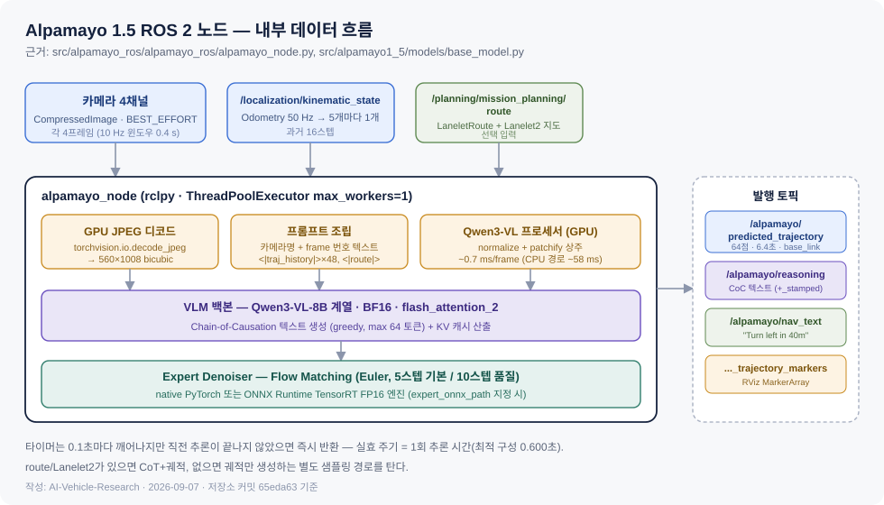
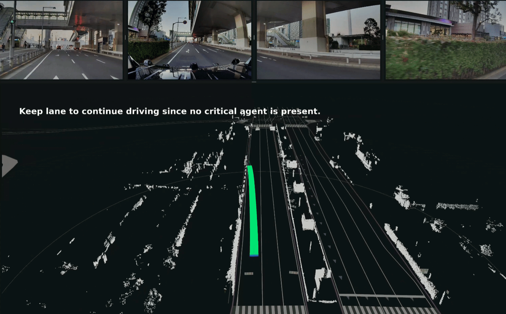
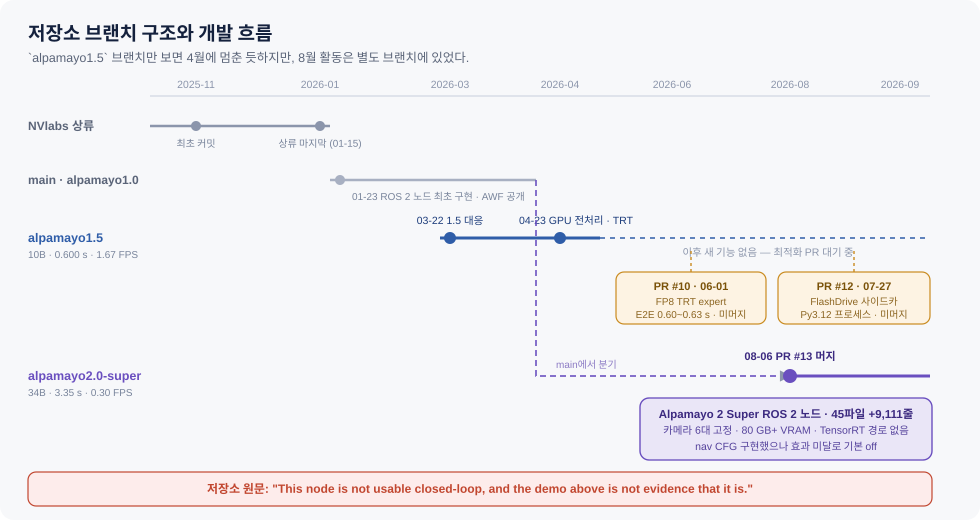
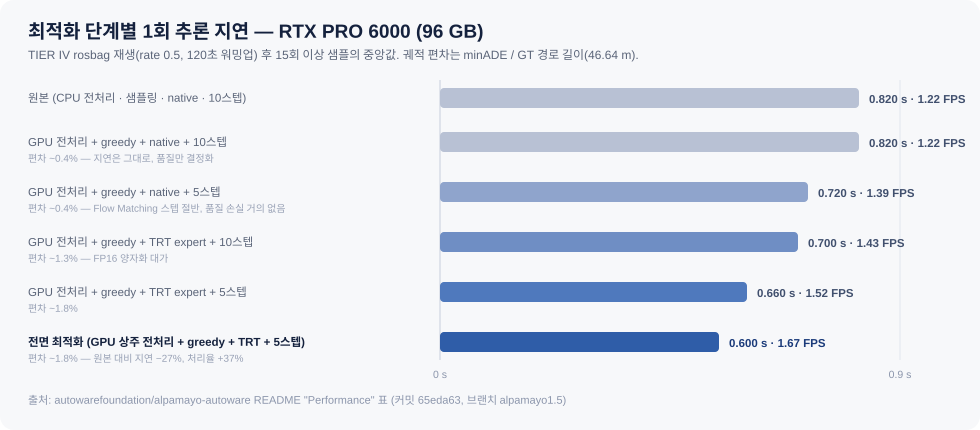

# TIER IV × NVIDIA Alpamayo — Autoware에 추론형 VLA를 얹다

- **작성일**: 2026-09-07 (2026-09-08 보강 — `alpamayo2.0-super` 브랜치와 열린 PR 반영)
- **조사 범위**: TIER IV·NVIDIA 협력 발표(2026-03), `autowarefoundation/alpamayo-autoware` 저장소 **전 브랜치** 코드, Alpamayo 1.5·2 Super 모델 카드, Co-MLOps × Cosmos 기술 보고, Isuzu L4 버스 및 TIER IV 자체 E2E 모델 트랙
- **1차 자료**: 저장소 소스 코드 전량(브랜치 `alpamayo1.5` 커밋 `65eda63`, `alpamayo2.0-super` 커밋 `b8747df`) · 이슈·PR 13건 · PRNewswire 보도자료 원문 2건 · Hugging Face 모델/데이터셋 카드 3건 · TIER IV 공식 기술 업데이트 · Autoware Foundation Discussion #6747
- **표기 규칙**: 모든 사실 문장에 근거를 병기한다.
  - 💻 저장소 코드에서 직접 확인 (파일:줄 표기)
  - 🔍 1차 출처 원문 직접 확인
  - ✅ 복수 출처 교차검증
  - 📰 서드파티 매체 보도
  - ⚠️ 미확인·추정

> **⚠️ 미리 알림 — 이 보고서가 뒤집은 통설 4가지**
> 1. "TIER IV가 Alpamayo를 Autoware에 통합해 차가 그걸로 주행한다" → **아니다.** 노드는 자기 네임스페이스로만 발행하고 Autoware 플래너·제어를 대체하지 않는다 (💻 §5.3).
> 2. "Alpamayo는 diffusion 모델이다" → 코드상 실체는 **Flow Matching(Euler 적분)** 이다 (💻 §4.2).
> 3. "모델 가중치는 이제 상용 가능하다" → Alpamayo 2 Super HF 카드는 그렇지만, **1.5 카드와 저장소 README는 여전히 비상용**이다 (🔍 §9.1).
> 4. "저장소 개발은 4월에 멈췄다" → 초판의 오독이었다. **8월에 Alpamayo 2 Super 노드가 별도 브랜치로 머지**됐고, 그쪽은 더 느리다 — 3.35초 / 0.30 FPS (💻 §5.5).

---

## 1. 한눈 요약 — 판단 3줄

1. **이 협력의 실물은 "모델 통합"이 아니라 "관찰 창구"다.** TIER IV가 만든 것은 Autoware의 카메라·오도메트리·경로 토픽을 읽어 궤적과 자연어 추론을 별도 토픽으로 뱉는 ROS 2 노드 한 개다. 주행 제어 경로에는 손대지 않았다 (💻 §5).
2. **막는 것은 성능이다.** 최적화를 다 넣어도 1회 추론 0.600초 = 1.67 FPS. Autoware 제어 루프가 요구하는 주기와 두 자릿수 배 차이가 난다. 그래서 "플래너"가 아니라 "설명·감독 레이어"에 머무를 수밖에 없다 (🔍 §6).
3. **진짜 자산은 데이터 쪽 절반이다.** Alpamayo 노드가 데모 수준인 것과 달리, Cosmos × Co-MLOps 조합은 이미 수치로 증명된 성과(개 검출 IoU 0.671 → 0.893)를 내고 있다. 이쪽이 TIER IV의 L4 상용화에 실제로 기여하는 축이다 (🔍 §7).

| 질문 | 답 | 근거 |
|---|---|---|
| 누가 코드를 썼나 | ROS 2 패키지는 TIER IV 엔지니어 2인이 작성 | 💻 `package.xml` 관리자 `shintaro.sakoda@tier4.jp`, `yukihiro.saito@tier4.jp` |
| Autoware 본체에 머지됐나 | 아니다. Autoware Foundation 조직 아래 **별도 포크 저장소** | 🔍 [Discussion #6747](https://github.com/orgs/autowarefoundation/discussions/6747) |
| 어느 모델을 쓰나 | `nvidia/Alpamayo-1.5-10B` 하드코딩 | 💻 `alpamayo_node.py:53` |
| 차를 움직이나 | 아니다. `/alpamayo/*` 네임스페이스로만 발행 | 💻 저장소 전체에 `scenario_planning` 문자열 0건 |
| 프로덕션 가능한가 | 저장소가 명시적으로 부정 | 🔍 README "not intended for use in production environments" |
| 그럼 개발은 멈췄나 | 아니다. 2026-08-06 **Alpamayo 2 Super 노드**가 별도 브랜치로 머지 | 🔍 PR #13, 💻 `alpamayo2.0-super` |
| 2 Super는 실시간인가 | 더 느리다. **3.35초 / 0.30 FPS**, 80 GB+ VRAM | 🔍 README "This node is not usable closed-loop" |

---

## 2. 타임라인 — 8개월 만에 벌어진 일

| 시점 | 사건 | 근거 |
|---|---|---|
| 2025-10-30 | Alpamayo-R1 논문 arXiv 공개 (NVIDIA, 저자 42인) | 🔍 [arXiv:2511.00088](https://arxiv.org/abs/2511.00088) |
| 2025-10 | Physical AI AV 데이터셋 v25.10 공개 (1,700시간 / 25개국 / 2,500+ 도시 / 306,152 클립 / 133 TB) | 🔍 [HF 데이터셋 카드](https://huggingface.co/datasets/nvidia/PhysicalAI-Autonomous-Vehicles) |
| 2025-11-18 | NVlabs 상류 저장소 최초 커밋 (Boris Ivanovic) | 💻 `git log` `08a2460` |
| 2026-01-23 | **TIER IV가 ROS 2 노드 구현을 올리고 Autoware Foundation 조직에 포크 공개** | 💻 커밋 `8328103` (Yukihiro Saito) · 🔍 Discussion #6747 |
| 2026-03-16~19 | NVIDIA GTC 2026 (산호세) | ✅ 보도자료 + 매체 |
| 2026-03-18 | TIER IV·NVIDIA 협력 공식 발표 (Alpamayo → Autoware, Cosmos → Co-MLOps) | 🔍 [PRNewswire](https://www.prnewswire.com/news-releases/tier-iv-accelerates-ai-based-level-4-autonomous-driving-with-nvidias-reasoning-based-ai-and-world-foundation-models-302717091.html) |
| 2026-03-22~25 | Alpamayo **1.5** 대응 코드 수정, Lanelet2 경로 기반 내비 텍스트 구현 | 💻 커밋 `abe1ab1`~`d966583` (Shintaro Sakoda) |
| 2026-03-25 | Isuzu·TIER IV·NVIDIA L4 버스(Erga 디젤/EV) 발표 | 📰 [just-auto](https://www.just-auto.com/news/isuzu-deploys-level-4-autonomous-buses/) |
| 2026-04-21~23 | GPU 상주 전처리 + TensorRT expert 엔진 최적화 머지 | 💻 커밋 `a405214`, `e76d607`, `65eda63` |
| 2026-05-25 | 커뮤니티 PR #9 "dp stack adaptor" 제출 (미머지) | 🔍 GitHub PR |
| 2026-05-31 | Alpamayo 2 Super (34B) GTC Taipei 발표 | 🔍 [NVIDIA 뉴스룸](https://nvidianews.nvidia.com/news/nvidia-alpamayo-2-super-robotaxis) |
| 2026-06-01 | PR #10 "FP8 TRT expert engine" 제출 (미머지) | 🔍 GitHub PR |
| 2026-07-27 | 이슈 #11 / PR #12 — FlashDrive 가속 경로 제안 (미머지) | 🔍 GitHub |
| 2026-08-04~05 | Alpamayo 2 Super 상용 공개 (OpenMDW-1.1) | 🔍 [NVIDIA 블로그](https://blogs.nvidia.com/blog/alpamayo-2-super-open-model-now-available/) |
| **2026-08-06** | **PR #13 머지 — `alpamayo2.0-super` 브랜치에 Alpamayo 2 Super ROS 2 노드 추가 (45파일, +9,111줄)** | 💻 `git log` · 🔍 GitHub PR #13 |
| 2026-08-07 | TIER IV, Co-MLOps × Cosmos 기술 보고 공개 | 🔍 [TIER IV 기술 업데이트](https://tier4.co.jp/en/updates/technology/20260807-comlops-dataset-foundation-for-autonomous-driving-with-nvidia-cosmos) |
| 2026-08-26 | TIER IV, Automotive World 2026 출품 발표 — **자체 Reference E2E AI 모델 + Jetson Orin 실증** | 🔍 [PRNewswire](https://www.prnewswire.com/news-releases/tier-iv-to-showcase-integrated-ai-data-and-computing-solution-for-sdvs-at-automotive-world-2026-302859969.html) |
| 2026-09-09~11 | Automotive World 2026 (마쿠하리 멧세) — 위 실증 전시 | 🔍 동상 |

**읽는 법**: 저장소는 브랜치로 세대를 나눈다 — `alpamayo1.0` / `alpamayo1.5` / `alpamayo2.0-super` / `main` (💻 GitHub API). `alpamayo1.5` 브랜치만 보면 4월에 멈춘 것처럼 보이지만, 실제로는 **8월에 2 Super 노드가 별도 브랜치로 들어왔다.** 1.5 라인은 최적화(FP8·FlashDrive) PR이 열린 채 대기 중이고, 개발 축은 2 Super로 옮겨갔다.

---

## 3. 등장 요소 정리 — 무엇이 무엇인지

발표문에 나오는 이름들이 서로 다른 계층에 속해 있어 뒤섞이기 쉽다. 분리하면 이렇다.

### 3.1 NVIDIA 쪽

| 이름 | 계층 | 하는 일 | 근거 |
|---|---|---|---|
| **Alpamayo** | AI 모델 (VLA) | 카메라 영상 → 자연어 추론 + 미래 궤적 | 🔍 보도자료 "open portfolio of AI models, simulation frameworks and physical AI datasets" |
| **Cosmos** | World Foundation Model 플랫폼 | 합성 데이터 생성·증강·검색 | 🔍 보도자료 |
| **DRIVE AGX Thor / Hyperion** | 차량 탑재 하드웨어 | L4 연산 플랫폼 | 🔍 [NVIDIA 뉴스룸 2026-03-16](https://nvidianews.nvidia.com/news/drive-hyperion-level-4) |
| **Physical AI AV Dataset** | 데이터셋 | 1,700시간 공개 주행 데이터 | 🔍 HF 데이터셋 카드 |

### 3.2 TIER IV 쪽

| 이름 | 계층 | 하는 일 | 근거 |
|---|---|---|---|
| **Autoware** | 오픈소스 AD 스택 (ROS 2) | 인지·계획·제어 모듈형 파이프라인 | 🔍 [autoware.org](https://autoware.org/) |
| **Co-MLOps** | 데이터·MLOps 플랫폼 | 2024년 출범, 글로벌 데이터 공유·자동 라벨링 | 🔍 보도자료 + TIER IV 기술 업데이트 |
| **`alpamayo-autoware`** | ROS 2 패키지 (포크) | 이번 협력의 코드 산출물 | 💻 저장소 |

### 3.3 두 회사 대표의 발언

> "To advance autonomous driving to the next generation, it is necessary to move toward reasoning-based systems capable of navigating the unpredictability of the real world." — Shinpei Kato, TIER IV 창업자·CEO (🔍 보도자료)

> "By integrating NVIDIA Alpamayo into Autoware and utilizing NVIDIA Cosmos within their Co-MLOps platform, TIER IV is establishing a powerful blueprint for the ecosystem." — Marco Pavone, NVIDIA Autonomous Vehicle Research 디렉터 (🔍 보도자료)

---

## 4. Alpamayo 모델 — TIER IV가 가져다 쓴 물건의 실체

### 4.1 세대 비교

| | Alpamayo 1 Nano | **Alpamayo 1.5** | **Alpamayo 2 Super** |
|---|---|---|---|
| 파라미터 | 10B | 약 10.5B | 34B |
| 구성 | — | Cosmos-Reason2 백본 8.2B + flow matching 액션 디코더 2.3B | **32B Qwen3-VL 백본 + 2.3B flow matching 액션 expert** |
| 백본 계열 | — | Qwen3-VL 계열 (코드 기본값 `Qwen/Qwen3-VL-8B-Instruct`) | Qwen3-VL (Cosmos 3 Super Reasoner 계열) |
| 카메라 | — | 4대, 설정 가능 | **정확히 6대**, ID `(0,1,2,3,5,6)` 고정 |
| 궤적 출력 | — | 64점 / 6.4초 | 64점 / 0.1~6.4초 |
| 가중치 크기 | — | 약 21~22 GB | **약 72 GB (bf16, 32파일)** |
| 최소 GPU | — | 24 GB VRAM | **80 GB+ VRAM** (피크 69.1 GiB) |
| TensorRT expert | — | 있음 (`expert_onnx_path`) | **없음** |
| 공개 | 2026-01 전후 | — | 발표 2026-05-31 / 상용 공개 2026-08-04~05 |
| 상용 사용 | — | **비상용** ("Commercial licensing available upon request") | **OpenMDW-1.1, 상용 허용** |
| Autoware 노드 | `alpamayo1.0` 브랜치 | `alpamayo1.5` 브랜치 | **`alpamayo2.0-super` 브랜치** (2026-08-06) |
| 근거 | 🔍 보도자료 | 🔍 [HF 모델 카드](https://huggingface.co/nvidia/Alpamayo-1.5-10B) · 💻 `base_model.py:211` | 🔍 [HF 모델 카드](https://huggingface.co/nvidia/Alpamayo2-Super) · 💻 `alpamayo2.0-super` README |

액션 디코더가 flow matching이라는 점은 1.5에서는 코드를 읽어야 알 수 있었지만, 2 Super에 와서는 저장소 문서가 "32B Qwen3-VL backbone + 2B flow-matching action expert"라고 직접 쓴다 (💻 `alpamayo2.0-super` README). §4.2의 판정이 문서로 확인된 셈이다.

보도자료는 TIER IV가 "Alpamayo 1의 얼리 어답터"라고 쓰지만(🔍), 저장소 코드는 `nvidia/Alpamayo-1.5-10B`를 하드코딩하고 브랜치명도 `alpamayo1.5`다(💻 `alpamayo_node.py:53`). 3월 발표 직전 커밋 `abe1ab1` "Fixed the code for Alpamayo-1.5"가 그 전환점이다. **실제 통합 대상은 1.5다.**

### 4.2 입출력과 내부 구조

- **입력**: 멀티 카메라 RGB(기본 4대), 텍스트 지시, 자차 운동 이력. 이미지는 1080×1920을 받아 프로세서가 320×576으로 다운샘플. 시간 창은 10 Hz × 0.4초 (🔍 HF 모델 카드).
- **출력**: 추론 텍스트 + **6.4초 궤적 = 10 Hz 64 웨이포인트**. 자차 좌표계의 위치(x,y,z)와 회전 행렬 (🔍 HF 모델 카드, 💻 `alpamayo_node.py:524-576`).
- **학습 데이터**: 80,000시간 멀티카메라 주행 영상 + 300만 건 Chain-of-Causation 추론 주석 (🔍 HF 모델 카드).
- **액션 디코더의 실체**: 매체와 모델 카드가 "diffusion"이라 부르지만, 코드에서 실행되는 클래스는 `FlowMatching`이고 적분법은 `euler`, 참조 논문은 Flow Matching for Generative Modeling(arXiv:2210.02747)이다 (💻 `src/alpamayo1_5/diffusion/flow_matching.py:22-50`). 확산 계열의 넓은 범주 안에 있지만, 정확히는 flow matching이다.

### 4.3 Chain of Causation이 일반 CoT와 다른 점

Alpamayo-R1 논문은 CoC를 "자동 라벨링과 human-in-the-loop 파이프라인으로 만든, 주행 행동과 정렬된 결정 근거형 인과 연결 추론 트레이스"로 정의한다 (🔍 arXiv:2511.00088). 일반 CoT가 "그럴듯한 설명 문장"을 만드는 데 그치는 반면, CoC는 **실제로 취한 궤적과 짝지어 라벨링**되어 추론과 행동의 일관성 자체를 학습·평가 대상으로 삼는다.

논문이 보고한 수치 (🔍 arXiv:2511.00088 초록):

| 지표 | 개선 |
|---|---|
| 난도 높은 케이스 계획 정확도 | +12% |
| 폐루프 시뮬레이션 근접 조우율 | −35% |
| RL 사후학습 후 추론 품질 | +45% |
| 추론–행동 일관성 | +37% |
| 온보드 지연 | 99 ms |

**주의**: 이 99 ms는 논문의 온보드 측정치이며, 뒤에 나오는 저장소 벤치마크 600 ms와는 측정 조건이 다르다 (§6.2에서 다룬다).

---

## 5. `alpamayo-autoware` 코드 해부



> 그림 출처: 본 보고서 작성. 근거는 저장소 커밋 `65eda63`의 `alpamayo_node.py`, `helper.py`, `base_model.py`, `diffusion/flow_matching.py`.

### 5.1 저장소의 정체

- `NVlabs/alpamayo`의 **포크**. 상류의 패키지명은 `alpamayo_r1`이었고, TIER IV가 이를 `alpamayo1_5`로 갈아끼우면서 ROS 2 패키지를 새로 추가했다 (💻 `git diff e0e2ac3 HEAD --stat`: `src/alpamayo_r1/*` 삭제, `src/alpamayo_ros/*` 신규 4,938줄 추가).
- 생성 2026-01-23, 마지막 푸시 2026-08-06, 스타 140, 포크 14, 언어 Python, 코드 라이선스 Apache-2.0 (🔍 GitHub API).
- **ROS 2 패키지 `alpamayo_ros`는 전적으로 TIER IV가 작성했다.** `package.xml`의 관리자가 `shintaro.sakoda@tier4.jp`, `yukihiro.saito@tier4.jp`이고, 상류 NVIDIA 커밋(Boris Ivanovic, Yu Wang, Yurong You)은 2026-01-15에서 끊긴다 (💻 `package.xml`, `git log`).

### 5.2 노드가 실제로 하는 일

`alpamayo_node.py` 646줄의 동작 순서 (💻 파일:줄 병기):

1. **구독** — 카메라 `CompressedImage` N개(기본 4개, BEST_EFFORT QoS), `/localization/kinematic_state` Odometry, `/planning/mission_planning/route` LaneletRoute (`:150-187`).
2. **버퍼링** — 카메라는 JPEG 바이트를 그대로 `torch.uint8`로 적재해 CPU 디코드를 회피. 주석에 "Saves ~150 ms/frame vs cv2.imdecode + CPU copy" (`:359-364`). 오도메트리는 50 Hz를 5개마다 1개씩 추려 10 Hz 16스텝 이력으로 만든다 (`:92-96`, `:395-399`).
3. **GPU 전처리** — `torchvision.io.decode_jpeg(device="cuda")` → 560×1008 bicubic 리사이즈. 픽셀이 GPU를 떠나지 않는다 (`:381-386`).
4. **프롬프트 조립** — 카메라별 표시명("Front camera")과 프레임 번호를 텍스트로 끼워 넣고, `<|traj_history|>` 48개 토큰과 `<|route_start|>…<|route_end|>` 구간을 붙인다. 학습 때 쓴 포맷을 그대로 재현하는 구조다 (💻 `helper.py:_build_image_content`, `create_message`).
5. **추론** — BF16 autocast로 VLM 롤아웃 + Flow Matching 샘플링. 내비 텍스트가 있으면 CoT까지 생성하는 `..._cfg_nav` 경로, 없으면 궤적만 뽑는 경로로 갈린다 (`:478-492`).
6. **발행** — `autoware_planning_msgs/Trajectory`(64점, `dt=0.1`, frame_id `base_link`), CoC 텍스트, 내비 텍스트, RViz 마커 (`:498-519`).

**주목할 구현 디테일 2가지**

- 궤적 점의 속도는 인접 점 간 거리 ÷ 0.1초로 유한차분해 채우고, **가속도·헤딩 레이트는 전부 0.0으로 채운다** (💻 `:555-566`). 실제 제어기에 물릴 것을 전제한 메시지가 아니다.
- 타이머는 0.1초마다 깨어나지만 직전 추론이 끝나지 않았으면 그냥 반환한다 (💻 `:346-348`). 즉 파라미터의 `inference_period_sec=0.1`은 상한일 뿐, **실효 주기는 추론 시간 그 자체**다. launch 파일 기본값은 아예 1.0초로 잡혀 있다 (💻 `launch/alpamayo.launch.py:32`).

### 5.3 판정 — Autoware 플래너를 대체하는가


> 그림 출처: 본 보고서 작성. Autoware 플래닝 인터페이스 서술은 [Autoware 공식 문서](https://tier4.github.io/autoware-documentation/latest/design/autoware-architecture/planning/) 기준.

**대체하지 않는다.** 근거 셋:

1. 저장소 전체를 `scenario_planning`으로 grep하면 **0건**이다 (💻 커밋 `65eda63`). Autoware가 제어로 넘기는 토픽은 `/planning/scenario_planning/trajectory`인데(✅ Autoware 문서 및 커뮤니티 Discussion), 노드는 이 이름을 발행하지도, 리맵하지도 않는다.
2. 발행 토픽 기본값이 전부 `/alpamayo/` 네임스페이스다 (💻 `:54-57`).
3. 궤적 길이도 다르다. Autoware 플래닝이 제어에 넘기는 trajectory는 "일반적으로 10초 길이, 0.1초 해상도"인데(🔍 Autoware 문서), Alpamayo 출력은 6.4초 64점이다 (🔍 HF 모델 카드, 💻 코드).

#### "스택 교체"와 "관찰 창구"의 차이

두 표현의 갈림길은 하나다 — **모델 출력이 차량을 움직이느냐.**

**스택 교체라면** 이렇게 된다. Autoware 파이프라인은 원래 이 흐름이다.

```
Sensing → Perception → Planning → /planning/scenario_planning/trajectory → Control → 조향·가감속
```

end-to-end VLA를 "통합"한다는 말을 들으면 보통 이걸 상상한다. Perception·Planning 모듈들을 걷어내고 **카메라 → 모델 → 궤적** 한 방으로 대체하는 것. 모델이 낸 궤적이 그대로 `scenario_planning/trajectory` 자리에 들어가고 Control이 그걸 따라간다. 차가 모델 판단대로 움직인다.

**실제로 된 것은 이렇다.**

```
Sensing ─┬→ Perception → Planning → scenario_planning/trajectory → Control → 차량 주행
         │                                                  (여기까지 기존 그대로)
         └→ alpamayo_node → /alpamayo/predicted_trajectory  → RViz 화면
                          → /alpamayo/reasoning             → 텍스트 로그
```

노드는 카메라·오도메트리·경로 토픽을 **읽기만** 하고, 결과를 `/alpamayo/*`라는 **아무도 구독하지 않는 별도 이름**으로 뱉는다. 소비자는 RViz(사람 눈)뿐이다. 차는 여전히 기존 규칙 기반 플래너로 간다.

**교체하려면 무엇이 더 필요한가.** 코드상 세 가지가 전부 안 돼 있다.

| 필요한 것 | 현재 상태 |
|---|---|
| 토픽 이름을 `/planning/scenario_planning/trajectory`로 리맵 | 저장소 전체에 그 문자열 0건 (💻) |
| 궤적에 가속도·헤딩 레이트 채우기 | 전부 `0.0` 하드코딩 — 제어기가 쓸 수 없다 (💻 `:563-566`) |
| 제어 루프 주기 맞추기 | 1.67 FPS. 두 자릿수 배 모자람 (🔍 §6) |

세 번째가 근본 원인이다. **느려서 못 물리고, 못 물리니 관찰용으로 남는다.**

**이게 나쁜 결론은 아니다.** L4 안전 논증에서 요구되는 것은 "왜 그렇게 판단했는가"의 기록이다. 관찰 창구는 그걸 만든다 — 기존 스택의 검증된 안전성은 건드리지 않은 채, 매 장면에 자연어 근거를 붙여 로그로 남긴다. 사고·해제 구간 사후 분석과 롱테일 장면 태깅에 곧바로 쓰인다. 교체를 못 해서 관찰에 머문 것이 아니라, **교체 이전 단계로서 관찰이 먼저 필요한 것**에 가깝다. 다만 발표문의 "integrating it into Autoware"를 스택 교체로 읽으면 실제와 어긋난다.

즉 이 노드는 Autoware의 센서·경로 토픽을 **읽기만 하는 병렬 관찰자**다. 아래 데모 화면이 그 성격을 그대로 보여준다 — 상단은 4개 카메라 입력, 하단은 기존 Autoware의 LiDAR 점군·차선 지도 위에 Alpamayo가 그린 초록 궤적과 자연어 판단이 오버레이된 RViz 화면이다.



> 그림 출처: [autowarefoundation/alpamayo-autoware `images/alpamayo-autoware.gif`](https://github.com/autowarefoundation/alpamayo-autoware) 첫 프레임 (Apache-2.0). 화면 문구 "Keep lane to continue driving since no critical agent is present."가 `/alpamayo/reasoning`으로 나가는 CoC 텍스트다.

### 5.4 TIER IV가 추가한 것 — 두 갈래

**(A) Autoware 접속 계층 (2026-01, 03)**
- ROS 2 노드 전체 (646줄)
- Lanelet2 지도 + `LaneletRoute`를 읽어 "Turn left in 40m" / "Continue straight" 같은 내비 지시문을 생성하는 로직 (💻 `:287-337`). 모델이 학습 때 받았던 `route` 조건을 Autoware의 미션 플래너 출력으로부터 합성해 주는 어댑터다. 이 저장소에서 가장 Autoware-특화된 부분.

**(B) 성능 최적화 계층 (2026-04, 기여자 Max-Bin)**
- GPU 상주 전처리 경로
- Greedy 디코딩 + 5스텝 기본값 ("5-step Euler keeps trajectory ADE within ~1% of 10-step but cuts ~94 ms / inference", 💻 `:72-74`)
- Expert denoiser만 ONNX로 뽑아 **ONNX Runtime의 TensorRT Execution Provider**로 돌리는 경로 (💻 `trt/expert_runtime.py:44-55`). VLM 본체는 PyTorch 그대로 남는다 — "TensorRT로 모델을 변환했다"는 서술은 부정확하고, 정확히는 **디노이저 서브그래프만** 대체한 것이다.
- 빌드 스크립트는 SmoothQuant + INT8 캘리브레이션까지 지원하지만, 노드는 `enable_int8=False, enable_fp16=True`로 호출한다 (💻 `alpamayo_node.py:204-209`).

---

### 5.5 2026-08: Alpamayo 2 Super 노드가 별도 브랜치로 들어왔다



> 그림 출처: 본 보고서 작성. 근거는 GitHub API 브랜치 목록, `git log`, PR #10·#12·#13 메타데이터 (2026-09-08 확인).

`alpamayo1.5` 브랜치만 보면 개발이 4월에 멈춘 것처럼 보이지만, 저장소는 브랜치로 세대를 관리한다 — `main` · `alpamayo1.0` · `alpamayo1.5` · `alpamayo2.0-super` (💻 GitHub API).

2026-08-06, PR #13 "feat: add Alpamayo 2 Super ROS 2 node"가 `alpamayo2.0-super`로 머지됐다. 작성자 Yuto Takeuchi, 머지 Yukihiro Saito(TIER IV). **45파일 +9,111줄** (🔍 GitHub PR #13). 1.5 노드는 건드리지 않는 순수 추가다.

**구성 방식** — NVIDIA `NVlabs/alpamayo2`의 추론 패키지를 `src/alpamayo2_super/`로 **벤더링**했다. `UPSTREAM.md`에 업스트림 커밋 해시(`9596749`, 2026-08-03)와 이탈 사항을 기록해 둔다: 데이터셋 리더 모듈 제거, 그리고 **업스트림이 요구하는 Python 3.12를 3.10으로 낮춰 이식**했다 — ROS 2 Humble이 3.10을 쓰기 때문이며, "35개 모듈 전부 3.10에서 파싱되고 `Self`·`tomllib`·`except*`·`StrEnum` 등을 쓰지 않는다"는 확인 근거까지 남겼다 (💻 `UPSTREAM.md`).

**1.5와 달라진 점** (💻 `alpamayo2.0-super` README)

| | Alpamayo 1.5 노드 | Alpamayo 2 Super 노드 |
|---|---|---|
| GPU 요구 | 24 GB+ | **80 GB+**, 피크 69.1 GiB |
| 가중치 | ~21 GB | ~72 GB |
| 카메라 | 4대, 설정 가능 | **정확히 6대** `(0,1,2,3,5,6)` 오름차순 |
| CoT 토큰 예산 | 64 | **256** |
| Flow matching 스텝 | 5 (기본) | 10 |
| 추론 주기 기본값 | 0.1초 (launch 1.0) | **2.0초** |
| TensorRT | expert 서브그래프 | **없음** |
| Autoware 워크스페이스 | 필요 | **필수** — 모듈 로드 시점에 `autoware_planning_msgs`를 import하므로 순수 ROS 2 Humble에서는 노드가 뜨기 전에 실패 |

**지연** — RTX PRO 6000 Blackwell(96 GB) 1장, 카메라 6대 10 Hz, **304회 측정** (🔍 README):

| 항목 | 값 |
|---|---|
| 모델 로드 | 28.6 초 |
| 추론 | **평균 3.35 s · 중앙값 3.29 s · p90 3.97 s · 최대 6.24 s** |
| 피크 VRAM | 69.1 GiB |

1.5의 0.600초에서 **5.6배 느려졌다.** 파라미터 3.4배, 카메라 1.5배, CoT 토큰 예산 4배가 겹친 결과다.

**저장소가 스스로 못박은 문장**이 §5.3의 판정과 정확히 같다 (🔍 README 원문):

> "This node is not usable closed-loop, and the demo above is not evidence that it is."
> (이 노드는 폐루프로 쓸 수 없고, 위의 데모가 그 반대의 증거가 되지도 않는다.)

이어지는 서술도 같은 취지다 — "초 단위 추론에서는 궤적이 발행되는 시점에 이미 낡았기 때문에, trajectory 헤더에 '현재'가 아니라 **입력 `t0` 타임스탬프**를 실어 소비자가 그 낡음을 직접 측정할 수 있게 했다." 관찰 창구라는 성격을 메시지 설계에까지 반영한 것이다.

**주목할 구현 판단 2가지**

- **속도는 모델 입력이 아니다.** 액션 스페이스가 16포즈 이력을 미분해 추정한다. 그래서 이력 프레임이 틀리면 롤아웃 전체가 조용히 망가진다 — 노드는 매 첫 추론마다 `implied_v0`를 오도메트리 `odom_v0`와 대조해 로그로 남긴다 (💻 README).
- **`skip_on_bad_history` / `drop_bad_trajectory`가 기본 `true`.** 이력 불변식을 못 지키면 그 틱을 건너뛰고, 차량 위치에서 시작하지 않는 롤아웃은 버린다. 모델 출력을 그대로 믿지 않는 방어 코드가 노드 쪽에 들어가 있다 (💻 파라미터 기본값).

**내비게이션 조건부 생성(nav CFG)은 실패로 기록됐다.** 2B expert는 VLM이 만든 KV 캐시로만 조건이 걸리므로, 경로 지시를 주려면 프롬프트에 문장으로 넣는 수밖에 없다. TIER IV는 VLM을 지시 있음/없음 두 번 프리필해 `v = unguided + w·(guided − unguided)`로 외삽하는 방식을 구현했고, 비용까지 측정했다 — 지연 3.35 → **5.2초**, VRAM 69.4 → 70.9 GiB. 업스트림 데모가 80 GB GPU 2장을 요구하는 것을 96 GB 1장으로 줄인 성과다. 그런데 **기본값은 off**다. 측정 결과가 이렇다 (🔍 README 원문 요지):

- 가중치를 체크포인트 값의 2배(`6`)로 올려도 궤적이 **1 m 미만** 움직인다
- 방향이 지시와 일치하지 않는다 — 한 프레임에서 "Turn left"와 "Turn right"가 **같은 방향**으로 궤적을 움직였다
- 카메라를 이기지 못한다 — 좌회전 중에 우회전을 지시해도 좌회전 궤적이 나온다
- 어느 쪽이든 CoC 텍스트는 동일하다

**이 기록의 값어치**: 되는 것만 발표하는 보도자료와 달리, 저장소는 안 되는 것을 수치와 함께 남겼다. VLA에 언어로 경로를 지시하는 방식이 현시점에서 조향 수단이 못 된다는 걸 실측으로 보여준 몇 안 되는 공개 자료다.

### 5.6 열린 PR — 어디로 가려 하는가

머지되지 않은 채 열려 있는 제안들이 이 스택의 다음 관심사를 드러낸다 (🔍 GitHub, 2026-09-08 확인).

| # | 제안 | 상태 | 내용 |
|---|---|---|---|
| #10 | FP8 TRT expert engine | 열림 (2026-06-01, Max-Bin) | ORT/INT8 경로를 NVIDIA ModelOpt FP8 + TensorRT 엔진으로 교체. expert 단계 **PyTorch bf16 14.8 ms → TRT FP16 9.1 ms → FP8 7.3 ms(2.0배)**, 엔진 2.29 GB. E2E는 **0.64~0.72 s → 0.60~0.63 s**(40~90 ms, 6~12% 절감), 궤적 편차 max\|Δ\|=0.023, CoT 텍스트 동일 |
| #12 / #11 | FlashDrive 가속 경로 | 열림 (2026-07-27, gautamjain1009) | 외부 추론 가속 스택을 **Python 3.12 사이드카 프로세스**로 띄우고 ROS 2 노드(3.10)가 HTTP로 통신. 기본 `use_flashdrive:=false`. 메인테이너 재현은 HF 접근·GPU 문제로 대기 중 |
| #9 | dp stack adaptor | 열림 (2026-05-25, Owen-Liuyuxuan) | 다른 주행 스택 어댑터 |
| #8 | AWSIM 설정 요청 | 열림 (2026-05-09, awesthue-iav) | 시뮬레이터에서 돌리기 위한 설정 요청 |

읽히는 것 셋. ① 1.5 라인의 남은 여지는 **양자화 정밀도**(FP16 → FP8)뿐이고, 그마저 6~12%다. ② 실시간성 격차를 저장소 안에서 못 메우니 **외부 가속 스택을 프로세스 분리로 붙이려는 시도**(#12)가 나왔다 — Python 버전이 달라 HTTP로 이어붙일 만큼 절박한 접근이다. ③ 시뮬레이터·타 스택 요청은 있는데 4개월 넘게 머지가 안 된다. 메인테이너 대역폭이 2 Super 쪽으로 옮겨간 정황이다.

## 6. 성능 — 숫자를 정직하게 읽기



> 그림 출처: 본 보고서 작성. 수치는 저장소 README "Performance" 표 (🔍 커밋 `65eda63`).

### 6.1 벤치마크 원문

RTX PRO 6000(96 GB, SM120), 카메라 4대 × 시간 4프레임, 1080×1920. **TIER IV rosbag**을 `rate=0.5`로 재생하며 노드 로그의 "Alpamayo inference completed in X.XXs"를 15회 이상 수집한 중앙값 (🔍 README).

| 구성 | 지연 | FPS | 궤적 편차 |
|---|---|---|---|
| 원본 (CPU 전처리·샘플링·native·10스텝) | 0.820 s | 1.22 | 기준 |
| GPU 전처리 + greedy + native + 10스텝 | 0.820 s | 1.22 | ~0.4% |
| GPU 전처리 + greedy + native + 5스텝 | 0.720 s | 1.39 | ~0.4% |
| GPU 전처리 + greedy + TRT + 10스텝 | 0.700 s | 1.43 | ~1.3% |
| GPU 전처리 + greedy + TRT + 5스텝 | 0.660 s | 1.52 | ~1.8% |
| **전면 최적화** | **0.600 s** | **1.67** | **~1.8%** |

읽어야 할 것: **5스텝 전환은 거의 공짜(편차 0.4% 유지, 100 ms 절감)지만, TRT FP16은 편차를 0.4% → 1.8%로 4배 넓히면서 60 ms를 산다.** 정밀도를 지연으로 바꾸는 교환이 명시적으로 드러난다.

### 6.2 논문 99 ms vs 저장소 600 ms

같은 모델 계열인데 6배 차이가 난다. 두 수치는 다른 것을 재고 있다.

| | 논문 99 ms | 저장소 600 ms |
|---|---|---|
| 대상 | Alpamayo-R1 온보드 구성 | Alpamayo 1.5 10B, ROS 2 노드 end-to-end |
| 포함 범위 | ⚠️ 초록에 명시 없음 (액션 디코딩 중심으로 추정) | JPEG 디코드 → 프롬프트 조립 → VLM 텍스트 생성 → 궤적 샘플링 → 메시지 변환 전체 |
| 하드웨어 | ⚠️ 초록에 명시 없음 | RTX PRO 6000 데스크톱 GPU |
| 근거 | 🔍 arXiv:2511.00088 | 🔍 README |

**결정적 차이는 CoC 텍스트 생성이다.** 노드는 매 추론마다 최대 64토큰의 자연어 추론을 자기회귀로 뽑는다 (💻 `:82`, `:474`). 설명가능성이 이 협력의 핵심 가치인데, 그 설명을 만드는 비용이 곧 지연의 큰 몫이다. 설명을 포기하면 빨라지고, 유지하면 느리다.

### 6.3 그래서 어디에 쓸 수 있나

Autoware 플래닝이 제어에 넘기는 궤적은 0.1초 해상도로 갱신되는 실시간 신호다 (🔍 Autoware 문서). 1.67 FPS는 그 대역에 들어갈 수 없다. 현실적인 용처는 셋이다.

1. **오프라인 분석** — rosbag을 돌려 각 장면에 대한 자연어 판단 근거를 붙인다. 사고·해제 구간 사후 분석에 바로 쓰인다.
2. **온라인 감독 레이어** — 기존 플래너의 결정과 Alpamayo의 판단이 불일치하는 구간을 저속으로 감시해 플래그를 세운다.
3. **데이터 큐레이션** — 롱테일 장면 자동 태깅. 이건 §7의 Cosmos-Reason 역할과 정확히 겹친다.

저장소 스스로도 "Alpamayo 1.5 is a pre-trained reasoning model for research purposes and is not a complete autonomous driving stack. It is not intended for use in production environments."라고 못박는다 (🔍 README).

### 6.4 세대가 올라갈수록 더 느려진다

성능 격차가 시간이 가면 좁혀질 것이라 기대하기 쉽지만, 실측은 반대 방향이다.

| | Alpamayo 1.5 (2026-04) | Alpamayo 2 Super (2026-08) |
|---|---|---|
| 1회 추론 | 0.600 s (전면 최적화) | **3.35 s** (평균) |
| 처리율 | 1.67 FPS | **0.30 FPS** |
| 피크 VRAM | 24 GB급 | 69.1 GiB |
| 최적화 여지 | TRT FP8로 6~12% 추가 (PR #10, 미머지) | TensorRT 경로 자체가 없음 |
| 근거 | 🔍 `alpamayo1.5` README | 🔍 `alpamayo2.0-super` README (304회 측정) |

모델이 커지고(10B → 34B), 카메라가 늘고(4 → 6), CoC 토큰 예산이 늘면서(64 → 256) 지연은 5.6배가 됐다. **품질을 올리는 방향과 실시간성을 확보하는 방향이 정면으로 충돌한다.** 이 구조에서는 온보드 플래너로의 승격이 세대 진화만으로 저절로 오지 않는다 — 증류·양자화·전용 SoC 같은 별도의 축소 작업이 필요하다.

열린 PR들이 정확히 그 지점을 겨눈다. FP8 양자화(#10)는 6~12%를 벌고, FlashDrive 경로(#12)는 아예 다른 프로세스로 추론을 넘긴다 (§5.6). 저장소 안에서 짜낼 수 있는 폭이 거기까지라는 뜻이기도 하다.

---

## 7. 데이터 쪽 절반 — Cosmos × Co-MLOps

이쪽이 이 협력에서 실제로 성과 수치가 나오는 축이다. TIER IV 수석 엔지니어 Dan Umeda가 GTC 2026 세션 S81897에서 발표하고 2026-08-07 공식 기술 업데이트로 공개했다 (🔍 [TIER IV](https://tier4.co.jp/en/updates/technology/20260807-comlops-dataset-foundation-for-autonomous-driving-with-nvidia-cosmos)).

### 7.1 Co-MLOps의 기반

- 2024년 출범. 데이터 공유 + MLOps를 통합한 협업 프레임워크 (🔍 보도자료).
- 수집 차량 센서: LiDAR 4대(각 120° 커버리지) + 다중 화각 카메라 8대 (🔍 TIER IV).
- 수집 범위: 일본 **39개 도도부현, 127개 지점**. 도심·지방도·터널·공사구간·기상 변화 포함 (🔍 TIER IV).
- 자동 라벨링 기반 모델 **CoMET**(Collaborative Multi-stage Ensemble-based Teacher): 카메라·LiDAR 입력을 처리하는 12개 대규모 모델의 앙상블, mixture-of-experts 설계, TensorRT 배치 추론 지원. 파놉틱 분할·신호등 인식·3D 객체 검출을 생성 (🔍 TIER IV).
- 8단계 능동학습 루프: 자동 라벨링 → 데이터 태깅 → 데이터 공백 식별 → 데이터 생성 → 품질 검증 → 유사도 랭킹 → 불확실성 추정 → 프라이버시 익명화 (🔍 TIER IV).

### 7.2 Cosmos 3종의 배치

| 모델 | Co-MLOps에서의 역할 | 확인된 사양·성과 |
|---|---|---|
| **Cosmos Reason** | 검색·요약. 장면 설명·날씨·시간대·장소 유형·자차 거동을 구조화 JSON으로 출력. 자연어 텍스트 검색과 ISO 34504 기준 시나리오 태깅. 페타바이트급 영상 아카이브 처리 | 🔍 TIER IV |
| **Cosmos Predict 2.5** | 엣지케이스 생성. 텍스트·이미지·영상 프롬프트로 30초 영상 생성. 2B / 14B 버전 | 🔍 TIER IV |
| **Cosmos Transfer 2.5** | 데이터 증강. 주간→야간, 맑음→우천/설경 등 다시점 일관 변환. Co-MLOps 파놉틱 마스크로 사후학습해 도메인 격차 보정 | 2B 모델, 3D 차선·큐보이드 검출에서 최대 **+60%** 성능 향상 (🔍 TIER IV) |

### 7.3 증명된 수치 하나

노면에 누워 있는 사람, 소형 동물 같은 롱테일 대상은 실데이터로 학습이 안 된다. 합성 데이터를 섞은 결과 (🔍 TIER IV):

| 학습 데이터 | 개 검출 IoU |
|---|---|
| 실데이터만 (기준) | 0.671 |
| 실데이터 + Cosmos 합성 | **0.893** (+0.222) |

**이 보고서에서 확인한 유일하게 구체적인 "협력의 실효 성과"다.** Alpamayo 노드 쪽에는 이에 상응하는 주행 성능 개선 수치가 아직 공개되지 않았다 (⚠️).

### 7.4 다음 단계

TIER IV는 Cosmos 3로 이행하며 일본 주행 환경 특화 파인튜닝을 진행 중이라고 밝혔다. 계획: Cosmos 3 Nano 사후학습으로 엣지케이스 생성, 파인튜닝한 Gemma4-31B로 캡션 자동 변환, 7카메라 서라운드 다시점 영상 생성으로 확장, AutoQA·데이터 클렌징 AI 개발. 목표는 "엣지케이스 생성부터 자동 라벨링, AutoQA 품질보증까지 전 주기를 완전 자율로 도는 차세대 데이터 기반" (🔍 TIER IV).

---

## 8. 상용화 트랙 — Isuzu L4 버스, 그리고 자체 E2E 모델

Alpamayo 노드가 연구 단계인 것과 별개로, TIER IV의 L4 상용화는 다른 경로로 진행 중이다.

### 8.1 Isuzu L4 버스

- **조합**: Autoware 기반 TIER IV L4 소프트웨어 스택 + Isuzu Erga 버스 플랫폼(디젤/EV 양쪽) + NVIDIA DRIVE AGX Thor SoC 및 DRIVE Hyperion 플랫폼 (📰 just-auto, 🔍 NVIDIA 뉴스룸).
- **발표**: GTC 2026 기간, 2026-03-25 (📰 just-auto).
- **명분**: 일본의 운전자 부족 대응 (📰 just-auto).

> "Deploying Level 4 autonomous driving on both our Erga EV and diesel models ensures that we provide versatile, sustainable, and highly efficient solutions." — Hiroshi Sato, Isuzu SVP (📰 just-auto)

**미확인**: 구체 노선, 상용 운행 개시 시점, 초기 투입 대수는 어느 출처에도 공개되지 않았다 (⚠️). NVIDIA 뉴스룸 원문도 "Isuzu와 TIER IV가 DRIVE AGX Thor로 L4 버스를 개발 중"이라는 서술 이상을 담고 있지 않다 (🔍).

**중요한 구분**: Isuzu 버스 스택에 Alpamayo가 들어간다는 서술은 **어느 출처에도 없다** (⚠️). 보도자료는 Alpamayo/Cosmos 통합과 Isuzu 버스 배치를 "함께(Together with)" 추진 중인 별개 이니셔티브로 병렬 서술한다 (🔍 PRNewswire). 두 트랙을 하나로 묶어 읽으면 안 된다.

### 8.2 TIER IV 자체 Reference E2E AI 모델 — 차에 실리는 건 이쪽이다

2026-08-26 발표, Automotive World 2026(2026-09-09~11, 마쿠하리 멧세) 출품 내용 (🔍 [PRNewswire](https://www.prnewswire.com/news-releases/tier-iv-to-showcase-integrated-ai-data-and-computing-solution-for-sdvs-at-automotive-world-2026-302859969.html)):

- **Reference E2E AI 모델** — HD 지도 없이 **카메라 영상만으로** 주변을 이해하고 차량 궤적을 생성하는 end-to-end 모델
- 그 모델을 **NVIDIA Jetson Orin 차량용 컴퓨팅 플랫폼에서 구동하는 실증 데모**
- Co-MLOps 자동 라벨링 기능 — 주행 데이터의 객체·환경 요소를 자동 라벨링, 수백만 건을 일관된 품질로 즉시 생성
- 희소 시나리오·악천후 합성 데이터 생성에 NVIDIA Cosmos 활용
- 모델 학습·평가·개선 주기를 자동화하는 에이전틱 AI 개발 프로세스

**여기서 구도가 분명해진다.** TIER IV는 두 개의 E2E 트랙을 동시에 굴린다.

| | Alpamayo (NVIDIA 모델) | Reference E2E AI 모델 (TIER IV 자체) |
|---|---|---|
| 목적 | 추론·설명 레이어, 연구·검증 | **차량 탑재 주행** |
| 하드웨어 | RTX PRO 6000급 데스크톱 GPU (24~80 GB) | **Jetson Orin** (차량용 SoC) |
| 지연 | 0.600 s ~ 3.35 s | ⚠️ 미공개 |
| 위치 | Autoware 옆의 별도 노드 | 스택 본류 |
| 근거 | 💻 저장소 | 🔍 보도자료 (기술 상세 미공개) |

Alpamayo가 "관찰 창구"에 머무는 것이 TIER IV의 E2E 전환 자체가 멈췄다는 뜻은 아니다. **탑재용 E2E는 자체 모델로 따로 가고, Alpamayo는 그 위층의 추론·설명·데이터 큐레이션 역할을 맡는 분업**으로 읽는 것이 실제에 가깝다. 다만 자체 모델의 파라미터·지연·성능 수치는 공개되지 않아 비교는 불가능하다 (⚠️).

---

## 9. 한계와 리스크

### 9.1 라이선스 — 가장 헷갈리는 지점

| 항목 | 상태 | 근거 |
|---|---|---|
| `alpamayo-autoware` 추론 코드 | Apache-2.0 (벤더링한 `src/alpamayo2_super/`도 NVIDIA SPDX 헤더 보존한 Apache-2.0) | 💻 `LICENSE`, `UPSTREAM.md` |
| **Alpamayo 1.5 가중치** | 라이선스는 OpenMDW-1.1이지만 카드 문구는 **"ready for non-commercial use. Commercial licensing available upon request."** | 🔍 [HF 모델 카드](https://huggingface.co/nvidia/Alpamayo-1.5-10B), 2026-09-07 확인 |
| **Alpamayo 2 Super 가중치** | HF 카드: **OpenMDW-1.1, 상용 사용 허용** / 그런데 저장소 `alpamayo2.0-super` README는 같은 시기에 **"Model weights: Non-commercial license"** | 🔍 [HF 모델 카드](https://huggingface.co/nvidia/Alpamayo2-Super) vs 💻 저장소 README |
| Physical AI AV 데이터셋 | 별도 "NVIDIA Autonomous Vehicle Dataset License Agreement" 동의 필요. AV 개발 용도로 한정되며, **법 집행·교통법규 단속 목적 사용 금지** 조항 존재 | 🔍 HF 데이터셋 카드 |

**엇갈림이 두 겹이다.** ① NVIDIA 블로그는 OpenMDW를 Alpamayo 패밀리 전체에 소급 적용해 이전 릴리스도 상용 배포 가능해졌다고 하지만, **1.5 모델 카드는 2026-09-07 확인 시점에도 비상용**을 명시한다. ② 2 Super는 HF 카드가 상용 허용인데 **저장소 README가 비상용이라고 적어 놓았다** — 저장소 문구가 갱신되지 않은 것으로 보이나 확정은 못 했다 (⚠️). 상용 도입을 검토한다면 어느 쪽 문서도 근거로 삼지 말고 NVIDIA에 직접 확인해야 한다.

### 9.2 기술적 한계

| 리스크 | 내용 |
|---|---|
| **실시간성** | 1.67 FPS. 제어 루프 대역에 진입 불가 (🔍 §6) |
| **하드웨어 격차** | 벤치마크는 96 GB 데스크톱 GPU. 최소 요구도 24 GB VRAM인데, 차량 탑재 SoC로 내리려면 별도 축소가 필요하다 (🔍 HF 모델 카드) |
| **메시지 불완전성** | 궤적의 가속도·헤딩 레이트가 0으로 채워짐 — 제어기 입력으로 쓸 수 없는 형태 (💻 `:563-566`) |
| **모델 다운로드** | 최초 실행 시 약 22 GB, HF 게이트 승인 필요 (🔍 README) |
| **결합도** | `autoware_planning_msgs`, `autoware_internal_debug_msgs`, `autoware_lanelet2_extension_python`에 의존. 다른 ROS 2 스택으로 옮기려면 메시지 계층부터 다시 써야 한다 (💻 `package.xml`) |
| **지역 일반화** | 학습 데이터는 25개국 규모지만 일본 특화 정밀도 수치는 공개된 바 없다 (⚠️). Co-MLOps 쪽에서 "일본 환경 특화 파인튜닝"을 별도로 진행 중이라는 사실 자체가 이 격차의 방증이다 (🔍 TIER IV) |
| **안전 인증** | ASIL 경로에서 생성형 VLA를 어떻게 다룰지에 대한 공식 서술 없음 (⚠️). DRIVE Hyperion 쪽 "ASIL-D 인증 DriveOS"는 플랫폼 OS 얘기지 Alpamayo 모델 얘기가 아니다 (🔍 NVIDIA 뉴스룸) |
| **1.5 라인 정체** | `alpamayo1.5` 브랜치는 2026-04-23 이후 새 기능 없음. 최적화 PR 2건(FP8 #10, FlashDrive #12)과 확장 요청 2건(#8, #9)이 열린 채 4개월 이상 대기 (🔍 GitHub) |
| **2 Super의 하드웨어 벽** | 80 GB+ VRAM 필수, 가중치 72 GB, 추론 3.35초. 차량 탑재는 물론 일반 워크스테이션 재현도 어렵다 (💻 README) |
| **언어로 조향 불가** | nav CFG는 궤적을 1 m 미만 움직이고 방향도 일관되지 않는다. 기본 off (💻 README, §5.5) |

### 9.3 거버넌스

`alpamayo-autoware`는 Autoware Foundation 조직 계정에 있지만 **Autoware 본체(`autoware`, `autoware_universe`)에 머지된 컴포넌트가 아니라 독립 포크 저장소**다. 공개 공지도 정식 릴리스 노트가 아니라 GitHub Discussion 형태였고, 관리자는 "커뮤니티 피드백과 테스트를 받아 개선하겠다"고 썼다 (🔍 Discussion #6747). 위치를 정확히 말하면 **공식 조직이 호스팅하는 참조 구현**이다.

---

## 10. 시사점

1. **오픈소스 AD 스택의 프런티어 모델 흡수 속도.** NVIDIA가 Alpamayo-R1 논문을 낸 지(2025-10-30) 3개월도 안 돼 Autoware Foundation 조직에 ROS 2 노드가 올라왔다(2026-01-23). LLM 생태계에서 익숙한 속도가 자율주행 스택에도 그대로 옮겨왔다 (✅ §2).

2. **그러나 "통합"의 의미가 다르다.** 실제로 벌어진 일은 스택 교체가 아니라 **관찰 창구 추가**다. 모듈형 스택은 그대로 두고 그 옆에 추론 레이어를 붙여 설명가능성을 확보하는 것. L4 안전 논증에서 "왜 그렇게 판단했는가"를 남기는 게 필요한 상황을 생각하면 합리적인 첫 수다.

3. **경쟁 지형에서의 위치.** Waymo EMMA는 논문·연구 공개(🔍 [arXiv:2410.23262](https://arxiv.org/abs/2410.23262)), Wayve는 end-to-end 상용 스택으로 OEM에 판매하는 폐쇄형(📰), 학계에는 OpenDriveVLA(AAAI 2026, 🔍 [프로젝트 페이지](https://drivevla.github.io/)) 같은 재현 시도가 있다. **가중치·추론 코드·데이터셋·ROS 2 통합 예제가 한 줄로 이어져 공개된 조합은 Alpamayo × Autoware가 현재 유일에 가깝다.** 성능이 아니라 접근성이 이 조합의 차별점이다.

4. **국내 관점.** 이 스택은 지금 그대로 가져와도 차를 움직이지 못한다. 반대로 말하면 **재현 비용이 낮은 학습·평가용 자산**이다. RTX 4090급 24 GB GPU 한 장과 rosbag만 있으면 자국 도로 데이터로 CoC 추론 품질을 정성 평가할 수 있다. §7의 Co-MLOps 방법론(합성 데이터로 롱테일 검출 IoU 0.671→0.893)이 더 직접적으로 이식 가능한 교훈이다.

5. **되는 것보다 안 되는 것의 기록이 값지다.** 2 Super 브랜치는 nav CFG 실패를 수치와 함께 남겼다 — 가중치를 2배로 올려도 궤적이 1 m 미만 움직이고, "좌회전"과 "우회전"이 같은 방향으로 움직인 프레임이 있으며, 카메라를 이기지 못한다. VLA에 자연어로 경로를 지시하는 방식이 현시점에서 조향 수단이 못 된다는 것을 실측으로 보여준 몇 안 되는 공개 자료다. 보도자료만 읽어서는 절대 얻을 수 없는 정보다 (§5.5).

6. **주시할 것.** ① `alpamayo2.0-super` 브랜치가 `main`으로 승격되는지 ② FP8(#10)·FlashDrive(#12) PR 머지 여부 — 1.5 라인의 실시간성 개선이 계속되는지의 신호 ③ TIER IV **자체 Reference E2E 모델**의 사양 공개 (Automotive World 2026, 2026-09-09~11) ④ Isuzu 버스의 실제 운행 개시 ⑤ 1.5·2 Super 가중치 라이선스 문구 정리.

---

## 부록 A. 용어집

| 용어 | 뜻 |
|---|---|
| **VLA** (Vision-Language-Action) | 영상과 언어를 함께 이해해 곧바로 행동(궤적)을 출력하는 모델 |
| **CoC** (Chain of Causation) | 주행 판단의 인과 사슬을 언어화한 추론 트레이스. 실제 취한 행동과 짝지어 라벨링된다는 점이 일반 CoT와 다르다 |
| **WFM** (World Foundation Model) | 물리 세계의 동역학을 학습해 영상을 생성·변환하는 기반 모델. NVIDIA Cosmos가 이 범주 |
| **Flow Matching** | 노이즈에서 목표 분포로 가는 벡터장을 직접 학습하는 생성 기법. 확산 모델보다 적은 적분 스텝으로 샘플링 가능 |
| **Expert Denoiser** | Alpamayo에서 VLM 히든 상태를 조건으로 궤적을 반복 정제하는 별도 서브네트워크 |
| **Lanelet2** | Autoware가 쓰는 차선 단위 HD 맵 포맷 |
| **Co-MLOps** | TIER IV의 데이터 공유 + MLOps 통합 플랫폼 (2024~) |
| **ISO 34504** | 자율주행 시나리오 분류·기술에 관한 국제 표준 |
| **minADE** | 여러 예측 궤적 중 정답과 가장 가까운 것의 평균 변위 오차 |

## 부록 B. 재현 절차

전제 (🔍 README): ROS 2 Humble, Python 3.10.x, NVIDIA GPU 24 GB+ VRAM, CUDA 12.x+, `uv`, Hugging Face 게이트 승인 2건(`nvidia/Alpamayo-1.5-10B`, `nvidia/PhysicalAI-Autonomous-Vehicles`). 최초 실행 시 가중치 약 22 GB 다운로드.

```bash
git clone -b alpamayo1.5 https://github.com/autowarefoundation/alpamayo-autoware.git
cd alpamayo-autoware
uv venv a1_5_venv --python python3.10   # ROS 2 Humble 호환을 위해 3.10 고정
source a1_5_venv/bin/activate
uv sync --active
huggingface-cli login

source /opt/ros/humble/setup.bash
source ~/workspace/autoware/install/setup.bash

# rosbag 재생 평가
ros2 launch alpamayo_ros alpamayo.launch.py use_sim_time:=true
ros2 bag play <bag_path> --clock --rate 0.5
```

주요 파라미터 (🔍 README, 💻 `alpamayo_node.py:54-87`):

| 파라미터 | 기본값 | 의미 |
|---|---|---|
| `camera_topics` / `camera_indices` | 필수 | 0=전좌, 1=전방, 2=전우, 3=후좌, 4=후방, 5=후우, 6=전방 망원. launch 기본은 `[0,1,2,6]` |
| `odometry_topic` | `/localization/kinematic_state` | 50 Hz 가정, 5개마다 1개 추출 |
| `route_topic` | `/planning/mission_planning/route` | 내비 지시문 생성용 (선택) |
| `lanelet2_map_path` | `""` | 지정하면 내비 지시문 활성화 |
| `num_diffusion_steps` | `5` | 10이면 품질 우선 |
| `use_greedy_decode` | `true` | false면 nucleus (top_p 0.98 / temp 0.6) |
| `expert_onnx_path` | `""` | 지정 시 ONNX Runtime TensorRT FP16 엔진 사용 |
| `max_generation_length` | `64` | CoC 텍스트 토큰 예산 |
| `inference_period_sec` | `0.1` (launch는 `1.0`) | 타이머 주기 상한 |

트러블슈팅 (🔍 README): `ModuleNotFoundError: No module named 'rclpy._rclpy_pybind11'` → venv를 Python 3.10으로 재생성. CUDA OOM → 24 GB+ GPU 사용, `inference_period_sec` 증가. Flash Attention 문제 → `config.attn_implementation = "sdpa"`.

TensorRT expert 엔진 빌드 (🔍 README):

```bash
uv sync --active --group trt
python3 scripts/build_trt_expert_engine.py --help
# 주요 옵션: --num-calibration-samples, --calibration-method, --smoothquant-alpha, --skip-validation
```

---

## 미확인 항목

| # | 항목 | 상태 |
|---|---|---|
| 1 | Alpamayo 1.5·2 Super 가중치의 최종 상용 가능 여부 | 3중 상충 — NVIDIA 블로그(패밀리 전체 OpenMDW 소급), 1.5 HF 카드(비상용), 2 Super HF 카드(상용 허용) vs 저장소 README(비상용). NVIDIA 직접 확인 필요 |
| 2 | Isuzu L4 버스의 노선·시기·대수 | 어느 출처에도 없음 |
| 3 | Isuzu 버스 스택에 Alpamayo 포함 여부 | 언급 없음. 별개 트랙으로 서술됨 |
| 4 | ~~Alpamayo 2 Super의 Autoware 통합 계획~~ | **해소 (2026-09-08)** — `alpamayo2.0-super` 브랜치에 노드 존재, PR #13 머지 |
| 5 | ~~2026-08-06 마지막 푸시의 내용~~ | **해소 (2026-09-08)** — PR #13 (Alpamayo 2 Super 노드) 머지 커밋 `b8747df` |
| 6 | 논문 "온보드 99 ms"의 측정 하드웨어·범위 | 초록에 명시 없음 |
| 7 | Alpamayo 노드 도입에 따른 주행 성능 개선 수치 | TIER IV 공개 자료 없음 |
| 8 | TIER IV 상용 스택(Pilot.Auto)에서의 Alpamayo 활용 여부 | 확인 불가 |
| 9 | Medium 기술 블로그 원문의 추가 서술·다이어그램 | Cloudflare 403으로 접근 실패. 동일 내용 보도자료로 대체 |
| 10 | **TIER IV 자체 Reference E2E 모델의 사양** | 파라미터·지연·성능 미공개. 보도자료가 "HD 지도 없이 카메라만, Jetson Orin 구동"이라고만 서술 |
| 11 | **`alpamayo2.0-super` 브랜치의 위치** | `main` 승격 계획인지, 병렬 유지인지 불명. 브랜치 4개(`main`/`1.0`/`1.5`/`2.0-super`)의 관계에 대한 공개 서술 없음 |
| 12 | **2 Super README의 1.5 궤적 표기** | 비교표가 1.5를 "20 points / 2.0 s"로 적는다. `alpamayo1.5` 브랜치 README·HF 카드·코드는 모두 64점/6.4초. 기반 브랜치(`main`) 차이로 보이나 확정 못 함 |
| 13 | **열린 PR들의 머지 여부** | #8·#9·#10·#12 모두 4개월 이상 대기. 메인테이너 의사 표명 없음 |

## 검증 로그 (판정 이력)

| 쟁점 | 소스 A | 소스 B | 판정 |
|---|---|---|---|
| TIER IV가 통합한 Alpamayo 버전 | 보도자료: "early adopter of NVIDIA Alpamayo 1" | 코드: `nvidia/Alpamayo-1.5-10B` 하드코딩, 브랜치 `alpamayo1.5` | **둘 다 사실.** 1로 시작해 3월에 1.5로 전환(커밋 `abe1ab1`). 현재 통합 대상은 1.5 |
| VLM 백본 계열 | 서드파티 해설: "Qwen2 기반" | 코드: `Qwen/Qwen3-VL-8B-Instruct`, 프로세서 `Qwen/Qwen3-VL-2B-Instruct`. 모델 카드: Cosmos-Reason2 8.2B | **Qwen3-VL 계열로 판정.** Cosmos-Reason2가 Qwen3-VL 위에 구축된 것. "Qwen2 기반"은 오기 |
| 생성 방식 | 모델 카드·매체: "diffusion-based" | 코드: `class FlowMatching`, `int_method="euler"` | **Flow Matching으로 판정.** 넓은 의미의 확산 계열이나 정확한 명칭은 flow matching. **2026-08 `alpamayo2.0-super` README가 "2B flow-matching action expert"라고 명시해 문서로도 확인됨** |
| 저장소 개발 정지 여부 | `alpamayo1.5` 브랜치 최신 커밋 2026-04-23 | GitHub API `pushed_at` 2026-08-06 | **정지 아님.** 8월 활동은 별도 브랜치 `alpamayo2.0-super`의 PR #13. 초판의 "4월 이후 정지" 서술을 정정 |
| Alpamayo 2 Super 상용 가능 여부 | HF 카드: OpenMDW-1.1, 상용 허용 | 저장소 `alpamayo2.0-super` README: "Model weights: Non-commercial license" | **미해결.** 저장소 문구 미갱신으로 추정하나 확정 불가. 양쪽 병기 |
| 1.5 궤적 길이 | `alpamayo1.5` README·HF 카드·코드: 64점 / 6.4초 | `alpamayo2.0-super` README 비교표: 20점 / 2.0초 | **64점/6.4초 채택.** 3개 출처가 일치하고 2 Super README는 기반 브랜치가 달라 생긴 표기로 추정. 미확인 항목 #12로 남김 |
| TensorRT 적용 범위 | 서드파티 해설: "TensorRT 양자화" | 코드: expert denoiser만 ONNX 추출 후 ONNX Runtime TRT EP | **부분 적용으로 판정.** VLM 본체는 PyTorch 유지 |
| 가중치 라이선스 | NVIDIA 블로그(2026-08): 패밀리 전체 OpenMDW-1.1, 상용 가능 | HF 모델 카드·저장소 README(2026-09-07 확인): 비상용 | **미해결.** 양쪽 원문 병기. 상용 검토 시 NVIDIA 확인 필수 |
| 벤치마크 수치 범위 | 서드파티 해설: 2개 구성(0.820 / 0.600)만 인용 | README: 6개 구성 전체 표 | **README 전체 표 채택.** 중간 단계가 정밀도-지연 교환을 드러냄 |
| 데이터 규모 | 데이터셋 카드: 1,700시간 | 모델 카드: 학습 80,000시간 | **모순 아님.** 전자는 공개 데이터셋, 후자는 자체+공개 혼합 학습 데이터 |
| Alpamayo 2 Super 파라미터 | 일부 요약: "약 30억" | NVIDIA 뉴스룸 원문: "34-billion-parameter" | **34B로 판정.** 요약 과정의 오독 |

## 레퍼런스

### 1차 — 코드·모델·데이터
- [autowarefoundation/alpamayo-autoware](https://github.com/autowarefoundation/alpamayo-autoware) — 브랜치 `alpamayo1.5`(커밋 `65eda63`) 및 `alpamayo2.0-super`(커밋 `b8747df`) 전량 확인 (💻)
- [PR #13 — feat: add Alpamayo 2 Super ROS 2 node](https://github.com/autowarefoundation/alpamayo-autoware/pull/13) — 2026-08-06 머지, 45파일 +9,111줄 (🔍)
- [PR #10 — FP8 TRT expert engine](https://github.com/autowarefoundation/alpamayo-autoware/pull/10) · [PR #12 / 이슈 #11 — FlashDrive 경로](https://github.com/autowarefoundation/alpamayo-autoware/pull/12) · [PR #9](https://github.com/autowarefoundation/alpamayo-autoware/pull/9) · [이슈 #8](https://github.com/autowarefoundation/alpamayo-autoware/issues/8) — 모두 미머지 (🔍)
- [NVlabs/alpamayo](https://github.com/NVlabs/alpamayo) · [NVlabs/alpamayo2](https://github.com/NVlabs/alpamayo2) — 상류 저장소 (🔍, 벤더링 근거는 💻 `src/alpamayo2_super/UPSTREAM.md`)
- [nvidia/Alpamayo-1.5-10B (Hugging Face)](https://huggingface.co/nvidia/Alpamayo-1.5-10B) · [nvidia/Alpamayo2-Super (Hugging Face)](https://huggingface.co/nvidia/Alpamayo2-Super) — 모델 카드 (🔍)
- [nvidia/PhysicalAI-Autonomous-Vehicles (Hugging Face)](https://huggingface.co/datasets/nvidia/PhysicalAI-Autonomous-Vehicles) — 데이터셋 카드 (🔍)
- [Autoware Foundation Discussion #6747](https://github.com/orgs/autowarefoundation/discussions/6747) — 패키지 공개 공지, 2026-01-23, yukkysaito (🔍)

### 1차 — 공식 발표
- [TIER IV accelerates AI-based Level 4 autonomous driving with NVIDIA's reasoning-based AI and world foundation models (PRNewswire, 2026-03-18)](https://www.prnewswire.com/news-releases/tier-iv-accelerates-ai-based-level-4-autonomous-driving-with-nvidias-reasoning-based-ai-and-world-foundation-models-302717091.html) (🔍)
- [Building a dataset foundation for autonomous driving with NVIDIA Cosmos (TIER IV, 2026-08-07)](https://tier4.co.jp/en/updates/technology/20260807-comlops-dataset-foundation-for-autonomous-driving-with-nvidia-cosmos) — Dan Umeda, GTC 세션 S81897 (🔍)
- [TIER IV to showcase integrated AI, data, and computing solution for SDVs at Automotive World 2026 (PRNewswire, 2026-08-26)](https://www.prnewswire.com/news-releases/tier-iv-to-showcase-integrated-ai-data-and-computing-solution-for-sdvs-at-automotive-world-2026-302859969.html) — 자체 Reference E2E AI 모델 · Jetson Orin 실증 (🔍)
- [BYD, Geely, Isuzu and Nissan Adopt NVIDIA DRIVE Hyperion for Level 4 Vehicles (NVIDIA, 2026-03-16)](https://nvidianews.nvidia.com/news/drive-hyperion-level-4) (🔍)
- [NVIDIA Launches Alpamayo 2 Super Open Reasoning Model for Robotaxis](https://nvidianews.nvidia.com/news/nvidia-alpamayo-2-super-robotaxis) (🔍)
- [NVIDIA Alpamayo 2 Super … Now Available for Commercial Use (NVIDIA Blog)](https://blogs.nvidia.com/blog/alpamayo-2-super-open-model-now-available/) (🔍)

### 학술
- [Alpamayo-R1: Bridging Reasoning and Action Prediction for Generalizable Autonomous Driving in the Long Tail (arXiv:2511.00088)](https://arxiv.org/abs/2511.00088) — NVIDIA, 2025-10-30 v1 / 2026-01-07 v2 (🔍)
- [EMMA: End-to-End Multimodal Model for Autonomous Driving (arXiv:2410.23262)](https://arxiv.org/abs/2410.23262) — Waymo (🔍)
- [OpenDriveVLA](https://drivevla.github.io/) — AAAI 2026 (🔍)
- [Flow Matching for Generative Modeling (arXiv:2210.02747)](https://arxiv.org/abs/2210.02747) — 코드가 인용한 원 논문 (💻)

### 문서
- [Autoware Planning component design](https://tier4.github.io/autoware-documentation/latest/design/autoware-architecture/planning/) — trajectory 인터페이스 (🔍)

### 서드파티
- [Isuzu deploys Level 4 autonomous buses (just-auto, 2026-03-25)](https://www.just-auto.com/news/isuzu-deploys-level-4-autonomous-buses/) (📰)
- [Alpamayo 1.5 × Autoware 해설 (note.com / AI-Driven Lab, 2026-08-27)](https://note.com/ai_driven/n/n43fe3f1fe358) — 벤치마크 2개 구성만 인용, 백본·라이선스 서술에 오차 있음 (📰, §검증 로그 참조)

### 접근 실패
- ❌ [TIER IV Tech Blog (Medium, 영문판)](https://medium.com/tier-iv-tech-blog/tier-iv-accelerates-ai-based-level-4-autonomous-driving-with-nvidias-reasoning-based-ai-and-world-aa84408d822f) — Cloudflare 403. 우회 시도(r.jina.ai, 직접 curl) 모두 403. 동일 내용 PRNewswire 보도자료로 대체
- ❌ [TIER IV Tech Blog (Medium, 일문판)](https://medium.com/tier-iv-tech-blog/%E3%83%86%E3%82%A3%E3%82%A2%E3%83%95%E3%82%A9%E3%83%BC-nvidia%E3%81%AEvla%E3%83%A2%E3%83%87%E3%83%AB%E3%81%A8%E4%B8%96%E7%95%8C%E5%9F%BA%E7%9B%A4%E3%83%A2%E3%83%87%E3%83%AB%E3%82%92%E7%94%A8%E3%81%84%E3%81%A6ai%E3%83%99%E3%83%BC%E3%82%B9%E5%9E%8B%E8%87%AA%E5%8B%95%E9%81%8B%E8%BB%A2%E3%83%AC%E3%83%99%E3%83%AB4%E3%82%92%E5%8A%A0%E9%80%9F-3d3418cfc9cd) — 403
- ❌ [Automotive World 기사](https://www.automotiveworld.com/news/tier-iv-integrates-nvidia-ai-models-into-autoware-stack/) — 403
