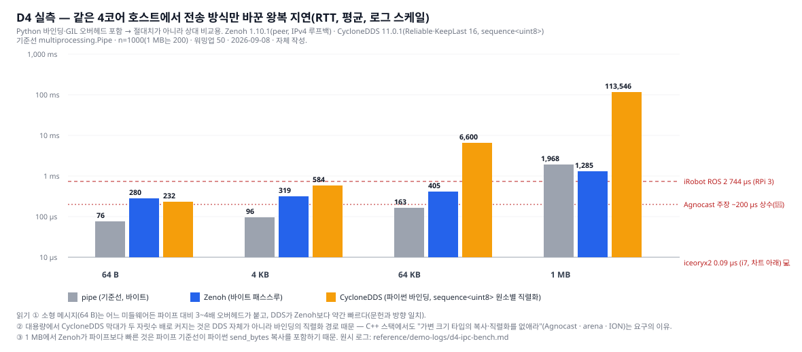

# 자율주행 스택 12개를 한 장에 놓았더니, 싸움은 모델이 아니라 "층 경계"에서 벌어지고 있었다

> 사내 공유용 · 2026-09-08 · 읽는 시간 5분 · 상세는 [보고서](autonomous-driving-sw-stack.md) ([웹 버전](autonomous-driving-sw-stack.html))

"자율주행 소프트웨어 스택"이라는 말을 들으면 보통 인지·계획·제어 모델을 떠올린다. 그런데 오픈소스 세 개를 실제로 클론해서 세어 보고, 학계 논문 스택과 상용·중국 스택 아홉 개를 공개 자료로 같은 표에 놓고 보니, 벤더들이 앞다퉈 말하는 곳(모델, 데이터 플라이휠)과 우리 같은 차량용 HPC 팀이 실제로 손대야 하는 곳(미들웨어, 안전 파티션, 폴백)이 서로 어긋나 있었다. 이 글은 그 어긋남을 다섯 가지로 요약한다.

## 1. 스택은 여덟 층이고, E2E는 그중 두 층만 합쳤다

한 대의 차 안에서 자율주행 소프트웨어는 HW·SoC(L1) → OS·하이퍼바이저(L2) → 미들웨어·IPC(L3) → 센서·인지(L4) → 예측·계획·제어(L5) → 안전 감시·폴백(L6) → 데이터·시뮬(L7, 차 밖) → API·HMI(L8)의 여덟 층으로 나뉜다.

요즘 화제인 End-to-End(E2E)는 L4와 L5를 하나의 신경망으로 합친 것이다. 나머지 여섯 층은 그대로 남는다. 오히려 E2E일수록 모델 출력을 검증하는 안전 감시층(L6)과 모델을 키우는 오프보드 데이터층(L7)이 커진다. NVIDIA DRIVE AV는 "E2E 스택 + 병렬 클래식 안전 스택"이 제품 정의이고, Autoware 2.0 로드맵은 E2E 모델을 "Generator" 후보 중 하나로 두고 "Selector"가 규칙으로 검사하는 구조를 공식화했다. 열두 스택 중 규칙 폴백 없이 단일망을 쓰는 곳(Tesla, Horizon, XPeng)은 그 폴백을 원격 인간이나 안전운전자에게 넘겼다.

## 2. 오픈소스 세 개는 조립 방식이 다르다

같은 날(2026-09-08) main 브랜치를 받아 스크립트로 세어 본 결과다.

| | Autoware | Baidu Apollo | comma openpilot |
|---|---|---|---|
| 조립 단위 | ROS 2 패키지 365개, 노드 등록 287개, 런치 XML 378개 | 자체 Cyber RT 컴포넌트 188개, dag 파일 109개 | 프로세스 44개, 서비스 69개 |
| 통신 비용을 없애는 법 | 미들웨어 유지 + zero-copy 두 겹(Agnocast 커널 모듈, cuda_blackboard GPU 버퍼) | 미들웨어 자체가 공유메모리 arena + 코어 핀 스케줄러 | 공유메모리 큐 + 카메라 DMA 버퍼 공유 + 코어 격리 |
| 안전층 | system 모듈(같은 SoC) | monitor/guardian(같은 SoC) | **별도 MCU 펌웨어**(MISRA C) |
| 학습 모델 | 학습 플래너가 런치 1급 옵션, VAD E2E는 런치 미연결 | 규칙 기반 기본, "E2E 미시험" | 30M 파라미터 E2E 모델이 매일 양산차에서 20 Hz |

세 스택이 우리 HPC에 요구하는 것은 결국 같다. 공유메모리 zero-copy, 코어 파티셔닝, 안전층 분리. 다른 것은 그 요구의 형태다. Autoware는 커널 모듈, Apollo는 설정 파일, openpilot은 별도 MCU다.

작은 실험 하나. openpilot의 주행 모델(30M 파라미터, 61 MB)을 GPU 없는 4코어 샌드박스에서 onnxruntime으로 돌리면 한 프레임에 395 ms가 걸렸다. comma 디바이스(Snapdragon 845)는 같은 가중치를 tinygrad 컴파일 커널과 OpenCL 이미지 텍스처, ISP 오프로드로 20 Hz에 돌린다. **같은 모델도 런타임이 다르면 8배 느리다.**

## 3. E2E는 스택을 없애지 않았고, VLA는 아직 느리다

학계 계보(UniAD → VAD → NAVSIM → DiffusionDrive)에서 2026년의 SOTA는 ResNet-34 백본에 50~60M 파라미터로 놀랄 만큼 작다. 성능은 백본 크기가 아니라 후보 궤적 생성·스코어링 설계에서 나온다. 반면 "추론하는" VLA는 크고 느리다.

| 모델 | 파라미터 | 하드웨어 | 1회 추론 |
|---|---|---|---|
| NVIDIA Alpamayo 1.5 (TIER IV ROS 2 노드) | 10B | RTX PRO 6000 | 0.60 s |
| 같은 모델 + FlashDrive 최적화 | 10B | RTX PRO 6000 / **Jetson Thor** | 0.16 s / **0.94 s** |
| Alpamayo 2 Super | 34B | RTX PRO 6000 | 3.35 s |

모델이 커지고 카메라가 늘고 추론 텍스트 예산이 늘면서 지연은 5.6배가 됐다. 세대가 올라갈수록 느려진다. 그래서 XPeng VLA 2.0은 언어 토큰을 우회하고(암묵 토큰), Huawei는 "VLA 대신 World-Action"을 공식화했으며, Wayve·Momenta·XPeng의 월드모델은 전부 오프보드(학습·검증용)다. 온보드 파라미터 예산은 "수십억"이 현실 상한이다.

한 가지 더. Tesla FSD v14.3은 모델을 바꾸지 않고 **AI 컴파일러·런타임을 MLIR로 재작성해 반응 시간 20%를 줄였다**고 릴리스 노트에 적었다. 지연은 TOPS보다 툴체인이 먼저 정한다.

## 4. 배관 전쟁 — DDS, Zenoh, SOME/IP, 그리고 공유메모리

ROS 2의 기본 경로(Fast DDS + wait-set executor)는 그대로 쓰면 순수 DDS 대비 최대 50%의 미들웨어 오버헤드가 붙고, 포인트클라우드처럼 크기가 변하는 메시지는 표준 zero-copy(loaned message)로 복사를 없앨 수 없다. 그래서 TIER IV는 커널 모듈과 힙 후킹으로 가변 타입까지 zero-copy하는 Agnocast를 만들었고, Autoware의 80개 패키지가 이미 이를 준비하고 있다(기본은 꺼짐). rmw_zenoh는 2025-05 Kilted부터 Tier-1이 됐지만 2026-05 Lyrical에서도 기본 rmw는 여전히 Fast DDS다.

우리 샌드박스에서 Zenoh와 CycloneDDS(둘 다 파이썬 바인딩)로 같은 4코어 호스트 안에서 왕복 지연을 재 보았다.

배울 것은 "누가 빠른가"가 아니다. 64바이트에서는 어느 미들웨어든 파이프 대비 3~4배 오버헤드가 붙고, 1 MB에서는 직렬화 경로 하나(바인딩이 바이트를 리스트로 다룸)가 지연을 두 자릿수 배로 바꿨다. **가변 크기 데이터의 복사·직렬화를 없애라**는 요구가 왜 모든 스택(Agnocast, Cyber arena, ION 버퍼)에서 반복되는지가 이 막대 하나에 있다.

AUTOSAR Adaptive 쪽도 같은 방향이다. ara::com은 바인딩(SOME/IP·DDS·IPC)을 갈아 끼울 수 있는 API이고, 오픈 구현 Eclipse S-CORE의 LoLa는 "공유메모리 세그먼트를 ASIL 등급별로 분리"를 핵심 설계로 잡았다. SOAFEE는 컨테이너와 Kubernetes API를 필수로 정의했지만 혼합 중요도 오케스트레이션은 아직 Future Work다. 컨테이너는 배포 단위이지 격리 수단이 아니다. 2026년의 기본값은 "안전 파티션에는 인증 스택(Apex.Grace, Connext Drive, QNX Hypervisor 8.0 for Safety), QM 파티션에는 오픈 스택"이라는 이중 구조다.

## 5. 상용·중국 스택에서 읽히는 공통 패턴

- **자체 실리콘이 기본값.** Tesla AI5, Waymo ASIC(2026-08, 이중 엔진), XPeng Turing, Li Auto M100, NIO NX9031, Mobileye EyeQ6, Huawei Ascend, Horizon J6P. 자체 칩이 없는 Wayve·Momenta·Autoware는 NVIDIA Thor나 칩 벤더 파트너십(Renesas·AMD)에 묶인다.
- **TOPS 경쟁의 반대편.** Mobileye는 34 TOPS EyeQ6H를 여러 개 묶은 다중 독립 엔진으로 버티고, NIO는 메모리 대역폭(546 GB/s)을 스펙의 앞자리에 뒀다. 대형 모델에서는 연산보다 KV 캐시·가중치 스트리밍이 병목이라 TOPS 단독 비교는 의미가 없어진다.
- **폴백이 곧 컴퓨트 예산.** Waymo 이중 엔진, Mobileye ×2~4는 컴퓨트를 두 배로 만든다. 단일망 진영은 그 비용을 아끼고 폴백을 사람에게 넘겼다. 규제(NHTSA §555 개정, UNECE R157/R171)가 그 선택을 언제까지 허용할지가 시장을 정한다.
- **2026년의 신호.** Renesas가 Autoware Foundation 최상위 회원으로 들어와 R-Car에 오픈 스택을 사전 통합하고(9/1), NVIDIA는 Hyperion + DRIVE AV + Alpamayo를 번들로 팔며 Bosch·Magna·ZF·AUMOVIO가 "Hyperion 호환 ECU"를 만들고, AUMOVIO는 Aurora용 **백업 컴퓨터**를 상품으로 내놨다(2027 양산).

## 차량 HPC 개발자가 챙길 것 네 가지

1. **스택을 고르는 게 아니라 층 경계를 설계한다.** 어느 스택이 이기든 L2·L3·L6에 요구하는 것은 같다 — 공유메모리 zero-copy(커널 모듈 허용 포함), 코어·스레드 우선순위 노출, ASIL별 메모리 세그먼트와 ACL, 폴백 컴퓨터.
2. **"E2E 준비"를 TOPS로 정의하지 말 것.** KV 캐시 대역폭, FP8/NVFP4 경로, 컴파일러 스택(TensorRT·MLIR·tinygrad류) 검증이 먼저다.
3. **안전 감시·폴백 층은 독립 상품이 될 수 있다.** AUMOVIO의 백업 컴퓨터가 그 예다.
4. **외부 E2E 스택 수용 시나리오를 요구사항에 넣을 것.** Wayve는 Nissan·Mercedes·Stellantis와 동시에 계약했고, XPeng은 VW에 스택+칩을 판다. OEM이 스택을 밖에서 사 오면 Tier-1 HPC는 "그 스택의 층 경계를 얼마나 빨리 맞추는가"로 평가받는다.

**우리 회사 관점 한 문단.** LG전자 VS는 2026-08 NVIDIA와 DRIVE Hyperion 기반 AIDV용 HPC 플랫폼 개발을 발표했다. Hyperion 위에서는 DRIVE AV·Alpamayo가 요구하는 층 경계(듀얼 스택, Halos 가드레일, LLM SDK 런타임)를 우리가 "받는" 위치이고, Magna 사례처럼 "호환 ECU + 통합 서비스"가 기본 역할이 된다. 같은 HPC가 Autoware(Renesas·AMD·NVIDIA 3축)·Momenta·Wayve 같은 외부 스택도 받을 수 있어야 OEM 선택지가 넓어지며, 그 요구는 위 네 가지로 같다. 안전 파티션의 인증 미들웨어와 하이퍼바이저 선택, 폴백 컴퓨터의 상품화, S-CORE·SOAFEE 참여를 "관망"에서 "기여"로 바꾸는 것이 보고서 13장의 결정 항목이다.

---

*근거와 등급(💻 코드 확인 / 🔍 1차 문서 / 📰 보도·검색 요약 / ⚠️ 미확인)은 보고서 본문과 [출처 목록](reference/references.md)에 있다. 데모 4건의 스크립트와 원시 로그는 `scripts/`, `reference/demo-logs/`에 있어 재실행할 수 있다.*
