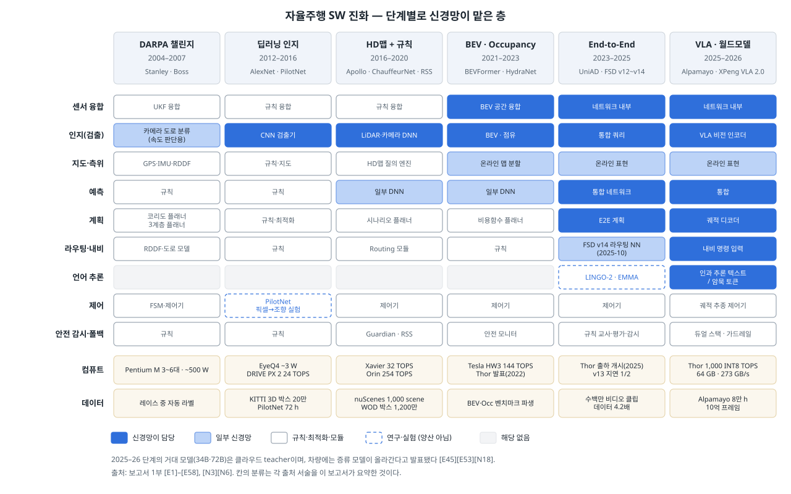
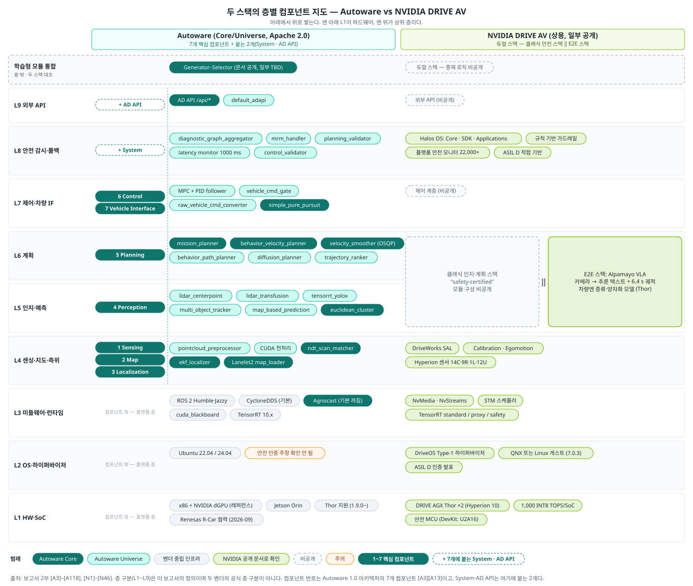
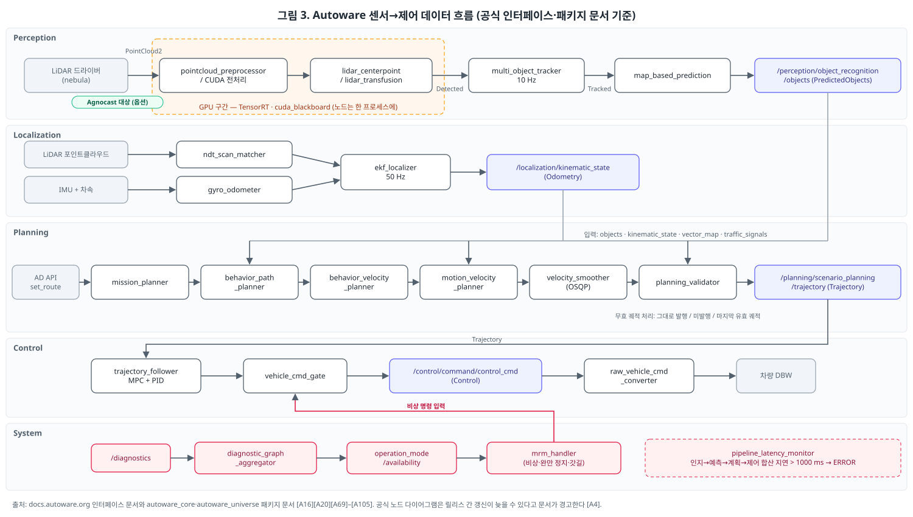
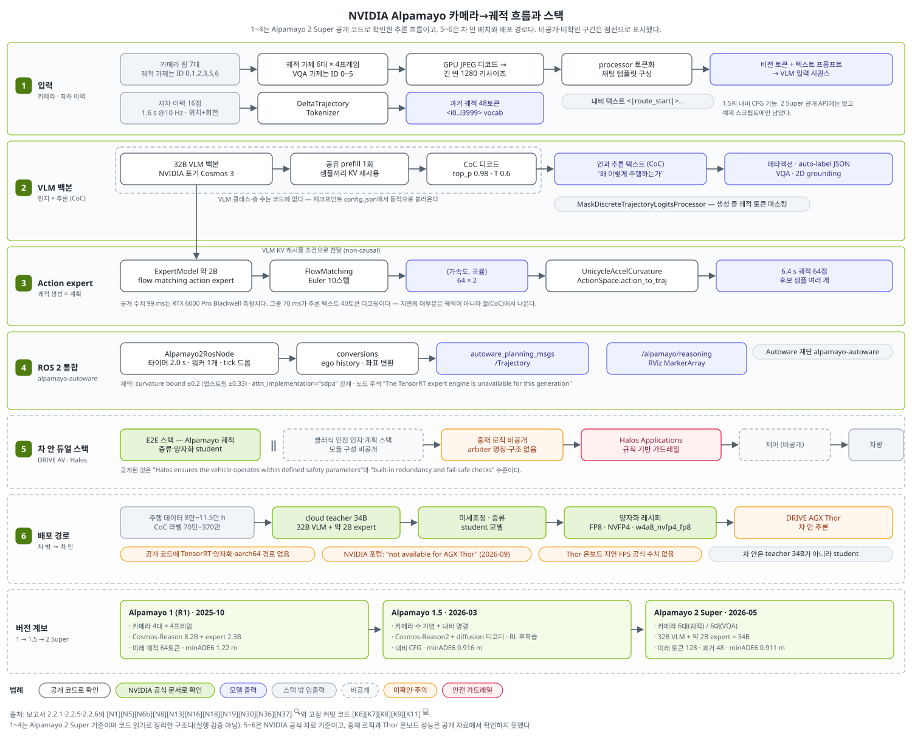
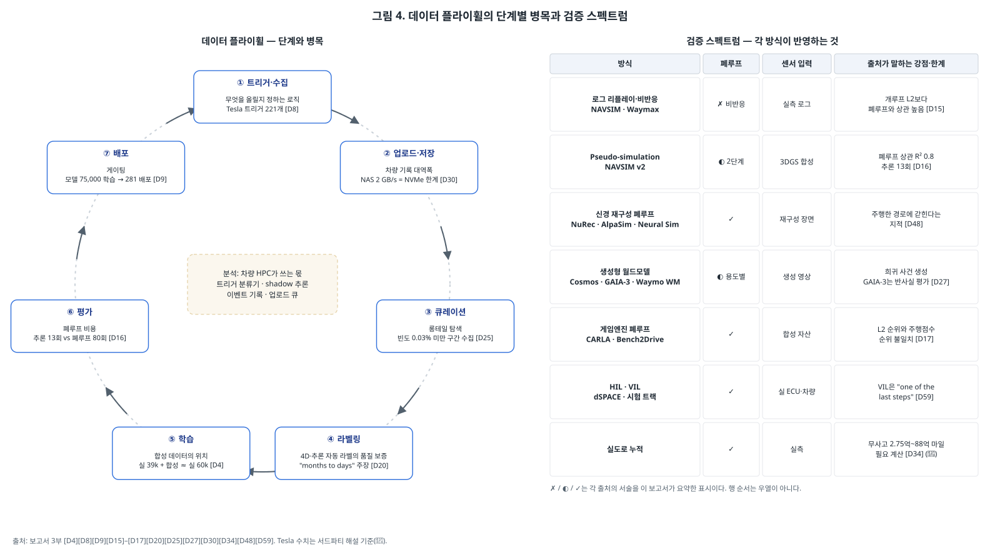
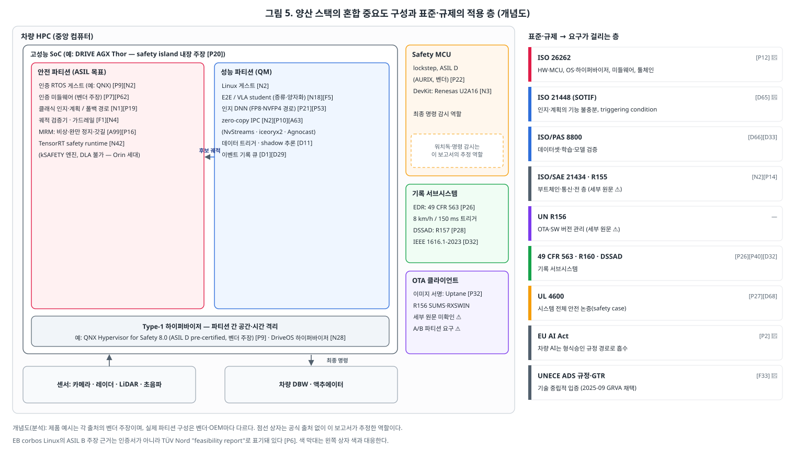
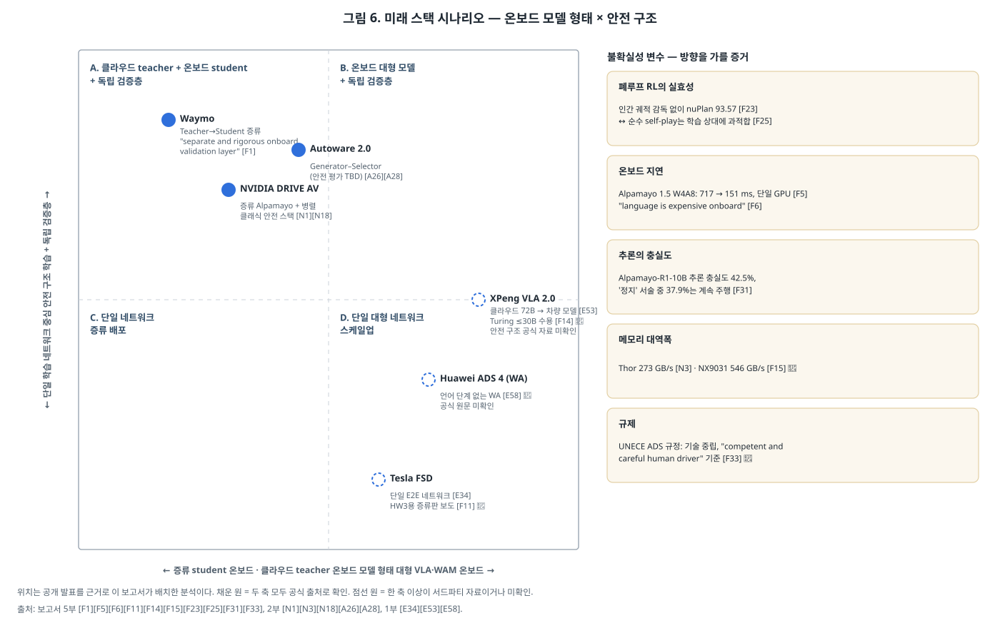

# 자율주행 SW 스택 파헤치기 — 심층편

### 신경망은 층을 하나씩 삼켰고, 양산은 그 옆의 검사기와 격리가 결정한다

> **작성일**: 2026-09-15 · **독자**: 사내 차량 HPC 엔지니어 · **기사판**: [article.md](article.md) · **출처 목록**: [reference/references.md](reference/references.md)
>
> **출처 표기 원칙**: 모든 사실 문장에 출처 ID(`[A63]` 등)와 등급을 붙인다. 확인하지 못한 내용은 ⚠️와 함께 "미확인"으로 적는다. 1차 출처와 서드파티 자료는 등급으로 구분한다. 사실이 아닌 이 보고서의 해석은 `분석` 블록에만 쓴다.

| 등급 | 뜻 |
|---|---|
| 💻 | 고정 커밋의 소스 코드·설정 파일에서 직접 확인 (reference/code-pins.md) |
| 🔍 | 1차 출처(공식 문서·논문·뉴스룸·저장소) 원문을 직접 열람 |
| 📄 | 서드파티 문서(해설·보도·미러·Wikipedia)를 직접 열람 |
| ✅ | 2개 이상 출처로 교차 확인 |
| 📰 | 검색 결과 요약만 확인, 원문 미열람 |
| ⚠️ | 미확인·추정·출처 간 상충 |

출처 ID 접두어: E 진화 · A Autoware · N NVIDIA · D 플라이휠·검증 · P 양산 · F 미래 · V 재검증 · K 소스 코드(고정 커밋)

---

## 30초 요약

1. **진화.** 20년 동안 신경망은 센서 융합 → 인지 → 예측 → 계획 → 라우팅 순으로 층을 흡수했다 [E1][E25][E32][E34][E36]. 규칙은 사라지지 않고 학습의 교사, 평가 지표, 안전 감시자로 자리를 옮겼다 [E42][E40][E20].
2. **해부.** Autoware는 실시간 보장·이중화·상태 감시를 스택 범위 밖으로 둔다 [A3]. 대용량 데이터 zero-copy는 커널 모듈 기반 Agnocast로 풀지만 기본값은 꺼져 있다 [A63][A65]. NVIDIA DRIVE AV는 클래식 안전 스택과 E2E 스택의 듀얼 구조인데, 둘의 중재 로직은 공개되지 않았다 [N1][N13]. Alpamayo의 99 ms는 워크스테이션 GPU 측정치이며, Thor 온보드 공식 수치는 없다 [N6b][N36].
3. **플라이휠·검증.** 현대차그룹은 경쟁력의 기준을 데이터 양이 아니라 "how rapidly you can connect data to learning"으로 제시했다 [D1]. 개루프 오차는 폐루프 주행 성능을 예측하지 못한다 [D17]. 비용과 신뢰도 사이의 중간 계층으로 3DGS 기반 pseudo-simulation이 R² 0.8을 보고했다 [D16].
4. **양산.** 데모와 양산을 가르는 것은 증거와 격리다. 같은 "ASIL" 표기라도 사전 인증부터 타당성 보고서까지 근거 형태가 다르다 [P9][P6]. VLA 추론 텍스트의 충실도가 42.5%에 그친다는 보고는 모델 밖의 독립 검사기가 필요한 이유다 [F31].
5. **미래.** Waymo와 NVIDIA 모두 "크게 학습하고, 작게 배포하고, 따로 검증한다" [F1][F3]. 온보드 병목은 자기회귀 디코딩과 메모리 대역폭이다 [N6b][F6][F5]. ROS 2의 zero-copy 경로는 Agnocast·`rosidl::Buffer`·rmw_zenoh로 갈라지고 있다 [A63][F37][F38].

## 통설 vs 실체 — 조사하며 뒤집힌 것

| 통설 | 실체 | 출처 |
|---|---|---|
| DARPA 시절 자율주행은 규칙 기반이었다 | Stanley는 "relied predominantly on … machine learning and probabilistic reasoning"이었다. 다만 학습 결과는 속도 판단에만 썼다 | [E1] 🔍 |
| E2E는 2023년 이후의 발명이다 | 2016년 PilotNet이 카메라 픽셀을 조향으로 바로 바꿔 공공도로를 달렸다 | [E4][E5] 🔍 |
| E2E가 되면 규칙이 사라진다 | Waymo 검증층, DRIVE AV 병렬 안전 스택, Autoware Selector 모두 학습 모델 옆에 규칙 검사기를 둔다 | [F1][N1][A26] 🔍 |
| 개루프 오차가 낮으면 잘 달린다 | Bench2Drive에서 L2 1.01인 DriveAdapter의 주행점수가 L2 0.73인 UniAD-Base보다 약 18점 높다 | [D17] 🔍 |
| VLA의 추론 텍스트는 판단 이유를 설명한다 | Alpamayo-R1-10B 분석에서 추론 충실도 42.5%, "정지" 서술의 37.9%에서 계속 주행했다 | [F31] 🔍 |
| 오픈소스 스택은 양산 준비가 됐다 | Autoware 2.0 안전성 평가 페이지는 TBD이고, S-CORE는 "not a ready-to-integrate series product"라고 스스로 밝힌다 | [A28][F41] 🔍 |
| ASIL 표기가 있으면 인증된 것이다 | QNX Hypervisor for Safety는 "pre-certified", EB corbos Linux의 근거는 TÜV Nord "feasibility report"다 | [P9][P6] 🔍 |
| TOPS가 온보드 AI 성능을 정한다 | Alpamayo-R1 지연 99 ms 중 70 ms가 추론 텍스트 디코딩이고, 경쟁 칩들이 메모리 대역폭(GB/s)을 사양에 올린다 | [N6b] 🔍 [V1][V10] 📄 |

## 목차

- 1부. 진화 과정 — 20년 동안 신경망 경계가 한 칸씩 내려왔다
- 2부. 대표 스택 해부 — Autoware × NVIDIA DRIVE AV
- 3부. 데이터 플라이휠 & 검증 — 차 밖에 있는 절반의 스택
- 4부. 양산 스택 — 데모와 양산을 가르는 것은 증거와 격리다
- 5부. 미래 진화 방향 — 크게 학습하고, 작게 배포하고, 따로 검증한다
- 부록 A 용어집 · 부록 B 미확인 항목 · 부록 C 검증 로그

---

## 1부. 진화 과정 — 20년 동안 신경망 경계가 한 칸씩 내려왔다

이 장은 스택 구조가 **왜 지금 모양인지**를 여섯 단계로 본다. 단계마다 네 축을 고정해 비교한다.

- (a) 신경망에 흡수된 것
- (b) 규칙·모듈로 남은 것
- (c) 컴퓨트 요구의 변화
- (d) 데이터 요구의 변화



### 1.1 DARPA 챌린지 2004–2007 — 모듈형 파이프라인의 원형

**대회 경과**

- 2004-03-13 1차 Grand Challenge는 142마일 코스에 15팀이 출주했고, 어느 로봇도 코스의 5% 이상을 주파하지 못했다 [E1] 🔍.
- 2005-10-08 2차 대회에는 195팀이 등록해 23팀이 출주, 5팀이 완주했다. Stanford의 Stanley가 6시간 53분 58초로 우승했다 [E1] 🔍.
- 2007-11-03 Urban Challenge는 CMU Tartan Racing의 Boss가 우승했다 [E3] 🔍. 코스 길이는 SPIE 기사 "60마일"과 CMU 초록 "85 km"가 서로 다르다 [E2][E3] ⚠️.

**Stanley의 구조 (Thrun et al., JFR 2006)**

- 레이스 소프트웨어는 "approximately 30 modules executed in parallel"이었고, sensor interface · perception · control · vehicle interface · user interface · global services의 6개 레이어로 묶였다 [E1] 🔍.
- 중앙 마스터 프로세스가 없고, 모든 모듈이 비동기 publish-subscribe로 통신하며, 데이터는 센서에서 액추에이터로 한 방향으로 흘렀다 [E1] 🔍.
- 트렁크에 Pentium M 컴퓨터 6대를 실었지만 실제 레이스 SW는 3대에서 돌았다. 센서 폴링은 최대 100 Hz, 조향·스로틀·브레이크 제어는 20 Hz, 추가 장비 전력은 약 500 W였다 [E1] 🔍.
- 상태 추정은 15변수 UKF를 100 Hz로 갱신했다 [E1] 🔍.

**"규칙 기반"이라는 통설과 다른 점**

- 논문 초록은 Stanley가 "relied predominantly on … machine learning and probabilistic reasoning"이라고 쓴다 [E1] 🔍.
- 카메라 도로 분류기는 레이저가 주행 가능하다고 판정한 영역의 픽셀을 학습 예시로 삼아 온라인으로 적응했다. 사람이 라벨을 달지 않는 self-supervised 방식이다 [E1] 🔍.
- 레이저 매퍼 파라미터도 학습으로 조정해 false positive를 12.6%에서 0.002%로 줄였다 [E1] 🔍.
- 다만 비전 결과는 "not used for steering control … used exclusively for velocity control"이었다. 학습 결과는 속도를 줄일지 판단하는 데만 쓰고, 조향은 규칙이 맡았다 [E1] 🔍.
- 경로 계획은 DARPA가 준 경로점(RDDF) 코리도 안에서 좌우 오프셋만 고르는 국소 회피였고, 상위 제어는 "simple finite state automaton"이었다 [E1] 🔍.

**Boss의 구조 (Urmson et al., JFR 2008)**

- Boss는 Mission(어느 도로로 갈지) · Behavioral(차선 변경·교차로 우선순위·오류 복구) · Motion(국소 궤적)의 "three-layer planning system"을 썼다 [E2] 🔍.
- Urban Challenge 차량은 "as many as 10 on-board computers"를 실었다 [E3] 🔍.

> **분석.** 오늘날 스택 문서에서 보는 "센서 → 인지 → 계획 → 제어 → 차량 인터페이스" 분할, pub-sub 통신, 미션·행동·모션 3단 플래너는 이 시기에 이미 형태를 갖췄다. 2부에서 해부하는 Autoware의 planning 컴포넌트도 mission → behavior → motion 순서를 그대로 쓴다 [A8] 🔍.

### 1.2 2012–2016 — 딥러닝이 인지 모듈 안으로 들어가다

**흡수된 것: 검출기**

- AlexNet(NeurIPS 2012)은 파라미터 6,000만 개로 ILSVRC-2012 top-5 오류 15.3%를 기록해 2위(26.2%)와 격차를 벌렸다 [E24] 🔍.
- 같은 해 KITTI 벤치마크가 20만 개 이상의 3D 객체 주석과 6시간 주행 데이터를 공개했다 [E21] 🔍.
- Baidu Apollo의 2017년 모듈 목록에는 "Obstacle Perception (Velodyne 64 Lidar, CUDA, CuDNN, Caffe, NVIDIA GPU 10Hz)"가 들어 있다 [E15] 📄. 검출기가 CNN으로 바뀌어도 추적·예측·계획·제어는 그대로 남았다.

**E2E의 첫 실증은 2016년이었다**

- NVIDIA PilotNet(arXiv 1604.07316)은 전방 카메라 한 대의 픽셀을 조향 명령으로 바로 바꾸는 CNN으로, "optimizes all processing steps simultaneously"를 목표로 했다 [E4] 🔍.
- 네트워크는 9층, 파라미터 약 25만 개였고, 약 72시간의 주행 데이터로 학습했다 [E5] 🔍.
- Monmouth County 시험에서 약 98% 자율 주행률, Garden State Parkway 10마일 무개입을 보고했다 [E5] 🔍.
- 추론은 DRIVE PX에서 30 FPS로 돌았다 [E4] 🔍. 출력은 조향 한 가지뿐이었다.

**컴퓨트**

- Mobileye EyeQ4(2015-03 발표)는 약 3 W에서 "more than 2.5 teraflops"를 내는 SoC로, 카메라 8대를 동시에 처리하도록 설계됐다 [E11] 🔍.
- NVIDIA DRIVE PX 2(2016-01, CES)는 딥러닝 기준 24 TOPS를 내세웠다 [E6] 🔍.

### 1.3 2016–2020 — HD맵과 규칙 플래너의 표준형

**Apollo가 보여준 11개 모듈 구조**

- Baidu Apollo 3.0 문서는 Perception · Prediction · Routing · Planning · Control · CanBus · HD-Map · Localization · HMI · Monitor · Guardian의 11개 모듈을 정의한다 [E13] 📄(공식 문서 미러).
- HD-Map은 "query engine"으로, Guardian은 고장 시 개입하는 "action center"로 설명된다 [E13] 📄.
- Apollo 공식 RELEASE.md는 버전별 목표를 1.0 "autonomous GPS waypoint following", 3.0 "L4 product level … closed venue … low speed", 5.0 "volume production for Geo-Fenced Autonomous Driving"으로 적었다 [E14] 🔍. 버전별 날짜는 RELEASE.md에 없다 ⚠️.

**모방학습의 벽**

- Waymo ChauffeurNet(arXiv 1812.03079)은 인지 출력을 입력으로 받는 모방학습 플래너였다 [E18] 🔍.
- 저자들은 "even when we leverage a perception system for preprocessing the input and a controller for executing the output on the car: 30 million examples are still not enough"라고 썼다 [E18] 🔍.
- 해결책으로 궤적 섭동 합성과 충돌·이탈 페널티 손실을 추가했다 [E18] 🔍.

**규칙 기반 안전층의 형식화**

- Mobileye RSS(arXiv 1708.06374)는 학습 정책과 분리된 "white-box, interpretable, mathematical model for safety assurance"를 제안했다 [E20] 🔍.
- Waymo 안전 방법론(arXiv 2011.00054)은 하드웨어 · ADS 행동 · 운영의 3계층으로 준비도를 판정한다 [E19] 🔍.

**오픈소스 스택의 1세대**

- Autoware.AI는 2015년 ROS 1 기반으로 나왔고, 공식 문서는 그 한계를 "A lack of concrete architecture design leading to a lot of built-up technical debt, such as tight coupling between modules"로 요약한다 [A31] 🔍.

**컴퓨트와 데이터**

| 항목 | 값 | 출처 |
|---|---|---|
| NVIDIA Xavier (2018) | 32 TOPS, 16 GB LPDDR4x, 137 GB/s | [E8] 🔍 |
| DRIVE PX Pegasus (2017 발표) | 320 TOPS | [E7] 🔍 |
| NVIDIA Orin | 254 TOPS | [E9] 🔍 |
| nuScenes (2019) | 1,000 scene × 20 s, KITTI 대비 주석 7배 · 이미지 100배 | [E22] 🔍 |
| Waymo Open Dataset (2019) | 1,150 scene, LiDAR 박스 약 1,200만 · 카메라 박스 약 1,200만 | [E23] 🔍 |

### 1.4 2021–2023 — BEV·Occupancy: 센서 융합이 네트워크 안으로

- Tesla는 AI Day 2021에서 개별 네트워크 20여 개를 공유 백본의 다중 헤드 "HydraNet"으로 합치고, 카메라 8대의 특징을 트랜스포머로 BEV "vector space"에 융합하는 구조를 설명했다 [E28] 📄. 1차 영상은 미열람이다 ⚠️.
- Tesla의 Occupancy Network는 CVPR 2022 워크숍에서 발표됐다 [E29] 📰.
- BEVFormer(arXiv 2203.17270)는 카메라만으로 nuScenes test NDS 56.9%를 기록하며 "on par with … LiDAR-based baselines"라고 보고했다 [E25] 🔍.
- BEVFusion(arXiv 2205.13542)은 카메라와 LiDAR 특징을 공유 BEV 공간에서 합치고, BEV pooling 최적화로 뷰 변환 지연을 "more than 40x" 줄였다 [E26] 🔍.
- Tesla HW3 컴퓨터는 칩 2개 합산 144 TOPS로 알려져 있다 [E31] ✅. HW4의 TOPS는 Tesla 공식 수치가 없다 ⚠️.
- NVIDIA는 2022-09-20 DRIVE Thor를 "2,000 teraflops"로 공개했다 [N45] 🔍.

> **분석.** 이 단계에서 신경망 경계는 "검출기"에서 "센서 융합 + 공간 표현"까지 내려왔다. 예측과 계획은 여전히 밖에 있었다. Tesla의 2022년 플래너도 occupancy 출력 위에 수작업 비용함수를 얹은 형태로 해설된다 [E28] 📄.

### 1.5 2023–2025 — E2E: 인지·예측·계획의 경계가 사라지다

**학계**

- UniAD(arXiv 2212.10156, CVPR 2023 best paper)는 "incorporates full-stack driving tasks in one network"를 내걸고, 태스크 사이를 "unified query interfaces"로 연결했다 [E32] 🔍.
- VAD(arXiv 2303.12077)는 장면을 벡터로 표현해 래스터 후처리를 없앴다. VAD-Tiny는 UniAD보다 최대 9.3배 빠르다고 보고했다 [E33] 🔍.

**산업: Tesla FSD의 단계적 흡수**

- FSD v12 릴리스 노트는 "upgrades the city-streets driving stack to a single end-to-end neural network trained on millions of video clips, replacing over 300k lines of explicit C++ code"라고 적었다 [E34] ✅.
- v13.2(2024-11)는 "36 Hz, full-resolution AI4 video inputs", "4.2x data scaling", "5x training compute scaling", "Reduced photon-to-control latency by 2x"를 적었다 [E35] 📄(릴리스 노트 미러).
- v14.1(2025-10)은 "Added navigation and routing into the vision-based neural network"라고 적었다 [E36] 📄. 거꾸로 읽으면 v12~v13 기간에 라우팅은 신경망 밖에 있었다.

**벤치마크 논쟁이 드러낸 것**

- AD-MLP(arXiv 2305.10430)는 센서 없이 자차의 과거 궤적·속도만 쓰는 MLP로 nuScenes 개루프 L2 지표에서 인지 기반 방법과 대등한 결과를 냈다 [D13] 🔍.
- NAVSIM(arXiv 2406.15349)은 "Simple methods with moderate compute requirements such as TransFuser can match recent large-scale end-to-end driving architectures such as UniAD"라고 보고했다 [E40] 🔍.
- Hydra-MDP(arXiv 2406.06978)는 "knowledge distillation from both human and rule-based teachers"로 CVPR 2024 NAVSIM 챌린지 1위를 했다 [E42] 🔍.
- DiffusionDrive(arXiv 2411.15139)는 ResNet-34 백본으로 NAVSIM PDMS 88.1, RTX 4090에서 45 FPS를 보고했다 [E43] 🔍.

**언어의 등장**

- Wayve LINGO-2(2024-04)는 "first driving model trained on language tested on public roads"로 소개됐다 [E38] 🔍.
- Waymo EMMA(2024-10)는 Gemini 기반 연구 모델로, 스스로 "not leveraging LiDAR and radar"와 "need for optimized model inference time"을 한계로 밝혔다 [E44] 🔍.

> **분석.** 규칙은 사라지지 않았다. 위치만 옮겼다. 온라인 플래너에서 물러난 규칙은 학습의 교사(Hydra-MDP), 평가 지표(NAVSIM PDMS), 안전 감시자(RSS·Guardian)로 남았다 [E42][E40][E20][E13].

### 1.6 2025–2026 — VLA·월드모델: 거대 모델은 차 밖에, 증류본은 차 안에

**NVIDIA Alpamayo**

- CES 2026(2026-01-05)에서 NVIDIA는 10B 파라미터 추론형 VLA Alpamayo 1을 "large-scale teacher models that developers can fine-tune and distill into the backbones of their complete AV stacks"로 발표했다 [E45] 🔍.
- 원형인 Alpamayo-R1 논문(arXiv 2511.00088)의 구조는 Cosmos-Reason VLM 백본 + diffusion(flow-matching) 궤적 디코더다 [N6] 🔍. 공개 코드에서 VLM 클래스는 `Qwen3VLForConditionalGeneration`(기본 `Qwen/Qwen3-VL-8B-Instruct`)이다 [K6] 💻.
- 논문의 99 ms 지연은 **RTX 6000 Pro Blackwell**에서 잰 값이다. 비전 인코더 3.43 ms, prefill 16.54 ms, 추론 텍스트 40토큰 디코딩 70 ms, 궤적 디코딩 8.75 ms로 나뉜다 [N6b] 🔍. 차량용 SoC 측정치가 아니다.
- Alpamayo 2 Super(2026-05-31 발표)는 34B로 발표됐다 [N19] 🔍. HF 블로그는 백본만 세어 32B로 적는다 [N7] 🔍. 모델카드 기준 구성은 32B 백본 + 2.3B action expert다 [N16] 🔍. 공개 코드는 VLM 클래스를 체크포인트 설정에서 동적으로 읽으며, "Cosmos 3 Super Reasoner"라는 이름은 코드에 없다 [K8] 💻.
- NVIDIA는 2 Super의 용도를 "reasoning, auto-labeling, scene understanding, model critiquing and distilling knowledge into smaller models"로 적었다 [E49] 🔍.

**언어를 버린 갈래**

- XPeng VLA 2.0(2025-11-05)은 "end-to-end direct generation from visual signals to action commands"를 내세우며 전통적인 V-L-A의 언어 단계를 없앴다. 클라우드 모델은 72B다 [E53] 🔍.
- Huawei ADS 4는 언어 단계를 빼고 시각·청각·촉각 입력을 모델에 바로 넣는 "WA(World-Action)"를 택했다고 보도됐다 [E57][E58] 📄. Huawei 공식 페이지 원문은 확인하지 못했다 ⚠️.
- Li Auto MindVLA는 MoE LLM 베이스 위에서 diffusion으로 action token을 궤적으로 바꾸는 구조로 소개됐다 [E56] 📄.

**월드모델은 주로 차 밖에서 쓴다**

- Wayve GAIA-2(arXiv 2503.20523)는 에고 동역학·에이전트·도로 의미로 조건화된 다카메라 영상을 생성하는 latent diffusion 월드모델이다 [E39] 🔍.
- 3부에서 보듯 GAIA-3, Cosmos, Waymo World Model도 학습 데이터 생성과 검증 용도로 발표됐다 [D27][D2][D38] 🔍.

> **분석.** 2025–2026의 공통 패턴은 "클라우드 teacher → 차량 student"다. NVIDIA는 34B teacher를 Thor용 compact 모델로 증류한다고 쓰고 [N18][N19] 🔍, XPeng은 72B 클라우드 모델에서 차량 모델을 증류한다 [E53] 🔍. 온보드 VLA의 실제 지연·파라미터 예산은 공개된 공식 수치가 거의 없다. 이 공백은 2부와 5부에서 다시 다룬다.

### 1.7 정리 — 6단계 × 4축

| 단계 | (a) 신경망에 흡수 | (b) 규칙·모듈로 남음 | (c) 컴퓨트 | (d) 데이터 |
|---|---|---|---|---|
| DARPA 2004–07 | 카메라 도로 분류(self-supervised), 매퍼 파라미터 [E1] | UKF 추정, 코리도 플래너, FSM, 3계층 플래너 [E1][E2] | Pentium M 3~6대, ~500 W [E1] | 레이스 중 자동 라벨, 공개 데이터셋 없음 [E1] |
| DL 인지 2012–16 | 2D 검출, PilotNet 조향 [E24][E4] | 추적·예측·계획·제어 전부 [E15] | EyeQ4 ~3 W, PX 2 24 TOPS [E11][E6] | KITTI 20만 박스, PilotNet 72 h [E21][E5] |
| HD맵+규칙 2016–20 | LiDAR·카메라 인지, 일부 예측 [E14] | HD-Map, Routing, 시나리오 플래너, Guardian, RSS [E13][E20] | Xavier 32 TOPS, Orin 254 TOPS [E8][E9] | nuScenes, WOD 1,200만 박스, ChauffeurNet 3천만 예시 [E22][E23][E18] |
| BEV·Occ 2021–23 | 다카메라·LiDAR 융합, 점유 [E25][E26] | 플래너(비용함수), HD맵, 안전 모니터 [E28] | HW3 144 TOPS, Thor 발표 [E31][N45] | BEV·Occ 벤치마크 파생 [E30] |
| E2E 2023–25 | 인지→예측→계획, v14 라우팅 [E32][E34][E36] | 규칙 교사, 규칙 기반 평가 지표, 안전층 [E42][E40] | v13 지연 1/2, DiffusionDrive 45 FPS [E35][E43] | "millions of video clips", 4.2x [E34][E35] |
| VLA·WM 2025–26 | 언어 추론, 메타액션, 월드 생성 [N6][E53][E39] | teacher/student 분리, 안전 스택 병행 [E45][N13] | Thor 1,000 INT8 TOPS · 273 GB/s [N3] | Alpamayo 8만 h · 10억 프레임 [E48] |

**크기 변화 요약**

| 지표 | 시작 | 2025–26 | 출처 |
|---|---|---|---|
| 차량 AI 컴퓨트 | DRIVE PX 2 24 TOPS (2016) | Thor 1,000 INT8 TOPS | [E6][N3] 🔍 |
| 모델 파라미터 | PilotNet 약 25만 (2016) | Alpamayo 2 Super 34B | [E5][N19] 🔍 |
| 학습 데이터 | PilotNet 약 72 h (2016) | Alpamayo-R1 약 8만 h | [E5][E48] 🔍 |

---

## 2부. 대표 스택 해부 — Autoware × NVIDIA DRIVE AV

### 2.0 이 장의 층 프레임

두 스택을 같은 자로 재기 위해 이 보고서는 아래 층 구분을 쓴다. 이 구분은 **이 보고서의 정의**이며, 두 벤더의 공식 층 구분이 아니다.

표와 그림 모두 **아래가 L1(하드웨어)**이고 위로 갈수록 상위 층이다. 스택은 하드웨어 위에 쌓이므로, 읽을 때는 표 맨 아래 줄부터 위로 올라가면 된다.

| 층 | 이름 | 담는 것 |
|---|---|---|
| 차 밖 | 데이터·시뮬 | 3부에서 다룬다 |
| L9 | 외부 API | 운행 관리·HMI 연동 |
| L8 | 안전 감시·폴백 | 진단, 검증기, 최소위험조치(MRM) |
| L7 | 제어·차량 인터페이스 | 궤적 추종, 명령 게이트, DBW 변환 |
| L6 | 계획 | 경로·속도·궤적 생성 |
| L5 | 인지·예측 | 검출, 추적, 예측, 신호등 |
| L4 | 센싱·지도·국지화 | 센서 추상화, 전처리, 지도, 자차 위치 |
| L3 | 미들웨어·런타임 | IPC, 스케줄러, 추론 런타임 |
| L2 | OS·하이퍼바이저 | 게스트 OS, 파티션, 인증 범위 |
| **L1** | **HW·SoC** | **CPU·GPU·가속기, 안전 MCU, 센서 I/O — 스택의 바닥** |



그림에서 Autoware 칸 왼쪽의 짙은 초록 태그 **1~7**은 Autoware 1.0 아키텍처의 7개 컴포넌트가 어느 층에 놓이는지를 표시한 것이고, 점선 태그 **+ System**과 **+ AD API**는 그 7개에 붙는 2개다 [A3][A13] 🔍. L1~L3은 컴포넌트 구분 밖의 플랫폼 층이라 태그가 없다.

---

### 2.1 Autoware — 문서와 저장소로 전 층이 보이는 유일한 스택

#### 2.1.1 설계 원칙

**Microautonomy와 층 구조**

- Autoware 공식 문서는 설계 사상을 "component-based autonomy design"으로, 주행 능력을 "composing many small autonomy modules"로 설명한다 [A1] 🔍.
- 설계 인덱스는 이 구조의 비용을 "the trade-off characteristic of the microautonomy architecture exists between computational performance and functional modularity"라고 명시한다 [A2] 🔍. 최고 속도보다 **실시간 예측 가능성**을 요구한다는 뜻이다.
- Architecture 1.0은 "a layered architecture that clarifies each module's role and simplifies the interface between them"으로 정의된다 [A3] 🔍.

**Core와 Universe**

- Core는 "foundational packages maintained by the Autoware Foundation"으로, 단위·통합·성능·실차 테스트 기준을 따르는 "stable, production-ready platform"을 표방한다 [A1] 🔍.
- Universe는 개인·기업·연구기관이 기여하는 패키지 모음이며, 품질 관행은 원저자가 정한다. 문서는 이를 "a sandbox for experimentation"이라 부른다 [A1] 🔍.
- 성숙한 Universe 패키지는 Core로 승격될 수 있다 [A1] 🔍.

**Core 편입 기준에서 HPC 팀이 볼 문장**

- "Keep the default build CPU-only. Standard Core packages need no GPU, CUDA, or TensorRT" [A32] 🔍. GPU 기능은 옵션 계층에만 둔다.
- "Depend only downward"로 Core가 Universe에 의존하지 못하게 막는다 [A32] 🔍.
- "Be permissively licensed. Apache 2.0 or compatible"를 요구한다 [A32] 🔍.
- Humble·Jazzy 양쪽 CI 통과와 Universe보다 엄격한 clang-tidy를 요구한다 [A32] 🔍.

**문서가 스스로 밝힌 범위 밖 항목**

- Architecture 1.0은 초기 범위에서 "fail-safe, HMI, real-time processing guarantees, redundant systems, state monitoring"을 제외한다고 적었다 [A3] 🔍.

> **분석.** Autoware의 층 경계는 "기능 모듈 사이"에 촘촘하게 그어져 있다. 반면 실시간 보장·이중화·상태 감시는 스택 문서가 스스로 범위 밖으로 둔다. 이 책임은 스택을 올리는 플랫폼, 즉 HPC·OS·안전 MCU 쪽에 남는다.

#### 2.1.2 버전과 배포판 (2026-09-15 기준)

- 릴리스 정책은 SemVer이고 "Releases are made approximately monthly"다. Autoware 버전은 새로 릴리스된 autoware_core 버전과 같게 맞춘다 [A29] 🔍.

| 저장소 | 최신 | 발행일 | 출처 |
|---|---|---|---|
| autoware (메타) | 1.9.0 | 2026-07-16 | [A49] 🔍 |
| autoware_core | 1.9.0 | 2026-06-26 | [A50] 🔍 |
| autoware_universe | 0.52.0 (메타 저장소 1.9.0의 `autoware.repos` 고정값). 0.52.1은 뒤이은 패치 태그 | 2026-07-14 | [A51] 🔍 [K1] 💻 |

- 1.9.0 릴리스 노트는 "Support NVIDIA Thor (Jetson + DRIVE) on JetPack 7 / SBSA CUDA 13"과 diffusion_planner v5.0 모델 추가를 적었다 [A52] 🔍.
- core 1.8.0(2026-05-02)은 zero-copy 래퍼 `autoware_agnocast_wrapper`를 Universe에서 Core로 옮겼다 [A50] 🔍.
- ROS 2 전환 일정은 2026-04 Jazzy full support, 2027-01 Humble soft-freeze, 2027-05 Jazzy-only다 [A35] 🔍.
- autoware 메타 저장소는 0.45.1(2025-07)에서 1.5.0(2025-11)으로 번호가 뛰었다 [A49] 🔍. 점프 사유를 설명한 공식 문서는 찾지 못했다 ⚠️.

#### 2.1.3 컴포넌트 해부

Autoware 1.0 아키텍처는 **7개 핵심 컴포넌트**(Sensing · Map · Localization · Perception · Planning · Control · Vehicle Interface)에 **System**과 **AD API** 2개를 붙인 구성이다 [A3][A13] 🔍. 이 보고서의 그림에서도 앞의 7개는 번호 1~7을 단 태그로, 뒤의 2개는 `+` 태그로 구분해 표시했다. 아래 토픽명·메시지 타입은 공식 인터페이스 문서와 패키지 문서에 적힌 것만 옮겼다.

**요약표** — 위 7행이 7개 핵심 컴포넌트, 아래 2행이 여기에 붙는 2개다.

| # | 컴포넌트 | 대표 출력 토픽 (메시지) | 핵심 구현 | 주 저장소 |
|---|---|---|---|---|
| 1 | Sensing | `/sensing/lidar/<group>/pointcloud` (PointCloud2) | pointcloud_preprocessor, CUDA 전처리 | Universe 중심 |
| 2 | Map | `/map/vector_map` (LaneletMapBin) | Lanelet2, 분할 PCD 로딩 | Core |
| 3 | Localization | `/localization/kinematic_state` (Odometry) | NDT + EKF | Core |
| 4 | Perception | `/perception/object_recognition/objects` (PredictedObjects) | CenterPoint·TransFusion, 추적, 예측 | Universe |
| 5 | Planning | `/planning/trajectory` (Trajectory) | mission → behavior → motion, OSQP | Core + Universe |
| 6 | Control | `/control/command/control_cmd` (Control) | MPC + PID, vehicle_cmd_gate | Universe 중심 |
| 7 | Vehicle IF | `/vehicle/status/*` | raw_vehicle_cmd_converter | Universe |
| + | System | `/system/operation_mode/availability` | diagnostic graph, MRM | Universe |
| + | AD API | `/api/*` | default_adapi | Core + Universe |

출처: [A16][A18][A19][A20][A21][A22][A67][A68][A99][A100] 🔍 · 토픽 이름은 코드로 확인 [K2][K4] 💻

> **분석.** 7개와 2개를 가르는 기준은 데이터 흐름 위에 있느냐다. 1~7은 센서에서 차량 명령까지 이어지는 한 줄의 파이프라인이고, System과 AD API는 그 파이프라인을 **가로질러** 감시하거나(진단→MRM) 밖에서 지시한다(경로 설정·모드 전환). 그래서 아래 흐름도에서도 두 개를 같은 줄에 두지 않고 따로 뗀 띠에 그렸다.

- Planning 최종 출력 토픽은 core 1.5.0에서 `/planning/scenario_planning/trajectory`에서 `/planning/trajectory`로 바뀌었다. 초판은 옛 이름을 적었고 코드 대조로 바로잡았다 [K2][K4] 💻.

**Sensing**

- 역할은 벤더별 원시 데이터를 추상화하고 "primitive pre-processing"을 하는 것이다 [A10] 🔍.
- `autoware_pointcloud_preprocessor`는 crop box, distortion corrector, downsample, outlier 제거, concatenate 등의 필터를 "composable node containers, leveraging intra-process communication"로 실행한다 [A103] 🔍.
- CUDA판 전처리기는 cuda_blackboard를 써서 포인트클라우드를 GPU 메모리에 둔 채 다음 노드로 넘긴다 [A104] 🔍.
- 문서 사이트는 CUDA판 버퍼 상한을 691,200 포인트·128 ring으로 적었지만, 0.52.1 코드·설정에서는 이 값을 찾지 못했다 [A104] 🔍 [K3] 💻 ⚠️.
- CUDA 전처리는 기본 launch에서 꺼져 있다 [K4] 💻.
- 문서는 CUDA판이 CPU판과 "will not offer the same numerical results"라고 경고한다 [A104] 🔍.

**Map**

- 지도는 Lanelet2 벡터맵과 포인트클라우드 맵 두 종류다 [A12] 🔍.
- `map_loader`는 부분 로딩·차분 로딩 서비스를 제공해 큰 PCD 맵 전체를 메모리에 올리지 않아도 된다 [A80] 🔍.

**Localization**

- 출력인 pose·twist·acceleration은 모두 50 Hz 이상을 요구한다 [A5] 🔍.
- `ndt_scan_matcher`는 NDT 정합을 기본 4스레드로 수행하며, 문서에 GPU 경로는 언급되지 않는다 [A69] 🔍.
- `ekf_localizer`는 2D 차량 모델 EKF로 50 Hz 예측과 지연 보상을 한다 [A70] 🔍.
- `gyro_odometer`는 IMU와 차속으로 twist를 만든다 [A71] 🔍.
- 위 네 패키지는 Core에 있다. 카메라 기반 yabloc은 Universe에 있고, GNSS/IMU 기반 eagleye는 `autoware.repos`로 포함되는 외부 저장소(MapIV)다 [A67] 🔍 [K1] 💻.
- 설계 문서는 "adequate computational resources available"을 전제로 둔다 [A5] 🔍.

**Perception**

- LiDAR 검출 `lidar_centerpoint`는 PointPillars 계열 CenterPoint를 TensorRT fp16 엔진 두 개(voxel encoder, backbone-neck-head)로 돌린다 [A86] 🔍.
- Autoware 1.9.0 ansible이 받는 CenterPoint 모델은 Hugging Face `AutowareFoundation/lidar_centerpoint` v3.0이다. 인식 범위는 ±76.8 m, voxel은 0.32 m다 [K1][K3] 💻.
- 기본 launch의 인지 설정은 `perception_mode=lidar`, `lidar_detection_model=centerpoint`다 [K4] 💻.
- `lidar_transfusion`은 TransFusion-L을 TensorRT로 돌린다 [A87] 🔍.
- 카메라 검출은 `tensorrt_yolox`(fp32/fp16/int8), 카메라-LiDAR 융합은 `image_projection_based_fusion`이 맡는다. 융합 노드는 타임스탬프 collector와 timeout으로 입력을 맞춘다 [A91][A92] 🔍.
- `multi_object_tracker`는 muSSP min-cost-max-flow로 연관하고 클래스별 EKF를 쓰며, 10 Hz로 발행한다 [A88] 🔍.
- `map_based_prediction`은 차선에 연관한 뒤 Frenet 좌표에서 횡방향 4차·종방향 5차 스플라인으로 궤적을 만든다 [A89] 🔍 [K3] 💻.
- GPU 없이 가능한 LiDAR 검출은 euclidean clustering 계열이며, 문서는 "CUDA installation is recommended"라고 적는다 [A41] 🔍. Core에도 CPU 검출기 `autoware_euclidean_cluster_object_detector`가 있다 [K2] 💻.
- CenterPoint base 모델은 nuScenes와 내부 데이터로 학습했다. 문서는 nuScenes가 CC BY-NC-SA 4.0 비상업 라이선스임을 명시한다 [A86] 🔍.

**Planning**

- 흐름은 `mission_planner`(Lanelet2 경로 그래프 최단경로) → `behavior_path_planner` → `behavior_velocity_planner` → `motion_velocity_planner` → `velocity_smoother`다 [A73][A94][A76][A75][A74] 🔍. 이 중 `mission_planner`, `velocity_smoother`, `behavior_velocity_planner`·`motion_velocity_planner` 본체는 Core에, 대부분의 모듈 플러그인은 Universe에 있다 [K2][K3] 💻.
- `behavior_path_planner`는 차선 유지, 정적·동적 장애물 회피, 차선 변경, 출발·도착 플래너를 scene module로 관리한다 [A94] 🔍.
- `behavior_velocity_planner`는 횡단보도·교차로·정지선·신호등·가림 지점 등 모듈 플러그인이 경로에 정지점을 넣는 구조다 [A76] 🔍. autoware_launch 0.52.0 기본 preset에는 이 모듈이 14종 있고, 기본으로 켜진 것은 9종이다 [K4] 💻.
- `velocity_smoother`는 jerk 제약 속도 최적화를 OSQP로 푼다 [A74] 🔍.
- `planning_validator`는 지연·궤적·충돌 검사 플러그인을 돌린다 [A96] 🔍.
- 무효 궤적 처리는 0 = 그대로 발행, 1 = 마지막 유효 궤적, 2 = 마지막 유효 궤적 + soft stop이며, 패키지와 launch 기본값은 모두 0이다 [K3][K4] 💻. README 본문의 "stop publishing" 표현은 코드와 어긋나는 옛 문구다. 기본값이 "그대로 발행"이라는 점은 양산 설정에서 확인할 항목이다.
- 학습형 `diffusion_planner`는 ONNX 모델을 TensorRT 백엔드(기본)로 돌리며, ONNX Runtime 백엔드는 선택 빌드다. 라이선스는 Apache 2.0, launch 기본 모델은 v5.0이다 [A97] 🔍 [K3][K4] 💻.
- `trajectory_ranker`는 여러 후보 궤적을 점수화해 고르는 Architecture 2.0의 초기 구현이다 [A98] 🔍. 다만 autoware_launch 0.52.0 기본 launch에는 연결돼 있지 않고, 기본 planning 설정은 `rule_based`다 [K4] 💻.

**Control**

- `trajectory_follower_node`는 횡방향 선형 MPC와 종방향 PID를 조합한다 [A82] 🔍.
- MPC는 기본 horizon 50 스텝 × 0.1 s, 입력 지연 보상 0.24 s이며, QP는 Eigen 기반 해법이나 OSQP로 푼다 [A83] 🔍. 패키지와 launch 기본값이 같고, 기본 QP 해법은 OSQP다 [K3][K4] 💻.
- PID 종방향 제어기는 지연 보상과 경사 보상을 하고, DRIVE·STOPPING·STOPPED·EMERGENCY 상태기계를 둔다 [A84] 🔍. 지연 보상 시간은 패키지 기본 0.17 s이고, autoware_launch가 0.1 s로 덮어쓴다 [K3][K4] 💻.
- `vehicle_cmd_gate`는 자동·외부·비상 명령 중 하나를 고르고, 속도 의존 한계로 가속·jerk·횡가속·조향각을 거른다 [A81] 🔍. 시스템 비상 heartbeat는 기본 0.5 s timeout으로 감시하고, 외부 비상정지 heartbeat 감시는 켜야 동작하는 선택 기능이다 [K3] 💻.
- `control_validator`는 역주행 속도·과속·궤적 편차를 검사해 `/diagnostics`로 올린다 [A85] 🔍.

**Vehicle Interface**

- `raw_vehicle_cmd_converter`는 가속 명령을 accel/brake map CSV로 페달 값으로, 조향각을 기어비 모델로 바꾼다 [A102] 🔍.
- 제어 메시지는 "vehicle-specific values such as pedal positions… are excluded"로 설계돼, 차량 고유 값은 이 층에서만 다룬다 [A17] 🔍.

**System (안전 감시·폴백)**

- `diagnostic_graph_aggregator`는 YAML로 정의한 진단 그래프를 모아 `/system/operation_mode/availability`를 만든다 [A100] 🔍.
- `mrm_handler`는 이 가용성 정보로 emergency stop · comfortable stop · pull over 중 최소위험조치를 고른다 [A99] 🔍. 기본 launch는 comfortable stop을 켜고 pull over는 끈다 [K4] 💻.
- `pipeline_latency_monitor`는 perception → prediction → planning → control 지연을 합산해 기본 임계 **1000 ms**를 넘으면 ERROR를 낸다 [A105] 🔍.

**AD API**

- 외부 FMS·HMI용 인터페이스이며 "stable and long-term"으로 분류된다. 컴포넌트 인터페이스는 "stable and medium-term"이다 [A13] 🔍.
- 통신 패턴은 Function Call, Notification(reliable + transient_local), Reliable Stream(reliable + volatile), Realtime Stream(best_effort + volatile)의 네 가지로 정의된다 [A13] 🔍.

#### 2.1.4 센서에서 제어까지 — 데이터 흐름

아래 그림은 9개 띠로 되어 있다. 위 7개(번호 1~7)가 7개 핵심 컴포넌트이고, 점선으로 뗀 아래 2개(`+ System`, `+ AD API`)가 여기에 붙는 2개다.



```
[LiDAR 드라이버] → /sensing/lidar/<group>/pointcloud (PointCloud2)
  → pointcloud_preprocessor (composable container) 또는 CUDA 전처리 (GPU 상주)
  → lidar_centerpoint / lidar_transfusion → DetectedObjects
  → multi_object_tracker (10 Hz) → TrackedObjects
  → map_based_prediction → /perception/object_recognition/objects (PredictedObjects)

[LiDAR] → ndt_scan_matcher ─┐
[IMU+차속] → gyro_odometer ─┴→ ekf_localizer (50 Hz) → /localization/kinematic_state

[AD API set_route] → mission_planner → LaneletRoute
  → behavior_path_planner → Path → behavior_velocity_planner (정지점)
  → motion_velocity_planner → velocity_smoother (OSQP) → planning_validator
  → /planning/trajectory (Trajectory)

  → trajectory_follower (MPC + PID) → vehicle_cmd_gate
  → /control/command/control_cmd (Control) → raw_vehicle_cmd_converter → DBW

[System] /diagnostics → diagnostic_graph_aggregator → availability → mrm_handler
         → vehicle_cmd_gate 비상 입력
```

출처: [A16][A20][A69][A70][A71][A73][A74][A81][A86][A88][A89][A96][A99][A100][A102][A103][A104] 🔍

- 공식 노드 다이어그램은 "may have old information between the releases… use rqt_graph"라고 스스로 경고한다 [A4] 🔍. 위 체인은 인터페이스·패키지 문서로 재구성한 것이다.

#### 2.1.5 미들웨어 층 — ROS 2 위에서 복사를 줄이는 두 겹

**DDS 기본값과 튜닝**

- ansible 기본 rmw는 `rmw_cyclonedds_cpp`다 [A56] 🔍. Docker 이미지 기본값도 같다 [K1] 💻.
- DDS 설정 문서는 "CycloneDDS is the recommended and most tested DDS implementation for Autoware"라고 적는다 [A40] 🔍.
- 같은 문서는 커널 파라미터 `net.core.rmem_max=2147483647`, `net.ipv4.ipfrag_high_thresh=134217728`과 소켓 수신 버퍼 최소 10 MB를 권한다 [A40] 🔍.

**코딩 가이드의 스레드 절약 규칙**

- 콜백 대신 `Subscription->take()`로 필요할 때만 메시지를 가져와 스레드 wake-up을 줄이라고 권한다 [A47] 🔍.
- 같은 문서는 ROS 2 표준 zero-copy인 loaned message(`take_loaned()`)가 "not currently implemented in Autoware (as of May 2024)"라고 적었다 [A47] 🔍.

**첫째 겹: Agnocast (CPU 공유메모리)**

- Agnocast는 "An rclcpp-compatible true zero-copy IPC middleware that supports all ROS message types"다 [A63] 🔍.
- 구성은 클라이언트 라이브러리, `LD_PRELOAD`로 malloc/free를 가로채는 heaphook, **커널 모듈**의 세 부분이다 [A63] 🔍.
- rmw 아래가 아니라 옆에서 동작해 DDS와 공존하고, 토픽 단위로 골라 적용할 수 있다 [A63] 🔍.
- TIER IV의 AWF 게시글은 1 MB 메시지에서 "IceOryx had a communication latency close to 1.0 ms, whereas Agnocast remained below 0.1 ms"라고 보고했다 [A64] 🔍.
- 같은 게시글은 LiDAR 동기화 전 포인트클라우드 토픽에만 적용해 localhost 트래픽이 약 3분의 2 줄었다고 보고했다 [A64] 🔍. 논문 원문(arXiv 2506.16882)은 미열람이다 ⚠️.
- Autoware 통합은 기본 **비활성**이며, `ENABLE_AGNOCAST=1`로 빌드해야 켜진다 [A65] 🔍 [K2] 💻.
- Agnocast는 기본 꺼져 있지만 `autoware.repos`의 소스 빌드 대상(agnocast 2.3.5)에는 포함된다 [K1] 💻.

**둘째 겹: cuda_blackboard (GPU 상주)**

- "data sharing between different nodes without it ever leaving the GPU"를 목표로 한다 [A66] 🔍.
- 제약은 "All nodes must reside in the same process"다 [A66] 🔍. 따라서 GPU 구간은 한 컨테이너 프로세스로 묶어야 한다.

#### 2.1.6 플랫폼·하드웨어

**요구 사양과 GPU 스택**

- 설치 문서의 최소 사양은 CPU 8코어·RAM 16 GB다. GPU는 선택이지만 LiDAR·카메라 DNN과 신호등 인식에는 "mandatory to enable"이다 [A37] 🔍.
- ansible 기본값은 Ubuntu 22.04(Humble)에 CUDA 12.8, Ubuntu 24.04(Jazzy·Thor)에 CUDA 13.0이다 [A54] 🔍.
- TensorRT 기본값은 22.04 x86에 10.8, 22.04 aarch64(Jetson Orin)에 10.3, 24.04에 10.13.3.9다 [A55] 🔍 [K1] 💻.

**공식 레퍼런스 HW 목록**

- 공식 AD 컴퓨터 목록은 Advantech, ADLINK, NXP BLUEBOX 3.0, Neousys, Crystal Rugged, MIIVII 제품이다. 대부분 x86 + NVIDIA dGPU나 Jetson Orin 구성이다 [A43] 🔍.
- 2026-09-15 기준 이 목록에 Renesas R-Car와 Qualcomm 제품은 없다 [A43] 🔍.

**생태계 동향**

- 2026-09-01 Autoware Foundation은 Renesas와의 협력을 발표했다. 목표는 Autoware E2E AI 스택을 R-Car SoC에서 L2 ADAS부터 L4 로보택시까지 배포 가능하게 하는 것이다 [A111] 🔍.
- AWF·SOAFEE·eSync Alliance의 Open AD Kit은 컨테이너화한 Autoware를 Arm 클라우드와 차량 ECU에서 "system parity"로 돌리는 첫 SOAFEE blueprint다(2025-11-24) [A114] 🔍.

#### 2.1.7 Architecture 2.0 — 규칙과 학습을 "생성-선택"으로 묶다

**구조**

- 2.0 문서는 기존 구조를 "Traditional autonomous driving follows a fixed pipeline: Sensing → Perception → Localization → Planning → Trajectory"로 규정하고, E2E·diffusion 모델과 맞지 않는다고 본다 [A23] 🔍.
- 대안은 **Generator–Selector**다. 규칙 플래너·E2E 모델·학습 플래너가 후보 궤적을 병렬로 만들고, Selector가 안전 검증과 순위 결정을 한다 [A26] 🔍.
- 문서는 이를 "Safe use of black-box models through explicit checks"라고 설명한다 [A26] 🔍.

**4단계 진화안**

| 단계 | 내용 | 출처 |
|---|---|---|
| Step 1 | Learned Planner | [A25] 🔍 |
| Step 2 | Component-based E2E (학습 인지 + 학습 플래너) | [A25] 🔍 |
| Step 3 | Monolithic learned driving (CNN 또는 VLA) | [A25] 🔍 |
| Step 4 | Learned Hybrid (Safety Perception + Safety Guardian + V2X) | [A25] 🔍 |

- 2.0의 Development Roadmap과 Assessment of Safety and Benchmarks 페이지는 2026-09-15 현재 "TBD"다 [A27][A28] 🔍.

**다년 로드맵**

- 공식 다년 로드맵은 Y2에 "a first version of a single neural network end-to-end autonomous driving stack"을 둔다 [A34] 🔍.
- Y3에는 "a full hybrid AI stack with end-to-end autonomous driving as the primary mode"를 둔다 [A34] 🔍.
- 로드맵의 Y1~Y3가 어느 달력 연도인지는 적혀 있지 않다 [A34] ⚠️.

**양산 접점**

- Isuzu 뉴스룸(2026-03-17)은 TIER IV와 함께 NVIDIA DRIVE AGX Thor를 탑재한 Isuzu ERGA L4 버스를 "Autoware-based Level 4 software stack"으로 개발한다고 발표했다 [A118] 🔍.
- 같은 발표에서 Thor의 "ASIL-D compliance"는 NVIDIA 하드웨어 주장이며, Autoware 소프트웨어의 인증 주장이 아니다 [A118] 🔍.

#### 2.1.8 안전·라이선스 단서

- 조사 범위의 공식 문서에서 ISO 26262·ISO 21448·UL 4600 준수나 인증 주장을 찾지 못했다 [A28] ⚠️. 부재를 증명한 것은 아니다.
- 코드 라이선스는 Apache 2.0이다 [A58] 🔍.
- ML 가중치는 Hugging Face에서 토큰으로 내려받는다 [A57] 🔍. 모델별 상업 이용 가능 여부는 따로 확인해야 한다 [A86] ⚠️.

#### 2.1.9 Autoware가 HPC에 요구하는 것

| # | 요구 | 근거 |
|---|---|---|
| 1 | NDT·EKF 50 Hz·OSQP QP·MPC·muSSP가 CPU에서 동시에 도는 만큼 고성능 CPU 코어와 코어 고정 정책 | [A69][A70][A74][A83][A88] 🔍 |
| 2 | Universe DNN용 GPU와 CUDA 12.8/13.0 · TensorRT 10.x 이미지 유지 | [A37][A54][A55] 🔍 |
| 3 | Core는 CPU-only 기본 빌드 → 기본 주행 경로는 CPU 도메인, ML 경로는 GPU 도메인으로 나누는 구성과 정합 | [A32] 🔍 |
| 4 | Agnocast용 **커널 모듈 + LD_PRELOAD** 허용 여부 결정. 커널 서명·컨테이너 권한·하이퍼바이저 게스트 정책과 충돌 가능 | [A63][A65] 🔍 |
| 5 | GPU 구간은 단일 프로세스 컨테이너로 묶어야 하므로 프로세스 격리 단위와 GPU 메모리 할당 설계 | [A66] 🔍 |
| 6 | DDS용 커널 sysctl·소켓 버퍼 값을 플랫폼 이미지에 고정 | [A40] 🔍 |
| 7 | HW 진단(온도·전원·GPU 상태)을 `/diagnostics`로 노출해야 MRM 판단 그래프에 들어감 | [A99][A100] 🔍 |
| 8 | 실시간 보장·이중화·상태 감시는 스택 범위 밖 → 플랫폼이 제공해야 함 | [A3] 🔍 |
| 9 | Generator–Selector로 GPU 부하가 인지에서 계획까지 확장 | [A26][A97][A98] 🔍 |
| 10 | Ubuntu 22.04 → 24.04, JetPack 6 → 7 전환 일정(2027-05 Jazzy-only)에 맞춘 BSP 계획 | [A35][A54] 🔍 |

---

### 2.2 NVIDIA DRIVE AV — 칩부터 안전 프레임워크까지 한 회사가 쌓은 스택

코드가 공개된 Autoware와 달리 DRIVE AV의 클래식 스택 내부는 비공개다. 이 절은 공식 제품 페이지·개발자 문서·모델카드·논문으로 확인되는 범위만 층별로 정리한다.

#### 2.2.1 제품 정의 — 듀얼 스택

- 공식 페이지는 DRIVE AV를 "dual-stack architecture"로 정의한다. 구성은 "a safety-certified perception and planning stack with an end-to-end AI stack"이다 [N1] 🔍.
- 적용 범위는 "from production-ready Level 2++ to Level 4 autonomy"다 [N1] 🔍.
- Alpamayo VLA는 "on the end-to-end stack"에 통합된다 [N1] 🔍.
- Mercedes-Benz CLA 발표 블로그는 이를 "AI end-to-end stack for core driving, alongside a parallel classical safety stack — built on NVIDIA Halos safety system"으로 표현한다 [N13] 🔍.
- 두 스택을 어떻게 중재하는지는 "Halos ensures the vehicle operates within defined safety parameters"와 "built-in redundancy and fail-safe checks" 수준으로만 공개됐다 [N13] 🔍. arbiter나 궤적 선택 알고리즘의 명칭·구조는 조사한 공식 자료 어디에도 없다 [N1][N13][N24] ⚠️.

> **분석.** Autoware 2.0의 Generator–Selector와 DRIVE AV의 듀얼 스택은 같은 문제에 대한 답이다. 블랙박스 학습 모델의 출력을 규칙 기반 장치로 검사한다는 점이 같다. 차이는 공개 수준이다. Autoware는 Selector 구조를 문서로 공개했고, NVIDIA는 중재 로직을 공개하지 않았다.

#### 2.2.2 L1 — DRIVE AGX Thor

| 항목 | 값 | 출처 |
|---|---|---|
| AI 성능 | 최대 1,000 INT8 TOPS / 2,000 FP4 TFLOPS | [N3][N21] ✅ |
| GPU | Blackwell, FP32·16·8·4-bit 지원 | [N3] 🔍 |
| CPU | Arm Neoverse V3AE | [N3] 🔍 |
| 메모리 (DevKit) | 64 GB LPDDR5X @4266, 대역폭 273 GB/s | [N3] 🔍 |
| 안전 MCU (DevKit) | Renesas U2A16 | [N3] 🔍 |
| 시스템 전력 (DevKit) | 350 W | [N3] 🔍 |
| 카메라 입력 (DevKit) | GMSL2 4포트 + GMSL3 1포트 | [N3] 🔍 |
| 안전 평가 | TÜV SÜD "Thor-X SoC assessed ASIL D conformant" | [N4] 🔍 |

- NVIDIA 8-K는 2025-07-27 종료 분기에 "Commenced initial shipments of the NVIDIA DRIVE AGX Thor system-on-a-chip"라고 적었다 [N43] 🔍.

#### 2.2.3 L2 — DriveOS와 하이퍼바이저

- DriveOS는 "Linux or QNX as the application operating system"을 지원한다 [N2] 🔍.
- TÜV SÜD 인증 방법론으로 ASPICE·ISO 26262·ISO/SAE 21434를 준수한다고 명시한다 [N2] 🔍.
- Thor용 DriveOS 7.0.3 SDK는 "bootloaders, a Type1 hypervisor, and virtualization"과 QNX 게스트 VM을 포함한다 [N28] 🔍.
- 7.0.3 가상화 문서는 하이퍼바이저를 "Trusted Software server that separates the system into partitions"로 정의한다 [N29] 🔍.
- 같은 문서에는 "Multiple Guest OS are not supported. In addition, you can run QNX or Linux, but not both."라는 제약이 있다 [N29] 🔍.
- DriveOS 6.0은 ISO 26262 ASIL D 적합으로 발표됐다 [N20] 🔍.
- 문서 포털 기준 Thor용 버전은 7.2.5(Early Access, CUDA 13.3, TensorRT 11.0.1)와 7.0.3(CUDA 12.8, TensorRT 10.10)이다 [N46] 🔍.

> **분석.** "QNX or Linux, but not both" 제약은 7.0.3 문서 기준이다. 이 제약이 유지되면 안전 스택(QNX)과 E2E 스택(Linux)을 같은 SoC의 서로 다른 게스트로 나누는 구성을 쓸 수 없다. 이 경우 듀얼 SoC(Hyperion 10)나 외부 안전 MCU로 분리해야 한다. 7.2.x 이후의 변경 여부는 확인하지 못했다 ⚠️.

#### 2.2.4 L3 — 런타임과 미들웨어

**DriveOS 구성요소**

- NvMedia는 센서 처리를 맡는다 [N2] 🔍.
- NvStreams는 "zero-copy data transfer between hardware accelerators"를 맡는다 [N2] 🔍.
- Thor DevKit 문서의 소프트웨어 스택 그림은 CUDA·TensorRT 위에 **STM 스케줄러**를 둔다 [N3] 🔍.

**TensorRT의 세 런타임 (DriveOS 6.0.10 / TensorRT 8.6.13 기준)**

| 런타임 | 용도 | 출처 |
|---|---|---|
| Standard | 일반 추론 | [N42] 🔍 |
| Proxy | "a version of the safety runtime for platforms that are not safety certified" | [N42] 🔍 |
| Safety | QNX safety 전용, "only supports engines with engine capability kSAFETY" | [N42] 🔍 |

- Safety runtime은 DLA를 지원하지 않는다 [N42] 🔍.
- Safety runtime은 실행 컨텍스트당 GPU 메모리를 4 GiB로 제한한다 [N42] 🔍.
- 위 제약은 **Orin 세대 문서 기준**이다. Thor 세대 safety runtime 문서는 접근이 거부돼(403) NVFP4 safety 지원 여부를 확인하지 못했다 ⚠️.

**DriveWorks 모듈**

- Sensor Abstraction Layer, Image Processing, Point Cloud Processing, Dynamic Calibration, Egomotion으로 구성된다 [N34] 🔍.

#### 2.2.5 L4~L6 — E2E 스택의 중심, Alpamayo

**모델 계보**

| 버전 | 발표 | 구성 | 입력 | 출력 | 공개 | 출처 |
|---|---|---|---|---|---|---|
| Alpamayo 1 (R1) | 논문 2025-10-30, CES 2026-01-05 | Cosmos-Reason 8.2B (코드상 Qwen3-VL-8B 구조) + flow-matching action expert 2.3B | 카메라 4대 × 4프레임(t0−0.3 s~t0), 자차 이력 16점(1.6 s @10 Hz, 위치+회전), 텍스트 | 6.4 s 궤적(64점) + 인과 추론 텍스트 | 가중치 OpenMDW-1.1 | [N5][N6][N12] 🔍 [K6] 💻 |
| Alpamayo 1.5 | 2026-03 (GTC) | Cosmos-Reason2 + diffusion 디코더, RL 후학습 | 카메라 수 가변, 내비게이션 명령 | 궤적 + 추론 또는 VQA | OpenMDW-1.1 | [N37][N38] 🔍 |
| Alpamayo 2 Super | 2026-05-31 발표, 가중치 2026-08-04 | 32B VLM (NVIDIA 표기 Cosmos 3, 코드상 Qwen3-VL 계열) + flow-matching action expert 약 2B (모델카드 2.3B) = 34B | 궤적 과제 카메라 6대(ID 0,1,2,3,5,6) × 4프레임, VQA는 ID 0~5 | 궤적 + 추론 + 메타액션 + VQA + 2D grounding + 자동 라벨 | NVIDIA 블로그는 상업 이용 가능, alpamayo-autoware README는 "Non-commercial"로 표기 ⚠️ | [N16][N19][N8] 🔍 [K8][K11] 💻 |

**학습 데이터와 성능**

| 버전 | 학습 데이터 | minADE6 | AlpaSim 점수 | 출처 |
|---|---|---|---|---|
| Alpamayo 1 | 8만 h, 70만 CoC | 1.22 m | 0.73 | [N5][N6b] 🔍 |
| Alpamayo 1.5 | 8만 h, 300만 CoC | 0.916 m | 1.37 | [N37] 🔍 |
| Alpamayo 2 Super | 약 11.5만 h, 약 370만 CoC | 0.911 m | 1.50 | [N16] 🔍 |

- AlpaSim 점수는 논문에서 "average distance driven in km between events(offroad or close encounter)"로 정의된다 [N6b] 🔍.

**차량 배포에 대해 확인된 것과 확인되지 않은 것**

- NVIDIA는 Alpamayo를 "cloud teacher models"로 부른다. 배포 경로는 미세조정·증류 → 양자화 → DRIVE AGX Thor다 [N18] 🔍.
- NVIDIA 블로그(2026-08-04)는 "frontier-scale reasoning in the cloud and efficient, specialized models in the vehicle"이라고 적었다 [N8] 🔍.
- Alpamayo Recipes는 1.5용 "FP8 and NVFP4 + FP8 Mixed Precision" 양자화 레시피를 제공한다 [N30] 🔍. 코드의 포맷 선택지는 fp8, nvfp4, w4a8_nvfp4_fp8, auto다 [K9] 💻.
- NVIDIA 개발자 포럼에서 NVIDIA 직원은 "Alpamayo is not available for AGX Thor currently"라고 답했다 [N36] 🔍.
- Thor 온보드 지연·FPS의 공식 수치는 어느 버전에도 없다 [N6b][N18] ⚠️.
- 공개된 99 ms는 RTX 6000 Pro Blackwell 측정치다. 그중 70 ms가 추론 텍스트 40토큰 디코딩이다 [N6b] 🔍.

**파라미터 표기 상충**

| 출처 | 표기 |
|---|---|
| HF 블로그 | 32B (백본만) [N7] 🔍 |
| HF 모델카드 | 34B = 32B + 2.3B [N16] 🔍 |
| GitHub | 34B = 32B + 2B [N10] 🔍 |
| 뉴스룸 | 34B [N19] 🔍 |

이 보고서는 총합 34B로 표기한다.

**클래식 안전 스택**

- 클래식 스택은 "safety-certified perception and planning stack"이라는 정의 외에 모듈 구성이 공개되지 않았다 [N1] ⚠️.
- 공개된 기능은 "NCAP 2026 5-star compliant" 충돌 회피, 운전자 모니터링, 원격·자동 발레 주차 등이다 [N1] 🔍.

**카메라에서 궤적까지 — Alpamayo 추론 흐름**

2.1.4의 Autoware 흐름도와 같은 방식으로 Alpamayo 쪽도 한 장에 폈다. Autoware가 7개 컴포넌트를 거치며 층을 넘는 자리에 토픽을 두는 구조라면, Alpamayo는 그 구간 대부분이 **한 모델의 forward 안**으로 들어가 있다. 그래서 띠 이름도 컴포넌트가 아니라 추론 단계다.



```
[카메라 링 7대] → 궤적 과제 카메라 6대(ID 0,1,2,3,5,6) × 4프레임
  → GPU JPEG 디코드 → 긴 변 1280 리사이즈 → processor GPU 토큰화
[자차 이력 16점(1.6 s @10 Hz)] → DeltaTrajectoryTokenizer → 과거 궤적 48토큰
  → 채팅 템플릿으로 묶어 VLM 입력 시퀀스

[VLM 백본 32B] → 공유 prefill 1회(_generate_with_shared_prefill)
  → CoC 디코드(top_p 0.98, T 0.6) → 인과 추론 텍스트
  → (텍스트 과제) 메타액션 · auto-label JSON · VQA · 2D grounding

  VLM KV 캐시 → [ExpertModel 약 2B, non-causal]
  → FlowMatching Euler 10스텝 → (가속도, 곡률) 64 × 2
  → UnicycleAccelCurvatureActionSpace.action_to_traj → 6.4 s 궤적 64점

[ROS 2 통합 alpamayo-autoware] Alpamayo2RosNode(타이머 2.0 s, 워커 1개, 진행 중 tick 드롭)
  → conversions → autoware_planning_msgs/Trajectory · /alpamayo/reasoning

[차 안] E2E 궤적 ‖ 클래식 안전 스택 → 중재 로직(비공개) → Halos 가드레일 → 제어(비공개)
[차 밖→차 안] 주행 데이터·CoC → cloud teacher 34B → 미세조정·증류 → 양자화(FP8/NVFP4) → Thor
```

출처: 코드 [K6][K7][K8][K9][K11] 💻 · 공식 자료 [N1][N5][N8][N13][N16][N18][N19][N30][N36][N37] 🔍

- 입력 로더는 카메라 7대를 읽고, `input_profiles`가 과제별로 6대를 고른다. 궤적 과제는 ID 0,1,2,3,5,6, VQA 과제는 0~5다 [K8] 💻.
- VLM 클래스와 층 수는 코드에 없다. `getattr(transformers, config.vlm_class)`로 체크포인트 `config.json`에서 불러온다 [K8] 💻. 그림에서 이 구간을 점선으로 묶은 이유다.
- `_generate_with_shared_prefill`은 prefill을 한 번만 하고 여러 궤적 샘플이 그 결과를 공유한다 [K8] 💻. Alpamayo 1의 기본 샘플 수는 6개였다 [K6] 💻.
- action expert는 VLM의 KV 캐시를 조건으로 받아 non-causal로 돈다. 즉 **추론 텍스트와 궤적은 같은 백본 활성값에서 갈라져 나온다** [K8] 💻.
- 공개된 99 ms는 RTX 6000 Pro Blackwell 측정치이고 그중 70 ms가 추론 텍스트 40토큰 디코딩이다 [N6b] 🔍. 지연의 대부분은 궤적 계산이 아니라 **말(CoC)을 뱉는 데** 쓰인다.
- ROS 2 통합(`alpamayo-autoware`)의 타이머는 2.0 s이고, 이전 tick이 끝나지 않았으면 새 tick을 버린다 [K11] 💻. Autoware의 계획 주기와 비교하면 아직 실차 주기가 아니다.
- 노드 주석은 "The TensorRT expert engine is unavailable for this generation"이라고 적는다. 공개 코드에 TensorRT·양자화·aarch64 경로가 없다는 뜻이다 [K11] 💻.

> **분석.** 이 흐름도를 Autoware 흐름도 옆에 놓으면 검사 지점의 수가 다르다는 것이 드러난다. Autoware는 컴포넌트마다 토픽이 있어 `planning_validator`·`control_validator`·진단 그래프가 중간값을 직접 본다. Alpamayo는 카메라 토큰과 궤적 사이에 외부에서 볼 수 있는 값이 추론 텍스트(CoC)뿐이다. 텍스트는 사람이 읽기엔 좋지만 기계 검사기의 입력으로 쓰기는 어렵다. 그래서 검사 책임이 전부 모델 밖 — 듀얼 스택의 클래식 경로와 Halos 가드레일 — 로 밀린다. 4부에서 다루는 격리 요구가 여기서 나온다.

#### 2.2.6 L8 — Halos 안전 프레임워크

**정의와 범위**

- Halos는 "full-stack, comprehensive safety system that unifies safety elements across vehicle architecture, AI models, chips, software, tools, and services … from cloud to car"로 정의된다 [N4] 🔍.
- Platform Safety · Algorithmic Safety · Ecosystem Safety의 3개 도메인과 Design · Deployment · Validation의 3개 시점으로 나뉜다 [N4] 🔍.

**Halos OS의 3층 (GTC 2026)**

| 층 | 내용 | 출처 |
|---|---|---|
| Halos Core | 안전 기능을 격리하는 하이퍼바이저 | [N4] 🔍 |
| Halos SDK | 안전 미들웨어 | [N4] 🔍 |
| Halos Applications | 규칙 기반 안전 가드레일 | [N4] 🔍 |

- Halos OS는 "Built on ASIL D-certified DriveOS foundations"로 설명된다 [N24] 🔍.

**인증 생태계와 공개 지표**

- AI Systems Inspection Lab은 ANAB ISO/IEC 17020 인정을 받았다. 초기 멤버는 AUMOVIO·Bosch·Nuro·Wayve다 [N4][N15] ✅.
- 공식 페이지 지표는 22,000개 이상의 플랫폼 안전 모니터, 안전 평가를 거친 코드 700만 줄, 일일 E2E 통합 테스트 200만 건이다 [N4] 🔍.

#### 2.2.7 L1·L4 — DRIVE Hyperion 10 레퍼런스

- 센서 구성은 "14 cameras, 9 radars, 1 lidar, 12 ultrasonic sensors, 4 interior cameras, and an exterior microphone array"다 [N14] 🔍.
- 컴퓨트는 DRIVE AGX Thor SoC 2개다 [N14][N15] 🔍.
- 제품 페이지는 "ISO 26262 ASIL-D capable with NVIDIA Halos"와 "Level 2 ADAS through Level 4"를 명시한다 [N14] 🔍.
- 성능 표기가 문서마다 다르다. 제품 페이지는 "per SoC" 수치로, 뉴스룸은 합계인지 SoC당인지 모호하게 적었다 [N14][N15] ⚠️.

#### 2.2.8 양산 접점

| 대상 | 내용 | 시점 | 출처 |
|---|---|---|---|
| Mercedes-Benz CLA | 미국 L2++ 양산, point-to-point 도심 주행 | "later this year"(2026) | [N1][N13] 🔍 |
| Uber | "28 cities and four continents by 2028", LA·SF 2027 상반기 | 2027~2028 | [N24] 🔍 |
| Lucid | Thor 2개, L4 지향 | — | [N15] 🔍 |
| BYD·Geely·Nissan | Hyperion 기반 차세대 L4 프로그램 | GTC 2026 발표 | [N24] 🔍 |
| Isuzu·TIER IV | Thor 탑재 L4 버스 (Autoware 기반) | GTC 2026 발표 | [N24][A118] 🔍 |
| Tier-1 ECU | Astemo·AUMOVIO·Bosch·Magna·Quanta·ZF가 Hyperion 기반 ECU 제작 | CES 2026 발표 | [N23] 🔍 |
| Magna | "Hyperion-compatible ECUs" + 통합·검증 서비스 | 2026-01-05 | [N26] 🔍 |

- CLA가 2026-09-15 현재 실제로 양산을 시작했는지는 확인하지 못했다 ⚠️. 보도에는 "first quarter of 2026"이라는 표현도 있으나 원문에서 확인되지 않았다 [N54] 📰.

#### 2.2.9 DRIVE AV가 HPC(Hyperion 호환 ECU)에 요구하는 것

| # | 요구 | 근거 |
|---|---|---|
| 1 | Thor SoC 2개 보드와 SoC 간 이중화·부하 분산 설계 | [N14][N15] 🔍 |
| 2 | 64 GB LPDDR5X · 273 GB/s급 메모리. 34B teacher는 온보드 대상이 아니며 증류·NVFP4 student를 전제 | [N3][N18][N30] 🔍 |
| 3 | 카메라 18대분 GMSL 채널과 레이더·LiDAR용 차량 이더넷 | [N3][N14] 🔍 |
| 4 | 외부 안전 MCU와 ASIL D 아키텍처 계승 | [N3][N4] 🔍 |
| 5 | 게스트 OS 구성 제약(7.0.3: QNX 또는 Linux 하나)에 맞춘 안전 스택·E2E 스택 배치 | [N29] 🔍 |
| 6 | TensorRT safety runtime 제약(kSAFETY 엔진, DLA 불가, 컨텍스트당 4 GiB — Orin 세대)을 감안한 클래식 DNN 배치 | [N42] 🔍 |
| 7 | 350 W급 열·전력 설계 (DevKit 기준) | [N3] 🔍 |
| 8 | Halos Inspection Lab을 거치는 제3자 인증 경로 | [N4] 🔍 |
| 9 | 중재 로직 비공개 → 자체 모니터·로깅으로 두 스택의 판단 차이를 관측할 수단 | [N13] 🔍 |

---

### 2.3 두 스택 나란히 — 층별 대조

2.0의 층 프레임과 같은 순서다. **아래가 L1**이고 위로 갈수록 상위 층이다.

| 층 | Autoware | NVIDIA DRIVE AV |
|---|---|---|
| 라이선스 | 코드 Apache 2.0 [A58] | Alpamayo 가중치 OpenMDW-1.1, 스택은 상용 [N8] |
| 학습형 모듈 통합 | Generator–Selector 문서 공개, 일부 TBD [A26][A27] | 듀얼 스택, 중재 로직 비공개 [N13] |
| L9 API | AD API `/api/*` 공개 [A14] | 비공개 ⚠️ |
| L8 안전 | diagnostic graph → MRM, planning_validator, 지연 모니터 [A99][A96][A105] | Halos OS 3층, 규칙 가드레일, 22,000+ 모니터 [N4] |
| L7 제어 | MPC + PID, vehicle_cmd_gate [A82][A81] | 비공개 ⚠️ |
| L6 계획 | 규칙·최적화 플래너(기본 launch) + 선택: diffusion_planner, trajectory_ranker(기본 미연결) [A94][A97][A98][K4] | 클래식 플래너(비공개) ‖ Alpamayo 궤적 [N1] |
| L5 인지 | CenterPoint·TransFusion·YOLOX + 추적·예측 모듈 [A86][A88] | 클래식: 비공개. E2E: Alpamayo가 인지·추론·계획을 합침 [N1][N16] |
| L4 센싱·국지화 | NDT + EKF, Lanelet2 HD맵 [A69][A70][A12] | DriveWorks SAL·Egomotion·Calibration [N34] |
| L3 미들웨어 | ROS 2 + CycloneDDS, Agnocast(기본 꺼짐), cuda_blackboard [A56][A65][A66] | NvStreams zero-copy, STM 스케줄러, TensorRT safety runtime [N2][N3][N42] |
| L2 OS | Ubuntu 22.04/24.04. 안전 인증 주장 없음 [A38][A28] | DriveOS: Type-1 하이퍼바이저 + QNX 또는 Linux, ASIL D 인증 [N2][N29] |
| **L1 HW·SoC** | 벤더 중립. 레퍼런스는 x86+dGPU·Jetson Orin, 1.9.0부터 Thor 지원 [A43][A52] | Thor 전용, Hyperion 10은 Thor 2개 [N14] |

### 2.4 종합 — 스택이 달라도 HPC에 요구하는 것은 겹친다

아래 표는 2.1.9와 2.2.9를 합친 **분석**이다.

| 요구 | Autoware 근거 | DRIVE AV 근거 | 공통 결론 |
|---|---|---|---|
| 대용량 센서 데이터 복사 제거 | Agnocast 커널 모듈, cuda_blackboard [A63][A66] | NvStreams zero-copy [N2] | 공유메모리·GPU 상주 경로가 지연 예산의 핵심 |
| 안전 경로와 학습 경로의 분리 | Core CPU-only, Universe GPU [A32] | 클래식 안전 스택 ‖ E2E 스택 [N1] | 안전 파티션과 AI 파티션을 물리·가상으로 분리 |
| 학습 모델 출력 검사 | Selector, planning_validator [A26][A96] | Halos 가드레일 [N4] | 검증기·가드레일을 돌릴 독립 컴퓨트 여유 |
| 실시간·이중화 책임 | 스택 범위 밖 [A3] | ASIL D DriveOS·안전 MCU [N2][N3] | 플랫폼이 떠안는다 |
| 진단 노출 | `/diagnostics` 그래프 [A100] | 22,000+ 플랫폼 모니터 [N4] | HW 상태를 스택의 폴백 판단에 연결 |
| 추론 정밀도·런타임 | TensorRT fp16/int8 [A86][A92] | FP8·NVFP4 레시피, safety runtime 제약 [N30][N42] | 양자화 경로와 인증 런타임의 교집합 확인 |

---

## 3부. 데이터 플라이휠 & 검증 — 차 밖에 있는 절반의 스택

2부가 차 안의 스택이라면, 3부는 그 스택을 **키우고 안전하다고 말하는** 차 밖의 스택이다.



### 3.1 플라이휠의 정의 — 공식 문서들이 쓰는 표현

- 현대차그룹(2026-09-13)은 플라이휠을 차량 주행 데이터 수집 → AI 모델 학습·검증 → 개선 모델 재배포 → 새 데이터 생성의 선순환으로 설명한다 [D1] 🔍.
- 같은 발표에서 경쟁력의 기준을 "how much data you secure"가 아니라 "how rapidly you can connect data to learning"으로 제시했다 [D1] 🔍.
- Waymo(2026-08-26)는 주당 수백만 마일에서 데이터를 자동 추출·자동 라벨링·재학습·시뮬 검증하는 "a virtuous cycle of continuous improvement"를 교훈으로 들었다 [D22] 🔍.
- arXiv 2511.08439는 AI Data Flywheel을 운영 중 오예측·라벨 오류를 찾아 재라벨링 → 재학습 → 재배포하는 파이프라인으로 정의한다 [D33] 🔍.

### 3.2 단계별 사실과 병목

| 단계 | 병목 | 대표 사실 | 출처 |
|---|---|---|---|
| ① 트리거·수집 | 무엇을 올릴지 정하는 온보드 로직 | Tesla는 수작업 트리거 221개와 shadow mode 7라운드로 클립 100만 개를 모았다(2021) | [D8] 📄 |
| ② 업로드·저장 | 차량 기록 대역폭, 클라우드 저장 비용 | Hyperion 8.1 NAS의 2 GB/s는 NVMe sustained 속도가 상한이라는 NVIDIA 답변 | [D30] 🔍 |
| ③ 큐레이션 | 롱테일 탐색 | WOD-E2E는 발생 빈도 0.03% 미만 구간을 4,021 세그먼트로 따로 모았다 | [D25] 🔍 |
| ④ 라벨링 | 4D 오프라인 라벨 비용, 자동 라벨 품질 보증 | NVIDIA는 추론 자동 라벨로 "annotation cycles from months to days"를 주장한다 | [D19][D20] 🔍 |
| ⑤ 학습 | GPU·데이터 캐시 | Tesla AI Day 2022 해설: GPU 14,000개, 비디오 캐시 30 PB | [D9] 📄 |
| ⑥ 평가 | 폐루프 비용 vs 개루프 신뢰도 | NAVSIM: 폐루프는 "hard to scale due to significant computational demands" | [D15] 🔍 |
| ⑦ 배포 | 게이팅 | Tesla 2022 해설: 1년에 모델 75,000개 학습, 차량 배포 281개 | [D9] 📄 |

**① 트리거·수집**

- Tesla 트리거 분류기는 공유 백본 위의 경량 분류기가 스트리밍 데이터를 감시하다 점수가 임계를 넘으면 클립을 올리는 구조로 해설된다 [D11] 📄. 해설의 근거는 Karpathy 특허이며, 특허 원문은 미열람이다 ⚠️.
- 현대차그룹은 전용 수집차 약 40대를 24시간 운영하고, 모델이 어려워하는 사례를 자동으로 찾는 Hard Example Mining과 Special Event Recorder(SER)를 플라이휠에 통합한다고 밝혔다 [D1] 🔍.
- Waymo는 "Waymo Critic"이 매주 수백만 실도로 마일과 수백억 시뮬 마일을 검사해 바람직하지 않은 거동을 찾는다고 밝혔다 [D22] 🔍.
- 반대 극단으로 Mobileye REM은 차량당 10 KB/km 미만만 올리는 크라우드소싱 방식이다 [D42] 📰.

**② 업로드·저장**

- DriveWorks 고처리량 기록 가이드는 raw 카메라 대역폭을 width × height × 2 × fps 바이트/초로 계산하고, 카메라 12대 @30 fps는 DRIVE 플랫폼 2대로 나눠 기록하라고 권한다 [D29] 🔍.
- NVIDIA 공개 데이터셋 PhysicalAI-AV는 1,700시간, 클립 306,152개, 133 TB다 [D3] 🔍.

**④ 라벨링**

- Tesla의 오프라인 라벨 네트워크는 과거와 미래 프레임을 모두 보고 가려진 객체와 운동을 복원한다고 해설된다 [D7] 📄.
- Alpamayo-R1의 인과 추론 데이터셋은 "hybrid automated and human-supervised annotation"으로 만들었다 [D21] 🔍.
- Alpamayo 2 Super의 자동 라벨은 내부 클립 8K 기준 VQA 유사도 0.652, 2D grounding IoU 0.71을 보고했다 [D20] 🔍.
- TIER IV는 2026-09-09 Co-MLOps 자동 라벨링을 공개하며 "millions of labels instantly and with consistent quality"를 내세웠다 [D6] 🔍.

**⑤ 학습 — 합성 데이터의 위치**

- Cosmos 월드 파운데이션 모델은 약 2,000만 시간의 원시 비디오로 사전학습했고, 그중 주행 비중은 11%다 [D2] 🔍.
- Cosmos-Drive-Dreams는 실제 클립 39k에 합성 데이터를 더한 학습이 실제 클립 60k와 비슷한 성능을 냈다고 보고했다 [D4] 🔍.
- Wayve GAIA-3(2025-12-02)는 15B latent diffusion 월드모델로, GAIA-2 대비 컴퓨트 5배·데이터 약 10배다 [D27] 🔍.
- NVIDIA AlpaGym은 AlpaSim 위에서 GRPO 기반 폐루프 강화학습을 돌리는 프레임워크다 [D18][D19] 🔍.

### 3.3 사례 비교

| 기업 | 수집 | 라벨링 | 시뮬·검증 | 공개 수치 | 출처 |
|---|---|---|---|---|---|
| Tesla | 트리거 + shadow mode | 오프라인 4D 자동 라벨 | 절차적 씬 생성 | 모델 75,000 학습 / 281 배포 | [D8][D9] 📄 |
| Waymo | Critic 주간 검사 | 자동 라벨 | 시뮬 200억 마일+, World Model | rider-only 2억 2,060만 마일 | [D22][D23][D24][D38] 🔍 |
| NVIDIA | PhysicalAI-AV 공개 | 추론 자동 라벨 | AlpaSim(3DGS) + AlpaGym RL | 2 Super AlpaSim 1.50 | [D3][D18][D20] 🔍 |
| Wayve | — | PRISM-1 자기지도 4D 재구성 | Ghost Gym → GAIA-2 → GAIA-3 | GAIA-3 15B | [D27][D45][D46] 🔍 |
| 현대차그룹 | 수집차 ~40대, SER | — | 3DGS 가상 검증 | L4 광주 실증 2026 말 | [D1] 🔍 |
| TIER IV | Co-MLOps | 자동 라벨(2026-09) | Cosmos 합성 → Orin 배포 | — | [D5][D6] 🔍 |
| Applied Intuition | Data Engine | — | Neural Sim, 일일 수천 건 | — | [D44] 🔍 |

### 3.4 검증 스택 — 개루프와 폐루프 사이

**개루프 지표가 무너진 과정**

- AD-MLP(arXiv 2305.10430)는 센서 없이 자차의 과거 궤적·속도만 쓰는 MLP로 nuScenes 개루프 평균 L2를 약 20% 줄였다 [D13] 🔍.
- "Is Ego Status All You Need"(CVPR 2024)는 nuScenes가 "relatively simple driving scenarios"라 자차 상태에 과의존한다고 지적했다 [D14] 🔍.
- Bench2Drive(NeurIPS 2024)는 "Open-loop metric could indicate model convergence but it fails for advanced comparison"이라고 결론지었다 [D17] 🔍.

**Bench2Drive 표 3: 개루프 L2와 폐루프 점수**

| 방법 | 평균 L2 ↓ | Driving Score ↑ | 성공률(%) ↑ |
|---|---|---|---|
| AD-MLP | 3.64 | 18.05 | 0.00 |
| UniAD-Base | 0.73 | 45.81 | 16.36 |
| VAD | 0.91 | 42.35 | 15.00 |
| TCP | 1.70 | 40.70 | 15.00 |
| DriveAdapter | 1.01 | 64.22 | 33.08 |

출처: [D17] 🔍 (arXiv HTML 판 표 3, 2026-09-15 열람)

- L2가 1.70인 TCP와 0.80인 UniAD-Tiny의 주행점수는 40.70과 40.73으로 거의 같다 [D17] 🔍.
- L2가 1.01인 DriveAdapter는 L2가 0.73인 UniAD-Base보다 주행점수가 약 18점 높다 [D17] 🔍.
- 논문 본문은 "UniAD-base has a lower L2 error compared to VAD yet with worse closed-loop performance"라고 쓰지만, 같은 HTML 판의 표에서는 UniAD-Base 점수가 더 높다 [D17] ⚠️. 판 차이로 보이며, 이 보고서는 표 수치만 인용한다.

**중간 계층의 등장**

- NAVSIM(arXiv 2406.15349)은 정책과 환경이 서로 영향을 주지 않는 비반응 시뮬레이션으로 PDMS 점수를 계산한다 [D15] 🔍.
- PDMS는 기존 개루프 변위 오차보다 폐루프 결과와 일관되게 상관이 높다고 보고됐다 [D15] 🔍.
- Pseudo-simulation(arXiv 2506.04218, NAVSIM v2)은 3D Gaussian Splatting으로 합성 관측을 미리 만들어 폐루프 상관 R² 0.8을 얻었다. 기존 개루프 지표의 최고치는 0.7이었다 [D16] 🔍.
- 같은 논문은 시나리오당 추론 13회로 평가해, 폐루프의 80회보다 약 6배 효율적이라고 보고했다 [D16] 🔍.

**벤치마크 계보**

| 연도 | 벤치마크 | 평가 방식 | 출처 |
|---|---|---|---|
| 2012 | KITTI | 개루프 인지 | [D53] 🔍 |
| 2019 | nuScenes | 개루프 인지, 이후 E2E 계획 평가에 전용 | [D54] 🔍 |
| 2021 | nuPlan (1,500시간, 4개 도시) | "세계 최초 폐루프 ML planning 벤치마크"를 표방 | [D56] 🔍 |
| 2024 | NAVSIM | 비반응 시뮬 PDMS | [D15] 🔍 |
| 2024 | Bench2Drive (CARLA, 220 루트) | 폐루프 주행점수 | [D17] 🔍 |
| 2025 | NAVSIM v2 / pseudo-sim | 3DGS 합성 관측 2단계 | [D16] 🔍 |
| 2025 | WOD-E2E | 롱테일 개루프, 평가자 선호 점수 | [D25] 🔍 |
| 2026 | AlpaSim 폐루프 챌린지 | 재구성 실세계 시나리오 | [D18] 🔍 |

**시뮬레이션 스펙트럼**

| 계층 | 대표 | 강점·한계 (출처 기반) | 출처 |
|---|---|---|---|
| 로그 리플레이·비반응 | NAVSIM, Waymax | 저비용·대규모. 누적 오차를 반영하지 못함 | [D15][D26] 🔍 |
| 신경 재구성 (3DGS·NeRF) | NVIDIA NuRec(GA 2026-03-25), Wayve PRISM-1, Applied Neural Sim | 실주행 로그를 탐색 가능한 장면으로. Applied는 주행한 경로에 갇힌다고 지적 | [D28][D45][D44][D48] 🔍 |
| 생성형 월드모델 | Cosmos, GAIA-3, Waymo World Model | 관측되지 않은 희귀 사건 생성. GAIA-3는 폐루프가 아닌 반사실 오프라인 평가에 사용 | [D2][D27][D38] 🔍 |
| 게임엔진 | CARLA, Bench2Drive | 완전 폐루프·재현성. 현실과의 도메인 차이 | [D57][D17] 🔍 |
| HIL·VIL | dSPACE ASM 등 | 실제 ECU·차량 투입 | [D58][D59] 🔍 |

- Waymo World Model(2026-02-06)은 Genie 3 기반으로 소개됐다 [D38] 🔍.
- Aptiv의 정의로 SIL은 차량과 환경 전체를 소프트웨어로 시뮬하고, HIL은 실제 ECU에 센서 입력을 주는 벤치이며, VIL은 트랙 위 실차에 시뮬 입력을 주는 "one of the last steps"다 [D59] 🔍.

**시나리오 기반 검증 표준**

- ASAM OpenSCENARIO 2.0.0은 2022-07-20에 나온 DSL로, 추상 시나리오와 커버리지 목표를 정의한다 [D60] 🔍.
- PEGASUS 방법론은 기능·논리·구체 시나리오의 3단계와 6-layer 환경 모델을 쓴다 [D62] 🔍.
- Foretellix는 커버리지 기반 검증 도구 Foretify를 NVIDIA DRIVE AV와 통합했다(2025-10-31) [D50] 📄.

### 3.5 안전 논증과 지표

**마일 누적만으로는 부족하다**

- RAND "Driving to Safety"(2016)는 인간 대비 안전 우위를 실도로 주행만으로 입증하려면 무사고 2억 7,500만 마일, 조건에 따라 88억 마일이 필요하다고 계산했다 [D34] 📰. rand.org 원문은 403으로 열람하지 못했다.
- California DMV의 해제(disengagement) 보고에 대해 Waymo는 "does not provide relevant insights"라고 밝혔다 [D37] 📄.

**Waymo가 쓰는 대체 논증**

- Waymo는 rider-only 2억 2,060만 마일(2026-03 기준)에서 인간 기준선 대비 부상 사고 82% 감소, 중상 이상 94% 감소를 공개했다 [D23] 🔍.
- 5,670만 마일 시점 논문(arXiv 2505.01515)은 11개 사고 유형 어디에서도 통계적으로 유의한 불리함이 없다고 보고했다 [D39] 🔍.
- Waymo는 시뮬레이션 200억 마일 이상을 공개했다 [D24] 🔍.
- Waymo는 사람 운전자 기준 모델을 수용 기준으로 삼는 충돌 회피 시나리오 테스트를 쓴다(arXiv 2212.08148) [D73] 🔍.

**Tesla 안전 보고서에 대한 비판**

- Tesla 차량 안전 보고서는 에어백 전개 기준 자기 보고와 고속도로 편중으로 비판받는다 [D40] 📰. Tesla 원문 페이지는 403이었다 ⚠️.

**데이터·AI를 다루는 표준**

| 표준 | 핵심 | 출처 |
|---|---|---|
| ISO 21448:2022 (SOTIF) | 기능 불충분과 triggering condition, 알려지지 않은 위험 영역 축소 | [D65] 📰 |
| ISO/PAS 8800:2024 | AI 안전 라이프사이클, ISO 26262·21448 확장 | [D66][D67] 📄 |
| UL 4600 Ed.3 (2023-03-17) | 목표 기반 안전 케이스, SPI 정의 정밀화 | [D68] 🔍 |
| IEEE 1616.1-2023 | L3~L5 DSSAD 데이터 요소 | [D32] 🔍 |

- 2511.08439는 ISO/PAS 8800에 맞춘 데이터셋 안전 속성을 정확성·완전성·정합성·독립성·무결성·대표성·시간성·추적성·검증가능성의 9개로 정리한다 [D33] 🔍.
- 같은 논문은 이 속성을 "measurable constraints"로 바꾸는 방법이 "insufficiently explored"라고 인정한다 [D33] 🔍.

### 3.6 차 안의 HPC와 만나는 지점

| 접점 | 사실 | 출처 |
|---|---|---|
| 트리거 상시 실행 | 공유 백본 위 경량 분류기가 항상 돈다는 해설 → 주 추론과 같은 SoC의 연산·메모리를 나눠 씀 | [D11] 📄 |
| 기록 대역폭 | raw = W×H×2×fps. 카메라 12대는 플랫폼 2대로 분산 기록 권고 | [D29] 🔍 |
| 저장 장치 | NAS 2 GB/s가 NVMe sustained 한계 | [D30] 🔍 |
| 규제 기록과의 병행 | DSSAD는 UN R157 의무. 현대차는 SER을 플라이휠에 통합 | [D31][D1] 📄/🔍 |
| 증류 모델 배포 | Alpamayo 2 Super → Thor용 소형 모델, TIER IV E2E → Jetson Orin | [D20][D6] 🔍 |

- 2 GB/s를 시간당으로 환산하면 약 7.2 TB다. 이 값은 이 보고서의 계산이며 원문 수치가 아니다 ⚠️.

> **분석.** 플라이휠의 속도는 차 밖의 GPU만으로 정해지지 않는다. 트리거 분류기, shadow 추론, 이벤트 기록, 업로드 큐는 모두 차량 HPC의 연산·저장·네트워크 예산을 쓴다. 이 예산을 설계 초기에 따로 잡지 않으면 주행 스택과 자원을 두고 경쟁한다.

---

## 4부. 양산 스택 — 데모와 양산을 가르는 것은 증거와 격리다

데모 스택은 "잘 달리는가"를 보여주면 된다. 양산 스택은 "왜 안전한지"를 증명하고, 고장 났을 때 무엇이 남는지 설계해야 한다. 이 장은 그 차이를 층별 기술 항목으로 정리한다.



### 4.1 표준·규제가 요구를 거는 층

| 표준·규제 | 요구 핵심 | 걸리는 층 | 출처 |
|---|---|---|---|
| ISO 26262:2018 | 12개 Part. ASIL A~D·QM 결정, Part 6 SW, Part 8 툴 신뢰도, Part 9 ASIL 분해, Part 11 반도체 | HW·MCU, OS·하이퍼바이저, 미들웨어, 툴체인, 안전 감시 | [P12] 📄(Wikipedia) |
| ISO 21448 (SOTIF) | 기능 불충분과 triggering condition, 알려지지 않은 위험 영역 축소 | 인지·예측·계획, 시나리오 검증 | [D65] 📰 |
| ISO/PAS 8800:2024 | AI 안전 라이프사이클, ISO 26262·21448 확장 | 데이터·학습·모델 검증·런타임 모니터 | [D66][D67] 📄 |
| ISO/SAE 21434 | 사이버보안 엔지니어링. DriveOS와 S-CORE가 준수 대상으로 명시 | 전 층 | [N2][P14] 🔍 (표준 원문 ⚠️) |
| UL 4600 | 자율 제품 안전 논증(safety case). 1판 2020-04, 2판 2022-03, 3판 2023-03-17 | 시스템 전체, 운영 지표 | [P27][D68] 🔍 |
| UN R157 (ALKS) | 2021-01-22 발효 시 최대 60 km/h. 01 series(2022-06 채택, 2023-01-04 발효)는 차로변경 기능을 갖춘 시스템에만 130 km/h 허용, DSSAD 기록. 전환 요구 후 10초는 Wikipedia 기준 | L3 기능 스택, 기록 장치 | [V11][V12][V13] 📄 · [V14] 📄(Wikipedia) |
| UN R155 · R156 | CSMS · SUMS(RXSWIN). EU는 신규 형식 2022-07-06, 전 신규 등록 2024-07-07부터 의무. 인증서 최대 3년 유효 | 조직·OTA·전 층 | [V15] 🔍 · [V16] 🔍(OEM 문서) |
| UN R160 / EU GSR | EDR. M1·N1은 신규 형식 2022-07-06, 전 신규 등록 2024-07-07. M2·M3·N2·N3는 2026-01-07, 2029-01-07 | 기록 서브시스템 | [V15] 🔍 |
| UN R171 (DCAS) | 00 series 2024-09 발효. 01 series 2025-09-26 발효, 고속도로 시스템 주도 차로변경. 02 series 2026-06 WP.29 채택, 비고속도로 시스템 주도 조작·hands-off 확대, 2027-01 발효 예상 | L2 계획·HMI·운전자 모니터링 | [V17][V18][V19] 📄 · 발효일 [V20] 📄 |
| 49 CFR 563 (미국) | EDR 장착 시 트리거·기록 항목·판독 도구 요건 | 기록 서브시스템 | [P26] 🔍 |
| EU AI Act | 차량 안전부품 AI는 고위험이지만, 형식승인 대상 제품에는 Art. 6(1)·102~109·112만 적용 | 형식승인 경로 | [P2][P3] 📄(비공식 미러) |
| UNECE ADS 규정·GTR | 2025-09 GRVA 채택, 기술 중립, "competent and careful human driver" 기준 | 시스템 입증 방식 | [F33] 📄(Wayve 해석) |

**미국 연방 규제의 2025~2026 흐름 (원문 확인분)**

- NHTSA 사고 보고 명령(SGO) 3차 개정은 2025-04-24 발표, 2025-06-16 적용이다 [P57] 🔍.
- 2026-06-26 NHTSA는 ADS 차량용 FMVSS 135(제동) 현대화 NPRM을 내고, AV STEP 제안을 철회했다 [P50][P51] 🔍.
- 2026-07-31 NHTSA는 Zoox에 FMVSS 8개 표준 일부에 대한 2년 한시 면제를 부여했다. 운영 승인은 "enhanced oversight condition"에 따라 단계적으로 확대된다 [P48] 🔍.
- 상업 배포 면제 임시 지침의 의견 수렴은 2026-09-30까지 연장됐다 [P47] 🔍.

> **분석.** Zoox 면제 조건은 "배포 후 운영 실적에 따라 허용 범위를 넓히는" 구조다. 이런 규제에서는 운영 데이터를 기록·보고하는 능력이 곧 사업 확장 속도가 된다. 3부의 데이터 플라이휠과 4.6의 기록 서브시스템이 규제 대응과 같은 인프라를 공유하게 된다.

### 4.2 혼합 중요도 아키텍처 — 격리의 근거가 무엇인지까지 본다

**공통 구조: 고성능 SoC + 안전 MCU**

- NVIDIA는 DRIVE AGX Thor가 safety island를 내장하고 "ASIL-D compliance and redundancy"를 제공한다고 주장한다 [P20] 🔍(벤더 주장).
- Thor DevKit은 외부 안전 MCU로 Renesas U2A16을 탑재한다 [N3] 🔍.
- Infineon AURIX TriCore는 lockstep 코어와 ASIL D 대응을 내세운다 [P22] 🔍(벤더 주장).

**하이퍼바이저·OS·미들웨어의 안전 주장과 그 근거 형태**

| 제품 | 주장 | 근거 형태 | 출처 |
|---|---|---|---|
| QNX Hypervisor for Safety 8.0 | "pre-certified to ISO 26262 ASIL D, IEC 61508 SIL3, and IEC 62304 Class C" | 사전 인증 (벤더 표기) | [P9] 🔍 |
| NVIDIA DriveOS 6.0 · Thor-X SoC | ASIL D conformant | TÜV SÜD 평가 (벤더 표기) | [P4][N4] 🔍 |
| EB corbos Linux for Safety Applications | "ASIL B/SIL 2" 준수, "first and only Linux" | TÜV Nord "positive technical assessment feasibility report" — 인증서 표현 아님 | [P6] 🔍 |
| RTI Connext Drive | TÜV SÜD ISO 26262 ASIL D, "Over 2 million vehicles" | 벤더 표기 | [P7] 🔍 |
| Apex.Grace · Apex.Ida | 결정적 실행 관리 · 미들웨어 | 이번 조사에서 ASIL 인증 문구 미확인 ⚠️ | [P62] 🔍 |
| Eclipse iceoryx2 | "true zero-copy IPC with a Rust core" | README에 안전 인증 언급 없음 | [P10] 🔍 |
| Project ACRN | Type-1 레퍼런스 하이퍼바이저 | 공식 안전 인증 주장 없음 | [P33] 🔍 |
| Ferrocene (Rust 컴파일러) | ISO 26262 ASIL D, IEC 61508 SIL 3 | TÜV SÜD. core library 부분집합은 ASIL B | [F43] 🔍 |

- 3세대 Mercedes-Benz CLA의 MB.OS는 안전 기능에 QNX, 인포테인먼트에 Linux를 쓴다고 기술돼 있다 [P36] 📄(Wikipedia).
- DriveOS 7.0.3 문서에는 "you can run QNX or Linux, but not both"라는 게스트 구성 제약이 있다 [N29] 🔍.

**오픈소스 안전 코어의 현 위치**

- Eclipse S-CORE는 2024-09 설립된 임베디드 HPC ECU용 오픈소스 코어 스택이며, 상태는 Incubating이다 [P14][F41] 🔍.
- S-CORE 문서는 "S-CORE is not a ready-to-integrate series product. It is a generic foundation for commercial distributions."라고 명시한다 [F41] 🔍.
- 같은 문서는 최종 시스템의 ASPICE·ISO 21434·ISO 26262 충족 책임이 이를 쓰는 양산 프로젝트에 있다고 적는다 [F41] 🔍.

> **분석.** 같은 "ASIL" 표기라도 근거는 사전 인증, 제3자 평가, 타당성 보고서, 무주장으로 갈린다. 공급사 선정 시 등급 문구가 아니라 인증서 범위(버전·구성·사용 조건)를 요구해야 한다.

### 4.3 결정성·실시간

**ROS 2 기본 실행기의 한계**

- arXiv 2606.09203은 ROS 2 pub-sub의 콜백 순서가 "inherently nondeterministic"하다고 보고, Lingua Franca 논리 시간으로 결정적 실행을 구현했다 [P56] 🔍(arXiv 초록).
- Casini et al.(ECRTS 2019)은 ROS 2 처리 체인의 응답 시간 분석 모델을 제시했다 [P24] 🔍.
- 2026년 ROS 2 실시간 서베이(arXiv 2601.10722)는 executor 타이밍, 통신 지연 상한, GPU 관리를 주요 과제로 다룬다 [P60] 🔍.
- ROS 2 Lyrical(2026-05)의 `EventsCBGExecutor`는 기존 executor 대비 CPU를 10~15% 덜 쓴다고 발표됐다 [F37] 🔍.

**측정된 지연 수치**

| 항목 | 값 | 출처 |
|---|---|---|
| Autoware 폐루프 지연 기준선 (MMRHP, arXiv 2510.18371) | 약 45 ms. 40 ms 지연 주입 시 성능 급락 | [P65] 🔍(arXiv 초록) |
| ROS 2 AD SW 컨테이너화 (arXiv 2404.12683) | bare Linux 대비 평균 E2E 지연 5~8% 개선 | [P62a] 🔍 |
| Autoware 파이프라인 지연 경보 임계 | 1000 ms | [A105] 🔍 |
| Tesla FSD v13.2 | photon-to-control 지연 1/2 | [E35] 📄 |

- 시간 동기화 표준 IEEE 802.1AS(gPTP)는 IEEE 1588 기반으로 다중 도메인·이중화를 지원한다 [P25] 🔍.
- 업계 공통의 "센서→액추에이터 지연 예산" 공식 수치는 찾지 못했다. 검색에 나온 100 ms는 3GPP V2X 수치로, 이 문맥에 쓸 수 없다 ⚠️.

### 4.4 AI 런타임·컴파일러의 자격화

**런타임**

- TensorRT는 ONNX 파서와 FP8·FP4·INT8·INT4 양자화를 지원하며, DRIVE AGX용으로 "Safety-compliant and high-performance inference"를 내세운다 [P21] 🔍(벤더 주장).
- DriveOS 6.0.10의 TensorRT safety runtime은 kSAFETY 엔진만 지원하고, DLA를 지원하지 않으며, 실행 컨텍스트당 GPU 메모리를 4 GiB로 제한한다 [N42] 🔍.
- Thor용 DriveOS 7.0.3의 TensorRT 릴리스 노트는 "The TensorRT safety content has been removed."라고 적었다 [V34] 🔍.
- DriveOS 7.2.5용 TensorRT 11.0.1 가이드는 Safety Runtime을 "runs on QNX Safety and is developed to ASIL D as a SEooC"로 설명하고, Linux용 proxy는 "intended for development only"라고 적는다 [V35] 🔍.
- 같은 가이드는 DLA가 "not supported in this release"라고 명시한다 [V35] 🔍. Thor 세대 safety runtime의 지원 정밀도와 메모리 한도는 공개 문서에서 확인하지 못했다 ⚠️.

**양자화의 증거 수준**

- NVFP4는 16개 값 블록마다 FP8 스케일 1개와 텐서당 FP32 스케일을 두는 4비트 형식이다. NVIDIA는 DeepSeek-R1 LLM 벤치마크에서 FP8 대비 "1% or less" 저하를 보고했다 [P53] 🔍(벤더 주장).
- 이 수치는 LLM 벤치마크다. 차량 인지·계획 모델의 NVFP4 정확도 검증 수치는 이번 조사에서 찾지 못했다 ⚠️.
- FlashDrive(arXiv 2608.12932)는 Alpamayo 1.5-10B에 W4A8 양자화 등을 적용해 단일 GPU 지연을 717 ms에서 151 ms로 줄이고, minADE6@6.4s 변화는 0.08 m였다고 보고했다 [F5] 🔍. 초록은 GPU 모델명을 밝히지 않는다.
- Alpamayo Recipes는 1.5용 FP8·NVFP4 혼합 정밀도 레시피를 제공한다 [N30] 🔍.
- Tesla는 FSD v14.3(2026-04) 릴리스 노트에 "Rewrote the AI compiler and runtime from the ground up with MLIR, resulting in 20% faster reaction time"이라고 적었다 [V36][V37] ✅. 모델을 바꾸지 않고 컴파일러·런타임만으로 지연을 줄인 사례다.

**툴 자격화와 무결성**

- ISO 26262 Part 8의 툴 신뢰도(TCL) 개념을 DL 컴파일러에 적용한 공개 사례는 찾지 못했다 [P12] ⚠️.
- OTA 이미지 보안 프레임워크 Uptane은 "minimize the damage of a compromise"를 목표로 한다 [P32] 🔍. 모델 파일 서명 전용 공식 규격은 찾지 못했다 ⚠️.

> **분석.** 양산 추론 경로는 "인증 런타임이 지원하는 연산·정밀도"와 "성능이 나오는 양자화"의 교집합에서만 성립한다. Thor 세대에서도 인증 경로는 QNX Safety 위 safety runtime뿐이고 DLA는 쓸 수 없다 [V35]. 그 런타임이 NVFP4 같은 최신 형식을 지원하는지는 공개 문서로 확인되지 않아 NVIDIA에 직접 확인해야 한다.

### 4.5 안전 감시와 폴백

**설계 패턴**

| 패턴 | 사례 | 출처 |
|---|---|---|
| 학습 스택 + 병렬 클래식 안전 스택 | Mercedes-Benz CLA: "a parallel classical safety stack to provide redundancy across AV sensing, planning and execution" | [P19] 🔍(벤더 주장) |
| 학습 모델 + 독립 검증층 | Waymo: "a separate and rigorous onboard validation layer, which then verifies the trajectories produced by the Driver's generative ML model" | [F1] 🔍 |
| 독립 이중 인지 | Mobileye True Redundancy: 카메라 전용 채널과 레이더·LiDAR 채널이 각자 world model 생성 | [P42] 🔍(벤더 주장) |
| 형식 규칙 안전 모델 | Mobileye RSS 5규칙, IEEE 2846이 RSS 원칙 기반 | [P11] 🔍(벤더 서술) |
| 규칙 기반 MRM | Autoware mrm_handler: 비상 정지·완만 정지·갓길 정차 | [P16][A99] 🔍 |
| 이중 컴퓨트·센싱 | Hyperion 10: "redundant compute and sensing design supports fail-operational driving" | [F22] 🔍 |

- Autoware mrm_handler는 `use_emergency_holding`이 켜져 있으면 비상 상태에서 복귀하지 않는다 [P16] 🔍.
- BMW 7 Series Personal Pilot L3는 최대 60 km/h이며, 운전자가 전환 요구에 응답하지 않으면 "controlled standstill"로 멈춘다 [P23] 🔍(벤더).
- Waymo는 원격 요원이 차를 운전하지 않으며 "The Waymo Driver … is in control of the vehicle at all times"라고 밝혔다 [P17] 🔍.

**왜 검증층이 필요한가 — 추론 텍스트는 증거가 아니다**

- arXiv 2605.17268은 Alpamayo-R1-10B 추론 300회를 분석해 전체 추론 충실도가 42.5%라고 보고했다 [F31] 🔍.
- 같은 논문에서 추론-행동 일관성은 평균 48.3%였고, "정지"라고 서술한 경우의 37.9%에서 모델은 계속 주행했다 [F31] 🔍.
- 가벼운 시각 섭동에서 궤적의 97.7%가 흔들렸다 [F31] 🔍.

> **분석.** 모델이 내놓는 설명 텍스트를 안전 논증의 근거로 쓰기 어렵다는 뜻이다. 학습 모델의 출력은 모델 밖의 독립 장치가 검사해야 한다. 이는 2부의 Generator–Selector·듀얼 스택과 같은 결론이다.

**문헌 간 상충**

| 항목 | 출처 A | 출처 B |
|---|---|---|
| Hyperion 10 LiDAR 개수 | 제품 페이지·2025-10 뉴스룸: 1개 [N14][N15] 🔍 | 2026-09-10 NVIDIA 블로그: 3개 [F22] 🔍 |

두 문서의 발행 시점이 달라 구성 변경일 수 있으나 확인하지 못했다 ⚠️.

### 4.6 배포·운영·기록

**EDR — 미국 49 CFR 563**

- 2012-09-01 이후 제작된 총중량 3,855 kg 이하 차량 중 EDR을 장착한 차량에 적용된다 [P26] 🔍.
- 기록 트리거는 종방향 속도 변화가 "equals or exceeds 8 km/h within a 150 ms interval"일 때다 [P26] 🔍.
- 차속·가속 페달 등은 사고 전 5초를 초당 2샘플로 기록한다 [P26] 🔍.
- 판독 도구는 첫 판매 후 90일 안에 상용으로 제공돼야 한다 [P26] 🔍.

**DSSAD·EU EDR**

- DSSAD는 UN R157 ALKS의 작동 조건으로 기술돼 있다 [P28] 📄(Wikipedia). 기록 항목·보존 기간 원문은 확보하지 못했다 ⚠️.
- IEEE 1616.1-2023은 L3~L5 DSSAD 데이터 요소를 정의한다 [D32] 🔍.
- EU GSR은 대형 차량(M2·M3·N2·N3) EDR을 신규 형식 2026-01-07, 전 신규 등록 2029-01-07부터 의무화했다 [V15] 🔍.

**필드 운영**

- Waymo는 2025-05와 2025-12에 SW 리콜을 했다고 기술돼 있다 [P35] 📄(Wikipedia).
- R156의 RXSWIN, A/B 파티션, SBOM 요구 세부는 원문을 확인하지 못했다 ⚠️.

### 4.7 양산 사례로 본 스택 구성

| 사례 | 레벨 | 스택 구성 | 폴백 | 시점 | 출처 |
|---|---|---|---|---|---|
| Mercedes-Benz CLA + DRIVE AV | L2++ | E2E AI + 병렬 클래식 안전 스택, Halos | 클래식 스택 이중화 | 미국 양산 "later this year"(2026) | [P19][N1][N13] 🔍 |
| BMW 7 Series Personal Pilot | L3, ≤60 km/h, 독일 | 카메라·초음파·레이더·3D LiDAR | controlled standstill | 주문 2023-12 | [P23] 🔍 |
| Waymo 6세대 Driver | L4 | 카메라 13 · LiDAR 4 · 레이더 6 · 외부 오디오 | 원격 요원은 비운전 | 발표 2024-08-19 | [P8][P17] 🔍 |
| Zoox | L4 무수동조작 차량 | ADS | NHTSA 단계적 운영 승인 | 면제 2026-07-31 | [P48] 🔍 |
| TIER IV · Isuzu | L4 버스 | Autoware 기반, DRIVE AGX Thor | MRM 3종 | 발표 2026-03-17 | [A118][A99] 🔍 |
| Mercedes-Benz DRIVE PILOT | L3 (독일 95 km/h 승인) | 미확인 | 미확인 | 승인 2024-12-17. 2026-01 S-Class·EQS 페이스리프트부터 제외, L2++ MB.Drive Assist Pro로 대체 | [V28] 📰 [V29][V30] 📄 |
| 장안 Deepal SL03 · BAIC Arcfox Alpha S | L3 조건부 제품 진입 (중국 MIIT) | 미확인 | 지정 운영주체가 지정 구간 운행 | 2025-12-15. 충칭 혼잡 단일차로 최대 50 km/h, 베이징 최대 80 km/h | [V31][V32][V33] ✅ |
| Tesla Robotaxi | 무인 서비스 | 카메라 기반 E2E | 미확인 ⚠️ | 오스틴 2025-06-22 개시 기술 | [P13] 📄(Wikipedia) |

- Waymo 6세대 Driver의 컴퓨트 사양과 백업 컴퓨트 설계는 공식 페이지에 없다 [P8] ⚠️.
- Mercedes가 기존 차량에서 DRIVE PILOT을 제거했다는 주장은 원문으로 확인하지 못했다 ⚠️. 확인된 것은 신형 페이스리프트에서 제외한다는 발표다 [V29][V30] 📄.

### 4.8 정리 — 데모와 양산의 차이

| 축 | 데모 스택 | 양산 스택 | 근거 |
|---|---|---|---|
| 실행 결정성 | 기본 executor, 콜백 순서 비결정 | 결정적 실행기·응답 시간 분석·인증 미들웨어 | [P56][P24][P7] |
| OS·격리 | 단일 Linux | Type-1 하이퍼바이저 + 인증 RTOS + QM Linux | [P9][N29] |
| 안전 경로 | 학습 경로 하나 | 병렬 안전 스택·독립 검증층·안전 MCU | [P19][F1][P20] |
| 고장 대응 | 사람 개입 | MRM 상태기계, fail-operational 이중화 | [P16][F22] |
| 추론 | FP32·임의 양자화 | 인증 런타임 범위 안의 양자화 + 정확도 재검증 | [N42][P53] |
| 증거 | 벤치마크 점수 | safety case, ISO 26262·21448·8800 산출물 | [P27][D66] |
| 운영 | 개발 로그 | EDR·DSSAD 법정 기록, 사고 보고, SW 리콜 | [P26][P57][P35] |
| 인증 경로 | 없음 | UN 형식승인 또는 미국 자기인증 + 면제 | [P44][P48] |

**4부가 HPC에 요구하는 것 (분석)**

| # | 요구 | 근거 |
|---|---|---|
| 1 | 안전 파티션·성능 파티션·안전 MCU 3구획을 전제로 한 SoC·보드 설계 | [P9][P20][P22][N3] |
| 2 | 공급사 안전 주장의 **근거 형태**(인증서 범위, 평가 보고서 여부) 확인 절차 | [P6][P7][P9] |
| 3 | 결정적 실행기·시간 동기(gPTP)·지연 계측을 플랫폼 기본 기능으로 제공 | [P25][P56][A105] |
| 4 | 인증 추론 런타임이 지원하는 정밀도와 양산 모델 양자화의 교집합 조기 확인 | [N42][P53][F5] |
| 5 | 검증층·MRM을 학습 경로와 독립된 연산 자원에서 실행 | [F1][F31][P16] |
| 6 | EDR(8 km/h/150 ms 트리거)·DSSAD 기록과 플라이휠 수집을 한 기록 서브시스템으로 설계 | [P26][D32][D1] |

---

## 5부. 미래 진화 방향 — 크게 학습하고, 작게 배포하고, 따로 검증한다

이 장은 2025~2026년에 기업과 연구자가 실제로 발표한 내용만으로 방향을 읽는다. 기업 로드맵 주장, 제3자 논문, 전망치를 구분해 표시한다.



### 5.1 온보드 모델 — 증류 student와 독립 검증층으로 수렴

**기업 발표**

- Waymo Foundation Model(2025-12-09)은 Sensor Fusion Encoder, Driving VLM, World Decoder로 구성되며 "Think Fast"와 "Think Slow" 두 경로를 둔다 [F1] 🔍.
- Waymo는 "we safely distill them into smaller Student models"라고 쓰고, 큰 Teacher를 먼저 학습한 뒤 증류하면 "much better scaling laws for the resulting students"를 얻는다고 밝혔다 [F1] 🔍.
- 같은 글은 차량에 "a separate and rigorous onboard validation layer"를 두어 생성형 ML 모델이 만든 궤적을 검증한다고 적었다 [F1] 🔍.
- NVIDIA는 Alpamayo 2 Super를 "a cloud-to-car workflow that combines frontier-scale reasoning with scalable deployment"로 설명한다 [F3] 🔍.
- XPeng은 72B 클라우드 모델에서 차량용 모델을 만든다고 발표했다 [E53] 🔍.
- Tesla가 2026-06 HW3용 증류 모델 "FSD v14 Lite"를 내놓았다고 기술돼 있다 [F11] 📄(Wikipedia). 1차 출처는 확인하지 못했다 ⚠️.

**지연이 여전히 병목이다**

- FlashDrive(arXiv 2608.12932)는 Alpamayo 1.5-10B의 단일 GPU 지연을 W4A8 양자화, streaming KV-cache 재사용, diffusion drafting, CUDA Graph로 717 ms에서 151 ms로 줄였다. 처리율은 1.4 Hz에서 6.6 Hz가 됐다 [F5] 🔍.
- arXiv 2608.30144는 "language is expensive onboard: latency and memory budgets are tight, and autoregressive decoding is inherently sequential"라고 진단했다 [F6] 🔍.
- "Can the Cloud Drive?"(arXiv 2607.09045)는 "near-term VLA is latency-infeasible regardless of bandwidth"라고 결론지었다 [F9] 🔍. 클라우드 오프로딩으로 온보드 한계를 우회하기도 어렵다는 뜻이다.
- Alpamayo-R1의 99 ms 중 70 ms가 추론 텍스트 40토큰 디코딩이었다 [N6b] 🔍.

**학계 키워드: VLA에서 World-Action Model로**

- SV-WAM(arXiv 2609.03602)은 미래 영상 예측을 행동 학습의 조밀한 감독 신호로 쓰고, "video branch can be discarded at deployment"라고 밝혔다 [F7] 🔍.
- DriveVLA-W0(arXiv 2510.12796)은 world modeling이 데이터 스케일링 효과를 키운다고 보고했다 [F8] 🔍.
- Huawei는 언어 단계를 없앤 WA 구조를 택했다고 보도됐다 [E58] 📄.

> **분석.** 세 흐름은 같은 방향이다. 언어·영상 같은 비싼 표현은 학습 신호나 클라우드 teacher에 남기고, 차량에는 행동을 내는 작은 경로만 올린다. 그리고 그 옆에 별도 검증기를 둔다.

### 5.2 칩 — TOPS 다음 경쟁 축은 메모리 대역폭

| 칩 | AI 성능 표기 | 메모리 · 대역폭 | 출처 |
|---|---|---|---|
| NVIDIA DRIVE AGX Thor (DevKit) | 1,000 INT8 TOPS | 64 GB LPDDR5X · 273 GB/s | [N3] 🔍 |
| XPeng Turing | 칩당 약 750 TOPS(3칩 합계 2,250 TOPS 보도), 최대 30B 파라미터 지원 | 비공개. 64 GB · 273 GB/s는 매체 추정 ⚠️ | [V4] 🔍 [V8][V7] 📄 |
| NIO NX9031 | 공식 TOPS 미확인. 보도는 약 500 또는 1,016 ⚠️ | LPDDR5X-8533 · 546 GB/s. 64 GB는 제3자 보고서 인용 | [V1][V2][V3] 📄 |
| Horizon Journey 6P | 560 TOPS (1/2 sparsity) | 205 GB/s (중국 매체) | [V9] 🔍 [V10] 📄 |

- NIO는 NX9031의 메모리 대역폭을 546 GB/s로 밝혔다고 보도됐다 [V1] 📄. 이 값은 LPDDR5X-8533에 512비트 버스를 곱한 이론 최대값과 일치한다(계산).
- XPeng Turing의 273 GB/s는 XPeng 공식 수치가 아니라 매체 추정치다 [V7] 📄. XPeng 보도자료는 "2,250 TOPS … per chip"이라 적어 3칩 합계라는 보도와 어긋난다 [V6] 🔍 ⚠️.
- 모델·칩별 TOPS 표기는 정밀도(INT8·FP4)와 sparse 여부가 달라 직접 비교할 수 없다 [N3][F14] ⚠️.

> **분석.** 자기회귀 디코딩은 토큰마다 가중치와 KV 캐시를 읽어야 한다. 그래서 VLA 온보드 성능은 연산량보다 메모리 대역폭에 먼저 묶인다. Alpamayo-R1에서 디코딩이 지연의 70%를 차지한 점이 이를 뒷받침한다 [N6b].

### 5.3 학습 — 폐루프 강화학습과 생성형 시뮬, 그리고 반대 증거

**방향을 보여주는 발표**

- Waymo World Model(2026-02-06)은 Genie 3 기반으로 카메라와 LiDAR를 함께 생성하고, 희귀 사건을 시뮬레이션한다 [F19] 🔍.
- Wayve GAIA-4(2026-08-03)는 "If the AI Driver brakes, the simulated viewpoint slows"로 설명되는 폐루프 시뮬이다. Wayve는 합성 레이더 동시 생성을 업계 최초라고 주장한다 [F20] 🔍(회사 주장).
- NVIDIA는 meta-action과 chain-of-thought 추론 데이터를 더하자 VLA의 minADE가 2.08에서 1.18로 43% 줄었다고 밝혔다 [F22] 🔍(회사 주장).
- DriveZero(arXiv 2609.06055)는 인간 궤적 감독 없이 로그 재구성 위 PPO로 nuPlan 평균 93.57을 보고했다 [F23] 🔍.
- Besnier et al.(arXiv 2608.28404)은 주행 영상 diffusion 5,500시간 실험에서 "Loss improves much faster with training exposure than with model size"라고 보고했다 [F26] 🔍.

**반대 증거**

- "Beyond Self-Play and Scale"(arXiv 2605.10034)은 표준 벤치마크가 "so simple that near-perfect scores are achievable by straight lane following with collision checking"이라고 지적했다 [F25] 🔍.
- 같은 논문은 순수 self-play 정책이 "overfit to their training opponents and fail to generalize"한다고 보고하고, PPO 정책과 규칙 기반 플래너를 결합한 하이브리드를 제안했다 [F25] 🔍.
- 합성 데이터가 학습 데이터에서 차지하는 비중을 공식 수치로 밝힌 기업 자료는 찾지 못했다 ⚠️.

### 5.4 스택 구조 — "학습 생성기 + 독립 검사기"가 기본값이 된다

| 주체 | 학습 부분 | 독립 검사 부분 | 출처 |
|---|---|---|---|
| Waymo | Foundation Model (student) | onboard validation layer | [F1] 🔍 |
| NVIDIA DRIVE AV | E2E 스택 (Alpamayo) | 병렬 클래식 안전 스택, Halos 가드레일 | [N1][N4] 🔍 |
| Autoware 2.0 | 규칙·E2E·diffusion Generator | Selector (안전 검사 + 순위) | [A26] 🔍 |
| Hydra-MDP | 다중 헤드 궤적 후보 | 규칙 교사 증류 | [E42] 🔍 |
| BehaviorBench 제안 | PPO 정책 | 규칙 기반 플래너 | [F25] 🔍 |

- UNECE ADS 규정·GTR은 2025-09 GRVA에서 채택됐고, 기술 중립적이며 "at least as safely as a competent and careful human driver"를 기준으로 삼는다고 해설됐다 [F33] 📄(Wayve 해석). UNECE 원문은 확인하지 못했다 ⚠️.

> **분석.** 규제가 아키텍처를 지정하지 않는 대신 입증을 요구하면, 학습 모델 단독 구성은 입증 비용이 커진다. 5.1의 추론 충실도 42.5% [F31]와 겹쳐 보면, 가까운 미래에 독립 검사기를 없애는 방향으로 수렴할 근거는 약하다.

### 5.5 플랫폼·미들웨어·오픈소스

**ROS 2 배관의 변화**

- ROS 2 Lyrical Luth는 2026-05 출시된 LTS로, 지원은 2031-05까지다 [F37] 🔍.
- Lyrical의 `rosidl::Buffer`는 "Publish and subscribe ROS messages without moving data from elsewhere"를 가능하게 한다. 현재 `rmw_fastrtps_cpp`만 지원하고 Zenoh 지원은 개발 중이다 [F37] 🔍.
- REP 2000에 따르면 `rmw_zenoh_cpp`는 Kilted(2025-05)에서 Tier 1이 됐고, 기본 rmw는 Fast DDS다 [F38] 🔍.
- rmw_zenoh는 라우터(`rmw_zenohd`)가 필요하다 [F39] 🔍.
- Autoware의 기본 rmw는 CycloneDDS다 [A56] 🔍.

> **분석.** zero-copy 선택지가 네 갈래로 늘었다. Agnocast(커널 모듈, rmw 무관), `rosidl::Buffer`(현재 Fast DDS 한정), rmw_zenoh(Tier 1, 라우터 필요), NvStreams(NVIDIA 전용)다. 스택 기본값(Autoware = CycloneDDS)과 새 기능의 지원 rmw가 어긋나 있어, HPC BSP는 한동안 복수 경로를 유지해야 한다.

**오픈소스 안전 코어와 언어**

- S-CORE는 스스로 "not a ready-to-integrate series product"라고 밝힌다 [F41] 🔍.
- Ferrocene은 ASIL D 인증 Rust 컴파일러이며, core library 부분집합은 ASIL B다 [F43] 🔍.

**생태계 신호**

- Renesas는 2026-09-01 Autoware Foundation과 R-Car 기반 E2E AI 스택 배포 협력을 발표했다 [A111] 🔍.
- Wayve는 자사 SW를 "vehicle-agnostic software that runs on onboard compute and embedded sensors. It does not rely on high-definition maps."로 소개한다 [F44] 🔍.
- NVIDIA 2026-09-10 블로그는 Hyperion 10의 이중 컴퓨트·센싱이 "fail-operational driving"을 지원한다고 밝혔다 [F22] 🔍.

### 5.6 시장·규제 신호

| 시점 | 사건 | 성격 | 출처 |
|---|---|---|---|
| 2025-09 | UNECE GRVA, ADS 규정·GTR 채택 | 규제 | [F33] 📄 |
| 2025-12-09 | Waymo Foundation Model 공개 | 기술 | [F1] 🔍 |
| 2026-02-06 | Waymo World Model (Genie 3) | 기술 | [F19] 🔍 |
| 2026-05 | ROS 2 Lyrical (LTS ~2031-05) | 오픈소스 | [F37] 🔍 |
| 2026-06-26 | NHTSA FMVSS 135 NPRM, AV STEP 철회 | 규제 | [P50][P51] 🔍 |
| 2026-07-08 | Momenta 홍콩 증시 상장 | 시장 | [F54] 📄(Wikipedia) |
| 2026-07-31 | NHTSA, Zoox FMVSS 면제 | 규제 | [P48] 🔍 |
| 2026-08-03 | Wayve GAIA-4 | 기술 | [F20] 🔍 |
| 2026-08-04 | Alpamayo 2 Super 상업 이용 공개 | 기술 | [N8] 🔍 |
| 2026-09-01 | Renesas × Autoware Foundation | 생태계 | [A111] 🔍 |
| 2026-09-13 | 현대차그룹 데이터 플라이휠 본격 가동 | 산업 | [D1] 🔍 |
| 2026-09-14 | Waymo 미국 15개 대도시, 주 50만 회 이상 운행, 도쿄 2027 | 시장 | [F45] 🔍 |
| 2027 | UN R171 DCAS 02 series 적용 시작 | 규제 (예정) | [F33] 📄 |
| 2027~2028 | Uber, DRIVE AV 기반 로보택시 LA·SF 2027 상반기, 28개 도시 2028 | 시장 (계획) | [N24] 🔍 |
| 2035 | 로보택시 시장 4,000억 달러, 상업 차량 600만 대 이상 (Goldman Sachs) | **전망** | [F22] 🔍(NVIDIA 블로그 인용) |

- Tesla Robotaxi·Cybercab 확장, AI5 일정 변경, "AI5 will not be used for cars" 발언은 Wikipedia 기술만 확인됐다 [F12][F13] 📄 ⚠️. 1차 출처(실적 발표)를 확인하지 못해 이 표에서 뺐다.

### 5.7 HPC 팀 시사점 (분석)

1. **메모리 대역폭과 KV 캐시를 1급 사양으로 관리한다.** VLA 지연의 대부분은 자기회귀 디코딩이고 [N6b][F6], 경쟁 칩들은 GB/s를 전면에 내세운다 [F14][F15][F16]. TOPS만으로 "E2E 준비"를 정의하면 틀린다.
2. **검증층을 위한 독립 연산·격리 예산을 처음부터 잡는다.** Waymo 검증층 [F1], DRIVE AV 병렬 안전 스택 [N1], Autoware Selector [A26]가 모두 이를 전제하고, 추론 텍스트의 충실도는 42.5%에 그친다 [F31].
3. **증류·양자화 경로를 인증 런타임 제약과 함께 검증한다.** W4A8로 717 ms가 151 ms가 되지만 [F5], 인증 런타임은 엔진·메모리 제약을 건다 [N42]. 두 조건의 교집합이 양산 가능한 모델 크기를 정한다.
4. **zero-copy 경로를 복수로 유지할 BSP 전략을 세운다.** Agnocast, `rosidl::Buffer`, rmw_zenoh, NvStreams의 지원 조건이 서로 다르다 [A63][F37][F38][N2].
5. **기록 서브시스템을 규제·플라이휠 공용으로 설계한다.** EDR 트리거 요건 [P26], DSSAD [D32], 플라이휠 이벤트 기록 [D1][D29]이 같은 저장·대역폭 예산을 쓴다.

---

## 부록 A. 용어집

| 용어 | 뜻 | 참고 |
|---|---|---|
| ADS | Automated Driving System. L3 이상 자율주행 시스템 | — |
| ASIL | ISO 26262의 자동차 안전 무결성 등급. A~D, 등급 외는 QM | [P12] |
| BEV | Bird's-Eye View. 여러 센서 특징을 위에서 본 평면 격자로 합친 표현 | [E25] |
| CoC | Chain-of-Causation. Alpamayo가 출력하는 인과 추론 텍스트 | [N6] |
| DBW | Drive-by-Wire. 전자 신호로 조향·가감속을 제어하는 차량 인터페이스 | [A11] |
| DSSAD | Data Storage System for Automated Driving. 자동운전 작동 상태 기록 장치 | [D32] |
| E2E | End-to-End. 센서 입력에서 궤적·제어까지 하나의 학습 모델로 연결 | [E32] |
| EDR | Event Data Recorder. 충돌 전후 차량 데이터 기록 장치 | [P26] |
| FMVSS | 미국 연방 자동차 안전 기준 | [P48] |
| Generator–Selector | 여러 생성기가 후보 궤적을 만들고 선택기가 검사·선택하는 Autoware 2.0 구조 | [A26] |
| HIL · SIL · VIL | 실제 ECU / 소프트웨어만 / 실차를 루프에 넣는 시험 방식 | [D59] |
| KV 캐시 | 트랜스포머 디코딩에서 이전 토큰의 key·value를 저장하는 메모리 | [F5] |
| MRM | Minimum Risk Maneuver. 고장 시 위험을 줄이는 정지·갓길 정차 등 | [A99] |
| NDT | Normal Distributions Transform. LiDAR 점군 정합 기반 위치 추정 | [A69] |
| NVFP4 | NVIDIA의 4비트 부동소수 형식. 16값 블록마다 FP8 스케일 | [P53] |
| ODD | Operational Design Domain. 시스템이 동작하도록 설계된 조건 범위 | — |
| PDMS | NAVSIM의 규칙 기반 종합 주행 점수 | [D15] |
| rmw | ROS middleware interface. DDS·Zenoh 등 통신 구현을 교체하는 계층 | [A56][F38] |
| SOTIF | ISO 21448. 고장이 아닌 기능 불충분으로 인한 위험을 다루는 표준 | [D65] |
| TOPS · TFLOPS | 초당 정수 연산 수 · 초당 부동소수 연산 수(조 단위) | [N3] |
| VLA | Vision-Language-Action. 영상·언어·행동을 한 모델에서 다루는 구조 | [E61] |
| WAM | World-Action Model. 월드모델 학습 신호로 행동을 학습하는 구조 | [F7] |
| zero-copy | 프로세스·장치 사이에서 데이터 복사 없이 메모리를 공유해 전달 | [A63] |

## 부록 B. 미확인 항목

**본문에서 제외한 주장**

- Mercedes가 기존 차량에서 DRIVE PILOT을 제거했다는 Wikipedia 기술은 원문으로 확인하지 못했다 [P30] ⚠️. 신형 페이스리프트에서 제외한다는 발표만 확인했다 [V29].
- AUMOVIO가 Aurora용 백업 컴퓨터를 공급한다는 내용은 1차 출처를 확보하지 못했다 ⚠️.
- Tesla Robotaxi 확장, Cybercab, AI5 일정·차량 비적용 발언은 Wikipedia 기술만 확인됐다 [F11][F12][F13] ⚠️.

**출처 간 상충**

| 항목 | 상충 내용 | 출처 |
|---|---|---|
| Alpamayo 2 Super 파라미터 | 34B(뉴스룸·모델카드) · 32B(HF 블로그, 백본만) · 30B 또는 "3x of 10B"(NVIDIA 블로그) | [N19][N16][N7][F3] |
| Hyperion 10 LiDAR 개수 | 1개(제품 페이지·2025-10 뉴스룸) · 3개(2026-09-10 블로그) | [N14][N15][F22] |
| Hyperion 10 성능 표기 | SoC당 수치인지 합계인지 문서마다 다름 | [N14][N15] |
| Bench2Drive UniAD-Base vs VAD | 본문 서술과 HTML 판 표 3의 순위가 반대 | [D17] |
| DARPA Urban Challenge 코스 길이 | 60마일 · 85 km | [E2][E3] |
| Mercedes CLA 미국 양산 시점 | "later this year"(2026) · 보도의 "first quarter of 2026" | [N1][N54] |

**접근하지 못한 원문**

- ISO 26262·21448·21434·PAS 8800 원문(iso.org 403). UNECE 규정 원문(unece.org 403). EU 적용 일정은 GSR 원문 사본으로 확인했다 [V15].
- RAND "Driving to Safety"(rand.org 403). Tesla 차량 안전 보고서(403). Tesla AI Day 1차 영상.
- Thor 세대 TensorRT safety runtime의 지원 정밀도·메모리 한도. DRIVE AV 두 스택의 중재 로직(비공개).
- Alpamayo의 Thor 온보드 지연 공식 수치(없음). Waymo 6세대 Driver 컴퓨트·백업 설계(공식 페이지에 없음).
- NIO NX9031의 NIO 뉴스룸 원문과 공식 TOPS, XPeng Turing 메모리 사양. Huawei ADS 4 공식 원문. Apollo 버전별 공식 날짜.
- Autoware 메타 저장소 0.45.1 → 1.5.0 번호 점프 사유, 다년 로드맵의 달력 연도.
- 업계 공통 센서→액추에이터 지연 예산 공식 수치. ML 컴파일러의 ISO 26262 툴 자격화 공개 사례.
- 합성 데이터가 학습에서 차지하는 비중에 대한 기업 공식 수치.

## 부록 C. 검증 로그

| 일자 | 대상 | 판정 | 조치 |
|---|---|---|---|
| 2026-09-15 | Bench2Drive 표 3 (arXiv HTML) | 표와 본문 서술 불일치 | 표 수치만 인용, 불일치 명시 |
| 2026-09-15 | Waymo 충돌 회피 논문 arXiv 2212.08148 | 원문 확인. 조사 노트의 출처 번호 오기 발견 | D73으로 추가, 본문 수정 |
| 2026-09-15 | Waymo Foundation Model 검증층 인용 | 원문 일치 | 유지 |
| 2026-09-15 | FlashDrive 717 → 151 ms | 원문 일치. 초록에 GPU 모델명 없음 | "단일 GPU"로만 표기 |
| 2026-09-15 | VLA 추론 충실도 42.5% (arXiv 2605.17268) | 원문 일치 | 유지 |
| 2026-09-15 | NVIDIA 블로그 2026-09-10 | Hyperion 10 LiDAR 3개 기재 | 제품 페이지 1개와 상충으로 기록 |
| 2026-09-15 | ROS 2 Lyrical `rosidl::Buffer` | 원문 일치. 현재 `rmw_fastrtps_cpp`만 지원 | 지원 범위 추가 |
| 2026-09-15 | "Beyond Self-Play and Scale" (arXiv 2605.10034) | 원문 일치 | 유지 |
| 2026-09-15 | Eclipse S-CORE 인용 | 원문 일치 | 유지 |
| 2026-09-15 | Tesla FSD v14 MLIR 주장 | 1차 조사 미발견. 재조사에서 v14.3 릴리스 노트 문구 확인 | 4.4에 추가 [V36][V37] |
| 2026-09-15 | Alpamayo-R1 99 ms 측정 조건 | 논문 표 14: RTX 6000 Pro Blackwell | 측정 하드웨어 명시 |
| 2026-09-15 | 본문 인용 ID | 오기 3건 | [N29]→[N13], [N40]→[N18][N19], [D37]→[D73] |
| 2026-09-15 | EU EDR 적용 일정 문장 | GSR Annex II 원문 사본으로 확인 | 차종별 일정으로 교체 [V15] |
| 2026-09-15 (재검증) | NIO·XPeng·Horizon 칩 사양 | NIO 546 GB/s 보도 확인, XPeng 273 GB/s는 추정, Horizon 대역폭 204 → 205 GB/s | 5.2 표·기사 표 수정 |
| 2026-09-15 (재검증) | UN R155·R156·R157·R171 | 날짜·요건 확인, R171 행 추가 | 4.1 표 수정 |
| 2026-09-15 (재검증) | Mercedes DRIVE PILOT | 신형 페이스리프트 제외 확인, 기존 차량 제거는 미확인 | 4.7 표에 추가 |
| 2026-09-15 (재검증) | 중국 L3 승인 | 2025-12-15 MIIT 첫 승인 2건 확인 | 4.7 표에 추가 |
| 2026-09-15 (재검증) | Thor 세대 TensorRT safety runtime | QNX Safety 위 ASIL D SEooC, Linux는 proxy, DLA 미지원 | 4.4 수정 |
| 2026-09-15 (재검증) | Hyperion 10 LiDAR 개수 | 공식 자료 간 상충 유지 | 변경 없음 |
| 2026-09-15 (재검증) | Alpamayo 2 Super 파라미터 | 34B = 32B + 2.3B 확인 | 변경 없음 |
| 2026-09-15 (코드 대조) | Autoware 91개 주장 (2부 2.1절 외) | 일치 65 · 일부 일치 3 · 수정 필요 14 · 코드와 반대 2 · 확인 불가 7 | Planning 출력 토픽, universe 고정 버전, PID 지연 보상, planning_validator 옵션, 모듈 위치 등 수정. 판정표 reference/code-autoware.md |
| 2026-09-15 (코드 대조) | Alpamayo 72개 주장 (1.6, 2.2.5 외) | 일치 52 · 수정 필요 10 · 코드와 반대 1 · 확인 불가 9 | 입력 이력 표현, 백본 표기, 2 Super 출력·라이선스 표기 수정. 판정표 reference/code-alpamayo.md |

**조사 환경.** 2026-09-15 한 세션에서 조사했다. 세션의 WebSearch 한도(200회)가 4·5부 조사 도중 소진돼, 4·5부는 알려진 URL을 WebFetch로 직접 여는 방식으로만 수집했다. 그래서 4·5부에는 교차 확인(✅) 표시가 적다. 같은 날 검색 한도를 늘린 새 세션에서 약한 근거 13개 항목을 재검증했고, 그 출처는 V 접두어로 추가했다. 저장소 안의 기존 리서치 자료는 참조하지 않았다. 초판은 코드 클론 없이 썼고, 같은 날 Autoware·Alpamayo 저장소를 고정 커밋으로 클론해 관련 주장을 코드와 대조했다(K 출처). 실측은 하지 않았다.
