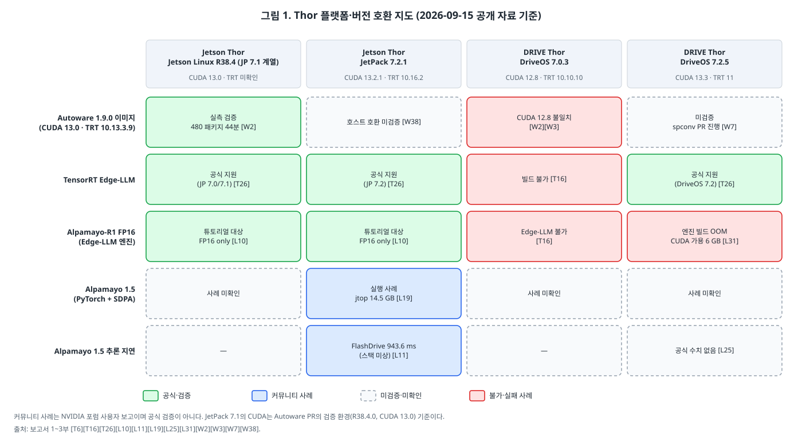
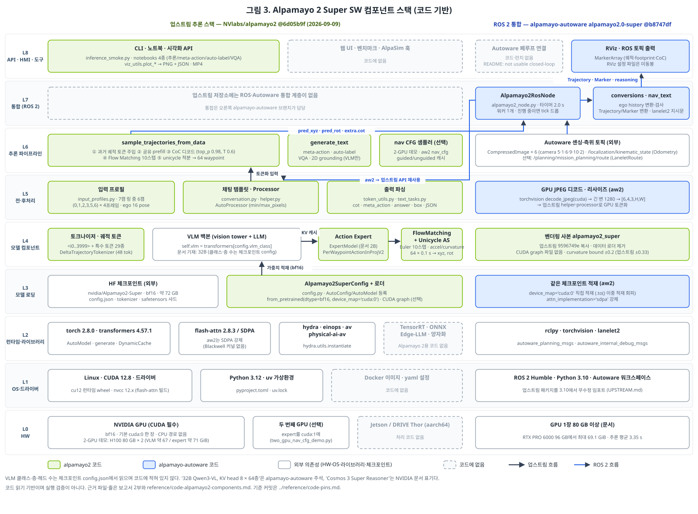
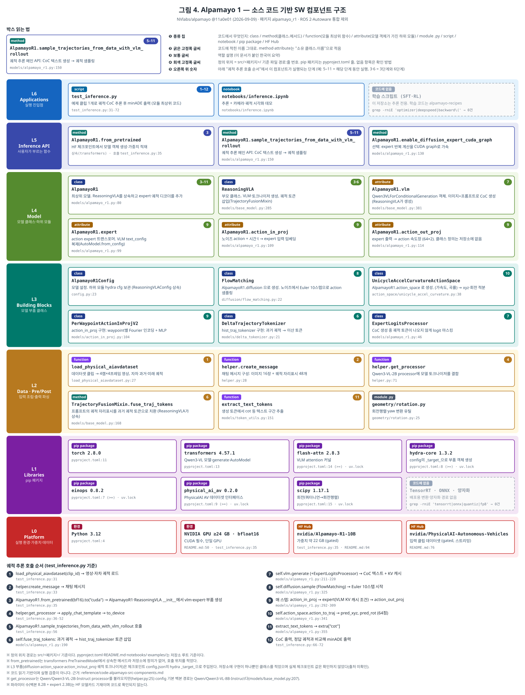
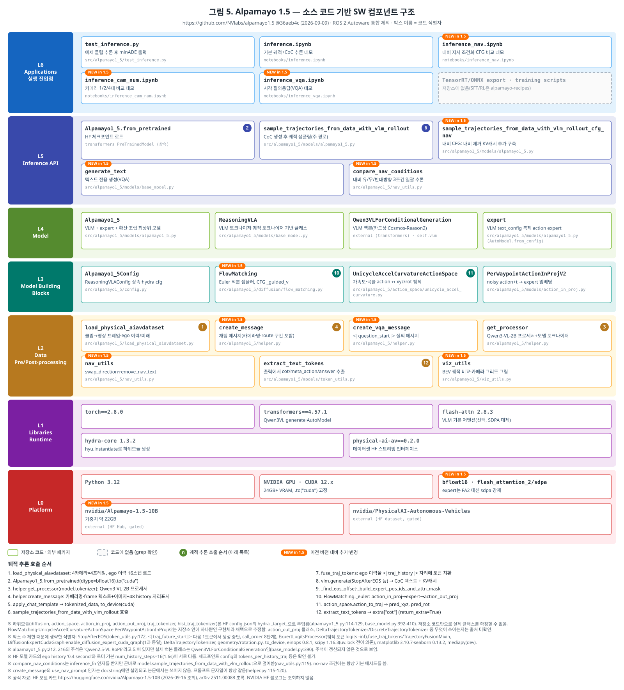
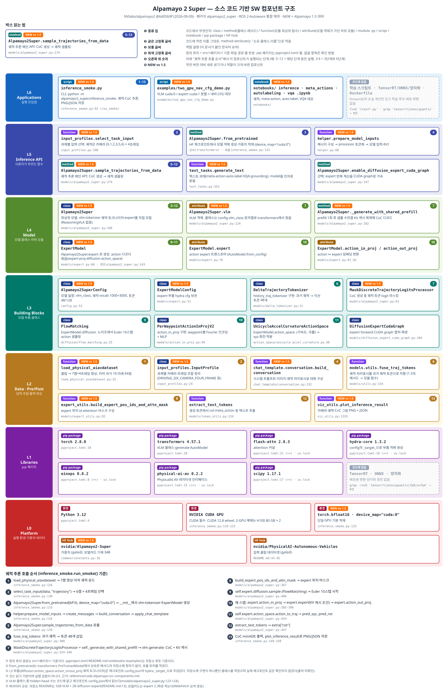
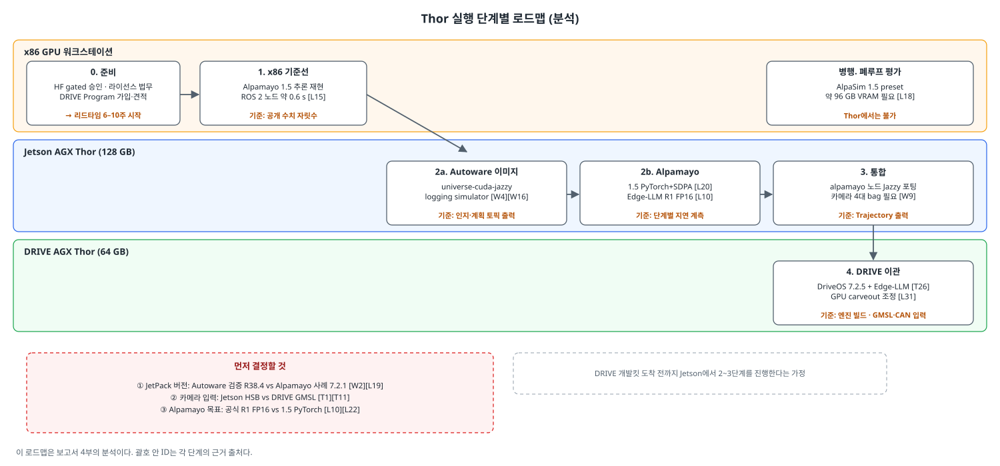

# Thor 위에서 Alpamayo·Autoware 돌리기 — 보드 선택과 실행 사양

> **작성일**: 2026-09-15 · **목적**: NVIDIA Thor(Jetson AGX Thor / DRIVE AGX Thor)에서 Alpamayo(1.5, 2 Super 증류본)와 Autoware를 실제로 실행하기 위한 보드 선택 근거, 사양, 제약, 단계별 계획
> **관련 문서**: 스택 전반의 배경은 [자율주행 SW 스택 파헤치기 심층편](../ad-sw-stack-deep-dive.md) · 출처는 [reference/references.md](reference/references.md)
>
> **출처 표기 원칙**: 모든 사실 문장에 출처 ID와 등급을 붙인다. 확인하지 못한 내용은 ⚠️와 함께 "미확인"으로 적는다. 이 보고서의 판단은 `분석` 블록에만 쓴다. 수치 계산은 "계산"으로 표시한다.

| 등급 | 뜻 |
|---|---|
| 💻 | 고정 커밋의 소스 코드·설정 파일에서 직접 확인 (../reference/code-pins.md) |
| 🔍 | 1차 출처(NVIDIA 문서·datasheet·포럼 공식 답변, GitHub 저장소·PR, 모델카드, 논문) 직접 열람 |
| 📄 | 서드파티 문서(해설·리셀러·벤더 파트너 페이지) 직접 열람 |
| ✅ | 2개 이상 출처 교차 확인 |
| 📰 | 검색 요약·제목만 확인 |
| ⚠️ | 미확인·추정·상충 |

출처 ID 접두어: **T** 보드·플랫폼 · **L** Alpamayo · **W** Autoware · **K** 소스 코드(고정 커밋)

---

## 결론 먼저

1. **2026-09 현재 Thor에서 Alpamayo를 돌리는 공식 경로는 매우 좁다.** NVIDIA 포럼에서 NVIDIA 직원은 "Alpamayo is not available for AGX Thor currently"라고 답하면서, NIM·TensorRT-LLM은 Jetson에서 지원하지 않고 Edge-LLM은 Alpamayo 1 FP16만 지원한다고 설명했다 [L8] 🔍.
2. **공식 온보드 경로는 TensorRT Edge-LLM 하나이며, 지원 모델은 Alpamayo-R1-10B, 정밀도는 FP16뿐이다** [L10][L21] ✅. Edge-LLM v0.10.1 코드도 `alpamayo_r1` 모델 유형만 처리한다 [K13] 💻. Alpamayo 1.5 지원은 GitHub 이슈로 요청만 된 상태다 [L22] 🔍. 시리즈별 가능 여부는 2.2절, 서버 실행 사례는 2.5절에 정리했다.
3. **첫 보드는 Jetson AGX Thor가 현실적이다.**
   - 메모리가 128 GB로 DRIVE 개발킷의 64 GB보다 크다 [T25][T11] 🔍.
   - 공개 판매 중이다(US$3,499) [T14] ✅.
   - Autoware 1.9.0의 Thor 지원도 실측 검증은 Jetson Thor에서만 했다 [W2] 🔍.
   - DRIVE 개발킷에서는 Alpamayo-R1 FP16 엔진 빌드가 GPU 메모리 부족으로 실패한 사례가 있다 [L19][L31] 🔍.
4. **차량 I/O와 안전 경로 검증은 DRIVE AGX Thor 몫이다.** GMSL2/3 카메라, 10G-T1 이더넷, CAN·FlexRay·LIN, 안전 MCU는 DRIVE 개발킷에만 있다 [T11] 🔍.
5. **가장 큰 기술 리스크는 버전 불일치다.** Autoware가 고정한 조합(CUDA 13.0, TensorRT 10.13)이 최신 JetPack 7.2.1(CUDA 13.2.1, TensorRT 10.16.2)이나 DriveOS 7.2.5(CUDA 13.3, TensorRT 11)와 맞지 않는다 [W18][W19][W38][T6] 🔍.
6. **지연은 아직 실시간과 거리가 멀다.** Thor에서 공개된 최선 수치는 Alpamayo 1.5 1회 추론 943.6 ms(FlashDrive 최적화 후)다 [L11] 🔍. Autoware용 Alpamayo 노드의 추론 주기 기본값은 1.5 노드 0.1 s, 2 Super 노드 2.0 s다 [W9] 🔍 [K10][K11] 💻.



---

## 1부. 보드 비교 — Jetson AGX Thor vs DRIVE AGX Thor

### 1.1 사양 비교표

| 항목 | Jetson AGX Thor 개발킷 | DRIVE AGX Thor 개발킷 | 출처 |
|---|---|---|---|
| SoC·모듈 | Jetson T5000 모듈 | Thor-X SoC | [T25][T11] 🔍 |
| CPU | 14코어 Neoverse-V3AE | 14코어 Neoverse V3AE | [T25][T11] 🔍 |
| GPU | Blackwell, CUDA 코어 2,560, MIG 지원 | Blackwell iGPU, CUDA 코어 2,560 (포럼 답변) | [T25][T7] 🔍 |
| AI 성능 표기 | MAXN sparse 2,070 FP4 TFLOPS / 1,035 FP8 TFLOPS | 최대 1,000 INT8 TOPS / 2,000 FP4 TFLOPS (벤더 주장) | [T25][T11] 🔍 |
| DLA | **없음** (PVA 3.0, OFA) | **없음** (PVA, OFA) | [T25][T11] ✅ |
| 메모리 | **128 GB** LPDDR5X, 273 GB/s | **64 GB** LPDDR5X, 273 GB/s | [T25][T11] 🔍 |
| 저장장치 | 1 TB NVMe | 256 GB UFS | [T1][T11] 🔍 |
| 전력 | 모듈 70/90/120 W/MAXN, 개발킷 140 W 전원 | 시스템 350 W | [T25][T14][T11] 🔍 |
| 동작 온도 | 모듈 Tj −25~115 °C | 0–35 °C(SKU10) / 0–45 °C(SKU12) | [T25][T11] 🔍 |
| 카메라 | QSFP28 경유 Holoscan Sensor Bridge(HSB), USB | GMSL2 디시리얼라이저 4개 + GMSL3 1개(4포트 중 2포트 사용 가능) | [T1][T11] 🔍 |
| 이더넷 | 5GbE RJ45 1개, QSFP28(4×25GbE) 1개 | 100/1000/10G-T1 H-MTD 커넥터 5개 | [T1][T11] 🔍 |
| 차량 버스 | 모듈에 CAN 4개. 개발킷 노출 여부 미확인 ⚠️ | 하네스로 CAN 4개, FlexRay, LIN, A2B, 초음파 | [T25][T11] 🔍 |
| 안전 MCU | 확인된 출처 없음 | Renesas U2A16 | [T11] 🔍 |
| 차량 전원 | 없음 | SKU12: DC 9–16 V | [T11] 🔍 |
| 안전 등급 표기 | datasheet에 ASIL 주장 없음 | "ISO 26262 ASIL-D", "ISO 21434 CAL 4" (벤더 주장) | [T25][T5] 🔍 |
| 가격·조달 | US$3,499, 2025-08-25 판매 개시 | 가격 비공개, 공인 대리점 주문, 리드타임 6–10주, DRIVE AGX SDK Developer Program 가입 필요 | [T14][T11][T5] ✅/🔍 |

- 모듈 datasheet와 NVIDIA 블로그의 수치가 다를 때는 datasheet를 따랐다. 블로그는 T5000 GPU를 "2,650-core"로 적었지만 datasheet는 2,560이다 [T2][T25] 🔍.
- DRIVE 개발킷 PDF의 표현은 "ISO 26262 safety certifiable DriveOS"와 "production boards available through Tier1s"다 [T11] 🔍.

> **분석.** DRIVE 개발킷의 ASIL-D 표기는 플랫폼 설계 목표에 대한 벤더 주장이다. 개발킷 자체가 양산 인증품이라는 뜻으로 읽으면 안 된다.

- 두 보드가 "같은 실리콘이며 바이너리 호환"이라고 명시한 NVIDIA 공식 문장은 찾지 못했다 ⚠️.
- Arm 뉴스룸은 두 제품이 같은 Neoverse V3AE 기반이라고 밝혔다 [T28] 📄.
- Autoware PR은 두 보드를 "Thor (Jetson + DRIVE)"라는 하나의 SBSA·CUDA 13 경로로 묶었다 [W2] 🔍.

### 1.2 소프트웨어 스택과 버전

| 플랫폼 버전 | 발표일 | OS·커널 | CUDA | TensorRT | cuDNN | 출처 |
|---|---|---|---|---|---|---|
| JetPack 7.0 (Jetson Linux 38.2) | 2025-08-25 | Ubuntu 24.04, 6.8 | 13.0 | 10.13 | 9.12 | [T13] 🔍 |
| JetPack 7.1 (Jetson Linux 38.4) | 2026-01 | — | 미확인 ⚠️ | 미확인 ⚠️ | — | [T3] 📰 |
| JetPack 7.2 (Jetson Linux 39.2) | 2026-06-02 | Ubuntu 24.04, 6.8 | 13.2.1 | 10.16.2 | 9.20.0 | [T12] 🔍 |
| JetPack 7.2.1 | 2026-08-11 | — | 13.2.1 | 10.16.2 | 9.20.0 | [W38] 🔍 |
| DriveOS 7.0.3 | 2025 | 게스트 Ubuntu 24.04 | 12.8 | 10.10.10 | — | [W28][T30] 🔍 |
| DriveOS 7.2.5 | 2026-08-06 | Ubuntu 24.04, 6.8 | 13.3 | 11 | 9.23.0 | [T6] 🔍 |

**Jetson 쪽**
- JetPack 7은 SBSA 정렬로 컨테이너의 "-igpu" 태그가 필요 없어졌다 [T13] 🔍.
- JetPack 7.2부터 Orin과 Thor가 JetPack 7로 통합됐고, MIG는 T5000에서 "technology preview"다 [T12] 🔍.
- Isaac ROS는 ROS 2 Jazzy 기준으로 JetPack 7.2를 지원한다 [W30] 🔍.

**DRIVE 쪽**
- DriveOS는 Type-1 하이퍼바이저 위에 Linux 또는 QNX 게스트를 올린다 [T29] 📰.
- DriveOS 7.2.5에는 Edge-LLM, TensorRT Model Connect, PVA Algorithms, single-VM GPU 스케줄링이 포함됐다 [T6] 🔍.
- NVIDIA는 DRIVE에서 CUDA만 따로 올릴 수 없고 DriveOS 버전에 묶여 있다고 답했다 [T16] 🔍.

### 1.3 LLM·VLM 추론 런타임

**TensorRT Edge-LLM 지원 조건** [T26] 🔍

| 플랫폼 | 조건 | 엔진 빌드 위치 |
|---|---|---|
| Jetson Thor | JetPack 7.0/7.1 + CUDA 13.0, 또는 JetPack 7.2 + CUDA 13.2 | 기기에서 |
| DRIVE Thor | DriveOS 7.2 + CUDA 13.3 | SDK 컨테이너에서 |

- DriveOS 7.0.3(CUDA 12.8)에서는 Edge-LLM이 빌드되지 않는다 [T16] 🔍.
- Edge-LLM 문서 기준으로 MXFP8·NVFP4는 Blackwell급이 필요하고, FP8은 Orin에서 지원되지 않는다 [L21] 🔍 [K13] 💻.
- Edge-LLM 최신 릴리스는 0.10.1(2026-09)이다 [T24] 🔍.

**다른 런타임**
- NVIDIA 운영자는 2025-10-23 "TensorRT LLM doesn't support Thor"라고 답하고 vLLM·SGLang·Edge-LLM을 권했다 [T22] 🔍. 이후 변경 여부는 미확인이다 ⚠️.
- vLLM의 Triton이 'sm_110a'를 인식하지 못한 이슈가 있었고, 현재 닫혔다 [L26] 🔍.

**Jetson Thor 공식 vLLM 벤치마크** (JetPack 7.0, 입력 2,048 / 출력 128 토큰, 벤더 수치) [T39] 🔍

| 모델 | 동시 요청 1 (tok/s) | 동시 요청 8 (tok/s) |
|---|---|---|
| Llama 3.1 8B | 41.3 | 150.8 |
| Qwen2.5-VL 7B | 45 | 252 |
| Qwen2.5-VL 3B | 71.7 | 356.86 |
| Llama 3.3 70B | 4.7 | 12.6 |

- DRIVE Thor용 공개 LLM 벤치마크 수치는 찾지 못했다 ⚠️.

### 1.4 알려진 이슈

| 플랫폼 | 이슈 | 상태 | 출처 |
|---|---|---|---|
| Jetson | JetPack 7.2 MIG: 큰 slice 실행 중 작은 slice 컨텍스트 생성 hang, 재활성화 시 재부팅 필요 | NVIDIA 재현 못함 | [T18] 🔍 |
| Jetson | JetPack 7.2.1 업그레이드 후 MIG 1g/2g 프로파일 누락, Docker 안에서 MIG 불가 | 스레드 제목 확인 | [T10] 📰 |
| Jetson | JetPack 7.2 클린 설치 후 DisplayPort 출력 불가 | 스레드 제목 확인 | [T10] 📰 |
| Jetson | JetPack 7.2/CUDA 13.2에서 `--gpus=all` 미지원, sbsa/cu132 PyPI 인덱스 패키지 누락 | open | [W55] 📄 |
| DRIVE | 64 GB 장비에서 CUDA 가용 메모리가 6.0 GiB(DriveOS 7.2.5 EA) 또는 15,018 MB(7.0.3 deviceQuery)로 보고됨 | 미해결 | [L31][T7] 🔍 |
| DRIVE | SDK 설치 후 root 파티션 26 GB가 100% 참. NVIDIA는 Docker 크로스컴파일 후 /data 배치 권고 | 답변 완료 | [T32] 🔍 |
| DRIVE | TensorRT가 CUDA stream capture를 암묵적으로 켜고 끄는 API가 없음 | 답변 완료 | [W28] 🔍 |

---

## 2부. Alpamayo on Thor

### 2.0 먼저 읽을 것 — 이름·크기·정밀도

**이름**
- R1은 Alpamayo 1의 원래 이름이다. Hugging Face 모델명은 `Alpamayo-R1-10B`이고 [L1] 🔍, NVIDIA 제품 페이지는 1과 1.5를 "Alpamayo 1 Nano", "Alpamayo 1.5 Nano"로 부른다 [L24] 🔍.
- 따라서 "R1"은 1.5나 2와 별개인 모델이 아니라 1세대를 가리킨다.

**크기 읽는 법**
- "10B", "34B"의 B는 billion(10억)이며 모델 파라미터(가중치) 개수를 뜻한다.
- "22.2 GB", "71.6 GB"는 공개된 가중치 파일의 크기다 [L28][L4] 🔍.
- 파일 크기는 대략 "파라미터 수 × 파라미터 하나당 바이트 수"로 정해진다(계산).

| 정밀도 | 파라미터당 | 10B 모델 | 34B 모델 |
|---|---|---|---|
| BF16 / FP16 (원본) | 2 바이트 | 약 21 GB | 약 68 GB |
| FP8 | 1 바이트 | 약 11 GB | 약 34 GB |
| NVFP4 | 약 0.56 바이트 | 약 6~9 GB | 약 19~23 GB |

- 위 표는 계산이며, NVFP4는 블록 스케일을 포함해 약 4.5비트로 가정했다 ⚠️. 범위의 큰 값은 궤적 생성부(action expert)를 원본 정밀도로 남긴 경우다.
- **실제 실행 메모리는 파일보다 크다.** 입력 영상 버퍼, KV 캐시, 런타임 작업 공간이 더해진다. 예를 들어 Alpamayo 1.5를 FP16으로 실행하면 약 31.6 GB를 썼다 [L11] 🔍.
- GiB는 1024³ 바이트라 GB(10⁹ 바이트)보다 약 7% 크다. 모델카드의 최대 메모리 72,115 MiB는 약 70.4 GiB, 약 75.6 GB다(계산).

**정밀도와 양자화**
- 공개 원본 가중치는 BF16이다 [L1][L3][L4] 🔍. BF16과 FP16은 둘 다 16비트라 크기가 같다.
- **"R1 FP16"은 양자화하지 않은 원본 16비트 정밀도로 엔진을 만든다는 뜻이다.** TensorRT Edge-LLM에서 Alpamayo는 이 방식만 지원한다 [L10] 🔍.
- 양자화는 가중치를 FP8·NVFP4·INT8 같은 8비트·4비트로 줄이는 것이다. NVIDIA 레시피로 1.5를 양자화하면 FP8 약 11 GB, AutoQuant 약 9 GB가 된다 [L7] 🔍. AutoQuant의 코드 기본 목표 비트는 4.8이고, 6.5는 README 예시값이다 [K9] 💻.
- 레시피의 **기본 출력은 `mtq.compress()`로 압축한 실제 FP8·NVFP4 가중치**다. `--fake_quant`를 주면 원본 가중치에 양자화 위치만 표시한(Q/DQ) 체크포인트가 된다 [K9] 💻. 초판은 README 설명을 따라 fake quantization을 기본으로 적었으나 코드와 반대였다.
- 어느 쪽이든 실행 런타임이 저정밀 커널을 갖춰야 실제로 빨라지며, Jetson Thor PyTorch 경로에서는 오히려 느렸다는 보고가 있다 [L8] 🔍.

**DLA**
- DLA(Deep Learning Accelerator)는 Xavier·Orin SoC에 GPU와 별도로 들어간 신경망 전용 가속 블록이다(용어 설명, 출처 미확인).
- **Thor에는 DLA가 없다.** Jetson T5000과 DRIVE Thor-X 모두 가속기는 PVA와 OFA뿐이다 [T25][T11] ✅.

### 2.1 모델 사양

| 항목 | Alpamayo 1 (R1-10B) | Alpamayo 1.5 (10B) | Alpamayo 2 Super |
|---|---|---|---|
| 공개 | 2025-12-03 (HF) | 2026-03-19 (HF) | 2026-08-04 (가중치) |
| 구성 | Cosmos-Reason 8.2B (코드상 Qwen3-VL-8B 구조) + flow-matching action expert 2.3B | Cosmos-Reason2 8.2B (Qwen3-VL-8B 구조) + action expert 2.3B | 32B VLM (NVIDIA 표기 Cosmos 3, 코드 주석상 Qwen3-VL 계열 64층) + action expert 약 2B (모델카드 2.3B) |
| 입력 | 카메라 4대 × 4프레임(t0−0.3 s~t0), 프레임당 163,840~196,608 px로 리사이즈(1080×1920 → 약 320×576), 자차 이력 16점(1.6 s @10 Hz) | 1과 같음, 카메라 수 가변, 내비게이션 명령 | 궤적 과제 카메라 6대(ID 0,1,2,3,5,6), VQA는 ID 0~5, 각 4프레임, 자차 이력 16점 |
| 출력 | 64 waypoints / 6.4 s + 인과 추론 텍스트 | 같음 + QA | 궤적 + 추론 + 메타액션 + VQA + 2D grounding + 자동 라벨 |
| 가중치 | BF16 **22.2 GB** | BF16 **22.2 GB** | BF16 **약 71.6 GB** |
| 권장 HW | 24 GB+ VRAM, H100에서 테스트 | 24 GB+ VRAM | H100 80 GB, 피크 72,115 MiB |
| 출처 | [L1][L27][L28] 🔍 [K6] 💻 | [L3][L28] 🔍 [K7] 💻 | [L4][L5] 🔍 [K8] 💻 |

- R1 저장소는 Python 3.12, `torch==2.8.0`, `transformers==4.57.1`로 버전을 고정하고, flash-attn은 2.8.3 이상을 요구한다 [K6] 💻.
- 2 Super 저장소는 Python 3.12와 flash-attn 빌드를 전제한다 [L5] 🔍 [K8] 💻.
- 세 버전 모두 action expert는 flow matching(Euler)이고 코드 기본 스텝은 10이다. alpamayo-autoware 1.5 노드만 기본 5스텝을 쓴다 [K6][K7][K8][K10] 💻.
- 1.5는 VLM이 flash_attention_2여도 action expert를 SDPA로 강제한다 [K7] 💻.
- 1.5 README는 단일 샘플 약 24 GB, 16샘플 약 40 GB, 16샘플 + CFG 약 60 GB를 적는다 [K7] 💻.

**라이선스 표현 상충** ⚠️

| 문서 | 표현 | 출처 |
|---|---|---|
| NVIDIA Alpamayo LLM-info 페이지 | OpenMDW-1.1, "permitting commercial use" | [L24] 🔍 |
| Alpamayo 1.5 HF 모델카드 | "Commercial licensing available upon request" | [L3] 🔍 |
| FlashDrive README | "non-commercial license" | [L12] 🔍 |
| alpamayo2 README / alpamayo-autoware 2.0-super README | OpenMDW-1.1 / "Model weights: Non-commercial license" | [K8][K11] 💻 |
| PhysicalAI-AV 데이터셋 | gated, "internal development" 용도 한정 | [L16] 🔍 |

> **분석.** 사내 실험은 가능해 보이지만, 증류 모델을 제품에 넣거나 외부에 배포하려면 법무 확인이 먼저다. 데이터셋으로 학습한 증류 모델의 배포 조건은 출처 미확인이다.

### 2.2 시리즈별로 Thor에 올릴 수 있는가

| 시리즈 | 크기 | Jetson AGX Thor (128 GB) | DRIVE AGX Thor 개발킷 (64 GB) |
|---|---|---|---|
| **Alpamayo 1 (R1)** | 10B · 22.2 GB | **공식 경로 있음.** TensorRT Edge-LLM, FP16 only, NVIDIA 튜토리얼 대상 [L10][L21] 🔍. 메모리 충분 [T25] 🔍. Thor 지연 공개 수치 없음 ⚠️ | **공식 조건은 충족하지만 실패 사례가 있음.** Edge-LLM이 DriveOS 7.2를 지원한다 [T26] 🔍. 다만 FP16 엔진 빌드가 GPU 메모리 부족(CUDA 가용 6.0 GB, 15.17 GB 요청)으로 실패했고 미해결이다 [L19][L31] 🔍 |
| **Alpamayo 1.5** | 10B · 22.2 GB | **공식 지원 없음, 비공식 실행 사례 있음.** Edge-LLM 지원은 요청 단계다 [L22] 🔍. 커뮤니티 사용자가 PyTorch + SDPA로 실행해 약 14.5 GB를 썼다 [L19][L20] 🔍. 1회 추론 3,770.3 ms, FlashDrive 최적화 후 943.6 ms [L11] 🔍 | **공식 지원·실행 사례 모두 없음** ⚠️. 1과 같은 메모리 할당 제약이 걸릴 가능성이 크다(분석) |
| **Alpamayo 2 Super** | 34B · 71.6 GB | **공식 지원·실행 사례 모두 없음** ⚠️. 원본은 계산상 128 GB에 들어가지만 여유가 적다. NVFP4로 약 23 GB가 되지만 변환·실행 도구가 없다(계산) | **사실상 불가.** 원본 71.6 GB가 64 GB를 넘는다(계산). NVFP4는 계산상 경계선이지만 도구가 없다 |

- NVIDIA 직원의 "Alpamayo is not available for AGX Thor currently"라는 답변은 같은 글에서 NIM·TensorRT-LLM의 Jetson 미지원과 "Edge-LLM은 Alpamayo 1 FP16만 지원"을 함께 설명한다 [L8] 🔍.
- NVIDIA가 말하는 "DRIVE AGX Thor용 증류·양자화 student 모델"은 공개되지 않았다 [L24][L6] ⚠️.

> **분석.** 공식적으로 되는 조합은 "Alpamayo 1을 Jetson AGX Thor에서 원본 16비트로 Edge-LLM 실행" 하나다. 1.5는 Jetson에서 비공식으로만 동작하고, 2 Super는 두 보드 모두 현재 실행 경로가 없다.

### 2.3 공식 배포 경로와 그 한계

**NVIDIA가 말하는 경로**
- NVIDIA는 공개 체크포인트를 "cloud-side teacher"로, 차량 내 추론을 "distilled and quantized student model on DRIVE AGX Thor via TensorRT Edge-LLM"으로 설명한다 [L24] 🔍.
- **공개된 student 가중치나 distillation 레시피는 찾지 못했다** [L6][L24] ⚠️. 레시피 저장소 코드에도 SFT·RL·1.5 양자화만 있다 [K9] 💻.

**NVlabs/alpamayo-recipes**
- 제공 레시피는 Alpamayo 1·1.5 SFT, RL(GRPO), 1.5 양자화(ModelOpt)다. distillation, ONNX export, TensorRT 변환, Thor 전용 지침은 없다 [L6] 🔍.
- 양자화 레시피 환경은 RTX 5090 + CUDA 12 또는 B300 + CUDA 13, PyTorch 2.8.0, ModelOpt 0.43.0이다 [L7] 🔍.
- 결과 크기는 FP8 약 11 GB, AutoQuant 6.5 bit 약 9 GB다. 출력은 downstream SDK용 "fake quantization"(Q/DQ) 체크포인트다 [L7] 🔍.

**TensorRT Edge-LLM**
- 워크플로는 HF 체크포인트 → ONNX export → TensorRT 엔진 빌드 → C++ 런타임이다 [L9] 🔍.
- Jetson AI Lab 튜토리얼은 "Alpamayo R1 (VLA/robotics, FP16 only)"로 표기한다 [L10] 🔍.
- 같은 튜토리얼은 "TensorRT engines are hardware-specific and must be built on the device"라고 적는다 [L10] 🔍.
- action expert는 별도 엔진으로 빌드하며, 그 `max_kv_cache_capacity`가 LLM 엔진 빌드 값과 같아야 한다 [L35] 🔍 [K13] 💻.
- Edge-LLM의 Alpamayo action 엔진 출력은 웨이포인트 좌표가 아니라 (accel, curvature) 쌍이고, Alpamayo에는 speculative decoding을 허용하지 않는다 [K13] 💻.
- Edge-LLM v0.10.1 코드에는 Alpamayo 1.5·2 관련 분기나 문자열이 없다 [K13] 💻.
- Alpamayo 1.5 checkpoint를 넣으면 `KeyError: 'hidden_size'`가 난다는 사용자 보고가 있다 [L8] 🔍. 코드상 원인도 맞는다. v0.10.1은 `model_type == "alpamayo_r1"`일 때만 VLM 설정을 끌어오고, 1.5의 모델 유형은 `alpamayo1_5`다 [K13][K7] 💻.
- NVIDIA 블로그는 Alpamayo 1이 DRIVE Thor에서 "production-viable latencies"를 낸다고 썼지만 수치는 없다 [L25] 🔍.

**student 후보 (Edge-LLM이 지원하는 VLM)** [L21] 🔍
- Qwen3-VL 2B / 4B / 8B, Cosmos-Reason2 2B / 8B, Qwen2.5-VL 3B / 7B, InternVL3/3.5 1–14B
- Cosmos-Reason2 8B NVFP4 데모는 약 4 GB다 [L10] 🔍.

### 2.4 측정된 지연·메모리 (주요 수치)

| 모델 | 하드웨어 | 조건 | 1회 추론 지연 | 메모리 | 출처 |
|---|---|---|---|---|---|
| Alpamayo-R1 | RTX 6000 Pro Blackwell | 추론 텍스트 40토큰, flow-matching 5스텝 | **99 ms** = 비전 3.43 + prefill 16.54 + 디코딩 70 + 궤적 8.75 | — | [L27] 🔍 |
| Alpamayo-R1 | 같음 | 추론 텍스트 없이 궤적만 | 29 ms | — | [L27] 🔍 |
| Alpamayo 1.5 | RTX PRO 6000 | 기준 → FlashDrive | 716.9 → 151.4 ms | FP16 약 31.6 GB → W4A8 약 18.3 GB | [L11] 🔍 |
| Alpamayo 1.5 | **Jetson Thor** | 기준 → FlashDrive, 1 sample | **3,770.3 → 943.6 ms** | — | [L11] 🔍 |
| Alpamayo 1.5 | **Jetson Thor** | 기준 → FlashDrive, 6 samples | 14,596.5 → 1,522.6 ms | — | [L11] 🔍 |
| Alpamayo 1.5 ROS 2 노드 | RTX PRO 6000 (96 GB) | GPU 상주 전처리 + TensorRT expert(SmoothQuant INT8 QDQ + FP16, ONNX Runtime TensorRT EP) + 5스텝, 카메라 4대 | **0.600 s** (1.67 FPS) | — | [L15] 🔍 [K10] 💻 |
| Alpamayo 2 Super ROS 2 노드 | RTX PRO 6000 | 평균 / p90 | 3.35 s / 3.97 s, "not usable closed-loop" | 피크 69.1 GiB | [W10] 🔍 |
| Alpamayo 1.5 | Jetson Thor, JetPack 7.2.1 | PyTorch 네이티브 + SDPA, AutoQuant 6.5 bit | 1회 지연 미보고. 평가 약 455 s/clip (FP16 약 424 s/clip) | jtop 14.5 GB | [L8][L19] 🔍 |
| Alpamayo-R1 | DRIVE AGX Thor, DriveOS 7.2.5 EA | Edge-LLM 0.9.0 FP16 엔진 빌드 | **빌드 실패** | 15.17 GB 요청, CUDA 가용 6.0 GB | [L19][L31] 🔍 |

- FlashDrive 논문은 Jetson Thor 측정에 쓴 소프트웨어 스택과 정밀도를 적지 않았다 [L11][L32] ⚠️.
- Alpamayo-R1 논문 측정은 flow matching 5스텝이지만, 공개 코드의 기본값은 10스텝이다 [K6] 💻.
- 커뮤니티 사례의 양자화 모델은 "No real-quant GEMM found" 경고가 나 저정밀 커널 가속을 받지 못한 것으로 보인다 [L8] 🔍.

> **분석.** 공개된 Thor 수치에서 가장 빠른 값도 1회 약 0.94 s다. Alpamayo를 폐루프 제어 경로에 넣는 것은 아직 이르다. 첫 목표는 "기능 동작 + 병목 계측"으로 잡는 것이 현실적이다.

### 2.5 서버·워크스테이션 실행 사례

측정 조건(샘플 수, 추론 텍스트 길이, 최적화 여부)이 출처마다 다르다. 같은 표 안에서도 행 사이 직접 비교는 조건을 확인한 뒤에 해야 한다.

**Alpamayo 1 (R1, 10B)**

| 환경 | 결과 | 출처 |
|---|---|---|
| RTX 6000 Pro Blackwell | 1회 **99 ms** (추론 텍스트 40토큰, 논문 표 14) | [L27] 🔍 |
| RTX PRO 6000 | 704 → 155 ms (FlashDrive 최적화 전후) | [L12] 🔍 |
| H100 | 테스트 환경. 24 GB+ GPU 호환 표기 (저장소 README: RTX 3090·4090·A5000·H100, 모델카드는 3090 Ti 포함) | [L1] 🔍 [K6] 💻 |
| RTX 5070 Ti 16 GB | 메모리가 모자라 CPU-GPU 스와핑으로 실행, 기존 오프로드 대비 최대 3.55배 | [L13] 🔍 |
| 테스트 차량 | 도심 공로 주행 성공 보고. 차량 컴퓨터 사양은 논문에 없음 | [L27] 🔍 |
| 클라우드 H100 | TreeHacks 2026 프로젝트가 차량의 Jetson Thor 대신 클라우드에서 약 5초 주기로 실행 | [L38] 📄 (AI 생성 위키 경유) |

**Alpamayo 1.5 (10B)**

| 환경 | 결과 | 출처 |
|---|---|---|
| RTX PRO 6000 | 716.9 → **151.4 ms** (FlashDrive), 메모리 FP16 약 31.6 GB → W4A8 약 18.3 GB | [L11] 🔍 |
| RTX 5090 | 878.1 → 183.7 ms (FlashDrive) | [L11] 🔍 |
| RTX 4090 | 1,307.1 → 217.2 ms (FlashDrive) | [L11] 🔍 |
| RTX 3090 | 1,891.9 → 382.3 ms (FlashDrive) | [L11] 🔍 |
| RTX 5090 + CUDA 12 / B300 + CUDA 13 | NVIDIA 양자화 레시피의 실행 환경 (지연 수치 없음) | [L7] 🔍 |
| AlpaSim 폐루프 평가 | 1.5 preset 약 96 GB VRAM 필요 | [L18] 🔍 |

**Alpamayo 1.5 Autoware ROS 2 노드** — RTX PRO 6000 (96 GB), 카메라 4대 × 4프레임, 1080×1920 [L15] 🔍 [K10] 💻. 여기서 TensorRT expert는 SmoothQuant INT8 QDQ 모델을 ONNX Runtime TensorRT EP(int8 + fp16)로 돌리는 방식이다

| 설정 | 지연 | FPS | 궤적 편차 |
|---|---|---|---|
| CPU 전처리 + 샘플링 + 기본 expert + 10스텝 (원본) | 0.820 s | 1.22 | 기준 |
| GPU 전처리 + greedy + 기본 expert + 10스텝 | 0.820 s | 1.22 | 약 0.4% |
| GPU 전처리 + greedy + 기본 expert + 5스텝 | 0.720 s | 1.39 | 약 0.4% |
| GPU 전처리 + greedy + TensorRT expert + 10스텝 | 0.700 s | 1.43 | 약 1.3% |
| GPU 전처리 + greedy + TensorRT expert + 5스텝 | 0.660 s | 1.52 | 약 1.8% |
| GPU 상주 전처리 + greedy + TensorRT expert + 5스텝 | **0.600 s** | 1.67 | 약 1.8% |

**Alpamayo 2 Super (34B)**

| 환경 | 결과 | 출처 |
|---|---|---|
| H100 80 GB | 모델카드 테스트 환경, 최대 메모리 72,115 MiB | [L4] 🔍 |
| H100 80 GB × 2 | 내비게이션 CFG용 고급 2-GPU 데모 (기본 경로는 GPU 한 장). VLM GPU 0 약 67 GiB, action expert GPU 1 약 71 GiB | [L4] 🔍 [K8] 💻 |
| RTX PRO 6000 (96 GB), Autoware ROS 2 노드 | 로딩 28.6 s, 1회 추론 평균 **3.35 s** / p90 3.97 s, 최대 69.1 GiB, "not usable closed-loop" (304회 측정, 중앙값 3.29 s) | [W10] 🔍 [K11] 💻 |

> **분석.** Alpamayo 1·1.5는 24 GB 이상 소비자용 GPU에서 돌아가고, 최적화하면 RTX 4090급에서 약 0.2 s다. 2 Super는 80 GB 이상 GPU가 필요하고 1회 약 3.4 s라 실시간 제어에는 느리다. 가장 빠른 99 ms는 워크스테이션 GPU 수치라 차량용 칩에 그대로 기대할 수 없다.

### 2.6 메모리 계산 (계산)

전제
- 파라미터 수는 모델카드 값을 쓴다 [L1][L4].
- 1 GB = 10⁹ bytes로 계산한다.
- NVFP4는 블록당 스케일을 포함해 파라미터당 약 4.5 bit로 가정한다 ⚠️.
- 활성값, 비전 인코더 버퍼, TensorRT 작업 버퍼는 뺐다.

| 모델 | BF16 | FP8 | NVFP4 백본 + BF16 expert | 공표·실측 대조 |
|---|---|---|---|---|
| R1 / 1.5 (10.5B) | 21.0 GB | 10.5 GB | 9.2 GB | HF 22.2 GB [L28], FP8 약 11 GB [L7], Thor jtop 14.5 GB [L19] |
| 2 Super (34.3B) | 68.6 GB | 34.3 GB | 22.6 GB | HF 71.6 GB, H100 피크 72,115 MiB [L4] |

- 1.5의 KV 캐시는 입력 약 3,000 토큰 기준 약 0.44 GB(BF16)로 계산했다. 코드의 기본 VLM은 Qwen3-VL-8B이고 [K7] 💻, 그 공개 설정의 층·헤드 값(36층, KV head 8, head_dim 128)이 가정과 일치한다(HF config를 요약 경유로 확인) 📰.
- 입력 토큰 가정도 Edge-LLM 예시 빌드값(이미지당 192토큰, maxInputLen 3,424)과 맞는다 [K13] 💻.
- 2 Super VLM은 64층, KV head 8로 설정돼 있고(요약 경유 📰), alpamayo-autoware README는 5k 토큰 캐시를 약 1.2 GiB로 적는다 [K11] 💻.

**플랫폼별 적재 가능성 (계산·판단)**

| 플랫폼 | 메모리 | R1/1.5 BF16 | 2 Super BF16 | 2 Super NVFP4 |
|---|---|---|---|---|
| Jetson AGX Thor (T5000) | 128 GB 통합 [T25] | 가능 (실사례 [L19]) | 계산상 가능하나 여유 적음 | 계산상 가능, 지원 툴체인 없음 |
| Jetson T4000 | 64 GB [T25] | 가능 | 불가 | 가능 |
| DRIVE AGX Thor 개발킷 | 64 GB, CUDA 가용 6–15 GB 보고 [L31][T7] | carveout 확대 전에는 불가 | 불가 | carveout 확대 전제로 경계선 |

### 2.7 블로커 목록

| 블로커 | 내용 | 출처 |
|---|---|---|
| 공식 미지원 | NVIDIA 직원: AGX Thor에서 Alpamayo 사용 불가, NIM·TensorRT-LLM도 Jetson 미지원 | [L8] 🔍 |
| Edge-LLM 범위 | R1만, FP16만. 1.5는 로드맵 요청 단계 | [L10][L22] 🔍 |
| flash-attn | 2.8.3의 빌드 대상에 SM 110(Thor)이 없어 SDPA로 대체해야 함 | [L20] 🔍 |
| 2 Super 공개 코드 | TensorRT·ONNX·양자화·Jetson·aarch64 처리 코드가 없음 (2.9절) | [K8][K11] 💻 |
| PyTorch 휠 | Thor용 휠 ABI 문제로 소스 빌드한 사례 | [L20] 🔍 |
| DRIVE GPU carveout | CUDA 가용 메모리가 작아 FP16 엔진 빌드 OOM, 해결 절차 미확정 | [L19][L31] 🔍 |
| 폐루프 평가 | AlpaSim의 Alpamayo 1.5 preset은 약 96 GB VRAM 필요 | [L18] 🔍 |
| 데이터 | PhysicalAI-AV는 gated, 133 TB | [L16] 🔍 |

### 2.8 커뮤니티가 Jetson Thor에서 쓴 절차 (참고)

아래는 NVIDIA 포럼 사용자 한 명이 보고한 절차다. NVIDIA 공식 가이드가 아니다 [L20] 🔍.

1. uv로 Python 3.12.3 환경 구성
2. PyTorch 소스 빌드 (`TORCH_CUDA_ARCH_LIST=11.0`, distributed 비활성)
3. TorchVision 0.23.0 소스 빌드 (PyPI 휠 ABI 불일치)
4. flash-attn 설치 생략, 모델 로딩에 `attn_implementation='sdpa'` 지정
5. recipes의 `quantize.py`로 AutoQuant 6.5 bit, 보정 클립 100개

- 같은 사용자가 스레드마다 PyTorch 버전을 2.9.0과 2.13.0으로 다르게 적었다 [L20][L8] ⚠️.

---

### 2.9 Alpamayo 2 Super SW 컴포넌트 (코드 기반)

아래 그림은 `NVlabs/alpamayo2`(커밋 6d05b9f)와 `alpamayo-autoware`의 `alpamayo2.0-super` 브랜치(커밋 b8747df)의 코드를 읽어 층별로 정리한 것이다 [K8][K11] 💻. 실행으로 검증한 구조가 아니다. 파일·줄 단위 근거는 [reference/code-alpamayo2-components.md](reference/code-alpamayo2-components.md)에 있다.



| 층 | 업스트림 `alpamayo2` | ROS 2 통합 `alpamayo-autoware` |
|---|---|---|
| L8 API·HMI·도구 | CLI `inference_smoke`, 노트북 4종(추론·meta-action·auto-label·VQA), 시각화 API(PNG·JSON·MP4). 웹 UI·AlpaSim 연동 코드 없음 | RViz용 MarkerArray, `/alpamayo/reasoning` 텍스트 토픽. RViz 설정 파일은 미동봉 |
| L7 통합 | 없음 | `Alpamayo2RosNode`: 타이머 2.0 s, 워커 1개, 진행 중이면 tick 드롭. `conversions`·`nav_text`가 ego history 변환과 Trajectory 변환 담당 |
| L6 추론 파이프라인 | `sample_trajectories_from_data`: 과거 궤적 토큰 주입 → 공유 prefill → CoC 샘플링 디코드(top_p 0.98, T 0.6) → Flow Matching 10스텝 → unicycle 적분. 텍스트 과제는 `generate_text` | 업스트림 함수를 그대로 호출. 내비 CFG는 실험 기능, 기본 꺼짐 |
| L5 전·후처리 | 7대 카메라 링 중 궤적 과제 6대(ID 0,1,2,3,5,6) × 4프레임, 자차 이력 16점, 채팅 템플릿, 출력 텍스트 파싱 | GPU에서 JPEG 디코드 → 긴 변 1280 리사이즈 → 업스트림 processor로 GPU 토큰화 |
| L4 모델 컴포넌트 | VLM(클래스는 체크포인트 config에서 동적 로드), 궤적 토크나이저(`<i0..3999>`, 과거 궤적 48토큰), `ExpertModel`(VLM KV 캐시를 조건으로 non-causal 추론), `FlowMatching`(Euler), `UnicycleAccelCurvatureActionSpace`(64 × 0.1 s) | 업스트림 사본을 벤더링. CUDA graph 파일 없음, curvature bound ±0.2(업스트림 ±0.33) |
| L3 모델 로딩 | `Alpamayo2Super.from_pretrained(dtype=bf16, device_map="cuda:0")`, AutoConfig/AutoModel 등록, 선택적 CUDA graph | 같은 체크포인트를 `cuda:0`에 직접 적재, `attn_implementation="sdpa"` 강제 |
| L2 런타임 | torch 2.8.0, transformers 4.57.1, flash-attn 2.8.3 이상, hydra·einops·av·physical-ai-av | rclpy, torchvision, lanelet2, Autoware 메시지 |
| L1 OS·드라이버 | Linux, CUDA 12.8 wheel, nvcc 12.x, Python 3.12, uv. Dockerfile·yaml 설정 없음 | ROS 2 Humble, Python 3.10, Autoware 워크스페이스 필수 |
| L0 HW | NVIDIA GPU 필수(CPU 경로 없음), 기본 GPU 한 장. 선택: 2-GPU 데모(VLM cuda:0 / expert cuda:1) | GPU 한 장 80 GB 이상(문서 기재) |

출처: [K8][K11] 💻 (문서 기재 수치는 [W10] 🔍)

**코드에 없는 것** (grep·find로 확인) [K8][K11][K9][K13] 💻
- TensorRT·ONNX·양자화 경로. 노드 코드 주석은 "The TensorRT expert engine is unavailable for this generation"이라고 적는다.
- Jetson·aarch64·Thor 처리 코드
- TensorRT Edge-LLM v0.10.1의 Alpamayo 2 지원, alpamayo-recipes의 2 Super 레시피
- VLM 층·hidden·head 수의 코드 내 정의. 체크포인트 `config.json`에서 읽는다

> **분석.** Alpamayo 2 Super의 공개 코드는 데이터센터 GPU 한 장 위의 순수 PyTorch 추론 패키지이고, ROS 2 노드는 그 API를 감싼 얇은 통합층이다. Thor로 옮기려면 L0~L3의 가속·양자화·aarch64 경로를 새로 만들어야 하며, 공개 코드에는 그 출발점이 없다.

---

### 2.10 Alpamayo 1 · 1.5 · 2 Super 소스 코드 기반 컴포넌트 구조

2.9절 그림이 ROS 2 통합까지 한 장에 담았다면, 이 절의 세 그림은 **각 업스트림 저장소의 소스 코드만** 층별로 정리한 것이다. ROS 2·Autoware 통합(alpamayo-autoware)은 넣지 않았다.

각 그림 상단의 "박스 읽는 법"에 같은 내용을 넣었다. 박스 한 개는 위에서부터 다음 순서로 읽는다.

1. **종류 칩**: 코드에서 그 이름이 무엇인지 표시한다.
   - `class`: 클래스
   - `method`: 클래스에 속한 메서드. `클래스.메서드`로 적는다.
   - `function`: 모듈 최상위 함수. 필요하면 `모듈.함수`로 적는다.
   - `attribute`: 모델 객체가 가진 하위 모듈. `클래스.속성`으로 적는다. 예: `Alpamayo2Super.vlm`
   - 그 밖에 `module .py`(파일 전체), `script`, `notebook`, `pip package`, `HF Hub`(체크포인트·데이터셋), `환경`, `코드에 없음`(점선 박스, grep·find로 확인)
2. **굵은 고정폭 글씨**: 코드에 적힌 식별자 그대로다.
3. **보통 글씨**: 이 문서가 붙인 역할 설명이다.
4. **회색 고정폭 글씨**: 정의 위치(`src/<패키지>/` 기준 `파일:줄`)다.
   - `pyproject.toml`·`README.md`·`notebooks/`·`examples/`는 저장소 루트 기준이다.
   - `from_pretrained`는 transformers에서 상속한 메서드라 저장소에 정의가 없어 호출 위치를 적었다.
5. **오른쪽 위 숫자**: 그림 아래 "궤적 추론 호출 순서"에서 그 컴포넌트가 실행되는 단계다.
   - `5–11`은 5~11단계 동안 실행된다는 뜻이고, `3·6`은 3단계와 6단계를 뜻한다.
   - 최상위 모델 클래스(`AlpamayoR1`·`Alpamayo1_5`·`Alpamayo2Super`)에는 생성(3단계)부터 추론이 끝날 때까지의 범위가 붙는다.
6. **주황 `NEW` 칩**: 직전 버전 대비 새로 생기거나 역할이 크게 바뀐 컴포넌트다.
- **근거:**
  - 박스별 파일·줄 근거, 호출 순서, 공식 자료 대조표는 [reference/code-alpamayo-src-components.md](reference/code-alpamayo-src-components.md)에 있다 [K6][K7][K8] 💻.
  - 역할 설명은 공식 자료와 대조했다: 모델카드 [L1][L3][L4], 논문 [L27], 블로그 [L39] 🔍.
  - 모두 코드 읽기 기반이며 실행으로 검증하지 않았다.

층은 세 그림 모두 같은 틀을 쓴다.

| 층 | 담는 것 |
|---|---|
| L6 Applications · 실행 진입점 | 실행 스크립트, CLI, 노트북, 예제 |
| L5 Inference API | 사용자가 부르는 공개 함수·메서드 |
| L4 Model | 최상위 모델 클래스와 주요 하위 모듈 |
| L3 Model Building Blocks | config, 궤적 토크나이저, logits processor, 입력 projection, flow matching, action space, CUDA graph |
| L2 Data · Pre/Post-processing | 데이터 로더, 입력 프로필, 채팅 메시지, 출력 텍스트 파싱, 시각화 |
| L1 Libraries · Runtime | 실제 import하는 외부 패키지와 고정 버전 |
| L0 Platform | Python, GPU·dtype, HF 체크포인트, 데이터셋 |

#### Alpamayo 1



- **구조:** `AlpamayoR1`이 `ReasoningVLA`를 상속한다. 하위 모듈은 `vlm`(`Qwen3VLForConditionalGeneration`), `expert`(VLM `text_config`를 복제해 만든 action expert), `action_in_proj`, `action_out_proj`다 [K6] 💻.
- **추론 API:** `sample_trajectories_from_data_with_vlm_rollout`. 기본값은 `num_traj_samples=6`, top_p 0.98, temperature 0.6이다 [K6] 💻.
- **추론 흐름:**
  1. `vlm.generate`로 CoC 텍스트(코드 이름 `cot`)를 만든다.
  2. `FlowMatching`이 Euler 10스텝으로 (가속도, 곡률) 64 × 2를 샘플링한다.
  3. `UnicycleAccelCurvatureActionSpace.action_to_traj`가 이를 xyz·회전으로 적분한다 [K6] 💻.
- **입력:** 카메라 4대 × 4프레임, 자차 이력 16점(10 Hz), 프롬프트 안 `<|traj_history|>` 48개 [K6] 💻.
- **체크포인트:** `nvidia/Alpamayo-R1-10B`, 약 22 GB. README 기재 최소 VRAM은 24 GB다 [K6] 💻.
- **processor 불일치:** `get_processor`는 `Qwen/Qwen3-VL-2B-Instruct`의 processor를 불러오고 토크나이저만 모델 것으로 바꾼다. config 기본 백본 경로는 `Qwen/Qwen3-VL-8B-Instruct`다 [K6] 💻.
- **코드에 없음:** 학습(SFT·RL) 스크립트, TensorRT·ONNX·양자화. 논문의 RL post-training(GRPO)과 경로 조건 입력은 특수 토큰 이름만 남아 있다 [K6] 💻 [L27] 🔍.

#### Alpamayo 1.5



- **구조:** 모델 뼈대는 1과 같다(`Alpamayo1_5` → `ReasoningVLA` → Qwen3-VL + expert) [K7] 💻.
- **추가된 컴포넌트:**
  - 내비게이션 조건 입력: `create_message(nav_text)`가 `<|route_start|>…<|route_end|>`를 넣고, `nav_utils`가 비교 유틸을 제공한다.
  - 내비 CFG: `sample_trajectories_from_data_with_vlm_rollout_cfg_nav`가 내비 구간을 뺀 unguided KV 캐시를 따로 만든다. `FlowMatching._guided_v`가 `(1-α)·unguided + α·guided`를 계산한다.
  - 텍스트 질의응답: `generate_text`, `create_vqa_message`
  - 카메라 수 비교와 시각화: `inference_cam_num.ipynb`, `viz_utils` [K7] 💻
- **attention:** VLM이 flash_attention_2일 때 expert만 sdpa로 강제한다(`alpamayo1_5.py:107-109`) [K7] 💻.
- **README 기재 VRAM(H100):** 샘플 1개 약 24 GB, 16개 약 40 GB, 16개 + CFG 약 60 GB [K7] 💻.
- **공식 자료와 불일치:** 자차 이력 길이를 모델카드는 0.4 s로 쓰는데 [L3] 🔍, 코드 로더 기본값은 16스텝(1.6 s)이다 [K7] 💻. 체크포인트 config로 덮어쓰는지는 확인하지 못했다(출처 미확인).

#### Alpamayo 2 Super



- **구조 재편:** `ReasoningVLA`·`base_model.py`가 없어졌다. `Alpamayo2Super`가 VLM 클래스를 `getattr(transformers, config.vlm_class)`로 동적으로 불러오고(`alpamayo2_super.py:123`), 독립 `ExpertModel`을 붙인다 [K8] 💻.
- **추론 API:** 입력 준비가 `select_task_input` → `prepare_model_inputs` → `sample_trajectories_from_data`로 나뉘었다. `_generate_with_shared_prefill`이 prefill을 한 번만 하고 샘플끼리 공유한다 [K8] 💻.
- **카메라 입력:** 로더는 7대를 읽고, `input_profiles`가 과제별로 6대 × 4프레임을 고른다. 궤적은 카메라 (0,1,2,3,5,6), VQA는 (0,1,2,3,4,5)다 [K8] 💻.
- **궤적 토큰:**
  - vocab: 1의 768 → 과거 1000 + 미래 3000 (`config.py:63-64`)
  - 미래 궤적 토큰 수: 64 → 128 (`config.py:73`)
  - 과거 이력: 16점 → 48토큰 (`DeltaTrajectoryTokenizer`)
  - 생성 중 마스킹: `MaskDiscreteTrajectoryLogitsProcessor` [K8] 💻
- **텍스트 과제:** `text_tasks`와 `chat_template.conversation`이 meta-action, auto-label JSON, VQA, 2D grounding을 맡는다 [K8] 💻.
- **1.5와 같은 부분:** `UnicycleAccelCurvatureActionSpace`, `PerWaypointActionInProjV2`, CUDA graph helper, flow 10스텝, 샘플링 기본값, torch 2.8.0·transformers 4.57.1 [K7][K8] 💻.
- **공개 API에서 빠진 것:** 내비 CFG는 `examples/two_gpu_nav_cfg_demo.py`에만 남았다 [K8] 💻.
- **체크포인트:** `nvidia/Alpamayo2-Super`. 모델카드 기재는 34B, bf16이다 [L4] 🔍. VLM 층·hidden·head 수는 코드에 없고 체크포인트 `config.json`에서 읽는다 [K8] 💻.
- **공식 자료 간 불일치:** 저장소 README는 "32B VLM backbone with a 2B diffusion expert"로 적는다(`README.md:13`) [K8] 💻. 모델카드는 action expert를 2.3B로 적는 것으로 확인됐으나 WebFetch 요약을 거쳤다 [L4] 📰.

#### 세 버전 비교 요약

| 항목 | Alpamayo 1 | Alpamayo 1.5 | Alpamayo 2 Super |
|---|---|---|---|
| 최상위 클래스 | `AlpamayoR1(ReasoningVLA)` | `Alpamayo1_5(ReasoningVLA)` | `Alpamayo2Super` (ReasoningVLA 제거) |
| VLM 결합 | `Qwen3VLForConditionalGeneration` 고정 | 같음 | `getattr(transformers, vlm_class)` 동적 |
| 궤적 API | `sample_trajectories_from_data_with_vlm_rollout` | 같음 + `_cfg_nav` | `sample_trajectories_from_data` (공유 prefill) |
| 텍스트 API | 없음 | `generate_text` (VQA) | `generate_text` + `text_tasks` (meta-action·auto-label·VQA·grounding) |
| 카메라 입력 | 4대 × 4프레임 | 기본 4대, 부분집합 가능 | 7대 로드 → 과제별 6대 × 4프레임 |
| 궤적 토큰 vocab | 768 | 768 | 1000 + 3000 |
| action 디코더 | `FlowMatching` Euler 10스텝 → unicycle 64 × 0.1 s | 같음 + CFG | 같음 (CFG는 예제만) |
| 로딩 | `.to("cuda")` | `.to("cuda")` | `device_map="cuda:0"` |
| 체크포인트 | `nvidia/Alpamayo-R1-10B` | `nvidia/Alpamayo-1.5-10B` | `nvidia/Alpamayo2-Super` |

출처: [K6][K7][K8] 💻, 체크포인트 크기 [L1][L3][L4] 🔍

**하위 모듈 클래스 확정 불가** [K6][K7][K8] 💻
- diffusion, action space, projection, 토크나이저는 체크포인트 `config.json`의 hydra `_target_`으로 주입된다.
- L3의 클래스 이름은 저장소 안에 하나뿐인 구현체라서 그것이 쓰인다고 본 것이다(출처 미확인).
- Alpamayo 1·1.5의 `action_out_proj` 클래스는 저장소에 정의가 없다.

> **분석.** 세 버전 모두 "VLM이 CoC를 생성 → expert가 VLM KV 캐시를 조건으로 flow matching → unicycle 적분"이라는 추론 뼈대는 같다. 바뀐 것은 입력 조립(카메라 프로필·내비 텍스트·과제 라우팅)과 VLM 결합 방식이다. Thor 이식 관점에서 2 Super의 동적 VLM 로딩과 공유 prefill은 TensorRT Edge-LLM이 가정하는 alpamayo_r1 구조(1.3·2.3절)와 다르므로, 1 기준 엔진 빌드 경로를 그대로 재사용할 수 없다.

---

## 3부. Autoware on Thor

### 3.1 "Thor 지원"의 실체

- Autoware 1.9.0(2026-07-16) 릴리스 노트에 "[docker,ansible] Support NVIDIA Thor (Jetson + DRIVE) on JetPack 7 / SBSA CUDA 13"이 들어갔다 [W1] 🔍.
- 실체는 PR #7108(2026-05-15 merge)이다 [W2] 🔍.
- 내용은 `universe-cuda-jazzy` linux/arm64(SBSA) 이미지와 Ubuntu 24.04 ansible 경로다. 이 경로는 CUDA 13.0, TensorRT 10.13.3.9, `CMAKE_CUDA_ARCHITECTURES=86;87;89;90;110`을 고른다 [W2][W18][W19][W3] ✅.
- **실측 검증은 Jetson Thor(L4T R38.4.0, CUDA 13.0) 한 대에서 했다.** 480개 패키지 이미지 빌드에 44분이 걸렸다 [W2] 🔍. `docker/README.md`도 "verified end-to-end on a local Jetson Thor (L4T R38.4.0 / CUDA 13.0)"라고 적는다 [K1] 💻.
- DRIVE Thor는 PR 본문에 "not separately verified"로 적혀 있다 [W2] 🔍.
- ansible의 CUDA·TensorRT 기본값 주석은 Jetson Thor와 DRIVE Thor가 같은 sm_110 SBSA 패키지 셋을 공유한다고 적는다 [K1] 💻.
- PR 리뷰에는 "DRIVE Thor is currently on CUDA 12.8 (DRIVE OS 7.0.3) and requires CUDA 13.2 for full Blackwell feature support"라는 코멘트가 있다 [W2] 🔍.

### 3.2 버전 불일치 — 계획 전 최우선 확인 항목

| 구성 | Autoware 고정값 (Ubuntu 24.04 경로) | JetPack 7.2.1 | DriveOS 7.2.5 | DriveOS 7.0.3 |
|---|---|---|---|---|
| CUDA | 13.0 | 13.2.1 | 13.3 | 12.8 |
| TensorRT | 10.13.3.9 | 10.16.2 | 11 | 10.10.10 |
| compute capability 표기 | sm_110 (CUDA 13) | sm_110 | 미확인 | sm_101 (CUDA 12.8) |
| 출처 | [W18][W19] 🔍 | [W38] 🔍 | [T6] 🔍 | [W28][W3] 🔍 |

- JetPack 7.2.1이나 DriveOS 7.2.5 호스트에서 Autoware 이미지(CUDA 13.0 사용자 공간)가 동작하는지는 확인하지 못했다 ⚠️.
- DriveOS에 ROS 2 Jazzy를 apt로 설치할 수 있다고 명시한 NVIDIA 문서는 찾지 못했다 ⚠️.

> **분석.** 가장 안전한 출발점은 Autoware가 실제 검증한 조합, 즉 Jetson Thor + Jetson Linux R38.4(JetPack 7.1 계열) + CUDA 13.0이다. 다만 커뮤니티의 Alpamayo 1.5 실행 사례는 JetPack 7.2.1이었다 [L19]. Autoware와 Alpamayo를 한 보드에 올리려면 JetPack 버전을 먼저 하나로 정하고, 다른 쪽을 그 버전에 맞춰 검증해야 한다.

### 3.3 실행 방법 (문서에 적힌 것)

**Thor 컨테이너 실행** — Autoware docker/README [W4] 🔍

```
docker run --rm -it --net host --runtime nvidia \
  -e NVIDIA_VISIBLE_DEVICES=all -e NVIDIA_DRIVER_CAPABILITIES=all \
  -e HOST_UID=$(id -u) -e HOST_GID=$(id -g) \
  -v $HOME/autoware_data/maps:/home/aw/autoware_data/maps \
  -v $HOME/autoware_data/ml_models:/home/aw/autoware_data/ml_models \
  autoware:universe-cuda-jazzy bash -c "source /opt/autoware/setup.bash && exec bash"
```

- 호스트 준비는 `nvidia-container-toolkit` 설치 후 `nvidia-ctk runtime configure --runtime=docker`다 [W4] 🔍.
- GPU는 `--gpus all`이 아니라 `--runtime nvidia`와 환경변수로 붙인다 [W4] 🔍.
- 공개 이미지 태그는 `ghcr.io/autowarefoundation/autoware:universe-cuda-jazzy`, 버전 태그 예시는 `universe-jazzy-1.9.0`이다 [W17] 🔍. 이 버전 태그 형식은 저장소 코드에서는 확인하지 못했다 ⚠️.

**이미지에서 빠진 기능** [W4] 🔍
- DLA, VPI, NVDEC/NVENC, Argus 카메라

**ML 모델 받기** [W21] 🔍

```
ansible-playbook autoware.dev_env.install_dev_env --tags artifacts -e "data_dir=$HOME/autoware_data/ml_models" --ask-become-pass
```

- ML 모델 대부분은 S3 등에서 sha256 checksum으로 검증해 받는다. Hugging Face에서 태그 고정(`hf download`)으로 받는 것은 `lidar_centerpoint` v3.0 한 건이고, 이 한 건만 checksum이 없다 [K1] 💻. 초판의 "checksum 검증은 없다"는 코드와 달랐다.

**DDS 커널 설정** [W42] 🔍

```
sudo sysctl -w net.core.rmem_max=2147483647
sudo sysctl -w net.ipv4.ipfrag_time=3
sudo sysctl -w net.ipv4.ipfrag_high_thresh=134217728
```

- Jazzy·Ubuntu 24.04에서는 CycloneDDS의 ParticipantIndex를 "none"으로 권장한다 [W42] 🔍.
- 소스 설치 문서는 아직 Ubuntu 22.04·Humble 기준이다 [W14] 🔍.

### 3.4 GPU 컴포넌트 점검 목록

| 컴포넌트 | Thor 관련 사실 | 점검할 것 | 출처 |
|---|---|---|---|
| spconv / tensorrt_plugins (BEVFusion, PTv3) | Ubuntu 24.04용 `cu130-rev1` 설치가 upstream 릴리스 대기로 막혀 있음. DRIVE Thor에서 CUDA graph capture 위반을 고치는 PR이 이어짐 | 1.9.0 ansible은 Ubuntu 24.04에서 spconv 설치를 건너뛴다(코드 확인). DRIVE는 #13158 반영 여부 | [W2][W7] 🔍 [K1] 💻 |
| autoware_ptv3 | DRIVE Thor에서 PR #13158 적용 후 엔진 빌드 39 s 성공 | TensorRT 11 대응 PR #13160 | [W7][W5] 🔍 |
| autoware_bevfusion | Blackwell dGPU(cc 12.0)에서 nvrtc arch 오류 이슈 open | Thor(sm_110)에서도 재현되는지 | [W31] 🔍 |
| autoware_lidar_centerpoint | 기본 launch의 LiDAR 검출기. `build_only`로 엔진 사전 생성 가능. 모델은 HF v3.0 | 첫 기동 전 엔진 빌드 | [W43] 🔍 [K3][K4] 💻 |
| cuda_pointcloud_preprocessor | 기본 launch에서 꺼져 있음 | perception launch 인자로 켬 | [K4] 💻 |
| autoware_tensorrt_vad | 첫 실행 때 ONNX → TensorRT 엔진 자동 빌드·캐시, 카메라 6대 | 첫 기동 시간 확보 | [W46] 🔍 |
| autoware_system_monitor | CUDA 13에서 NVML deprecated API 이슈 open | GPU 모니터 경고 | [W32] 🔍 |
| tensorrt_yolox, 신호등 분류기, streampetr, transfusion | 이번 조사에서 확인하지 못함 | — | ⚠️ |
| 공통 | TensorRT 엔진은 하드웨어·TensorRT 버전에 묶여 Thor에서 다시 빌드해야 함. Autoware 문서 명시는 VAD만 확인 | JetPack·DriveOS 업그레이드 뒤 엔진 캐시 삭제 | [W46] 🔍 |

### 3.5 성능 데이터

- **Thor 위 Autoware 전체 스택의 지연·CPU 수치는 찾지 못했다** ⚠️.
- 공개된 Thor 수치는 이미지 빌드(480 패키지, 44분)와 DRIVE Thor PTv3 엔진 빌드(39 s)뿐이다 [W2][W7] 🔍.
- 참고치: Jetson AGX Orin에서 centerpoint voxel 커널이 3.31 ms에서 1.21 ms로 줄었다 [W44] 🔍.
- 참고치: 한 논문은 차량의 perception-to-decision 지연을 공유메모리 IPC 적용으로 521.91 ms에서 290.26 ms로 줄였다. 차량 ECU는 x86이었다 [W49] 📄.
- Autoware 문서는 시간 성능 측정 도구로 CARET과 ros2_tracing을 권한다 [W51] 📰.

### 3.6 차량 없이 검증하는 경로



| 경로 | 필요한 것 | Thor 단독 가능 여부 | 출처 |
|---|---|---|---|
| Planning simulator | `sample-map-planning` 맵 | GPU 인지가 필요 없어 가능성 높음. 실측 보고 없음 ⚠️ | [W15] 🔍 |
| Logging simulator | `sample-map-rosbag` + `sample-rosbag`. **bag에 이미지 없음** | LiDAR 인지 GPU 경로 검증에 적합 | [W16] 🔍 |
| AWSIM Labs | Ubuntu 22.04, RTX 2080 이상, x86_64 바이너리 | **불가, x86 호스트 필요** | [W39] 🔍 |
| CARLA | autoware_carla_interface는 CARLA 0.9.15, Humble 기준 | x86 GPU 호스트 권장 | [W40] 🔍 |
| scenario_simulator_v2 | Jazzy Docker·arm64 이미지 지원 | 가능성 있음, 실측 미확인 ⚠️ | [W54] 🔍 |
| alpamayo 노드 | 카메라 4대(1.5) 또는 6대(2 Super)가 든 bag | sample-rosbag으로는 불가, 별도 bag 필요 | [W9][W16] 🔍 |

**문서에 적힌 실행 명령** [W15][W16] 🔍

```
ros2 launch autoware_launch planning_simulator.launch.xml map_path:=$HOME/autoware_data/maps/sample-map-planning vehicle_model:=sample_vehicle sensor_model:=sample_sensor_kit
ros2 bag play ~/autoware_data/recordings/bags/sample-rosbag/ -r 0.2 -s sqlite3
```

- 샘플 데이터는 S3에 공개돼 있고 sha256 값이 ansible role에 적혀 있다 [W53] 🔍. 파일 크기는 확인하지 못했다 ⚠️.
- Jetson Autoware와 원격 PC의 AWSIM을 연결했을 때 AWSIM이 0–1 Hz로 떨어진 사례가 있다 [W50] 🔍.
- Jetson AGX Orin과 CARLA 연동에서 TF extrapolation과 검출 누락이 보고됐다 [W57] 🔍.

> **분석.** x86 시뮬레이터와 Thor를 네트워크로 잇는 구성은 DDS 설정과 시간 동기가 먼저 문제가 된다. 첫 단계는 Thor 단독 logging simulator로 GPU 인지 경로만 확인하는 것이 안전하다.

### 3.7 센서·I/O

| 항목 | 사실 | 출처 |
|---|---|---|
| LiDAR 드라이버 nebula | Hesai Pandar·AT128·OT128, Velodyne VLP-16/32·VLS-128, Robosense Bpearl·Helios, Continental ARS548·SRR520. Humble·Jazzy 지원 | [W24] 🔍 |
| TIER IV C1/C2 GMSL2 카메라 드라이버 | 릴리스가 Jetson Linux R36(JetPack 6)까지만 있고 Thor 지원 흔적 없음 | [W22][W23] 🔍 |
| oToBrite GMSL 카메라 | Jetson Thor JetPack 7.0 호환 발표 (벤더) | [W34] 📄 |
| Jetson Thor GMSL | D3 Embedded 등 서드파티 HSB 번들 필요 | [T31] 📰 |
| Autoware Thor 이미지 | Argus 제외 → ISP가 필요한 카메라는 컨테이너 밖 처리 필요로 보임 | [W4] 🔍 (해석) |
| 시간 동기(PTP)·차량 인터페이스 예시 | 이번 조사에서 확인하지 못함 | ⚠️ |

### 3.8 alpamayo-autoware ROS 2 노드

- 저장소는 autowarefoundation/alpamayo-autoware, 발표는 2026-01-23이다 [W13] 🔍.
- 브랜치는 `alpamayo1.0`, `alpamayo1.5`, `alpamayo2.0-super`, `main`이다 [W8] 🔍.

| 브랜치 | 요구 조건 | 성능 (RTX PRO 6000) | 출처 |
|---|---|---|---|
| alpamayo1.5 | 24 GB+ VRAM, ROS 2 Humble, Python 3.10. TensorRT expert는 Python 3.12 venv에서 SmoothQuant INT8 QDQ로 만들고 ONNX Runtime TensorRT EP로 실행 | 0.600 s (5스텝) | [W9] 🔍 [K10] 💻 |
| alpamayo2.0-super | 80 GB+ VRAM, TensorRT 미사용(노드 주석: "TensorRT expert engine is unavailable for this generation"), SDPA 강제, 카메라 6대 고정, 추론 주기 2.0 s | 평균 3.35 s, "not usable closed-loop" | [W10] 🔍 [K11] 💻 |

- 1.5 노드의 입력 토픽은 CompressedImage(README 예시 4개, 파라미터로 가변), `/localization/kinematic_state`, `/planning/mission_planning/route`다 [W9] 🔍 [K10] 💻. 2 Super 노드는 카메라 ID [0,1,2,3,5,6] 6대를 강제한다 [K11] 💻.
- 출력 토픽은 `/alpamayo/predicted_trajectory`(Autoware Trajectory), `/alpamayo/reasoning` 등이다 [W9] 🔍.
- **세 README 어디에도 Thor, Jetson, aarch64, Jazzy 언급이 없다** [W9][W10][W11] 🔍. 다만 세 브랜치 노드 코드에는 ROS 2 Jazzy 파라미터 호환 주석이 있다 [K10][K11][K12] 💻.
- 2 Super 노드의 층별 구조는 2.9절 그림에 정리했다.

> **분석.** Thor의 Autoware 이미지는 Jazzy(Python 3.12)이고 노드는 Humble(Python 3.10)이다. Thor에서 노드를 돌리려면 Jazzy 포팅이 필요할 가능성이 높다. 128 GB Jetson은 VRAM 요구치를 넘지만, 성능은 미확인이다.

---

## 4부. 실행 계획

아래 계획은 이 보고서의 **분석**이다. 각 단계의 근거는 앞 절의 출처를 따른다.

### 4.1 단계별 계획

| 단계 | 장비 | 목표 | 완료 기준 | 근거 |
|---|---|---|---|---|
| 0. 준비 | — | 계정·라이선스·데이터 확보, DRIVE 견적 착수 | HF gated 승인(PhysicalAI-AV, Cosmos-Reason2), 라이선스 법무 의견, DRIVE Developer Program 가입 | [L16][L3][L24][T5][T11] |
| 1. x86 기준선 | 24 GB+ GPU 워크스테이션 | Alpamayo 1.5 추론과 ROS 2 노드 재현 | 공개 수치(RTX PRO 6000 약 0.6~0.7 s)와 같은 자릿수 | [L2][L11][L15] |
| 2a. Jetson Thor에서 Autoware | Jetson AGX Thor | `universe-cuda-jazzy` 이미지로 logging simulator 실행 | sample-rosbag 재생 시 LiDAR 인지·계획 토픽 출력, TensorRT 엔진 빌드 성공 | [W2][W4][W16] |
| 2b. Jetson Thor에서 Alpamayo | Jetson AGX Thor | 1.5 PyTorch + SDPA 기능 검증, Edge-LLM R1 FP16 엔진 | 궤적 출력, 단계별 지연 계측 | [L19][L20][L10] |
| 3. 통합 | Jetson AGX Thor | alpamayo 노드 Jazzy 포팅, 카메라 4대 bag 재생 | Autoware Trajectory로 출력, 지연 계측 | [W9] |
| 4. DRIVE 이관 | DRIVE AGX Thor | DriveOS 7.2.5 + Edge-LLM, GPU carveout 조정, 차량 I/O | 엔진 빌드 성공, GMSL·CAN 입력 확인 | [T6][L31][T11] |
| 병행. 폐루프 평가 | 96 GB급 x86 GPU | AlpaSim 폐루프 | preset 실행 | [L18] |

### 4.2 먼저 결정할 것

1. **Jetson Thor의 JetPack 버전.** Autoware 검증 조합(R38.4, CUDA 13.0)과 Alpamayo 커뮤니티 사례(JetPack 7.2.1, CUDA 13.2.1)가 갈린다 [W2][L19].
2. **카메라 입력 방식.** Jetson은 HSB 브리지를, DRIVE는 GMSL 직결을 쓴다. TIER IV 카메라 드라이버는 JetPack 7 지원 흔적이 없다 [T1][T11][W22].
3. **Alpamayo 목표 모델.** 공식 경로는 R1 FP16뿐이다. 1.5를 쓰려면 PyTorch 경로나 자체 변환을 감수해야 한다 [L10][L22].

### 4.3 장비 준비물

| 장비 | 용도 | 요구 사양 | 근거 |
|---|---|---|---|
| Jetson AGX Thor 개발킷 | 2~3단계 | 128 GB, 1 TB NVMe 기본 | [T25][T1] |
| x86 GPU 워크스테이션 (추론) | 1단계 | 24 GB+ VRAM | [L1][L3] |
| x86 GPU 워크스테이션 (폐루프·2 Super) | 병행 | Alpamayo 1.5 AlpaSim preset 약 96 GB, 2 Super 노드 80 GB+ | [L18][W10] |
| x86 시뮬레이터 호스트 (선택) | AWSIM | RTX 2080 이상 | [W39] |
| DRIVE AGX Thor 개발킷 | 4단계 | SKU12(차량 전원·하네스 포함), 리드타임 6–10주 | [T11] |
| 카메라 4대 이상이 든 rosbag | 3단계 | sample-rosbag에는 이미지 없음 | [W16] |

---

## 부록 A. 미확인 항목

- DRIVE AGX Thor 개발킷 가격, Jetson DevKit 캐리어의 CAN 노출 여부
- Jetson Thor와 DRIVE Thor가 같은 실리콘이며 바이너리 호환이라는 NVIDIA 공식 문장
- DRIVE Thor GPU carveout 기본값과 변경 절차 공식 문서
- JetPack 7.1의 CUDA·TensorRT 정확한 버전
- FlashDrive의 Jetson Thor 측정 조건(소프트웨어 스택·정밀도)
- Alpamayo 1.5·2 Super의 Thor 공식 지원 일정, 공개 student 모델, distillation 스크립트
- Alpamayo 2 Super action expert의 정확한 층 수·파라미터 수, VLM 설정값의 원문(요약 경유로만 확인)
- DRIVE Thor에서 Autoware가 end-to-end로 동작한 보고
- JetPack 7.2.1·DriveOS 7.2.5 호스트에서 Autoware 1.9.0 이미지 호환성
- DriveOS에 ROS 2 Jazzy apt 설치 가능 여부
- Thor 위 Autoware 전체 스택의 지연·CPU 수치
- spconv `cu130-rev1`의 1.9.0 이미지 포함 여부
- tensorrt_yolox·신호등 분류기·streampetr·transfusion의 Thor 이슈
- alpamayo-autoware 노드의 Thor·Jazzy 실행 사례
- 샘플 데이터 파일 크기, Autoware 권장 디스크·RAM
- Marlin·ParoQuant 커널의 sm_110 빌드 가능 여부

## 부록 B. 조사 방법

- 2026-09-15 웹 조사(WebSearch·WebFetch)로 수집했다. 같은 날 Autoware·Alpamayo 저장소를 고정 커밋으로 클론해 주장을 코드와 대조했다. 기준 커밋은 `../reference/code-pins.md`, 판정표는 `../reference/code-autoware.md`·`../reference/code-alpamayo.md`다. 실행·실측은 하지 않았다.
- GitHub 정보는 PR·이슈 페이지, raw 파일, GitHub API 응답을 열람한 범위다.
- WebFetch는 요약 모델을 거치므로, 명령어와 버전 문자열은 실행 전에 원문 파일에서 다시 확인해야 한다.
- NVIDIA 포럼의 커뮤니티 보고는 NVIDIA 공식 검증이 아니며, 본문에서 그렇게 구분했다.
