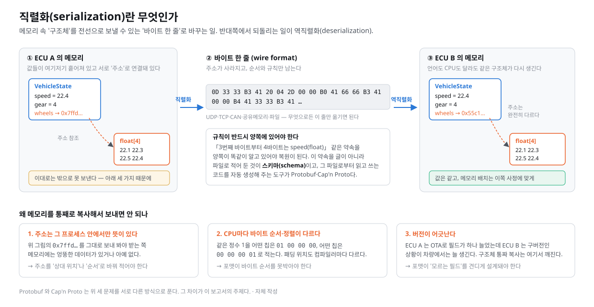
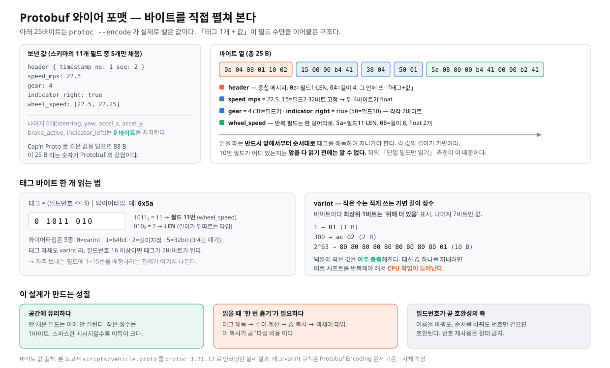
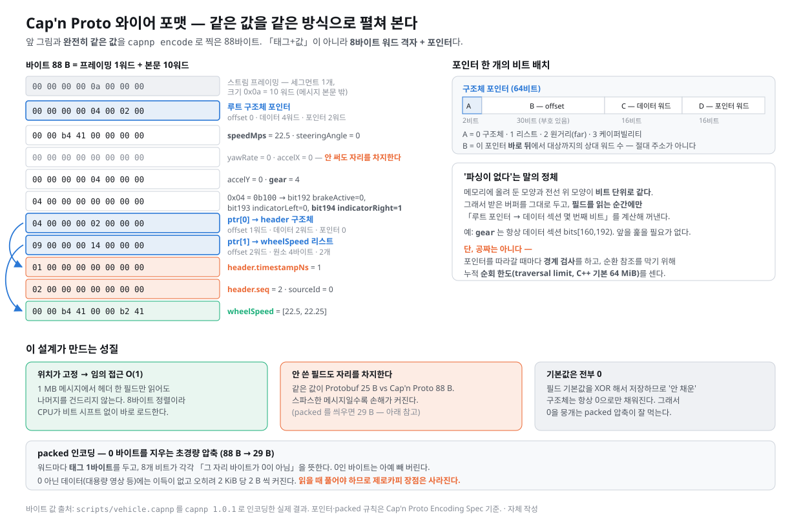
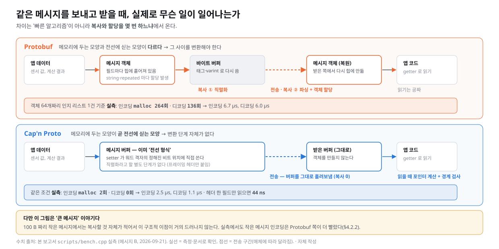
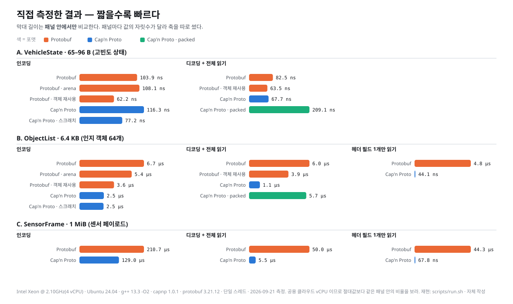
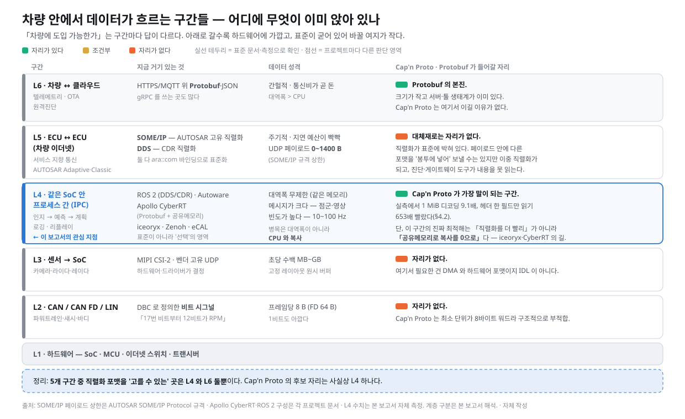
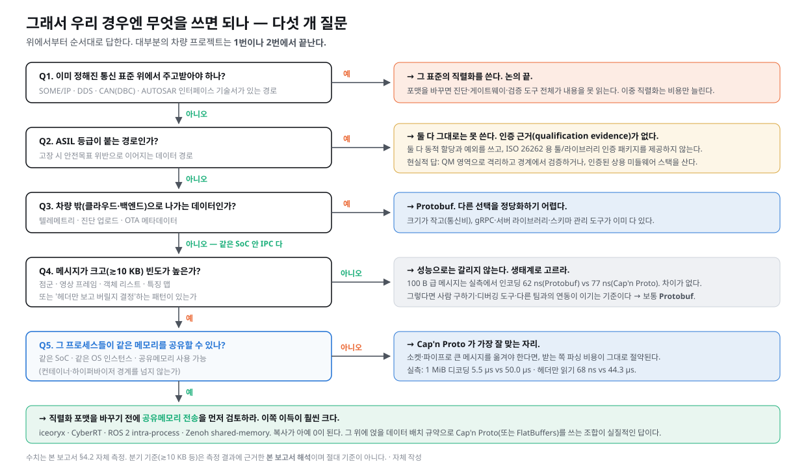

# Cap'n Proto vs Protobuf — 직렬화를 0에서 이해하고, 차량에 쓸 수 있는지까지

### "무한대로 빠르다"는 말은 사실이지만, 그 말이 성립하는 조건은 생각보다 좁다

> **작성일**: 2026-09-21 · **재현 코드**: [`scripts/`](scripts/) · **원시 측정 로그**: [`reference/bench-logs/`](reference/bench-logs/) · **출처 기록**: [`reference/references.md`](reference/references.md)
>
> **배경**: "Cap'n Proto 가 Protobuf 보다 성능이 좋다"는 이야기를 접하고, ① 두 기술이 각각 무엇인지, ② 여러 관점에서 어떻게 다른지, ③ 차량에 도입 가능한지를 확인하기 위한 리서치. 사전 지식 없이 읽을 수 있도록 §1에서 직렬화 개념부터 시작한다.
>
> **출처 표기 원칙**: 모든 사실 주장에 출처를 병기한다. **공식**(각 프로젝트 공식 문서·규격서) / **자체 측정**(이 저장소의 `scripts/` 로 직접 잰 값) / **서드파티**(언론·블로그·논문) / **본 보고서 해석**을 구분한다. 확인하지 못한 항목은 **"출처 미확인"**, 출처 간 상충은 **"상충"**으로 §7에 명시한다. 성능 수치는 **자체 측정이 1차 근거**이며, 공개 벤치마크는 교차 검증용으로만 쓴다.
>
> **읽는 법**: §1~§4 는 두 기술 자체에 집중한다. 차량 이야기는 §5 부터 나온다. 결론만 필요하면 §0 과 §6 만 읽어도 된다.

---

## 0. 다섯 줄 요약

1. **Protobuf** 는 「필드 번호 + 길이 + 값」을 이어붙인 **촘촘한 바이트 열**이다. 작게 만드는 대신, 읽을 때 앞에서부터 한 번 훑으면서 새 객체를 만들어야 한다.
2. **Cap'n Proto** 는 **메모리에 두는 모양을 그대로 전선에 싣는다**. 그래서 "파싱"이라는 단계가 아예 없다 — 대신 안 쓴 필드도 자리를 차지해 크기가 커진다. 같은 값이 Protobuf 25 B, Cap'n Proto 88 B 였다(자체 측정).
3. 직접 재 보니 **"무조건 빠르다"는 거짓이고, "특정 조건에서 압도적으로 빠르다"는 사실**이다. 100 B 짜리 작은 메시지 인코딩은 오히려 Protobuf 가 빨랐고(62 ns vs 77 ns), 1 MiB 메시지에서 헤더 한 필드만 읽을 때는 Cap'n Proto 가 **653배** 빨랐다(68 ns vs 44.3 µs).
4. **차량 관점의 결론: 도입할 수 있는 자리가 사실상 한 곳뿐이다.** ECU 간 통신(SOME/IP·DDS)과 CAN 은 직렬화가 표준에 박혀 있어 대체재가 낄 틈이 없고, 클라우드 업링크는 Protobuf 의 본진이다. 남는 건 **같은 SoC 안 프로세스 간 통신(IPC)** 하나다.
5. 그런데 그 한 곳에서도 **진짜 최적해는 "직렬화를 더 빨리"가 아니라 "공유메모리로 복사를 0으로"** 다. Apollo CyberRT 와 iceoryx 가 그 길을 택했다. Cap'n Proto 는 그 위에 얹는 **데이터 배치 규약**으로 쓸 때 가장 말이 된다. 그리고 **ASIL 등급이 붙는 경로에는 둘 다 그대로는 못 쓴다** — 인증 근거가 없다.

---

## 1. 먼저, 직렬화(serialization)란 무엇인가

이 장은 "직렬화"라는 말을 처음 듣는 독자를 위한 것이다. 이미 아는 독자는 §2로 건너뛰어도 된다.

### 1.1 왜 필요한가 — 메모리 속 구조체와 전선 위 바이트 열

프로그램이 다루는 데이터는 메모리 안에서 **여기저기 흩어진 채 주소로 연결**되어 있다. 예를 들어 차량 상태를 담은 구조체가 "네 바퀴 속도 배열"을 갖고 있다면, 구조체 본체와 배열은 서로 다른 메모리 위치에 있고 그 사이를 **포인터(주소)** 가 잇는다.

그런데 이 데이터를 **다른 프로그램에게 보내야 하는 순간**, 문제가 생긴다. 전선이든 파일이든 공유메모리든, 밖으로 나가는 통로는 전부 **"바이트가 한 줄로 늘어선 것"** 만 받는다. 흩어진 구조를 한 줄로 펴서 내보내고, 반대쪽에서 다시 구조로 되돌리는 일 — 그게 **직렬화**와 **역직렬화**다.



"그냥 메모리를 통째로 복사해서 보내면 안 되나?" 싶지만, 세 가지 이유로 안 된다.

| 문제 | 왜 |
|---|---|
| **주소는 그 프로세스 안에서만 뜻이 있다** | `0x7ffd…` 라는 주소를 그대로 보내 봐야 받는 쪽 메모리에는 엉뚱한 데이터가 있거나 아예 없다 |
| **CPU·컴파일러마다 표현이 다르다** | 같은 정수 1을 어떤 칩은 `01 00 00 00`, 어떤 칩은 `00 00 00 01` 로 적는다(엔디안). 구조체 안 패딩 위치도 컴파일러 설정마다 다르다 |
| **버전이 어긋난다** | 차량에서는 ECU A 만 OTA 로 업데이트되어 필드가 하나 늘고 ECU B 는 구버전인 상황이 상시로 생긴다. 구조체 통짜 복사는 여기서 바로 깨진다 |

### 1.2 JSON으로 해 보면 — 그리고 무엇이 아쉬운가

가장 쉬운 해법은 사람이 읽을 수 있는 텍스트로 적는 것이다.

```json
{"speed_mps": 22.5, "gear": 4, "wheel_speed": [22.5, 22.25]}
```

61바이트. 장점이 분명하다 — 눈으로 읽히고, 어느 언어에서나 파서가 있고, 필드가 하나 늘어도 모르는 쪽은 그냥 무시하면 된다.

단점도 분명하다.

- **크다.** 숫자 `22.5` 를 "2","2",".","5" 라는 네 글자로 적는다. 같은 값을 4바이트 float 로 적으면 4바이트다.
- **느리다.** 읽는 쪽은 문자열을 숫자로 파싱해야 한다. 100 Hz 로 도는 제어 루프에서는 이 비용이 그대로 쌓인다.
- **약속이 코드 안에만 있다.** `speed_mps` 가 m/s 인지 km/h 인지, 없으면 어떻게 되는지는 문서나 사람 머릿속에 있다. 팀이 커지면 반드시 어긋난다.

### 1.3 "스키마가 있는 바이너리 직렬화"라는 해법

그래서 나온 접근이 이것이다.

1. **약속을 파일로 적는다.** 어떤 필드가 있고, 타입이 무엇이고, 번호가 몇 번인지를 별도 파일(**스키마**, 또는 **IDL** — Interface Definition Language)에 적는다.
2. **그 파일로부터 코드를 자동 생성한다.** 읽고 쓰는 코드를 사람이 손으로 짜지 않는다. `protoc`, `capnp` 같은 **컴파일러**가 C++·Java·Python·Rust… 용 코드를 뽑아 준다.
3. **바이트는 사람이 읽을 수 없게, 대신 작고 빠르게 적는다.**

Protobuf 와 Cap'n Proto 는 둘 다 이 부류다. 차이는 **3번을 어떻게 하느냐**에 있고, 이 보고서의 나머지는 전부 그 이야기다.

### 1.4 이 문서에 나오는 용어

| 용어 | 뜻 |
|---|---|
| **스키마 / IDL** | 주고받을 데이터의 모양을 적은 파일. `.proto`, `.capnp` |
| **와이어 포맷 (wire format)** | 실제로 전선에 실리는 바이트 배치 규칙 |
| **인코딩 / 직렬화** | 앱 데이터 → 바이트 열 |
| **디코딩 / 역직렬화 / 파싱** | 바이트 열 → 앱이 읽을 수 있는 상태 |
| **제로카피 (zero-copy)** | 받은 바이트를 복사·변환하지 않고 그 자리에서 읽는 것 |
| **varint** | 작은 수는 1바이트, 큰 수는 여러 바이트로 적는 가변 길이 정수 인코딩 |
| **정렬 (alignment)** | 값을 자기 크기의 배수 주소에 두는 것. CPU가 빠르게 읽을 수 있다 |
| **스키마 진화 (evolution)** | 필드를 추가·삭제해도 구버전과 통신이 깨지지 않게 하는 규칙 |
| **arena** | 메모리를 한 덩어리로 미리 잡아 두고 그 안에서 쪼개 쓰는 할당 방식. 할당·해제가 싸진다 |

---

## 2. Protobuf — 무엇이고 어떻게 동작하나

### 2.1 한 줄 정의와 역사

**Protocol Buffers(Protobuf)** 는 구글이 만든 스키마 기반 바이너리 직렬화 포맷이자 코드 생성 도구다. 구글 내부에서 쓰이다 2008년에 공개됐고, 지금은 gRPC 의 기본 직렬화 포맷으로 사실상 업계 표준 자리에 있다 ([protobuf.dev Overview](https://protobuf.dev/overview/)).

버전은 스키마 문법 세대(`proto2` / `proto3` / 최근의 `editions`)와 릴리스 번호가 따로 논다. 릴리스는 2023년부터 언어별로 메이저 번호가 갈렸고 — 예를 들어 릴리스 `34.1` 이 Java 런타임 `4.34.1`, C# `3.34.1` 에 대응한다 — 지원 기간은 메이저 버전 교체 후 4분기다 ([protobuf.dev Version Support](https://protobuf.dev/support/version-support/)). 이 보고서의 측정에 쓴 것은 Ubuntu 24.04 가 제공하는 `3.21.12` 다.

### 2.2 `.proto` 스키마 예제

측정에 쓴 실제 스키마의 일부다([`scripts/vehicle.proto`](scripts/vehicle.proto)).

```protobuf
syntax = "proto3";
package vbpb;

message Header {
  uint64 timestamp_ns = 1;
  uint32 seq          = 2;
  uint32 source_id    = 3;
}

message VehicleState {
  Header header              = 1;
  float  speed_mps           = 2;
  float  steering_angle_rad  = 3;
  // …
  uint32 gear                = 7;
  bool   brake_active        = 8;
  bool   indicator_left      = 9;
  bool   indicator_right     = 10;
  repeated float wheel_speed = 11;  // 4륜
}
```

핵심은 `= 1`, `= 2` 같은 **필드 번호**다. 이름이 아니라 **번호가 와이어 위의 신원**이다. 그래서 나중에 이름을 바꿔도 호환이 깨지지 않고, 반대로 **번호를 재사용하면 조용히 데이터가 뒤섞인다.**

### 2.3 와이어 포맷 해부 — 바이트를 직접 펼쳐 본다

위 스키마에 값 5개만 채워 `protoc --encode` 로 찍으면 **25바이트**가 나온다.



```
0a 04 08 01 10 02 | 15 00 00 b4 41 | 38 04 | 50 01 | 5a 08 00 00 b4 41 00 00 b2 41
```

구조는 단순하다. **「태그 1개 + 값」이 필드 수만큼 이어붙어 있다.** 태그는 `(필드번호 << 3) | 와이어타입` 으로 만든다. 예를 들어 `0x5a` 는 이진수로 `0 1011 010` 이고, 앞의 `1011₂ = 11` 이 필드 11번(`wheel_speed`), 뒤의 `010₂ = 2` 가 "길이가 뒤따르는 타입(LEN)"을 뜻한다 ([Protobuf Encoding](https://protobuf.dev/programming-guides/encoding/)).

**가장 중요한 성질: 채우지 않은 필드는 단 1바이트도 차지하지 않는다.** 위 예에서 `steering_angle_rad`, `yaw_rate_rps`, `accel_x`, `accel_y`, `brake_active`, `indicator_left` 여섯 개는 아예 실리지 않았다.

### 2.4 varint · TLV · 필드번호가 만드는 성질

- **varint** — 정수는 바이트마다 최상위 1비트를 "뒤에 더 있음" 표시로 쓰고 나머지 7비트만 값으로 쓴다. `1` 은 1바이트, `300` 은 2바이트, `2⁶³` 은 10바이트다. 작은 값이 압도적으로 많은 실제 데이터에서 공간을 크게 아낀다.
- **대가는 CPU 다.** 값 하나를 꺼내려면 바이트를 하나씩 보며 비트 시프트를 반복해야 한다. 그리고 **길이가 가변이므로 뒤쪽 필드의 위치를 미리 알 수 없다** — 반드시 앞에서부터 순서대로 훑어야 한다. 이것이 뒤 §4.2.5 「단일 필드만 읽기」 측정에서 Protobuf 가 무너지는 이유다.
- **태그 자체도 varint** 라 필드번호가 16 이상이면 태그가 2바이트가 된다. 자주 보내는 필드에 1~15번을 배정하라는 관례가 여기서 나온다 ([Protobuf Encoding](https://protobuf.dev/programming-guides/encoding/)).

### 2.5 스키마 진화 규칙

차량처럼 구버전·신버전이 오래 공존하는 환경에서 실질적으로 가장 중요한 부분이다.

| 해도 되는 것 | 하면 안 되는 것 |
|---|---|
| 새 필드 **추가** (새 번호로) | **필드 번호 재사용** — 구버전이 옛 타입으로 읽어 조용히 오염된다 |
| 필드 **이름** 변경 | 필드 **번호** 변경 |
| 필드 **삭제** 후 번호를 `reserved` 로 봉인 | 삭제하고 번호를 방치 |
| 호환되는 타입 간 변경 (`int32`↔`int64` 등 제한적) | 임의 타입 변경 |

구버전이 **모르는 필드를 만나면 버리지 않고 그대로 보관했다가 다시 내보낸다**(unknown fields). 중계 노드가 메시지를 통과시켜도 내용이 유실되지 않는다는 뜻이고, 다중 ECU 게이트웨이 구조에서 실질적인 안전장치다.

흥미롭게도 proto2 의 `required` 키워드는 구글 스스로 **"끔찍한 실수"** 였다고 평가한다. 필수 필드를 나중에 선택 필드로 바꾸면, 내용에 관심도 없는 중계 인프라가 파싱 단계에서 통째로 실패하면서 무관한 시스템까지 멈춘 사고가 구글 내부에서 여러 번 있었다고 한다 ([Cap'n Proto FAQ](https://capnproto.org/faq.html) · [원문 `doc/faq.md`](https://github.com/capnproto/capnproto/blob/master/doc/faq.md)). proto3 에는 `required` 가 없다.

### 2.6 생태계 — 여기가 진짜 강점이다

| 항목 | 상태 |
|---|---|
| **RPC** | gRPC 가 사실상 표준. 로드밸런싱·인증·스트리밍·관측 도구가 통째로 딸려 온다 |
| **언어 지원** | C++·Java·Python·Go·C#·Ruby·PHP·Objective-C·Dart·Rust(서드파티)… **구글이 직접 유지보수**하는 런타임만 8종 이상 ([Version Support](https://protobuf.dev/support/version-support/)) |
| **툴** | `protoc` 플러그인 생태계, `buf`(린트·breaking change 검사·스키마 레지스트리), Wireshark 디시펙터, 각종 IDE 지원 |
| **디버깅** | `protoc --decode` 로 스키마만 있으면 바이트를 사람이 읽는 텍스트로 변환 가능 |
| **사람** | 백엔드 엔지니어 대부분이 이미 안다 — 채용·인수인계 비용이 낮다 |

### 2.7 장점 / 단점 정리

**장점**
- 메시지가 작다. 특히 필드를 드문드문 채우는 경우 압도적이다.
- 스키마 진화 규칙이 명확하고, 실전에서 20년 가까이 검증됐다.
- 생태계가 압도적이다. gRPC·툴·인력 모두.
- 구글이 직접 여러 언어 런타임을 유지보수한다.

**단점**
- 읽을 때 반드시 전체를 훑으며 **새 객체를 만들어야 한다** — 할당이 많다. 측정에서 객체 64개짜리 메시지 디코딩 한 번에 `malloc` 이 **136회** 불렸다(자체 측정, §4.2.4).
- 메시지 일부만 보고 싶어도 전부 파싱해야 한다.
- 생성 코드가 크다. 같은 스키마에서 Cap'n Proto 대비 **약 2.1배 줄 수, 오브젝트 파일 11배**였다(자체 측정, §4.6).
- C++ 런타임 공유 라이브러리가 3.0 MB 다(Ubuntu 24.04 `libprotobuf.so.32.0.12`, 자체 측정).

---

## 3. Cap'n Proto — 무엇이고 어떻게 동작하나

### 3.1 한 줄 정의와 역사

**Cap'n Proto** 는 **Protobuf v2 의 주 설계자였던 Kenton Varda** 가 구글을 나온 뒤 만든 후속작이다. 이름부터 "Cap'n Proto = Captain Proto"라는 농담이다. 2013년 4월 1일 첫 공개, **2023년 7월 28일에야 1.0** 이 나왔다 — 10년 넘게 0.x 로 프로덕션에서 쓰이다 LTS 로 못박은 것이다 ([Cap'n Proto 1.0 릴리스 노트](https://capnproto.org/news/2023-07-28-capnproto-1.0.html)).

현재 사실상의 후원자는 **Cloudflare** 다. Varda 가 Cloudflare 에 있고, Cloudflare Workers 런타임이 Cap'n Proto 를 내부에서 쓴다 ([Cap'n Proto 1.0 릴리스 노트](https://capnproto.org/news/2023-07-28-capnproto-1.0.html)). 이 점은 §4.7 거버넌스에서 다시 다룬다.

### 3.2 `.capnp` 스키마 예제

같은 데이터를 Cap'n Proto 로 적으면 이렇다([`scripts/vehicle.capnp`](scripts/vehicle.capnp)).

```capnp
@0xdb2650c5a8d50d73;   # 파일마다 고유 ID — capnp id 로 생성
using Cxx = import "/capnp/c++.capnp";
$Cxx.namespace("vbcapnp");

struct Header {
  timestampNs @0 :UInt64;
  seq         @1 :UInt32;
  sourceId    @2 :UInt32;
}

struct VehicleState {
  header            @0  :Header;
  speedMps          @1  :Float32;
  # …
  gear              @6  :UInt32;
  brakeActive       @7  :Bool;
  indicatorLeft     @8  :Bool;
  indicatorRight    @9  :Bool;
  wheelSpeed        @10 :List(Float32);
}
```

`@0`, `@1` 은 Protobuf 의 필드 번호와 같은 역할이되 **0부터 시작하고 반드시 연속**이어야 한다. 번호를 건너뛸 수 없다.

Protobuf 에 없는 것: 파일 맨 위의 **64비트 파일 ID**. 스키마 파일마다 전역 고유 ID 를 박아 두어 서로 다른 프로젝트의 스키마가 충돌하지 않게 한다.

### 3.3 와이어 포맷 해부 — 8바이트 워드, 포인터, 구조체

**같은 값**을 `capnp encode` 로 찍으면 **88바이트**가 나온다. Protobuf 25 B 의 3.5배다.



구조가 완전히 다르다.

- 모든 것은 **8바이트 "워드"** 단위로 정렬된다. 구조체·리스트·블롭 전부 워드 경계에 놓인다 ([Cap'n Proto Encoding Spec](https://capnproto.org/encoding.html) · [원문 `doc/encoding.md`](https://github.com/capnproto/capnproto/blob/master/doc/encoding.md)).
- 구조체는 **데이터 섹션 + 포인터 섹션**으로 나뉜다. 스칼라 값은 데이터 섹션의 **컴파일 타임에 정해진 비트 위치**에 들어간다. 위 스키마를 `capnp compile -ocapnp` 로 보면 `gear` 는 `bits[160, 192)` 에 고정되어 있다(자체 확인).
- 중첩 구조체·리스트·문자열은 **포인터**로 가리킨다. 포인터는 절대 주소가 아니라 **"이 포인터 바로 뒤에서 대상까지 몇 워드"** 라는 상대 위치다 — 그래서 버퍼를 통째로 어디에 옮겨 놔도 그대로 유효하다.
- 포인터 64비트의 배치: 하위 2비트가 종류(0=구조체, 1=리스트, 2=원거리, 3=케이퍼빌리티), 다음 30비트가 오프셋, 상위 32비트가 크기 정보 ([Encoding Spec](https://capnproto.org/encoding.html)).

### 3.4 "파싱이 없다"는 말의 진짜 의미 — 그리고 진짜가 아닌 부분

**진짜인 부분.** 메모리에 올려 둔 모양과 전선 위 모양이 비트 단위로 같다. 그래서 받은 버퍼를 그대로 두고, 필드를 읽는 순간에만 "루트 포인터 → 데이터 섹션 몇 번째 비트"를 계산해 꺼낸다. `gear` 를 읽는 데 드는 일은 **덧셈 한 번과 로드 한 번**이다. 앞을 훑을 필요도, 새 객체를 만들 필요도 없다.

**진짜가 아닌 부분 — 공짜는 아니다.**

1. **포인터를 따라갈 때마다 경계 검사를 한다.** 악의적인 입력이 버퍼 밖을 가리키면 예외를 던지거나 기본값을 돌려준다 ([Encoding Spec — Security Considerations](https://capnproto.org/encoding.html)).
2. **순회 한도(traversal limit)를 센다.** 순환·중첩 포인터로 무한 루프에 빠지는 증폭 공격을 막기 위해 누적 순회량을 세고, C++ 구현은 기본 **64 MiB** 에서 끊는다. 포인터 깊이도 기본 **64** 에서 끊는다 ([Encoding Spec](https://capnproto.org/encoding.html)).
3. Cap'n Proto 문서 스스로도 "파싱을 지연시킨 것 아니냐"는 질문에 **"아니다. Protobuf 디코딩에 비하면 포인터 검증 비용은 무시할 만하다"** 고 답한다 ([Cap'n Proto FAQ](https://capnproto.org/faq.html)). 즉 **검증은 남아 있고, 복사와 할당이 사라진 것**이다.

### 3.5 packed 인코딩

크기 손해를 줄이기 위한 초경량 압축이다. 워드마다 **태그 1바이트**를 두고 8개 비트가 각각 "그 자리 바이트가 0이 아님"을 뜻한다. 0인 바이트는 빼 버린다. 기본값이 전부 0이라는 설계 덕분에 잘 먹는다 — 위 88 B 예제가 **29 B** 로 줄었다(자체 측정).

다만 **0이 아닌 데이터(영상·점군)에는 이득이 없고 오히려 2 KiB 당 2 B 씩 커진다**([Encoding Spec](https://capnproto.org/encoding.html)). 실제로 1 MiB 페이로드에서 packed 가 원본보다 1,186 B **더 커졌다**(자체 측정, §4.2.3).

**그리고 결정적으로, packed 를 쓰면 읽을 때 풀어야 하므로 제로카피 이점이 사라진다.** 측정에서 packed 디코딩은 일반 Cap'n Proto 대비 3.1배(메시지 A), 5.3배(메시지 B) 느렸다.

### 3.6 스키마 진화 규칙

기본 원리는 Protobuf 와 같다 — **필드 번호가 신원**이고, 새 필드는 새 번호로 뒤에 붙인다. 구조체는 "데이터 섹션 몇 워드 + 포인터 섹션 몇 워드"를 포인터에 적고 다니므로, 구버전이 신버전 메시지를 읽으면 **모르는 뒷부분을 그냥 안 볼 뿐** 깨지지 않는다.

Cap'n Proto 쪽이 더 엄격한 점: **필드 번호가 0부터 연속이어야 하고**, 필드를 삭제할 때도 번호를 비울 수 없어 자리를 남겨 둬야 한다.

특이한 점: 필드 기본값을 **XOR 해서 저장**한다. 그래서 "아무것도 안 채운 구조체"는 항상 전부 0이고, 새 필드가 옛 패딩 자리에 들어가도 구버전이 쓴 메시지에서 그 필드가 올바르게 기본값으로 읽힌다 ([Encoding Spec](https://capnproto.org/encoding.html)).

### 3.7 RPC 계층 — Protobuf 에는 없는 것

Cap'n Proto 는 직렬화 위에 **케이퍼빌리티 기반 RPC** 를 얹었고, 그 핵심 기능이 **promise pipelining** 이다.

`foo()` 의 결과를 `bar()` 에 넘겨야 할 때, 보통은 왕복 2회가 필요하다. Cap'n Proto 는 `foo()` 의 결과가 아직 오지 않았어도 **"foo 의 결과"를 가리키는 약속(promise)을 바로 `bar()` 에 넘길 수 있다** — 두 호출이 한 번에 나가고 서버 쪽에서 이어 붙는다. 지연이 큰 링크에서 왕복 횟수를 줄이는 기법이다 ([Cap'n Proto RPC](https://capnproto.org/rpc.html)).

**차량 맥락에서의 솔직한 평가**: 이건 인터넷 너머 서버 호출을 겨냥한 기능이다. 같은 SoC 안 IPC 나 차량 내부 이더넷(왕복 지연 수십 µs)에서는 이득이 거의 없다. Cap'n Proto 의 세일즈 포인트 중 **차량에서 값어치가 가장 낮은 항목**이다(본 보고서 해석).

### 3.8 생태계·성숙도

공식 문서가 직접 밝히는 언어 지원 현황이 정직하다 — **"C++ 이외 구현은 각 저자가 유지보수하며 내(Kenton)가 검토하지 않았다"** ([Cap'n Proto Other Languages](https://capnproto.org/otherlang.html) · [원문 `doc/otherlang.md`](https://github.com/capnproto/capnproto/blob/master/doc/otherlang.md)).

| 구분 | 언어 |
|---|---|
| **직렬화 + RPC** | C++(공식) · Rust · Go · Python · Haskell · OCaml · C# · Erlang · Node.js |
| **직렬화만** | C · Java · D · Lua · Nim · Ruby · Scala · JavaScript |
| **유지보수 중단 명시** | C 구현(원본) — 포크가 이어받음 |

Java 가 "직렬화만" 칸에 있다는 점은 실무에서 꽤 크다. 차량 툴체인·진단 도구에 Java/C# 기반이 적지 않다.

**차량 업계가 아예 안 건드린 건 아니다.** Toyota 가 Cap'n Proto RPC 호출을 가로채 기록하는 디버그 도구 `capnp-trace` 를 공개했고, Cap'n Proto 공식 문서의 도구 목록에 올라 있다 ([Cap'n Proto Other Languages — Tools](https://capnproto.org/otherlang.html) · [Toyota/capnp-trace](https://github.com/Toyota/capnp-trace)). 다만 **이것이 양산 차량 적용을 뜻하는지는 출처 미확인**이다(§7).

### 3.9 장점 / 단점 정리

**장점**
- 큰 메시지에서 디코딩이 압도적으로 빠르다. 1 MiB 기준 **9.1배**(자체 측정).
- 메시지 일부만 읽을 때 **O(1)**. 1 MiB 에서 헤더 한 필드 읽기 **653배**(자체 측정).
- 디코딩 시 힙 할당 **0회**(자체 측정). 실시간 시스템에서 의미가 큰 성질이다.
- 생성 코드·런타임이 작다. 오브젝트 파일 11배 차이(자체 측정).
- 8바이트 정렬이라 SIMD·DMA·공유메모리와 궁합이 좋다.
- MIT 라이선스.

**단점**
- **메시지가 크다.** 안 쓴 필드도 자리를 차지한다. 작은 스파스 메시지에서 1.5배 차이(자체 측정).
- 작은 메시지에서는 **성능 이점이 없거나 오히려 손해**다(자체 측정, §4.2.2).
- 생태계가 얇다. gRPC 같은 표준 RPC 인프라가 없고, C++ 외 언어는 유지보수 주체가 제각각이다.
- **C++ 구현이 `kj` 라는 자체 툴킷에 강하게 묶여 있다.** 예외·RAII·자체 문자열 타입을 전제한다 — 이게 §5.4 기능안전에서 문제가 된다.
- **공식 보안 검토를 받은 적이 없다**고 문서가 직접 밝힌다 ([Cap'n Proto FAQ](https://capnproto.org/faq.html)).
- 기본 첫 세그먼트가 1024 워드(8 KB)라, **96바이트 메시지 하나 만드는 데 8,288 B 를 요청**했다(자체 측정, §4.2.4). 임베디드에서 그냥 넘길 일이 아니다.

---

## 4. 정면 비교

### 4.1 설계 철학 한 장 요약



| | Protobuf | Cap'n Proto |
|---|---|---|
| **메모리 모양 vs 전선 모양** | 다르다 → 변환 필요 | **같다** → 변환 없음 |
| **아끼는 것** | 바이트 (대역폭) | CPU 사이클과 할당 |
| **읽기 비용** | 전체 O(n) 선형 훑기 + 객체 생성 | 필드당 O(1) 포인터 계산 |
| **안 쓴 필드** | 0 바이트 | 자리를 차지 |
| **정수 표현** | varint (가변) | 고정폭 little-endian |
| **정렬** | 없음 (바이트 단위 촘촘) | 8바이트 워드 |
| **주된 무대** | 네트워크 API, 서비스 간 통신 | 같은 기계 안 IPC, 디스크, 공유메모리 |

### 4.2 성능 — 직접 측정

#### 4.2.1 측정 환경·방법

| 항목 | 값 |
|---|---|
| CPU | Intel Xeon @ 2.10GHz, **4 vCPU (공용 클라우드)** |
| OS / 컴파일러 | Ubuntu 24.04.4 LTS / g++ 13.3.0, `-O2 -std=c++17` |
| 라이브러리 | Cap'n Proto 1.0.1 / Protobuf 3.21.12 (둘 다 배포판 패키지) |
| 방식 | 단일 스레드, 워밍업 후 측정. **루프 밖에서만 시계를 읽어** clock 호출 오버헤드를 배제한 평균을 대표값으로 씀 |
| 반복 | 메시지 A 200,000회 · B 20,000회 · C 2,000회 |
| 재현 | [`scripts/run.sh`](scripts/run.sh) · 원시 로그 [`reference/bench-logs/`](reference/bench-logs/) |

**공정성을 위해 넣은 장치** — Protobuf 를 기본 사용법으로만 재면 불리하게 기울어진다. 그래서 실무에서 쓰는 두 가지 최적화를 함께 측정했다.

- **arena 할당**: 메모리를 한 덩어리로 잡고 그 안에서 메시지를 만든다.
- **객체 재사용 + `Clear()`**: 메시지 객체를 매번 새로 만들지 않고 지워서 다시 쓴다. Protobuf 공식이 권하는 방식이다 ([Protobuf Arena Allocation](https://protobuf.dev/reference/cpp/arenas/)).

같은 이유로 Cap'n Proto 쪽에도 **스크래치 버퍼 재사용** 변형을 넣었다.

**측정 대상 메시지 3종** — 차량에서 실제로 오가는 모양을 본떴다.

| | 내용 | 크기대 | 재는 이유 |
|---|---|---|---|
| **A** `VehicleState` | 속도·조향각·요레이트·가속도·기어·4륜 속도 + 헤더 | 65~96 B | 100 Hz~1 kHz 주기 제어/상태 메시지 |
| **B** `ObjectList` | 인지 객체 64개 (자세·속도·클래스·3×3 공분산) | 6.4 KB | 중첩·리스트가 많은 중간 크기 구조화 데이터 |
| **C** `SensorFrame` | 헤더 + 1 MiB 바이트 블롭 | 1 MiB | 대용량 벌크. 제로카피 주장의 시험대 |

#### 4.2.2 인코딩 / 디코딩 속도



**메시지 A (65~96 B) — 마케팅 문구가 성립하지 않는 구간**

| 변형 | 인코딩 | 디코딩 + 전체 읽기 |
|---|---|---|
| Protobuf | 103.9 ns | 82.5 ns |
| Protobuf · arena | 108.1 ns | — |
| **Protobuf · 객체 재사용** | **62.2 ns** | **63.5 ns** |
| Cap'n Proto | 116.3 ns | 67.7 ns |
| Cap'n Proto · 스크래치 재사용 | 77.2 ns | — |
| Cap'n Proto · packed | — | 209.1 ns |

**작은 메시지에서는 Cap'n Proto 가 이기지 못한다.** 기본 사용법끼리 비교해도 인코딩은 1.12배 느리고, 양쪽을 최적화하면 62.2 ns vs 77.2 ns 로 격차가 더 벌어진다. 디코딩은 기본끼리는 Cap'n Proto 가 1.22배 빠르지만, 객체를 재사용한 Protobuf(63.5 ns)가 다시 앞선다.

이유는 단순하다 — **복사할 것 자체가 100바이트뿐이면 "복사를 없애는" 설계의 이점이 드러날 여지가 없다.** 대신 Cap'n Proto 는 8 KB 짜리 첫 세그먼트를 잡는 고정 비용을 치른다.

여기서 arena 가 오히려 느려진 것(108.1 ns)도 같은 맥락이다. arena 객체를 만들고 없애는 비용이 메시지 하나를 만드는 이득보다 크다. **arena 는 한 arena 안에서 메시지를 여러 개 만들 때 효과가 나는 도구**다.

**메시지 B (6.4 KB, 객체 64개) — 격차가 벌어지기 시작하는 구간**

| 변형 | 인코딩 | 디코딩 + 전체 읽기 |
|---|---|---|
| Protobuf | 6,705.6 ns | 6,027.9 ns |
| Protobuf · arena | 5,433.6 ns | — |
| Protobuf · 객체 재사용 | 3,595.6 ns | 3,929.5 ns |
| **Cap'n Proto** | **2,536.6 ns** | **1,083.7 ns** |
| Cap'n Proto · 스크래치 재사용 | 2,506.5 ns | — |
| Cap'n Proto · packed | — | 5,710.7 ns |

기본끼리 **인코딩 2.6배 · 디코딩 5.6배**. 최적화한 Protobuf 와 비교해도 **인코딩 1.4배 · 디코딩 3.6배**다. 중첩 구조체와 리스트가 많아질수록 Protobuf 는 객체를 그만큼 더 만들어야 한다.

**메시지 C (1 MiB) — 제로카피가 제값을 하는 구간**

| 변형 | 인코딩 | 디코딩 + 페이로드 전체 접근 |
|---|---|---|
| Protobuf | 210,686.9 ns (210.7 µs) | 50,040.8 ns (50.0 µs) |
| **Cap'n Proto** | **128,967.7 ns (129.0 µs)** | **5,498.6 ns (5.5 µs)** |

**디코딩 9.1배.** 페이로드를 실제로 쓰는데도 그렇다 — Protobuf 는 1 MiB 를 `std::string` 으로 복사하고, Cap'n Proto 는 버퍼 안을 그대로 가리킨다.

#### 4.2.3 메시지 크기

| 메시지 | Protobuf | Cap'n Proto | Cap'n Proto packed |
|---|---|---|---|
| A (차량 상태) | **65 B** | 96 B (1.48×) | 69 B (1.06×) |
| B (객체 64개) | 6,362 B | 6,712 B (1.06×) | **5,907 B (0.93×)** |
| C (1 MiB) | **1,048,604 B** | 1,048,656 B | 1,049,842 B (원본보다 **큼**) |

gzip(레벨 6)을 씌운 뒤:

| 메시지 | Protobuf | Cap'n Proto | Cap'n Proto packed |
|---|---|---|---|
| A | 76 B | 87 B | 80 B |
| B | 5,651 B | **5,247 B** | 5,395 B |
| C | 784,927 B | 784,958 B | — |

읽을 거리가 세 개 있다.

1. **작은 메시지에서 Protobuf 의 크기 우위가 가장 크다**(1.48배). 채운 필드가 적을수록 격차가 커진다.
2. **객체 리스트처럼 필드를 빽빽이 채우면 크기 차이가 거의 사라진다**(1.06배). 오히려 **packed 를 쓰면 Cap'n Proto 가 7% 더 작았다.** "Cap'n Proto 는 항상 뚱뚱하다"는 통념은 데이터를 꽉 채운 경우에는 틀렸다.
3. **A 메시지는 gzip 을 씌우면 셋 다 원본보다 커졌다.** 65 B → 76 B. 작은 메시지에 범용 압축을 거는 건 역효과다 — 차량 주기 메시지 설계 시 실질적으로 쓸모 있는 사실이다.

#### 4.2.4 메모리·할당 횟수

op 한 번당 `malloc` 계열 호출 수와 요청 바이트다(LD_PRELOAD 후킹, [`scripts/alloc_counter.c`](scripts/alloc_counter.c)).

| 메시지 | 작업 | Protobuf | Cap'n Proto |
|---|---|---|---|
| A | 인코딩 | 3회 / 88 B | 2회 / **8,288 B** |
| A | 디코딩 | 2회 / 64 B | **0회 / 0 B** |
| B | 인코딩 | **264회** / 15,384 B | 2회 / 14,904 B |
| B | 디코딩 | **136회** / 11,032 B | **0회 / 0 B** |
| C | 인코딩 | 4회 / **2,097,226 B** | 7회 / 1,057,056 B |
| C | 디코딩 | 3회 / 1,048,649 B | 4회 / **192 B** |

여기가 이 측정에서 가장 중요한 표다.

- **Cap'n Proto 는 디코딩에서 힙을 전혀 건드리지 않는다.** 실시간 제어 루프에서 `malloc` 은 최악 실행시간을 예측 불가능하게 만드는 주범이다. 0회는 성능 숫자 이상의 의미가 있다.
- **Protobuf 는 중첩 객체가 많을수록 할당이 폭증한다.** 객체 64개에 인코딩 264회다. arena 를 쓰면 줄일 수 있지만 0이 되지는 않는다.
- **하지만 Cap'n Proto 도 공짜가 아니다.** 96 B 메시지를 만드는 데 **8,288 B** 를 요청했다 — 기본 첫 세그먼트가 1024 워드이기 때문이다. 스크래치 버퍼를 직접 잡아 주면 피할 수 있지만, **모르고 쓰면 플래시·RAM이 빠듯한 ECU 에서 문제가 된다.**
- C 인코딩에서 Protobuf 가 2 MiB 를 요청한 것은 페이로드를 한 번 더 복사하기 때문이다(메시지 객체 + 직렬화 버퍼).

#### 4.2.5 단일 필드 랜덤 접근 — 제로카피가 결정적으로 이기는 지점

받은 바이트에서 **`header.timestampNs` 하나만** 읽는 시간이다.

| 메시지 | Protobuf | Cap'n Proto | 배수 |
|---|---|---|---|
| B (6.4 KB) | 4,817.3 ns | **44.1 ns** | **109×** |
| C (1 MiB) | 44,306.3 ns | **67.8 ns** | **653×** |

**Cap'n Proto 는 메시지 크기와 무관하게 44~68 ns** 다. 크기가 160배 늘어도 시간이 거의 안 변한다. Protobuf 는 크기에 비례한다 — 헤더 하나 보려고 1 MiB 를 전부 파싱하기 때문이다.

이게 추상적인 숫자가 아닌 이유: **"헤더의 타임스탬프나 소스 ID를 보고 이 메시지를 처리할지 버릴지 결정"하는 패턴이 차량 SW 에 흔하다.** 로그 리플레이에서 시간 구간으로 필터링하는 것, 게이트웨이에서 라우팅만 하고 지나보내는 것, 오래된 프레임을 드롭하는 것 전부 이 패턴이다. 이 패턴이 있다면 Cap'n Proto 를 검토할 이유가 확실히 있다.

다만 공정하게 덧붙이면 — **Protobuf 쪽도 메시지를 「작은 헤더 + 큰 본문」 두 개로 쪼개면 같은 효과를 낼 수 있다.** 포맷의 한계가 아니라 설계로 풀 수 있는 문제다. 차이는 Cap'n Proto 가 **설계를 비틀지 않아도 공짜로 된다**는 점이다(본 보고서 해석).

#### 4.2.6 공개 벤치마크와의 교차 검증

자체 측정이 특수한 결과가 아닌지 공개 자료와 대조했다.

| 주장 | 출처 | 자체 측정과 비교 |
|---|---|---|
| "직렬화 단계가 존재하지 않으므로 무한대로 빠르다" | Cap'n Proto 공식 소개 ([capnproto.org](https://capnproto.org/)) | **부분 일치.** 인코딩은 `memcpy` 수준이 되지만 필드를 채우는 비용은 남는다. 메시지 A 인코딩에서 Protobuf 에 졌다 |
| "packing 을 켜면 Protobuf 와 비슷한 크기가 되면서도 더 빠르다" | [Cap'n Proto FAQ](https://capnproto.org/faq.html) | **크기는 일치**(B에서 packed 가 7% 더 작음). **속도는 불일치** — packed 디코딩은 일반 Cap'n Proto 대비 3~5배 느렸다. FAQ 문장이 "Protobuf 보다"인지 "packed 아닌 자기 자신보다"인지 모호하다(§7 상충) |
| FlatBuffers 는 스칼라 타입 단위로 정렬해 Cap'n Proto(8바이트 워드)보다 공간 효율이 좋다 | [Cap'n Proto: Cap'n Proto, FlatBuffers, and SBE](https://capnproto.org/news/2014-06-17-capnproto-flatbuffers-sbe.html) | 직접 재지 않음. 다만 자체 측정의 A 메시지 크기 손해(1.48배)와 방향이 일치 |
| "분산 캐시를 Cap'n Proto 로 바꿔 메모리 사용량 70% 감소" | 서드파티 블로그 ([Abhinav Singh](https://www.abhinavsingh.dev/blog/architecting-for-zero-latency/)) | **검증 불가.** 대상 시스템·측정 방법 미공개. 인용하지 않는다(§7) |

**교차 검증의 결론**: 공식 문서의 정성적 주장(제로카피·임의 접근 O(1))은 자체 측정과 일치한다. 반면 **"무조건 빠르다" 류의 요약과 출처 불명의 배수 수치는 재현되지 않거나 조건이 붙는다.**

#### 4.2.7 이 측정이 말해 주지 않는 것

정직하게 한계를 적는다.

1. **공용 클라우드 vCPU 에서 쟀다.** 다른 테넌트의 간섭이 있을 수 있어 **절대값보다 같은 표 안의 비율을 봐야 한다.** 차량용 SoC(ARM, 캐시 구성·메모리 대역폭이 다름)에서 재면 배수가 달라질 수 있다.
2. **ARM 에서 안 쟀다.** Cap'n Proto 의 8바이트 정렬 이점은 비정렬 접근 페널티가 큰 아키텍처에서 더 커질 수 있다(본 보고서 추정, 미검증).
3. **Protobuf 3.21.12** 는 배포판 버전이다. 최신 릴리스(30번대)는 성능 개선이 있었을 수 있다(출처 미확인).
4. **네트워크·IPC 전송 비용을 뺐다.** 전부 프로세스 안에서 쟀다. 실제로는 소켓·DDS·공유메모리 계층 비용이 더해지고, 그게 직렬화보다 클 수도 있다.
5. **단일 스레드다.** 멀티코어에서 할당자 경합이 생기면 Protobuf 의 할당 횟수 차이가 지금보다 더 불리하게 작용할 수 있다(본 보고서 추정).
6. **메시지 3종은 대표 표본일 뿐이다.** 문자열이 많은 메시지, `oneof`/union 이 많은 메시지, 깊게 중첩된 메시지는 결과가 다를 수 있다.

### 4.3 유지보수 관점

| 항목 | Protobuf | Cap'n Proto |
|---|---|---|
| **스키마 진화** | 성숙. `reserved` 로 번호 봉인, unknown field 보존 | 원리는 같으나 번호가 0부터 연속이어야 해 더 뻣뻣 |
| **모르는 필드 보존** | 중계 노드가 통과시켜도 유실 없음 | 구조체 크기 정보를 타고 보존됨 |
| **호환성 검사 도구** | `buf breaking` 등 성숙한 CI 도구 존재 | 표준 도구 부재 — 사람이 리뷰로 막아야 함 |
| **러닝커브** | 낮음. 설명 자료·예제가 많음 | 중간. 특히 C++ 의 `kj` 툴킷(자체 문자열·소유권 규약)이 진입 장벽 |
| **사람 구하기** | 쉬움 | 어려움 |
| **디버깅** | `protoc --decode` 로 바이트→텍스트. Wireshark 디시펙터 | `capnp decode` 존재. Wireshark 플러그인은 서드파티 |
| **문서** | 방대하고 잘 정리됨 | 정확하고 솔직하지만 양이 적음 |

실무에서 가장 크게 체감할 차이는 **호환성 검사 도구의 유무**다. 차량 SW 는 여러 팀이 여러 ECU 에 서로 다른 주기로 배포하므로, "이 스키마 변경이 구버전을 깨는가"를 **CI 가 자동으로 잡아 주는지**가 곧 사고 예방이다. Protobuf 쪽은 이 도구가 있고, Cap'n Proto 쪽은 없다.

### 4.4 다른 SW와의 정합성

| 항목 | Protobuf | Cap'n Proto |
|---|---|---|
| **RPC 표준** | gRPC — HTTP/2 기반, 업계 표준 | 자체 RPC. 상호운용 생태계 없음 |
| **언어 런타임 유지 주체** | 구글이 8종 이상 직접 유지 | C++ 만 공식, 나머지는 개인 유지보수 |
| **Java / C#** | 1급 지원 | Java 는 직렬화만, C# 은 서드파티 |
| **스키마 레지스트리** | Buf Schema Registry 등 상용·오픈소스 존재 | 없음 |
| **관측·로깅 도구** | OpenTelemetry·Jaeger 등과 연동 사례 다수 | 개별 구축 필요 |
| **차량 툴체인** | CANoe·진단 툴에서 직접 지원하지는 않지만 페이로드 해석 플러그인 사례 있음(출처 미확인) | 사례 확인 못함 |
| **AI/ML 파이프라인** | ONNX·TensorFlow 가 Protobuf 로 모델을 저장 — 이미 링크되어 있는 경우가 많다 | 없음 |

마지막 줄은 차량 AI 프로젝트에서 실질적이다. **ONNX 모델 파일 자체가 Protobuf** 이므로, 추론 스택을 쓰는 순간 `libprotobuf` 는 이미 바이너리에 들어와 있다. 그러면 "Protobuf 를 안 쓰면 라이브러리를 하나 줄인다"는 논리가 성립하지 않는다.

### 4.5 안전성·보안

| 항목 | Protobuf | Cap'n Proto |
|---|---|---|
| **신뢰할 수 없는 입력 방어** | 파싱 단계에서 구조 검증. 깊이 제한(C++ 100) | 포인터 경계 검사 + 순회 한도(기본 64 MiB) + 깊이 제한(기본 64) |
| **알려진 취약점 이력** | 다수. CVE-2022-1941(C++/Python OOM), CVE-2022-3171/3509/3510(Java DoS), CVE-2024-7254(중첩 그룹 무한 재귀) ([GHSA-735f-pc8j-v9w8](https://github.com/protocolbuffers/protobuf/security/advisories/GHSA-735f-pc8j-v9w8)) | 2015년 정수 오버플로 권고 1건이 대표적 ([Cap'n Proto Security Advisory 2015-03-02](https://capnproto.org/news/2015-03-02-security-advisory-and-integer-overflow-protection.html)) |
| **공식 보안 검토** | 구글 내부 검토 + 대규모 퍼징 | **"아직 정식 보안 검토를 받지 않았다"고 문서가 명시** ([FAQ](https://capnproto.org/faq.html)) |
| **검증 책임의 위치** | 파서가 일부 수행 | **명시적으로 애플리케이션에 떠넘긴다** ([Schema Language](https://capnproto.org/language.html)) |
| **텍스트 파서** | `TextFormat` 파싱에 DoS 이력 있음 | **"신뢰할 수 없는 스키마는 텍스트가 아니라 바이너리로 받으라 — 텍스트 파서는 보안 설계가 아니다"고 문서가 경고** ([FAQ](https://capnproto.org/faq.html)) |

**취약점 개수만 비교하면 오해한다.** Protobuf 의 CVE 가 많은 건 사용자가 압도적으로 많고 대규모 퍼징을 받기 때문이기도 하다. 오히려 주목할 것은 **Cap'n Proto 가 "공식 보안 검토를 받지 않았다"고 스스로 밝히는 점**이다 — 차량처럼 외부 입력이 들어오는 경로에서는 이게 그대로 리스크 항목이 된다.

그리고 양쪽 공통의 함정: **둘 다 "스키마에 맞는 구조인지"만 보지 "값이 말이 되는지"는 안 본다.** `speed_mps = 1e30` 은 두 포맷 모두 정상 통과한다. **값 검증은 무조건 애플리케이션 몫**이고, 차량에서는 이게 안전 요구사항으로 직결된다.

### 4.6 리소스 풋프린트

같은 스키마를 두 컴파일러로 돌린 결과다(자체 측정, [`reference/bench-logs/env.md`](reference/bench-logs/env.md)).

| 항목 | Protobuf | Cap'n Proto | 배수 |
|---|---|---|---|
| 생성 코드 (헤더+구현) | 4,525줄 / 153,840 B | 2,153줄 / 81,620 B | 2.1× |
| 컴파일된 오브젝트 파일 | 110,328 B | **9,976 B** | **11.1×** |
| 런타임 공유 라이브러리 | `libprotobuf.so` 3,056,272 B | `libcapnp.so` 571,720 B + `libkj.so` 510,400 B = 1,082,120 B | 2.8× |
| 경량 런타임 | `libprotobuf-lite.so` 850,984 B | (해당 없음) | — |

**생성 코드와 오브젝트 크기 차이가 크다.** 스키마가 수백 개인 프로젝트에서는 빌드 시간과 바이너리 크기로 그대로 돌아온다.

다만 주의할 점:
- Protobuf 는 리플렉션·`TextFormat`·`Any` 같은 기능을 버리는 **lite 런타임**(851 KB)이 있다. 임베디드에서는 보통 이쪽을 쓴다.
- Cap'n Proto 의 `libkj` 는 문자열·async·I/O 까지 포함한 범용 툴킷이라, "직렬화만 필요한데 왜 이게 따라오나" 싶은 부분이 있다.
- **빌드 의존성**: 최신 Protobuf 는 **Abseil** 에 의존해 의존성 트리가 커졌다. Cap'n Proto 는 외부 의존성이 사실상 없다 — 크로스 컴파일 환경에서 이게 실질적인 차이다.

### 4.7 라이선스·거버넌스·지속성

| 항목 | Protobuf | Cap'n Proto |
|---|---|---|
| **라이선스** | BSD 3-Clause | **MIT** |
| **소유·운영** | Google (오픈소스 프로젝트로 운영) | Kenton Varda 개인 + **Cloudflare** 사실상 후원 |
| **릴리스 주기** | 분기 단위, 지원 기간 명시 ([Version Support](https://protobuf.dev/support/version-support/)) | 부정기. 0.x 에서 1.0 까지 **10년** ([1.0 릴리스 노트](https://capnproto.org/news/2023-07-28-capnproto-1.0.html)) |
| **버스 팩터** | 낮음(여러 명·조직 차원) | **높음** — C++ 구현의 핵심 설계·유지보수가 사실상 한 사람 |
| **하위 호환 정책** | 명문화 | 1.0 을 LTS 로 선언 |

**차량 프로젝트에서 이건 성능만큼 중요한 항목이다.** 양산 차량은 10년 이상 필드에 남고 그동안 보안 패치를 받아야 한다. "이 라이브러리를 5년 뒤에도 누가 고쳐 주는가"에 대해, Protobuf 는 구글이라는 답이 있고 Cap'n Proto 는 **Cloudflare 가 자사 제품에 쓰는 한** 이라는 조건부 답이 있다.

다만 반대로 볼 여지도 있다 — Cap'n Proto 는 MIT 이고 코드베이스가 작아(런타임 1 MB 급), 최악의 경우 **직접 포크해 유지할 수 있는 규모**다. 3 MB 짜리 `libprotobuf` 보다 그게 현실적이다(본 보고서 해석).

### 4.8 종합 비교표

| 관점 | 승자 | 근거 |
|---|---|---|
| 작은 메시지(≲1 KB) 속도 | **Protobuf** | 인코딩 62 ns vs 77 ns (자체 측정) |
| 큰 메시지(≳10 KB) 속도 | **Cap'n Proto** | 디코딩 5.6~9.1배 (자체 측정) |
| 부분 읽기 | **Cap'n Proto** | 109~653배 (자체 측정) |
| 메시지 크기 (스파스) | **Protobuf** | 1.48배 (자체 측정) |
| 메시지 크기 (조밀, packed 허용) | **Cap'n Proto** | 0.93배 (자체 측정) |
| 힙 할당 억제 | **Cap'n Proto** | 디코딩 0회 (자체 측정) |
| 바이너리·코드 크기 | **Cap'n Proto** | 오브젝트 11배 (자체 측정) |
| 빌드 의존성 | **Cap'n Proto** | Abseil 불필요 |
| 생태계·툴 | **Protobuf** | gRPC·buf·언어 지원 |
| 스키마 호환성 CI | **Protobuf** | 표준 도구 존재 |
| 보안 성숙도 | **Protobuf** | Cap'n Proto 는 공식 검토 이력 없음(자체 고지) |
| 프로젝트 지속성 | **Protobuf** | 버스 팩터 |
| 라이선스 | 무승부 | BSD-3 vs MIT, 둘 다 제약 없음 |
| 실시간 결정성 | **Cap'n Proto** | 할당 0 + 크기 무관 O(1) 접근 |

---

## 5. 차량에 도입 가능한가

여기서부터 차량 맥락이다. 결론부터 말하면 **"어디에 쓰느냐"에 따라 답이 완전히 갈린다.**

### 5.1 차량 안에서 데이터가 흐르는 구간들



| 구간 | 지금 거기 있는 것 | 직렬화 포맷을 고를 수 있나 |
|---|---|---|
| **L6** 차량 ↔ 클라우드 | HTTPS/MQTT 위 Protobuf·JSON | **고를 수 있다** |
| **L5** ECU ↔ ECU (차량 이더넷) | SOME/IP, DDS(CDR) | 불가 — 표준에 박혀 있음 |
| **L4** 같은 SoC 안 IPC | ROS 2, CyberRT, iceoryx, Zenoh… | **고를 수 있다** |
| **L3** 센서 → SoC | MIPI CSI-2, 벤더 고유 UDP | 불가 — 하드웨어가 결정 |
| **L2** CAN / CAN FD / LIN | DBC 비트 시그널 | 불가 — 8~64 B 프레임에 부적합 |

**5개 구간 중 고를 수 있는 곳은 L4 와 L6 둘뿐이고, L6 은 이미 Protobuf 의 본진이다.** 따라서 Cap'n Proto 의 후보 자리는 사실상 **L4 하나**다.

### 5.2 기존 표준과의 정합성

**SOME/IP (AUTOSAR).** AUTOSAR Adaptive·Classic 양쪽에서 서비스 지향 통신의 사실상 표준이고, **직렬화 규칙이 규격 문서에 정의돼 있다** ([AUTOSAR SOME/IP Protocol Specification](https://www.autosar.org/fileadmin/standards/R23-11/FO/AUTOSAR_FO_PRS_SOMEIPProtocol.pdf)). 인터페이스 기술서(ARXML)에서 코드와 진단 설정이 함께 생성되는 구조라 **직렬화만 갈아끼우는 것이 개념적으로 불가능**하다.

기술적으로 SOME/IP 페이로드 안에 다른 포맷을 "봉투에 넣어" 보낼 수는 있다. 그러나 ① 이중 직렬화가 되고 ② 게이트웨이·진단 장비·검증 도구가 내용을 해석하지 못하며 ③ **UDP 페이로드가 0~1400 B 로 제한**되어 있어(같은 규격) Cap'n Proto 의 크기 손해가 그대로 상한을 압박한다. 양산에서는 통상 금기다(본 보고서 해석).

**DDS (CDR).** ROS 2 와 AUTOSAR AP 의 DDS 바인딩이 쓰는 직렬화는 OMG 의 CDR 이다. 역시 표준 고정이다. 다만 DDS 쪽은 **제로카피 공유메모리 전송**을 지원하는 구현이 있고, 최적화된 스택에서 2 MB 데이터 통신이 12 ms → 3 ms 로 줄었다는 벤더 보고가 있다 ([RTI — Implementing AUTOSAR's DDS Network Binding](https://www.rti.com/blog/implementing-autosars-dds-network-binding)). 이 방향이 §5.6 의 핵심 논점으로 이어진다.

**CAN / CAN FD.** DBC 로 "17번 비트부터 12비트가 엔진회전수" 식으로 비트 단위 패킹을 한다. 프레임이 8 B(FD 는 최대 64 B)이므로 두 포맷 모두 오버헤드가 과하고, **Cap'n Proto 는 최소 단위가 8바이트 워드라 구조적으로 부적합**하다.

### 5.3 이웃 기술들 — 사실 경쟁자는 Protobuf 가 아니다

L4(SoC 내 IPC)에서 Cap'n Proto 의 실질적 경쟁자는 Protobuf 가 아니라 **"복사를 아예 없애는 전송 계층"** 이다.

| 기술 | 무엇인가 | Cap'n Proto 와의 관계 |
|---|---|---|
| **FlatBuffers** | 구글이 만든 제로카피 직렬화. 게임·모바일에서 출발 | **가장 직접적인 경쟁자.** 스칼라 타입 단위로 정렬해 Cap'n Proto(8바이트 워드)보다 공간 효율이 좋다 ([Cap'n Proto 비교글](https://capnproto.org/news/2014-06-17-capnproto-flatbuffers-sbe.html)). 구글 유지보수라 지속성도 낫다 |
| **iceoryx / iceoryx2** | Eclipse 재단의 제로카피 공유메모리 IPC. 자동차 업계 참여로 출발 | **보완재.** 전송에서 복사를 0으로 만든다. 그 안에 담을 데이터 배치 규약으로 Cap'n Proto 를 쓸 수 있다 |
| **Apollo CyberRT** | Baidu Apollo 의 미들웨어. **Protobuf + 공유메모리** | **반례.** 큰 데이터는 공유메모리로 직접 주고받아 직렬화를 우회하고, 직렬화 포맷은 Protobuf 를 유지했다 |
| **ROS 2 / DDS** | CDR 직렬화 + DDS 전송. Autoware 의 기반 | 스택 전체를 바꿔야 해 현실적 대안이 아니다 |
| **Zenoh** | pub/sub + 공유메모리. ROS 2 RMW 로도 쓰임 | 보완재 |

**CyberRT 사례가 특히 시사적이다.** L4 자율주행에서 널리 쓰이는 이 미들웨어는 Protobuf 를 직렬화로 쓰되, **큰 데이터는 공유메모리로 직접 넘겨 직렬화 자체를 건너뛴다** ([Apollo 소프트웨어 플랫폼 문서](https://github.com/nap-lab/apollo-documentation/blob/master/software-platform.md)). 한 논문은 CyberRT 가 대용량 센서 데이터에서 1.72 µs, FastDDS 가 3,807 µs 라고 보고한다 ([A Faster and More Reliable Middleware for Autonomous Driving Systems](https://arxiv.org/pdf/2510.11448)) — 이 격차는 직렬화 포맷이 아니라 **공유메모리 vs 네트워크 전송**의 차이다.

즉 **§4.2 에서 본 9배·653배보다 훨씬 큰 이득이 전송 계층에 있다.** 직렬화 포맷을 바꾸기 전에 전송 계층을 먼저 봐야 한다는 뜻이다.

### 5.4 기능안전·양산 관점 — 여기가 진짜 관문이다

성능이 아무리 좋아도 이 절을 통과하지 못하면 ASIL 경로에는 못 들어간다.

**① 동적 메모리 할당.** AUTOSAR C++14 가이드라인은 동적 할당을 전면 금지하진 않지만, **최악 실행시간이 결정적이고 단편화가 없으며 메모리 고갈이 없음을 보장**하도록 요구한다. 규칙 A18-5-5 는 커스텀 메모리 관리자 사용을, A18-5-7 은 비실시간 구간에서만 할당·해제하도록 규정한다 ([AUTOSAR C++14 Guidelines](https://www.autosar.org/fileadmin/standards/R22-11/AP/AUTOSAR_RS_CPP14Guidelines.pdf) · [MathWorks A18-5-7 해설](https://www.mathworks.com/help/bugfinder/ref/autosarc14rulea1857.html)).

- **Protobuf**: 파싱할 때마다 힙을 쓴다. 측정에서 객체 64개 디코딩에 136회. arena 로 줄일 수 있으나 0은 아니다.
- **Cap'n Proto**: **디코딩 0회**로 유리하다. 다만 인코딩 쪽은 `MallocMessageBuilder` 가 힙을 쓰고, 스크래치 버퍼를 직접 주는 방식으로 우회해야 한다.

**② 예외.** Cap'n Proto C++ 구현은 `kj` 툴킷 위에 있고, 포인터 검증 실패 시 예외를 던지는 것이 기본 경로다. 예외 없는(`-fno-exceptions`) 빌드를 지원하긴 하나, 문서는 **"예외를 못 쓰면 동적 API는 피하라"** 고 권고한다 ([Cap'n Proto C++](https://capnproto.org/cxx.html) · [원문 `doc/cxx.md`](https://github.com/capnproto/capnproto/blob/master/doc/cxx.md)). 예외를 금지하는 많은 차량 프로젝트에서 이건 실질적 제약이다.

**③ 인증 근거(qualification evidence).** 여기가 결정적이다. ISO 26262 에서 소프트웨어 도구와 라이브러리는 **툴 신뢰 수준 판정(TCL)** 이나 **검증된 소프트웨어 컴포넌트** 증거를 요구한다. **Protobuf 도 Cap'n Proto 도 ISO 26262 인증 패키지를 제공하지 않는다.** (양쪽 프로젝트 문서에서 관련 언급을 찾지 못함 — **출처 미확인**, §7)

실무에서 나오는 답은 셋 중 하나다.
1. 해당 경로를 **QM(안전등급 없음)** 으로 설계하고, ASIL 경계에서 별도의 검증·모니터링을 둔다.
2. **인증된 상용 미들웨어 스택**(Vector, ETAS, RTI 등)을 사서 쓴다.
3. 직접 qualification 을 수행한다 — 라이브러리 규모를 생각하면 비현실적이다.

여기서 Cap'n Proto 의 **작은 코드베이스(런타임 약 1 MB, 외부 의존성 없음)** 가 역설적으로 장점이 된다. `libprotobuf` 3 MB + Abseil 보다 검증 범위를 좁히기 쉽다(본 보고서 해석, 실제 수행 사례는 출처 미확인).

**④ 결정성.** Cap'n Proto 의 "크기와 무관한 O(1) 필드 접근"과 "디코딩 할당 0"은 **최악 실행시간(WCET) 분석에 유리한 성질**이다. 반면 Protobuf 의 varint 디코딩은 값에 따라 루프 횟수가 달라져 WCET 상한이 데이터 의존적이다(본 보고서 해석).

### 5.5 보안 관점

차량 사이버보안 관리체계(UN R155)와 소프트웨어 업데이트 관리체계(UN R156)가 형식승인 요건이 되면서, **외부에서 들어오는 데이터를 처리하는 모든 파서가 공격면**으로 간주된다.

- **파서는 공격면이다.** Protobuf 의 CVE 이력(§4.5)이 보여주듯, 성숙한 파서에서도 DoS 급 결함이 주기적으로 나온다.
- **Cap'n Proto 는 공식 보안 검토를 받지 않았다**고 스스로 밝힌다. 텔레매틱스·V2X 처럼 **차량 외부에서 데이터가 들어오는 경로**에는 이 사실만으로도 채택 근거가 약해진다.
- **차량 내부 신뢰 경계 안(같은 SoC 안 프로세스 간)** 이라면 위협 모델이 달라진다. 그래도 "프로세스 하나가 뚫리면 옆 프로세스로 번지는가"는 여전히 질문이다.
- 양쪽 공통: **구조 검증과 값 검증은 다른 문제**다. 두 포맷 모두 값의 물리적 타당성은 안 본다.

### 5.6 현실적인 도입 시나리오

| 시나리오 | 판정 | 이유 |
|---|---|---|
| ECU 간 SOME/IP 통신을 Cap'n Proto 로 교체 | **안 된다** | 표준이 직렬화를 규정. 진단·게이트웨이 도구 전부 무력화 |
| CAN 시그널을 Cap'n Proto 로 교체 | **안 된다** | 8 B 프레임에 8 B 워드 정렬은 구조적 부적합 |
| 클라우드 업링크를 Cap'n Proto 로 교체 | **하지 말 것** | 크기 손해 + 백엔드 생태계 부재. Protobuf 가 정답 |
| 같은 SoC 안 **인지 파이프라인 IPC** | **검토할 만하다** | 큰 메시지 · 고빈도 · 부분 읽기 패턴. 측정 근거가 가장 강한 자리 |
| **로그 기록·리플레이 포맷** | **가장 유망하다** | mmap 해서 헤더만 보고 구간 필터링 → 653배 이점이 그대로 나온다. 안전 경로 밖이라 인증 부담도 없다 |
| ASIL-B 이상 제어 경로 | **그대로는 안 된다** | 인증 근거 부재 + 예외/동적할당 이슈 |
| 프로토타입·연구용 스택 | **자유롭게** | 제약이 없다 |

**가장 먼저 시도해 볼 곳을 하나 꼽으라면 로그·리플레이 포맷이다.** 안전 경로 밖이고, 데이터가 크고, "헤더만 보고 스킵"이 지배적인 접근 패턴이라 §4.2.5 의 이점이 그대로 나온다. 실패해도 차량이 아니라 개발 도구만 되돌리면 된다.

### 5.7 도입 의사결정 흐름도



---

## 6. 결론 — 언제 무엇을 쓰나

**Protobuf 를 쓴다면:**
- 차량 밖(클라우드·백엔드)으로 나가는 모든 것
- 메시지가 작고(≲1 KB) 빈도가 높은 경우 — 성능으로 갈리지 않으니 생태계가 이긴다
- 여러 팀·여러 언어가 얽힌 인터페이스
- 스키마 호환성을 CI 로 지켜야 하는 경우

**Cap'n Proto 를 검토한다면:**
- 같은 SoC 안, 큰 메시지(≳10 KB), 고빈도 IPC
- **"헤더만 보고 처리 여부를 결정"하는 패턴**이 있는 경우 — 여기서 100배 단위 차이가 난다
- 로그 기록·리플레이 포맷
- 힙 할당을 억제해야 하는 실시간 경로 (단, 인코딩 쪽은 스크래치 버퍼 설계 필요)

**둘 다 쓰지 않아야 하는 곳:**
- SOME/IP·DDS·CAN 처럼 직렬화가 표준에 박힌 구간
- 인증 근거 없이 ASIL 등급이 붙는 경로

**그리고 가장 중요한 한 가지.** L4 IPC 에서 "Protobuf 가 느리다"고 느낀다면, **직렬화 포맷을 바꾸기 전에 공유메모리 전송을 먼저 검토하라.** Apollo CyberRT 가 그렇게 했고, iceoryx·Zenoh 가 그 길을 제공한다. 복사를 0으로 만드는 이득이 포맷을 바꾸는 이득보다 훨씬 크다. Cap'n Proto 는 **그 공유메모리 위에 얹을 데이터 배치 규약**으로 쓸 때 가장 말이 된다 — 그리고 그 자리에서는 FlatBuffers 도 똑같이 유력한 후보다.

**"모든 게 다 좋을 것 같진 않다"는 처음의 직감은 맞았다.** Cap'n Proto 는 특정 조건에서 진짜로 압도적이고, 그 조건 밖에서는 평범하거나 오히려 손해다. 그리고 차량에서 그 조건이 성립하는 구간은 생각보다 좁다.

---

## 7. 미확인·상충 항목

| 항목 | 상태 |
|---|---|
| Cap'n Proto·Protobuf 의 ISO 26262 인증 패키지 제공 여부 | **출처 미확인** — 양쪽 공식 문서에서 관련 언급을 찾지 못함. "제공하지 않는다"는 본 보고서의 추정이며, 상용 벤더가 포장해 제공하는 사례가 있을 수 있음 |
| Toyota `capnp-trace` 가 양산 차량 적용을 뜻하는지 | **출처 미확인** — 도구 공개 사실만 확인. 적용 범위·양산 여부는 확인 못함 |
| "packed 를 쓰면 Protobuf 크기에 근접하면서도 더 빠르다"(Cap'n Proto FAQ) | **상충** — 크기는 자체 측정과 일치(B에서 7% 더 작음). 속도는 불일치: packed 디코딩이 일반 Cap'n Proto 대비 3~5배 느렸음. 비교 대상이 Protobuf 인지 자기 자신인지 원문이 모호 |
| "Cap'n Proto 전환으로 메모리 70% 감소" 류의 서드파티 수치 | **검증 불가** — 대상 시스템·측정 방법 미공개. 본문에 채택하지 않음 |
| ARM 계열 차량용 SoC 에서의 성능 배수 | **미측정** — x86 결과만 있음. 비정렬 접근 페널티 차이로 배수가 달라질 수 있음(추정) |
| Protobuf 최신 릴리스(30번대)의 성능 개선 폭 | **출처 미확인** — 배포판 3.21.12 로만 측정 |
| CANoe 등 차량 진단 툴의 Protobuf 페이로드 해석 지원 | **출처 미확인** — 플러그인 사례가 있다고 들었으나 1차 출처 확인 못함 |
| capnproto.org 원문 접근 | 본 조사 환경의 egress 정책으로 `capnproto.org` 직접 접근이 차단되어, **동일 내용의 업스트림 저장소(`github.com/capnproto/capnproto/doc/`)로 검증**했다. 인용은 정본 URL 과 원문 파일 URL 을 함께 표기 |

---

## 8. 출처

상세 수집·검증 기록: [`reference/references.md`](reference/references.md)

**자체 측정 (1차 근거)**
- 벤치마크 코드: [`scripts/bench.cpp`](scripts/bench.cpp) · [`scripts/vehicle.proto`](scripts/vehicle.proto) · [`scripts/vehicle.capnp`](scripts/vehicle.capnp) · [`scripts/alloc_counter.c`](scripts/alloc_counter.c)
- 실행 스크립트: [`scripts/run.sh`](scripts/run.sh) · 차트 생성: [`scripts/make_chart.py`](scripts/make_chart.py)
- 원시 로그·환경: [`reference/bench-logs/`](reference/bench-logs/)

**공식 — Cap'n Proto** (정본 URL · 검증에 사용한 업스트림 원문)
- [Encoding Spec](https://capnproto.org/encoding.html) · [`doc/encoding.md`](https://github.com/capnproto/capnproto/blob/master/doc/encoding.md)
- [FAQ](https://capnproto.org/faq.html) · [`doc/faq.md`](https://github.com/capnproto/capnproto/blob/master/doc/faq.md)
- [C++ Serialization](https://capnproto.org/cxx.html) · [`doc/cxx.md`](https://github.com/capnproto/capnproto/blob/master/doc/cxx.md)
- [Schema Language](https://capnproto.org/language.html) · [`doc/language.md`](https://github.com/capnproto/capnproto/blob/master/doc/language.md)
- [Other Languages](https://capnproto.org/otherlang.html) · [`doc/otherlang.md`](https://github.com/capnproto/capnproto/blob/master/doc/otherlang.md)
- [Cap'n Proto 1.0 릴리스 노트 (2023-07-28)](https://capnproto.org/news/2023-07-28-capnproto-1.0.html)
- [Cap'n Proto, FlatBuffers, and SBE (2014-06-17)](https://capnproto.org/news/2014-06-17-capnproto-flatbuffers-sbe.html)
- [Security Advisory (2015-03-02)](https://capnproto.org/news/2015-03-02-security-advisory-and-integer-overflow-protection.html)

**공식 — Protobuf**
- [Encoding](https://protobuf.dev/programming-guides/encoding/) · [Proto3 Language Guide](https://protobuf.dev/programming-guides/proto3/)
- [Arena Allocation](https://protobuf.dev/reference/cpp/arenas/) · [Version Support](https://protobuf.dev/support/version-support/) · [Proto Limits](https://protobuf.dev/programming-guides/proto-limits/)
- [보안 권고 GHSA-735f-pc8j-v9w8 (CVE-2024-7254)](https://github.com/protocolbuffers/protobuf/security/advisories/GHSA-735f-pc8j-v9w8) · [GHSA-8qvm-5x2c-j2w7](https://github.com/protocolbuffers/protobuf/security/advisories/GHSA-8qvm-5x2c-j2w7)

**공식 — 차량 표준**
- [AUTOSAR SOME/IP Protocol Specification R23-11](https://www.autosar.org/fileadmin/standards/R23-11/FO/AUTOSAR_FO_PRS_SOMEIPProtocol.pdf)
- [AUTOSAR Guidelines for the use of the C++14 language R22-11](https://www.autosar.org/fileadmin/standards/R22-11/AP/AUTOSAR_RS_CPP14Guidelines.pdf)
- [Explanation of ara::com API](https://www.autosar.org/fileadmin/standards/R17-10_R1.2.0/AP/AUTOSAR_EXP_ARAComAPI.pdf)

**서드파티**
- [RTI — Implementing AUTOSAR's DDS Network Binding](https://www.rti.com/blog/implementing-autosars-dds-network-binding)
- [A Faster and More Reliable Middleware for Autonomous Driving Systems (arXiv)](https://arxiv.org/pdf/2510.11448)
- [Open-Source Autonomous Driving Software Platforms: Comparison of Autoware and Apollo (arXiv)](https://arxiv.org/pdf/2501.18942)
- [Apollo 소프트웨어 플랫폼 문서](https://github.com/nap-lab/apollo-documentation/blob/master/software-platform.md)
- [Toyota/capnp-trace](https://github.com/Toyota/capnp-trace)
- [MathWorks — AUTOSAR C++14 Rule A18-5-7](https://www.mathworks.com/help/bugfinder/ref/autosarc14rulea1857.html)
- [Parasoft — Breaking Down the AUTOSAR C++14 Coding Guidelines](https://www.parasoft.com/blog/breaking-down-the-autosar-c14-coding-guidelines-for-adaptive-autosar/)
