# 자율주행 데이터 플라이휠 — 조사 보고서(개조식)

### 실도로 데이터가 모델을 키우고, 그 모델이 다시 더 좋은 데이터를 만드는 순환 구조의 필요성·구조·기술·기업 전략·병목을 항목별로 정리

| | |
|---|---|
| **작성일** | 2026-09-23 (조사 기준일 2026-09-22) · **2판 2026-09-30**: 2.3절 문장 정리, 3장을 핵심 기술 중심으로 재구성, 4장을 기업별 플라이휠 구조 분석으로 개편, 2.4절을 5.1절로 이동, 5장을 병목·해법·기업 사례와 향후 방향(차량 HPC 관점 포함) 중심으로 확장 |
| **문서 성격** | 기술 조사 보고서, 개조식. 줄글 판은 [vehicle-data-flywheel.md](vehicle-data-flywheel.md)이며 1~2장의 사실·수치·출처·그림은 두 판이 동일함. 이 판은 2판(2026-09-30)으로 3~5장 구성이 줄글 판과 다름 |
| **다루는 것** | 1장 데이터 플라이휠이 필요한 이유 · 2장 차량·클라우드·검증 환경을 잇는 전체 구조와 일반 AI 플라이휠과의 차이 · 3장 데이터 플라이휠의 작동 방식과 핵심 기술(수집·선별 / 검색·라벨링 / 학습·합성 데이터 / 검증·배포, 가상 실패 사례 1건으로 확인) · 4장 기업별 플라이휠 구조 분석과 2025~2026 동향 · 5장 플라이휠의 진화, 병목과 해법·기업 사례, 향후 진화 방향(차량 HPC 플랫폼 관점 포함) |
| **근거 표기** | 모든 사실 항목 뒤에 등급을 붙임. [원문] 1차 출처 원문을 직접 읽음(GitHub 저장소 README·릴리스 노트 등) · [교차] 두 개 이상 출처로 교차 확인 · [보도] 보도·검색 요약만 확인(원문 미열람) · [미확인] 미확인·추정. 기업이 스스로 밝힌 수치는 "공개 주장"으로 표기 |
| **조사 제약** | 세션 네트워크 정책상 tesla.com·waymo.com·wayve.ai·mobileye.com·nvidia.com·arxiv.org·법령 사이트 원문 접근 불가. GitHub 원문과 웹 검색 요약을 사용했으므로 [보도] 등급이 많음. 전체 출처는 [reference/references.md](reference/references.md), 그림 출처는 [reference/images.md](reference/images.md) |
| **읽는 시간** | 요약 5분 · 본문 30분 |

> **읽는 법.** 각 장은 **개요 → 핵심 결론 → 절별 항목 → 시사점** 순서임. 문장은 개조식("~함/~임")으로 통일하고, 한 항목에 한 가지 사실만 담음. 전문 용어는 처음 나올 때 괄호 안에 풀이하고 부록 A에 모음. 그림은 자체 작성이 기본이며(실선 = 출처로 확인, 점선 = 추정), 외부 그림은 공개 저장소에서 내려받은 것만 실음.

---

## 요약

**핵심 결론 5가지**

1. **성능의 결정 요인이 코드에서 데이터로 이동함.** Tesla는 FSD v12에서 도심 주행 스택을 "30만 줄 이상의 C++ 코드를 대체하는 단일 신경망"으로 바꿨다고 릴리스 노트에 명시함 [보도]. 규칙은 사람이 고치지만 모델은 데이터로만 고칠 수 있으므로, 데이터를 모아 고쳐 배포하는 루프가 곧 개발 방법이 됨.
2. **사고율은 드문 상황(롱테일)이 좌우함.** Waymo의 WOD-E2E 데이터셋은 일상 주행에서 발생 빈도 0.03% 미만 상황만 모은 것임 [보도]. 도시·날씨·나라가 바뀌면 성능이 떨어지고(분포 변화), 재학습한 모델은 예전에 잘하던 것을 잊음(성능 회귀).
3. **실도로 주행만으로는 안전을 증명할 수 없음.** RAND는 사람보다 안전함을 95% 신뢰로 보이려면 무사고 2억 7,500만 마일이 필요하다고 계산함 [보도]. 따라서 시뮬레이션과 "계속 도는 폐쇄루프"가 필수임.
4. **차량 플라이휠은 일반 AI 플라이휠과 여섯 가지가 다름.** ① 데이터가 차 안에서 생겨 올릴 수 있는 양이 제한됨 ② 정답이 개입·사고 같은 물리적 결과임 ③ 배포 앞에 안전 인증 관문이 있음 ④ 소프트웨어 업데이트 자체가 규제 절차(UN R156)임 ⑤ 시뮬레이터가 필수임 ⑥ 동의 없는 제3자·위치·지리정보가 얽혀 개인정보·국외 반출 규제를 더 받음(2.3절).
5. **2021년 "데이터 엔진"과 2026년 플라이휠은 같은 원, 다른 부품임(5.1절).** 사람이 짠 트리거 → 임베딩 검색, 사람 라벨링 → 파운데이션 모델 자동 라벨링, 로그 재생 → 3D 재구성·생성형 월드모델, 모방학습 → 폐루프 강화학습, 연 단위 릴리스 → 주 단위 OTA로 이동 중임.

**핵심 수치**

| 구분 | 수치 | 근거 |
|---|---|---|
| 규칙 → 모델 | Tesla FSD v12: C++ 30만 줄 이상을 단일 종단간 신경망으로 대체(2024-03) | [보도] |
| 롱테일 | Waymo WOD-E2E: 발생 빈도 0.03% 미만 상황 4,021개 구간(약 12시간) | [보도] |
| 사고 빈도 | 미국 사람 운전자 부상 신고 충돌 100만 마일당 2.80건 | [보도] |
| 분포 변화 | Waymo Open Dataset: 도심→교외 차량 APH −8.0, 교외→도심 보행자 APH −19.8; Wayve 영국→미국 적응에 100시간·8주 500시간 | [보도] |
| 안전 증명 | RAND: 무사고 2억 7,500만 마일(95% 신뢰), "20% 더 안전" 입증에 110억 마일 | [보도] |
| 실적 | Waymo 무인 2억 2,060만 마일(2026-03), 중상 이상 충돌 92% 감소(1억 7,070만 마일 분석), IIHS 부상 충돌 81% 감소 | [보도] |
| 시뮬 규모 | Waymo 실주행 2,000만 vs 시뮬 200억 마일 이상, Carcraft 하루 800만~1,000만 마일 | [보도] |
| 온보드 선별 | Tesla 트리거 221개·약 10초 클립·첫 데이터셋 100만 클립·1.5PB·루프 7회(2021) | [보도·미확인] |
| 자동 라벨링 | Tesla 1만 주행: 수작업 500만 시간 → 클러스터 12시간(2022, GPU 4,000장) | [보도·미확인] |
| 큐레이션 | Cosmos Curator: 2,000만 시간 영상을 Blackwell 14일(Hopper 40일, CPU 3년 이상) | [보도] |
| 재구성 | InstantNuRec: 10~20초 다중 카메라 장면을 약 1.5초에 3DGS로 재구성 | [원문] |
| 배포 | Tesla 대형 버전 약 10개월(v13→v14), 포인트 릴리스 1~2주, 초기 롤아웃 0.1% 미만 | [보도·미확인] |
| 일반 AI 플라이휠 | NVIDIA 블루프린트: 추론 비용 최대 98.6% 절감(단순 도구 호출 용도 한정, README 단서) | [원문] |
| 오픈소스 | openpilot 0.11(2026-03): 학습된 시뮬레이터로 전량 학습한 모델 배포, 월드모델 2B·250만 분 | [원문·보도] |

**시사점**

- 플라이휠의 경쟁력은 "한 바퀴를 얼마나 자주·싸게·믿을 수 있게 돌리느냐"로 귀결됨. 병목(데이터 발견·검증·비용·규제)이 이 세 변수를 막음.
- 병목의 위치가 "사람 손"(트리거 작성·라벨링·시나리오 작성)에서 "GPU와 데이터 파이프라인"으로 이동함. 자동 라벨링·재구성·생성이 그 원인임. 어느 회사도 9단계를 전부 남에게 맡기지 않으며, 온보드 선별·학습·배포 책임은 자체로 쥐고 검색·라벨링·시뮬 도구는 사서 씀(4장).
- 플라이휠의 첫 단계(온보드 선별·섀도 실행)와 마지막 단계(OTA·규제 기록)는 차 안에 있으므로, 차량 HPC 플랫폼 설계 조건이 됨(5.6절).

---
## 1. 배경

> **개요.** 자율주행에서 데이터 플라이휠이 주목받는 이유를 설명함. 데이터 플라이휠의 개념(1.1), 규칙 기반에서 학습 기반 시스템으로의 진화(1.2), 기존 AI 학습 방식의 네 가지 한계(1.3), 지속적 closed-loop learning의 필요성(1.4) 순서임.
>
> **핵심 결론.** ① 주행 소프트웨어가 사람이 쓴 규칙에서 데이터로 학습한 모델로 바뀌었고, 모델은 데이터가 없는 상황에서는 무엇을 해야 할지 모름. ② 사고를 결정하는 것은 드문 상황이고, 드문 상황은 지역·날씨·차종이 바뀌면 또 달라지며, 새 모델은 예전 상황을 잊을 수 있음. ③ 실도로 주행으로 안전을 증명하기엔 필요한 거리가 너무 길므로, "차에서 데이터를 모아 → 고쳐서 → 시뮬레이션으로 확인하고 → 다시 차에 보내는" 루프를 멈추지 않고 돌려야 함.

### 1.1 데이터 플라이휠의 개념

- **원뜻**: 플라이휠(flywheel)은 무거운 바퀴를 뜻함. 처음 돌리기는 힘들지만 한번 돌면 관성으로 계속 돎.
- **사업 용례**: Amazon의 제프 베조스가 2001년에 그린 선순환 그림이 유명함. 가격을 낮추면 고객이 늘고, 고객이 늘면 판매자와 상품이 늘고, 그러면 고객 경험이 좋아져 다시 고객이 늚 [보도] ([retaildogma](https://www.retaildogma.com/amazon-flywheel/), [feedvisor](https://feedvisor.com/resources/amazon-trends/amazon-flywheel-explained/)).
- **AI 용례(데이터 플라이휠)**: 위 그림의 주어를 데이터로 바꾼 것임. NVIDIA 용어집 정의는 "상호작용과 프로세스에서 모은 데이터로 AI 모델을 계속 개선하고, 그 모델이 더 좋은 결과와 더 가치 있는 데이터를 낳는 피드백 루프" [보도] ([NVIDIA Glossary](https://www.nvidia.com/en-us/glossary/data-flywheel/)).
  - 핵심 ①: 모델을 쓰면서 나온 데이터를 버리지 않고 다시 학습에 씀.
  - 핵심 ②: 그 과정이 한 번이 아니라 계속 반복됨.
- **자율주행 용례**: 같은 말을 "데이터 엔진(data engine)" 또는 "폐쇄루프(closed loop)"라고도 부름.
  - 2024년 학술 서베이의 정의: "(1) 데이터 수집 → (2) 저장 → (3) 선별·전처리 → (4) 라벨링 → (5) 모델 학습 → (6) 시뮬레이션·테스트 검증 → (7) 실세계 배포"의 반복 [원문] ([Awesome Data-Centric AD README](https://raw.githubusercontent.com/LincanLi-X/Awesome-Data-Centric-Autonomous-Driving/main/README.md), 논문 arXiv 2401.12888).
  - 같은 서베이가 산업 사례로 드는 회사: Tesla·NVIDIA·Momenta·Horizon·Baidu·XPeng·Pony.ai·Amazon 등 아홉 개 [원문].

> **시사점.** 용어(플라이휠·데이터 엔진·폐쇄루프)는 다르지만 구조는 같음. "쓰면서 나온 데이터를 다시 학습에 쓰고, 이를 반복한다"가 공통 정의임.

### 1.2 규칙 기반 시스템에서 학습 기반 시스템으로의 진화

- **과거 구조**: 자율주행 소프트웨어는 오랫동안 사람이 쓴 규칙의 집합이었음. "앞차와 거리가 이만큼이면 감속", "차선이 이렇게 보이면 중앙 유지" 같은 조건문이 수십만 줄 쌓임.
- **전환 사례**

| 회사 | 전환 내용 | 시점 | 근거 |
|---|---|---|---|
| Tesla | FSD v12 릴리스 노트: "도심 주행 스택을 수백만 개 영상 클립으로 학습한 단일 종단간(end-to-end) 신경망으로 바꾸고, 30만 줄 이상의 명시적 C++ 코드를 대체" | 2024-03 | [보도] ([릴리스 노트 인용](https://www.notateslaapp.com/software-updates/version/2024.3.20/release-notes)) |
| Waymo | "Waymo Foundation Model이 인지·예측·계획에 걸쳐 스택 전반의 성능을 끌어올리고 있다" | 2024-10 | [보도] ([Waymo 블로그](https://waymo.com/blog/2024/10/ai-and-ml-at-waymo/)) |
| Wayve | "AV2.0": 센서 입력에서 주행 결정까지를 하나의 네트워크로 잇는 방식 | — | [보도] ([Wayve](https://wayve.ai/technology/)) |
| comma.ai openpilot | 종방향 제어의 고전 제어기(MPC)를 월드모델 기반 종단간 계획으로 교체(2025-08); "학습된 시뮬레이터로 전량 학습한" 주행 모델 배포(2026-03) | 2025-08 / 2026-03 | [원문] ([openpilot RELEASES.md](https://raw.githubusercontent.com/commaai/openpilot/master/RELEASES.md)) |

- **종단간의 뜻**: 카메라 영상이 들어가면 조향·제동·가속이 바로 나옴. 중간에 사람이 짠 규칙이 없음.
- **전환의 의미**: **규칙은 사람이 고치지만, 모델은 데이터로 고침.** 모델이 어떤 상황에서 틀렸다면 그 상황의 데이터를 더 모아 다시 학습시키는 것 외에 방법이 없음. 따라서 데이터를 모으고 고치고 다시 배포하는 루프가 곧 개발 방법이 됨.

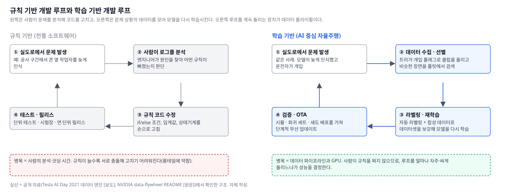

*그림 1. 규칙 기반 개발(왼쪽)은 사람이 문제를 분석해 코드를 고친다. 학습 기반 개발(오른쪽)은 문제 상황의 데이터를 모아 모델을 다시 학습시킨다. 오른쪽 루프를 계속 돌리는 장치가 데이터 플라이휠이다. 자체 작성.*

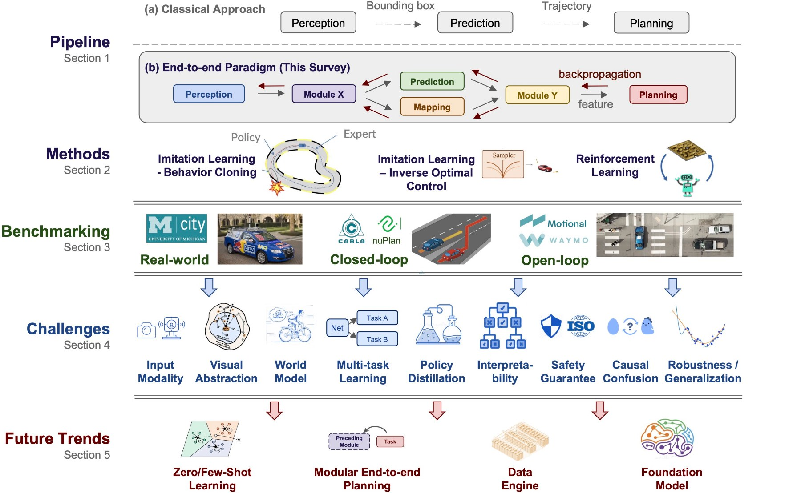

*그림 2. 학계 서베이가 정리한 고전 파이프라인(a: 인지 → 예측 → 계획을 사람이 정한 인터페이스로 잇는다)과 종단간 패러다임(b: 모듈 사이를 학습으로 잇고 역전파로 함께 고친다). 맨 아래 "미래 과제"에 데이터 엔진(Data Engine)이 들어 있다. 출처: Chen et al., 「End-to-end Autonomous Driving: Challenges and Frontiers」(TPAMI 2024) 공식 저장소 [OpenDriveLab/End-to-end-Autonomous-Driving](https://github.com/OpenDriveLab/End-to-end-Autonomous-Driving) `assets/overview.jpg`, MIT. 크기만 줄임.*

> **시사점.** 병목이 "사람의 분석·코딩 시간"에서 "데이터 파이프라인과 GPU"로 옮겨감. 루프를 얼마나 자주·싸게 돌리느냐가 성능을 결정함.

### 1.3 기존 AI 학습 방식의 한계 (데이터 플라이휠이 주목받는 이유)

- **전제**: 학습 기반 시스템은 규칙이 아니라 데이터로만 고칠 수 있음(1.2절). 따라서 문제는 "어떤 데이터가, 왜 부족한가"로 바뀜.
- **네 가지 한계**: 드문 상황이 사고를 좌우하는 롱테일(1.3.1), 장소·날씨가 바뀌면 성능이 떨어지는 분포 변화(1.3.2), 재학습이 예전 능력을 지우는 성능 회귀(1.3.3), 실도로 데이터로는 안전을 증명할 수 없는 문제(1.3.4).
- **공통점**: 넷 다 "한 번 모은 데이터로 한 번 학습해 배포하는" 기존 방식으로는 풀리지 않음. 이것이 데이터 플라이휠이 주목받는 이유임.

#### 1.3.1 롱테일 문제

- **정의**: 주행의 대부분(직진, 차선 유지, 앞차 따라가기)은 평범하고 모델은 금방 배움. 문제는 드물게 일어나는 상황임(공사 구간 콘 옆 작업자, 갑자기 뛰어드는 동물, 비 오는 밤의 역광, 예측하기 어려운 사람의 행동). 이를 **롱테일(long tail)** 이라 부름. 빈도 그래프의 오른쪽으로 길게 늘어진 꼬리처럼, 각각은 드물지만 종류가 무한히 많음.

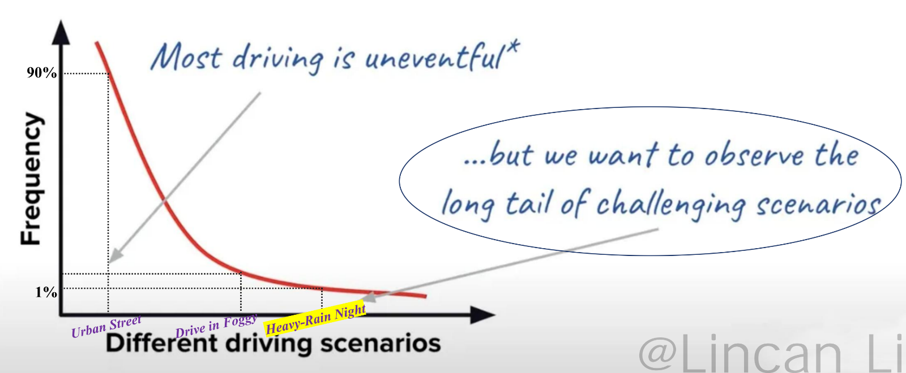

*그림 3. 주행 시나리오의 빈도 분포. 도심 직진 같은 상황이 90%를 차지하고, 안개·폭우 야간 같은 상황은 1% 아래의 긴 꼬리에 있다. 출처: Li et al., 「Data-Centric Evolution in Autonomous Driving」(arXiv 2401.12888) 공식 저장소 [Li et al. 2024 서베이 저장소](https://github.com/LincanLi-X/Awesome-Data-Centric-Autonomous-Driving) `img_resource/1-1_Long_Tail_Distribution.png`, Apache-2.0. 크기만 줄임.*

- **Waymo WOD-E2E(2025-10)**: 롱테일을 정면으로 겨눈 데이터셋 [보도] ([arXiv 2510.26125](https://arxiv.org/abs/2510.26125)).
  - 일상 주행에서 **발생 빈도 0.03% 미만**인 상황만 골라 4,021개 구간(약 12시간)을 모음.
  - 평가 지표를 "기록된 궤적과의 거리"가 아니라 "사람 평가자가 선호한 궤적과의 거리"(RFS, Rater Feedback Score)로 바꿈.
  - 판단 근거: 흔한 상황에서는 이미 잘하므로 드문 상황에서만 모델 간 차이가 드러남.
- **드문 상황이 안전을 지배하는 이유**: 안전 지표 자체가 드문 사건이기 때문임.
  - 미국 사람 운전자의 부상 신고 충돌은 100만 마일당 2.80건 [보도] ([Waymo 비교 연구](https://waymo.com/research/comparison-of-waymo-rider-only-crash-data-to-human/)).
  - 100만 마일에서 세 번 남짓 일어나는 사건을 줄이려면 99.99%를 잘하는 것으로는 부족하고, 나머지 0.01%에서 무엇을 하는지가 결정함.
  - Elon Musk의 "9의 행진(march of nines)"도 같은 뜻임. 신뢰도 99% → 99.9% → 99.99%로 9를 하나씩 붙일 때마다 남은 예외 상황을 처리해야 하고, 그 예외가 곧 롱테일임 [보도] ([보도](https://www.carswithcords.net/2020/07/tesla-and-long-march-of-nines-to-full.html)).

> **시사점.** 흔한 상황을 더 잘하는 것은 사고율에 거의 기여하지 않음. 플라이휠은 드문 상황을 찾아내고 늘리는 장치여야 함.

#### 1.3.2 데이터 분포 변화

- **정의**: 한 도시에서 배운 모델을 다른 도시에 가져가면 성능이 떨어짐. 이를 **분포 변화(distribution shift)** 라 함. 학습 데이터와 실제 데이터의 "분포"(어떤 상황이 얼마나 자주 나오는가)가 다르다는 뜻임.
- **수치로 확인된 사례**

| 사례 | 내용 | 근거 |
|---|---|---|
| Waymo Open Dataset 논문(2020) | 샌프란시스코 도심 데이터로 학습한 3D 차량 검출기를 교외(피닉스·마운틴뷰)에서 평가 시 정확도 지표(APH) 8.0 하락; 교외로만 학습한 보행자 검출기를 도심에서 평가 시 19.8 하락. 저자들은 "뚜렷한 도메인 갭"이라 표현 | [보도] ([arXiv 1912.04838](https://arxiv.org/pdf/1912.04838)) |
| nuScenes 기반 연구 | 보스턴(우측통행)·싱가포르(좌측통행)를 함께 담은 데이터셋에서 "장면·날씨·밤낮"이 바뀔 때 적응 없이는 성능이 크게 하락 | [보도] ([BEVUDA](https://arxiv.org/pdf/2211.17126), [DA-BEV](https://arxiv.org/pdf/2401.08687)) |
| Wayve 영국 → 미국 | 영국(좌측통행)에서만 배운 모델을 미국에 가져갔을 때 처음에는 영국 수준 미달; 미국 데이터 100시간 추가로 크게 개선; 8주간 모은 500시간으로 영국 수준에 근접 | [보도] ([Wayve](https://wayve.ai/thinking/multi-country-generalization/)) |

> **시사점.** 새 시장에 들어갈 때마다 그 시장의 데이터를 모아 넣어야 함. 플라이휠이 지역 확장의 도구가 되는 이유임.

#### 1.3.3 성능 회귀

- **현상**: 모델을 다시 학습시키면 새로 넣은 상황은 좋아지지만 예전에 잘하던 상황이 나빠질 수 있음. 학습 분야에서는 **파국적 망각(catastrophic forgetting)** 이라 부름. 새 데이터에 맞춰 가중치를 바꾸다가 예전 지식이 덮어써지는 현상임.
- **연구 근거**: 자율주행의 지속 학습에서도 보호 장치 없이 재학습만 하면 망각이 생김 [보도] ([IEEE](https://ieeexplore.ieee.org/abstract/document/10801619)).
- **대응 = 회귀 테스트**: 플라이휠에는 회귀 테스트가 반드시 들어감.
  - Tesla의 Andrej Karpathy가 CVPR 2021 발표에서 설명한 데이터 엔진 루프: "섀도 모드로 배포 → 예측을 관찰 → 트리거를 조정해 새 데이터 수집 → **잘못된 예측을 '유닛 테스트'로 만들기** → 비슷한 예제를 데이터셋에 추가 → 재학습 → 반복". 당시 플릿에서 221개 트리거 가동 [보도] ([발표 요약](https://dynamicallytyped.com/stories/2021/karpathy-autopilot-cvpr/)).
  - 틀렸던 상황을 테스트로 남겨 두면 다음 모델이 그 상황을 다시 틀리는지 확인 가능함.
  - Waymo: 새 소프트웨어를 낼 때마다 "테스트 트랙·실도로·합성 시나리오 전부를 시뮬레이션에서 다시 실행"하고, 충돌 회피 시나리오는 상대 차량의 위치·속도를 조금씩 바꿔 가며(fuzzing) 돌림 [보도] ([Waymo CAT](https://waymo.com/blog/2022/12/waymos-collision-avoidance-testing/)).

> **시사점.** 실패 사례는 한 번 고치고 버리는 것이 아니라 영구 회귀 세트로 축적해야 함. 이것이 5.3절의 회귀 세트임.

#### 1.3.4 실도로 데이터 확보와 안전성 문제

- **통계적 한계(RAND, 2016, "Driving to Safety")**: 2013년 미국 교통사고 사망률(1억 마일당 1.09명) 기준 [보도] ([RAND RR-1478](https://www.rand.org/pubs/research_reports/RR1478.html)).

| 입증하려는 명제 | 필요한 주행 거리 | 조건 |
|---|---|---|
| 자율주행차가 사람보다 사망률이 낮다 | 무사고 **2억 7,500만 마일** | 95% 신뢰 수준 |
| 사람보다 20% 더 안전하다 | **110억 마일** | 95% 신뢰·80% 검정력 |

  - 보고서 결론: "주행만으로는 안전에 도달할 수 없다(cannot drive their way to safety)".
- **실제 수치와의 비교**
  - Waymo: 2026년 3월 기준 무인(rider-only) 누적 2억 2,060만 마일. 1억 7,070만 마일 분석에서 사람 대비 중상 이상 충돌 92% 감소, 에어백 전개 83% 감소, 보행자 부상 92% 감소 [보도] ([Waymo Safety Impact](https://waymo.com/blog/shorts/waymo-safety-impact-update-170m/)).
  - 독립 기관 IIHS 분석: 부상 충돌 81% 감소로 조금 낮음 [보도].
  - 해석: 10년 가까이 세계에서 가장 많이 달린 회사가 이제 RAND의 첫 번째 문턱을 넘었을 뿐임.
  - Tesla: FSD 누적 100억 마일을 공개했으나 충돌 집계 방식이 정부 데이터와 달라 독립 검증이 없다는 비판을 받음 [보도·미확인] ([tesla.com/fsd/safety](https://www.tesla.com/fsd/safety), [비판](https://cryptobriefing.com/tesla-fsd-safety-data-collision-reduction/)).
- **안전 표준의 결론**: ISO 21448(SOTIF, 의도된 기능의 안전)은 주행 상황을 "알려짐/모름 × 안전/불안전"의 네 영역으로 나누고, "모르는 불안전 상황(unknown unsafe)"을 합리적 노력으로 최대한 줄이는 반복 과정을 요구함. 주요 수단은 시뮬레이션을 포함한 광범위한 검증임 [보도] ([Ansys SOTIF 해설](https://www.ansys.com/simulation-topics/what-is-sotif)).
- **시뮬레이션 규모(Waymo)**
  - 실주행 2,000만 마일에 시뮬레이션 200억 마일 이상을 얹음. 자체 시뮬레이터 Carcraft는 하루 800만~1,000만 마일 [보도] ([Simulation City](https://waymo.com/blog/2021/07/simulation-city/), [CACM 2018](https://cacmb4.acm.org/magazines/2018/2/224621-a-comprehensive-self-driving-car-test)).
  - 2026년 2월: Google DeepMind의 Genie 3 기반 "Waymo World Model"로 플릿이 본 적 없는 상황(토네이도, 도로 위 코끼리)까지 만들어 시험 [보도] ([Waymo 블로그](https://waymo.com/blog/2026/02/the-waymo-world-model-a-new-frontier-for-autonomous-driving-simulation/)).

> **시사점.** 실주행 거리는 안전 통계의 재료일 뿐 증명 수단이 아님. 시뮬레이션과 시나리오 기반 검증이 플라이휠의 필수 단계가 되는 근거임.

### 1.4 지속적 closed-loop learning의 필요성

- **1.3의 네 가지 한계를 정리하면** 한 방향을 가리킴

| 압력 | 무엇이 문제인가 | 플라이휠이 하는 일 |
|---|---|---|
| 학습 모델 | 데이터 없는 상황은 못 푼다 | 실패한 상황의 데이터를 모아 다시 학습 |
| 롱테일 | 드문 상황이 사고율을 결정 | 드문 상황을 찾아내고 늘려서(합성) 학습 |
| 분포 변화 | 장소·날씨·차종이 바뀌면 성능 하락 | 새 시장 데이터를 빠르게 모아 적응 |
| 성능 회귀·검증 한계 | 새 모델이 예전 것을 잊고, 실주행으로는 증명 불가 | 회귀 테스트 세트와 시뮬레이션으로 배포 전 확인 |

- **결론**: 네 가지를 한 번에 해결하는 방법은 하나임. 차에서 데이터를 모으고, 고쳐서, 시뮬레이션으로 확인하고, 다시 차에 보내는 루프를 **계속** 돌리는 것임. "데이터 플라이휠"이든 "데이터 엔진"이든 구조는 같음. 그 구조를 2장에서 펼침.

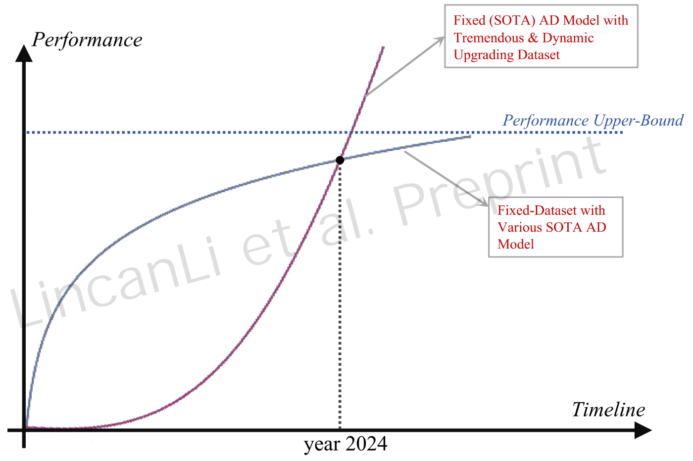

*그림 4. 같은 서베이의 개념도. 데이터셋을 고정하고 모델만 바꾸면(파랑) 성능이 상한에 막히고, 데이터셋을 계속 키우면(보라) 그 상한을 넘는다는 저자들의 주장이다. 실측 곡선이 아니라 개념도다. 출처: [Li et al. 2024 서베이 저장소](https://github.com/LincanLi-X/Awesome-Data-Centric-Autonomous-Driving) `img_resource/1-2_Illustration-of-AD-Model-Performance-Upper-Bound.png`, Apache-2.0. 크기만 줄임.*

> **시사점.** 플라이휠은 선택이 아니라 학습 기반 자율주행의 전제 조건임. 다음 장은 그 단계를 하나씩 펼침.

---
## 2. 차량·클라우드·검증 환경을 연결하는 데이터 플라이휠 생태계

> **개요.** 차량 데이터 플라이휠의 9단계를 펼치고, 챗봇 같은 일반 AI 플라이휠과 무엇이 다른지를 여섯 가지로 비교함. 2021년 데이터 엔진이 2026년 플라이휠로 어떻게 바뀌었는지는 5.1절에서 다룸.
>
> **핵심 결론.** ① 일반 AI 플라이휠은 "생산 로그 → 데이터셋 → 미세조정 → 평가 → 배포"의 루프이며, NVIDIA가 이를 소프트웨어 블루프린트로 공개함. ② 차량 플라이휠은 여기에 "차 안에서의 선별·업로드", "시뮬레이션 검증", "안전 인증 관문", "OTA 규제"가 끼어들어 원이 더 길고 관문이 더 많음. ③ 일반 AI도 개인정보 규제를 받지만, 차량은 동의한 적 없는 제3자를 찍고 위치가 항상 붙으며 도로 영상이 지리정보로 취급되어 국외 반출 규제까지 받음.

### 2.1 기준점 — 일반 AI 데이터 플라이휠

- **정의(NVIDIA 블루프린트 README)**: "데이터 플라이휠은 생산 애플리케이션의 데이터 배기가스(예: LLM 프롬프트·응답 로그, 사용자 피드백, 전문가 라벨)를 사용해 생성형 AI 시스템의 정확도를 높이고 지연·비용을 줄이는 프로세스" [원문] ([data-flywheel README](https://raw.githubusercontent.com/NVIDIA-AI-Blueprints/data-flywheel/main/README.md)).
- **6단계** — 같은 문서가 "몇 시간 안에 자동으로 한다"고 설명하는 단계 [원문]

| 단계 | 내용 |
|---|---|
| 1 | 로그 저장소(Elasticsearch)에서 생산 데이터를 가져옴 |
| 2 | 작업(task)별로 묶음. 에이전트가 여러 일을 하면 노드마다 다른 작업 |
| 3 | 중복 제거 |
| 4 | 클래스별 계층화 분할로 평가용·미세조정용 데이터셋 생성 → 데이터 저장소(NeMo Datastore)에 업로드 |
| 5 | 미세조정 서비스(NeMo Customizer)로 작은 모델 학습 |
| 6 | 평가 서비스(NeMo Evaluator)가 "LLM-as-judge"(큰 모델이 채점자 역할)로 원래 모델과 비교 |

- **승격은 사람 판단**: README는 "플라이휠은 자동 조종 장치가 아니라 손전등"이라 쓰고, 제한 사항 문서는 "어떤 모델도 자동으로 승격·배포하지 않으며, 사용자 피드백도 받지 않는다"고 명시함 [원문] ([제한 사항](https://raw.githubusercontent.com/NVIDIA-AI-Blueprints/data-flywheel/main/docs/05-limitations-best-practices.md), [구조 문서](https://raw.githubusercontent.com/NVIDIA-AI-Blueprints/data-flywheel/main/docs/01-architecture.md)). 여섯 단계는 후보를 찾아 점수를 매기는 데서 끝남.
- **효과 = 비용 절감(단서 포함)**
  - README: "NVIDIA 내부 실험에서 플라이휠로 추론 비용을 최대 98.6% 줄인 사례가 있다" [원문].
  - 같은 문장의 단서: "이런 사례는 에이전트가 소수의 도구 중 하나를 고르는 단순한 도구 호출 용도에 집중돼 있다" [원문].
  - 사례 내용: 인사 챗봇에서 미세조정한 1B 모델이 70B 모델 정확도의 약 98%를 냄.
  - 사내 지식 비서 논문(직원 3만 명 이상 사용): 3개월간 부정 피드백 495건을 모아 라우팅 오류 5.25%를 찾아내고, 라우터를 70B 모델에서 미세조정한 8B 모델로 바꿔 정확도 96%·지연 70% 감소 [보도] ([arXiv 2510.27051](https://arxiv.org/abs/2510.27051)).

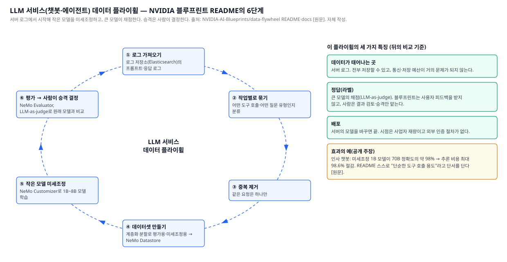

*그림 5. 일반 AI(LLM 에이전트) 데이터 플라이휠. NVIDIA 블루프린트 README의 6단계를 원으로 그렸다. 데이터는 서버 로그에서 나오고, 정답은 큰 모델의 채점이며, 승격은 사람이 결정하고, 배포는 소프트웨어 교체다. 자체 작성.*

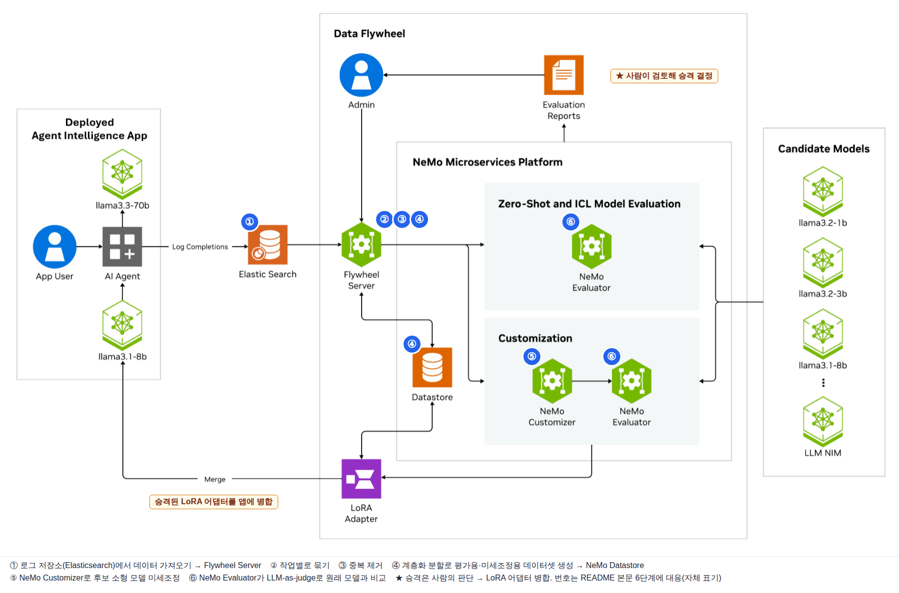

*그림 6. NVIDIA가 공개한 데이터 플라이휠 블루프린트의 공식 구조도에 위 6단계의 번호를 표시한 것. ① 배포된 에이전트 앱의 로그가 Elasticsearch에 쌓이고 플라이휠 서버가 가져온다. ②③④ 서버가 작업별로 묶고 중복을 없애고 데이터셋을 만들어 Datastore에 올린다. ⑤ NeMo Customizer가 후보 소형 모델(1B~8B)을 미세조정한다. ⑥ NeMo Evaluator가 제로샷·인컨텍스트 후보와 미세조정 후보를 채점한다. ★ 평가 보고서를 관리자가 검토해 승격을 결정하고, 승격된 LoRA 어댑터가 앱에 병합된다(Merge). 출처: [NVIDIA-AI-Blueprints/data-flywheel](https://github.com/NVIDIA-AI-Blueprints/data-flywheel) `docs/images/data-flywheel-blueprint.png`, Apache-2.0. 크기 축소 후 번호·범례를 덧그림(원본은 `images/src-nvidia-data-flywheel-blueprint.png`).*

- **일반 플라이휠의 세 가지 특징(뒤의 비교 기준)**
  - 데이터는 서버 로그에서 공짜로 나옴.
  - 정답(라벨)은 큰 모델의 채점이고, 사람은 결과 검토와 승격만 맡음.
  - 배포는 서버의 모델을 바꾸면 끝남.

> **시사점.** 일반 플라이휠의 "98.6% 절감"은 단순 도구 호출을 70B → 1B로 증류한 사례이므로 자율주행에 그대로 적용할 수 없음(5.4절).

### 2.2 차량 데이터 플라이휠의 전체 구조

- **구성 근거**: 세 종류의 공개 자료가 공통으로 말하는 것을 합침.
  - Tesla 2021년 AI Day 데이터 엔진 [보도] ([CleanTechnica](https://cleantechnica.com/2021/08/30/observations-on-teslas-ai-day/)).
  - NVIDIA·AWS의 "AV 3.0 데이터 파이프라인"(2026-03) [보도] ([AWS 블로그](https://aws.amazon.com/blogs/industries/building-an-end-to-end-physical-ai-data-pipeline-for-autonomous-vehicle-3-0-on-aws-with-nvidia/), 본문은 요약만 확인·다이어그램은 그림 8).
  - Li et al. 2024 서베이(arXiv 2401.12888)의 7단계 폐쇄루프 [원문] ([README 3.1절](https://raw.githubusercontent.com/LincanLi-X/Awesome-Data-Centric-Autonomous-Driving/main/README.md)).

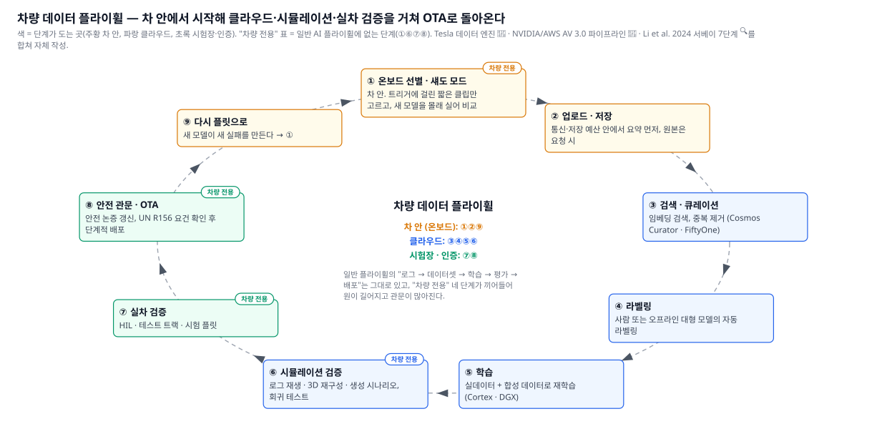

*그림 7. 차량 데이터 플라이휠. 차 안(온보드)에서 시작해 클라우드·시뮬레이션·실차 검증을 거쳐 OTA로 돌아온다. 색은 단계가 도는 곳(차 안·클라우드·시험장), "차량 전용" 표는 일반 플라이휠에 없는 단계를 뜻한다. Li et al. 2024 서베이 7단계·Tesla 데이터 엔진·NVIDIA/AWS AV 3.0 파이프라인을 합쳐 자체 작성.*

- **9단계**

| 단계 | 장소 | 역할 | 대표 사례 |
|---|---|---|---|
| ① 온보드 선별 | 차 안 | 모든 데이터를 올릴 수 없으므로 "트리거"(조건)에 걸린 짧은 클립만 고름. 새 모델을 몰래 실어 기존 모델·운전자와 비교하는 **섀도 모드**도 여기서 돎 | Tesla 트리거 221개, 약 10초 클립 [보도]; openpilot은 카메라·CAN·GPS·IMU를 기본 업로드 [원문] |
| ② 업로드·저장 | 차 → 클라우드 | 통신비·저장비 예산 안에서 올림 | Mobileye REM은 km당 약 10KB만 전송 [보도]; comma는 월 수백 TB 처리 [보도] |
| ③ 검색·큐레이션 | 클라우드 | 수백만 클립에서 원하는 상황을 찾고 중복을 없앰 | NVIDIA Cosmos Curator·Dataset Search [보도] |
| ④ 라벨링 | 클라우드 | 정답을 붙임. 사람 또는 오프라인 대형 모델 | Tesla 자동 라벨링(주 1만 클립) [보도] |
| ⑤ 학습 | 클라우드 | 실데이터 + 합성 데이터로 재학습 | Tesla Cortex, NVIDIA DGX [보도] |
| ⑥ 시뮬레이션 검증 | 클라우드 | 로그 재생·3D 재구성·생성 시나리오로 폐루프 시험, 회귀 테스트 | Waymo 하루 800만~1,000만 시뮬 마일 [보도] |
| ⑦ 실차 검증 | 시험장·시험 플릿 | HIL(하드웨어 인 더 루프)·테스트 트랙·시험 차량 | Waymo 테스트 트랙 + 실도로 [보도] |
| ⑧ 안전 관문·OTA | 인증 → 차 | 안전 논증 갱신, 규제(UN R156) 요건 확인 후 단계적 배포 | Tesla v14.x 주 단위 OTA [보도] |
| ⑨ 다시 ① | 차 안 | 새 모델이 새 실패를 만듦 | — |

- **일반 플라이휠과의 대응**: 6단계 중 "로그 수집·데이터셋·학습·평가·배포"는 그대로 있음. 차량에서 새로 생긴 것은 ①(차 안 선별), ⑥(시뮬레이션 필수), ⑦(실차), ⑧(안전 관문·규제)임.
- **세 근거와 단계의 대응**
  - 서베이 7단계 "(I) 수집 → (II) 저장 → (III) 선별·전처리 → (IV) 라벨링 → (V) 학습 → (VI) 시뮬레이션·테스트 검증 → (VII) 실세계 배포" = ②③④⑤⑥⑧.
  - ①(온보드 선별·섀도 모드) = Tesla 데이터 엔진. ⑦(실차 검증) = Waymo 사례. ⑧의 안전 관문·UN R156 = 규제 자료.

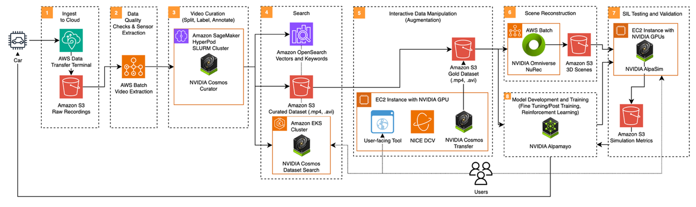

*그림 8. NVIDIA·AWS가 2026년 3월 공개한 "AV 3.0 물리 AI 데이터 파이프라인" 참조 아키텍처. 1 클라우드 수집(차량 → AWS Data Transfer Terminal → S3 원본 기록) → 2 품질 검사·센서 추출(AWS Batch) → 3 영상 큐레이션: 분할·라벨·주석(SageMaker HyperPod + Cosmos Curator) → 4 검색(OpenSearch 벡터·키워드, Cosmos Dataset Search) → 5 대화형 데이터 조작·증강(Cosmos Transfer → S3 골드 데이터셋) → 6 장면 재구성(AWS Batch + Omniverse NuRec → S3 3D 장면) → 7 SIL 시험·검증(AlpaSim → S3 시뮬레이션 지표) → 8 모델 개발·학습: 미세조정·후학습·강화학습(Alpamayo) → 차량. 그림 7과 대응하면 1·2 = ②, 3·4 = ③④, 5·8 = ⑤, 6·7 = ⑥이고, ①(차 안 선별)·⑦(실차 검증)·⑧(안전 관문·OTA)은 이 아키텍처에 없다. 출처: [AWS 블로그](https://aws.amazon.com/blogs/industries/building-an-end-to-end-physical-ai-data-pipeline-for-autonomous-vehicle-3-0-on-aws-with-nvidia/) 다이어그램(원 저작권 AWS·NVIDIA). 블로그 본문은 접근이 차단되어 요약만 확인 [미확인]. 원본 크기.*

- **AV 3.0 파이프라인과 그림 7의 차이**
  - 클라우드 안쪽(수집 이후 → 학습 → 시뮬레이션)만 그리며, 차 안 선별·실차 검증·규제 관문은 없음. 그림 7의 ③~⑥을 도구 이름 수준으로 채운 그림임.
  - 사람(Users)이 검색과 증강 도구에 붙어 있음. "사람이 고르고 만든다"는 3.2·3.4절 흐름과 같음.

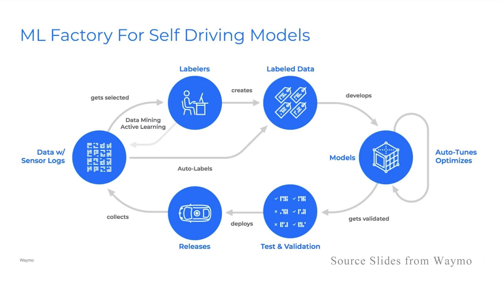

*그림 9. Waymo가 발표한 "ML Factory for Self Driving Models" 슬라이드. 센서 로그 → 데이터 마이닝·능동학습으로 선별 → 라벨러 또는 자동 라벨 → 모델(자동 튜닝) → 테스트·검증 → 릴리스 → 다시 수집. 위 표의 ③④⑤⑥⑧ 단계가 그대로 보인다. 출처: Waymo 발표 슬라이드 화면, [Li et al. 2024 서베이 저장소](https://github.com/LincanLi-X/Awesome-Data-Centric-Autonomous-Driving)에 수록(`img_resource/3-2-2_Waymo_close_loop.png`, 저장소 Apache-2.0). 원 저작권은 Waymo에 있다. 크기만 줄임.*

> **시사점.** 차량 플라이휠의 고유 단계 네 개(①⑥⑦⑧)는 모두 "관문"임. 원을 빨리 돌리는 것과 관문을 통과하는 것을 동시에 설계해야 함.

### 2.3 일반 AI 플라이휠과 다른 여섯 가지

- **비교 기준**: 2.1절의 일반 AI 플라이휠(챗봇·에이전트)과 2.2절의 차량 플라이휠을 같은 잣대에 놓고, 차량 쪽에만 있는 조건을 여섯 가지로 추림.

| # | 차이 | 일반 AI(챗봇·에이전트) | 차량(자율주행) | 근거 |
|---|---|---|---|---|
| 1 | **데이터가 생기는 곳과 올릴 수 있는 양** | 사용자가 서버에 접속해 쓰므로 로그가 서버에 저절로 남고, 전부 보관해도 비용이 적음 | 데이터가 차 안 센서에서 생김. 카메라 원본은 시간당 수십 GB~수 TB라 통신 요금·저장비 때문에 전부 올릴 수 없고, 차 안에서 "올릴 만한 순간"을 골라야 함(3.1절) | Tesla HW4 카메라는 시간당 약 20GB 생성(커뮤니티 추정 [미확인]); Mobileye REM은 km당 10KB만 보내도록 설계 [보도]; comma는 마일당 $0.003 미만으로 서비스 비용을 맞춤 [보도] |
| 2 | **정답(라벨)의 성격** | 사용자 클릭·평점·큰 모델의 채점. 화면 안에서 끝남 | 운전자 개입, 아슬아슬한 순간(니어미스), 충돌 같은 **물리적 결과**. 3D 위치·속도처럼 사람이 눈으로 못 만드는 라벨이 많아 자동 라벨링이 필수(3.2절) | Tesla 섀도 모드는 모델 출력과 운전자 행동을 비교 [보도]; NHTSA는 자율주행 충돌을 1~5일 안에 보고하게 함 [보도] ([SGO 2021-01](https://www.nhtsa.gov/laws-regulations/standing-general-order-crash-reporting)) |
| 3 | **배포 앞의 안전 관문** | 평가 점수가 좋으면 바로 교체 | 새 모델이 "안전하다"는 논증(안전 케이스)을 표준에 맞춰 다시 써야 함. ISO 26262(고장), ISO 21448(고장이 없어도 성능 한계로 생기는 위험), ISO/PAS 8800(AI 부품의 안전) | [보도] ([UL 해설](https://www.ul.com/sis/blog/safety-related-systems-road-vehicles-artificial-intelligence-are-addressed-isopas-88002024)) |
| 4 | **소프트웨어 업데이트 자체가 규제 절차임** | 하루에도 여러 번 서버의 모델을 바꿈 | UN 규정 R156이 요구하는 것: ① 제조사가 업데이트를 관리하는 체계(SUMS)를 인증받을 것 ② 모든 소프트웨어 버전에 식별 번호(RxSWIN)를 붙여 어떤 차에 어떤 버전이 실렸는지 추적할 것 ③ 업데이트가 인증받은 기능에 영향을 주면 다시 승인받을 것 ④ 업데이트 전에 대상 차량과 맞는지 확인하고, 주행 중 안전하게 설치하며, 사용자에게 알리고, 기록을 남길 것. EU는 2024년 7월부터 모든 신차에 적용. 즉 모델을 바꿔 내보내는 행위 자체가 인증 대상이라 "조용히 자주" 바꿀 수 없음 | [보도] ([요약](https://diadrom.com/insights/un-r156-sums-requirements)) |
| 5 | **시뮬레이터가 필수** | 실제 사용자 일부에게 새 모델을 보여 주는 A/B 테스트로 충분 | 위험한 상황을 실차로 반복할 수 없고, 실주행 거리로는 안전을 증명할 수 없음(1.3.4절). 시뮬레이션이 검증의 주 수단 | Waymo 실주행 2,000만 vs 시뮬 200억 마일 [보도] |
| 6 | **개인정보의 범위와 데이터 주권** | 개인정보 규제(GDPR 등)를 똑같이 받지만, 데이터의 주인은 서비스에 가입하고 약관에 동의한 **당사자**이고, 데이터는 글·클릭임 | 같은 규제를 받되 세 가지가 더 붙음. ① 카메라가 **동의한 적 없는 제3자**(보행자·옆 차 운전자·번호판)를 찍음. EU 개인정보 감독기구(EDPB)는 차 밖의 사람·번호판도 개인정보로 봄 [보도] ② 주행 데이터에는 **위치·이동 경로**가 항상 붙음 ③ 도로·건물·지형 영상은 **지리정보**로 취급돼 국가 안보 관점의 **국외 반출 규제**를 받음. Tesla는 중국 도로 데이터를 미국으로 못 보내 상하이에 데이터센터와 학습 인프라를 따로 두었고, 한국은 원본 영상 학습을 규제 샌드박스로만 허용하며 국외 이전은 별개 심사임 | [보도] ([EDPB 가이드라인 1/2020](https://www.edpb.europa.eu/our-work-tools/documents/public-consultations/2020/guidelines-12020-processing-personal-data_en), [Electrek 2026-02](https://electrek.co/2026/02/06/tesla-ai-training-capability-china-critical-step-full-self-driving/), [국내 보도](https://m.news.nate.com/view/20260123n23984), [머니투데이 2026-08](https://www.mt.co.kr/tech/2026/08/25/2026082423164221461)) |

- **차이 6 보충 — "얼굴·번호판은 일반 AI에도 있지 않나?"**
  - 맞음. 챗봇 로그에도 개인정보가 들어가고 GDPR 같은 규제는 똑같이 적용됨. 차량이 다른 점은 데이터의 종류가 아니라 **동의 구조·위치 결합·지리정보 규제** 세 가지임.
  - 동의 구조: 챗봇 사용자는 약관에 동의한 당사자이지만, 차가 찍는 보행자와 옆 차 운전자는 동의한 적이 없음. 그래서 EDPB는 차 밖 데이터를 별도 항목으로 다루고 차내 처리(원본을 차 밖으로 내보내지 않음)를 권고함 [보도].
  - 위치 결합: 주행 영상은 언제·어디를 지났는지와 함께 기록되므로, 얼굴을 가려도 이동 경로 자체가 개인정보가 됨.
  - 지리정보 규제: 도로·건물 영상은 지도 데이터와 같은 취급을 받음. 중국은 차량 운행 정보의 국외 반출을 원칙 금지하고 평가·보고를 거치게 하며 [보도], 한국은 정밀지도 반출을 오래 제한해 왔고 자율주행 영상의 국외 이전은 개인정보위 심사 대상임 [보도].
  - 딜레마: 얼굴·번호판을 흐리면 사람·차를 인식하는 학습에 쓸 정보가 사라짐. 한국이 "안전 조치를 조건으로 원본 그대로 학습"을 샌드박스로 허용한 이유임(5.5절).

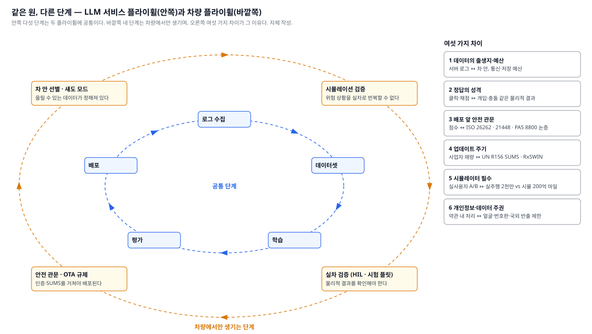

*그림 10. 같은 원, 다른 단계. 일반 AI 플라이휠(안쪽)에 차량에서만 생기는 네 단계(바깥쪽)가 더해진다. 자체 작성.*

> **시사점.** 일반 플라이휠은 "얼마나 빨리 도는가"의 문제이고, 차량 플라이휠은 "관문을 통과하면서도 계속 돌게 하는가"의 문제임. 2021년 데이터 엔진이 2026년 플라이휠로 어떻게 바뀌었는지는 5.1절에서 봄.

---

## 3. 데이터 플라이휠의 작동 방식과 핵심 기술

> **개요.** 2장이 플라이휠의 전체 구조(9단계)를 보여 줬다면, 이 장은 그 안에서 실제로 쓰이는 핵심 기술을 네 묶음으로 나눠 봄. ① 데이터 수집·선별(차 안, 단계 ①②) ② 검색·라벨링(클라우드, 단계 ③④) ③ 학습·합성 데이터(클라우드, 단계 ⑤) ④ 검증·배포(단계 ⑥⑦⑧). 묶음마다 필요성 → 핵심 기술(정의·작동·사례) → 사례 적용 → 참고 자료 순서임. 도구의 세부 설정은 생략하고 원리 위주로 적음.
>
> **핵심 결론.** ① 차 안에서는 트리거(규칙·모델 점수·사람)로 "올릴 만한 순간"을 고르고, 요약본을 먼저 올린 뒤 원본은 서버가 지목할 때만 올림. ② 클라우드에서는 임베딩 검색으로 비슷한 장면을 수백~수천 개 모으고, 차 안 모델보다 훨씬 큰 모델이 미래 프레임까지 보면서 정답을 소급해 붙임. ③ 부족한 장면은 재생·재구성·생성 세 갈래의 합성 데이터로 늘리고, 시뮬레이터 안에서 모델이 직접 운전하며 배우는 폐루프 학습으로 넘어가는 중임. ④ 검증은 한 점수가 아니라 개루프 → 폐루프 → 사람 선호 → 회귀 세트 → 실차 → 섀도 → 단계적 OTA로 올라가는 사다리이고, 마지막 단(OTA)은 규제 절차임.

- **네 묶음 요약**

| 묶음 | 단계 | 역할 | 핵심 기술 | 대표 사례 |
|---|---|---|---|---|
| 3.1 수집·선별 | ①② | 차 안에서 올릴 순간을 고르고 압축해 올림 | 트리거, 섀도 모드, 두 단계 업로드 | Tesla 트리거 221개, openpilot, 현대차 Hard Example Mining |
| 3.2 검색·라벨링 | ③④ | 비슷한 장면을 모으고 정답을 붙임 | 임베딩 검색, 자동 라벨링, 사람 검수 | NVIDIA Cosmos, Tesla·Waymo 자동 라벨링 |
| 3.3 학습·합성 데이터 | ⑤ | 모자란 장면을 만들어 학습 | 재생·재구성·생성, 폐루프 강화학습, 교사-학생 증류 | NVIDIA NuRec·Cosmos, Wayve GAIA, openpilot 0.11, Waymo |
| 3.4 검증·배포 | ⑥⑦⑧ | 개선 여부를 확인하고 차에 배포 | 검증 사다리, 안전 케이스, UN R156 | Waymo, Tesla 단계적 OTA |

### 3.0 따라갈 사례

> **가상 사례.** 밤 10시, 비가 오는 편도 2차선 도로. 공사 구간이라 콘이 차선을 막고 있고, 콘 옆에 형광 조끼를 입은 작업자가 서 있다. 차의 모델은 콘은 일찍 봤지만 작업자를 늦게 인식했고, 운전자가 브레이크를 밟아 개입했다. 사고는 없었다.

- 롱테일의 전형임. 밤 + 비 + 공사 + 서 있는 사람이라는 네 조건이 겹쳤고, 각각은 흔하지만 조합은 드묾.
- 각 절 끝의 "사례 적용"에서 이 클립 하나가 어떤 기술을 거쳐 모델을 고치는지 확인함.

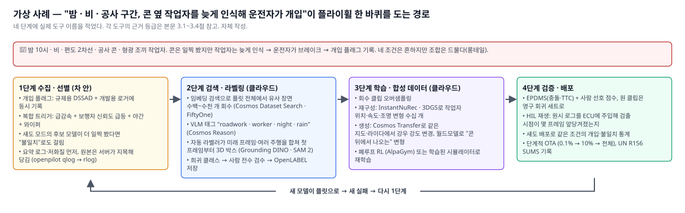

*그림 11. 콘 옆 작업자 사례가 플라이휠 한 바퀴를 도는 경로. 각 단계에 실제 도구 이름을 적었다. 자체 작성.*

### 3.1 데이터 수집·선별 (차 안) — 단계 ①②

- **필요성**
  - 차 한 대가 만드는 원본 데이터는 하루 수 TB 수준임. Intel은 2016년 차량당 하루 약 4TB로 추정했고 [보도] ([Intel 2016](https://download.intel.com/newsroom/2021/archive/2016-11-15-editorials-krzanich-the-future-of-automated-driving.pdf)), 최근 업계 추정은 시간당 1~5TB임 [보도·미확인] ([Siemens 블로그](https://blogs.sw.siemens.com/polarion/the-data-deluge-what-do-we-do-with-the-data-generated-by-avs/)).
  - 통신 요금과 저장비 때문에 전부 올릴 수 없음. 따라서 차 안에서 "올릴 만한 순간"을 고르고, 고른 것도 압축해 올려야 함.
  - 핵심 기술은 세 가지임. 트리거(어느 순간을 고를지), 섀도 모드(새 모델을 안전하게 시험하며 고를지), 두 단계 업로드(고른 것을 얼마나 싸게 올릴지).

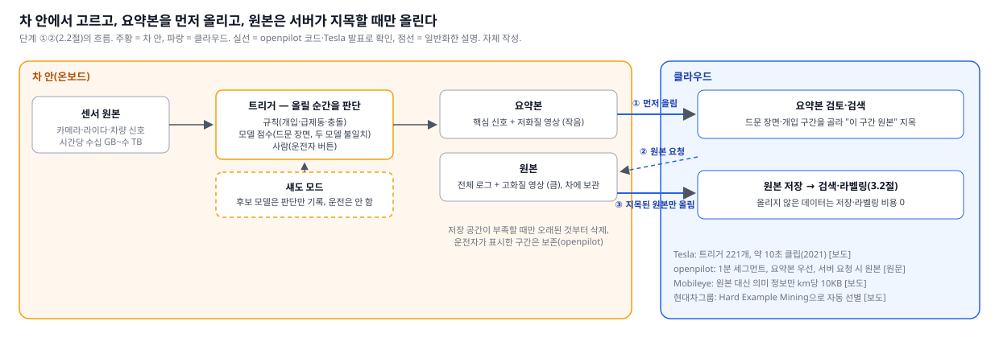

*그림 12. 차 안에서 트리거로 순간을 고르고, 요약본을 먼저 올린 뒤 서버가 지목한 구간만 원본을 올리는 흐름. 자체 작성(openpilot 코드·Tesla 발표 기준).*

- **핵심 기술 1 — 트리거**
  - 정의: 차 안에서 "이 순간의 데이터를 저장·업로드하라"고 판단하는 조건.
  - 작동: 센서 데이터가 계속 흐르는 동안 조건이 맞는 순간에만 앞뒤 몇 초를 잘라 보관·업로드 대상으로 표시함. Tesla는 약 10초 단위 클립을 씀 [보도].
  - 한계: 트리거는 미리 정한 조건만 잡음. 정하지 않은 상황은 걸리지 않으므로, 클라우드의 검색(3.2절)이 이를 보완함.
  - 종류: 세 가지.

| 종류 | 트리거 조건 | 사례 |
|---|---|---|
| 규칙 | 운전자 개입, 급제동, 충돌, 시스템 오류 | UN R157의 기록 장치(DSSAD)도 시스템 켜짐·꺼짐·개입을 기록하도록 요구 [보도] ([해설](https://autocrypt.io/edr-dssad-vehicle-accident-analysis-tools/)) |
| 모델 점수 | 차 안의 작은 모델이 "드문 장면" 점수를 매기거나, 두 모델의 판단이 갈릴 때 | Tesla 트리거 221개(2021) [보도] ([Karpathy CVPR'21 요약](https://dynamicallytyped.com/stories/2021/karpathy-autopilot-cvpr/)); NVIDIA는 모델 여러 개의 불일치로 고른 데이터가 수동 선별보다 야간 보행자 검출을 3배 개선 [보도] ([NVIDIA 블로그](https://medium.com/nvidia-ai/scalable-active-learning-for-autonomous-driving-a-practical-implementation-and-a-b-test-4d315ed04b5f)) |
| 사람 | 운전자가 버튼을 누르거나 테스트 드라이버가 표시 | openpilot 운전자 북마크 [원문] |

- **핵심 기술 2 — 섀도 모드**
  - 정의: 새 후보 모델을 차에 싣되 운전은 시키지 않고, 판단만 기록해 현행 모델·운전자와 비교하는 방식.
  - 작동: 현행 모델과 후보 모델이 같은 센서 입력을 받아 각자 판단함. 두 판단이 갈리거나 후보 모델이 운전자와 다르게 판단한 순간을 기록함.
  - 역할: 두 가지. 판단이 갈리는 순간이 곧 "가치 있는 데이터"의 신호이므로 트리거의 한 종류이고, 새 모델을 실제 도로에서 위험 없이 시험하므로 검증(3.4절)의 한 단이기도 함.
  - 사례: Tesla는 FSD를 켜지 않은 차에서도 백그라운드에서 판단을 내려 실제 운전과 비교함 [보도].
  - 전제: 현행 모델과 후보 모델을 동시에 돌릴 추론 자원이 차 안에 있어야 함(5.6절).
- **핵심 기술 3 — 두 단계 업로드**
  - 원리: 고른 순간이라도 원본(고화질 영상 + 전체 로그)은 크므로, 작은 요약본을 먼저 올리고 원본은 서버가 지목할 때만 올림.
  - 1단계: 요약본(핵심 신호 + 저화질 영상)을 모든 구간에 대해 올림. 서버는 이것으로 어느 구간이 흥미로운지 검색함.
  - 2단계: 서버가 "이 구간 원본"을 요청하면 그때 차에 보관 중인 원본을 올림. 요청이 없는 원본은 저장 공간이 부족해질 때 지움.
  - 효과: 올리지 않은 데이터는 통신·저장·라벨링 비용이 0임. 요약본은 "검색용 색인", 원본은 "학습용 재료"로 역할이 나뉨.
- **openpilot 코드에서 확인한 내용**: 양산차에 붙어 매일 도는 오픈소스라 두 단계 업로드가 실제로 어떻게 구현되는지 코드로 확인할 수 있음 [원문] (commaai/openpilot, 커밋 521db4c, 2026-09-20).

| 항목 | 코드에서 확인한 것 | 파일 |
|---|---|---|
| 기록 단위 | 주행을 1분 단위 구간으로 잘라 기록. 메인 카메라는 압축해 저장하고, 따로 저화질 영상을 만들어 둠 | [loggerd.h](https://github.com/commaai/openpilot/blob/521db4c825d37eb5f29acf955daa88da003e4433/openpilot/system/loggerd/loggerd.h) |
| 요약본의 내용 | 전체 로그와 별도로 요약 로그를 만들며, 신호마다 넣는 비율이 다름. 차량 상태는 10개 중 1개, 차량 내부 통신 메시지는 약 2,000개 중 1개만 요약본에 들어감 | [services.py](https://github.com/commaai/openpilot/blob/521db4c825d37eb5f29acf955daa88da003e4433/openpilot/cereal/services.py) |
| 업로드 순서 | 요약 로그 → 저화질 영상 → 나머지 순으로 올림. 요약 로그는 25MB 상한. 종량제 통신망에서는 사용자가 앱에서 본 주행만 저화질 영상을 올림 | [uploader.py](https://github.com/commaai/openpilot/blob/521db4c825d37eb5f29acf955daa88da003e4433/openpilot/system/loggerd/uploader.py) |
| 원본 요청 | 서버가 특정 구간의 파일을 지목하면 그때 올림. 셀룰러 사용 허용 여부를 요청마다 지정하고, 실패 시 최대 30회 재시도 | [athenad.py](https://github.com/commaai/openpilot/blob/521db4c825d37eb5f29acf955daa88da003e4433/openpilot/system/athena/athenad.py) |
| 보존·삭제 | 여유 공간이 5GiB 또는 10% 미만일 때만 오래된 구간부터 삭제. 운전자가 표시(북마크)한 최근 5개 구간과 그 직전 구간은 남김 | [deleter.py](https://github.com/commaai/openpilot/blob/521db4c825d37eb5f29acf955daa88da003e4433/openpilot/system/loggerd/deleter.py) |

- **주목할 점**
  - ①: 요약본은 "무엇을 올릴지"가 아니라 "무엇을 찾을지"를 위한 색인임. 서버가 요약본을 검색해 원본을 지목하므로, 업로드 비용의 결정권이 차가 아니라 서버에 있음.
  - ②: 압축 후에도 카메라 3대 기준 시간당 약 6.75GB가 생기므로(5Mbps × 3), 요약본·원본을 나누지 않으면 양산차 통신 요금으로 감당할 수 없음.
  - ③: 운전자 북마크가 "사람 트리거"이자 삭제 정책의 예외임. 사람이 표시한 순간이 가장 오래 남음.
  - ④: 규제용 기록(DSSAD)과는 별개의 개발용 로거임. 두 기록이 같은 순간(개입)을 찍으므로 통합 설계의 여지가 있음(5.6절).
- **기업 사례**

| 기업 | 온보드 선별 방식 | 근거 |
|---|---|---|
| Tesla | 트리거 221개와 섀도 모드로 약 10초 클립을 모아 첫 데이터셋 100만 클립·1.5PB 구축(2021) | [보도·미확인] |
| 현대차그룹·42dot | "Hard Example Mining"으로 모델이 틀리거나 어려워한 상황을 자동 선별, 2026년 말부터 국내 양산차에 적용 | [보도] ([오토일렉트로닉스](https://www.autoelectronics.co.kr/article/articleview.asp?idx=7053)) |
| Mobileye | 원본 영상을 올리지 않고 차 안에서 뽑은 차선·표지판 정보만 km당 약 10KB로 전송(REM) | [보도] ([Mobileye REM](https://www.mobileye.com/technology/rem/)) |
| comma.ai | 1분 구간, 요약본 우선 업로드, 서버 지목 시 원본, 운전자 북마크 보존 | [원문] |

- **사례 적용**
  - 운전자가 브레이크를 밟는 순간 규칙 트리거(개입)가 걸림. 섀도 모델이 작업자를 더 일찍 봤다면 불일치 트리거도 걸림.
  - 요약본이 먼저 올라가고, 서버가 이 구간을 지목하면 원본이 올라감.
- **참고 자료**: Karpathy CVPR 2021 발표 요약(Tesla 데이터 엔진) [보도] · NVIDIA 능동학습 블로그 [보도] · openpilot 로깅 코드 5개 파일(위 표의 링크) [원문] · Mobileye REM 소개 [보도] · 현대차그룹 미디어데이 보도 [보도] · UN R157 DSSAD 해설 [보도]

> **시사점.** 올리지 않은 데이터는 저장·라벨링 비용이 0이므로 온보드 선별이 가장 싼 비용 절감임(5.4절). 규제용 기록과 개발용 트리거가 같은 순간(개입)을 찍으므로 한 파이프라인으로 설계하는 것이 자연스러움(5.6절).

### 3.2 검색·라벨링 (클라우드) — 단계 ③④

- **필요성**
  - 클립 하나로는 모델을 못 고침. 플릿 전체에서 비슷한 장면을 수백~수천 개 모아야 함.
  - 모은 장면마다 정답(물체 위치·차선·궤적)을 붙여야 학습에 쓸 수 있음.
  - 핵심 기술은 세 가지임. 임베딩 검색(비슷한 장면 찾기), 자동 라벨링(정답 붙이기), 사람 검수(품질 확인).
- **핵심 기술 1 — 임베딩 검색**
  - 정의: 영상(또는 글)의 내용을 요약한 숫자 목록(임베딩)을 만들어 두고, 숫자가 가까운 것을 찾는 검색.
  - 작동: 뜻이 비슷한 영상은 숫자도 비슷하게 나오도록 모델을 학습시켜 둠. "비 오는 밤 공사 구간의 작업자"라는 글을 같은 방식으로 숫자로 바꾸면, 숫자가 가까운 영상이 검색 결과로 나옴.
  - 효과: 미리 조건을 코드로 써 둘 필요가 없고, 트리거에 안 걸렸던 "아슬아슬했던" 장면까지 회수할 수 있음.
  - 도구: 세 가지.

| 도구 | 역할 | 근거 |
|---|---|---|
| NVIDIA Cosmos Dataset Search | 글이나 영상으로 비슷한 영상을 찾는 검색 블루프린트. 약 800만 영상으로 학습한 임베딩 모델 사용 | [원문] ([README](https://raw.githubusercontent.com/NVIDIA-Omniverse-blueprints/cosmos-dataset-search/main/README.md)) |
| NVIDIA Cosmos Curator | 영상을 장면 단위로 쪼개고 → 품질을 걸러 → 글 설명을 붙이고 → 임베딩을 만들고 → 중복을 없애는 파이프라인. 2,000만 시간 영상을 14일에 처리한다고 발표 | [원문] ([README](https://raw.githubusercontent.com/nvidia-cosmos/cosmos-curate/main/README.md)); 처리량은 [보도] ([NVIDIA 뉴스룸](https://nvidianews.nvidia.com/news/nvidia-launches-cosmos-world-foundation-model-platform-to-accelerate-physical-ai-development)) |
| Voxel51 FiftyOne | 오픈소스 데이터셋 도구. 라벨 오류·엣지 케이스를 찾아 고침 | [원문] ([README](https://raw.githubusercontent.com/voxel51/fiftyone/develop/README.md)) |

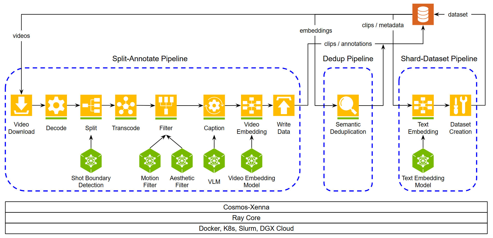

*그림 13. Cosmos Curator의 공식 파이프라인 그림. 영상을 장면 단위로 쪼개고 → 품질을 걸러 → 글 설명을 붙이고 → 임베딩을 만들어 저장하며 → 중복을 없앤다. 출처: [nvidia-cosmos/cosmos-curate](https://github.com/nvidia-cosmos/cosmos-curate) `docs/assets/cosmos-curator-pipelines.png`, Apache-2.0. 원본 크기.*

- **핵심 기술 2 — 자동 라벨링**
  - 정의: 클라우드의 큰 모델이 영상에 정답(3D 박스·차선·궤적)을 자동으로 붙이는 것.
  - 원리: 정답을 소급해서 붙임. 차 안 모델은 현재 프레임까지만 보고 작은 모델로 빨리 답해야 하지만, 클라우드의 라벨러는 미래 프레임을 볼 수 있고, 여러 차의 주행을 합칠 수 있고, 훨씬 큰 모델을 쓸 수 있음.
  - 효과: "3초 뒤에 확실히 보인 그 사람"을 첫 프레임부터 거꾸로 라벨링할 수 있음. 콘 작업자 사례가 딱 이 경우임.
  - 사례와 도구: 세 가지.

| 주체·도구 | 방식 | 근거 |
|---|---|---|
| Tesla(AI Day 2022) | 여러 주행을 합쳐 3D + 시간으로 재구성한 뒤 차선·객체 라벨을 자동 생성. 1만 주행 기준 "수작업 500만 시간 → 클러스터 12시간" 주장 | [보도·미확인] ([요약](https://www.nocode.ai/recap-tesla-ai-day-2022/)) |
| Waymo(CVPR 2021) | 라이다 시퀀스 전체로 만든 3D 박스가 사람 라벨과 대등 | [보도] ([arXiv 2103.05073](https://arxiv.org/abs/2103.05073)) |
| 오픈 도구 | Grounding DINO는 글로 지정한 물체의 박스를 그리고, SAM 2는 영상 전체의 물체 윤곽을 따라감 | [원문] ([Grounding DINO](https://raw.githubusercontent.com/IDEA-Research/GroundingDINO/main/README.md), [SAM 2](https://raw.githubusercontent.com/facebookresearch/sam2/main/README.md)) |

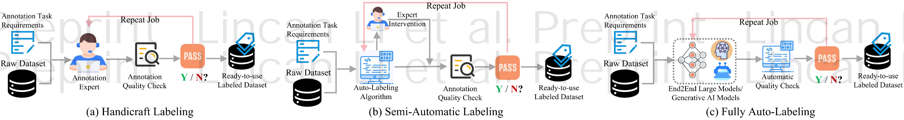

*그림 14. 라벨링 파이프라인의 세 유형. (a) 사람이 라벨링하고 사람이 검사, (b) 알고리즘이 라벨링하고 전문가가 개입, (c) 대형 모델이 라벨링하고 자동 품질 검사. 완전 자동에서도 "통과/재작업" 루프는 남는다. 출처: [Li et al. 2024 서베이 저장소](https://github.com/LincanLi-X/Awesome-Data-Centric-Autonomous-Driving) `img_resource/3-5-Mainstream-AD-Labeling-Pipelines.png`, Apache-2.0. 크기만 줄임.*

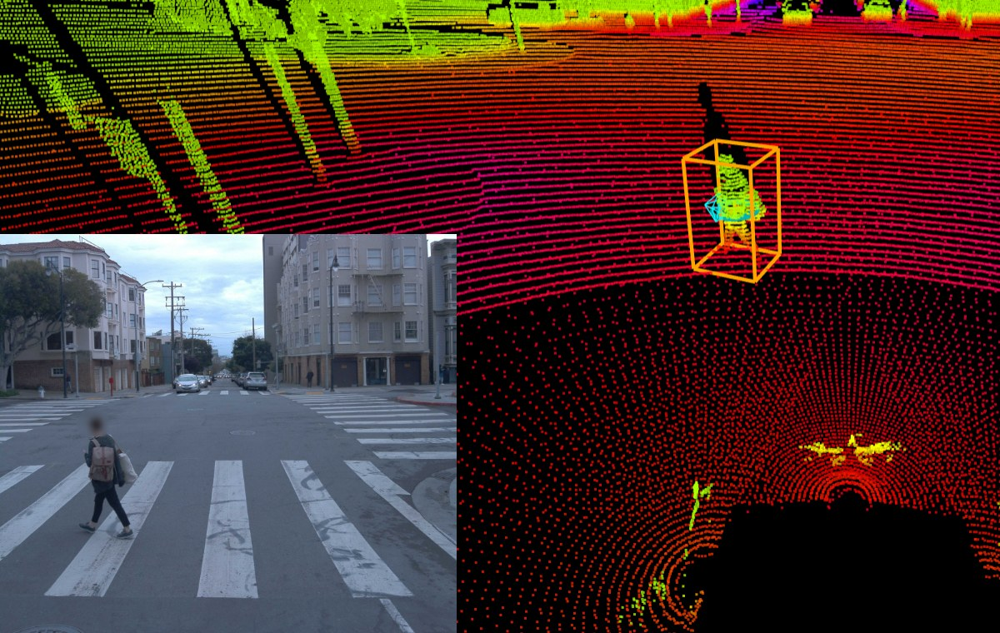

*그림 15. 라이다 포인트클라우드 위에 붙은 보행자 3D 박스(주황)와 같은 순간의 카메라 영상(왼쪽 아래). 클라우드의 자동 라벨러는 이런 3D 박스를 미래 프레임과 여러 주행을 합쳐 첫 프레임부터 만든다. 출처: [waymo-research/waymo-open-dataset](https://github.com/waymo-research/waymo-open-dataset) `docs/images/pedestrian-3D-labeling-example.png`(저장소 Apache-2.0, 데이터 자체는 Waymo Open Dataset 이용약관). JPEG로 변환.*

- **핵심 기술 3 — 사람 검수**
  - 작동: 자동 라벨 뒤에 사람이 일부(업계 관행 약 10%)를 무작위로 검수함 [보도·미확인] ([업계 가이드](https://www.basic.ai/blog-post/how-much-do-data-annotation-services-cost-complete-guide-2025)).
  - 주의: 흔한 물체는 정확도가 높아도 드문 물체는 낮은 "착시"가 있음. 사례처럼 드문 물체는 전수 검수함.
- **사례 적용**
  - 클립을 임베딩해 플릿 전체에서 비슷한 장면을 찾음.
  - 자동 라벨러가 미래 프레임을 합쳐 작업자의 3D 박스를 첫 프레임부터 만듦.
  - 드문 물체이므로 사람이 전수 검수함.
- **참고 자료**: Cosmos Dataset Search·Curator README [원문] · NVIDIA Cosmos 발표 [보도] · Tesla AI Day 2022 요약 [보도] · Waymo 3D 자동 라벨링 논문 [보도] · Grounding DINO·SAM 2 README [원문] · Li et al. 2024 서베이(그림 14) [원문]

> **시사점.** 라벨 비용이 사람 수에서 GPU 시간으로 이동하되 검수 인력은 남음. 드문 물체일수록 검수 비율을 높여야 함.

### 3.3 학습·합성 데이터 (클라우드) — 단계 ⑤

- **필요성**
  - 첫 방법은 모은 장면을 학습에 더 많이 넣는 것(오버샘플링)임. Tesla FSD v14.3 릴리스 노트는 "강화학습 단계를 업그레이드해 어려운 예에 집중"했다고 적음 [보도·미확인] ([릴리스 노트 인용](https://www.notateslaapp.com/software-updates/version/2026.2.9.6/release-notes)).
  - 그러나 "작업자가 콘 뒤에서 나오는" 변형이나 "비가 더 세게 오는" 변형은 플릿에 없음. 그래서 합성 데이터가 필요함.
  - 핵심 기술은 세 가지임. 합성 데이터(없는 장면 만들기), 폐루프 학습(실수의 결과를 겪으며 배우기), 교사-학생 증류(큰 모델로 배우고 작은 모델을 싣기).
- **핵심 기술 1 — 합성 데이터의 세 갈래**

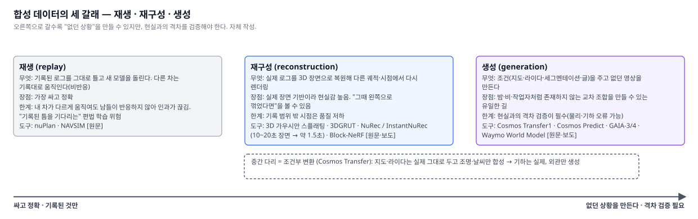

*그림 16. 재생·재구성·생성. 오른쪽으로 갈수록 "없던 상황"을 만들 수 있지만 현실과의 격차를 검증해야 한다. 자체 작성.*

| 갈래 | 방식 | 장점·한계 | 대표 도구 |
|---|---|---|---|
| 재생(replay) | 기록된 로그를 그대로 틀고 새 모델을 돌림. 다른 차들은 기록대로만 움직임 | 가장 싸고 정확하지만, 내 차가 다르게 움직여도 남들이 반응하지 않음 [보도] ([분석](https://arxiv.org/pdf/2510.14677)) | nuPlan, NAVSIM [원문] |
| 재구성(reconstruction) | 실제 로그를 3D 장면으로 복원해 다른 궤적·시점에서 다시 그림 | 실제 장면 기반이라 현실감이 높고 "그때 왼쪽으로 꺾었다면"을 볼 수 있음. 기록 범위 밖은 품질 저하 | 3D 가우시안 스플래팅 [원문] ([README](https://raw.githubusercontent.com/graphdeco-inria/gaussian-splatting/main/README.md)), NVIDIA InstantNuRec(10~20초 장면을 약 1.5초에 재구성) [원문] ([README](https://raw.githubusercontent.com/NVIDIA/instant-nurec/main/README.md)), Waymo Block-NeRF [보도] ([arXiv 2202.05263](https://arxiv.org/pdf/2202.05263)) |
| 생성(generation) | 조건(지도·라이다·날씨)을 주고 없던 영상을 만듦 | 존재하지 않는 조합을 만들 수 있는 유일한 길. 현실과의 격차 검증이 필수 | NVIDIA Cosmos Transfer(기하는 그대로 두고 날씨·조명만 변경) [원문] ([README](https://raw.githubusercontent.com/nvidia-cosmos/cosmos-transfer1/main/README.md)), Wayve GAIA-3 [보도] ([Wayve](https://wayve.ai/thinking/gaia-3/)), Waymo World Model [보도] ([Waymo 블로그](https://waymo.com/blog/2026/02/the-waymo-world-model-a-new-frontier-for-autonomous-driving-simulation/)) |

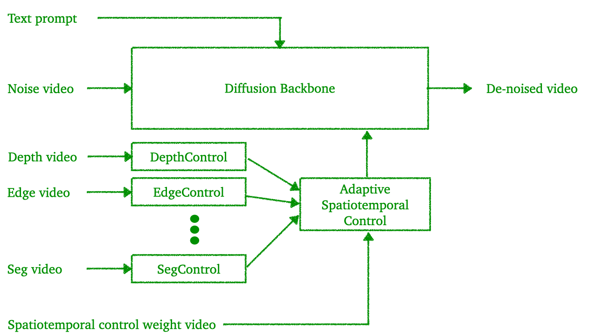

*그림 17. Cosmos Transfer1의 공식 구조도. 깊이·윤곽·영역 구분 영상을 조건으로 넣으면 그 기하를 유지한 채 외관(날씨·조명)만 새로 그린다. 출처: [nvidia-cosmos/cosmos-transfer1](https://github.com/nvidia-cosmos/cosmos-transfer1) `assets/transfer1_diagram.png`, Apache-2.0. 원본 크기.*

- **핵심 기술 2 — 폐루프 학습**
  - 문제: 기록을 흉내 내는 학습(모방학습)만 하면 모델은 자기 실수의 결과를 겪어 보지 못함.
  - 정의: 시뮬레이터 안에서 모델이 직접 운전하고 그 결과(충돌·이탈)로 배우는 강화학습. 시뮬레이터 자체를 학습된 월드모델로 만들면 "학습된 시뮬레이터"가 됨.
  - 사례: 두 가지.

| 사례 | 내용 | 근거 |
|---|---|---|
| NVIDIA AlpaGym | 시뮬레이터(AlpaSim) 안에서 정책을 폐루프로 돌리고 채점해 학습하는 오픈 프레임워크. "초기 개발 단계" | [원문] ([README](https://raw.githubusercontent.com/NVlabs/alpagym/main/README.md)) |
| comma.ai openpilot 0.11 | 2026년 3월 "학습된 시뮬레이터로 전량 학습한" 주행 모델을 실제 사용자에게 배포. 월드모델은 2B 파라미터·주행 영상 250만 분으로 학습 | [원문] ([RELEASES.md](https://raw.githubusercontent.com/commaai/openpilot/master/RELEASES.md)); 2B·250만 분은 [보도] |

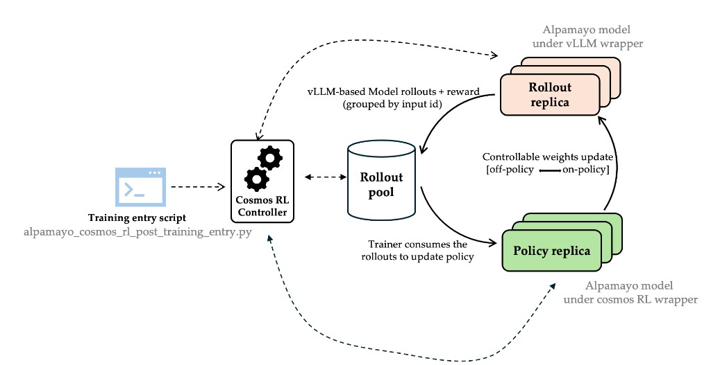

*그림 18. NVIDIA가 공개한 Alpamayo 강화학습 레시피의 구조도. 한쪽에서 주행을 생성해 점수와 함께 모아 두고, 다른 쪽에서 그것으로 모델을 갱신하며, 갱신된 모델이 다시 주행을 생성한다. 출처: [NVlabs/alpamayo-recipes](https://github.com/NVlabs/alpamayo-recipes) `recipes/alpamayo1_x_rl/assets/alpamayo_rl_framework.png`, Apache-2.0. 원본 크기.*

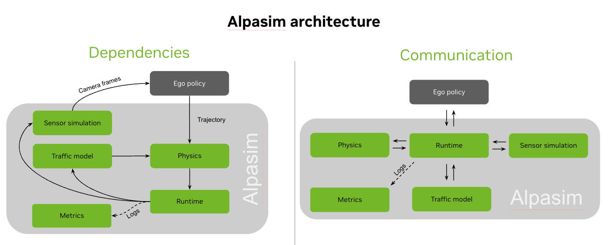

*그림 19. NVIDIA AlpaSim의 구조. 센서 시뮬레이션 → 정책 → 궤적 → 물리 → 평가가 분리되어 각각 다른 GPU에서 돈다. 출처: [NVlabs/alpasim](https://github.com/NVlabs/alpasim) `docs/assets/images/alpasim-architecture.png`, Apache-2.0.*

- **핵심 기술 3 — 교사-학생 증류**
  - 정의: 클라우드에서 크기 제한 없는 "교사" 모델을 학습시키고, 차에는 실시간으로 돌 만큼 작은 "학생" 모델을 실음. 학생은 교사의 출력을 따라 배움.
  - 사례: Waymo는 하나의 파운데이션 모델이 운전자·시뮬레이터·평가자의 교사 역할을 하고, 증류한 학생 모델이 차에 실린다고 설명함 [보도] ([Waymo 블로그 2025-12](https://waymo.com/blog/2025/12/demonstrably-safe-ai-for-autonomous-driving/)).
- **사례 적용**
  - 회수한 클립을 더 많이 학습에 넣음.
  - 원 클립을 재구성해 작업자 위치·속도·조명을 바꾼 변형을 만들고, 생성 모델로 "콘 뒤에서 작업자가 나오는" 조합을 만듦.
  - 재구성 장면 안에서 모델을 굴려 "더 일찍 감속"에 보상을 주고, 그 결과를 차에 실을 학생 모델에 증류함.
- **참고 자료**: 3D 가우시안 스플래팅·InstantNuRec·Cosmos Transfer README [원문] · Block-NeRF 논문 [보도] · Wayve GAIA-3 [보도] · Waymo World Model 블로그 [보도] · AlpaGym README [원문] · openpilot RELEASES.md [원문] · Waymo "Demonstrably Safe AI" 블로그 [보도] · 재생 평가의 한계 분석(arXiv 2510.14677) [보도]

> **시사점.** 재생 → 재구성 → 생성으로 갈수록 "없던 상황"을 만들 수 있지만 현실과의 격차 검증 부담이 커짐(5.3절). 교사-학생 증류는 클라우드의 큰 모델과 차 안의 작은 모델을 잇는 다리임.

### 3.4 검증·배포 — 단계 ⑥⑦⑧

- **필요성**
  - 가장 단순한 평가는 "기록된 궤적과 얼마나 가까운가"(개루프)임.
  - 그런데 사례의 기록 궤적은 "늦게 본 운전자"의 궤적이므로, 그것과 가까울수록 좋은 점수를 준다면 늦게 보는 모델이 이김.
  - 따라서 검증은 한 점수가 아니라 사다리처럼 올라가고, 각 단은 이전 단이 못 보던 것을 봄. 핵심 기술은 검증 사다리와, 그 마지막 단을 규제 절차로 만드는 안전 케이스임.

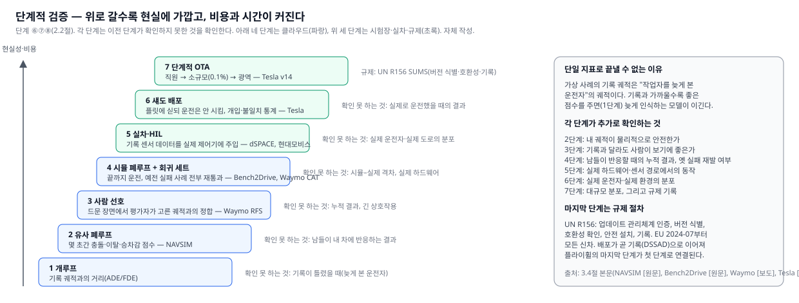

*그림 20. 검증 사다리. 위로 갈수록 현실에 가깝고 비용이 커지며, 각 단은 이전 단이 못 보던 것을 본다. 마지막 단(OTA)은 규제 절차다. 자체 작성.*

- **핵심 기술 1 — 검증 사다리**

| 단 | 검증 항목 | 대표 도구·사례 |
|---|---|---|
| 개루프 | 기록 궤적과의 거리 | ADE/FDE 같은 거리 지표 |
| 유사 폐루프 | 몇 초간 시뮬에서 충돌·차선 이탈·승차감을 점수화 | NAVSIM [원문] ([metrics.md](https://raw.githubusercontent.com/autonomousvision/navsim/main/docs/metrics.md)) |
| 사람 선호 | 드문 장면에서 사람 평가자가 고른 궤적과의 정합 | Waymo WOD-E2E [보도] ([arXiv 2510.26125](https://arxiv.org/abs/2510.26125)) |
| 시뮬 폐루프 | 시뮬레이터 안에서 끝까지 운전 | Bench2Drive [원문] ([README](https://raw.githubusercontent.com/Thinklab-SJTU/Bench2Drive/main/README.md)), 재구성·생성 시뮬 |
| 회귀 세트 | 예전 실패 사례를 전부 다시 통과하는지 확인 | Waymo는 사고 시나리오의 상대 차량 위치·속도를 조금씩 바꿔 가며 시험 [보도] ([Waymo CAT](https://waymo.com/blog/2022/12/waymos-collision-avoidance-testing/)) |
| 실차(HIL) | 기록한 센서 데이터를 실제 제어기에 주입 | dSPACE [보도], 현대모비스 시뮬레이터 60대 계획 [보도·미확인] ([PR Newswire](https://www.prnewswire.com/news-releases/hyundai-mobis-develops-data-driven-validation-system-to-dramatically-cut-testing-time-for-sdvs-302745490.html)) |
| 섀도 배포 | 새 모델을 운전시키지 않고 플릿에 실어 개입·불일치 통계 수집 | Tesla [보도] |
| 단계적 OTA | 직원 → 소규모 → 광역 | Tesla v14는 플릿 0.1% 미만에서 시작 [보도·미확인] |

- **핵심 기술 2 — 안전 케이스와 규제 절차**
  - UN R156: 소프트웨어 업데이트 관리체계(SUMS)를 인증 조건으로 요구. 버전마다 식별 번호를 붙이고, 대상 차량과 맞는지 확인하고, 안전하게 설치하고, 기록을 남겨야 함. EU는 2024년 7월부터 모든 신차에 적용 [보도] ([UL 해설](https://www.ul.com/sis/insights/software-update-management-systems-according-unece-r156)).
  - UL 4600(안전 케이스 표준): 분석·시뮬레이션·시험장·공도 시험을 조합해 안전을 논증하고, 업데이트마다 논증을 갱신하라고 함 [보도].
  - 연결: 배포가 곧 기록(DSSAD)으로 이어지므로 플라이휠의 마지막 단계는 자동으로 첫 단계에 연결됨.
- **사례 적용**
  - 원 클립과 변형들을 폐루프 점수와 사람 선호로 채점하고, 원 클립을 영구 회귀 세트에 넣음.
  - 섀도로 배포해 같은 조건에서 개입률이 떨어지는지 확인한 뒤 0.1% → 10% → 광역으로 내보냄.
  - 새 모델이 다음 실패를 만들면 다시 3.1절임.
- **참고 자료**: NAVSIM metrics [원문] · Bench2Drive README [원문] · Waymo WOD-E2E 논문 [보도] · Waymo 충돌 회피 테스트 블로그 [보도] · 현대모비스 검증 체계 보도 [보도] · UN R156 해설(UL) [보도]

> **시사점.** 검증은 사다리이고, 마지막 단(OTA)은 규제 프로세스이므로 개발 파이프라인과 인증 산출물을 함께 설계해야 함.

### 3.5 단계별 처리량 — 공개된 숫자

| 단계 | 수치 | 근거 |
|---|---|---|
| ①② 차 → 클라우드 | Tesla 트리거 221개, 약 10초 클립, 첫 데이터셋 약 100만 클립·1.5PB(2021) | [보도·미확인] |
| ③ 큐레이션 | Cosmos Curator 2,000만 시간을 14일(Blackwell) | [보도] |
| ④ 자동 라벨링 | Tesla 1만 주행: 수작업 500만 시간 → 12시간(2022) | [보도·미확인] |
| ⑤ 재구성 | NVIDIA InstantNuRec 10~20초 장면 → 약 1.5초 | [원문] |
| ⑥ 시뮬 검증 | Waymo 하루 1,000만 마일(2018), 누적 100억 마일(2019) | [보도] |
| ⑦ HIL | 현대모비스 60대 연결 시 주당 1만 시간(계획) | [보도·미확인] |
| ⑧ 배포 | Tesla 포인트 릴리스 1~2주 간격, 초기 롤아웃 0.1% 미만 | [보도] |

- **미공개 항목**: "트리거에서 배포까지 몇 주"라는 한 바퀴 소요 시간은 어느 회사도 공개하지 않음 [미확인].

> **시사점.** 단계별 처리량은 공개돼 있으나 한 바퀴의 소요 시간은 어디에도 없음. 자사 플라이휠을 설계할 때는 이 "한 바퀴 시간"을 핵심 지표로 직접 재야 함.

---

## 4. 기업별 데이터 플라이휠 전략과 최근 산업 동향

> **개요.** 회사마다 플라이휠이 실제로 어떻게 도는지를 2.2절의 9단계에 대고 뜯어봄. 각 회사에 대해 데이터가 어디서 생겨 어느 단계까지 누가 처리하고, 어떤 단계를 남에게 맡기며, 무엇이 되어 돌아오는지를 표로 정리하고(4.2~4.7), 회사들을 가로질러 보이는 공통점과 차이를 정리함(4.8). 2025~2026 동향은 연표로 붙임(4.9).
>
> **핵심 결론.** ① 어느 회사도 9단계를 전부 남에게 맡기지 않음. 온보드 선별(①)·학습(⑤)·배포 책임(⑧)은 예외 없이 자체로 쥐고, 검색·라벨링·시뮬 도구(③④⑥)는 사거나 열어 씀. ② 차이는 "데이터가 누구 차에서 생겨 누구에게 돌아가는가"에서 갈림. 자기 양산차(Tesla·XPeng·현대차 계획), 자기 로보택시(Waymo·Baidu), 남의 양산차에서 공급자에게 회수(Momenta·Mobileye), 지역별로 갈라진 회수(Mercedes·BMW)의 네 갈래가 있고, 데이터 주권 규제가 회수 경로를 국경 안으로 자름. ③ 2026년의 공통 이동은 시뮬레이션(⑥)을 월드모델로 바꾸고 그 월드모델 안에서 학습(⑤)까지 하려는 것임. ④ 이 장의 수치는 대부분 기업 발표이므로 "공개 주장"으로 읽어야 함.

### 4.1 분석 틀 — 9단계 담당 주체

- **표 읽는 법**: 2.2절의 9단계(① 온보드 선별 ② 업로드·저장 ③ 검색·큐레이션 ④ 라벨링 ⑤ 학습 ⑥ 시뮬레이션 검증 ⑦ 실차 검증 ⑧ 안전 관문·OTA ⑨ 다시 ①)에 대해, 각 회사가 그 단계를 **자체**(●)로 하는지, **외부 도구·파트너**(○)에 맡기는지, **둘을 섞는지**(◐), **공개 자료로 확인되지 않는지**(?)를 표시함. "?"는 "안 한다"가 아니라 "밝히지 않았다"임.

| 기업 | 데이터 원천(플릿) | ① 온보드 선별 | ② 업로드·저장 | ③ 검색·큐레이션 | ④ 라벨링 | ⑤ 학습 | ⑥ 시뮬 검증 | ⑦ 실차 검증 | ⑧ 안전 관문·OTA |
|---|---|---|---|---|---|---|---|---|---|
| Tesla | 자기 양산차(FSD 140억 마일) | ● 트리거·섀도 | ● | ● | ● 자동 라벨링 | ● Cortex | ● 비공개 | ● 섀도·직원 플릿 | ● 주 단위 OTA |
| Waymo | 자기 로보택시(무인 2.2억 마일) | ● | ● | ● 데이터 마이닝·능동학습 | ◐ 자동+사람 | ● Foundation Model | ● Carcraft·World Model | ● 트랙+실도로 | ● 도시 단위 |
| 현대차그룹(42dot) | 테스트 차량 → 2026년 말 국내 양산차 | ● Hard Example Mining | ? | ? | ? | ● Continuous Training | ◐ 3D 재구성 + 모비스 HIL | ● | ◐ NVIDIA 트랙 / Atria 트랙 |
| Momenta | 남의 양산차(24 OEM·100만 대) | ● | ● OEM → Momenta 회수 | ● | ● | ● R6/R7 | ● 월드모델 | ○ OEM 프로그램 | ○ OEM 단위 |
| Mobileye | 남의 양산차(800만 대) | ● 의미 정보만 추출 | ● km당 10KB | ● | ● | ● | ● True Redundancy(주장) | ○ OEM | ○ OEM 단위 |
| Wayve | 자체 시험 플릿 + 파트너(Nissan) | ● | ● | ? | ? | ● GAIA 안에서 | ● GAIA-3/4 | ◐ | ○ 파트너 단위 |
| XPeng | 자기 양산차(1억 클립) | ● | ● | ● | ● | ● | ● X-World | ● | ● |
| Baidu Apollo Go | 자기 로보택시(2,300만 회 탑승) | ● | ● 탈민감화 | ● | ● | ● ADFM | ● OpenX 시나리오 | ● | ● |
| comma.ai | 사용자 양산차(3억 마일) | ● 요약본 우선 업로드 | ● 서버 지목 시 원본 | ? | ? | ● | ● 학습된 시뮬레이터 | ● 사용자 플릿 | ● 약 2개월 |
| NVIDIA(플랫폼) | 자기 플릿 없음(Uber 10만 대 계획) | ○ DRIVE 칩·Hyperion 센서 세트 제공 | — | ● Cosmos Curator·Dataset Search | ● Cosmos Reason·Alpamayo | ● Alpamayo·Cosmos-RL | ● NuRec·Transfer·AlpaSim | — | — |

- **근거**: 각 칸의 근거는 4.2~4.7절의 회사별 표에 적음. Tesla·Waymo·Momenta·Mobileye·XPeng·Baidu는 [보도](회사 발표·보도), comma.ai·NVIDIA는 [원문](저장소 원문), 현대차그룹은 [보도](2026-09 미디어데이 보도).

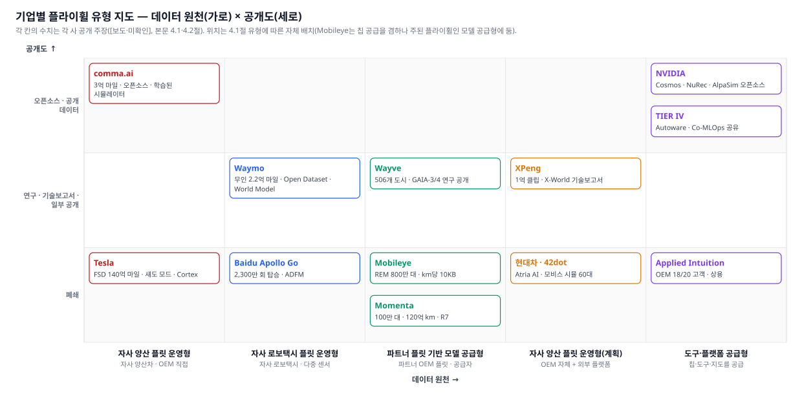

*그림 21. 데이터 원천(가로)과 공개도(세로)로 본 기업 지도. 4.1절 표의 "데이터 원천" 열을 그림으로 옮긴 것이다. 자체 작성. 수치는 각 사 공개 주장.*

### 4.2 Tesla — 양산 플릿 기반 전 단계 자체 운영

| 단계 | 운영 방식 | 근거 |
|---|---|---|
| ① 온보드 선별 | FSD를 켜지 않은 차에서도 백그라운드 판단을 실제 운전과 비교하는 섀도 모드. 2021년 기준 트리거 221개 | [보도] ([Karpathy CVPR'21 요약](https://dynamicallytyped.com/stories/2021/karpathy-autopilot-cvpr/)) |
| ② 업로드·저장 | 약 10초 클립 업로드. 2021년 첫 데이터셋 100만 클립·1.5PB, 2026년 FSD 누적 140억 마일 | [보도·미확인] ([Electrek](https://electrek.co/2026/05/03/tesla-fsd-10-billion-miles-no-magical-milestone-autonomy/)) |
| ③④ 검색·라벨링 | 여러 차의 주행을 합쳐 4D(3D + 시간)로 재구성한 뒤 자동 라벨링. 1만 주행 기준 "수작업 500만 시간 → 12시간" 주장. 2022년 자체 라벨팀 감원 | [보도·미확인] |
| ⑤ 학습 | 학습 클러스터 Cortex(2026년 1분기 "H100 상당 10만 장 이상", Cortex 2 추가). v14.3 릴리스 노트에 "강화학습 단계" 명시 | [보도·미확인] ([TechCrunch](https://techcrunch.com/2026/04/22/tesla-just-increased-its-capex-to-25b-heres-where-the-money-is-going/)) |
| ⑥ 시뮬 검증 | 비공개. 2026년 보도는 "실도로 데이터 → 자동 라벨링 → 신경망 시뮬레이터 → 강화학습 → 새 모델 → 플릿 검증" 루프를 전함 | [보도·미확인] ([Not a Tesla App](https://www.notateslaapp.com/news/2455/how-tesla-will-automate-data-labeling-for-fsd)) |
| ⑦⑧ 실차·배포 | 여러 라운드 섀도 후 활성화 → 플릿 0.1% 미만 → 약 10% → 광역. 대형 버전 약 10개월(v13 → v14), 포인트 릴리스 1~2주 | [보도·미확인] |

- **구조 특징**
  - 플릿이 ①·②·⑦을 동시에 맡음. 같은 양산차가 데이터 수집기이자 섀도 검증 장치이자 단계적 배포 대상임. 로보택시형과 가장 다른 점.
  - 라이다가 없으므로 정답(④)을 카메라 다중 주행 재구성으로 만들어야 함. 자동 라벨링에 GPU 4,000장을 따로 둔 이유(2022) [보도·미확인].
  - 데이터 주권이 플라이휠을 둘로 쪼갬. 중국 도로 데이터를 미국으로 못 보내 상하이 데이터센터와 중국 내 학습 인프라를 따로 두었고, 중국 당국의 데이터 안전 검사를 외자 기업 최초로 통과함 [보도] ([Electrek 2026-02](https://electrek.co/2026/02/06/tesla-ai-training-capability-china-critical-step-full-self-driving/), [이투데이](https://www.etoday.co.kr/news/view/2355045)).
  - 한계: 충돌 집계 방식이 정부 데이터와 달라 안전 통계의 독립 검증이 없음 [보도·미확인]. 데이터·시뮬레이터·모델이 모두 비공개.

### 4.3 Waymo — 단일 파운데이션 모델로 운전·시뮬레이션·평가를 통합

| 단계 | 운영 방식 | 근거 |
|---|---|---|
| ①② 수집·저장 | 로보택시 플릿(2026년 3월 무인 누적 2억 2,060만 마일, 주 400만 마일 이상)의 카메라·라이다·레이더 로그 | [보도] ([Waymo](https://waymo.com/safety/impact/)) |
| ③ 검색·큐레이션 | "ML Factory" 슬라이드(그림 9): 센서 로그 → 데이터 마이닝·능동학습으로 선별 | [보도] |
| ④ 라벨링 | 라이다 시퀀스 전체를 쓰는 3D 자동 라벨링(CVPR 2021)이 사람 라벨과 대등. 초기 사람 라벨링에서 자동 라벨링으로 이동 | [보도] ([Scale 블로그](https://learn.scale.com/public/blogs/how-ml-waymo-building-scalable-autonomous-driver-dmitri-dolgov)) |
| ⑤ 학습 | Waymo Foundation Model(Gemini 계열 기반)을 크기 제한 없는 "교사"로 학습시키고, 차에 실을 "학생" 모델로 증류 | [보도] ([Waymo 블로그 2025-12](https://waymo.com/blog/2025/12/demonstrably-safe-ai-for-autonomous-driving/)) |
| ⑥ 시뮬 검증 | 같은 파운데이션 모델이 시뮬레이터(Genie 3 기반 Waymo World Model, 카메라·라이다 동시 생성)와 평가자(Critic)의 바탕. Carcraft 하루 800만~1,000만 마일, 새 소프트웨어마다 전체 시나리오 재실행, 사고 시나리오 fuzzing | [보도] |
| ⑦⑧ 실차·배포 | 테스트 트랙 + 실도로 → 도시 단위 롤아웃. 플릿 통계를 안전 허브와 동료 심사 논문으로 공개(중상·사망 충돌 94% 감소 등) | [보도] |

- **구조 특징**
  - "운전자·시뮬레이터·평가자가 같은 모델"이라는 설계. 한 모델이 좋아지면 ⑤·⑥·⑧의 평가가 함께 좋아지며, Waymo는 이를 "지속적 선순환(flywheel)"이라고 부름 [보도].
  - 플릿은 작지만 센서 밀도가 높음. 라이다가 있어 3D 정답을 만들기 쉽고, 플릿 규모(Tesla의 1/60 수준)는 시뮬레이션(실주행 2,000만 vs 시뮬 200억 마일)으로 보충 [보도].
  - 공개도가 가장 높음. Waymo Open Dataset·WOD-E2E·안전 케이스 백서·안전 허브 [보도]. 2026년 8월 한국 사고·사건 장면을 가명 처리해 국외로 가져가는 절차를 개인정보위에 문의 [보도] ([머니투데이 2026-08](https://www.mt.co.kr/tech/2026/08/25/2026082423164221461)).

### 4.4 현대차그룹 — 그룹 내 분업과 이중 트랙

- **발표 내용(2026-09-11 미디어데이)**: "차량에서 실제 주행 데이터를 확보하고 이를 AI 모델 학습과 검증에 활용한 뒤, 개선된 AI 모델을 다시 차량에 적용해 새로운 데이터를 확보하는 선순환 구조"를 자율주행 전략의 핵심 엔진으로 선언 [보도] ([현대차그룹](https://www.hyundaimotorgroup.com/en/news/hyundai-motor-group-accelerates-autonomous-driving-innovation-with-ai-powered-data-flywheel), [오토일렉트로닉스](https://www.autoelectronics.co.kr/article/articleview.asp?idx=7053), [네이트 뉴스](https://m.news.nate.com/view/20260913n03598)).

| 단계 | 운영 방식(공개된 범위) | 담당 | 근거 |
|---|---|---|---|
| ① 온보드 선별 | Hard Example Mining — 모델이 오인식하거나 판단하기 어려워하는 상황(엣지 케이스)을 자동 선별해 우선 학습. 3.1절의 "모델 점수 트리거"에 해당 | 42dot | [보도] |
| ② 데이터 원천 | (a) Atria AI를 실은 SDV 테스트 차량 — 2026년 9월 서울 도심 비보호 좌회전 등 무개입 주행 시연 (b) 2026년 말부터 국내 양산차에 Atria AI 탑재, 국토부와 전남·광주 "SDV Pace Car" (c) 장기적으로 연 700만 대 판매망 활용 계획 | 42dot·현대차·기아 | [보도] ([한국경제TV](https://www.wowtv.co.kr/NewsCenter/News/Read?articleId=A202609110468), [지피코리아](https://www.gpkorea.com/news/articleView.html?idxno=146619)) |
| ③④ 검색·라벨링 | 공개 자료 없음 | ? | [미확인] |
| ⑤ 학습 | Continuous Training 파이프라인 — 실제 차량 평가에서 발견된 취약점을 새 학습 데이터로 반영해 반복 개선 | 42dot | [보도] |
| ⑥ 시뮬 검증 | 실제 주행 데이터를 3차원 환경으로 재구성해 위험·반복 불가 상황을 가상 재현(3.3절 "재구성"). 현대모비스는 실차 센서 데이터를 시뮬레이터에 통합, 60대 연결 시 "1만 시간 검증을 1주일에"(계획) | 42dot·현대모비스 | [보도·미확인] ([PR Newswire](https://www.prnewswire.com/news-releases/hyundai-mobis-develops-data-driven-validation-system-to-dramatically-cut-testing-time-for-sdvs-302745490.html)) |
| ⑧ 배포 | 이중 트랙 — NVIDIA DRIVE AGX Thor·Hyperion 기반 L2+/L2++ 양산 2028년 상반기, 자체 Atria AI 기반 L2++ 양산 2029년 하반기. L4는 Motional | NVIDIA / 42dot / Motional | [보도] |

- **구조 특징**
  - 단계별로 담당 주체가 다른 "그룹 내 분업". 42dot = 모델·선별, 현대모비스 = 센서·HIL 검증, NVIDIA = 양산 플랫폼·검증 도구, Motional = 로보택시 데이터의 별도 루프. Tesla처럼 한 조직이 9단계를 쥔 구조가 아님.
  - 플라이휠이 두 개 병렬로 돎(NVIDIA 트랙 2028, Atria 트랙 2029). 두 트랙의 데이터가 한 저장소로 합쳐지는지, 라벨링·검색 도구가 자체인지 외부인지는 공개 자료에 없음 [미확인].
  - 출발 시점의 차이. 현재 수집 차량은 테스트 차량 위주이고 양산차 탑재는 2026년 말부터임. 700만 대 판매망은 "잠재력"이지 아직 플릿이 아니며, 국내 원본 영상 학습은 규제 샌드박스 승인에 묶여 있음(5.5절).
  - 비교 대상: Toyota·Woven Arene은 동의 기반 주행 데이터 수집과 가상 검증을 2025년 RAV4부터 적용 [보도]. VW는 Bosch와의 얼라이언스에 약 15억 유로를 쓴 뒤 2026년 7월 조기 종료 [보도] ([electrive](https://www.electrive.com/2026/07/02/vw-confirms-end-of-automated-driving-alliance-with-bosch/)).

### 4.5 Momenta·Mobileye·Wayve — 공급자형의 세 가지 데이터 회수 구조

| 구분 | Momenta | Mobileye | Wayve |
|---|---|---|---|
| 데이터 원천 | 24개 OEM(BMW 중국·아우디·도요타·BYD·포드 등)의 양산차 100만 대 이상 [보도] ([Momenta](https://momenta.cn/en/article/568.html)) | 18개 브랜드·50개 차종·800만 대 이상의 양산 ADAS 차량. 누적 출하 EyeQ 1억 7,000만 개 [보도] ([Mobileye REM](https://www.mobileye.com/technology/rem/), [CES 2026](https://www.mobileye.com/press-kit/mobileye-at-ces-2026/)) | 자체 시험 플릿(영국 → 미국 → 일본)과 파트너(Nissan) [보도] |
| 올리는 것 | 고가치 클립(R6 기준 7,000만 개)과 주행 데이터(30억 → 120억 km) [보도] | 원본 영상 대신 차 안에서 뽑은 의미 정보(차선·표지판·평균 속도)만 km당 약 10KB [보도] | 영상 중심. 영국 데이터만으로 배운 모델에 미국 100시간을 더해 개선, 8주 500시간으로 영국 수준 근접(1.3.2절) [보도] |
| 학습·시뮬(⑤⑥) | R6 "플라이휠 대형 모델"(강화학습 기반 종단간, 2025-08 Buick Electra L7 첫 탑재) [보도] ([Momenta R6](https://www.momenta.cn/en/article/304.html)); R7(2026-04) 사전학습·시뮬·강화학습 3층, 골든 데이터 1억 건 [보도] | 10cm 정확도 "Roadbook" 지도 생성·갱신. 검증은 "True Redundancy"(카메라 계열과 레이더·라이다 계열 독립 운영)로 데이터 양을 줄인다고 주장 [보도] | 월드모델 GAIA가 학습과 검증을 함께 담당. GAIA-3(2025-12, 150억 파라미터) 검증용 외부 제공, GAIA-4(2026-08) AI Driver 인더루프 반사실 시나리오 [보도] ([Wayve](https://wayve.ai/thinking/gaia-4/)) |
| 돌아가는 것(⑧) | OEM 프로그램 단위 모델 배포(세대 연 1회). Momenta가 직접 OTA를 쥐지 않음 [보도] | 지도(Roadbook)가 차량으로 내려감. 모델 배포는 OEM 프로그램 단위 [보도] | Nissan LEAF 기반 로보택시, 2026년 말 도쿄 Uber 파일럿 계획 [보도] |
| 구조 특징 | 플라이휠의 주인은 공급자, 플릿의 주인은 OEM. 상장 서류가 "양산차 → 데이터 → 알고리즘 → 더 많은 양산차" 폐루프를 사업 모델로 명시 [보도] ([Longbridge](https://longbridge.com/en/news/290852250)). 회수 조건은 비공개 [미확인], Mercedes 중국 CLA·BMW 중국 iX3처럼 중국 안에서만 돌아오는 경우가 많음 [보도] | 원본 영상을 올리지 않아 대역폭·개인정보·데이터 주권 문제를 설계로 비켜감. 대신 영상 기반 종단간 학습용 원본은 이 경로로 모이지 않음([미확인] 추정) | 산출물이 "지역별 모델"이 아니라 "일반화된 하나의 모델 + 검증용 월드모델". 단일 모델로 506개 도시 주행, 43%는 현지 데이터 없이(공개 주장) [보도·미확인]. 검증 도구 외판은 4.7절 툴체인과 겹침 |

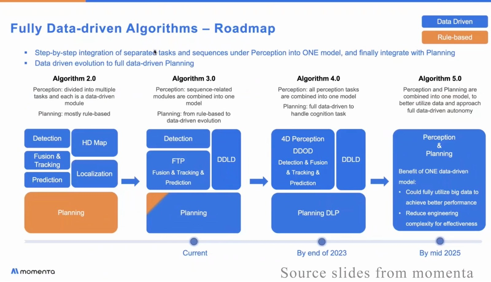

*그림 22. Momenta가 발표한 "완전 데이터 기반 알고리즘 로드맵" 슬라이드. 규칙 기반(주황) 계획을 단계적으로 데이터 기반(파랑) 모듈로 바꾸고, 2025년 중반에 인지와 계획을 한 모델로 합치는 목표를 적었다. 4.8절 "강화학습이 양산으로" 흐름의 출발점이다. 출처: Momenta 발표 슬라이드 화면, [Li et al. 2024 서베이 저장소](https://github.com/LincanLi-X/Awesome-Data-Centric-Autonomous-Driving)에 수록(`img_resource/3-1_momenta_data_driven_planning.png`, 저장소 Apache-2.0). 원 저작권은 Momenta에 있다. 크기만 줄임.*

### 4.6 XPeng·Baidu·comma.ai — 자체형의 극단, 로보택시의 폐쇄루프, 오픈소스의 창

| 기업 | 플라이휠 구조 | 구조 특징 | 근거 |
|---|---|---|---|
| XPeng | 자기 양산차에서 롱테일 클립 약 1억 개 수집 → 학습비 20억 위안 이상 → 생성 월드모델 X-World를 폐루프 시뮬·온라인 강화학습·데이터 합성에 통합 → VLA 2.0(2026-Q1) | OEM이 ①~⑧을 전부 쥔 "Tesla형"의 중국판. 월드모델을 ⑤와 ⑥ 양쪽에 사용 | [보도·미확인] |
| Baidu Apollo Go | 합규 데이터 수집(탈민감화) → 처리·관리 → 라벨링 → 학습·평가 → 시나리오 라이브러리(OpenX 표준)·시뮬 → 배포·OTA(그림 23). 6세대 RT6에 파운데이션 모델 ADFM. 2026년 2분기 완전 무인 탑승 약 100만 회, 누적 2,300만 회 | 수집 단계에 "탈민감화(개인정보 제거)"가 명시된 것이 중국 규제의 반영. 2026년부터 Lyft와 독일·영국 진출 | [보도] ([Baidu 6-K](https://www.sec.gov/Archives/edgar/data/1329099/000119312526110843/d34060dex991.pdf)) |
| comma.ai openpilot | 사용자 2만 명·3억 마일 → 요약본 우선·원본은 서버 지목 시 업로드 → (검색·라벨링 비공개) → 월드모델(2B, 250만 분)로 학습된 시뮬레이터를 만들고 그 안에서 전량 학습(0.11, 2026-03) → 약 2개월 릴리스 → 사용자 플릿 검증 | 플릿형 플라이휠의 진화를 릴리스 노트와 코드로 확인할 수 있는 유일한 창. 2025-08 "MPC → 월드모델 종단간" → 2025-09 "4배 세그먼트" → 2026-03 "학습된 시뮬레이터 전량 학습" → 2026-08 "880M 대형 모델" | [원문] ([RELEASES.md](https://raw.githubusercontent.com/commaai/openpilot/master/RELEASES.md)); 2B·250만 분은 [보도] |

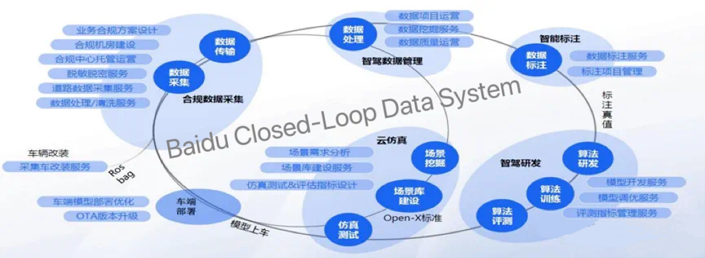

*그림 23. Baidu가 공개한 "Closed-Loop Data System" 그림. 합규 데이터 수집(차량 개조·탈민감화) → 데이터 처리·관리 → 라벨링 → 알고리즘 개발·학습·평가 → 시나리오 라이브러리(OpenX 표준)·시뮬레이션 테스트 → 차량 배포·OTA. 출처: Baidu Apollo 공개 자료, [Li et al. 2024 서베이 저장소](https://github.com/LincanLi-X/Awesome-Data-Centric-Autonomous-Driving)에 수록(`img_resource/3-2-4_Baidu_Close_Loop_Data_System.jpg`, 저장소 Apache-2.0). 원 저작권은 Baidu에 있다. 원본 크기.*

### 4.7 단계별 도구·서비스 공급 기업

- **표 읽는 법**: 자기 플릿 없이 플라이휠의 특정 단계를 도구·서비스로 파는 회사들임. OEM·공급자가 4.1절 표에서 "○"로 표시한 칸을 이들이 채움.

| 회사 | 제공 단계 | 제공 내용 | 근거 |
|---|---|---|---|
| NVIDIA | ①⑧(칩) + ③④⑤⑥(도구) | 차 안: DRIVE AGX Thor 칩·Hyperion 참조 센서 세트. 클라우드: Cosmos Curator(큐레이션·주석) → Cosmos Transfer(희소 시나리오 증폭) → Cosmos Reason/Evaluator(물리 정확성 자동 점수) → OSMO 오케스트레이션의 "Physical AI Data Factory Blueprint"(2026-03). 오픈 자산: Alpamayo(100억 파라미터 VLA, 1,700시간 이상 공개 주행 데이터), Alpamayo 2 Super(340억), AlpaSim·AlpaGym, Omniverse NuRec. Uber·Skild AI 채택, Hyperion 기반 Uber L4 10만 대(2027~) | [보도·원문] ([NVIDIA 뉴스룸](https://nvidianews.nvidia.com/news/nvidia-announces-open-physical-ai-data-factory-blueprint-to-accelerate-robotics-vision-ai-agents-and-autonomous-vehicle-development)) |
| Applied Intuition | ⑥⑦ + 데이터 관리 | 시뮬레이션·테스트 도구. 2025년 6월 기업가치 150억 달러에 6억 달러 조달, 상위 20개 OEM 중 18개가 고객, 시뮬·테스트가 매출의 약 1/3이라는 추정 | [보도·미확인] ([Sacra](https://sacra.com/c/applied-intuition/)) |
| Voxel51 | ③ | 페타바이트급 플릿 로그에서 임베딩·자연어 검색으로 엣지 케이스 발굴, NuRec 연동(FiftyOne 오픈소스) | [보도·원문] |
| Scale AI | ④(사람) | 사람 라벨링(인력 24만 명). 2025년 6월 Meta 143억 달러 투자 뒤 고객 이탈·감원, 자율주행 라벨링 비중은 2022년 이후 축소 | [보도] |
| Bosch Engineering | ④(자동) | 신경망 자동 라벨링으로 3D 박스 비용 최대 70% 절감 주장 | [보도·미확인] ([Bosch](https://www.bosch-engineering.com/stories/neural-automated-labeling/)) |
| Foretellix | ⑥ | 시나리오 커버리지 도구 Foretify. 2025년 10월 NVIDIA DRIVE AV에 통합 | [보도] |
| dSPACE | ⑦ | HIL 재생 시스템(카메라·레이더·라이다·CAN·이더넷 동기 주입) | [보도] |
| TIER IV Co-MLOps | ②③④ 공유 + ⑧(Autoware) | 2024년 출범한 다사 데이터 공유 플랫폼. 2026년 8월 Astemo와 양산급 종단간 모델 공동 개발 MoU. "사람은 요구사항만 정하고 AI 에이전트가 라벨링·정제·학습·평가를 자율 수행" 주장 | [보도·미확인] ([TIER IV](https://tier4.co.jp/en/updates/20260805-tieriv-develops-platform-with-astemo)) |
| 표준·데이터 스페이스 | 단계 사이의 형식 | ASAM OpenSCENARIO DSL 2.2(2026-03)·OpenLABEL·OpenODD; Catena-X 2026년 11월 중국–유럽 간 첫 국경 간 자동차 데이터 생태계 운영 발표 | [보도] |

- **관찰**: 팔리는 단계는 ③④⑥⑦(검색·라벨링·시뮬·HIL)에 몰려 있고, ①⑤⑧(온보드 선별·학습·배포 책임)은 도구로 팔리지 않음. 사람 라벨링(Scale AI)이 줄고 자동 라벨링·큐레이션 도구(NVIDIA·Bosch·Voxel51)가 느는 것이 2022년 이후의 이동임.

### 4.8 기업 간 공통점과 차이

- **공통점**

| # | 공통점 | 근거 사례 |
|---|---|---|
| 1 | **직접 쥐는 단계는 ①·⑤·⑧** — 온보드 선별(무엇을 올릴지), 학습(모델 자체), 배포 책임(규제·안전 케이스)은 어느 회사도 외부에 맡기지 않음. ③④⑥(검색·라벨링·시뮬 도구)은 사거나 열어 씀 | 4.1절 표 전체 |
| 2 | **라벨링(④)은 "사람 외주"에서 "자동 라벨링 + 사람 검수"로 이동** | Tesla 라벨팀 감원(2022), Waymo 자동 라벨링 전환, NVIDIA·Bosch 자동 라벨링 도구, Scale AI 자율주행 비중 축소 [보도] |
| 3 | **시뮬레이션(⑥)이 월드모델로 바뀌고, 그 안에서 학습(⑤)까지 수행** | Waymo World Model(2026-02), Wayve GAIA-4(2026-08), XPeng X-World, Momenta R7, comma 학습된 시뮬레이터(2026-03), NVIDIA Cosmos·AlpaGym [보도·원문]. Waymo·Wayve·comma는 학습과 검증을 같은 월드모델로 수행 |

- **차이(갈림길)**

| # | 갈림길 | 선택지와 결과 |
|---|---|---|
| 1 | **데이터가 누구 차에서 생기나** | 자기 양산차(Tesla·XPeng·comma·현대차 계획): 양이 많고 섀도 검증이 공짜지만 센서가 얇음(카메라 위주). 자기 로보택시(Waymo·Baidu): 센서가 두껍고 3D 정답이 쉽지만 양이 적어 시뮬 비중이 큼. 이 선택이 ④ 라벨 방식과 ⑥ 시뮬 비중을 결정 |
| 2 | **데이터가 누구에게 돌아가나(회수권)** | OEM 자체 회수(Tesla·XPeng·현대차) / 공급자로 회수(Momenta·Mobileye) / 지역별로 갈라진 회수(Mercedes CLA: 중국 Momenta·미국 NVIDIA, BMW iX3: 중국 Momenta·글로벌 Qualcomm) [보도]. 데이터 주권 규제가 회수 경로를 국경 안으로 자름 |
| 3 | **플라이휠의 산출물** | 모델(대부분) / 지도(Mobileye REM) / 검증용 월드모델·도구(Wayve GAIA-3, NVIDIA) / 데이터셋(Waymo WOD-E2E, NVIDIA 1,700시간). 산출물이 다르면 올리는 데이터도 다름 |
| 4 | **한 조직 운영 vs 분업** | Tesla·XPeng은 한 조직이 9단계를 쥐고, 현대차그룹은 42dot·모비스·NVIDIA·Motional 분업에 두 트랙이 병렬. 분업은 전문성을 사 올 수 있지만 단계 사이의 데이터 이동이 병목이 될 수 있음([미확인] 추정, 5.4절) |

- **관찰 — 플릿 규모와 배포 주기**: Tesla 포인트 릴리스 1~2주(140억 마일), comma 약 2개월(3억 마일), Momenta 세대 연 1회(OEM 프로그램), 현대차 2028·2029(플릿 형성 전) [보도]. 플릿이 크면 섀도 검증이 빨리 끝나 배포를 자주 할 수 있다는 해석이 가능하나, 조직·규제 요인도 섞여 있어 인과로 단정할 수 없음 [미확인].

> **시사점.** 회사를 "유형"으로 나누는 것보다 "9단계 중 어디를 쥐고, 데이터가 누구 차에서 생겨 누구에게 돌아가는가"로 보는 편이 차이를 잘 드러냄. 이 기준으로 보면 후발 주자의 선택지는 셋임. 플릿을 빨리 키우거나(양산차 탑재), 센서를 두껍게 하고 시뮬로 보충하거나(로보택시형), 공급자의 플라이휠에 플릿을 빌려주고 모델을 받거나(Momenta형).

### 4.9 2025~2026 동향

| 날짜 | 기업 | 사건 |
|---|---|---|
| 2025-06 | Applied Intuition / Scale AI | 시리즈 F 6억 달러(150억 달러 가치) / Meta 143억 달러 투자 뒤 고객 이탈·감원 [보도] |
| 2025-08 | Momenta·GM | Buick Electra L7에 R6 플라이휠 모델 첫 탑재 [보도] |
| 2025-09-12 | EU | Data Act 적용 개시(차량 데이터 접근 의무) [보도] |
| 2025-10-07 | Tesla | FSD v14 공개(v13 이후 약 10개월) [보도] |
| 2025-10 | NVIDIA·Uber / Foretellix | L4 10만 대 + Cosmos 데이터 팩토리 / DRIVE AV에 Foretify 통합 [보도] |
| 2025-10-30 | Waymo | WOD-E2E 롱테일 데이터셋 논문 [보도] |
| 2025-12 | Wayve | GAIA-3(150억 파라미터) 검증용 공개 [보도] |
| 2026-01-05 | NVIDIA | Alpamayo 오픈 VLA·1,700시간 데이터셋·AlpaSim(CES) [보도] |
| 2026-01-30 | 중국 8개 부처 | 자동차 데이터 국외 이전 보안 가이드라인(2026판) 시행 [보도] |
| 2026-01 | 한국 개인정보위 | 자율주행 원본 영상 활용 규제 샌드박스(9개사 신청) [보도] |
| 2026-02-06 | Waymo | Genie 3 기반 Waymo World Model [보도] |
| 2026-03-16 | 현대차·기아·NVIDIA / NHTSA | GTC 파트너십 확대 / 핸들 없는 차량 대상 FMVSS 개정안 [보도] |
| 2026-03-17 | comma.ai | openpilot 0.11, 학습된 시뮬레이터로 학습한 모델 배포 [원문] |
| 2026-04-16 | 현대모비스 | 데이터 기반 SDV 검증 체계(시뮬레이터 60대 확장 계획) [보도] |
| 2026-04-25 | Momenta | R7 월드모델 양산 발표 [보도] |
| 2026-05-07 | EU | AI Act 옴니버스 합의, 차량(부속서 I) 고위험 의무 2028-08-02로 연기 [보도] |
| 2026-06-01 | NVIDIA | Alpamayo 2 Super(340억)·AlpaGym [보도] |
| 2026-07-02 | VW·Bosch | 자율주행 얼라이언스 조기 종료(15억 유로) [보도] |
| 2026-07 | Momenta | 홍콩 상장, 7.5억 달러 [보도] |
| 2026-07-30 | Zoox·NHTSA | 핸들 없는 로보택시 첫 상업 면제(연 2,500대) [보도] |
| 2026-08-05 | TIER IV·Astemo | Co-MLOps 기반 종단간 개발 MoU(2030 상용화) [보도] |
| 2026-08 | Wayve / Tesla | GAIA-4 폐루프 월드모델 / FSD 140억 마일 [보도] |
| 2026-09-13 | 현대차그룹 | AI 데이터 플라이휠 가동 발표(Atria AI, 2028·2029 목표) [보도] |

> **시사점.** 2026년 동향의 무게중심은 세 곳임. 월드모델(Waymo·Wayve·Momenta·NVIDIA), 데이터 주권 규제(중국·한국·EU), 규제 관문의 변화(Zoox 면제·FMVSS 개정·AI Act 연기).

---

## 5. 데이터 플라이휠의 진화, 병목과 해법, 향후 진화 방향

> **개요.** 플라이휠이 2021년의 "데이터 엔진"에서 2026년의 플라이휠로 어떻게 바뀌었는지를 먼저 놓고(5.1), 지금 플라이휠이 막히는 네 곳(데이터 발견·검증·비용·규제)을 정의 → 원인 → 해법과 비용 → 기업 사례 순서로 분석함(5.2~5.5). 마지막으로 다음 5년의 진화 방향을 병목별 해법, 기술 성숙도, 차량 HPC 플랫폼 관점에서 정리함(5.6).
>
> **핵심 결론.** ① 2021년과 2026년의 플라이휠은 단계는 같고 부품이 바뀜. 사람이 짠 트리거 → 임베딩 검색, 사람 라벨링 → 파운데이션 모델 자동 라벨링, 로그 재생 → 3D 재구성과 생성형 월드모델, 모방학습 → 폐루프 강화학습, 연 단위 릴리스 → 주 단위 OTA. ② 병목은 네 곳이며 각각 해법이 있지만 완전한 해법은 없음. 데이터 발견(검색·생성으로도 "모르는 것을 모르는" 영역은 못 잡음), 검증(시뮬레이터 자체를 검증해야 함), 비용(온보드 선별 → 자동 라벨링 → 현지 학습 순), 규제(수집·배포·기록 세 단계를 직접 건드림). ③ 향후 방향은 월드모델 기반 검증의 규제 증거화, 학습된 시뮬레이터 안에서의 학습, 국경 안 데이터 공유, 에이전트형 개발, 파운데이션 모델 라벨링, "증거로서의 로깅"이고, 이 중 온보드에 걸리는 것이 차량 HPC 플랫폼의 설계 조건이 됨.

### 5.1 데이터 플라이휠의 진화 — 2021년 데이터 엔진에서 2026년 플라이휠로

- **세 시기로 나누면**
  - **2010년대 후반 — 데이터셋 한 번, 학습 한 번**: 사람이 규칙을 쓰고, 학습 모델은 인지 일부에만 쓰였으며, 데이터셋은 한 번 모아 사람이 라벨링해 학습함. 1.3절의 네 가지 한계(롱테일·분포 변화·성능 회귀·검증 한계)가 여기서 드러남(이 시기 구분은 이 보고서의 요약이며 별도 출처 없음 [미확인]).
  - **2021년 전후 — 데이터 엔진**: 루프가 생김. 사람이 조건을 코드로 쓴 트리거가 차에서 돌고, 걸린 클립을 올려 오프라인에서 자동 라벨링하고, 재학습해 섀도 모드로 배포함.
  - **2025~2026년 — 플라이휠**: 루프의 모양은 같지만 각 단계의 부품이 큰 모델과 클라우드 시뮬레이션으로 바뀜.
- **2021년 전후의 교과서 = Tesla AI Day 데이터 엔진** [보도] ([CleanTechnica](https://cleantechnica.com/2021/08/27/how-teslas-autopilot-team-refines-an-unfathomable-amount-of-data-is-pretty-cool/), [Electrek](https://electrek.co/2021/12/01/tesla-releases-new-footage-auto-labeling-tool-self-driving/)).
  - 흐름: 사람이 쓴 트리거가 차에서 돎(①) → 걸리면 약 10초 클립 업로드(②) → 오프라인 자동 라벨링(④) → 재학습(⑤) → 섀도 모드로 배포(⑦⑧).
  - 당시 수치: 누적 100만 클립, 60억 개 객체 라벨, 1.5PB, 주당 1만 클립 자동 라벨링.

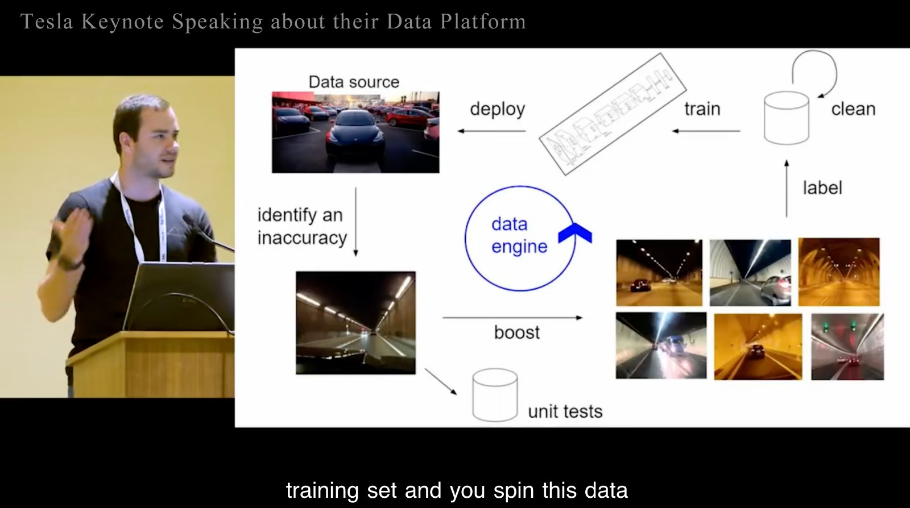

*그림 24. Tesla가 발표한 데이터 엔진 슬라이드. 배포된 플릿(data source)에서 틀린 사례를 찾고(identify an inaccuracy) → 단위 테스트 세트에 넣고 → 비슷한 사례를 플릿에서 모아(boost) → 라벨·정제 → 학습 → 배포를 반복한다("you spin this data engine"). 3장에서 말한 회귀 세트와 유사 장면 회수가 이미 이 초기 발표에 들어 있다(발표 연도는 수록 저장소에 기재 없음 [미확인]). 출처: Tesla 발표 화면(서베이 저장소는 "Tesla AutoPilot Data Platform" 강연으로 표기), [Li et al. 2024 서베이 저장소](https://github.com/LincanLi-X/Awesome-Data-Centric-Autonomous-Driving)에 수록(`img_resource/3-2-1_Tesla_close_loop.png`, 저장소 Apache-2.0). 원 저작권은 Tesla에 있다. 크기만 줄임.*

- **2026년 플라이휠 — 단계는 같고 부품이 바뀜**: 아래 표의 "단계" 열은 2.2절의 번호(①~⑨)이고, 각 행은 그 단계에서 쓰는 부품이 어떻게 바뀌었는지임.

| 2.2절 단계 | 역할 | 2021년 전후 | 2025~2026년 | 변화 |
|---|---|---|---|---|
| ①③ 고칠 상황 찾기 | 플릿이 겪은 수백만 장면 중 모델이 틀린 상황과 그 비슷한 장면을 찾아내는 일 | 사람이 조건을 코드로 쓴 트리거(Tesla 221개)로 차 안에서 걸러 냄 [보도] | **임베딩 검색**: 영상마다 내용을 요약한 숫자 목록(임베딩)을 붙여 두면 뜻이 비슷한 영상은 숫자도 비슷해짐. "비 오는 밤 공사 구간" 같은 글을 같은 방식으로 숫자로 바꿔 가까운 영상을 찾음. NVIDIA Cosmos Dataset Search는 약 800만 영상으로 학습한 영상-텍스트 임베딩 모델(Cosmos-Embed1)을 씀 [보도]; Voxel51 FiftyOne [보도] | 무엇을 찾을지 미리 코드로 정해 두지 않아도 되고, 트리거에 안 걸린 장면도 나중에 찾을 수 있음 |
| ④ 라벨링 | 영상에 정답(물체 위치·차선·궤적)을 붙이는 일 | 사람 라벨링 회사(Scale AI, 인력 24만 명) [보도]; Tesla는 2022년 자체 라벨팀 감원 [보도] | **파운데이션 모델 자동 라벨링**: NVIDIA Cosmos Curator가 "처리·주석·필터·중복 제거"를 맡고 [원문] ([Cosmos README](https://raw.githubusercontent.com/NVIDIA/Cosmos/main/README.md)), Cosmos Reason 같은 시각언어모델이 "왜 이렇게 운전했나"까지 글로 붙임 [보도] | 라벨 비용이 사람 수가 아니라 GPU 시간에 비례 |
| ⑥ 장면 재현 | 기록된 상황을 다시 돌려 새 모델을 시험하는 일 | 로그 재생 + HIL(dSPACE 리플레이 시스템) [보도] | **3D 재구성**: Waymo Block-NeRF는 사진 280만 장으로 샌프란시스코 한 구역(0.5km²)을 35개 신경 모델로 재구성 [보도] ([arXiv 2202.05263](https://arxiv.org/pdf/2202.05263)); NVIDIA NuRec은 3D 가우시안 스플래팅으로 주행 로그를 다시 걸어 다닐 수 있는 3D 장면으로 만듦 [보도] | 기록된 그대로만이 아니라 "그때 왼쪽으로 꺾었다면"을 볼 수 있음 |
| ⑤⑥ 장면 생성 | 겪어 본 적 없는 상황을 만들어 학습·시험에 쓰는 일 | 사람이 시나리오 파일(OpenSCENARIO)을 작성 [보도] | **생성형 월드모델**: Wayve GAIA-3(150억 파라미터, 10배 데이터) [보도] ([Wayve](https://wayve.ai/thinking/gaia-3/)); Waymo World Model(Genie 3 기반) [보도]; NVIDIA Cosmos [보도] | 본 적 없는 상황을 영상으로 만들어 냄 |
| ⑤ 학습 | 모델을 고치는 일 | 기록된 주행을 흉내 내는 모방학습(개루프) | **폐루프 강화학습·학습된 시뮬레이터**: NVIDIA AlpaGym은 시뮬레이터 안에서 정책이 스스로 운전하며 배움 [보도]; openpilot 0.11은 "학습된 시뮬레이터로 전량 학습" [원문] | 모델이 자기 실수의 결과를 겪으며 배움 |
| ⑥ 평가 | 새 모델이 좋아졌는지 재는 일 | 기록 궤적과의 거리(ADE/FDE 같은 규칙 지표) | **사람 선호 지표**: Waymo WOD-E2E의 RFS [보도]; LLM-as-judge(일반 플라이휠) [원문] | "기록과 같은가"에서 "사람이 보기에 좋은가"로 |
| ⑧ 배포 | 새 모델을 차에 내보내는 일 | 연 단위 대형 릴리스(Tesla v13 → v14까지 약 1년) [보도] | **주 단위 OTA**(v14.x는 1~2주 간격) [보도] ([보도](https://www.autopilotreview.com/full-self-driving-update/)) | 루프 한 바퀴가 짧아짐 |

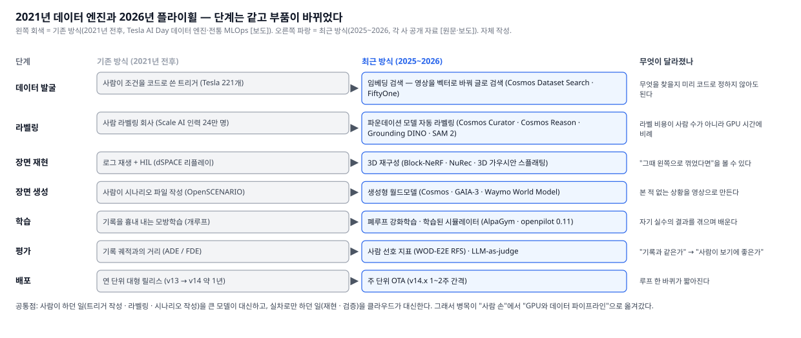

*그림 25. 2021년 데이터 엔진(왼쪽)과 2026년 플라이휠(오른쪽). 단계는 같고 부품이 바뀌었다. 자체 작성.*

- **바뀐 부품들의 공통점**: 사람이 하던 일(트리거 작성, 라벨링, 시나리오 작성)을 큰 모델이 대신하고, 실차로만 하던 일(재현, 검증)을 클라우드가 대신함.
- **그래서 병목이 옮겨감**: 한 바퀴의 병목이 "사람 손"에서 "GPU와 데이터 파이프라인, 그리고 시뮬레이션을 얼마나 믿을 수 있는가"로 이동함. 다음 절부터 그 병목을 하나씩 봄.

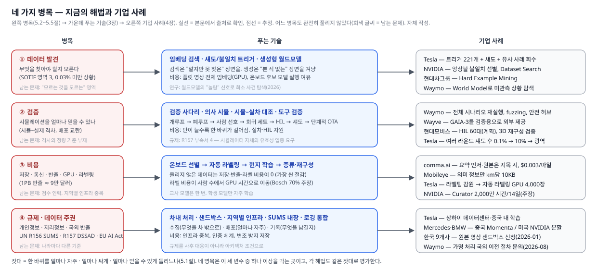

*그림 26. 네 가지 병목(왼쪽)과 지금의 해법(가운데), 기업 사례(오른쪽). 회색 글씨는 해법을 써도 미해결 과제다. 5.2~5.5절의 요약이며 자체 작성.*

> **시사점.** 플라이휠을 평가하는 잣대는 세 변수로 요약됨 — 한 바퀴를 **얼마나 자주**(주기), **얼마나 싸게**(바퀴당 비용), **얼마나 믿을 수 있게**(검증 신뢰도) 돌리느냐. 5.2~5.5의 네 병목은 이 세 변수 중 하나 이상을 막는 곳이고, 각 해법도 이 세 변수로 평가하면 됨.

### 5.2 병목 ① 데이터 발견 — 무엇이 필요한지 모른다

- **정의**: 가장 어려운 데이터는 "아직 본 적 없어서 찾을 줄도 모르는" 데이터임. ISO 21448(SOTIF)은 이를 "모르는 불안전 시나리오(영역 3)"라 부르고, 이 영역을 합리적 노력으로 최대한 줄이는 것을 표준의 핵심으로 둠 [보도] ([TÜV SÜD 백서](https://www.tuvsud.com/-/jssmedia/global/pdf-files/whitepaper-report-e-books/tuvsud-sotif.pdf)).
- **원인**
  - 희소성: Waymo는 수억 마일 플릿에서 발생 빈도 0.03% 미만 상황을 골랐는데 12시간 분량이었음 [보도]. 플릿이 아무리 커도 드문 조합은 몇 번 안 나옴.
  - 트리거의 한계: 트리거는 "미리 정한 조건"이므로, 정하지 않은 상황은 걸리지 않음. 불확실성 기반 능동학습도 초기 라벨 집합에 아예 없는 클래스("unknown unknown")를 잡지 못함 [보도] ([해설](https://lacuna.tiptreesystems.com/work/active-data-discovery-mining-unknown-data-using-submodular-information-measures/wrk_c7958570151368a9e16a1f703eafc370)).
- **해법과 비용**

| 해법 | 대상 | 비용·조건 | 한계 |
|---|---|---|---|
| 임베딩·자연어 검색(3.2절) | "알지만 못 찾은" 장면 — 트리거에 안 걸렸지만 비슷한 장면 | 플릿 영상 전체를 임베딩해 두는 GPU 비용(Cosmos Curator 기준 2,000만 시간에 Blackwell 14일 [보도]) | 검색어를 아는 상황만 찾음 |
| 모델 불일치·섀도 트리거(3.1절) | 현행 모델과 후보 모델(또는 앙상블)이 갈리는 순간 | 온보드에 후보 모델을 같이 돌릴 추론 여유 | 두 모델이 같이 틀리면 못 잡음 |
| 생성형 월드모델(3.3절) | "본 적 없는" 조합 — 플릿이 못 본 상황을 만들어 시험 | 월드모델 학습·추론 비용, 만든 장면의 현실성 검증(5.3절) | 무엇을 만들지는 여전히 사람이 정함 |
| 월드모델의 "놀람" 신호(연구) | "무엇을 모르는지 모르는" 영역 — 예측 월드모델이 다음 장면을 못 맞히는 순간을 희소 사건으로 봄 | 온보드 또는 오프라인에서 예측 모델을 계속 돌려야 함 | 2026년 연구 단계 [보도] ([arXiv 2608.29772](https://arxiv.org/abs/2608.29772)) |

- **기업 사례**

| 기업 | 해결 방식 | 근거 |
|---|---|---|
| Tesla | 트리거 221개 + 섀도 모드 + 틀린 사례를 단위 테스트로 남기고 비슷한 사례를 플릿에서 회수(boost) | [보도] |
| NVIDIA | 모델 앙상블의 불일치로 고른 데이터가 수동 선별보다 야간 보행자 3배·자전거 4.4배 개선(연구); Cosmos Dataset Search로 글 검색 | [보도·원문] |
| 현대차그룹 | Hard Example Mining으로 오인식·판단 곤란 상황을 자동 선별 | [보도] |
| Waymo | World Model의 목적에 "플릿이 직접 관찰한 적 없는 상황 탐색"을 명시; WOD-E2E로 0.03% 미만 상황만 모은 데이터셋 공개 | [보도] |
| Voxel51 | 페타바이트급 플릿 로그에서 임베딩·자연어 검색으로 엣지 케이스를 캐는 도구 | [보도] |

> **시사점.** 검색은 "알지만 못 찾은" 데이터를, 생성은 "본 적 없는" 데이터를 겨냥함. 둘 다 "무엇을 모르는지 모르는" 영역은 못 잡으므로, 월드모델의 놀람 신호 같은 발견 기법이 다음 과제임. 온보드에서 후보 모델을 같이 돌리는 섀도·불일치 트리거는 차량 HPC 자원에 걸림(5.6절).

### 5.3 병목 ② 검증 — 시뮬레이션을 얼마나 믿을 수 있나

- **정의**: 시뮬레이션이 검증의 주 수단이 됐지만(2.3절 차이 5), 시뮬레이션에서 좋은 점수가 도로에서의 안전으로 이어진다는 보장이 없음. 시뮬레이터 자체를 검증해야 하는 문제임.
- **원인**
  - 개루프 점수의 허약함: nuScenes 개루프 평가에서 카메라·라이다 없이 과거 궤적만 외삽해도 최신 모델을 이기는 사례가 보고됨 [보도]. 정적 데이터셋 점수가 도로 안전과 다른 것을 재고 있다는 뜻임.
  - 시뮬–실제 격차: 재구성·생성 장면은 기록 범위 밖에서 품질이 떨어지고, 생성 장면은 물리적으로 그럴듯한지 따로 확인해야 함(3.3절).
  - 배포 교란: Bench2Drive-Robust(2026-05)는 프레임 드롭·GPS 잡음·추론 지연 같은 "배포 교란"이 폐루프 성능을 크게 떨어뜨리는데 기존 이미지 손상 평가로는 잡히지 않는다고 보고함 [보도] ([arXiv 2605.18059](https://arxiv.org/abs/2605.18059)).
- **해법과 비용**

| 해법 | 내용 | 비용·조건 | 근거 |
|---|---|---|---|
| 검증 사다리(3.4절) | 개루프 → 유사 폐루프 → 사람 선호 → 시뮬 폐루프 → 회귀 세트 → HIL → 섀도 → 단계적 OTA. 각 단이 이전 단이 못 보던 것을 봄 | 단이 늘수록 한 바퀴가 길어짐. 어느 단을 생략할지가 설계 문제 | [원문·보도] |
| 의사 시뮬레이션 | NAVSIM v2는 3D 가우시안 스플래팅으로 후속 관측을 합성해 폐루프 시뮬과 상관 0.89를 얻으면서 환경 상호작용을 6배 줄임 | 폐루프 시뮬보다 싸지만 상관 0.89는 "같다"가 아님 | [보도·원문] ([NAVSIM](https://github.com/autonomousvision/navsim/blob/main/README.md)) |
| 시뮬–실차 대조 | 같은 시나리오를 시뮬과 실차(또는 HIL)에서 돌려 결과를 맞춤. Waymo는 사고 재구성 시나리오를 fuzzing하고 기준 모델(NIEON)과 비교 | 실차·HIL 자원. 현대모비스는 시뮬레이터 60대로 "1만 시간을 1주일에"(계획) | [보도·미확인] |
| 도구 검증(규제 요건) | 시뮬레이터가 재현하는 범위·시나리오 유효성·물리 시험과의 상관을 제조사가 입증 | 시뮬레이터 하나마다 검증 문서가 필요 | [보도] |

- **규제는 시뮬레이션 증거를 조건부로 수용**

| 규정 | 내용 | 근거 |
|---|---|---|
| UN R157(자동 차선 유지) 부속서 4 | 시험장·실도로에서 재현하기 어려운 시나리오에 시뮬레이션 사용을 허용하되, 제조사가 도구의 범위·해당 시나리오의 유효성·물리 시험과의 상관을 입증하도록 함 | [보도] ([TÜV SÜD 해설](https://www.tuvsud.com/-/jssmedia/global/pdf-files/whitepaper-report-e-books/tuvsud_virtual-homologation-of-an-alks-according-to-unece-r157.pdf)) |
| EU 완전자동화차량 형식승인 규정 2022/1426 | 시나리오 기반 평가와 가상 시험을 허용하고 "시뮬레이션 기반 시험의 신뢰성 평가" 지침 포함(조문 원문 미확인 [미확인]) | [보도] |
| 미국 | 2026년 AV 프레임워크 갱신·FMVSS 개정안·Zoox 면제로 "규제 장벽 제거" 방향 | [보도] |

- **기업 사례**

| 기업 | 해결 방식 | 근거 |
|---|---|---|
| Waymo | 새 소프트웨어마다 전체 시나리오 재실행 + 사고 시나리오 fuzzing + 기준 모델(NIEON) 대비 회피율 비교 + 플릿 통계(안전 허브)로 시뮬 결과를 실도로 결과와 맞춤 | [보도] |
| Tesla | 여러 라운드 섀도 배포로 시뮬 대신 실제 운전자·환경에서 대조. 플릿 0.1% 미만부터 단계적 확대 | [보도·미확인] |
| Wayve | GAIA-3를 검증용으로 외부에 제공해 시뮬레이터 자체를 검증받는 방향. "합성 테스트 기각률 5배 감소" 주장 | [보도·미확인] |
| 현대차그룹·모비스 | 실주행 데이터를 3D로 재구성해 위험 상황을 재현하고, 모비스 HIL(60대 계획)로 실차 센서 데이터와 대조 | [보도·미확인] |
| NVIDIA | AlpaSim(센서 렌더러·정책·물리·평가 분리)과 Cosmos Evaluator(물리 정확성 자동 점수)로 생성 장면의 현실성을 채점 | [보도·원문] |
| 학계 | 자율주행 테스트 서베이(2025-12)는 "코너 케이스 다양성, 시뮬–실제 격차, 체계적 기준 부재, 파운데이션 모델 테스트 비용"을 미해결로 지목 | [보도] ([arXiv 2512.11887](https://arxiv.org/abs/2512.11887)) |

> **시사점.** 시뮬레이션은 증거가 될 수 있지만, 시뮬레이터 자체를 검증했다는 증거를 함께 내야 함. 월드모델 기반 검증이 규제 증거로 인정받으려면 R157 부속서 4의 "도구 검증" 요건이 관문임(5.6절).

### 5.4 병목 ③ 비용 — 저장·통신·GPU·라벨링

- **정의**: 한 바퀴를 도는 데 드는 돈. 데이터를 올리고(통신), 쌓고(저장), 꺼내고(반출), 정답을 붙이고(라벨링), 학습·시뮬하는(GPU) 비용의 합임.
- **공개된 수치**

| 항목 | 공개된 수치 | 근거 |
|---|---|---|
| 데이터 양 | 개발 차량 1대가 8시간에 200TB 이상, 소규모 시험 플릿이 하루 페타바이트급 | [보도·미확인] ([Introl](https://introl.com/blog/autonomous-vehicle-ai-infrastructure-edge-cloud)) |
| 저장 | "단일 모델 학습에 100~500PB, 장기 저장비 연 1,000만~2,000만 달러 이상"(제3자 투자 자료 인용) | [보도·미확인] |
| 클라우드 반출(egress) | AWS $0.09/GB, Azure $0.087/GB, GCP $0.12/GB(2026). 1PB 반출 ≈ 9만 달러 | [보도] ([CloudZero](https://www.cloudzero.com/blog/s3-pricing/)) |
| 라벨링 | 3D 큐보이드 개당 $0.121부터, 2D 박스 $0.036부터; 교차로 프레임 약 $4.84 vs 고속도로 $0.48(10배) | [보도·미확인] ([업계 가이드](https://www.basic.ai/blog-post/how-much-do-data-annotation-services-cost-complete-guide-2025)) |
| 자동 라벨링 절감 | Bosch "3D 박스당 비용 최대 70% 절감" | [보도·미확인] ([Bosch](https://www.bosch-engineering.com/stories/neural-automated-labeling/)) |
| 학습 인프라 | Tesla 2026 설비투자 250억 달러 이상, XPeng 학습비 20억 위안 이상 | [보도·미확인] |
| 실패 비용 | VW가 Bosch 얼라이언스에 약 15억 유로 투자 후 조기 종료 | [보도] |

- **원인**: 원본 데이터 양이 통신·저장 비용을 밀어 올리고(3.1절), 라벨링은 사람 수에 비례했으며, 클라우드에서 데이터를 꺼낼 때마다 반출비가 붙음. 데이터 주권 규제(5.5절)는 지역별로 인프라를 중복시킴.
- **해법과 절감 순서**

| 순서 | 해법 | 근거·이유 | 근거 |
|---|---|---|---|
| 1 | **온보드 선별**(3.1절) | 올리지 않은 데이터는 저장·반출·라벨링 비용이 모두 0임. 가장 싼 절감 | openpilot 두 단계 업로드 [원문]; Mobileye km당 10KB [보도] |
| 2 | **자동 라벨링**(3.2절) | 라벨링이 사람 수에서 GPU 시간으로 이동. Bosch "3D 박스당 최대 70% 절감" 주장이 맞다면 남는 비용은 검수 인력과 GPU | [보도·미확인] |
| 3 | **반출 최소화·현지 학습** | 1PB 반출 ≈ 9만 달러. 데이터가 있는 곳에서 학습하면 반출비와 규제 비용을 함께 줄임 | [보도] ([CloudZero](https://www.cloudzero.com/blog/s3-pricing/)) |
| 4 | **증류·재구성으로 GPU 효율화** | 교사 모델은 한 번 학습하고 학생만 자주 학습; InstantNuRec은 장면 재구성을 약 1.5초로 줄임 | [원문·보도] |

- **기업 사례**

| 기업 | 해결 방식 | 근거 |
|---|---|---|
| comma.ai | 요약 로그·저화질 영상 우선, 원본은 서버 지목 시. 마일당 $0.003 미만으로 서비스 비용을 맞춤 | [원문·보도] |
| Mobileye | 원본 영상을 올리지 않고 의미 정보만 km당 10KB로 전송 | [보도] |
| Tesla | 2022년 사람 라벨팀 감원 → 자동 라벨링(GPU 4,000장); 중국 데이터는 상하이에서 현지 학습 | [보도·미확인] |
| NVIDIA | Cosmos Curator로 2,000만 시간을 14일에 처리(주장); Cosmos Transfer 증류 모델은 36스텝을 1스텝으로 | [보도·원문] |
| VW·Bosch | 반대 사례: 약 15억 유로 투자 후 조기 종료 — 자체 구축 실패 비용 | [보도] |

> **시사점.** 비용 최적화의 순서는 온보드 선별 → 자동 라벨링 → 반출 최소화(현지 학습)임. 이는 3.1절의 두 단계 업로드와 5.5절의 데이터 주권 대응과 같은 방향이며, 첫 항목은 차량 HPC 플랫폼의 로깅·압축 설계에 걸림(5.6절).

### 5.5 병목 ④ 규제와 데이터 주권

- **정의**: 규제가 플라이휠의 세 단계를 직접 건드림. 수집(개인정보·지리정보·국외 반출), 배포(UN R156 SUMS), 기록(R157 DSSAD·EDR). 2.3절의 차이 4·6이 이 병목임.
- **지역별 규정과 영향**

| 지역 | 규정 | 플라이휠에 미치는 영향 |
|---|---|---|
| EU | GDPR + EDPB 커넥티드카 가이드라인(차량 데이터 대부분을 개인정보로 간주, 차내 처리 권고) [보도]; **Data Act** 2025-09-12 적용, 2026-09-12부터 설계 의무(사용자가 데이터에 직접 접근) [보도] ([Mayer Brown](https://www.mayerbrown.com/en/insights/publications/2025/11/the-eu-data-act-has-taken-effect-focus-on-automotive-and-cloud-providers)); **AI Act** 부속서 I(형식승인 대상 안전 부품의 AI) 의무는 2028-08-02로 12개월 연기 [보도] | 수집 동의·익명화 비용, 제3자 데이터 개방 의무, 안전 부품 AI의 문서화 |
| UNECE(64개 체약국) | **R155**(사이버보안 관리체계)·**R156**(소프트웨어 업데이트 관리체계) — 2024-07부터 신차 전체 [보도]; **R157** DSSAD 기록 의무 [보도] | OTA가 "관리 프로세스"가 됨(RxSWIN·무결성·이력), 로깅이 의무가 됨 |
| 중국 | 2026-01-30 8개 부처 "자동차 데이터 국외 이전 보안 가이드라인(2026판)": 연구개발·자율주행·소프트웨어 업그레이드 시나리오별 중요 데이터 식별, 보안 평가·표준 계약·인증, 로그 3년 보관 [보도] ([China Briefing](https://www.china-briefing.com/news/vehicle-data-export-rules-china/)) | 외국계 OEM은 중국 데이터로 중국 안에서만 학습(Tesla 상하이 데이터센터) |
| 한국 | 2026-01 개인정보위: 규제 샌드박스로 안전 조치 시 자율주행차·로봇의 **원본 영상**(비식별 없이) 활용 허용, 9개사 신청; "자율주행 영상처리장치" 정의, 접근 기록·삭제 의무 신설 [보도] ([머니투데이](https://www.mt.co.kr/tech/2026/01/23/2026012309533977120)) | 얼굴을 가리면 인식 학습이 안 되는 문제를 샌드박스로 풀기 시작 |
| 미국 | 2025-04 AV 프레임워크, 2026-01 AV STEP 철회, 2026-03 FMVSS 개정안, 2026-07 Zoox 면제 [보도] | 배포 장벽 완화, 대신 충돌 보고(SGO) 의무 유지 |

- **병목인 이유**: 얼굴·번호판을 가리면(비식별) 사람·차를 인식하는 학습에 쓸 정보가 사라지고, 국경을 넘지 못하면 지역마다 학습 인프라를 따로 둬야 하며, 업데이트마다 인증 절차가 붙음. 규제를 지키는 방법 자체가 비용(5.4절)이 됨.
- **해법과 비용**

| 해법 | 내용 | 비용·조건 |
|---|---|---|
| 차내 처리·요약 전송 | 원본 영상 대신 차 안에서 뽑은 의미 정보만 올림(EDPB 권고 방향) | 온보드 연산·모델; 영상 기반 학습 데이터는 못 얻음 |
| 규제 샌드박스·법제화 | 안전 조치를 조건으로 원본 영상 학습을 허용받음 | 접근 기록·삭제 의무 등 관리 체계 |
| 지역별 인프라 | 데이터가 있는 나라에 저장·학습 인프라를 둠 | 인프라 중복, 모델 변형 관리 |
| SUMS 프로세스화 | R156 요건(RxSWIN·무결성·호환성·기록)을 배포 파이프라인에 내장 | 인증 체계 구축, 배포 주기 하한 |
| 로깅 통합 | 규제용 기록(DSSAD·EDR)과 개발용 트리거를 한 파이프라인으로 | 변조 방지 저장·시간 동기화 |

- **기업 사례**

| 기업 | 해결 방식 | 근거 |
|---|---|---|
| Tesla | 중국 데이터는 상하이 데이터센터·중국 내 학습 인프라에서만 처리, 데이터 안전 검사 통과(외자 최초) | [보도] |
| Mercedes·BMW | 중국 모델은 Momenta, 미국·글로벌은 NVIDIA·Qualcomm으로 공급 구조를 지역별로 분할 | [보도] |
| Mobileye | 의미 정보만 전송하는 REM으로 개인정보·반출 문제를 설계로 회피 | [보도] |
| Baidu | 폐쇄루프 그림의 수집 단계에 "탈민감화"를 명시 | [보도] |
| 한국 9개사 | 개인정보위 규제 샌드박스로 원본 영상 학습 신청(2026-01) | [보도] |
| Waymo | 한국 사고·사건 장면을 가명 처리해 국외 연구개발에 쓰는 절차를 개인정보위에 문의(2026-08) | [보도] ([머니투데이 2026-08](https://www.mt.co.kr/tech/2026/08/25/2026082423164221461)) |

> **시사점.** 규제는 사후 대응이 아니라 아키텍처 조건임. 수집 단계는 "무엇을 차 밖으로 내보낼지"를, 배포 단계는 "얼마나 자주 바꿀 수 있는지"를, 기록 단계는 "무엇을 남길지"를 정하며, 셋 다 온보드 설계에 걸림(5.6절).

### 5.6 향후 진화 방향

- **읽는 법**: 세 층으로 봄. (a) 기술 방향 여섯 가지와 성숙도, (b) 병목별 향후 5년 전망, (c) 그 가운데 차 안에 걸리는 것 — 차량 HPC 플랫폼 관점.

#### 5.6.1 기술 방향 여섯 가지와 성숙도

| # | 방향 | 변화 내용 | 사례 | 성숙도(2026-09) |
|---|---|---|---|---|
| 1 | **월드모델 기반 검증이 표준이 됨** | 로그 재생·수작업 시나리오 → 월드모델이 만든 반사실 장면으로 시험. 관건은 규제가 그 장면을 증거로 받는가 | Wayve GAIA-4(AI Driver 인더루프), NVIDIA Cosmos Transfer·NuRec, Waymo World Model(라이다 동시 생성), Huawei 클라우드 월드모델, XPeng X-World [보도] | 양산 진입. 규제 증거화는 R157 부속서 4 "도구 검증"이 관문 |
| 2 | **학습된 시뮬레이터 안에서 직접 학습한 모델이 양산차에 실림** | 모방학습 → 시뮬레이터 안 폐루프 강화학습. 시뮬레이터 자체가 학습된 월드모델 | comma 0.11이 첫 공개 사례 [원문], NVIDIA AlpaGym·Momenta R7·Waymo 교사-학생 구조 [보도] | 초기 양산(comma), 나머지는 발표·"초기 개발 단계" |
| 3 | **플릿 간 데이터 공유가 실험 단계를 지남** | 한 회사의 플릿 → 여러 회사·국경 안 데이터 공간 | TIER IV Co-MLOps(택시 회사·Astemo), Catena-X 중–유럽(2026-11), NVIDIA 1,700시간 오픈 데이터, Waymo WOD-E2E [보도] | 실험. 데이터 주권 규제가 오히려 "국경 안 공유"를 밀어 올림 |
| 4 | **에이전트가 플라이휠을 돌림** | 사람은 요구사항만, 라벨링·정제·학습·평가는 AI 에이전트 | TIER IV 주장 [보도·미확인], NVIDIA OSMO(코딩 에이전트 연동으로 재구성·큐레이션 자동화) [보도] | 주장 단계 |
| 5 | **파운데이션 모델이 라벨링을 줄임** | VLM이 차종·치수를 추론해 3D 박스 초깃값을 만들고, VLM을 "라벨 생성기"로 써서 가벼운 검출기를 학습 | NVIDIA Cosmos Reason·Alpamayo 인과 추론 자동 라벨링, Waymo 교사 모델 [보도·원문] | 도구 공개, 검수 인력은 남음 |
| 6 | **로깅이 규제 증거가 됨** | 개발용 트리거와 규제용 기록이 같은 이벤트(개입·전환 요구·최소위험기동)를 찍으므로 한 파이프라인으로 | R157 DSSAD, EU EDR 의무(2024-07), 2022/1426의 L3 이상 데이터 저장, 중국 로그 3년 보관, 한국 접근 기록 의무 [보도] | 이미 의무 |

- **우선순위**: ①②⑤는 기술 성숙도의 문제이고, ③④는 아직 주장 단계이며, ⑥은 이미 의무임. ⑥(로깅 통합) → ①(월드모델 검증) → ②(학습된 시뮬레이터) 순이 합리적임.

#### 5.6.2 병목별 향후 5년 전망

| 병목 | 현재 해법(5.2~5.5) | 향후 5년 전망 | 미해결 과제 |
|---|---|---|---|
| ① 데이터 발견 | 임베딩 검색, 섀도·불일치 트리거, 생성 | 온보드에서 임베딩·소형 VLM을 돌려 "이 장면이 드문가"를 차 안에서 판단(온디바이스 큐레이션); 월드모델의 놀람 신호로 "모르는 것을 모르는" 영역 탐색 [보도·미확인] | 온보드 연산 여유, 놀람 신호의 오탐 |
| ② 검증 | 검증 사다리, 의사 시뮬, 실차 대조 | 월드모델이 규제 증거가 됨(도구 검증 방법의 표준화); 시뮬레이터를 외부에 공개해 검증받는 방식(Wayve GAIA-3) 확산; 배포 교란(지연·프레임 드롭)까지 포함한 벤치마크 | 시뮬–실제 격차의 정량화 기준 부재 [보도] |
| ③ 비용 | 온보드 선별 → 자동 라벨링 → 현지 학습 | 라벨 비용이 GPU 시간으로 완전히 이동; 증류로 학생 모델만 자주 학습; 재구성 시간 초 단위(InstantNuRec) → 재구성 시뮬이 로그 재생만큼 싸짐 | 검수 인력, 지역별 인프라 중복 |
| ④ 규제·주권 | 차내 처리, 샌드박스, 지역별 인프라, SUMS, 로깅 통합 | 샌드박스 → 법제화(한국 "자율주행 영상처리장치" 정의); 국경 안 데이터 공간(Catena-X); 가명 처리 데이터의 국외 이전 기준(Waymo 문의가 선례) | 나라마다 다른 기준, 모델 변형 관리 |

#### 5.6.3 차량 HPC 플랫폼 관점 — 온보드 요구 사항

- **전제**: 9단계 중 ①②⑦⑧⑨는 차 안에서 돎. 위 방향 가운데 온보드에 걸리는 것을 이 보고서의 근거에서 추리면, 지금 필요한 다섯 가지와 앞으로 더해질 세 가지임.

| # | 요구 사항 | 필요 이유 | 근거 |
|---|---|---|---|
| 1 | **섀도 실행 자원** | 현행 모델과 후보 모델을 동시에 돌려야 불일치 트리거(5.2절)와 섀도 검증(5.3절)이 됨 | Tesla 섀도 모드 [보도] |
| 2 | **선별·압축·두 단계 로깅** | 요약 로그 + 저화질 영상 + 원본 지목 업로드는 저장·통신 예산과 온보드 인코더를 전제로 함(5.4절) | openpilot [원문] |
| 3 | **규제 기록의 무결성** | DSSAD·EDR·R156 버전 식별·이력은 변조 방지 저장과 시간 동기화를 요구함(5.5절) | [보도] |
| 4 | **HIL 재생 호환** | 원시 센서·버스 데이터를 실제 ECU에 시간 맞춰 주입하려면 플랫폼의 입력 경로가 재생을 지원해야 함(5.3절) | dSPACE, 현대모비스 [보도] |
| 5 | **OTA 관리 프로세스** | R156의 SUMS·RxSWIN 요건은 업데이트 경로의 설계 조건임(5.5절) | [보도] |
| 6 | (앞으로) **온디바이스 큐레이션 연산** | 임베딩·소형 VLM을 차 안에서 돌려 드문 장면을 차 안에서 고르면 업로드 비용이 더 줄지만, 추론 자원이 더 듦 | [미확인] 추정(5.6.2) |
| 7 | (앞으로) **교사-학생 증류 모델의 실행과 안전 감시** | 학습된 시뮬레이터 안에서 배운 학생 모델이 실차에 실리면, 시뮬–실제 격차를 런타임에서 감시하는 모니터가 필요함 | Waymo 교사-학생 [보도], comma 0.11 [원문], [미확인] 추정 |
| 8 | (앞으로) **지역별 모델·데이터 변형 관리** | 데이터 주권으로 지역마다 다른 모델·로깅 정책이 실리면, 같은 플랫폼에서 변형을 식별·관리해야 함 | Tesla 상하이, Mercedes CLA 분할 [보도], [미확인] 추정 |

> **시사점.** 플라이휠은 클라우드만의 일이 아님. 첫 단계(선별·섀도)와 마지막 단계(OTA·규제 기록)는 차 안에 있고, 향후 방향(온디바이스 큐레이션·증류 모델·지역별 변형)은 온보드 요구를 더 늘림. 차량 HPC 플랫폼이 이 여덟 가지를 지원하지 않으면 플라이휠의 시작과 끝이 막힘.

---

## 부록 A. 용어 풀이

| 용어 | 뜻 |
|---|---|
| **데이터 플라이휠** | 서비스를 쓰면서 나온 데이터로 모델을 고치고, 고친 모델이 더 좋은 데이터를 만드는 반복 구조. 자율주행에서는 "데이터 엔진", "폐쇄루프"라고도 부름 |
| **종단간(end-to-end, E2E)** | 카메라 영상이 들어가면 조향·제동이 바로 나오는 하나의 학습 모델. 중간에 사람이 짠 규칙이 없음 |
| **롱테일(long tail)** | 각각은 드물지만 종류가 무한히 많은 예외 상황. 빈도 그래프의 긴 꼬리 |
| **분포 변화(distribution shift)** | 학습할 때 본 상황의 분포와 실제로 만나는 상황의 분포가 다른 것. 도시·날씨·나라가 바뀌면 생김 |
| **파국적 망각(catastrophic forgetting)** | 새 데이터로 다시 학습한 모델이 예전에 잘하던 것을 잊는 현상 |
| **트리거(trigger)** | 차 안에서 "이 순간의 데이터를 저장·업로드하라"고 판단하는 조건. 규칙, 모델 점수, 사람 버튼이 있음 |
| **섀도 모드(shadow mode)** | 새 모델을 차에 싣되 제어권은 주지 않고, 그 판단을 기록해 현행 모델·운전자와 비교하는 방식 |
| **자동 라벨링(auto-labeling)** | 클라우드의 큰 모델이 미래 프레임과 여러 주행을 합쳐 정답(박스·차선·궤적)을 만드는 것 |
| **임베딩(embedding) / 임베딩 검색** | 영상이나 글의 내용을 요약한 숫자 목록. 뜻이 비슷하면 숫자도 비슷하게 나오도록 학습해 두므로, 글로 검색어를 넣어 숫자가 가까운 영상을 찾을 수 있음 |
| **Hard Example Mining** | 모델이 틀리거나 판단을 어려워한 상황을 자동으로 골라 우선 학습에 쓰는 기법. 현대차그룹이 플라이휠의 선별 기술로 명시함 |
| **교사-학생 증류(distillation)** | 크기 제한 없는 큰 모델(교사)을 먼저 학습시키고, 차에 실을 작은 모델(학생)이 그 출력을 따라 배우게 하는 방법 |
| **SUMS / UN R156** | 소프트웨어 업데이트 관리체계. 제조사가 업데이트 관리 체계를 인증받고, 버전마다 식별 번호(RxSWIN)를 붙이며, 호환성 확인·안전 설치·기록을 요구하는 UN 규정 |
| **재생 / 재구성 / 생성** | 합성 데이터의 세 갈래. 기록을 그대로 틀기 / 기록을 3D로 복원해 다른 시점에서 보기 / 조건을 주고 없던 영상을 만들기 |
| **3D 가우시안 스플래팅(3DGS)** | 장면을 수백만 개의 작은 타원체(가우시안)로 표현해 빠르게 다시 그리는 3D 재구성 기법 |
| **월드모델(world model)** | 지금 장면과 행동을 주면 다음 장면을 예측·생성하는 모델. 시뮬레이터로 쓰임 |
| **개루프 / 폐루프 평가** | 기록 궤적과의 거리만 재기 / 시뮬레이터 안에서 실제로 운전시켜 결과를 재기 |
| **PDMS / RFS** | NAVSIM의 유사 폐루프 점수 / Waymo의 사람 평가자 선호 점수 |
| **HIL(Hardware-in-the-Loop)** | 실제 제어기(ECU)에 기록·합성 센서 데이터를 주입해 시험하는 방법 |
| **OTA(Over-the-Air)** | 무선으로 차량 소프트웨어를 갱신하는 것. UN R156이 관리 방식을 규정함 |
| **DSSAD / EDR** | 자율주행 시스템의 켜짐·꺼짐·개입을 기록하는 장치 / 사고 순간 데이터를 기록하는 장치 |
| **SOTIF(ISO 21448)** | 고장이 없어도 기능의 한계 때문에 생기는 위험을 다루는 안전 표준 |
| **RxSWIN** | UN R156이 요구하는 형식승인 관련 소프트웨어 식별 번호 |

## 부록 B. 미확인 항목

| # | 항목 | 상태 |
|---|---|---|
| 1 | RAND 보고서의 "88억 마일·400년" 같은 세부 표 수치 | 2.75억·110억 마일만 검색 요약으로 확인 |
| 2 | UN R156 조항 원문, EU 2022/1426 가상 시험 조문 | 원문 접근 실패, 해설로만 확인 |
| 3 | Tesla 수치 전반(221 트리거, 1.5PB, 500만 시간 → 12시간, Cortex GPU 수, 롤아웃 비율, 140억 마일) | 회사 발표·팬 사이트 전언, 독립 검증 없음 |
| 4 | Tesla 10초 클립의 크기, HW4 시간당 20GB | 커뮤니티 추정 |
| 5 | Cosmos Curator "2,000만 시간/14일" | 뉴스룸 수치, README에는 처리량 없음 |
| 6 | DSSAD 저장 규격("2,500 타임스탬프/6개월" vs 초기안) | 판본별 상이 |
| 7 | 현대모비스 60대·주당 1만 시간 | "계획" 표현 |
| 8 | Wayve GAIA-3 "기각률 5배 감소", 506개 도시·43% | 회사 주장 |
| 9 | Momenta "26개 OEM", "two legs" 원문 | 확인된 것은 24개 OEM(2026-02) |
| 10 | Waymo "200억 시뮬 마일"(2026 시점), 컴퓨트 지출 | "수십억"만 확인 |
| 11 | Mobileye REM 일일 매핑 km(2025~26) | 800만 대·"일 수백만 km"만 확인 |
| 12 | Applied Intuition "Data Explorer", 현대모비스 "S-CORE" 명칭 | 검색에서 미확인 |
| 13 | AWS×NVIDIA AV 3.0 블로그 본문 | 요약만 확인. 아키텍처 다이어그램은 별도 확보해 그림 8로 수록 |
| 14 | 라벨 단가·검수 비율 | 벤더 블로그 기반 범위 |
| 15 | "트리거 → 배포 X주" 같은 한 바퀴 소요 시간 | 어느 회사도 공개하지 않음 |
| 16 | 발표 슬라이드 화면(Tesla·Waymo·Momenta)의 발표 행사·연도 | 수록 저장소에 기재 없음 |
| 17 | 현대차그룹 플라이휠의 라벨링·검색 도구, NVIDIA 트랙과 Atria 트랙 사이의 데이터 공유, 700만 대 판매망의 실제 수집 범위 | 미디어데이 보도로만 확인, 공식 페이지 접근 불가 |
| 18 | Momenta·Mobileye가 OEM 양산차에서 회수하는 데이터의 범위·계약 조건 | 비공개 |
| 19 | Tesla "신경망 시뮬레이터 → 강화학습" 루프(2026 보도), Waymo 교사-학생 구조의 세부 | 팬 사이트·보도 요약, 원문 미열람 |

## 부록 C. 출처

- 전체 출처 목록(URL·등급·확인한 사실·접근 실패 목록): [reference/references.md](reference/references.md). 이 개조식 판은 줄글 판과 같은 출처 집합을 씀.
- 그림 출처(26장, 라이선스·원본 크기·축소 여부): [reference/images.md](reference/images.md).
- 1차로 직접 읽은 저장소: NVIDIA-AI-Blueprints/data-flywheel, commaai/openpilot(RELEASES.md·README와 아래 로깅 코드 5개 파일), LincanLi-X/Awesome-Data-Centric-Autonomous-Driving, NVIDIA/Cosmos, nvidia-cosmos/cosmos-curate·cosmos-reason2·cosmos-transfer1·cosmos-predict2, NVIDIA-Omniverse-blueprints/cosmos-dataset-search, NVIDIA/instant-nurec, nv-tlabs/3dgrut, graphdeco-inria/gaussian-splatting, NVlabs/alpagym·alpasim·alpamayo-recipes, voxel51/fiftyone, IDEA-Research/GroundingDINO, facebookresearch/sam2, autonomousvision/navsim, Thinklab-SJTU/Bench2Drive, tier4/data_recording_system·scenario_simulator_v2, autowarefoundation/autoware-documentation, OpenDriveLab/End-to-end-Autonomous-Driving, waymo-research/waymo-open-dataset.
- openpilot 코드 인용(3.1절 두 단계 업로드)은 커밋 `521db4c`(2026-09-20, 전체 SHA 521db4c825d3…)의 다음 파일을 직접 읽은 것임: `openpilot/system/loggerd/loggerd.h`(1분 세그먼트·영상 압축·저화질 카메라), `openpilot/system/loggerd/uploader.py`(요약본 우선 업로드·용량 상한·종량제 처리), `openpilot/system/athena/athenad.py`(서버 지목 시 원본 업로드·재시도), `openpilot/system/loggerd/deleter.py`(저장 공간 부족 시 삭제·운전자 표시 구간 보존), `openpilot/cereal/services.py`(요약 로그에 넣을 신호와 비율). 저장소가 `openpilot/` 패키지 디렉터리 아래로 재구성돼 있어 경로에 이 접두사가 붙음(초판 표기에서 누락, 2026-10-02 보정). 링크: [loggerd.h](https://github.com/commaai/openpilot/blob/521db4c825d37eb5f29acf955daa88da003e4433/openpilot/system/loggerd/loggerd.h) · [uploader.py](https://github.com/commaai/openpilot/blob/521db4c825d37eb5f29acf955daa88da003e4433/openpilot/system/loggerd/uploader.py) · [athenad.py](https://github.com/commaai/openpilot/blob/521db4c825d37eb5f29acf955daa88da003e4433/openpilot/system/athena/athenad.py) · [deleter.py](https://github.com/commaai/openpilot/blob/521db4c825d37eb5f29acf955daa88da003e4433/openpilot/system/loggerd/deleter.py) · [services.py](https://github.com/commaai/openpilot/blob/521db4c825d37eb5f29acf955daa88da003e4433/openpilot/cereal/services.py).
