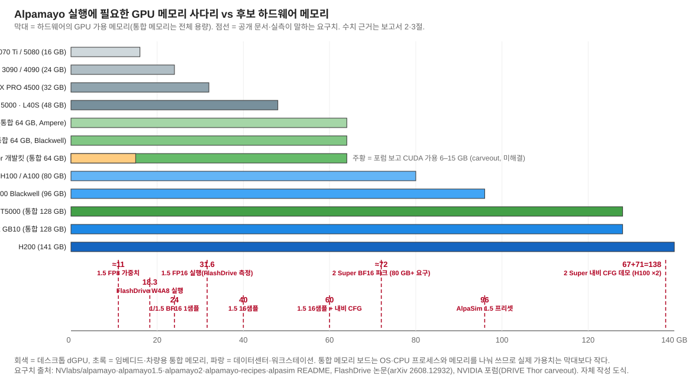

# Alpamayo를 돌릴 DRIVE Thor 대안 하드웨어 — 요구 사양과 후보별 실행 범위

> **작성일**: 2026-09-29 · **상태**: 초판
> **목적**: NVIDIA Alpamayo(1 / 1.5 / 2 Super)를 실행할 하드웨어를 DRIVE AGX Thor 밖에서 고르기 위해, (1) 모델이 요구하는 사양을 기능별로 정리하고, (2) Thor에서 어디까지 되는지를 기준선으로 세운 뒤, (3) 후보 보드·GPU마다 "이건 되고 이건 안 된다"를 양자화·궤적 샘플 수·VQA·CFG 기준으로 가격과 함께 적는다.
> **관련 문서**: Thor 자체의 배포 절차와 Autoware 결합은 [Thor 배포편](../09-ad-sw-stack-deep-dive/thor-deployment/thor-deployment.md), 모델 구조와 SW 요구사항은 [Alpamayo SW/HW 요구사항](../03-nvidia-alpamayo/alpamayo_sw_hw_요구사항.md), FlashDrive 최적화는 [FlashDrive 분석](../04-flashdrive/flashdrive_analysis.md), TIER IV ROS 2 노드 실측은 [TIER IV × Alpamayo](../07-tier4-alpamayo-autoware/tier4_alpamayo_autoware_보고서.md). 출처 목록은 [reference/references.md](reference/references.md).
>
> **출처 표기 원칙**: 모든 사실 문장에 출처 ID와 등급을 붙인다. 확인하지 못한 것은 ⚠️와 함께 "미확인"으로 적는다. 판단은 `분석` 블록에만 쓰고, 계산은 "계산"으로 표시한다. 가격은 조사일의 공개 표시가이며, 2026년 메모리 수급난으로 GPU 가격 변동이 크므로 구매 시점에 다시 확인해야 한다.

| 등급 | 뜻 |
|---|---|
| 💻 | 저장소 원문 파일(README·문서·코드)을 raw로 직접 내려받아 확인 (2026-09-29) |
| 🔍 | 1차 출처 페이지를 직접 열람 (GitHub 이슈·PR 등) |
| 📚 | 이 저장소의 앞선 보고서가 1차 출처를 직접 열람해 기록한 사실 (열람일 2026-07-15 또는 2026-09-15). 이번 조사에서는 해당 사이트 접근이 차단돼 재열람하지 못함 |
| 📰 | 웹 검색 결과 요약·제목만 확인 (원문 미열람). 가격·리셀러 정보 대부분이 여기 해당 |
| ✅ | 2개 이상 출처 교차 확인 |
| ⚠️ | 미확인·추정·상충 |

출처 ID 접두어: **M** 모델·런타임(Alpamayo, Edge-LLM, FlashDrive, NIM) · **J** Jetson · **D** DRIVE · **G** 데스크톱·워크스테이션 GPU·DGX Spark · **C** 데이터센터 GPU·클라우드 · **P** 가격·시세

**조사 환경 제약 (2026-09-29)**: 세션 네트워크 정책상 nvidia.com·developer.nvidia.com·forums.developer.nvidia.com·docs.nvidia.com·huggingface.co·arxiv.org·리셀러 사이트 원문에 직접 접근할 수 없었다. GitHub 저장소 raw 파일과 이슈 페이지, 웹 검색 요약만 가능했다. 그래서 (a) 모델·런타임 요구사항은 GitHub README 원문(💻)으로, (b) 보드 사양·포럼 사례는 앞선 보고서의 열람 기록(📚)으로, (c) 가격은 검색 요약(📰)으로 등급을 나눠 적었다.

---

## 결론 먼저

1. **Alpamayo 실행의 첫 관문은 GPU 메모리, 둘째는 세대(FP8·flash-attn 지원), 셋째는 메모리 대역폭이다.** 10B 모델(1·1.5)은 BF16 1샘플 약 24 GB, 16샘플 약 40 GB, 16샘플 + 내비 CFG 약 60 GB를 쓴다 [M2] 💻. 34B 모델(2 Super)은 H100 80 GB에서 피크 약 72 GB이고 내비 CFG 데모는 80 GB GPU 2장(67 GiB + 71 GiB)을 쓴다 [M3][M4] 💻. FP8 양자화는 compute capability 8.9(Ada) 이상에서만 실제 커널이 돌고 [M12] 📰 [M6] 💻, Ampere(Orin·3090·A100)는 FP8·FP4가 없다 [M6] 💻.
2. **DRIVE Thor 기준선은 "1(R1) FP16만 공식, 1.5는 비공식 약 0.94~3.8 s, 2 Super는 경로 없음"이다.** Thor에서 공개된 가장 빠른 수치는 Alpamayo 1.5 1샘플 943.6 ms(FlashDrive 최적화 후, 최적화 전 3,770.3 ms)이고 [M8] 📚, DRIVE 개발킷은 CUDA 가용 메모리가 6~15 GB로 잡혀 R1 FP16 엔진 빌드가 실패한 사례가 미해결이다 [D3][D4] 📚.
3. **가장 값싸게 "1·1.5 전 기능"을 돌리는 후보는 32 GB 이상 데스크톱 GPU다.** RTX 5090(32 GB)은 BF16 1샘플·VQA·소수 샘플까지 되고, FlashDrive 최적화 시 1회 183.7 ms다 [M8] 📚. 다만 2026-09 시세는 MSRP $1,999의 두 배가 넘는 약 $4,300이다 [P5][P6] 📰. RTX 4090·3090(24 GB)은 1샘플만 겨우 들어가고 16샘플·CFG는 안 된다(계산·README 기준) [M2] 💻.
4. **2 Super까지 돌리려면 80 GB 이상이 필요하고, 한 장으로 끝내려면 RTX PRO 6000 Blackwell(96 GB)뿐이다.** TIER IV가 이 카드로 2 Super 노드(3.35 s, 69.1 GiB)와 내비 CFG(5.2 s, 70.9 GiB)까지 한 장에서 돌렸다 [M5] 💻. 가격은 2026-08 MSRP 인상으로 $16,000, 시세 약 $18,000이다 [P7][P8] 📰.
5. **차량용 임베디드 대안은 Jetson AGX Thor(128 GB, 출시가 $3,499 → 2026-07 인상 $5,499)가 유일하게 "Thor 계열이면서 메모리가 더 큰" 보드이고, Jetson AGX Orin 64GB(개발킷 $1,999 → $3,499)는 FP16·INT4 경로만 열려 있다.** TensorRT Edge-LLM 0.10.1 지원 매트릭스는 Jetson Orin(JetPack 7.2)을 FP16·INT8·INT4 한정으로 공식 지원에 넣었고, Alpamayo R1 예제는 FP16 전용이다 [M6][M7] 💻. Orin에서 Alpamayo를 실제로 돌린 공개 사례는 찾지 못했고 [M25][M24] 🔍, 같은 런타임의 8B VLM 벤치마크로 보면 Orin은 Thor의 절반 속도다 [M20] 💻. 2026-07 Jetson 가격 인상(최대 101%)으로 Orin의 가격 이점도 줄었다 [P2] 📰. DRIVE AGX Orin($7,500)은 DriveOS 6가 CUDA 11.4·PyTorch 미지원이라 경로가 없다 [D6][D7][D8] 📰.
6. **DGX Spark(GB10, 128 GB 통합, $4,699)는 "Thor와 같은 대역폭(273 GB/s)·같은 Blackwell·같은 aarch64"라는 점에서 Thor 대리 개발기로 가장 가깝다.** Edge-LLM이 DGX Spark를 공식 플랫폼(SM121)으로 지원한다 [M6] 💻. DGX Spark에서 Alpamayo 1(R1) 6궤적 추론을 13.33 s에서 4.10 s로 줄인 논문이 있고 [M17] 📰, 같은 런타임 벤치마크에서 Spark의 decode 속도는 Thor와 같은 급이다 [M20] 💻. 가격은 $3,999 → $4,699(2026-02 인상)다 [P9] 📰.
7. **비(非)NVIDIA 보드는 현재 후보가 아니다.** 공개 코드가 CUDA·flash-attn·TensorRT·ModelOpt에 묶여 있고 [M1][M2][M3] 💻, ROCm·Qualcomm·Ambarella에서 Alpamayo를 실행한 공개 사례를 찾지 못했다 ⚠️.

---

## 1부. Alpamayo가 요구하는 하드웨어 사양

### 1.1 모델 세 종의 크기와 공식 요구치

| 항목 | Alpamayo 1 (R1-10B) | Alpamayo 1.5 (10B) | Alpamayo 2 Super (34B) |
|---|---|---|---|
| 구성 | Qwen3-VL-8B 구조 VLM 8.2B + flow-matching action expert 2.3B | 같음 (Cosmos-Reason2 기반) | 32B VLM + 약 2B diffusion expert |
| 가중치 파일 | BF16 약 22 GB | BF16 약 22 GB | BF16 약 72 GB |
| README 최소 GPU | "≥24 GB VRAM (e.g., RTX 3090, RTX 4090, A5000, H100)". 16 GB는 OOM 경고 | "at least 24 GB VRAM". 테스트 구성 RTX 3090, A100, H100, B200. 16 GB는 OOM 경고 | "enough VRAM for a 34B model". 내비 CFG 데모는 "two 80GB H100 GPUs"에서 검증 |
| 측정 메모리 | — | H100: 1샘플 약 24 GB, 16샘플 약 40 GB, 16샘플 + CFG 약 60 GB | H100 1장 피크 72,115 MiB(모델카드) · 2-GPU CFG: VLM GPU 약 67 GiB + expert GPU 약 71 GiB |
| 카메라 입력 | 4대 × 4프레임 | 기본 4대(가변) | 궤적 6대 × 4프레임, VQA 6대 |
| 기능 | 궤적 + CoC 추론 텍스트 | + 내비 텍스트 조건, 내비 CFG, VQA | + 메타액션, 자동 라벨, VQA, 2D grounding (내비 CFG는 예제 스크립트만) |
| SW 고정 | Python 3.12, torch 2.8.0, flash-attn(SDPA 대체 가능), CUDA 12.x | 같음 | Python 3.12, CUDA 12.x + nvcc, flash-attn 빌드 |
| 출처 | [M1] 💻 | [M2] 💻 | [M3][M4] 💻 📚 |

- 모델 구조·파라미터 수·2 Super 모델카드 수치(72,115 MiB)는 Thor 배포편이 2026-09-15에 모델카드를 직접 열람해 기록한 값이다 [M4] 📚.
- 세 모델 모두 action expert는 flow matching Euler 적분이며 코드 기본 스텝은 10이다. TIER IV 노드는 5스텝을 기본으로 쓰고 ADE 차이가 약 1% 안이라고 적었다 [M5] 💻.

### 1.2 기능별로 메모리와 연산이 어떻게 늘어나는가

| 기능 | 무엇이 늘어나는가 | 근거 |
|---|---|---|
| 궤적 샘플 수 (`num_traj_samples`) | VLM prefill은 1회 공유하고, CoC 디코딩과 expert 디노이징이 샘플 수만큼 배치로 늘어난다. 1.5에서 1→16샘플은 약 24→40 GB. FlashDrive의 Thor 측정은 1샘플 943.6 ms → 6샘플 1,522.6 ms | [M2] 💻 [M8] 📚 |
| 내비게이션 CFG | 내비 텍스트를 뺀 unguided KV 캐시를 하나 더 만들고 expert가 두 벡터장을 섞는다. 1.5는 16샘플 기준 +20 GB(40→60 GB). 2 Super는 VLM을 두 번 prefill해 3.35→5.2 s, 69.4→70.9 GiB(TIER IV 구현) | [M2][M5] 💻 |
| VQA·텍스트 과제 | expert 없이 VLM `generate_text`만 돈다. 메모리는 궤적 1샘플보다 작거나 같고, 지연은 생성 토큰 수에 비례한다(구조상 판단) | [M2][M3] 💻 |
| CoC 추론 텍스트 길이 | 디코딩 단계가 지연의 최대 항목(1.5 기준 716 ms 중 264~272 ms). R1 논문은 추론 40토큰 99 ms vs 추론 없이 29 ms | [M9] 💻 [M10] 📚 |
| flow 스텝 10→5 | expert 단계만 절반. TIER IV 실측 약 100 ms 절감, 궤적 편차 0.4% | [M5] 💻 |
| 카메라 수 4→6 (2 Super) | 이미지 토큰이 1.5배. prefill·KV 캐시 증가 | [M3] 💻 |

### 1.3 양자화 경로와 하드웨어 세대 요구

| 경로 | 결과물 | 필요한 GPU 세대 | 실제로 빨라지는가 | 출처 |
|---|---|---|---|---|
| NVIDIA 레시피 FP8 (ModelOpt 0.43) | 1.5 약 11 GB. 테스트 환경 RTX 5090 + CUDA 12 / B300 + CUDA 13 | FP8 커널은 CC 8.9(Ada) 이상. NIM 문서도 "FP8은 CC 8.9 이상" | PyTorch 경로에서는 실제 FP8 GEMM이 없으면 느려질 수 있음(Thor 포럼 "No real-quant GEMM found") | [M11] 💻 [M12] 📰 [M13] 📚 |
| NVIDIA 레시피 AutoQuant (FP8 + NVFP4, 기본 4.8 bit) | 1.5 약 9 GB (6.5 bit 예시) | NVFP4는 Blackwell 전용 | 같은 제약 | [M11] 💻 [M6] 💻 |
| FlashDrive W4A8 (ParoQuant, vLLM Marlin 커널) + DFlash + 스트리밍 | 1.5 실행 메모리 FP16 약 31.6 GB → 약 18.3 GB. 요구: CUDA 12.8, Python 3.12, **CC 8.0 이상** | Ampere 이상. Jetson Thor에서도 측정됨 | RTX 4090 1,307→217 ms, Thor 3,770→944 ms | [M9] 💻 [M8] 📚 |
| TensorRT Edge-LLM (R1 전용) | FP16 ONNX → 기기별 TensorRT 엔진(LLM·visual·action 3개) | Jetson Thor, DRIVE Thor(DriveOS 7.2), DGX Spark, Jetson Orin(JetPack 7.2, FP16·INT8·INT4만) | "Only FP16 is supported for Alpamayo export". 1.5·2는 미지원(이슈 #130 open) | [M6][M7] 💻 [M14] 🔍 |
| TIER IV ROS 2 노드 expert INT8 (SmoothQuant QDQ, ONNX Runtime TensorRT EP) | expert 엔진만 INT8/FP16 | TensorRT 10 + CC 8.x 이상(일반론) | expert 14.8→9.1 ms(FP16)→7.3 ms(FP8 PR) | [M5] 💻 📚 |

> **분석.** 후보 하드웨어를 볼 때 세 가지를 순서대로 물으면 된다. ① 메모리가 목표 구성(1샘플 24 / 16샘플 40 / CFG 60 / 2 Super 72+)을 넘는가. ② FP8·NVFP4를 쓰려면 Ada·Blackwell인가, Ampere면 W4A8·INT4 경로만 남는다. ③ 대역폭이 낮은 통합 메모리 보드(273 GB/s급)는 같은 세대 dGPU보다 디코딩이 5~6배 느리다는 것을 FlashDrive 표(Thor 944 ms vs RTX 5090 184 ms)가 보여준다.

### 1.4 요구 사양 요약표 (구성별)

| 목표 구성 | 최소 GPU 메모리 | GPU 세대 조건 | 참고 지연 (공개 최선) | 출처 |
|---|---|---|---|---|
| 1 / 1.5 궤적 1샘플 + CoC, BF16 | 24 GB (실행 시 약 31.6 GB까지 관측) | Ampere 이상 (flash-attn 없으면 SDPA) | RTX PRO 6000 716.9 ms → FlashDrive 151.4 ms | [M1][M2][M9] 💻 [M8] 📚 |
| 1.5 궤적 1샘플, W4A8 (FlashDrive) | 약 18.3 GB | CC 8.0 이상 | 위와 같음 | [M8] 📚 [M9] 💻 |
| 1.5 FP8 (NVIDIA 레시피) | 가중치 약 11 GB + 활성값 | CC 8.9 이상 | 공개 지연 수치 없음 ⚠️ | [M11] 💻 |
| 1.5 VQA | 24 GB급 | — | 토큰 수 비례 | [M2] 💻 |
| 1.5 16샘플 | 약 40 GB | — | Thor 6샘플 1,522.6 ms(FlashDrive) | [M2] 💻 [M8] 📚 |
| 1.5 16샘플 + 내비 CFG | 약 60 GB | — | — | [M2] 💻 |
| 2 Super 궤적·VQA·메타액션 | 80 GB 이상 (피크 약 72 GB / 69.1 GiB) | H100에서만 검증 | RTX PRO 6000 3.35 s | [M3][M4][M5] 💻 📚 |
| 2 Super 내비 CFG | 80 GB × 2 또는 96 GB × 1 | — | 5.2 s (96 GB 1장) | [M3][M5] 💻 |
| AlpaSim 폐루프 (1.5 프리셋) | 약 96 GB | — | — | [M15] 💻 |
| AlpaGym RL 스모크 | GPU 2장(각 40 GB 이상 권장) | — | — | [M16] 💻 📚 |
| R1 Edge-LLM FP16 엔진 | 엔진 빌드 시 15.17 GB 요청(포럼) + 런타임 | Thor·Orin·Spark | Thor 공개 수치 없음 ⚠️ | [M7] 💻 [D3] 📚 |

---

## 2부. 기준선 — DRIVE AGX Thor / Jetson AGX Thor에서는 어디까지 되는가

### 2.1 Thor 두 보드 사양 (요약)

| 항목 | Jetson AGX Thor 개발킷 (T5000) | DRIVE AGX Thor 개발킷 | 출처 |
|---|---|---|---|
| GPU | Blackwell, CUDA 코어 2,560, SM110 | Blackwell iGPU, CUDA 코어 2,560, SM110 | [J1][D1] 📚 |
| AI 성능 표기 | 2,070 FP4 TFLOPS sparse / 1,035 FP8 | 최대 2,000 FP4 TFLOPS / 1,000 INT8 TOPS | [J1][D1] 📚 |
| 메모리 | 128 GB LPDDR5X, 273 GB/s | 64 GB LPDDR5X, 273 GB/s. 포럼 보고 CUDA 가용 6.0 GiB(DriveOS 7.2.5 EA) 또는 15,018 MB(7.0.3) | [J1][D1][D3][D4] 📚 |
| 전력 | 모듈 70~120 W(MAXN), 개발킷 140 W 전원 | 시스템 350 W | [J1][D1] 📚 |
| 차량 I/O | 없음(HSB 브리지 카메라, 5GbE·QSFP28) | GMSL2/3, 10G-T1, CAN·FlexRay·LIN, 안전 MCU(Renesas U2A16) | [J1][D1] 📚 |
| SW | JetPack 7.0~7.2.1 (CUDA 13.0~13.2.1, TensorRT 10.13~10.16) | DriveOS 7.0.3 (CUDA 12.8) / 7.2.5 (CUDA 13.3, TensorRT 11) | [J2][D2] 📚 |
| 가격 | US$3,499 (2025-08-25 판매 개시) → 2026-07 NVIDIA 인상 $5,499(언론 보도 경유). 국내 유통가 약 540만 원(VAT 별도) | 비공개. 공인 대리점 주문, 리드타임 6~10주, DRIVE AGX SDK Developer Program 가입 필요 | [J3] ✅ [P2][P1] 📰 [D1] 📚 |

### 2.2 Thor에서 Alpamayo가 되는 범위

| 항목 | Jetson AGX Thor (128 GB) | DRIVE AGX Thor 개발킷 (64 GB) | 출처 |
|---|---|---|---|
| Alpamayo 1 (R1) FP16, Edge-LLM | **공식 경로.** 튜토리얼 대상. 공개 지연 수치 없음 ⚠️ | 공식 조건 충족(DriveOS 7.2 + Edge-LLM)이나 CUDA 가용 6.0 GB에서 15.17 GB 요청 엔진 빌드 OOM, 2026-09-13 기준 미해결 | [M7] 💻 [D3][D4] 📚 |
| Alpamayo 1.5 BF16, PyTorch + SDPA | **비공식 실행 사례.** jtop 14.5 GB. 1회 3,770.3 ms, FlashDrive 후 943.6 ms(1샘플), 6샘플 1,522.6 ms | 실행 사례 없음 ⚠️ | [M8][M13] 📚 |
| Alpamayo 1.5 FP8 / AutoQuant | PyTorch 경로에서 "No real-quant GEMM found" 경고, 오히려 느림(FP16 424 s/clip vs 6.5 bit 455 s/clip 평가 시간) | — | [M13] 📚 |
| Alpamayo 1.5 16샘플·CFG | 메모리상 가능(계산). 실측 없음 ⚠️ | 64 GB에 CFG 60 GB는 경계선, carveout 문제로 불가(계산·판단) | [M2] 💻 |
| Alpamayo 1.5 VQA | 구조상 가능. 실측 없음 ⚠️ | — | — |
| Alpamayo 2 Super BF16 | 128 GB에 72 GB는 들어가나 실행 사례 없음 ⚠️ | 불가 (72 GB > 64 GB, 계산) | [M3][M4] 💻 📚 |
| Alpamayo 2 Super NVFP4 | 계산상 약 23 GB. 변환·실행 도구 없음 | 같음 | [계산] |
| Edge-LLM 1.5 / 2 지원 | 없음. 이슈 #130 "New Model / Roadmap" 라벨, 2026-07-08 이후 응답 없음 | 같음 | [M14] 🔍 |
| Autoware 결합 | Autoware 1.9.0이 Jetson Thor에서 검증(CUDA 13.0) | "not separately verified" | [J4] 📚 |

> **분석.** 기준선을 한 줄로 줄이면 "Thor에서는 Alpamayo 1.5 1샘플이 약 1초, 그것도 비공식 PyTorch 경로"다. 2 Super는 Thor 계열 어디에도 실행 경로가 없다. 그러므로 대안 하드웨어를 고를 때의 질문은 "Thor만큼 되는가"가 아니라 "Thor보다 무엇이 더 되는가(2 Super, CFG, 16샘플, FP8)"와 "Thor와 얼마나 비슷한 조건인가(aarch64·통합 메모리·273 GB/s)"의 두 축이다. 앞의 축은 데스크톱·데이터센터 GPU가, 뒤의 축은 DGX Spark와 Jetson Thor가 맡는다.

### 2.3 Thor를 대신할 때 같이 봐야 할 "Thor의 성격"

| 성격 | 값 | 같은 성격을 가진 대안 | 출처 |
|---|---|---|---|
| CPU 아키텍처 | aarch64 (Neoverse V3AE) | Jetson AGX Orin(aarch64, Cortex-A78AE), DGX Spark(aarch64, Cortex-X925/A725) | [J1][J5][G9] 📚 📰 |
| GPU 세대 | Blackwell SM110 (FP8·NVFP4 있음, DLA 없음) | DGX Spark(Blackwell SM121), Jetson T4000(SM110), RTX 50·RTX PRO Blackwell(SM120) | [M6] 💻 |
| 메모리 | 통합 LPDDR5X 273 GB/s | DGX Spark 273 GB/s, Jetson T4000 273 GB/s, Jetson AGX Orin 204.8 GB/s | [J1][J8][J5][G9] 📚 📰 |
| 런타임 | TensorRT Edge-LLM 공식 플랫폼 | Jetson Orin(JetPack 7.2), DGX Spark 도 공식. x86 dGPU는 "Developer" 등급 | [M6] 💻 |
| flash-attn | SM110 빌드 대상 아님 → SDPA | DGX Spark SM121도 휠 없음(이슈 #1969), Orin SM87도 기본 빌드 아님 | [M29][M30] 🔍 [M28] 📚 |

**같은 모델·같은 런타임으로 잰 세 플랫폼 비교(대리 지표)** — TensorRT Edge-LLM 0.10.0 공식 벤치마크, Qwen3-VL-8B-Instruct(Alpamayo 1·1.5 VLM 백본과 같은 구조), INT4 AWQ, 배치 1, prefill 2,048토큰 [M20] 💻

| 플랫폼 | Prefill E2E | Decode | Thor 대비 |
|---|---|---|---|
| Jetson AGX Thor | 662.2 ms (NVFP4: 104.5 ms) | 46.2 tok/s (NVFP4 44.4) | 1.0× |
| DGX Spark (GB10) | 380.9 ms (NVFP4: 185.1 ms) | 42.4 tok/s (NVFP4 39.5) | prefill 1.7× 빠름(INT4) / 1.8× 느림(NVFP4), decode 0.9× |
| Jetson AGX Orin 64GB | 1,388.1 ms | 30.6 tok/s | prefill 2.1× 느림, decode 1.5× 느림 |

> **분석.** 이 표는 Alpamayo 수치가 아니라 같은 8B VLM 백본의 수치다. 그래도 방향은 읽힌다. ① Orin은 Thor의 절반 수준이므로 Thor에서 1샘플 약 1~3.8초인 Alpamayo 1.5는 Orin에서 대략 2~8초 급으로 예상된다(계산·추정 ⚠️). ② DGX Spark는 decode가 Thor와 같은 급(대역폭이 같음)이고 prefill은 정밀도에 따라 엇갈린다. 즉 Spark에서 잰 지연은 Thor 예측치로 쓸 만하다. ③ Thor에서 NVFP4 prefill이 INT4보다 6배 빠른 것은 Blackwell 전용 커널 덕분이며, Ampere Orin에는 이 경로가 없다.

---

## 3부. 후보 하드웨어별 실행 범위

### 3.0 읽는 법

- **✔ 실행 사례·공식 지원** · **○ 메모리·세대 조건은 충족하나 공개 실측 없음** · **△ 조건부(양자화·최적화·경계선 메모리)** · **✖ 불가(메모리 또는 세대)** · **? 판단 근거 부족**
- "1샘플"은 궤적 후보 1개(`num_traj_samples=1`), "16샘플"은 16개, "CFG"는 내비게이션 classifier-free guidance다.
- 지연은 **Alpamayo 1.5 1샘플 1회 추론(기준 → FlashDrive 최적화)** 공개 수치이며 출처가 다르면 조건도 다르다.
- 가격은 2026-09 조사 시점의 검색 요약(📰)이다. 2026년 메모리 수급난으로 NVIDIA가 Jetson(7월, 최대 101%), RTX PRO 6000(6월·8월), DGX Spark(2월) 가격을 올렸고 RTX 5090은 소매가가 MSRP의 2배를 넘었다 [P2][P7][P9][P5] 📰.

### 3.1 총괄 매트릭스

| 하드웨어 | GPU 메모리 | 1/1.5 BF16 1샘플 | 1.5 FP8·NVFP4 | 1.5 W4A8 (FlashDrive) | 1.5 16샘플 | 1.5 16샘플+CFG | VQA | 2 Super | 2 Super 내비 CFG | Edge-LLM R1 FP16 | 1.5 1샘플 지연 (기준→최적화) |
|---|---|---|---|---|---|---|---|---|---|---|---|
| **Jetson AGX Thor** (T5000) | 128 GB 통합 | ✔ 커뮤니티 | △ 커널 없어 오히려 느림 | ✔ | ○ (6샘플 실측 1,522.6 ms) | ○ | ○ | ○ 메모리만 충족, 사례 없음 | ○ (96 GB 1장 방식 70.9 GiB) | ✔ 공식 | **3,770.3 → 943.6 ms** |
| **Jetson T4000** | 64 GB 통합 | ○ | △ | ○ | ○ | △ 경계선(60/64) | ○ | ✖ | ✖ | ○ (Jetson Thor 계열) | 미측정. T5000보다 CUDA 코어 60%, 대역폭 동일 |
| **DRIVE AGX Thor 개발킷** | 64 GB 통합 (CUDA 가용 6~15 GB 보고) | △ carveout 문제 | △ | △ | ✖ | ✖ | △ | ✖ | ✖ | △ 빌드 OOM 미해결 | 없음 |
| **Jetson AGX Orin 64GB** | 64 GB 통합, 204.8 GB/s | ○ 사례 없음 | ✖ Ampere | △ Marlin sm_87 미검증 | ○ | △ 경계선 | ○ | ✖ | ✖ | ○ 공식 플랫폼(JetPack 7.2), 사례 없음 | 없음. 대리 지표로 Thor의 약 1/2 속도 |
| **DRIVE AGX Orin 개발킷** | 32 GB (미확인 ⚠️) | ✖ DriveOS 6 = CUDA 11.4, PyTorch 미지원 | ✖ | ✖ | ✖ | ✖ | ✖ | ✖ | ✖ | ✖ 지원 매트릭스에 없음 | 없음 |
| **Jetson Orin NX 16GB / Nano 8GB** | 16 / 8 GB | ✖ | ✖ | ✖ (18.3 GB) | ✖ | ✖ | ✖ | ✖ | ✖ | ✖ (양자화도 20 GB 미만 불가) | — |
| **DGX Spark** (GB10) | 128 GB 통합, 273 GB/s | ✔ 논문 | ○ Blackwell(SM121 커널 성숙도 ⚠️) | ○ | ✔ (R1 6샘플 13.33→4.10 s) | ○ | ○ | ○ 메모리만 충족, "부분 동작" 포럼 보고 | ○ | ✔ 공식 플랫폼, 사례 없음 | R1 6샘플 **13.33 → 4.10 s** (다른 최적화) |
| **RTX 5090** | 32 GB, 1,792 GB/s | ✔ (양자화 레시피 테스트 GPU) | ✔ 레시피 테스트 | ✔ | ✖ (40 GB) | ✖ | ✔ | ✖ | ✖ | △ x86 Developer 등급 | **878.1 → 183.7 ms** |
| **RTX 4090** | 24 GB, 1,008 GB/s | △ README는 가능, FlashDrive 논문은 다중 샘플 OOM | ○ Ada | ✔ | ✖ | ✖ | ○ | ✖ | ✖ | △ | **1,307.1 → 217.2 ms** |
| **RTX 3090** | 24 GB, 936 GB/s | ✔ NVIDIA 테스트 구성 | ✖ Ampere | ✔ | ✖ | ✖ | ○ | ✖ | ✖ | △ | **1,891.9 → 382.3 ms** |
| **RTX 5080 / 5070 Ti / 4080 Super** | 16 GB | ✖ OOM (README 명시) | ✖ 메모리 | ✖ (18.3 GB) | ✖ | ✖ | ✖ | ✖ | ✖ | ✖ | 연구용 CPU-GPU 스와핑만 (5070 Ti 논문) |
| **RTX PRO 6000 Blackwell** | 96 GB, 1,792 GB/s | ✔ | ✔ | ✔ | ✔ (60 GB 이내) | ✔ | ✔ | ✔ TIER IV 3.35 s | ✔ 5.2 s, 70.9 GiB | △ | **716.9 → 151.4 ms** |
| **RTX PRO 5000 Blackwell 72 GB** | 72 GB, 1,344 GB/s | ○ | ○ | ○ | ○ | ○ (60 GB) | ○ | ✖ 피크 69.1 GiB = 74.2 GB > 72 GB (계산) | ✖ | △ | 없음 |
| **RTX PRO 5000 48 GB / RTX 6000 Ada / L40S** | 48 GB | ○ (Ada·Blackwell) | ○ Ada 이상 FP8 | ○ | ○ (40 GB) | ✖ (60 GB) | ○ | ✖ | ✖ | △ | 없음. AlpaGym 스모크는 RTX 6000 Ada 2장에서 테스트 |
| **RTX A6000** (Ampere) | 48 GB, 768 GB/s | ○ | ✖ | ○ | ○ | ✖ | ○ | ✖ | ✖ | △ | 없음 |
| **RTX PRO 4500 Blackwell** | 32 GB, 896 GB/s | ○ | ○ | ○ | ✖ | ✖ | ○ | ✖ | ✖ | △ | 없음 |
| **H100 80 GB** | 80 GB HBM3 | ✔ README 측정 GPU | ✔ | ○ | ✔ 40 GB | ✔ 60 GB | ✔ | ✔ 모델카드 테스트 GPU, 72,115 MiB | ✔ 2장 | ✖ (Hopper는 x86 Developer 등급 휠만) | 없음(NVIDIA "H100에서 측정" 표기만) |
| **H200 141 GB** | 141 GB | ✔ | ✔ | ○ | ✔ | ✔ | ✔ | ○ | ○ 1장 가능성(67+71 GiB = 148 GB > 141 GB, 계산상 경계선 ⚠️) | ✖ | 없음 |
| **A100 80 GB** | 80 GB HBM2e | ✔ README 테스트 GPU | ✖ Ampere | ○ | ✔ | ✔ | ✔ | ○ 메모리 충족, "다른 아키텍처 미검증" | ✖ (2장이면 ○) | ✖ | 없음 |

근거: 메모리 요구치 [M1][M2][M3][M4] 💻 📚 · Thor 실측 [M8][M13][M28] 📚 · DRIVE Thor [D3][D4] 📚 📰 · Orin 세대 제약 [M6] 💻 [M12] 📰 · DRIVE Orin [D7][D8][D9] 📰 [M6] 💻 · DGX Spark [M17][M27] 📰 [M6] 💻 · FlashDrive GPU별 [M8] 📚 📰 · 레시피 테스트 GPU [M11] 💻 · TIER IV [M5] 💻 · AlpaGym [M16] 💻 📚 · NIM 임계값 [M12] 📰 · 5070 Ti 스와핑 [M18] 📰 · HF 2 Super 카드 [M4] 📰

### 3.2 차량용·임베디드 후보

#### Jetson AGX Thor 개발킷 (T5000, 128 GB)

| 항목 | 내용 | 출처 |
|---|---|---|
| 사양 | Blackwell 2,560 CUDA 코어, 2,070 FP4 TFLOPS(sparse), 128 GB LPDDR5X 273 GB/s, 40~130 W, 1 TB NVMe, DLA 없음 | [J1] 📚 |
| 가격 | 출시가 US$3,499(2025-08-25). **2026-07 NVIDIA가 $5,499로 인상**(언론이 NVIDIA FAQ 갱신을 보도). Amazon 특가 $2,799 목격, Arrow 리드타임 24주 표기. 국내 유통가 540만 원(VAT 별도, ICBanq) | [J3] ✅ [P2][P19][P1] 📰 |
| 되는 것 | R1 Edge-LLM FP16(공식 튜토리얼) · 1.5 BF16 PyTorch+SDPA(커뮤니티) · FlashDrive 1샘플 943.6 ms, 6샘플 1,522.6 ms · 16샘플·CFG·VQA는 메모리상 가능 | [M7] 💻 [M8][M13][M28] 📚 |
| 안 되는 것·주의 | FP8·AutoQuant는 PyTorch 경로에서 실제 커널이 없어 느려짐(NVIDIA 답변도 "TensorRT에서 기대 성능 안 나옴" 취지 📰) · Edge-LLM은 1.5·2 미지원 · 2 Super는 메모리만 충족, 실행 보고 없음 · flash-attn 없음 · MIG 프리뷰 이슈 | [M13] 📚 📰 [M14] 🔍 [J2] 📚 |
| 판단 | Thor 계열 중 유일하게 2 Super 가중치(72 GB)가 들어가는 보드. DRIVE Thor를 대신해 "차량용 SoC에서의 기능 검증"을 할 1순위. 차량 I/O·안전 MCU는 없다 | 분석 |

#### Jetson T4000 모듈 (64 GB)

| 항목 | 내용 | 출처 |
|---|---|---|
| 사양 | Blackwell 1,536 CUDA 코어, 최대 1,200 FP4 TFLOPS(sparse), 64 GB LPDDR5X 273 GB/s, 40~70 W, MIG 지원 | [J8] 📚 📰 |
| 가격 | 모듈 $1,999(1천 개 단가, 출시) → **$2,999**(2026-07 인상). NVIDIA 개발킷은 없고 AGX Thor 개발킷 캐리어와 폼팩터 호환. 파트너 캐리어(Seeed reComputer J601, Forecr DSBOARD-THRMAX, AVerMedia D331, Axiomtek AIE015-AT) | [P2][J9] 📰 |
| 되는 것 | 1·1.5 BF16 1샘플·16샘플(40 GB), Edge-LLM R1 FP16(Jetson Thor 계열, JetPack 7.1+) | [M2][M6] 💻 [J8] 📚 |
| 안 되는 것 | 2 Super(72 GB > 64 GB) · 16샘플+CFG는 60 GB로 통합 메모리 64 GB에서 OS·CPU 몫을 빼면 경계선 | 계산 |
| 판단 | "DRIVE Thor와 같은 64 GB·273 GB/s·Blackwell"이라는 조건이 Jetson AGX Thor보다 DRIVE 개발킷에 더 가깝다. 다만 CUDA 코어가 T5000의 60%라 지연은 Thor 실측보다 느릴 것이다(계산). 공개 Alpamayo 실측은 없다 ⚠️ | 분석 |

#### DRIVE AGX Thor 개발킷 (64 GB) — 기준선 재확인

- 가격 비공개, DRIVE AGX SDK Developer Program 초청·계약 전제, 리드타임 6~10주 [D1][D11] 📚 📰.
- 2026-09 포럼 두 스레드(R1 FP16 엔진 빌드 OOM, CUDA 가용 6.0 GiB)는 조사일 기준 NVIDIA 해결 답변이 검색에 잡히지 않는다 [D3][D4] 📚 📰 ⚠️.
- 양산 ECU(Lenovo AD1, Desay SV IPU14, Continental·Magna·Quanta)는 Tier-1 경유이며 개발자 구매가·가용성은 찾지 못했다 [D12][D14] 📰 ⚠️.

#### Jetson AGX Orin 64GB 개발킷 / 모듈

| 항목 | 내용 | 출처 |
|---|---|---|
| 사양 | Ampere 2,048 CUDA 코어(SM87), 275 INT8 TOPS(sparse), 64 GB LPDDR5 204.8 GB/s, NVDLA 2.0 ×2, 15~60 W | [J5] 📰 |
| 가격 | 개발킷 $1,999(2022 출시) → **$3,499**(2026-07 인상). 64GB 모듈 $2,999/1k, 32GB 모듈 $1,799/1k. 국내 462만 원(VAT 별도)~560만 원 | [P3][P2][P4] 📰 |
| SW | JetPack 6.2.x(CUDA 12.6, TensorRT 10.3, Ubuntu 22.04)에 PyTorch 2.8.0 휠 제공 · **JetPack 7.2부터 Orin도 CUDA 13.2 지원** · Edge-LLM은 JetPack 7.2 Orin을 공식 플랫폼으로 명시(FP16·INT8·INT4만) · flash-attn은 sm_87 기본 빌드 아님 → SDPA | [J6][J7][J12] 📰 [M6] 💻 [M30] 🔍 |
| 되는 것 | 1·1.5 BF16 1샘플(22 GB 가중치 + 실행 메모리, 64 GB에 여유) · 16샘플(40 GB) · VQA · Edge-LLM R1 FP16 엔진(x86에서 export 후 기기에서 빌드, Orin은 양자화 호스트 불가) | [M2][M6][M7] 💻 [M14] 🔍 |
| 안 되는 것 | FP8·NVFP4(세대) · 2 Super(메모리) · 16샘플+CFG(60/64 GB 경계선) · W4A8 Marlin은 sm_80+ 요구를 충족하나 vLLM이 W4A8을 Hopper 이상으로 게이팅한다는 보고가 있어 sm_87 동작 미확인 ⚠️ | [M6] 💻 [G13] 📰 |
| 실행 사례 | **없음.** NVlabs/alpamayo 이슈 #69에서 "AGX Orin 64GB가 최소 사양인가"라는 질문에 답이 없다. Thor·Orin 계측용 포크(YSH-Inference-Alpamayo-1.5)는 수치를 공개하지 않았다. AGX Xavier 32GB에 R1을 TensorRT FP16/INT8로 올린 서드파티 저장소는 있으나 지연 수치가 없다 | [M25][M24][M23] 🔍 |
| 예상 성능 | 대리 지표(2.3절)로 Thor의 prefill 1/2.1, decode 1/1.5. Thor 1.5 1샘플 3,770 ms(기준)를 대입하면 약 6~8초, FlashDrive급 최적화가 sm_87에서 다 살아난다면 약 1.5~2초(계산·추정 ⚠️) | [M20] 💻 계산 |
| 판단 | "Thor 없이 aarch64·통합 메모리·JetPack에서 Alpamayo 1.5가 도는지"를 가장 싸게 확인하는 보드. 대신 FP8·NVFP4 경로와 실시간성은 포기해야 하고, 2026-07 인상으로 가격 이점이 줄었다 | 분석 |

#### DRIVE AGX Orin 개발킷

- 사양: 단일 Orin-X SoC, 254 INT8 TOPS, Aurix 안전 MCU. DRAM 용량·대역폭·카메라 수는 NVIDIA 페이지 스니펫에서 확인하지 못했다(포럼은 "Jetson AGX Orin 64GB와 비슷할 것"이라고만 답함) [D5] 📰 ⚠️.
- 가격: Arrow 표기 MSRP **$7,500** [D6] 📰.
- SW: 최신 DriveOS 6.0.10 = **CUDA 11.4, TensorRT 8.6.13**. NVIDIA는 "PyTorch는 DRIVE에서 공식 지원하지 않는다"고 반복 답변. DriveOS 7.x의 Orin 지원은 2026-01 포럼에서 "문서에 언급만 있고 공개본 없음" [D7][D8][D9] 📰. Edge-LLM 지원 매트릭스에 DRIVE Orin이 없고, 전신인 DriveOS LLM SDK도 "TensorRT 8.6 미지원이라 Orin·DriveOS 6 불가" [M6] 💻 [D10] 📰.
- 판단: Alpamayo 공개 코드(torch 2.8, CUDA 12.x)를 올릴 경로가 없다. Xavier 이식 사례처럼 TensorRT 8.6용 엔진을 x86에서 만들어 옮기는 수작업만 남는데, 공개 사례·수치가 없다. **후보에서 제외**.

#### Jetson Orin NX 16GB · Orin Nano Super 8GB

- 16 GB·8 GB 통합 메모리, 102 GB/s. 가격 Orin Nano Super 개발킷 $249 → $399 [J10][P2] 📰.
- README가 16 GB를 OOM 사례로 명시하고, NIM 문서는 양자화 프로파일도 20 GB 이상을 요구한다 [M1][M2] 💻 [M12] 📰. FlashDrive W4A8 실행 메모리 18.3 GB도 넘는다 [M8] 📚.
- RTX 5070 Ti 16 GB에서 CPU-GPU 층 단위 스와핑으로 R1 BF16을 돌린 논문이 있으나(UVM 기준 69.6 s/추론, Accelerate 오프로드 대비 최대 3.55배), x86 dGPU + 호스트 RAM 전제이고 통합 메모리 보드에는 그대로 적용되지 않는다 [M18] 📰. **제외**.

### 3.3 Thor 대리 개발기 — DGX Spark (GB10)

| 항목 | 내용 | 출처 |
|---|---|---|
| 사양 | GB10 Grace Blackwell: 20코어 Arm CPU + Blackwell GPU 6,144 CUDA 코어, 최대 1 PFLOP NVFP4(sparse), **128 GB LPDDR5X 통합 273 GB/s**, 1/4 TB NVMe, ConnectX-7 200 Gbps, SoC 약 140 W, compute capability 12.1 | [G9] 📰 |
| 가격 | Founders $3,999(2025-10) → **$4,699**(2026-02, 메모리 수급 사유). 파트너: ASUS Ascent GX10 약 $4,100, Gigabyte AI TOP Atom $3,999, Lenovo ThinkStation PGX $4,100~5,079, HP ZGX Nano $4,759(Amazon)~7,399(HP 스토어). 2026-09 OEM 시세 $5,400~8,200 보도. 국내 700만 원대~, Dell 약 1,000만 원 | [P9][P10][P11] 📰 |
| SW | Edge-LLM 공식 플랫폼(SM121, CUDA 13.0) · PyTorch는 2.9+가 sm_121 공식 기준(2.8 고정인 Alpamayo 저장소는 sm_120 호환 빌드로 우회 필요) · flash-attn sm_121 휠 없음(이슈 #1969) → SDPA · vLLM은 SM121 빌드 대상 추가 | [M6] 💻 [G11][G12] 🔍 |
| 실행 사례 | **Alpamayo 1(R1) 6궤적: 13.33 s → 4.10 s**(단일 추론으로 재설계 + 액션 생성 커널 정리 + CUDA graph, arXiv 2605.08975) · 포럼 "Spark DGX Alpamayo + Alpasim": 여러 시간 뒤 "부분적으로 동작하나 Spark의 단일 노드 구조와 맞지 않는다" | [M17][M27] 📰 |
| 되는 것 | 1·1.5 BF16 전 구성(1·16샘플·CFG·VQA)이 메모리상 여유 · 2 Super 72 GB 적재(실행 보고 없음) · Edge-LLM R1 FP16 엔진 | [M2][M3][M6] 💻 |
| 안 되는 것·주의 | 대역폭이 Thor와 같아 **속도는 Thor급**이지 dGPU급이 아님 · 2.3절 대리 지표: decode 42.4 tok/s(Thor 46.2) · NVFP4·FP8 커널 성숙도(sm_121 전용 커널 부족 포럼 요청) | [M20] 💻 [G11] 🔍 |
| 판단 | "Thor에서 어느 정도 나올지"를 Thor 없이 재는 데 가장 가까운 장비. 값도 Jetson AGX Thor 인상가($5,499)보다 낮다. 단, 차량 I/O·JetPack이 아니므로 배포 검증은 아니다 | 분석 |

### 3.4 데스크톱 GPU (개발용 PC)

| GPU | 메모리·대역폭 | FP8 | 가격 (MSRP → 2026-09 시세, 📰) | Alpamayo에서 되는 것 | 안 되는 것 | 1.5 1샘플 지연 |
|---|---|---|---|---|---|---|
| **RTX 5090** (Blackwell) | 32 GB GDDR7, 1,792 GB/s, 575 W | ✔ + FP4 | $1,999 → 소매 약 $4,300~5,000, 마켓플레이스 $6,400~9,500, 중고 약 $3,800~4,000. 국내 다나와 약 550만~650만 원 | 1·1.5 BF16 1샘플, VQA, NVIDIA FP8·AutoQuant 레시피(테스트 GPU), FlashDrive, 소수 샘플 배치 | 16샘플(40 GB), CFG(60 GB), 2 Super | 878.1 → 183.7 ms |
| **RTX 4090** (Ada) | 24 GB, 1,008 GB/s, 450 W | ✔ | $1,599, 단종. 중고 $2,500~3,000(2026-09 급등) | README상 1샘플 가능, FP8 세대 조건 충족, FlashDrive | 다중 샘플(FlashDrive 논문: 24 GB에서 원본 OOM, 최적화판만 404.1 ms), 16샘플·CFG·2 Super | 1,307.1 → 217.2 ms |
| **RTX 3090** (Ampere) | 24 GB, 936 GB/s, 350 W | ✖ | $1,499, 단종. 중고 $1,050~1,400 | 1샘플(NVIDIA 테스트 구성), FlashDrive W4A8(sm_80+) | FP8·NVFP4, 다중 샘플(원본 OOM, 최적화판 694.8 ms), 2 Super | 1,891.9 → 382.3 ms |
| **RTX 5080 / 5070 Ti / 4080 Super** | 16 GB | ✔ | $999/$749/$999 → 약 $1,579/$1,050/$1,500 | 없음(README OOM 명시). 연구용 CPU-GPU 스와핑만 | 전부 | — |

근거: 사양 [G1][G2][G3][G4] 📰 · 가격 [P5][P6][P12][P13][P14] 📰 · 실행 범위 [M1][M2][M9][M11] 💻 [M8] 📚 [M18] 📰

- FlashDrive는 "CUDA 12.8, Python 3.12, compute capability 8.0+"를 요구하며 W4A8은 vLLM Marlin 커널을 쓴다 [M9] 💻. 3090에서 돌았으므로 Ampere dGPU는 된다 [M8] 📚.
- RTX 4090의 24 GB는 README(가능)와 FlashDrive 논문(다중 샘플 OOM)이 갈린다. 1샘플·짧은 CoC면 되고, 샘플을 늘리면 안 된다고 읽는 것이 안전하다(분석).
- 개발용 PC 완성품 가격 예: RTX 5090 워크스테이션 조립 약 $8,500~9,500(2026-08 시세), BIZON 단일 GPU AI 워크스테이션 약 $5,100~, Lambda 듀얼 5090 $14,999~ [P21] 📰.

### 3.5 워크스테이션 GPU

| GPU | 메모리·대역폭 | 가격 (📰) | 되는 것 | 안 되는 것 | 출처 |
|---|---|---|---|---|---|
| **RTX PRO 6000 Blackwell** (Workstation / Max-Q 300 W) | 96 GB GDDR7 ECC, 1,792 GB/s, 600 W | $8,565(2025-03) → $13,250(2026-06) → **$16,000**(2026-08 MSRP). 시세 $14,000~18,000(B&H $15,499, Newegg $13,998, Amazon $17,987 9/28). Max-Q $8,900 표기는 재인상 여부 미확인 ⚠️ | **전부**: 1.5 전 구성(151.4 ms), 2 Super 노드 3.35 s, 2 Super 내비 CFG 5.2 s(1장), AlpaSim 1.5 프리셋 96 GB(경계선) | Edge-LLM 배포 검증(x86는 Developer 등급) | [G8][P7][P8] 📰 [M5][M8][M15] 💻 📚 |
| **RTX PRO 5000 Blackwell 72 GB** | 72 GB, 1,344 GB/s, 300 W | 공식가 미발표. 추정 $5,000~6,300, 마켓플레이스 $13,136 목격 | 1.5 전 구성(16샘플+CFG 60 GB 포함) | 2 Super(피크 69.1 GiB = 74.2 GB > 72 GB, 계산) | [G7][P15] 📰 |
| **RTX PRO 5000 48 GB / RTX 6000 Ada / L40S** | 48 GB | PRO 5000 48 GB $4,250~4,600(2025-10) · RTX 6000 Ada 약 $7,000 · L40S 약 $6,000~7,600 | 1샘플·16샘플(40 GB)·VQA·FP8(Ada 이상) · AlpaGym 스모크(RTX 6000 Ada 2장 테스트) | 16샘플+CFG, 2 Super | [G5][G7][C4][P15][P16] 📰 [M16] 💻 |
| **RTX A6000** (Ampere) | 48 GB, 768 GB/s | 중고 $2,600~5,000 | 1샘플·16샘플 | FP8, CFG, 2 Super | [C12] 📰 |
| **RTX PRO 4500 Blackwell** | 32 GB, 896 GB/s, 200 W | 약 $2,268(출처 불명확 ⚠️) | 5090과 같은 범위, 더 느림 | 16샘플·CFG·2 Super | [G6][P15] 📰 |

### 3.6 데이터센터 GPU·클라우드

| GPU | 메모리 | FP8 | 구매가 (📰) | 시간당 임대 (📰) | Alpamayo 범위 | 출처 |
|---|---|---|---|---|---|---|
| **H100 80 GB** | HBM3 3.35 TB/s(SXM) | ✔ | PCIe $25~30k, SXM ~$40k, 중고 $15~28k | Lambda $3.29~3.99 · RunPod $2.89~3.49 · Vast 중앙값 $2.25 · AWS p5.48xlarge(8장) $55.04 · GCP a3-highgpu-8g $87.8 · Azure ND96isr $98.3 | 1.5 README 측정 GPU, 2 Super 모델카드 테스트 GPU(1장), 2 Super CFG(2장) | [C1][P17][P18] 📰 [M2][M3] 💻 |
| **H200 141 GB** | HBM3e 4.8 TB/s | ✔ | $30~40k | RunPod $4.59 · Nebius $4.50 · AWS p5e.48xlarge $39.8 | 2 Super 1장 여유. 2-GPU CFG 데모(148 GB)는 1장에 경계선 | [C2] 📰 계산 |
| **A100 80 GB** | HBM2e ~2 TB/s | ✖ | 신품 $7~15k, 중고 $4~9k | RunPod $1.59 · Vast $1.09 · AWS p4d(40 GB 8장) $21.96 | 1.5 테스트 GPU. 2 Super는 메모리 충족·미검증. NIM은 "프로파일 검증 안 됨" | [C3][M12] 📰 |
| **L40S 48 GB** | GDDR6 864 GB/s | ✔ | $6~7.6k | RunPod $1.09 · AWS g6e.xlarge $1.861 | 48 GB급(3.5절)과 같음 | [C4][C8] 📰 |
| **RTX PRO 6000 Server** | 96 GB | ✔ + FP4 | 워크스테이션판과 같은 인상 흐름 | AWS g7e.2xlarge $3.36 · RunPod $2.09 · Vast $0.93~1.40 | 96 GB 워크스테이션판과 같음. **2 Super 1장 실험을 가장 싸게 빌리는 경로** | [C5][C6] 📰 |
| **B200 / B300** | 180 GB급 | ✔ + FP4 | $30~55k | Lambda B200 $6.69 · 중앙값 $6.49 | 1.5 README 테스트(B200), 양자화 레시피 테스트(B300) | [C6][M2][M11] 📰 💻 |

- Alpamayo 1.5 NIM은 x86 호스트, GPU 1장/컨테이너, BF16 30 GB 이상·양자화 20 GB 이상·FP8은 CC 8.9 이상, A100은 프로파일 미검증, RTX 6000 Ada 같은 카드는 "호환 경로"로 기동 가능 [M12] 📰.

---

## 4부. 가격 대비 정리와 시나리오별 선택 (분석)

### 4.1 "목표 구성 × 가장 싼 하드웨어" 표

| 목표 | 최소 조건 | 가장 싼 후보(2026-09 시세) | 그다음 | 비고 |
|---|---|---|---|---|
| 1·1.5 1샘플 + VQA 기능 확인 | 24 GB, Ampere 이상 | 중고 RTX 3090 약 $1,050~1,400 | 중고 RTX 4090 $2,500~3,000 | 3090은 FP8 불가, FlashDrive 382 ms |
| 1.5 FP8·NVFP4 양자화 실험 | Ada 이상(FP8), Blackwell(NVFP4), 24 GB+ | RTX 5090 약 $4,300~ (레시피 테스트 GPU) | RTX PRO 4500 32 GB | 5090 시세가 MSRP 2배 이상 |
| 1.5 16샘플 배치 | 40 GB | RTX PRO 5000 48 GB $4,250~4,600 / L40S | RTX 6000 Ada 약 $7,000 | 임대면 L40S $1.1~1.9/h |
| 1.5 16샘플 + 내비 CFG | 60 GB | RTX PRO 5000 72 GB(가격 미발표, 추정 $5~6.3k) | H100 임대 $2~4/h | 72 GB 카드 실측 없음 |
| 2 Super 궤적·VQA·메타액션 | 80 GB | RTX PRO 6000 Server 임대 $2.1~3.4/h | RTX PRO 6000 구매 $14~18k / H100 $25~30k | 1회 3.35 s, 폐루프 불가 |
| 2 Super 내비 CFG | 96 GB × 1 또는 80 GB × 2 | 같은 RTX PRO 6000(TIER IV 방식) | H100 × 2 임대 | 5.2 s |
| AlpaSim 폐루프 (1.5 프리셋) | 96 GB | RTX PRO 6000 | H100 | 문서 수치 기준 |
| **Thor 대리 개발(aarch64·통합 메모리·Blackwell)** | Thor와 같은 대역폭 | **DGX Spark $4,699**(파트너 $4,100~) | Jetson AGX Thor $5,499(인상가)/$3,499(구가 재고) | Spark는 2 Super 적재 가능, JetPack·차량 I/O 없음 |
| **차량용 SoC에서 1.5 기능 검증** | JetPack, 24 GB+ | Jetson AGX Orin 64GB $3,499(구가 $1,999) | Jetson T4000 캐리어 세트 | Orin은 FP8 없음, 실측 사례 없음 |
| **차량용 SoC에서 2 Super까지** | 72 GB+ 통합 | Jetson AGX Thor 128 GB | 없음 | 실행 보고 없음 |
| 차량 I/O·안전 경로 검증 | GMSL·CAN·안전 MCU | DRIVE AGX Thor 개발킷(가격 비공개) | Tier-1 ECU | 대안 없음. DRIVE Orin은 SW 스택 부적합 |

### 4.2 시나리오별 조합 예시

1. **최소 비용 기능 확인 (약 $1,500~3,000)**: 중고 RTX 3090/4090 한 장. 1·1.5 1샘플·VQA·FlashDrive를 다 볼 수 있다. 16샘플·CFG·2 Super는 못 본다.
2. **양자화·Thor 예측 겸용 (약 $4,700~9,000)**: DGX Spark 한 대 + 필요 시 RTX 5090. Spark에서 1·1.5 전 구성과 2 Super 적재를, 5090에서 FP8·NVFP4 레시피와 빠른 반복을 맡긴다. Spark 지연은 Thor 예측치로 쓴다.
3. **2 Super까지 한 장으로 (약 $14,000~18,000 또는 임대 $2~3.5/h)**: RTX PRO 6000 Blackwell. TIER IV가 같은 카드로 2 Super 노드와 CFG까지 재현했으므로 재현 위험이 가장 낮다. 상시 필요가 아니면 AWS g7e·RunPod 임대가 싸다.
4. **차량용 SoC 검증 (약 $3,500~5,500)**: Jetson AGX Orin 64GB(1.5 기능만, FP8 없음) 또는 Jetson AGX Thor(2 Super 적재까지, Edge-LLM 공식). Thor 실측 943.6 ms가 이미 있으므로, Orin은 "Ampere·JetPack 6/7.2 환경에서도 도는가"를 확인하는 용도다.
5. **차량 I/O까지**: DRIVE AGX Thor 개발킷 외 대안이 없다. carveout 문제가 풀릴 때까지 GPU 작업은 위 1~4에서 하고 DRIVE는 I/O·안전 경로에 쓰는 분리 운영이 현실적이다.

> **분석.** 2026년 하반기 시세에서는 "Jetson AGX Orin 개발킷($3,499)과 DGX Spark($4,699)와 Jetson AGX Thor 구가 재고($3,499)"가 같은 가격대에 모여 있다. Alpamayo만 놓고 보면 메모리 128 GB·Blackwell·Edge-LLM 공식 지원인 Thor 계열(Jetson Thor 또는 Spark)이 Orin보다 낫고, Orin을 고를 이유는 "이미 Orin 기반 차량 플랫폼이 있어 그 위에서 돌려야 한다"는 경우로 좁혀진다.

---

## 5부. 후보에서 뺀 것과 이유

| 후보 | 이유 | 출처 |
|---|---|---|
| Qualcomm Snapdragon Ride, Ambarella CV3, Mobileye EyeQ 등 비NVIDIA 차량 SoC | Alpamayo 공개 코드가 CUDA·flash-attn·TensorRT·ModelOpt에 묶여 있고, 다른 벤더 SoC에서 Alpamayo를 실행한 공개 사례를 찾지 못했다 | [M1][M2][M3][M11] 💻 ⚠️ |
| AMD Instinct / Radeon (ROCm) | PyTorch ROCm으로 VLM 부분은 이론상 가능하나, W4A8 Marlin·ModelOpt·Edge-LLM 경로가 없고 공개 사례가 없다 | ⚠️ |
| Apple Silicon (MPS) | 통합 메모리는 크지만 CUDA 의존 코드·flash-attn·bf16 커널 경로가 없다. 공개 사례 없음 | ⚠️ |
| DRIVE AGX Orin | DriveOS 6 = CUDA 11.4·TensorRT 8.6, PyTorch 미지원, Edge-LLM 미지원 (3.2절) | [D7][D8][M6] 📰 💻 |
| Jetson Orin NX / Nano, 16 GB 데스크톱 GPU | 24 GB 최소치·양자화 20 GB 최소치 미달 (3.2·3.4절) | [M1][M2] 💻 [M12] 📰 |
| AGX Xavier | 서드파티 R1 TensorRT 이식 저장소는 있으나 수치 없음. 2026-04 EOL 공지(LPDDR4) | [M23] 🔍 [J13] 📰 |

---

## 부록 A. 미확인·상충 항목

- DRIVE AGX Thor 개발킷 가격, DRIVE AGX Orin 개발킷의 DRAM 용량·대역폭(공식 페이지 미열람)
- DRIVE Thor GPU carveout 문제의 NVIDIA 공식 해결 절차(2026-09-13 이후 포럼 응답 여부)
- Jetson AGX Thor·AGX Orin·T4000의 2026-07 인상 후 정확한 가격(언론 보도 경유, NVIDIA FAQ 원문 미열람) 및 T5000 모듈의 인상 후 가격
- RTX PRO 5000 72 GB 공식가, RTX PRO 4500 가격 출처, RTX PRO 6000 Max-Q의 재인상 여부
- FlashDrive 논문의 RTX 3090/4090 "원본 OOM, 최적화판 694.8/404.1 ms" 행의 정확한 샘플 수(같은 논문의 1샘플 수치와 다르므로 다중 샘플 행으로 판단)
- FlashDrive W4A8(Marlin)이 sm_87(Orin)·sm_121(DGX Spark)에서 빌드·실행되는지
- Jetson AGX Orin에서 Alpamayo 1·1.5를 실제로 실행한 사례와 지연·메모리
- DGX Spark에서 Alpamayo 1.5·2 Super 실행 사례(1(R1) 6궤적 수치만 있음), 포럼 "Spark DGX Alpamayo + Alpasim" 스레드의 날짜·실패 원인
- Alpamayo 2 Super HF 모델카드 원문("H100 외 아키텍처 미검증" 표현은 검색 요약 경유)
- NIM Alpamayo 1.5의 검증 GPU 표 전체
- H200 1장에서 2 Super 내비 CFG 데모 실행 가능 여부(계산상 148 GB > 141 GB)
- 국내 유통가의 재고 시점(2026-07 인상 전 구가인지)

## 부록 B. 조사 방법

- 2026-09-29 웹 조사. 세션 네트워크 정책으로 nvidia.com 계열·huggingface.co·arxiv.org·리셀러 사이트 원문 접근이 차단돼, (a) GitHub raw 파일(NVlabs/alpamayo·alpamayo1.5·alpamayo2·alpamayo-recipes·alpasim·alpagym, z-lab/flashdrive, autowarefoundation/alpamayo-autoware 두 브랜치, NVIDIA/TensorRT-Edge-LLM 문서·CHANGELOG·벤치마크 표)을 직접 내려받아 확인했고(💻), (b) GitHub 이슈·PR·저장소 페이지를 열람했으며(🔍), (c) 그 밖의 사양·가격·포럼·논문은 웹 검색 요약(📰)과 이 저장소의 앞선 보고서가 2026-07-15·09-15에 직접 열람해 기록한 사실(📚)에 의존했다.
- 병렬 조사 5갈래(Jetson·DRIVE·데스크톱/워크스테이션 GPU·Alpamayo 요구사항/최신 동향·데이터센터/클라우드)로 수집한 뒤 본문에서 출처 등급을 통일했다. 실행·실측은 하지 않았다.
- 가격은 USD 표시가 기준이며 환율·관세·VAT를 반영하지 않았다. 국내가는 검색에 잡힌 유통사 표시가 그대로다.
