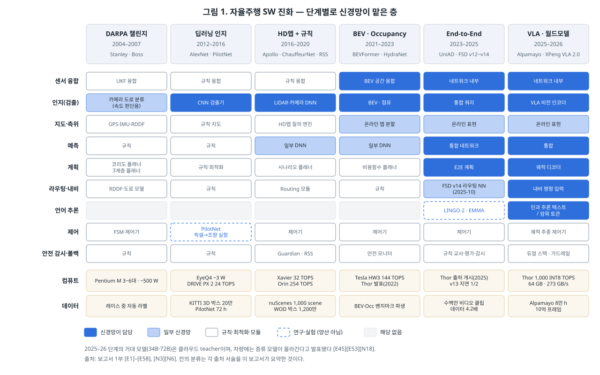
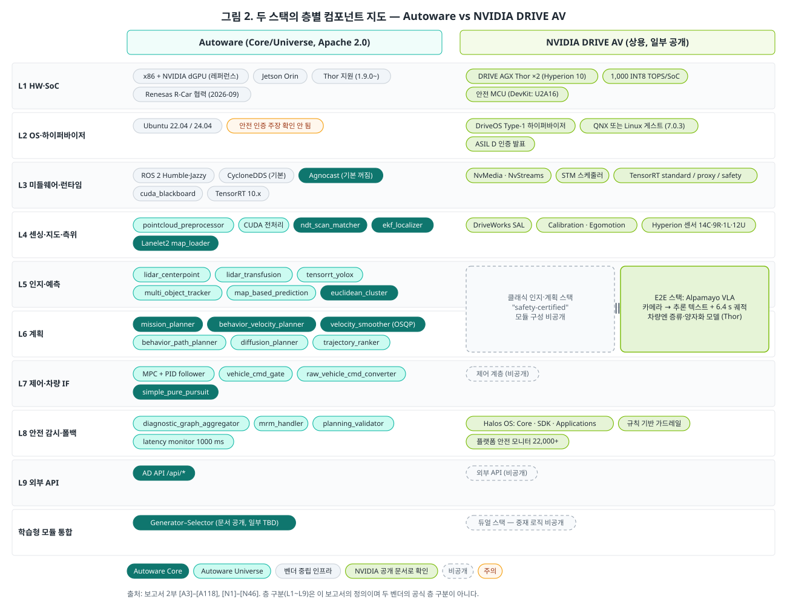

# 자율주행 SW 스택을 끝까지 열어 보니 — 신경망은 층을 삼켰고, 양산은 그 옆의 검사기가 결정한다

> 사내 공유용 · 2026-09-15 · 읽는 시간 약 10분 · 근거와 상세는 [보고서](ad-sw-stack-deep-dive.md), 출처는 [출처 목록](reference/references.md)
> 본문의 `[A63]` 같은 표기는 출처 ID다. 확인 수준(1차 원문·서드파티·미확인)은 보고서에 등급으로 적었다.

자율주행 소프트웨어 이야기는 대개 모델에서 시작해 모델에서 끝난다. 몇 B 파라미터인지, E2E인지, VLA인지를 따진다. 그런데 한 스택을 센서부터 바퀴까지 따라가고, 그 옆에 상용 스택을 같은 자로 세워 보면 질문이 바뀐다. 모델이 무엇을 하는지만큼, **모델이 틀렸을 때 무엇이 남는지**가 중요해진다. 이 글은 20년의 진화, Autoware와 NVIDIA DRIVE AV의 층별 해부, 차 밖의 데이터 플라이휠, 양산을 가르는 기술, 그리고 앞으로의 방향을 차량 HPC 개발자의 눈으로 정리한다.

## 1. 20년 동안 신경망 경계는 한 칸씩 내려왔다

2005년 DARPA 사막 레이스에서 우승한 Stanford의 Stanley는 흔히 "규칙 기반 로봇"으로 기억된다. 논문 초록은 다르게 쓴다. Stanley는 "relied predominantly on … machine learning and probabilistic reasoning"이었고, 레이저가 주행 가능하다고 판정한 픽셀로 카메라 분류기를 실시간 학습시켰다 [E1]. 다만 그 학습 결과는 속도를 줄일지 판단하는 데만 썼고, 핸들은 규칙이 잡았다 [E1]. 약 30개 모듈이 pub-sub으로 통신하는 6레이어 구조도 이때 이미 나왔다 [E1].

그 뒤 20년은 신경망이 맡는 층이 한 칸씩 늘어난 역사다.

- **2016년, E2E의 첫 실증.** NVIDIA PilotNet은 파라미터 약 25만 개로 카메라 픽셀을 조향 명령으로 바로 바꿨다 [E4][E5]. E2E는 2023년의 발명이 아니다.
- **2016–2020년, HD맵과 규칙의 전성기.** Baidu Apollo는 Perception부터 Guardian까지 11개 모듈로 표준형을 보여줬다 [E13]. 같은 시기 Waymo ChauffeurNet 저자들은 "30 million examples are still not enough"라고 썼다 [E18].
- **2021–2023년, 융합이 네트워크 안으로.** BEVFormer는 카메라만으로 LiDAR 기반과 대등한 검출 성능을 보고했다 [E25].
- **2023–2025년, 계획까지 신경망으로.** Tesla FSD v12 릴리스 노트는 도심 주행 스택의 C++ 30만 줄을 단일 신경망으로 대체했다고 적었다 [E34]. 라우팅을 신경망에 넣었다고 적은 것은 v14(2025-10)였다 [E36].
- **2025–2026년, 언어 추론과 증류.** NVIDIA Alpamayo는 10B에서 34B로 커졌지만, NVIDIA 스스로 이를 차량에 증류해 넣을 "teacher"라고 부른다 [E45][N19]. XPeng은 반대로 언어 단계를 아예 없앴다 [E53].

이 흐름에서 가장 오해받는 부분은 "규칙이 사라졌다"는 말이다. 규칙은 사라지지 않고 자리를 옮겼다. 2024년 NAVSIM 챌린지 1위 Hydra-MDP는 규칙 기반 교사로부터 증류했고 [E42], NAVSIM의 평가 점수 자체가 규칙으로 계산되며 [E40], 학습 정책 옆에는 RSS 같은 규칙 안전층이 남았다 [E20]. 규칙은 운전자에서 **교사·채점자·감시자**로 직업을 바꿨다.

## 2. 한 스택을 끝까지 열어 보면 — Autoware

코드와 문서로 모든 층이 보이는 스택은 사실상 Autoware 하나다. 그래서 먼저 이것을 센서부터 바퀴까지 따라가 본다.

LiDAR 포인트클라우드는 전처리 필터를 지나 CenterPoint나 TransFusion 검출기로 들어가고, 추적기가 10 Hz로 객체를 내보낸다 [A86][A88]. 자차 위치는 NDT 정합과 EKF가 50 Hz 이상으로 만든다 [A5][A70]. 플래너는 미션 → 행동 → 모션 순서로 궤적을 만들고, 최종 속도는 OSQP로 푼다 [A73][A74]. 제어기는 0.1 s 간격 50스텝 MPC로 궤적을 따라가고, 명령 게이트가 가속·조향 한계를 거른 뒤 차량으로 보낸다 [A83][A81]. 시스템 모니터는 인지부터 제어까지의 합산 지연이 1000 ms를 넘으면 ERROR를 낸다 [A105].

HPC 팀이 멈춰서 봐야 할 곳은 모델이 아니라 **배관**이다.

- **표준 zero-copy는 아직 안 쓴다.** Autoware 코딩 가이드는 ROS 2의 loaned message가 "not currently implemented in Autoware"라고 적었다 [A47].
- **대신 커널 모듈을 쓴다.** TIER IV의 Agnocast는 LD_PRELOAD 힙 후킹과 커널 모듈로 모든 ROS 메시지 타입을 zero-copy로 보낸다 [A63]. 1 MB 메시지에서 IceOryx가 약 1.0 ms일 때 Agnocast는 0.1 ms 미만이었다고 보고됐다 [A64]. 기본값은 꺼져 있다 [A65].
- **GPU 구간은 한 프로세스로 묶어야 한다.** GPU 메모리에 데이터를 둔 채 넘기는 cuda_blackboard는 "All nodes must reside in the same process"를 조건으로 건다 [A66].
- **Core는 GPU 없이 빌드된다.** Core 편입 기준은 "Keep the default build CPU-only"다 [A32]. 기본 주행 경로와 ML 경로가 설계부터 갈라져 있다.

가장 중요한 문장은 따로 있다. Architecture 1.0 문서는 fail-safe, 실시간 처리 보장, 이중화, 상태 감시를 초기 범위에서 **제외**한다고 적었다 [A3]. 스택이 내려놓은 이 책임은 누군가 떠안아야 한다. 그 누군가가 플랫폼, 즉 우리다.

학습 모델을 받아들이는 방식도 문서로 공개됐다. Architecture 2.0은 규칙 플래너·E2E 모델·diffusion 플래너가 후보 궤적을 만들고, Selector가 안전 검사 후 고르는 Generator–Selector 구조를 제시한다 [A26]. 다만 안전성 평가 페이지는 아직 "TBD"다 [A28].

## 3. 같은 질문에 대한 NVIDIA의 답 — DRIVE AV

NVIDIA DRIVE AV는 공식적으로 "dual-stack architecture"다. 인증된 클래식 인지·계획 스택과 Alpamayo가 올라가는 E2E 스택이 나란히 돈다 [N1]. 둘을 누가 어떻게 중재하는지는 "Halos ensures the vehicle operates within defined safety parameters" 수준까지만 공개됐다 [N13].

층을 내려가면 숫자가 구체적이다.

| 층 | 확인된 사실 | 출처 |
|---|---|---|
| SoC | Thor, 최대 1,000 INT8 TOPS, 메모리 대역폭 273 GB/s | [N3] |
| OS | Type-1 하이퍼바이저. 7.0.3 문서 기준 "QNX or Linux, but not both" | [N29] |
| 런타임 | TensorRT safety runtime은 kSAFETY 엔진만, DLA 불가, 컨텍스트당 4 GiB (Orin 세대 문서) | [N42] |
| 안전 | Halos OS = 하이퍼바이저 격리 · 안전 미들웨어 · 규칙 가드레일 | [N4] |
| 센서 | Hyperion 10: 카메라 14 · 레이더 9 · LiDAR 1 · 초음파 12, Thor 2개 | [N14] |

Alpamayo의 지연 수치는 읽는 법이 중요하다. 논문의 99 ms는 차량용 SoC가 아니라 RTX 6000 Pro Blackwell에서 쟀다. 그중 70 ms가 추론 텍스트 40토큰을 생성하는 시간이다 [N6b]. NVIDIA 개발자 포럼에서 NVIDIA 직원은 "Alpamayo is not available for AGX Thor currently"라고 답했다 [N36]. 차량에서 도는 Alpamayo의 공식 지연 수치는 아직 없다.

두 스택을 나란히 놓으면 같은 문제에 대한 두 답이 보인다. Autoware의 Selector와 NVIDIA의 듀얼 스택은 모두 **블랙박스 학습 모델의 출력을 규칙 장치로 검사**한다. 다른 점은 공개 수준이다. Autoware는 구조를 문서로 열었고, NVIDIA는 중재 로직을 닫았다. 어느 쪽이든 HPC에 요구하는 것은 겹친다. 대용량 센서 데이터의 복사 제거, 안전 경로와 AI 경로의 분리, 검증기를 돌릴 독립 컴퓨트, 그리고 스택이 범위 밖으로 둔 실시간·이중화 책임이다.

## 4. 차 밖의 절반 — 데이터 플라이휠과 검증

현대차그룹은 2026-09-13 데이터 플라이휠 본격 가동을 발표하며 경쟁력의 기준을 이렇게 정리했다. "how much data you secure"가 아니라 "how rapidly you can connect data to learning"이다 [D1]. 속도를 늦추는 병목은 단계마다 다르다.

- **수집은 트리거 설계가 병목이다.** Tesla는 2021년 수작업 트리거 221개와 shadow mode로 클립을 모았다고 해설된다 [D8].
- **기록은 저장 장치가 병목이다.** NVIDIA는 Hyperion 8.1 NAS의 2 GB/s가 NVMe sustained 속도의 한계라고 답했다 [D30].
- **라벨링은 자동화로 넘어갔다.** NVIDIA는 Alpamayo 2 Super의 추론 자동 라벨로 주석 주기를 "months to days"로 줄인다고 주장한다 [D20].
- **평가는 비용과 신뢰도의 줄타기다.** 개루프 지표만 믿으면 틀린다 [D17].

마지막 항목은 숫자로 보면 분명하다. Bench2Drive 폐루프 벤치마크에서 개루프 오차(L2)가 0.73인 UniAD-Base의 주행점수는 45.81이었다. L2가 1.01로 더 나쁜 DriveAdapter는 64.22였다 [D17]. 논문은 "Open-loop metric could indicate model convergence but it fails for advanced comparison"이라고 결론짓는다 [D17]. 그렇다고 모든 것을 폐루프로 돌리기엔 비싸다. NAVSIM v2의 pseudo-simulation은 3DGS로 만든 합성 관측을 써서 시나리오당 추론 13회로 폐루프 상관 R² 0.8을 얻었다 [D16].

안전 논증도 마일 누적에서 통계 비교로 옮겨갔다. RAND는 2016년 실도로 주행만으로 인간 대비 안전을 입증하려면 무사고 2억 7,500만 마일 이상이 필요하다고 계산했다 [D34]. Waymo는 대신 rider-only 2억 2,060만 마일에서 인간 기준선 대비 부상 사고 82% 감소라는 비교 통계를 내놓는다 [D23].

이 절반은 차 밖에 있지만 차 안의 예산을 쓴다. 트리거 분류기, shadow 추론, 이벤트 기록, 업로드 큐는 주행 스택과 같은 SoC·스토리지·네트워크를 나눠 쓴다. 이 몫을 초기에 따로 잡지 않으면 주행 스택과 자원을 두고 싸우게 된다.

## 5. 양산을 가르는 것 — 증거와 격리

데모 스택은 잘 달리는 것을 보여주면 된다. 양산 스택은 왜 안전한지 증명하고, 고장 났을 때 무엇이 남는지 설계해야 한다. 이 요구는 표준과 규제를 통해 층마다 따로 걸린다. ISO 26262는 하드웨어·OS·툴체인에 [P12], SOTIF와 ISO/PAS 8800은 인지 기능과 데이터에 [D65][D66], 미국 49 CFR 563은 충돌 기록 장치에 요구를 건다 [P26]. EDR은 종방향 속도 변화가 150 ms 안에 8 km/h 이상일 때 기록을 시작해야 한다 [P26].

격리는 보통 세 구획으로 짠다. 고성능 SoC 위에 Type-1 하이퍼바이저를 올리고, 안전 파티션과 성능 파티션을 나누고, 별도의 안전 MCU를 둔다 [P9][P20][P22]. 여기서 조심할 점이 있다. 같은 "ASIL" 표기라도 근거가 다르다. QNX Hypervisor for Safety 8.0은 "pre-certified to ISO 26262 ASIL D"라고 표기한다 [P9]. EB corbos Linux for Safety Applications의 ASIL B 근거는 TÜV Nord의 "feasibility report"로 적혀 있다 [P6]. 오픈소스 안전 코어 Eclipse S-CORE는 스스로 "not a ready-to-integrate series product"라고 밝힌다 [F41]. 공급사를 고를 때는 등급 문구가 아니라 인증서의 범위를 받아야 한다.

학습 모델 옆에 독립 검사기를 두는 이유도 이제 숫자로 보인다. Alpamayo-R1-10B의 추론 300회를 분석한 논문은 추론 충실도가 42.5%이고, 모델이 "정지"라고 설명한 경우의 37.9%에서 실제로는 계속 달렸다고 보고했다 [F31]. 설명 텍스트를 안전 논증으로 쓸 수 없다는 뜻이다. 양산 사례들은 이미 그렇게 설계한다. Mercedes-Benz CLA는 E2E 스택과 "a parallel classical safety stack"을 함께 돌린다 [P19]. Waymo는 "a separate and rigorous onboard validation layer"가 생성 모델의 궤적을 검증한다 [F1].

추론 런타임에도 틈이 있다. DriveOS 6.0.10 문서 기준 TensorRT safety runtime은 kSAFETY 엔진만 받고, DLA를 쓰지 못하며, 컨텍스트당 GPU 메모리가 4 GiB로 제한된다 [N42]. 반면 NVFP4의 "1% or less" 정확도 저하는 LLM 벤치마크 수치다 [P53]. 인증 런타임이 허용하는 정밀도와 성능이 나오는 양자화의 교집합이 양산 가능한 모델을 정한다. Thor 세대 safety runtime 문서는 확인하지 못했다.

## 6. 앞으로 — 크게 학습하고, 작게 배포하고, 따로 검증한다

2025~2026년 발표를 모으면 방향은 꽤 선명하다. Waymo는 큰 Teacher 모델을 "smaller Student models"로 증류하고, 차량에는 별도 검증층을 둔다고 밝혔다 [F1]. NVIDIA는 Alpamayo 2 Super를 "a cloud-to-car workflow"로 설명한다 [F3]. 학계에서는 미래 영상 예측으로 학습하되 "video branch can be discarded at deployment"라고 쓰는 World-Action Model이 나왔다 [F7].

작게 배포해도 지연은 여전히 병목이다. FlashDrive는 Alpamayo 1.5-10B를 W4A8 양자화와 KV 캐시 재사용 등으로 단일 GPU에서 717 ms에서 151 ms로 줄였다 [F5]. 한 논문은 "language is expensive onboard"라고 요약했다 [F6]. 이 병목은 연산보다 메모리에 가깝다. Alpamayo-R1의 99 ms 중 70 ms가 텍스트 디코딩이었고 [N6b], 칩 사양표에는 메모리 대역폭이 올라왔다.

| 칩 | 메모리 대역폭 | 출처 |
|---|---|---|
| NVIDIA DRIVE AGX Thor (DevKit) | 273 GB/s | [N3] |
| XPeng Turing | 273 GB/s | [F14] (Wikipedia) |
| NIO NX9031 | 546 GB/s | [F15] (Wikipedia) |
| Horizon Journey 6P | 204 GB/s | [F16] (Wikipedia) |

학습 쪽은 폐루프와 생성형 시뮬로 간다. Waymo World Model은 카메라와 LiDAR를 함께 생성하고 [F19], Wayve GAIA-4는 AI 운전자가 브레이크를 밟으면 시뮬 시점도 느려지는 폐루프 월드모델이다 [F20]. 반대 증거도 있다. 한 벤치마크 연구는 순수 self-play 정책이 학습 상대에 과적합한다고 보고하고, 강화학습 정책과 규칙 플래너의 하이브리드를 권했다 [F25]. 규칙은 여기서도 사라지지 않는다.

배관도 갈라지고 있다. ROS 2 Lyrical(2026-05, LTS)의 `rosidl::Buffer`는 GPU 데이터를 옮기지 않고 발행하게 해 주지만, 현재 `rmw_fastrtps_cpp`만 지원한다 [F37]. `rmw_zenoh_cpp`는 Tier 1이 됐다 [F38]. Autoware의 기본은 여전히 CycloneDDS이고 [A56], 가변 크기 메시지 zero-copy는 커널 모듈 기반 Agnocast가 맡는다 [A63]. 한동안 HPC 플랫폼은 여러 경로를 함께 지원해야 한다.

## 차량 HPC 개발자가 챙길 다섯 가지

1. **메모리 대역폭과 KV 캐시를 1급 사양으로.** VLA 지연의 대부분은 디코딩이다 [N6b][F6]. TOPS로 "E2E 준비"를 정의하지 말자.
2. **검증기를 위한 독립 연산과 격리를 처음부터.** Waymo 검증층 [F1], DRIVE AV 병렬 안전 스택 [N1], Autoware Selector [A26]가 모두 이를 전제한다.
3. **실시간·이중화는 스택이 아니라 우리 몫.** Autoware 문서는 이를 범위 밖으로 둔다 [A3]. 결정적 실행기, 시간 동기, 지연 계측을 플랫폼 기본 기능으로 준비하자 [P25][P56][A105].
4. **양자화 경로를 인증 런타임 제약과 함께 검증.** 성능 수치 [F5]와 safety runtime 제약 [N42]의 교집합을 일찍 확인하자.
5. **기록 서브시스템을 규제와 플라이휠 공용으로.** EDR 트리거 [P26], DSSAD [D32], 플라이휠 이벤트 기록 [D1][D29]이 같은 저장·대역폭 예산을 쓴다.

---

*모든 수치와 인용의 출처·확인 등급은 [보고서](ad-sw-stack-deep-dive.md)와 [출처 목록](reference/references.md)에 있다. 확인하지 못한 주장과 출처 간 상충은 보고서 부록 B에 모았다. 이 글은 문헌·공식 문서 조사이며, 코드 실행이나 실측은 하지 않았다.*
