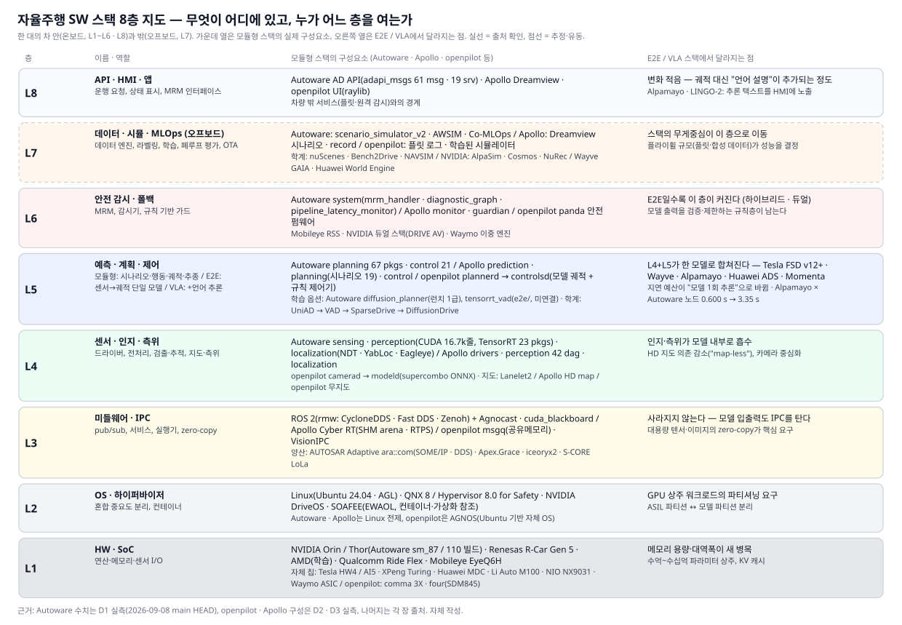
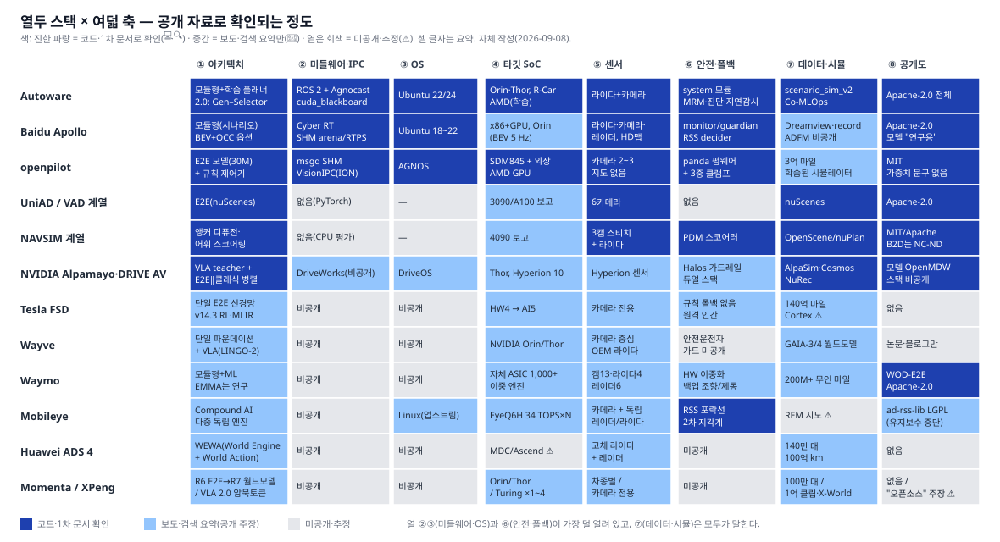
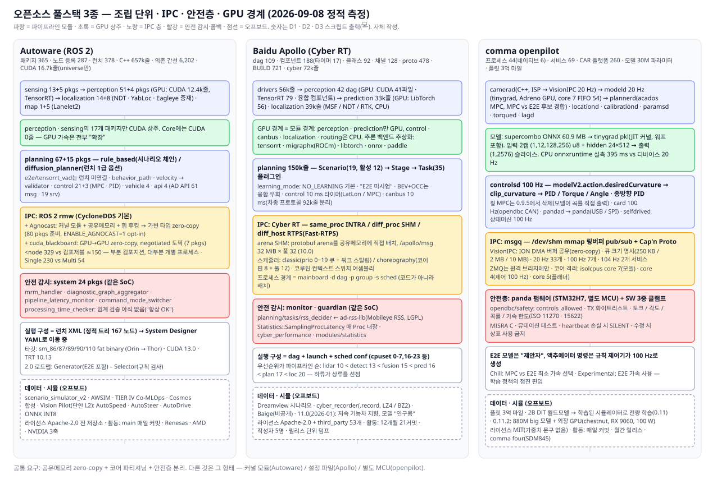
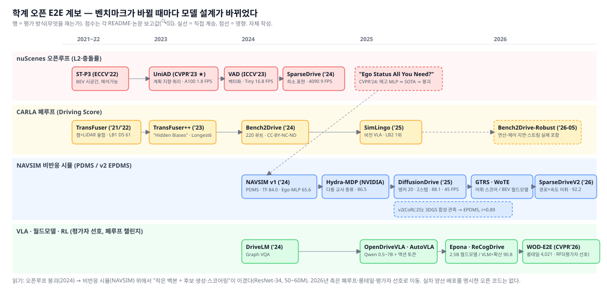
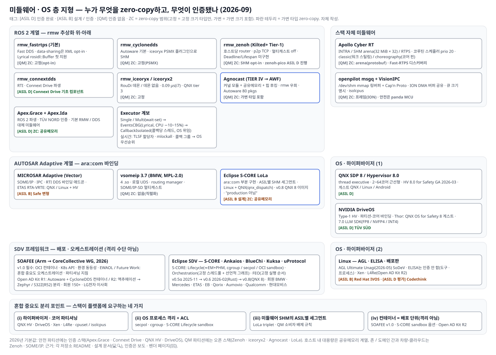

# 자율주행 SW Stack 파헤치기

### 열두 스택을 여덟 층으로 열어 보니, 승부는 모델이 아니라 "층 경계"에서 벌어지고 있었다

| | |
|---|---|
| **작성일** | 2026-09-08 |
| **관점** | 차량용 HPC(고성능 컴퓨팅 플랫폼)를 만드는 Tier-1의 눈 — "이 스택은 우리 플랫폼에 무엇을 요구하는가" |
| **다룬 스택** | 오픈소스 풀스택 3종(Autoware · Baidu Apollo · comma openpilot), 학계 오픈 E2E 계열(UniAD → DiffusionDrive, NAVSIM), 신세대 E2E/VLA(NVIDIA Alpamayo·DRIVE AV, Tesla FSD, Wayve, Waymo), 상용·중국 스택(Mobileye, Huawei ADS, Momenta, XPeng, Li Auto, NIO, Horizon), 미들웨어·OS 층(ROS 2 rmw·Zenoh·Agnocast, AUTOSAR Adaptive, Eclipse S-CORE, SOAFEE, QNX·Linux) |
| **직접 해본 것** | D1 Autoware 소스 정적 해부(패키지 365개) · D2 Apollo Cyber RT·DAG 해부(dag 109개) · D3 openpilot 구조 해부 + 주행 모델 CPU 추론 실측 · D4 Zenoh vs CycloneDDS IPC 마이크로벤치. 스크립트·원시 로그는 `scripts/`·`reference/demo-logs/`에 있어 재실행 가능 |
| **읽는 시간** | 요약만 3분 · 본문 40분 · 부록·출처는 참고용 |

> **읽는 법.** 각 장은 **질문 → 세 줄 답 → 본문 → HPC 메모** 순서다. 바쁘면 각 장 첫머리의 "세 줄 답"과 마지막 "HPC 메모"만 읽어도 이어진다. 사실 문장 뒤에는 근거 등급을 붙였다. 💻 코드·스크립트 출력에서 직접 확인(파일:줄) · 🔍 1차 출처 원문 확인(README·LICENSE·공식 문서) · ✅ 복수 출처 교차 확인 · 📰 검색 요약·보도만 확인(원문 미열람) · ⚠️ 미확인·추정. 세션 네트워크 정책상 arxiv·Hugging Face·nvidia.com·벤더 사이트 원문에 접근할 수 없어 논문·벤더 수치는 📰 비중이 높다. 전체 출처는 [reference/references.md](reference/references.md).

---

## 30초 요약

1. **스택은 여덟 층이고, E2E는 그중 두 층(인지, 계획)만 합쳤다.** 미들웨어·안전 감시·OS·데이터 루프는 그대로 남는다. 오히려 E2E일수록 안전 감시층과 오프보드 데이터층이 커진다.
2. **오픈소스 3종은 조립 방식이 다르다.** Autoware는 ROS 2 노드 365개 패키지를 런치 XML로 엮고, Apollo는 자체 Cyber RT 위에 컴포넌트 188개를 스케줄러 설정으로 배치하며, openpilot은 프로세스 44개를 공유메모리 큐로 묶고 30M 파라미터 모델을 SoC GPU에서 20 Hz로 돌린다 💻.
3. **양산 E2E는 "하이브리드 + 사람 폴백"이다.** Tesla·Horizon·XPeng은 규칙 폴백 없이 단일망을 쓰지만 폴백을 원격 인간이나 안전운전자에게 넘겼고, Mobileye·Waymo·NVIDIA DRIVE AV는 규칙 기반 안전 스택을 병렬로 둔다 📰.
4. **VLA는 아직 느리다.** Alpamayo 1.5(10B)는 데스크톱 GPU에서 0.60 s, 2 Super(34B)는 3.35 s가 걸리고, FlashDrive가 4.5배를 줄여도 Jetson Thor에서는 0.94 s다 🔍. 온보드 파라미터 예산은 "수십억"이 현실 상한이고, 그래서 XPeng은 언어 토큰을 우회하고 Huawei는 VLA를 거부했다 📰.
5. **미들웨어 층이 HPC에 요구하는 것은 대역폭이 아니라 zero-copy와 결정적 스케줄이다.** 표준 ROS 2 loaned message는 고정 크기 타입만 zero-copy이고, 포인트클라우드 같은 가변 타입은 Agnocast(커널 모듈 + 힙 후킹)처럼 메모리 소유권 모델을 바꿔야 한다 🔍. 우리 샌드박스 실측(D4)에서도 같은 4코어 호스트 안에서 전송 방식에 따라 왕복 지연이 수 배 차이 났다 💻.

## 통설 vs 실체 — 조사하면서 뒤집힌 것

| 통설 | 실체 | 근거 |
|---|---|---|
| "E2E가 모듈형 스택을 대체했다" | 양산 스택은 대부분 하이브리드다. NVIDIA DRIVE AV는 E2E 옆에 클래식 안전 스택을 병렬로 두고, Autoware 2.0은 "Generator(E2E 포함) – Selector(규칙 검사)" 구조를 공식 로드맵으로 채택했다. Huawei ADS 3도 인지망·계획망 2단이다 | §1.2, §4.1, §7 🔍📰 |
| "ROS 2 스택은 연구용, 양산 불가" | Autoware는 Isuzu L4 버스(Thor)에 실리고, Renesas가 2026-09 최상위 회원으로 가입해 R-Car에 사전 통합하며, TIER IV는 Agnocast로 zero-copy 문제를 풀어 양산 트랙을 만들었다 | §4.1, §10 📰🔍 |
| "openpilot은 장난감" | 프로세스 44개, 서비스 69개, 차량 플랫폼 260개, 안전 로직은 MISRA C 펌웨어(panda)에 분리, 300M 마일 플릿 데이터. 2026-08에는 880M 파라미터 모델을 외장 GPU로 돌리기 시작했다 | §4.3 💻📰 |
| "Zenoh가 DDS를 대체했다" | rmw_zenoh는 Kilted(2025-05)부터 Tier-1이지만 Lyrical(2026-05)에서도 기본 rmw는 여전히 Fast DDS다. 호스트 내 소형 메시지 지연은 CycloneDDS·공유메모리 계열이 더 낮다 | §8.1, §9 🔍💻 |
| "Apollo는 멈췄다" | 2026-01 Apollo 11.0이 나왔지만 방향이 바뀌었다. 저속 기능차(배송·청소·순찰) 지향이고, 로보택시 Apollo Go의 ADFM은 비공개다. 최근 12개월 master 커밋은 21건, 작성자 5명 | §4.2 💻🔍 |
| "AutoDrive는 Autoware판 Alpamayo" | Autoware Foundation의 AutoDrive는 단안 전방 카메라로 CIPO 거리·곡률·존재 확률을 회귀하는 소형 L2 모델이다. VLA가 아니다 | §4.1 🔍 |

---

## 1. 개념 — 자율주행 SW 스택은 여덟 층이다

> **이 장의 질문.** "스택"이라고 할 때 정확히 무엇을 가리키는가. 모듈형 → E2E → VLA로 갈 때 무엇이 바뀌고 무엇은 남는가.
>
> **세 줄 답.** ① 차 한 대의 자율주행 소프트웨어는 HW부터 앱까지 여덟 층으로 나뉘고, 이 보고서의 모든 비교는 이 층 번호로 한다. ② E2E는 L4(인지)와 L5(계획)를 한 모델로 합친 것이지 스택을 없앤 것이 아니다. ③ 스택이 HPC에 요구하는 것은 층마다 다르며, E2E로 갈수록 요구가 "연산량"에서 "메모리·지연 예산·안전 파티션"으로 이동한다.

### 1.1 여덟 층 지도



*그림 1. 자율주행 SW 스택 8층 지도. 왼쪽 열은 모듈형 스택(Autoware·Apollo·openpilot)의 실제 구성요소, 오른쪽 열은 E2E/VLA에서 달라지는 점. 실선 = 출처로 확인, 점선 = 추정·유동. 자체 작성.*

| 층 | 이름 | 하는 일 | 이 보고서에서 다루는 대표 요소 |
|---|---|---|---|
| L8 | API · HMI · 앱 | 운행 요청, 상태 표시, 원격 감시 인터페이스 | Autoware AD API(61 msg·19 srv 💻), Apollo Dreamview, openpilot UI |
| L7 | 데이터 · 시뮬 · MLOps (오프보드) | 로그 수집, 라벨링, 학습, 폐루프 평가, OTA | scenario_simulator_v2, Cyber record, comma 플릿 로그, NAVSIM·Bench2Drive, AlpaSim·Cosmos, GAIA, World Engine |
| L6 | 안전 감시 · 폴백 | 모델 출력 검증, 최소위험기동(MRM), 감시기 | Autoware system 모듈(mrm_handler·diagnostic_graph), Apollo monitor/guardian, panda 안전 펌웨어, Mobileye RSS, DRIVE AV 클래식 스택 |
| L5 | 예측 · 계획 · 제어 | 궤적 생성과 추종. E2E에서는 L4와 합쳐짐 | Autoware planning 67 pkgs·control 21 pkgs 💻, Apollo planning 시나리오 19개 💻, openpilot plannerd·controlsd |
| L4 | 센서 · 인지 · 측위 | 드라이버, 전처리, 검출·추적, 지도·측위 | Autoware perception 51 pkgs(CUDA 12.4k줄) 💻, Apollo perception 42 dag 💻, openpilot modeld |
| L3 | 미들웨어 · IPC | pub/sub, 서비스, 실행기, zero-copy | ROS 2(rmw: Fast DDS·CycloneDDS·Zenoh) + Agnocast, Cyber RT, msgq, ara::com, LoLa |
| L2 | OS · 하이퍼바이저 | 혼합 중요도 분리, 파티션, 컨테이너 | Linux, QNX 8·QNX Hypervisor, DriveOS, AGNOS, SOAFEE/EWAOL |
| L1 | HW · SoC | 연산·메모리·센서 I/O | Orin·Thor, R-Car Gen 5, Ride Flex, EyeQ6H, Turing, MDC, HW4/AI5, comma 3X/four(SDM845) |

층 번호는 이 보고서가 정의한 것이다. 표준(ISO·AUTOSAR)의 계층과 1:1로 대응하지는 않지만, 열두 스택을 같은 자리에 놓고 비교하기 위한 좌표계로 쓴다.

### 1.2 모듈형 → E2E → VLA: 무엇이 바뀌고 무엇은 남는가

**모듈형 파이프라인**은 L4와 L5를 여러 노드로 쪼갠다. Autoware의 최상위 런치 파일은 vehicle·system·map·sensing·localization·perception·traffic_light·planning·control·api 열두 개를 include하고, 정적으로 풀면 167개 런치 노드가 나온다 💻 `autoware.launch.xml`. Apollo는 perception만 42개 dag 파일로 쪼개져 있고, 인지 → 예측 → 계획 → 제어 → CAN이 채널로 이어진다 💻 D2 로그 §6.1. 이 구조의 장점은 각 모듈을 따로 검증·교체할 수 있다는 것이고, 비용은 모듈 사이 통신과 정보 손실(중간 표현이 사람이 정한 객체 목록으로 고정됨)이다.

**E2E(End-to-End)**는 센서 입력에서 궤적까지 하나의 신경망으로 학습한다. 학계에서는 UniAD(CVPR 2023 최우수 논문)가 "계획을 최종 목표로 두고 검출·추적·지도·예측을 쿼리로 연결하는" 형태로 시작했고 🔍, Tesla FSD v12(2024)가 도심 주행을 단일 신경망으로 바꾸면서 양산 어휘가 됐다 📰. 하지만 세 가지는 남는다.

- **L3 미들웨어**: 모델 입출력도 IPC를 탄다. openpilot의 modeld는 카메라 프레임을 VisionIPC로 받고 결과를 `modelV2` 큐(10 MB)로 내보낸다 💻 `services.py`. TIER IV가 Alpamayo를 Autoware에 얹은 노드도 결국 ROS 2 토픽으로 궤적을 발행한다 🔍.
- **L6 안전 감시**: openpilot은 모델 출력을 `clip_curvature`·가속 한도·panda 펌웨어 한도의 3중 클램프로 통과시킨다 💻. NVIDIA DRIVE AV는 "코어 주행용 AI E2E 스택 + 병렬 클래식 안전 스택"을 제품 정의로 쓴다 📰. Autoware 2.0 문서는 E2E 모델을 "Generator" 후보 중 하나로 두고 "Selector"가 규칙 준수·주행 가능 영역을 검사한다고 쓴다 🔍.
- **L7 데이터 루프**: 모델이 커질수록 학습·평가가 스택의 무게중심이 된다. openpilot 0.11은 2B 파라미터 디퓨전 트랜스포머 월드모델로 만든 학습 시뮬레이터에서 정책을 전량 학습했다 📰. Wayve는 15B GAIA-3을 주행이 아니라 검증용으로 만들었다 📰.

**VLA(Vision-Language-Action)**는 E2E에 언어 추론을 더한 것이다. NVIDIA Alpamayo는 다중 카메라 영상과 자차 이력을 받아 "Chain of Causation" 추론 텍스트와 6.4초 궤적(64점)을 함께 낸다 🔍. 언어가 들어오면 설명 가능성이 생기지만 지연이 는다. TIER IV 노드는 매 추론마다 최대 64토큰의 추론 텍스트를 자기회귀로 뽑고, 그 비용이 지연의 큰 몫이다 💻(§6.1). 그래서 XPeng VLA 2.0은 "Vision–Implicit Token–Action"으로 언어 토큰을 우회하고 📰, Huawei는 "VLA 대신 WA(World-Action)"를 공식화했다 📰.

### 1.3 스택이 HPC에 요구하는 것 — 층별로 다르다

| 층 | 모듈형이 요구하는 것 | E2E/VLA가 추가로 요구하는 것 | 근거 |
|---|---|---|---|
| L1 HW | 다중 센서 I/O, 인지용 TensorRT 가속 | 수억~수십억 파라미터 상주 메모리, KV 캐시 대역폭 | NIO NX9031이 546 GB/s를 전면에 내세움 📰, Alpamayo 2 Super 피크 69 GiB 🔍 |
| L2 OS | ASIL 파티션 vs QM 파티션 분리 | GPU 상주 워크로드와 안전 파티션의 분리 | QNX Hypervisor 8.0 for Safety(2026-03 GA) 📰 |
| L3 IPC | 노드 수십~수백 개 사이 pub/sub, 포인트클라우드 zero-copy | 이미지·텐서 대용량 zero-copy, GPU 버퍼 직접 전달 | Agnocast 80 pkgs 준비 💻, ROS 2 Lyrical `rosidl::Buffer` CUDA 백엔드 🔍 |
| L4–L5 | 모듈별 지연 예산 합산, 컨텍스트 스위치 | "모델 1회 추론"이 곧 지연 예산 | Alpamayo 0.60→3.35 s 🔍, FlashDrive Thor 0.94 s 🔍 |
| L6 안전 | 감시기·MRM 노드 | 모델 출력 검증기 + 폴백 컴퓨터 | AUMOVIO가 Aurora용 백업 컴퓨터를 상품화 📰 |
| L7 데이터 | 로그·시뮬 | 월드모델·합성 데이터 인프라(오프보드) | GAIA-4, World Engine, R7, X-World 📰 |

> **HPC 메모.** 층 지도를 그려 보면 "E2E 대응"이라는 요구가 실제로는 네 가지로 갈라진다. (1) 메모리 용량·대역폭(L1) (2) 안전 파티션과 모델 파티션의 분리(L2) (3) 가변 크기 텐서의 zero-copy(L3) (4) 폴백 컴퓨터(L6). TOPS는 이 중 어디에도 직접 들어가지 않는다.

---

## 2. 타임라인 2015 → 2026 — 무엇이 언제 바뀌었나

> **이 장의 질문.** 지금의 지형은 어떤 순서로 만들어졌나.
>
> **세 줄 답.** ① 2015~2017년에 오픈소스 풀스택 3종이 모두 태어났고 모두 모듈형이었다. ② 2023년 UniAD, 2024년 FSD v12가 E2E를 학계·양산 어휘로 만들었고, 2025년에는 VLA(Alpamayo, XPeng, Li Auto)와 월드모델(openpilot, Wayve, Huawei)이 동시에 등장했다. ③ 2026년의 사건은 "칩 벤더가 오픈 스택을 레퍼런스로 채택"(Renesas–Autoware, AMD–Autoware)과 "미들웨어 세대교체"(rmw_zenoh Tier-1, S-CORE, ROS 2 Lyrical)다.

| 연도 | 사건 | 층 | 근거 |
|---|---|---|---|
| 2015-08 | Autoware 시작(나고야대). ROS 1 기반 첫 올인원 오픈소스 AD 스택 | L4–L5 | 📰 autoware.org |
| 2016-11 | comma.ai openpilot 공개 | L4–L6 | 📰 |
| 2017-07 | Baidu Apollo 1.0 공개 | L3–L5 | 📰 technode |
| 2017-12 | ROS 2 첫 릴리스(Ardent) | L3 | ⚠️ 일자 미재확인 |
| 2018-12 | Autoware Foundation 설립 | — | 📰 PRNewswire |
| 2022-05 | ROS 2 Humble LTS — Autoware Core/Universe의 기준 배포판 | L3 | ⚠️ |
| 2023-06 | UniAD, CVPR 2023 최우수 논문 — "계획 지향" 단일 네트워크 | L4–L5 | 🔍 README |
| 2024-03 | Tesla FSD v12 광역 배포 — 도심 주행을 단일 신경망으로 | L4–L5 | 📰 |
| 2024-06 | NAVSIM 벤치마크(비반응 시뮬레이션, PDMS) — nuScenes 오픈루프 한계 대응 | L7 | 🔍 README |
| 2024-12 | Apollo 10.0 — ADFM 중심, Cyber RT arena zero-copy, 단일 Orin BEV+OCC 5 Hz | L3–L5 | 🔍 RELEASE.md |
| 2025-02 | openpilot 0.9.8 — 모델 러너 tinygrad 전환, ISP 전처리 이관 | L3–L4 | 🔍 RELEASES.md |
| 2025-04 | Huawei ADS 4 — WEWA(클라우드 World Engine + 차량 World Action) | L5, L7 | 📰 |
| 2025-05 | ROS 2 Kilted — rmw_zenoh_cpp Tier-1 승격(기본은 Fast DDS 유지) | L3 | 🔍 릴리스 노트 |
| 2025-07 | TIER IV, diffusion 기반 L4 E2E 아키텍처 발표 — 2026 초부터 일본 50개소 | L5 | 📰 PRNewswire |
| 2025-08 | openpilot 0.10 — 월드모델 기반 E2E 계획이 종방향 MPC 대체 | L5 | 🔍 RELEASES.md |
| 2025-10 | Tesla FSD v14 배포 시작 · NVIDIA Alpamayo-R1 논문 | L5 | 📰 |
| 2025-11 | XPeng VLA 2.0 공개(72B 클라우드 모델 → 차량 증류) · Eclipse S-CORE 0.5 알파 | L5, L3 | 📰 |
| 2025-12 | AMD–Autoware(AutoDrive를 Instinct/ROCm으로) · 중국 MIIT 첫 L3 양산 허가 · comma four | L7, 규제, L1 | 📰 |
| 2026-01 | NVIDIA Alpamayo 1 + DRIVE AV가 Mercedes CLA에 첫 양산 · TIER IV Alpamayo ROS 2 패키지 · Apollo 11.0 | L5 | 📰🔍 |
| 2026-03 | Tesla FSD v14.3(MLIR 컴파일러 재작성으로 반응 20% 단축) · Isuzu L4 버스에 Autoware+Thor · QNX Hypervisor 8.0 for Safety GA · openpilot 0.11(학습된 시뮬레이터로 전량 학습) | L2–L5 | 📰🔍 |
| 2026-05 | ROS 2 Lyrical LTS(EventsCBGExecutor, `rosidl::Buffer`) · Li Auto Mach M100 칩 | L3, L1 | 🔍📰 |
| 2026-06 | AWF `auto_drive`·`auto_speed`·`auto_steer` 공개(Vision Pilot L2 모델군) | L4–L5 | 🔍 GitHub |
| 2026-08 | Alpamayo 2 Super(34B) 상용 가중치 공개 · openpilot 0.11.2 880M 모델 + 외장 GPU · Waymo 자체 ASIC 공개 · TIER IV–Renesas 협력 | L1, L5 | 🔍📰 |
| 2026-09 | Renesas, Autoware Foundation 최상위 회원 가입(R-Car 사전 통합) · Wayve–Uber 런던 감독 서비스 | L1–L5 | 📰 |

> **HPC 메모.** 2026년의 사건 중 우리와 직접 닿는 것은 세 갈래다. 칩 벤더(Renesas·AMD)가 오픈 스택을 레퍼런스 SW로 삼는 흐름, NVIDIA가 칩+센서+스택(Hyperion + DRIVE AV + Alpamayo)을 번들로 파는 흐름, 그리고 미들웨어 세대교체(Zenoh·S-CORE·Lyrical)다. 세 갈래 모두 "HPC 플랫폼이 어떤 스택을 얼마나 쉽게 받아들이는가"를 시험한다.

---

## 3. 열두 스택 한눈 비교 — 8축 매트릭스

> **이 장의 질문.** 열두 스택을 같은 자리에 놓으면 무엇이 보이나.
>
> **세 줄 답.** ① 공개도는 오픈소스 3종과 학계만 높고, 상용 스택은 벤치마크·릴리스 노트·보도자료로만 밖을 본다. ② 자체 실리콘이 기본값이 됐고, 자체 칩이 없는 스택 벤더(Wayve·Momenta·Autoware)는 NVIDIA Thor 또는 칩 벤더 파트너십에 묶인다. ③ 안전·폴백 구조를 공개한 곳은 오픈소스 3종과 Mobileye·Waymo·NVIDIA뿐이고, 나머지는 "미공개"다.



*그림 2. 열두 스택 × 여덟 축 비교 매트릭스(히트맵형). 색이 진할수록 공개 자료로 확인된 정도가 높다. 자체 작성. 세부 근거는 아래 표와 각 장.*

| 스택 | ① 아키텍처 | ② 미들웨어·IPC | ③ OS | ④ 타깃 SoC | ⑤ 센서 | ⑥ 안전·폴백 | ⑦ 데이터·시뮬 | ⑧ 공개도·라이선스 |
|---|---|---|---|---|---|---|---|---|
| **Autoware** | 모듈형 + 학습 플래너 옵션(diffusion_planner), 2.0은 Generator–Selector 💻🔍 | ROS 2(CycloneDDS 기본) + Agnocast·cuda_blackboard 💻 | Ubuntu 22.04/24.04 💻 | Orin·Thor(sm_87/110), R-Car Gen 5, AMD 💻📰 | 라이다 중심 + 카메라, Lanelet2 지도 💻 | system 모듈(MRM·진단 그래프·지연 감시) 💻 | scenario_simulator_v2·AWSIM, Co-MLOps 💻📰 | Apache-2.0 전 저장소 💻 |
| **Apollo** | 모듈형(시나리오·스테이지·태스크 플러그인), BEV+OCC 옵션 💻 | Cyber RT(INTRA/SHM arena/RTPS) 💻 | Ubuntu 18~22.04 🔍 | x86+NVIDIA GPU, Orin(5 Hz BEV) 🔍 | 라이다·카메라·레이더, HD 지도 💻 | monitor·guardian, RSS decider 태스크 💻 | Dreamview 시나리오·record 💻 | Apache-2.0 + 서드파티 혼재, 모델 "연구용" 🔍 |
| **openpilot** | E2E 모델(궤적) + 규칙 제어기 하이브리드 💻 | msgq 공유메모리 + VisionIPC(ION) 💻 | AGNOS(Ubuntu 기반) 💻 | Snapdragon 845(comma 3X·four), 외장 AMD GPU 💻📰 | 카메라 2~3대, 지도 없음 💻 | panda 펌웨어(MISRA C) + 3중 클램프 💻 | 플릿 300M 마일, 학습된 시뮬레이터 📰🔍 | MIT(가중치 라이선스 문구 없음) 💻 |
| **UniAD/VAD 계열** | E2E(nuScenes 오픈루프) 🔍 | PyTorch 스크립트(미들웨어 없음) 💻 | — | RTX 3090/A100 보고값 🔍📰 | 6카메라 🔍 | 없음 | nuScenes 🔍 | Apache-2.0 🔍 |
| **NAVSIM 계열(DiffusionDrive 등)** | E2E + 앵커 디퓨전, 어휘 스코어링 💻 | PyTorch, CPU 평가 경로 💻 | — | RTX 4090 보고값 🔍 | 3카메라 스티치 + 라이다 💻 | PDM 스코어러(평가용 규칙) 💻 | OpenScene/nuPlan(HF) 💻 | MIT/Apache-2.0, Bench2Drive는 CC-BY-NC-ND 🔍 |
| **NVIDIA Alpamayo·DRIVE AV** | VLA(teacher) + E2E 스택 + 클래식 안전 스택 병렬 🔍📰 | DriveOS·DriveWorks(비공개) 📰 | DriveOS(하이퍼바이저 + QNX/Linux) 📰 | DRIVE AGX Thor, Hyperion 10 📰 | Hyperion 카메라·레이더·라이다 📰 | Halos 가드레일 + 듀얼 스택 📰 | AlpaSim·Cosmos·NuRec 🔍 | 모델 Apache-2.0/OpenMDW-1.1, 스택 비공개 🔍 |
| **Tesla FSD** | 단일 E2E 신경망(v12~), v14.3 RL 📰 | 비공개 | 비공개 | 자체 HW4 → AI5 📰 | 카메라 전용 📰 | 규칙 폴백 없음, 원격 모니터 📰 | 140억 마일, Cortex 클러스터 📰⚠️ | 없음 |
| **Wayve** | 단일 파운데이션 모델(AV2.0) + VLA(LINGO-2) 📰 | 비공개 | 비공개 | NVIDIA Orin/Thor 📰 | 카메라 중심, OEM 라이다 병행 📰 | 안전운전자, 규칙 가드 미공개 ⚠️ | GAIA-3/4 월드모델 📰 | 논문·블로그만 |
| **Waymo** | 모듈형 + ML 하이브리드(EMMA는 연구) 📰 | 비공개 | 비공개 | 자체 ASIC(1,000+ TOPS, 이중 엔진) 📰 | 카메라 13·라이다 4·레이더 6 📰 | HW 이중화·백업 조향/제동 📰 | 200M+ 무인 마일 📰 | WOD-E2E 데이터셋·코드 Apache-2.0 🔍 |
| **Mobileye** | Compound AI(다중 독립 엔진) 📰 | 비공개 | Linux(EyeQ6H 업스트림) 📰 | 자체 EyeQ6H 34 TOPS × N 📰 | 카메라 + 독립 레이더/라이다 📰 | RSS 안전 포락선, 2차 지각계 📰🔍 | REM 지도 ⚠️ | ad-rss-lib LGPL(유지보수 중단) 🔍 |
| **Huawei ADS 4** | WEWA(World Engine + World Action), VLA 거부 📰 | 비공개 | 비공개 | 자체 MDC/Ascend 📰⚠️ | 고체 라이다 + 레이더 📰 | 미공개 ⚠️ | 설치 140만 대, 100억 km 📰 | 없음 |
| **Momenta / XPeng** | R6 E2E → R7 월드모델 / VLA 2.0(암묵 토큰) 📰 | 비공개 | 비공개 | NVIDIA Orin·Thor / 자체 Turing ×1~4 📰 | 차종별 / 카메라 전용·지도 없음 📰 | 미공개 ⚠️ | 100만 대 설치 / 1억 클립·X-World 📰 | 없음 / "오픈소스" 주장, 저장소 미확인 ⚠️ |

**층별 개방도.** 표를 층으로 다시 읽으면 L3(미들웨어)와 L6(안전)이 가장 덜 열려 있다. 오픈소스 3종을 제외하면 미들웨어를 공개한 곳이 없고, 안전 구조는 Mobileye(RSS 수식)·Waymo(HW 이중화)·NVIDIA(듀얼 스택)만 "무엇이 있는지" 정도를 말한다. 반대로 L7(데이터·시뮬)은 모두가 앞다퉈 말한다. 벤더가 말하는 곳과 우리가 알아야 하는 곳이 어긋난다.

> **HPC 메모.** 매트릭스에서 Tier-1이 개입할 수 있는 열은 ②③④⑥이다. 스택 벤더가 미들웨어·OS·SoC·폴백을 공개하지 않을수록 그 층을 "우리 플랫폼 기준으로" 정의할 여지가 생긴다. 반대로 NVIDIA처럼 ②③④⑥⑦을 모두 번들로 가져오는 벤더 앞에서는 Tier-1의 자리가 ECU 제작·통합 서비스로 좁아진다(§10 Magna 사례).

---

## 4. 오픈소스 풀스택 3종 해부 — Autoware · Apollo · openpilot

> **이 장의 질문.** 코드를 열면 실제로 어떻게 조립돼 있나. 셋은 무엇이 같고 무엇이 다른가.
>
> **세 줄 답.** ① Autoware는 "많은 노드, 부분 컴포지션"의 ROS 2 스택이고 GPU 코드는 전부 Universe(확장)에만 있으며, 통신 비용은 Agnocast(CPU zero-copy)와 cuda_blackboard(GPU zero-copy) 두 층으로 따로 푼다. ② Apollo는 자체 미들웨어 Cyber RT가 사용자 공간 코루틴 스케줄러와 공유메모리 arena를 가지며, "어떤 컴포넌트를 어느 코어에 얼마의 우선순위로" 배치하는 설정 파일이 곧 실시간 설계도다. ③ openpilot은 가장 작은 스택이면서 유일하게 양산차에서 매일 도는 E2E 스택이고, 30M 파라미터 모델을 SoC GPU에서 20 Hz로 돌리되 액추에이터 명령은 규칙 제어기와 안전 펌웨어가 낸다.

세 스택 모두 이 세션에서 `git clone --depth 1`로 받아 파이썬 표준 라이브러리 스크립트로 정적 측정했다. 빌드·실행은 하지 않았다(GPU 없음). 측정 정의와 전체 출력은 `reference/demo-logs/d1-*.md`, `d2-*.md`, `d3-*.md`에 있다.



*그림 3. 세 스택의 파이프라인·프로세스·IPC 비교. 숫자는 이 세션의 정적 측정(2026-09-08 main/master HEAD). 자체 작성.*

### 4.1 Autoware — ROS 2 위의 "많은 노드, 두 겹의 zero-copy"

**규모.** 메타 저장소 `autoware`의 매니페스트 `autoware.repos`는 31개 저장소를 core 12 · universe 13 · launcher 1 · sensor_component 5로 나눈다 💻. 그중 핵심 7개(autoware, core, universe, launch, msgs, adapi_msgs, internal_msgs)를 받아 세어 보면 다음과 같다 💻 D1.

| 항목 | core | universe | launch | msgs 3종 | 합계 |
|---|---|---|---|---|---|
| ROS 패키지(package.xml) | 74 | 241 | 30 | 20 | **365** |
| 노드 등록 매크로(`RCLCPP_COMPONENTS_REGISTER_NODE`) | 36 | 251 | 0 | 0 | **287** |
| 런치 파일(.launch.xml / .py) | 39 / 10 | 215 / 19 | 124 / 1 | 0 | **378 / 30** |
| 메시지·서비스 정의 | 0 | 14 | 0 | 176 msg · 39 srv | **190 · 39** (action 0) |
| C++ 줄 수(cpp+hpp) | 149k | 507k | 0 | 0 | **657k** |
| CUDA 줄 수(.cu/.cuh) | **0** | 16.7k(66 파일, 커널 171개) | 0 | 0 | 16.7k |
| package.xml 의존 간선 | 1,320 | 4,376 | 331 | 175 | **6,202** |

세 가지가 눈에 띈다. 첫째, **GPU 코드는 Universe에만 있다.** Core는 CPU 전용 참조 구현이고, CUDA를 쓰는 17개 패키지(cuda_pointcloud_preprocessor, tensorrt_bevformer, lidar_centerpoint, bevfusion, ptv3 등)는 전부 확장이다 💻. 둘째, 추론 런타임은 ONNX → TensorRT 한 경로뿐이다(`autoware_tensorrt_common`). PyTorch나 ONNX Runtime은 차량 경로에 없다 💻. 셋째, 의존 그래프의 허브는 메시지 패키지(`autoware_perception_msgs`·`autoware_planning_msgs` 각 98개가 의존)와 core/common 유틸(`autoware_motion_utils` 94, `autoware_agnocast_wrapper` 78)이다 💻. 메시지 스키마와 IPC 래퍼가 바뀌면 스택의 1/4 이상이 다시 빌드된다.

**Core와 Universe.** `autoware_core` README는 "안정적이고 고품질인 기본 ROS 패키지 집합"이라면서도 "현재 이 저장소는 비어 있고 인터페이스가 확정되면 Universe에서 이식을 시작한다"고 적혀 있다 🔍. 실제 트리에는 이미 74개 패키지가 있고, Core만으로 map → sensing → localization → perception → planning → control → vehicle → api 전체를 띄우는 `autoware_core.launch.xml`도 있다 💻. README가 낡은 것이다. Universe에서 `autoware_universe_utils`를 의존하는 패키지는 5개, core 그룹의 `autoware_utils*`를 의존하는 패키지는 205개로, 유틸의 Core 이관은 거의 끝났다 💻.

**런치 그래프 — 실행 구성은 XML에 있다.** 최상위 `autoware.launch.xml`은 12개 모듈을 include하고 각 모듈을 `launch_<module>` 인자로 켜고 끈다. 정적으로 4단계까지 풀면 XML 노드 167개, `.launch.py` 잎 24개, 미해결 4개(센서 킷·차량 인터페이스·플래닝 프리셋처럼 변수로 정해지는 것)가 나온다 💻. 시스템 모듈 런치 하나가 13개를 include하는데 그 이름이 곧 안전 감시층의 목록이다. command_mode_switcher·duplicated_node_checker·processing_time_checker·**pipeline_latency_monitor**·component_state_monitor·MRM 오퍼레이터·diagnostic_graph_aggregator·hazard_status_converter·mrm_handler 💻. 다만 `processing_time_checker` README는 "현재 검증 기능이 없고 진단은 항상 OK"라고 적는다 🔍. 지연은 재지만 게이팅은 아직 없다.

**학습 기반 플래너의 위치.** `autoware.launch.xml` 11행에는 `planning_setting` 인자가 있고 기본값 `rule_based`, 대안 `diffusion_planner`다 💻. `diffusion_planner`를 고르면 시나리오 플래닝 체인 대신 학습 플래너(Diffusion Planner ONNX)와 궤적 후처리기가 뜨고, 검증기 입력 토픽도 바뀐다 💻 `planning.launch.xml:153,164,190`. 즉 학습 플래너는 **공식 런치의 1급 옵션**이다. 반면 `e2e/autoware_tensorrt_vad`(VAD 모델을 TensorRT로 돌려 측위·인지·계획을 한 네트워크로 대체, README "~20 ms") 🔍는 Universe에 유일한 e2e 패키지지만 `autoware_launch` 전체에서 참조가 0건이다 💻. 코드는 들어왔으나 런치 체인에 연결되지 않았다.

**통신 비용은 두 층으로 푼다.**

- **Agnocast(CPU 메시지 zero-copy).** `autoware_agnocast_wrapper` README는 "크기가 정해지지 않은 타입을 포함해 모든 ROS 2 메시지 타입에 대해 진짜 zero-copy pub/sub"이라고 정의한다 🔍. 기본 빌드에서는 꺼져 있고 `ENABLE_AGNOCAST=1`로 켜면 `agnocastlib 2.4.0`을 찾고 `USE_AGNOCAST_ENABLED`를 정의한다 💻 `CMakeLists.txt:16-17,44`. 런치에서는 `LD_PRELOAD`에 `libagnocast_heaphook.so`를 앞세우고 컴포넌트 컨테이너를 `agnocast_component_container`로 바꾼다 💻. 이미 80개 패키지가 Agnocast를 언급하고 약 40개 패키지가 `agnocast_wrapper::Node`를 상속한다 💻. 매니페스트 주석은 "Agnocast 도입 전환기 동안 소스 빌드로 제공"이라고 쓴다 💻 `autoware.repos:2-5`. 메커니즘은 §8.1에서 다룬다.
- **cuda_blackboard(GPU → GPU zero-copy).** `cuda_pointcloud_preprocessor` 문서는 "입력·출력 모두 GPU 메모리 사이 zero-copy를 가능하게 하는 CUDA 전송 계층"이라고 설명하고, `negotiated` 토픽으로 CPU/GPU 경로를 협상한다 🔍. 사용 패키지는 7개(bevfusion, centerpoint, transfusion, ptv3, frnet, ground_segmentation_cuda, cuda_pointcloud_preprocessor) 💻.

**프로세스 구조.** 세 저장소의 런치 XML에 `<node`가 329회, 컴포저블 노드 계열이 약 150회 등장한다 💻. 컴포지션(프로세스 내 공유)은 센싱·인지 포인트클라우드 파이프라인에 집중돼 있고, 나머지 다수는 개별 프로세스로 뜬다. `MultiThreadedExecutor` 54회 vs `SingleThreadedExecutor` 230회 💻. 코어 수가 적은 임베디드에서 컨텍스트 스위치와 직렬화 비용이 남는 구간이다.

**타깃 하드웨어.** Docker 빌드는 `CMAKE_CUDA_ARCHITECTURES="86;87;89;90;110"`로 Orin(sm_87)부터 Thor(sm_110)까지 한 이미지에 담는다 💻 `universe-cuda.Dockerfile:38,130`. Docker README는 "Jetson Thor와 DRIVE Thor는 같은 Blackwell SoC(sm_110)를 공유하며 universe-cuda-jazzy arm64 이미지가 둘 다의 지원 런타임"이라고 쓰고, Jetson Thor(CUDA 13.0)에서 검증했으며 DRIVE Thor는 "설계상 동작할 것으로 예상"이라고 적는다 🔍. Ansible 기본값은 CUDA 13.0, TensorRT 10.13, rmw는 `rmw_cyclonedds_cpp`, ROS 배포판 jazzy다 💻.

**Autoware 2.0과 AutoDrive의 실체.** 공식 문서 `autoware-architecture-v2/roadmap`은 "전통적 로보틱스 기반 Autoware 1.0에서 데이터 중심 AI 기반 Autoware 2.0으로"라고 선언하고, 아키텍처 문서는 **Generator–Selector**를 제안한다. Generator는 규칙·최적화 플래너, E2E 모델(원시 센서 입력), 샘플링 플래너처럼 복수의 궤적 생성기이고, Selector가 후보를 규칙 준수·주행 가능 영역으로 검사해 고른다. 명시된 효과는 "블랙박스 모델을 명시적 검사로 안전하게 사용" 🔍. 코드 트리에는 아직 "architecture v2"·"AutoDrive" 문자열이 없고 💻, 보이는 구조 변화는 `autoware_system_designer`(YAML로 시스템을 기술하면 런치 파일·파라미터 템플릿·도식을 생성) 🔍이다. 한편 Foundation의 `auto_drive` 저장소(2026-06-09 생성)는 "ADAS L2/L2+용 소형 temporal 모델로 연속 전방 프레임에서 CIPO 거리·도로 곡률·CIPO 존재 확률 세 가지를 예측"하며 PyTorch·ONNX FP32·INT8 가중치를 제공한다 🔍. `autoware.privately-owned-vehicles`(Vision Pilot)는 이를 "인지 AI(안전)와 E2E AI(성능)를 병렬 처리하는 하이브리드 E2E"로 조립한 단안 카메라 L2 시스템이다 🔍. 이름과 달리 VLA급이 아니다.

**파트너십이 말하는 것.** AMD Silo AI는 "AutoDrive E2E 모델을 Instinct GPU에서 양산급 L2+로 최적화"를 첫 과제로 잡았고 📰, Renesas는 2026-09-01 최상위 회원으로 가입해 "Autoware E2E AI를 R-Car SoC에 사전 통합"한다고 발표했으며 📰, TIER IV는 2026-08-20 R-Car Gen 5(X5H) 포팅 협력을 발표하고 Automotive World 2026(9/9~11)에서 Orin과 R-Car 양쪽 데모를 예고했다 📰. 같은 스택이 NVIDIA·AMD·Renesas 세 칩에 올라간다는 것이 2026년 Autoware의 사업적 실체다.

### 4.2 Apollo — 자체 미들웨어 Cyber RT, "설정 파일이 실시간 설계도"

**규모와 버전.** master(커밋 `d53aa3d`, 2026-04-16)는 `RELEASE.md`가 11.0이고 원격 태그 `v11.0.0`(2026-01-28)이 있지만 `version.json`은 9.0.0으로 남아 있다 💻. `.dag` 파일 109개, dag에 선언된 컴포넌트 인스턴스 188개(타이머 컴포넌트 17), `CYBER_REGISTER_COMPONENT` 90개, 채널 문자열 128개, `.proto` 478개, Bazel BUILD 721개 💻 D2. 줄 수는 perception 194.8k(CUDA 9.9k 포함) > planning 150.6k > control 117.8k(캘리브레이션 설정 95k) > drivers 56.4k 순이고, `cyber/`는 72.2k인데 그중 transport(11.6k)가 scheduler(2.3k)의 5배다 💻.

**Cyber RT의 세 가지 구조.**

1. **컴포넌트와 채널.** `Component<M0..M3>` 템플릿은 최대 4개 채널을 받고, 첫 채널 도착이 `Proc()`를 트리거하며 나머지 채널은 `BlockerManager`에서 최신값을 가져와 붙인다 💻 `component.h:169-188,286-300`. 시간 동기화가 아니라 "주 채널 도착 시점의 최신값 융합"이다. 그래서 인지의 센서 융합은 별도 컴포넌트다. `TimerComponent`는 밀리초 주기로 돌고 control·canbus dag는 `interval: 10`(100 Hz)이다 💻.
2. **스케줄러 — classic과 choreography.** classic은 그룹별 우선순위 큐(`MAX_PRIO = 20`) + 워크 스틸링이고, choreography는 태스크를 특정 프로세서(스레드)에 고정한다 💻 `scheduler_classic.cc`, `scheduler_choreography.cc`. 설정 `compute_sched.conf`는 그룹 `compute`에 프로세서 16개(cpuset 0-7,16-23)와 태스크 19개를 prio 10~20으로 배치하는데, 순서가 파이프라인을 따른다. velodyne convert 10 → Detection 13 → SensorFusion 15 → prediction 16 → planning 17 → localization 20 💻. 하류가 상류를 선점해 end-to-end 지연을 줄이는 설계다. 코루틴 컨텍스트 스위치는 x86_64·aarch64 어셈블리로 직접 구현돼 있다 💻 `croutine/detail/swap_*.S`.
3. **전송 — INTRA/SHM/RTPS 3단.** `cyber.pb.conf`는 `same_proc: INTRA, diff_proc: SHM, diff_host: RTPS`를 선언하고, 10.0에서 추가된 arena 공유메모리(`/apollo/msg`, 최대 메시지 32 MiB × 풀 32)가 protobuf arena를 공유메모리에 직접 배치해 직렬화·복사를 없앤다 💻 `protobuf_arena_manager.h`, `shm_transmitter.h:79-85`. 릴리스 노트는 "µs 수준 지연, 10배 성능"이라 쓰지만 재현하지 않았다 🔍⚠️. RTPS는 Fast-RTPS이고 서비스 디스커버리도 Fast-RTPS 참가자 기반이다 💻.

프로세스 경계는 코드가 아니라 `mainboard -d <dag> -p <process_group> -s <sched_name>` 배치로 정한다 💻 `module_argument.cc:36-43`. 같은 바이너리로 "모두 한 프로세스(INTRA)"와 "모듈별 프로세스(SHM)"를 고를 수 있다.

**주행 파이프라인.** dag에서 파생한 간선은 `/apollo/perception/obstacles` → Prediction → `/apollo/prediction` → Planning → `/apollo/planning` → Control → `/apollo/control` → Canbus → `/apollo/canbus/chassis`로 이어지고, 11.0에는 control → planning 역방향 채널(`/apollo/control/interactive`)이 있다 💻. 인지는 LiDAR(전처리 → ROI → 지면 → CenterPoint 검출 → 필터 → 추적), 카메라(검출 → 위치 추정 → 정제 → 추적), 레이더가 각각 `PrefusedObjects`로 모여 `MultiSensorFusionComponent`가 합치는 구조인데, BEV(PETR, nuScenes식 6카메라)와 OCC 컴포넌트는 융합을 거치지 않고 `/apollo/perception/obstacles`에 직접 쓴다 💻. planning은 Scenario → Stage → Task 3단(시나리오 19개 중 12개 활성, 태스크 35, 교통규칙 10)이고 `learning_mode: NO_LEARNING`이 기본이며, 문서는 "E2E 방법은 도로에서 시험되지 않았다"고 쓴다 💻🔍.

**GPU 경계.** perception에 CUDA 41파일·TensorRT 79파일, prediction에 LibTorch 56파일이 몰려 있고 control·canbus·localization·routing은 GPU 코드 0이다 💻. 추론 백엔드는 `common/inference/{tensorrt, migraphx, libtorch, onnx, paddlepaddle}`로 추상화돼 AMD ROCm(MIGraphX)까지 포함한다 💻. 이기종 배치의 경계가 모듈 경계와 일치한다.

**활동도와 방향.** 최근 12개월(2025-09~2026-09) master 커밋은 21건, 작성자 5명이고, 2025년 1~6월과 9~12월은 커밋 0이다 💻(shallow-since 클론). 11.0은 2026-01-27 하루에 대형 스쿼시 커밋 8개로 들어왔다 💻 — 내부에서 개발하고 릴리스 단위로 덤프하는 패턴이다. 릴리스 노트는 11.0의 초점을 "배송·청소·보안 순찰·캠퍼스 셔틀" 같은 저속 기능차량과 RTK/SLAM/비전/휠 오도메트리 융합 측위로 잡았고 🔍, 9.0 이후 "모델은 연구 목적, 상용화는 권장하지 않음" 면책을 유지한다 🔍. 로보택시 Apollo Go(2026 Q2 완전무인 약 100만 회, 누적 2,300만 회 📰)의 ADFM은 오픈소스에 없다. 오픈소스 Apollo와 Apollo Go 스택의 거리가 커지고 있다.

**라이선스 주의.** 본체는 Apache-2.0이지만 `third_party/`가 53개 디렉터리이고 `ACKNOWLEDGEMENT.txt`는 `ad-rss-lib`을 "GPL 2.1"로 적어 놓았다(실제 업스트림은 LGPL-2.1로 알려짐, 이 세션에서 미확인 ⚠️). 이 라이브러리는 `planning/tasks/rss_decider`에 링크된다 💻.

### 4.3 openpilot — 가장 작은 스택, 유일하게 매일 양산차에서 도는 E2E

**구조.** 저장소(커밋 `3eafb65`, 2026-09-07)는 `openpilot/` 파이썬 패키지(cereal·common·selfdrive·system·tools)와 서브모듈(panda·opendbc·msgq·rednose·tinygrad)로 이루어진다 💻. 모델 가중치는 git-LFS이고 LFS 서버는 GitHub가 아니라 GitLab이다 💻 `.lfsconfig`. 이 덕분에 차단 환경에서도 가중치를 받아 실측할 수 있었다.

**프로세스 44개.** `process_config.py`는 네이티브 6개(loggerd, encoderd, stream_encoderd, camerad, `_pandad`, bridge), 데몬 1개, 파이썬 37개를 정의하고, 실행 조건은 온로드·차량 여부·토글의 람다 조합이다 💻. UI는 C++/Qt가 아니라 Python + raylib다 💻. `services.py`는 69개 서비스를 정의하고 주파수는 20 Hz 33개, 100 Hz 7개(can, controlsState, carState, carControl 등), 104 Hz 2개(IMU)이며, 큐 크기는 SMALL 250 KB 55개 · MEDIUM 2 MB 5개 · BIG 10 MB 9개(can, modelV2, 영상)다 💻.

| 프로세스 | 언어 | 역할 | 주기·입출력 |
|---|---|---|---|
| camerad | C++ | ISP 드라이버, VisionIPC 프레임 발행 | 20 Hz, 카메라 2~3대 |
| **modeld** | Python + tinygrad | 주행 모델 추론, plan → action, 차선변경 desire | 20 Hz, VisionIPC 2스트림 → `modelV2`(10 MB 큐) |
| plannerd | Python + acados | 종방향 MPC(N=12)와 E2E 후보 경합, LDW | modelV2 폴링 → `longitudinalPlan` |
| controlsd | Python | 횡(PID/Torque/Angle/Curvature)·종(PID) 제어기 | **100 Hz** → `carControl` |
| selfdrived | Python | 상태 머신, 이벤트, 과도 액추에이션 감시 | 100 Hz |
| card | Python(opendbc) | CAN 파싱·송신, 차량 핑거프린트 | 100 Hz, `can` → `carState`·`sendcan` |
| pandad | Python 래퍼 → C++ | panda 플래시, USB/SPI CAN 브리지, 안전 모드 설정 | 100 Hz |
| locationd·calibrationd·paramsd·torqued·lagd | Python | 자세·캘리브레이션·차량 파라미터·토크·조향 지연 온라인 추정 | 4~20 Hz |

**IPC.** msgq는 `/dev/shm/msgq_<endpoint>`에 mmap한 링버퍼 pub/sub이고 직렬화는 Cap'n Proto다 💻 `msgq.cc:91,111-118`. 카메라 프레임은 별도 VisionIPC로 전달되며 디바이스에서는 ION DMA 버퍼를 프로세스 간 공유한다(zero-copy) 💻 `visionbuf_ion.cc`. ZMQ는 원격 브리지에만 남아 있다 💻. 0.10.3 릴리스 노트는 msgq 메모리를 711 MB → 90 MB로 줄였다고 적는다 📰.

**주행 모델의 실체.** `driving_supercombo.onnx`는 60.9 MB, 파라미터 30.0M(FLOAT16), 노드 351개, opset 20이다 💻 D3. 입력은 협각·광각 카메라 각 `(1,12,128,256)` uint8(2프레임 × 6채널 YUV), 과거 24스텝 hidden state `(1,24,512)`, desire 펄스, 교통 규약, action 시점이고 출력은 `(1,2576)` 벡터 하나를 메타데이터의 슬라이스로 나눠 쓴다(plan 990, lane_lines 528, lead 144, hidden_state 512 …) 💻. 시간 컨텍스트는 재귀 hidden state 24스텝 × frame_skip 4 = 96프레임 ≈ 4.8초를 12 KB 입력으로 압축한다 💻 `constants.py`, `modeld.py:189`.

런타임은 **tinygrad**다. 빌드 시 `compile_modeld.py`가 ONNX를 tinygrad로 컴파일해 JIT 커널 묶음(`driving_tinygrad.pkl`)으로 만들고, 원근 워프와 YUV 텐서 변환까지 그래프 안에 넣는다 💻. 디바이스 플래그는 `DEV=QCOM IMAGE=1 FLOAT16=1`(Adreno OpenCL 이미지 타입), PC는 `DEV=CPU:LLVM`, big 모델은 `DEV=USB+AMD`다 💻 `SConscript:29-45`. 코어 격리도 명시적이다. modeld는 core 7(isolcpus)에서 SCHED_FIFO 54, controlsd·selfdrived·card는 core 4 우선순위 53, plannerd는 core 5 우선순위 51 💻.

**CPU 실측(D3).** 같은 ONNX를 onnxruntime CPU EP로 이 샌드박스(Xeon 4코어, GPU 없음)에서 돌리면 supercombo는 평균 395 ms(4스레드)·406 ms(1스레드), dmonitoring은 56·49 ms다 💻 `d3-openpilot-onnx.md`. 2.5 FPS. comma 디바이스가 이 모델을 20 Hz로 돌리는 것은 모델이 가벼워서가 아니라 tinygrad 커널 컴파일·OpenCL 이미지 텍스처·ISP 오프로드·코어 격리라는 하드웨어-런타임 공진화 위에 성립한다. 같은 가중치라도 런타임을 바꾸면 8배 이상 느려진다는 것이 이 실측의 요점이다.

**E2E 모델은 "제안자", 명령은 규칙 제어기가 낸다.** controlsd는 100 Hz로 `modelV2.action.desiredCurvature`를 받아 `clip_curvature`로 제한한 뒤 차량별 횡제어기에 넣고, 종방향은 `longitudinalPlan.aTarget`을 PID로 추종한다 💻 `controlsd.py:117-138`. plannerd는 Chill 모드에서 acados MPC와 E2E 후보 중 최소 가속을 고르고 Experimental 모드에서 E2E 가속을 쓴다 💻. 횡방향 MPC는 0.9.5(2023-11)에서 이미 삭제됐다("Do lateral planning inside the model") 🔍 RELEASES.md.

**안전층은 다른 CPU에 있다.** 안전 로직은 panda(STM32H7) 펌웨어의 C 코드이고 소스는 opendbc `safety/`에 있다. 차량별 safety mode 26개, 파이썬 단위 테스트 24개, MISRA C:2012 cppcheck와 뮤테이션 테스트를 거친다 💻🔍. 펌웨어는 openpilot이 무엇을 보내든 독립적으로 (1) 크루즈·브레이크·가스 CAN을 읽어 `controls_allowed`를 판정하고 (2) 송신 메시지 화이트리스트를 검사하며 (3) 토크 크기·변화율, 각도, 곡률(ISO 11270 횡가속 3.0 m/s²), 가속 한도(ISO 15622)를 강제하고 (4) 운전자 개입 시 즉시 차단하며 (5) heartbeat 손실 시 SILENT로 간다 💻 `safety.h`, `lateral.h`, `longitudinal.h`. 포크가 이 코드를 고치면 openpilot 상표를 쓸 수 없다 🔍 `docs/SAFETY.md`.

**모델 릴리스 이력이 곧 E2E 진화사다.** 0.8.14(2022-06) 두 카메라 사용 → 0.9.0(2022-11) E2E 종방향(Experimental 모드) → 0.9.5(2023-11) 횡방향 계획을 모델 안으로, ViT 아키텍처 → 0.9.8(2025-02) ISP 오프로드·tinygrad → 0.10.0(2025-08) "Learning to Drive from a World Model", 종방향 MPC를 월드모델 E2E 계획으로 대체 → 0.11.0(2026-03) 학습된 시뮬레이터로 전량 학습 → **0.11.2(2026-08) 880M 파라미터 big 모델 + 외장 GPU** 🔍 RELEASES.md. 학습에 쓴 월드모델은 2B 파라미터 디퓨전 트랜스포머, 250만 분 플릿 영상이다 📰. 외장 GPU "chestnut"은 USB4↔PCIe 독에 AMD RX 9060을 꽂는 방식으로 컴퓨트 예산을 10 W에서 100 W로 올린다 📰. 자동차용으로는 이례적인 "PC식 가속기 확장"이다.

**차량 지원과 라이선스.** opendbc의 `CAR` 플랫폼 열거형은 260개(hyundai 70, toyota 39, honda 39, volkswagen 32 …) 💻. openpilot·panda·opendbc·msgq는 모두 MIT이지만, **모델 가중치에 대한 라이선스 문구는 저장소 어디에도 없다** 💻(부재의 확인). 플릿은 사용자 2만 명 이상, 누적 3억 마일, 그중 56%가 openpilot 주행이라고 comma는 밝힌다 📰.

### 4.4 세 스택 나란히

| 축 | Autoware | Apollo | openpilot |
|---|---|---|---|
| 조립 단위 | ROS 2 노드(365 pkgs, 287 등록) + 런치 XML | Cyber 컴포넌트(188 인스턴스) + dag/launch | 프로세스 44개 + 서비스 69개 |
| IPC | DDS(CycloneDDS 기본) → Agnocast·cuda_blackboard로 zero-copy | INTRA/SHM(arena)/RTPS 자동 선택 | msgq 공유메모리 + VisionIPC(ION) |
| 스케줄링 | ROS 2 Executor(Single 230 vs Multi 54 언급) + OS | 사용자 공간 코루틴, classic prio 20단계 / choreography 코어 핀 | Linux SCHED_FIFO + isolcpus 코어 고정 |
| 인지 → 계획 | 모듈형, 학습 플래너 옵션 | 모듈형, BEV+OCC 옵션, E2E 미시험 | E2E 모델(30M) + 규칙 제어기 |
| GPU 경계 | Universe 17 pkgs(TensorRT) | perception·prediction만 | modeld(tinygrad, Adreno) |
| 안전층 | system 모듈(MRM·진단), 같은 SoC | monitor/guardian + RSS decider, 같은 SoC | **별도 MCU 펌웨어**(panda) + SW 클램프 |
| 데이터 루프 | scenario_simulator_v2, Co-MLOps(TIER IV) | Dreamview·record, Baige(비공개) | 플릿 로그 3억 마일, 학습된 시뮬레이터 |
| 최근 활동 | main 매일 커밋 | 12개월 21커밋, 릴리스 단위 덤프 | 매일 커밋, 월간 릴리스 |

> **HPC 메모.** 세 스택은 "통신 비용을 어디서 없애는가"에서 갈린다. Autoware는 미들웨어를 유지한 채 zero-copy 층을 두 겹 끼워 넣고(플랫폼에 커널 모듈·GPU 버퍼 공유를 요구), Apollo는 미들웨어 자체가 공유메모리 arena와 코어 핀을 갖고(플랫폼에 cpuset·SCHED 정책 노출을 요구), openpilot은 프로세스 수를 줄이고 코어를 격리한다(플랫폼에 isolcpus·ISP 오프로드를 요구). 우리 HPC가 어느 스택을 받든 "공유메모리 + 코어 파티셔닝 + 안전층 분리"라는 요구는 같다. 다른 것은 그 요구가 커널 모듈(Agnocast)인지, 설정 파일(Cyber)인지, 별도 MCU(panda)인지다.

---

## 5. 학계 오픈 E2E 계보 — UniAD에서 DiffusionDrive까지

> **이 장의 질문.** 논문 스택은 무엇을 증명했고 무엇을 증명하지 못했나. 코드를 열면 차에 실을 수 있는 것인가.
>
> **세 줄 답.** ① 2023~2026년 계보는 "nuScenes 오픈루프(UniAD·VAD) → 벤치마크 붕괴(에고 상태만으로 SOTA) → NAVSIM 비반응 시뮬(PDMS) → 앵커 디퓨전·어휘 스코어링 → VLA·월드모델·RL"로 이어진다. ② NAVSIM 계열 SOTA는 놀랄 만큼 작다(ResNet-34, 50~60M 파라미터). 성능은 백본 크기보다 후보 생성·스코어링 설계에서 나온다. ③ 조사한 오픈 코드베이스 중 실차 양산 배포를 명시한 것은 없고, PyTorch·timm·nuplan-devkit 의존에 TensorRT·양자화·결정적 스케줄 검증이 전무하다. 이식 가능한 자산은 가중치가 아니라 평가기(PDM 스코어러)와 헤드 설계다.



*그림 4. 학계 오픈 E2E 스택 계보와 벤치마크 전환. 자체 작성. 점수는 각 README·논문 보고값(📰🔍).*

### 5.1 계보 — 여섯 번의 방향 전환

| 시기 | 모델 | 핵심 아이디어 | 대표 수치(보고값) |
|---|---|---|---|
| 2021~23 | TransFuser(Tübingen) | 카메라+LiDAR 트랜스포머 융합, CARLA 모방학습 | CARLA LB1.0 DS 61.2 📰 |
| 2023 CVPR | **UniAD**(OpenDriveLab) | "계획 지향": 검출·추적·지도·모션·점유를 쿼리로 연결, 최우수 논문 | nuScenes avg L2 1.03 m, A100 1.8 FPS 📰 |
| 2023 ICCV | VAD(HUST) | 완전 벡터화 장면 표현 | VAD-Tiny 16.8 FPS(3090) 🔍 |
| 2024 CVPR | "Is Ego Status All You Need?" | 에고 상태만 쓰는 MLP가 UniAD/VAD급 → 벤치마크 비판 | nuScenes 장면 73.9%가 직진 📰 |
| 2024 NeurIPS | **NAVSIM**(비반응 시뮬), Bench2Drive(CARLA 폐루프) | PDMS = NC×DAC×(5·EP+5·TTC+2·C)/12 🔍 | Human 94.8, PDM-Closed 89.1, Ego-MLP 65.6 📰 |
| 2024 | Hydra-MDP(NVIDIA) | 인간+규칙 다중 교사 증류, 메트릭별 궤적 점수화 | NAVSIM 86.5, CVPR24 AGC 1위 📰🔍 |
| 2025 CVPR | **DiffusionDrive**(HUST) | 20개 kmeans 앵커에서 2스텝 디노이징 | 88.1 PDMS, 45 FPS(4090), 60M 🔍 |
| 2025 | WoTE, GTRS, SimLingo, Epona | BEV 월드모델 평가 / 어휘 스코어링(V2-99) / 비전 VLA / 2.5B 월드모델 | 88.3 / navhard 42.1 EPDMS / LB2 1위 / — 🔍 |
| 2025~26 | AutoVLA, OpenDriveVLA, ReCogDrive, DriveAgent-R1 | VLM(2~8B) + 액션 토큰·디퓨전 플래너 + RL | ReCogDrive 90.8 PDMS 🔍 |
| 2026 | SparseDriveV2, DiffusionDriveV2, WOD-E2E(Waymo) | 경로×속도 어휘 + 계층 스코어링 / RL 제약 디퓨전 / 평가자 선호 점수(RFS) | 92.2 PDMS(ResNet-34) 🔍 / 91.2 / — |

### 5.2 벤치마크 논쟁 — 무엇을 재고 있었나

**오픈루프의 붕괴.** nuScenes 오픈루프 지표(L2 오차·충돌률)는 2023년까지 E2E의 표준이었지만, 2024년 CVPR 논문은 속도·가속·요·명령만 쓰는 Ego-MLP가 UniAD·VAD와 대등하다고 보였다 📰. 프로토콜 불일치도 있었다. UniAD 보고값(avg L2 1.03 / Col 0.31)과 ST-P3 프로토콜 재계산값(0.69 / 0.12)이 공존한다 📰. Bench2Drive 팀은 README에 "L2 오차는 의미 있는 지표가 전혀 아니며, 저자들은 nuScenes 오픈루프 결과 보고를 멈춰야 한다"고 썼다 🔍. 그럼에도 2025년 논문들도 nuScenes 표를 병기한다.

**폐루프의 비용.** CARLA 폐루프는 재현성과 비용 문제가 있다. Longest6 평가는 SLURM 병렬화가 필요하고 🔍, Bench2Drive는 220개 루트를 CARLA 인스턴스로 돌리며 "특정 루트는 재시작해도 못 끝내는 게 정상"이라고 적는다 🔍. CARLA 리더보드 2.0 공식 서버는 2024-12 기준 일시 폐쇄됐다 📰.

**NAVSIM의 절충.** nuPlan/OpenScene 실데이터 위에서 4초 비반응 시뮬레이션(배경 차량은 로그 재생, 에고는 LQR 추종)을 돌린 뒤 nuPlan 폐루프 지표를 재구현한 PDMS로 채점한다 🔍 `pdm_scorer.py:77`. NAVSIM v2(CoRL 2025)는 3DGS로 계획 궤적 주변 합성 관측을 미리 만들어 2단계 EPDMS를 계산하며 폐루프와 Pearson 0.89를 보고한다 📰. 2026-04 교차 연구는 PDMS와 Bench2Drive DS의 Spearman 상관이 0.90이지만, 진행(EP)이 충돌(NC)보다 폐루프 성능을 더 잘 예측한다(ρ 0.83 vs 0.45)는 불편한 결과를 냈다 📰. 산업 측 대안으로 Waymo WOD-E2E(CVPR 2026)는 로그 거리 대신 **평가자 선호 점수(RFS)** 로 롱테일 4,021 세그먼트를 채점한다 📰.

### 5.3 코드 해부 — NAVSIM + DiffusionDrive

`autonomousvision/navsim`(main `0a380a90`)과 `hustvl/DiffusionDrive`(main `9b52ed0e`)를 받아 읽었다 💻.

**에이전트 인터페이스.** `AbstractAgent(torch.nn.Module)`는 `name`·`get_sensor_config`·`initialize`를 필수로 요구하고, `compute_trajectory()`는 feature builder → 배치 → `forward` → `predictions["trajectory"].squeeze(0).numpy()` → `Trajectory(8 포즈, 4 s @ 0.5 s)` 순으로 흐른다 💻 `abstract_agent.py:63-84`. 81행이 `.cpu()` 없이 `.numpy()`를 부르고 `run_pdm_score.py`에는 `.cuda()` 호출이 없다 💻. **PDM 평가는 기본이 CPU 추론**이다. 새 정책 추가는 이 클래스 상속 + Hydra YAML 한 장이다 🔍.

**입력의 실체.** TransFuser 베이스라인은 8카메라 중 전방 좌·중·우 3대만 쓰고(cam_f0/l0/r0, 후방 미사용) 1024×256으로 스티치하며, LiDAR는 ±32 m 256×256 BEV 히스토그램 2채널이다 💻 `transfuser_config.py`, `transfuser_features.py:65-108`. 백본은 `timm.create_model("resnet34", pretrained=True)` 💻 — 사전학습 가중치를 Hugging Face에서 받아야 하므로 이 환경에서는 실행 불가.

**PDM 스코어러.** `PDMScorerConfig`는 가중치 progress 5.0·ttc 5.0·lane_keeping 2.0·comfort 2.0, 임계값(주행 방향 1 s/2 m/6 m, TTC 1 s, 차선 유지 0.5 m·2 s)을 갖고 💻 `pdm_scorer.py:41-73`, `_aggregate_pdm_scores`가 승수 지표(충돌·주행 가능 영역·신호·방향)의 곱에 가중 지표의 가중평균을 곱한다 💻 `:223-249`. 시뮬레이터는 배치 자전거 모델 + LQR 추종기다 💻 `pdm_simulator.py:28-31`. 이 부분은 torch 연산이 없어 CPU에서 돈다.

**DiffusionDrive 모델.** `TrajectoryHead`는 `ego_fut_mode = 20`, `DDIMScheduler(1000 steps, prediction_type="sample")`, kmeans 앵커 `(20, 8, 2)`, **2층** 커스텀 트랜스포머 디코더로 구성된다 💻 `transfuser_model_v2.py:382-432`. 학습은 1000 스텝 중 앞 50만 쓰는 절단 디퓨전(`timesteps = randint(0, 50)`) 💻 `:465-468`, 추론은 `step_num = 2`로 타임스텝 [10, 0] 두 번만 디노이징한 뒤 분류 헤드 argmax로 모드를 고른다 💻 `:504-558`. README의 "10배 적은 스텝" 주장과 코드가 일치한다. 디코더 층은 궤적 점 위치에서 BEV 특징을 샘플링하는 `GridSampleCrossBEVAttention`, 에이전트·에고 교차 어텐션, 시간 조건 변조로 이루어진다 💻 `:270-343`. 라이선스는 DiffusionDrive MIT, NAVSIM Apache-2.0, 단 Bench2Drive는 코드·자산이 CC-BY-NC-ND(상업 이용·파생 금지)다 🔍.

**GPU가 필요한 곳.** 데이터·메트릭 캐싱(CPU), PDM 스코어링(CPU, numpy/shapely), 평가 시 정책 추론(기본 CPU)은 GPU가 필요 없고, 훈련(`accelerator: gpu, strategy: ddp, precision: 16-mixed`)과 논문 FPS(4090)만 GPU다 💻. 벤치마크 스크립트는 저장소에 없다 ⚠️.

### 5.4 차량 HPC 관점에서 읽는 학계 스택

- **크기.** DiffusionDrive 60M(ResNet-34), SparseDriveV2 50M, ReCogDrive 플래너 35M(+VLM 2B/8B) 🔍. nuScenes 계열 UniAD는 ResNet-101 + BEVFormer로 A100에서 556 ms 📰. SparseDriveV2가 ResNet-34로 V2-99(약 97M) 모델을 앞서 "백본 크기 ≠ 성능"을 보였다 📰.
- **보고 FPS의 하드웨어.** 전부 RTX 3090/4090·A100·L20이고 Orin·Thor 수치는 어느 README에도 없다 🔍. 45 FPS(4090)가 Orin에서 몇 배 느려질지는 추정뿐이다 ⚠️.
- **온보드 배포 함의.** PyTorch 2.0.1 핀, timm, nuplan-devkit v1.2, diffusers 의존 💻. TensorRT·ONNX 변환·INT8·결정적 스케줄 검증이 전무하다. 어휘 스코어링(8k~16k 후보) 계열은 메모리 대역폭 부담이 크다 🔍📰.
- **실차.** SenseTime이 2024년 "UniAD" 이름의 양산형 E2E를 시연했으나 사내 재구현이며 오픈소스 코드와의 동일성은 미확인이다 📰⚠️. Bench2Drive-Robust(2026-05)가 처음으로 연산-제어 지연·카메라 스트림 실패를 벤치마크에 넣기 시작했다 🔍.

> **HPC 메모.** 학계 계보에서 우리가 가져올 것은 세 가지다. (1) PDM 스코어러 같은 규칙 기반 평가기 — Autoware 2.0의 Selector, DRIVE AV의 클래식 안전 스택과 같은 역할이며 CPU에서 돈다. (2) 앵커 + 짧은 디노이징처럼 "작은 헤드로 다중 모드"를 내는 설계 — 온보드 지연 예산에 맞는 형태다. (3) navhard·롱테일 같은 데이터 커리큘럼. 가중치 자체는 nuPlan 좌표계·센서 배치에 묶여 있어 그대로 옮길 수 없다.

---

## 6. 신세대 상용 E2E/VLA — NVIDIA Alpamayo·DRIVE AV, Tesla, Wayve, Waymo

> **이 장의 질문.** 차에 실리는 E2E는 어떤 모양인가. "추론하는 모델"은 실시간에 들어오나.
>
> **세 줄 답.** ① NVIDIA는 VLA(Alpamayo)를 차에 직접 싣는 것이 아니라 teacher로 두고, 차량에는 증류·양자화된 student가 DRIVE AV E2E 스택 안에서 클래식 안전 스택과 병렬로 돈다. ② Tesla는 단일 신경망 + 원격 인간 폴백, Wayve는 단일 파운데이션 모델 + 안전운전자, Waymo는 모듈형·ML 하이브리드 + 하드웨어 이중화로 폴백의 위치가 세 곳이 다 다르다. ③ 추론형 VLA의 지연은 데스크톱 GPU에서 0.6~3.4초, 최적화해도 Jetson Thor에서 약 0.9초다. 세대가 올라갈수록 느려지고, 그래서 양산 스택은 언어 토큰을 우회하거나 월드모델을 오프보드로 밀어낸다.

### 6.1 NVIDIA Alpamayo — 추론형 VLA의 실체

**정의와 위치.** NVIDIA는 CES 2026에서 Alpamayo를 "안전하고 추론 기반인 차세대 AV 개발을 가속하기 위한 오픈 AI 모델·시뮬레이션 도구·데이터셋 패밀리"로 소개했다 📰. GitHub README는 더 구체적이다. "Alpamayo 1 Nano는 주행 궤적과 Chain-of-Causation 추론을 짝지은 10B 오픈 추론 VLA 모델로, 다중 카메라 영상과 자차 운동 이력으로부터 궤적과 CoC 추론 트레이스를 생성한다" 🔍. 스택 안의 위치는 셋으로 정리된다. VLM 백본은 Cosmos-Reason 계열이고(Alpamayo 1 → Cosmos-Reason1, 1.5 → Cosmos-Reason2, 2 Super → Cosmos 3 Super Reasoner) 🔍, DRIVE AV 제품 페이지는 "Alpamayo VLA가 E2E 스택에 배포되어 롱테일 주행이 요구하는 맥락 추론을 제공한다"고 쓰며 📰, Hyperion은 "Alpamayo 추론 모델과 함께 L4에 도달하는 양산 준비 플랫폼"으로 소개된다 📰.

**세대별 사양.**

| | Alpamayo 1 (R1) | Alpamayo 1.5 | Alpamayo 2 Super |
|---|---|---|---|
| 공개 | 2025-12(NeurIPS) → 2026-01 CES에서 개명 | 2026-03-20(GTC) | 발표 2026-05-31, 상용 가중치 2026-08-04 |
| 파라미터 | 10B 🔍 | 약 10.5B = Cosmos-Reason2 백본 8.2B + flow matching 액션 디코더 2.3B 🔍 | **34B** = 32B Qwen3-VL 백본 + 2.3B flow matching action expert 🔍 |
| 입력 | 카메라 4대(cross-left·front-wide·cross-right 120°, front-tele 30°) + 1.6초 자차 이력 🔍 | 4대(설정 가능), 1080×1920 → 320×576 다운샘플, 10 Hz × 0.4초 창 🔍 | **정확히 6대**(ID 0,1,2,3,5,6 고정) × 4프레임, 이력 토큰 48·미래 토큰 128 🔍 |
| 출력 | 6.4초 궤적(64점 @10 Hz) + CoC 트레이스 🔍 | 동일 + 내비 조건·VQA 🔍 | 궤적 + CoC + 메타액션(종·횡·차선) + VQA + 2D 그라운딩 + 자동 라벨 🔍 |
| 가중치 크기·VRAM | ≥24 GB 🔍 | 약 21~22 GB, 단일 24 GB / CFG 60 GB 🔍 | 약 72 GB(bf16), **80 GB+**, 피크 69.1 GiB 🔍 |
| 라이선스 | 코드 Apache-2.0 / 가중치 OpenMDW-1.1 🔍(초기 HF 카드는 "비상용" 문구 ⚠️) | HF 카드 "비상용, 상용은 요청 시" 🔍 | **OpenMDW-1.1, 상용 허용** 🔍 |

**아키텍처.** 논문 초록은 "Physical AI용으로 사전학습된 VLM(Cosmos-Reason)과, 실시간으로 동역학적으로 실현 가능한 궤적을 생성하는 디퓨전 기반 궤적 디코더를 결합한 모듈형 VLA"라고 요약한다 ✅📰. 흐름은 세 단계다. (1) 다중 카메라 이미지와 자차 운동이 비전 인코더를 거쳐 시각 토큰이 되고, (2) VLM 백본이 **CoC 추론 텍스트와 이산 궤적 토큰을 자기회귀로 생성**하며, (3) action expert가 VLM의 KV 캐시를 조건으로 미래 토큰만 비인과 어텐션으로 노이즈 제거해 64점 궤적으로 만든다. 매체와 모델 카드는 이 디코더를 "diffusion"이라 부르지만 코드에서 실행되는 클래스는 `FlowMatching`이고 적분법은 Euler다 💻 `alpamayo1_5/diffusion/flow_matching.py:22-50`. 1에서는 expert가 VLM 텍스트 설정을 복제한 부속 모듈이고, 2 Super에서는 자체 설정을 가진 별도 2B 모델로 classifier-free guidance(내비 조건)를 지원한다 🔍.

**Chain of Causation.** 일반 Chain-of-Thought가 "그럴듯한 설명"을 만드는 데 그친다면, CoC는 "자동 라벨링 + 사람 개입 파이프라인으로 만든, 주행 행동과 정렬된 결정 근거형 인과 추론 트레이스"다 ✅📰. Alpamayo 2의 자동 라벨링 코드는 `critical_components_analysis → ego_vehicle_motion_analysis → trajectory_analysis → chain_of_causation` 4단계로 "무엇이 중요한가 → 자차가 무엇을 하고 있나 → 궤적은 어떤가 → 왜 그렇게 하는가"를 서술한다 🔍 `text_tasks.py`. 논문 보고값은 어려운 케이스 계획 정확도 +12%, 폐루프 근접 조우 −35%, RL 후 추론 품질 +45%, 추론–행동 일관성 +37%다 ✅📰.

**학습 레시피와 데이터.** Alpamayo 1은 "80,000시간 주행 데이터의 10억 장 이상 이미지"로, 2 Super는 "110,000시간 이상"으로 학습했다 🔍. 공개 SFT 레시피는 Stage 1 VLM 파인튜닝 → Stage 2 VLM 동결 후 디퓨전 expert 학습이고 8×H100, 데이터셋 약 97 TB다 🔍. 오픈루프 RL 레시피는 GRPO를 Cosmos-RL로 돌리며 보상은 ADE + 승차감(가속·저크·요레이트 범위 내 비율), 대규모 학습은 640 GPU다 🔍. 공개 데이터셋 `PhysicalAI-Autonomous-Vehicles`는 1,727시간, 25개국 2,500개 도시, 20초 클립 31만 개다 ✅📰. 폐루프 도구로 AlpaSim(NuRec 렌더러 기본, "연구·개발 전용")과 AlpaGym(AlpaSim 환경 + Cosmos-RL 학습기, Alpamayo 1.5만 지원)이 있다 🔍.

**차량 배포 경로.** 공식 문구는 "DRIVE AGX Thor로의 검증된 배포 경로"지만 📰, README는 "Thor에서 차량 내 지연·안전 요구를 만족하는 student로 증류·양자화"라고 쓴다 🔍. 양자화 레시피는 FP8(약 11 GB, 2.0×)과 FP8+NVFP4(약 9 GB, 2.44×)를 ModelOpt로 제공하고 `--fake_quant`로 TensorRT용 Q/DQ 노드를 삽입한다 🔍. 온보드 런타임 후보는 DriveOS 7의 LLM SDK(순수 C++, 추측 디코딩·KV 캐시·FP8/NVFP4/INT4)다 📰. **Thor에서의 공식 지연 수치는 미공개**다 ⚠️. 저장소는 "Alpamayo 1은 완전한 주행 스택이 아니며, 실세계 센서 입력이 부족하고, 필요한 중복 안전 메커니즘을 포함하지 않으며, 자동차급 검증을 거치지 않았다"고 못박는다 🔍.

**DRIVE AV — Alpamayo를 담는 그릇.** DRIVE AV는 "코어 주행용 AI E2E 스택 + Halos 위 병렬 클래식 안전 스택"이 제품 정의다 ✅📰. L4 블로그는 "독립적인 모듈형 스택이 E2E 모델과 병렬로 돌며 주 모델에 중복성과 가드레일을 제공"한다고 쓰고 📰, Halos 블로그는 "정의된 범위 안에서 동작하도록 설계된 결정론적 규칙 기반 기능으로 AI에 안전 가드레일을 제공"한다고 쓴다 📰. 첫 양산차는 Mercedes CLA다. NVIDIA = 풀 DRIVE AV 스택 + DRIVE AGX + DGX/Omniverse/Cosmos 인프라, Mercedes = MB.OS·센서 통합(카메라 10·레이더 5·초음파 12, 라이다·사전 지도 없음)·HMI·형식승인이고, 중국 CLA는 Momenta다 ✅📰. 2026-09 기준 Thor 기반 Mercedes 양산차는 확인되지 않으며 확인된 Thor 양산차는 Zeekr 9X(자체 소프트웨어)뿐이다 ⚠️. Uber는 "DRIVE Hyperion과 Alpamayo를 핵심으로 2027 상반기 LA·SF에서 시작해 2028년까지 28개 도시"를 발표했다 ✅.

**Autoware에 얹어 본 실측.** TIER IV의 `alpamayo-autoware` 저장소는 Alpamayo 1.5를 ROS 2 노드로 감싼 것이다. 노드는 자기 네임스페이스로만 발행하고 Autoware 플래너·제어를 대체하지 않는다 💻. RTX PRO 6000(96 GB)에서 카메라 4대 × 4프레임, rosbag 재생 기준 지연은 다음과 같다 🔍 README.

| 구성 | 지연 | FPS | 궤적 편차 |
|---|---|---|---|
| 원본(CPU 전처리·샘플링·native·10스텝) | 0.820 s | 1.22 | 기준 |
| GPU 전처리 + greedy + native + 5스텝 | 0.720 s | 1.39 | ~0.4% |
| GPU 전처리 + greedy + TensorRT + 5스텝 | 0.660 s | 1.52 | ~1.8% |
| **전면 최적화** | **0.600 s** | **1.67** | ~1.8% |
| **Alpamayo 2 Super 노드**(2026-08, 304회 측정) | **3.35 s** | **0.30** | — |

5스텝 전환은 거의 공짜(편차 0.4% 유지)지만 TensorRT FP16은 편차를 4배 넓히며 60 ms를 산다. 논문의 "99 ms"와 저장소의 600 ms는 다른 것을 잰다. 노드는 매 추론마다 최대 64토큰(2 Super는 256)의 CoC 텍스트를 자기회귀로 뽑고, 그 비용이 지연의 큰 몫이다 💻. 모델이 커지고(10B → 34B) 카메라가 늘고(4 → 6) 토큰 예산이 늘면서 지연은 5.6배가 됐다. **세대가 올라갈수록 느려진다.**

**FlashDrive — 얼마나 줄일 수 있나.** UCSD Z Lab의 FlashDrive는 Alpamayo 1.5의 추론 4단계(비전 인코딩 88 ms → 프리필 177 ms → 디코딩 264 ms → 액션 생성 187 ms, 합 716 ms)에 각각 다른 중복성을 찾아 제거했다 🔍. 연속 프레임 75% 중복 → KV 캐시 재사용(streaming), 추론 토큰의 낮은 엔트로피 → 블록 확산 드래프터로 8토큰씩 추측 디코딩, flow matching 중간 스텝의 속도장 평탄성 → 적응 스텝, 가중치 여유 → W4A8 양자화, 커널 디스패치 → CUDA Graphs. 결과는 RTX PRO 6000에서 716 → **159 ms(4.5×)**, 정확도는 ADE@6.4s 1.72 → 1.56 m로 소폭 개선, 5개 플랫폼에서 4.0~5.7× 가속이다 🔍. 그러나 **Jetson Thor에서는 944 ms(약 1 Hz)** 로 여전히 실시간 미달이며, 공개 지표는 오픈루프 평균뿐이고 최악 지연·전력·폐루프 안전성은 미공개다 🔍. 코드는 MIT다 🔍.

### 6.2 Tesla FSD — 단일 신경망, 폴백은 사람

- v12(2024-03 광역 배포)에서 규칙 기반 C++ 플래너를 걷어내고 카메라 → 제어 단일 신경망으로 전환했다는 것이 Tesla와 해설가의 공통 서술이다 📰. v13(2024-11, HW4 전용)은 "E2E 네트워크의 모든 부분 업그레이드", v14(2025-10)는 "파라미터 10배"(Musk 사전 예고, 공개 주장 ⚠️)와 로보택시 학습의 소비자 이식이다 📰.
- **v14.3(2026-04)의 흥미로운 대목**: RL 학습 강화·비전 인코더 교체와 함께 **AI 컴파일러·런타임을 MLIR로 전면 재작성해 반응 시간 20% 단축** — 모델을 바꾸지 않고 툴체인만으로 얻은 수치를 릴리스 노트에 적었다 📰. HW3는 v14.1 Lite, HW4는 v14.3.x로 두 트랙이 갈라져 있다 📰.
- 컴퓨트: HW4 약 500 TOPS급(추정 ⚠️), AI5는 2,000~2,500 TOPS 목표·2026-04 테이프아웃·2027 중반 양산(단일 출처 ⚠️) 📰. 센서는 카메라 전용, 지도 없음.
- 데이터: FSD(Supervised) 누적 100억 마일(2026-05) → 140억 마일(2026-08), Cortex 클러스터 H100 10만 장+(2차 출처 ⚠️) 📰.
- **폴백의 실체**: 규칙 기반 안전층이 아니라 사람이다. 로보택시 안전요원은 차내 → 추적 차량(2026-01) → 원격 모니터링·원격 조작(10 mph 이하 재배치)으로 이동했고, NHTSA 자료로 원격조작자 관여 사고 2건이 확인됐다 📰. 무감독 로보택시는 Austin 전 도시권(245 sq mi, 약 20대) · Dallas·Houston(2026-04)이다 📰. 유럽은 2026-04-10 네덜란드 RDW가 UN R-171 + Art.39 예외로 FSD Supervised를 형식승인했다 🔍.
- 공개도: 없음. 릴리스 노트가 유일한 1차 자료다.

### 6.3 Wayve — 단일 파운데이션 모델, 월드모델은 검증용

- "AV2.0" — 단일 파운데이션 모델을 글로벌 데이터로 학습해 HD 지도·지역 특화 엔지니어링 없이 차종·시장 간 일반화한다는 노선 📰. LINGO-2(2024-04)는 "공도에서 폐루프 시험된 최초의 VLA" 주장으로 주행 액션과 자연어 해설을 함께 낸다 📰.
- GAIA-3(2025-12, 15B)은 주행 모델이 아니라 **평가·검증용 생성 월드모델**이고, GAIA-4(2026-08)는 AI Driver를 루프 안에 넣는 폐루프 시뮬레이션에 카메라+레이더를 동시에 생성한다 📰. 시뮬레이션의 용도가 "장면 생성"에서 "E2E 안전 측정"으로 옮겨가는 표본이다.
- 컴퓨트: 자체 칩 없음, NVIDIA Orin/Thor(Gen-3 플랫폼은 DRIVE AGX Thor) 📰. 센서는 카메라 중심이나 Nissan 차세대 ProPILOT은 Nissan 라이다("Ground Truth Perception") + Wayve AI Driver 조합이다 📰.
- 양산·서비스: Nissan FY2027 일본 출시, Wayve–Uber–Nissan 도쿄 파일럿 2026 말, 2026-09-03 런던에서 Uber 앱으로 **감독(안전운전자 탑승)** 서비스 개시 📰. Series D $1.2B(2026-02, NVIDIA·MS·Uber·Mercedes·Nissan·Stellantis) 📰.
- 안전·폴백: 공개 구조 없음. 현재 모든 공도 서비스는 안전운전자 탑승이다 ⚠️.

### 6.4 Waymo — 하이브리드, 폴백은 하드웨어

- 양산 스택은 **모듈형 + ML 하이브리드**로, 공식적인 E2E 전환 선언은 없다. EMMA(2024-10, Gemini 기반)는 카메라 → 궤적·객체·로드그래프를 텍스트로 내는 E2E **연구** 모델이며 "Waymo Driver에 탑재"라고 말한 적이 없다 📰.
- 6세대 Driver(Zeekr 기반 "Ojai"): 카메라 13·라이다 4·레이더 6, 5세대 대비 센서 42% 감소, 시야 500 m 📰. 2026-02 6세대로 완전 무인 운행 개시 📰.
- **자체 ASIC(2026-08 공개)**: TSMC 5 nm, 1,000 TOPS 초과, 6세대 차량 양산 탑재, **이중 독립 엔진 병렬 구동**(한쪽 실패 시 즉시 인계) 📰. 폴백 구조가 하드웨어에 박혀 있다. 원격은 "지원"이지 원격 조작이 아니다 📰.
- 규모: 2026-09-01 기준 14개 도시, 주 50만 회, 연말 주 100만 유료 탑승 목표 📰. Hyundai IONIQ 5 5만 대 공급 보도(2028까지) 📰. 런던 2026-04 시험 시작, 9월 상업 서비스 목표 📰.
- 공개도: Waymo Open Dataset — Perception·Motion·**End-to-End Driving** 3종, 코드 Apache-2.0(일부 폴더 제한 특허) 🔍. WOD-E2E는 롱테일 4,021 세그먼트를 평가자 선호 점수(RFS)로 채점한다 📰.

### 6.5 온보드 추론의 현실 — 숫자로

| 모델 | 파라미터 | 하드웨어 | 지연 | 근거 |
|---|---|---|---|---|
| openpilot supercombo | 30M | Snapdragon 845 Adreno(tinygrad) | 20 Hz(50 ms 예산) | 💻 |
| 같은 모델, onnxruntime CPU | 30M | Xeon 4코어 | 395 ms | 💻 D3 |
| DiffusionDrive | 60M | RTX 4090 | 22 ms(45 FPS) | 🔍 |
| UniAD | ResNet-101+BEVFormer | A100 | 556 ms | 📰 |
| Alpamayo-R1 논문 | 10B | 미상 | 99 ms(범위 불명) | 📰 |
| Alpamayo 1.5 노드 | 10B | RTX PRO 6000 | 600 ms | 🔍 |
| Alpamayo 1.5 + FlashDrive | 10B | RTX PRO 6000 / **Jetson Thor** | 159 ms / **944 ms** | 🔍 |
| Alpamayo 2 Super 노드 | 34B | RTX PRO 6000 | 3,350 ms | 🔍 |
| XPeng VLA 2.0 차량 모델 | "수십억"(72B 클라우드 → 증류) | Turing ×3(2,250 TOPS) | 미공개 | 📰 |

> **HPC 메모.** 이 표가 말하는 것은 세 가지다. (1) 온보드 파라미터 예산은 "수십억"이 현실 상한이며, 72B는 증류 없이 차에 못 들어간다. (2) 지연은 모델 크기보다 **컴파일러·런타임**이 먼저 결정한다 — 같은 30M 모델이 런타임에 따라 8배, Tesla가 MLIR 재작성만으로 20%, FlashDrive가 알고리즘-시스템 공동 설계로 4.5×. (3) 세대가 올라갈수록 느려지는 압력(VLA·CoT·월드모델) 때문에 양산 스택은 언어 토큰을 우회(XPeng)하거나 월드모델을 오프보드에 둔다(Wayve·Huawei·XPeng). 우리 HPC의 "E2E 준비"란 TOPS가 아니라 KV 캐시 대역폭, FP8/NVFP4 경로, 그리고 폴백 컴퓨터다.

---

## 7. 상용·중국 스택 — Mobileye, Huawei, Momenta, XPeng, 그리고 Li Auto·NIO·Horizon

> **이 장의 질문.** 공개 자료로 확인되는 실체는 어디까지이고, 공통 패턴은 무엇인가.
>
> **세 줄 답.** ① "E2E"라는 한 단어가 네 가지 구조(단일망·2단망·다중 엔진 합성·하이브리드)를 가리킨다. ② 자체 실리콘이 기본값이 됐고, 플라이휠의 주어는 "마일 수"에서 "월드모델"로 바뀌었다. ③ 규칙 기반 가드는 사라진 게 아니라 위치를 옮겼다 — Mobileye는 수식(RSS), Waymo는 하드웨어, E2E 진영은 원격 인간·안전운전자. 이 장의 벤더 사실은 대부분 📰이며 "공개 주장"으로 읽어야 한다.

### 7.1 Mobileye — 다중 독립 엔진과 34 TOPS의 역설

- **Compound AI System(CAIS)**: 단일 E2E 대신 카메라 전용 엔진과 레이더+라이다 전용 엔진(True Redundancy)을 조합한다. SuperVision(L2+) → Chauffeur(eyes-off) → Drive(L4)가 같은 프레임워크다 📰.
- SoC: EyeQ6H — 8코어/32스레드, LPDDR5, **34 DL TOPS(int8)** 📰. ECU는 EyeQ6H ×2 + MCU, Drive 로보택시(VW ID.Buzz AD)는 EyeQ6H ×4 📰. Linux 6.11에 EyeQ6H가 업스트림됐다 📰. TOPS 경쟁(1,000~2,500)과 정반대로 "구조로 버틴다"는 노선이다.
- 안전: RSS(Responsibility-Sensitive Safety)는 수식화된 안전 포락선이고, Chauffeur는 SuperVision 위에 "두 번째 독립 지각계 + 추가 컴퓨트"를 얹는다 📰. 오픈소스 `intel/ad-rss-lib`(C++, LGPL-2.1)는 객체 리스트 → 종·횡 가속 제한을 내며 Apollo에 링크돼 있지만, **Intel이 유지보수를 중단하고 포크를 권장**한다 🔍 README.
- 수주·양산: 2025-09 대형 서구 OEM 17개 모델(2026 출시), 2026-01 미국 Top-10 OEM EyeQ6H Surround ADAS(누적 1,900만 유닛 전망), Chauffeur 양산 2026 예정(차종 미공개 ⚠️), MOIA ID.Buzz LA 2026 말 → 2027 무인 📰. CES 2026에서 휴머노이드 Mentee Robotics 인수(약 $900M 보도) 📰.

### 7.2 Huawei Qiankun ADS 3.0 / 4.0 — "VLA 대신 World-Action"

- ADS 3.0(2024-04): GOD(일반 장애물 검출) 인지망 + PDP(예측-결정-계획) 망의 **2단 구성**이다. "E2E"라 부르지만 단일망이 아니다 📰.
- ADS 4.0(2025-04): **WEWA** — 클라우드 World Engine(확산 생성으로 고난도 시나리오 대량 생성) + 차량 World Action/Behavior 모델. 진위즈(Jin Yuzhi)는 2025-08 "VLA를 건너뛰고 WA로 간다"고 명시했다 📰. 등급은 SE/Pro/Max/Ultra 4단, Ultra만 고속 L3 지원 📰.
- 컴퓨트: 자체 MDC + Ascend. "MDC 1000 + Ascend 910B, 1,000 TOPS"는 단일 2차 출처다 ⚠️. 센서는 고체 라이다 + 분산 레이더 조합으로 라이다를 유지한다 📰.
- 규모·로드맵: 설치 140만 대(2025 말), 2026 말 300만·80개 모델 목표, 누적 100억 km 근접 📰. 2026 고속 L3 파일럿 + 도심 L4 파일럿, 2027 L3 대량 상용화, 7개 도시에서 L3 도로 시험 📰. 공개도는 전무하다.

### 7.3 Momenta — 플라이휠과 "두 다리"

- "Flywheel & Two Legs" — 데이터 플라이휠로 양산 ADAS(한 다리)와 로보택시(다른 다리)를 동시에 진화시킨다. R6 "E2E Flywheel Big Model"은 실주행 데이터 기반 시뮬레이션에서 RL로 학습했고, **R7 World Model**을 2026-Q3부터 양산차에 배치한다고 주장한다(⚠️ 실체 미확인) 📰.
- 컴퓨트: 자체 칩 없음. NVIDIA Orin 주력, IM·NVIDIA·Momenta 3자 협약으로 DRIVE AGX Thor 양산 📰. Qualcomm Ride 탑재 여부는 미확인 ⚠️.
- 규모: 2026-H1 신규 설치 32.1만 대(+83.7%), **누적 100만 대 돌파**, OEM 고객 26개·양산 모델 105개 📰. Mercedes(중국 CLA), BMW·Audi·Toyota·GM·Hyundai(IONIQ 중국) 📰. 2026-07 홍콩 상장($752M), 2026-09 L3 양산·구독 모델 계획 📰. 로보택시는 아부다비 S-Class(2025-12), 뮌헨 Uber 시험(2026) 📰.
- 안전·폴백 구조는 미공개다 ⚠️.

### 7.4 XPeng — 카메라 전용 VLA와 자체 Turing 칩

- **VLA 2.0(2025-11)**: "Vision–Implicit Token–Action" — 언어 토큰 병목을 우회해 시각 → 암묵 토큰 → 액션. 클라우드 베이스 모델 **72B**(1억 클립)를 증류해 차량에 싣고, 차량 측은 "수십억(billions)" 파라미터라고 밝힌다 📰. 일부 매체의 "720B"는 오기 가능성이 크다 ⚠️.
- 컴퓨트: 자체 **Turing** 칩(약 750 TOPS/개 공개 주장) ×1~4. Ultra 3개 = 2,250 TOPS, 로보택시 4개 ≈ 3,000 TOPS 📰. 센서는 **카메라 전용, HD 지도 없음**(P7+부터 라이다 제거, 로보택시도 없음) 📰.
- 배포: 2026-Q1 Ultra 모델 전면 배포, 2026-01 VLA 2.0 탑재 개정 P7+/G7/G6/G9, VW가 VLA 2.0 첫 고객·Turing 첫 외부 고객(2026-03, 글로벌 인도 2027), 2026-07 광저우 로보택시 직원 시험 📰. X-World 월드모델 기술보고서(2026-04), AI 학습 연 $500M 주장 ⚠️ 📰.
- "VLA 2.0 오픈소스" 주장은 저장소 URL이 확인되지 않는다 ⚠️. 안전·폴백 구조 미공개.

### 7.5 약술 — Li Auto · NIO · Horizon Robotics

- **Li Auto**: MindVLA(2025) → MindVLA-o1(2026-03 GTC, 비디오·언어·액션을 단일 트랜스포머로 네이티브 멀티모달 사전학습). 자체 칩 **Mach M100**(2026-05, 5 nm, 단일 1,280 TOPS·듀얼 2,560, GPU가 아닌 데이터플로 아키텍처), 2026-07 칩 자회사 분사 📰.
- **NIO**: NWM(NIO World Model) 2026-01 대규모 업데이트, Onvo L90(2026-04)에 자체 Shenji NX9031 탑재. NX9031이 **메모리 대역폭 546 GB/s**를 전면에 내세운 점이 대형 모델 추론 관점에서 눈에 띈다 📰.
- **Horizon Robotics(공급자 스택)**: HSD(Horizon SuperDrive)는 Journey 6P(560 TOPS, Cortex-A78AE 18코어 + BPU 4코어) 위 **one-stage E2E이며 "규칙을 폴백으로 쓰지 않는다"** 는 공식 문구. 2025-09 Chery EXEED E05 양산, ZF coPILOT(2026), Bosch·VW CARIZON 협업 📰.

### 7.6 공통 패턴 여덟 가지

1. **자체 실리콘이 기본값** — Tesla(AI5), Waymo(ASIC), XPeng(Turing), Li Auto(M100), NIO(NX9031), Mobileye(EyeQ6), Huawei(Ascend/MDC), Horizon(J6P). 자체 칩이 없는 Wayve·Momenta는 NVIDIA Thor에 묶인다.
2. **플라이휠의 주어가 "마일"에서 "월드모델"로** — Tesla만 마일(140억)을 앞세우고, Wayve(GAIA-4)·Huawei(World Engine)·Momenta(R7)·XPeng(X-World)은 생성형 시뮬레이션을 말한다. 검증 지표는 없다.
3. **"E2E"는 네 가지 구조** — 단일망(Tesla·Horizon·XPeng), 2단망(Huawei ADS 3), 다중 엔진 합성(Mobileye), 하이브리드(Waymo·NVIDIA·Autoware 2.0).
4. **규칙 가드는 위치를 옮겼다** — 수식(RSS), 하드웨어(Waymo 이중 엔진), 병렬 클래식 스택(NVIDIA), 원격 인간(Tesla), 안전운전자(Wayve·Momenta).
5. **VLA 마케팅 vs 실제** — VLA를 전면에 세운 곳은 XPeng·Li Auto·Wayve뿐이고 XPeng도 언어 토큰을 뺐다. Huawei는 거부, Waymo EMMA는 연구.
6. **라이다 노선이 갈렸다** — 카메라 전용: Tesla·XPeng. 라이다 유지: Waymo·Huawei·Mobileye Chauffeur/Drive·Nissan-Wayve. "중국 = 라이다"라는 단순화는 틀리다.
7. **L3는 2026 파일럿, 2027 양산으로 수렴** — Huawei(2027), Momenta(L3 양산 계획), Mobileye Chauffeur(2026), Nissan-Wayve(FY2027), XPeng-VW(2027).
8. **공개도는 거의 0** — 코드·가중치 공개는 Waymo Open Dataset과 유지보수가 끊긴 ad-rss-lib뿐이다.

> **HPC 메모.** (1) TOPS 경쟁은 1,000~2,500 구간으로 갔지만 Mobileye는 34 TOPS ×N으로 반대 노선을 간다 — "구조 vs 연산"의 두 답이 공존한다. (2) NIO가 메모리 대역폭을 전면에 세운 것은 대형 자기회귀 모델에서 연산보다 KV 캐시·가중치 스트리밍이 병목이기 때문이다. TOPS 단독 비교는 무의미해진다. (3) 이중화는 컴퓨트 예산을 2배로 만든다(Waymo 이중 엔진, Mobileye ×2~4). E2E 단일망은 이 비용을 아끼는 대신 폴백을 사람에게 넘긴다 — 규제(§10 NHTSA·UNECE)가 그 선택을 언제까지 허용할지가 변수다. (4) 학습 컴퓨트(Tesla Cortex, XPeng $500M/년)가 온보드 SoC보다 스택 경쟁력을 더 갈라놓는다는 것이 벤더들의 공통 주장이다.

---

## 8. 미들웨어·OS 층 — 스택이 플랫폼에 요구하는 것

> **이 장의 질문.** HPC 위에서 스택을 돌리는 "배관"은 무엇이고, 2026년에 무엇이 바뀌고 있나.
>
> **세 줄 답.** ① ROS 2의 표준 경로(Fast DDS + wait-set executor)는 그대로 쓰면 최대 50% 미들웨어 오버헤드와 하드코딩된 콜백 순서 문제가 있어, 양산 스택은 rmw 교체(Zenoh·iceoryx)나 우회(Agnocast·Apex.Ida)로 수렴한다. ② AUTOSAR Adaptive의 ara::com은 바인딩(SOME/IP·DDS·IPC) 교체가 가능한 API이고, 오픈 구현(Eclipse S-CORE LoLa)은 "ASIL별 공유메모리 세그먼트 분리"를 핵심 설계로 잡았다. ③ SOAFEE는 아키텍처 v1.0에서 OCI 컨테이너·Kubernetes API·환경 동등성만 필수로 정의했고 혼합 중요도 오케스트레이션은 Future Work다 — 컨테이너는 배포 단위이지 격리 수단이 아니다.



*그림 5. 미들웨어·OS 층 지형 — ROS 2 rmw 계열, 자체 미들웨어, AUTOSAR Adaptive 계열, SDV 프레임워크, OS/하이퍼바이저. 인증 상태와 zero-copy 범위를 표시. 자체 작성.*

### 8.1 ROS 2 — rmw, QoS, Executor, zero-copy의 한계, 그리고 Agnocast

**rmw 추상화.** rmw는 rcl 아래에서 벤더별 미들웨어를 감추는 C API이고, `RMW_IMPLEMENTATION` 환경변수로 런타임 전환한다 💻 `design/articles/060_ros_middleware_interface.md`. rmw 헤더 목록이 곧 플랫폼에 요구하는 기능 표면이다. QoS 프로파일, 디스커버리 범위, 동적 타입, 콘텐츠 필터, **네트워크 플로우 식별(TSN·QoS 매핑용)**, 보안(SROS2), QoS 불일치 이벤트, loan 시퀀스 💻 `rmw/include/rmw/`. 지원 등급은 Foxy·Humble 이후 기본 `rmw_fastrtps_cpp`, Galactic만 CycloneDDS 기본, **Kilted(2025-05)부터 `rmw_zenoh_cpp` Tier-1**이다 🔍 릴리스 노트. Lyrical(2026-05, LTS 2031)에서도 기본은 Fast DDS이며 Tier-1은 Fast DDS·Connext·CycloneDDS·Zenoh 넷이다 🔍.

**QoS.** ROS 2 QoS는 DDS의 부분집합(History·Depth·Reliability·Durability + Deadline·Liveliness·Lifespan)이고 Request-vs-Offer로 호환될 때만 매칭된다 💻 `qos.md`. rmw_zenoh 설계 문서는 RELIABLE → TCP 링크, BEST_EFFORT → UDP 링크가 있을 때만, KEEP_ALL+RELIABLE → `CongestionControl::BLOCK`(발행자 블로킹 백프레셔), TRANSIENT_LOCAL → AdvancedPublisher 캐시, DEADLINE·LIFESPAN 미구현, 그리고 "Zenoh에는 사실상 비호환 QoS가 없다"고 쓴다 💻 `rmw_zenoh/docs/design.md`.

**Executor.** 메시지는 클라이언트 라이브러리 큐에 쌓이지 않고 콜백이 take할 때까지 미들웨어에 보관되며, Executor는 wait set으로 준비 여부를 본다 💻. 2020년 API 리뷰는 "타이머 → 구독 → … 순서가 하드코딩되어 사용자 오버라이드가 어렵다"고 지적했다 💻 `api_review_march_2020.md`. Lyrical은 **EventsCBGExecutor**(wait set 대신 FIFO 이벤트 큐, 멀티스레드, MultiThreadedExecutor의 drop-in 대체)를 도입했고 릴리스 노트는 "CPU 10~15% 절감"을 적으며, 단 큐 길이가 무제한이라 과부하 시 무한 증가를 경고한다 💻. 실시간 배경 문서는 "실시간은 낮은 지연이 아니라 결정적 스케줄"이라며 mlockall·힙 사전할당·TLSF O(1) 할당자를 권장한다 💻 `120_realtime_background.md`. 콜백당 스레드 하나를 두어 Executor 내부 스케줄과 OS 스케줄의 "이중 스케줄링"을 없애는 **CallbackIsolatedExecutor**(RTAS 2025 WiP)가 Agnocast에 통합돼 있다 💻 README.

**Intra-process와 loaned message — 어디까지 zero-copy인가.** 프로세스 안에서는 `publish(unique_ptr)` 시 마지막 구독자에게 소유권 이전(복사 0)이 된다 💻 `intraprocess_communication.md`. 프로세스 경계를 넘는 zero-copy는 `rmw_borrow_loaned_message`(2020 설계)로, Fast DDS는 XML로 data-sharing을 켜야 하고(기본 OFF) 💻 `rmw_fastrtps/README.md`, CycloneDDS는 iceoryx PSMX 플러그인을 빌드해야 한다 💻. 문제의 본질은 rosidl 생성 C++ 구조체의 `std::vector`/`std::string`이 힙 포인터를 품어 공유메모리에 그대로 둘 수 없다는 것이다. 그래서 iceoryx/Fast DDS data-sharing은 **고정 크기 타입에서만** 진짜 zero-copy이고, 포인트클라우드·이미지처럼 가변 타입에 의존하는 Autoware에는 Agnocast가 필요했다 📰 AWF 토론 #5835. Lyrical의 `rosidl::Buffer`/`BufferBackend`는 `uint8[]` 필드를 CUDA 같은 버퍼 백엔드로 실어 나르는 새 경로이고, rmw_zenoh는 0.12.0(2026-07)에 합류했다 💻🔍.

**Agnocast의 메커니즘.** 세 요소다. ① 커널 모듈 `agnocast.ko`가 ioctl로 프로세스별 가상주소 영역 배정, 토픽별 publisher/subscriber 레지스트리, QoS depth 관리를 한다(모듈 파라미터 `mempool_num` 4096, `mempool_size_gb`). ② 프로세스당 공유메모리 `/agnocast@<pid>`를 쓰기는 소유 프로세스만, 구독자는 read-only mmap하되 `MAP_FIXED_NOREPLACE`로 같은 가상주소에 고정해 **포인터를 그대로 공유**한다. ③ heaphook `libagnocast_heaphook.so`가 `borrow_loaned_message()`~`publish()` 사이의 힙 할당을 TLSF 할당자로 공유메모리에 리다이렉트한다 💻 `agnocast/docs/shared_memory.md`, `heaphook_alignment.md`. `agnocast::Node`는 RMW 계층을 완전히 우회하고(DDS participant 미생성), 구독자는 `ipc_shared_ptr<const M>`만 받으며, 전용 Executor와 ROS 2 브리지(R2A/A2R)를 제공한다 💻. 주장 수치는 IPC 지연 메시지 크기 무관 약 0.2 ms 상수, Autoware 응답시간 평균 약 4 ms 개선, CPU 부하 하 지터 CV <5%(DDS/iceoryx 20~50%)이며 조건은 원문 미열람이다 📰⚠️. 운영 주의: 정리 데몬이 `killall`에 같이 죽을 수 있어 `/dev/shm/agnocast@*` 수동 삭제 절차가 README에 있다 💻.

### 8.2 Zenoh — 프로토콜, rmw_zenoh 토폴로지, 벤치마크

- 모델: "Zero Overhead Pub/Sub, Store/Query and Compute" — pub/sub + 분산 저장·질의(queryable) + 연산을 key expression으로 통합. 레퍼런스 구현 Rust(1.10.0), MCU용 zenoh-pico, 공유메모리는 `shared-memory` feature 빌드 필요, 라이선스 EPL-2.0/Apache-2.0 💻.
- **rmw_zenoh 기본 토폴로지**: 호스트당 Zenoh router(`rmw_zenohd`, tcp/7447)는 디스커버리·호스트 간 통신 전용이고 호스트 내 데이터는 세션 간 p2p(loopback TCP) 직결이다. UDP 멀티캐스트 스카우팅은 **의도적으로 비활성**(오구성 네트워크·컨테이너 문제·같은 LAN 로봇 간 간섭 방지) 💻 `design.md`. 페이로드는 CDR(DDS와 재직렬화 없이 브리징), 키는 `<domain>/<fqn>/<type>/<type_hash>`, 그래프 인트로스펙션은 liveliness 토큰으로 각 컨텍스트가 캐시를 유지한다 💻. 공유메모리는 opt-in이며 임계값 이상 메시지만 공유메모리에 직접 직렬화하고 풀 고갈 시 네트워크로 폴백한다 💻.
- 와이어 오버헤드: Zenoh 최소 5바이트 vs RTPS 약 56바이트 📰 zenoh.io.
- 벤치마크(2023 블로그 = arXiv 2303.09419): 처리량 Zenoh 단일머신 67 Gbps·다중머신 51 Gbps vs DDS 26 Gbps. 지연은 **단일머신에서 CycloneDDS가 최저**, zenoh-pico(UDP 멀티캐스트)가 전 케이스 최저, Rust Zenoh는 router 경유 시 증가 📰. 정확한 µs 표는 원문 미열람 ⚠️.
- 자동차: GM Eclipse uProtocol의 표준 전송 중 하나(Zenoh/MQTT 5/SOME/IP/Binder), ZettaScale이 zenoh-pico ASIL D 인증 작업 착수(완료 아님) 📰. Autoware가 rmw_zenoh를 기본 rmw로 채택했다는 근거는 없고, 외부(V2X·클라우드) 브리지 사례만 확인된다 📰⚠️. TIER IV는 호스트 내 IPC로 Agnocast를 골랐다.

### 8.3 D4 실측 — 같은 호스트, 같은 4코어, 전송만 바꾸면

방법: ping 프로세스가 페이로드를 보내고 pong 프로세스가 같은 크기로 되돌리는 왕복 지연(RTT). 워밍업 50회 제외 1,000회(1 MB는 200회), Zenoh 1.10.1(peer, IPv4 루프백 고정, 멀티캐스트 끔), CycloneDDS 11.0.1(Reliable·KeepLast 16, `sequence<uint8>` IDL), 기준선은 `multiprocessing.Pipe` 바이트 전송. **Python 바인딩·GIL 오버헤드가 포함되므로 절대치가 아니라 같은 조건의 상대 비교**로 읽는다 💻 `d4-ipc-bench.md`.


*그림 6. D4 실측(평균 RTT, 로그 스케일)과 문헌 수치 병기. 자체 작성.*

| 페이로드 | pipe(기준선) | Zenoh | CycloneDDS(py) | 읽기 |
|---|---|---|---|---|
| 64 B | 76 µs | 280 µs | 232 µs | 소형 메시지는 DDS가 Zenoh보다 약간 빠름 — 문헌(단일머신 Cyclone 최저)과 방향 일치 |
| 4 KB | 96 µs | 319 µs | 584 µs | 바인딩의 요소별 직렬화가 보이기 시작 |
| 64 KB | 163 µs | 405 µs | 6,600 µs | CycloneDDS 파이썬 바인딩이 `sequence<uint8>`을 원소 단위로 직렬화 → 크기에 선형 |
| 1 MB | 1,968 µs | **1,285 µs** | 113,546 µs | Zenoh는 바이트 패스스루라 파이프보다도 빠름; DDS(py)는 100 ms 초과 |

이 표에서 배울 것은 "Zenoh가 DDS보다 빠르다"가 아니다. 두 가지다. 첫째, 소형 메시지(64 B)에서는 어느 미들웨어든 파이프 대비 3~4배 오버헤드가 붙고 그 차이는 미들웨어 간 차이보다 크다. 둘째, **직렬화 경로 하나가 대용량 메시지 지연을 두 자릿수 배로 바꾼다.** CycloneDDS 자체가 느린 것이 아니라 파이썬 바인딩이 바이트를 리스트로 다루기 때문이며, 바로 이것이 C++ 스택에서도 "가변 크기 타입의 복사·직렬화를 없애라"(Agnocast, arena, ION)는 요구의 이유다. 문헌 수치와 나란히 두면 다음과 같다.

| 출처 | 조건 | 수치 |
|---|---|---|
| iceoryx2 공식 벤치(README 원데이터) 💻 | i7-13700H, busy-wait 핑퐁, 64 B → 4 MB | **0.092~0.099 µs 상수**; POSIX mq 1.1 → 980 µs; UDS 1.6 → 1,100 µs. RPi 4B 0.78~0.95 µs |
| iRobot ros2-performance 💻 | RPi 3, 10노드 토폴로지, 8 B~10 KB, 2~100 Hz | 평균 744 µs, 최대 37 ms, late 0.16% |
| Kronauer et al. 2021 📰 | ROS 2 Foxy, Fast RTPS/Cyclone/Connext, 다중 노드 체인 | ROS 2 계층이 순수 DDS 대비 **최대 50% 오버헤드**; 100 KB 이상에서 UDP 프래그먼트로 증가 |
| Teper et al. RTAS 2024 📰 | 다중 Executor 체인 분석 + 제약 최적화 | 오벌 레이싱 AD 스택 지연 상한 최대 50.2% 감소 |
| Agnocast 📰⚠️ | 조건 미열람 | 약 0.2 ms 상수, Autoware 응답시간 약 4 ms 개선 |

### 8.4 AUTOSAR Adaptive — ara::com 바인딩과 오픈 구현

- **표준 구조**(autosar.org 차단 → 2차 출처): ara::com은 SOA 기반 표준 C++ API로 초기 SOME/IP 기반이나 연결 기술 불가지론을 목표로 하며, 아래 네트워크 바인딩(SOME/IP·DDS·IPC)이 SOA 의미론을 미들웨어 호출로 변환한다. DDS 바인딩의 도입 근거는 콘텐츠·시간 필터, 파티션, durability, liveliness, deadline 모니터링이다 📰 RTI. Execution Management는 앱 생명주기, Platform Health Management는 alive/deadline/logical supervision을 맡는다 📰. 표준 자체의 안전 등급은 **ASIL B까지**이며 Vector MICROSAR Adaptive Safe도 ASIL B다 📰 ETAS·Vector.
- **vsomeip 3.7**(BMW, MPL-2.0): 코어·설정·서비스 디스커버리·E2E 4개 .so, C++20, 로컬 통신은 기본 UDS, 노드당 routing manager가 로컬 라우팅과 외부 TCP/UDP를 담당 💻 README.
- **Eclipse S-CORE Communication = LoLa(Low Latency)**: "Adaptive AUTOSAR Communication Management 사양 기반의 고성능·안전 IPC — ara::com 부분 구현", zero-copy 공유메모리, skeleton/proxy, **ASIL-B 설계**, Linux+QNX(`qnx_dispatch`) 💻 README. 혼합 등급 설계의 핵심은 **공유메모리 세그먼트를 ASIL 레벨별로 분리**(QM 프로세스는 상위 ASIL 세그먼트에 쓰기 불가), OS ACL로 접근 제한, QM 메시지가 ASIL 메시지에 영향 못 주도록 전용 스레드, 생산자가 슬롯을 못 찾으면 QM 소비자를 배제하는 규칙이다 💻 `score/docs/features/communication/ipc/architecture`. 인터-ECU SOME/IP 게이트웨이는 기획 단계다 💻.
- **ROS 2 ↔ ara::com**: DDS↔SOME/IP 변환 브리지(azu-lab), ASIRA(2024), 동적 디스커버리 브리지(Electronics 2025-09, SOME/IP-SD와 DDS 디스커버리 이벤트를 감지해 브리지 엔티티를 동적 생성·파괴), 그리고 ara::com 안에 ROS 네트워크 바인딩을 넣는 제안(arXiv 2511.17540) 📰. 공식 매핑표는 없다 ⚠️. 대응 관계는 노드/토픽/서비스 ↔ 서비스 인스턴스/이벤트/메서드, QoS는 DDS 바인딩에서 1:1에 가깝고 SOME/IP 바인딩에서는 reliable/best-effort·E2E로 축소, 라이프사이클은 managed node ↔ EM 상태머신·PHM supervision을 따로 매핑해야 한다.
- **인증 파생물**: Apex.Grace(구 Apex.OS)는 TÜV NORD ISO 26262 **ASIL D** 인증 ROS 2 파생물이고 Apex.Ida가 기본 RMW/DDS를 대체하는 미들웨어(공유메모리 zero-copy·결정적 전달·E2E) 📰; RTI Connext Drive 기초 컴포넌트 TÜV SÜD ASIL D 📰; iceoryx2는 ekxide가 ISO 26262 정렬 lifecycle을 지원하나 인증 완료는 아니며 QNX는 tier 3(CI 미검증) 💻⚠️.

### 8.5 SOAFEE와 Eclipse SDV — 실제로 제공하는 것

**SOAFEE 아키텍처 v1.0**(gitlab.com/soafee/architecture 클론). 핵심 개념은 **environmental parity**(가상 환경의 실행환경이 물리 임베디드와 동등해야 테스트·검증을 클라우드로 옮길 수 있다)이고, v1.0 필수 요소는 OCI 호환 컨테이너 런타임, **Kubernetes API 호환** 오케스트레이션, 클라우드 개발-엣지 배포, CI로 유지되는 레퍼런스 구현(meta-ewaol), SystemReady 펌웨어 플랫폼에서 무수정 동작이다 💻 `architecture.rst`. **Future Work(=아직 없는 것)**: 관측성으로 parity 입증, **Mixed-critical safety orchestration**, **Partitioning Recipes**(컨테이너 vs 하이퍼바이저 vs eBPF 선택 지침) 💻. EWAOL 저장소 README는 2026 스냅샷에서 "archived, meta-cassini로 이전"이라 적혀 있어 아키텍처 문서와 불일치한다 💻⚠️. 회원은 13개 창립사 → 150+ 조직, Governing Body에 Arm·AWS·Bosch·Cariad·Continental·Red Hat·SUSE·Woven·Panasonic Automotive, LG전자는 이사회 참여, 2026년 SOAFEE는 Arm·Linaro의 CoreCollective Working Group으로 편입됐다 📰.

**블루프린트 Open AD Kit**: R1(2022-10)은 Autoware(ROS 2 + CycloneDDS) 컨테이너를 EWAOL 위에 올린 것이고, R2(WIP)는 액추에이션 컨테이너를 **Zephyr RTOS로 재구현해 NXP S32Z(Cortex-R52, 코어 락)에 배포**하는 이기종 PoC(Kernkonzept·NXP·Arm)다 💻 `open-ad-kit/r2/README.md`. 2025 블로그의 다음 단계는 "safety island에서 MRM 구현"이다 📰. 즉 안전 부분은 컨테이너가 아니라 RTOS + 하이퍼바이저로 분리한다.

**Eclipse S-CORE**: 릴리스 v0.5.0-alpha(2025-11-17, 첫 공개; communication·FEO·persistency·orchestration 초기; QNX·Red Hat AutoSD·EB corbos Linux 실험 이미지) → v0.6.0(2026-02-23, Rust baselibs) → v0.8.0(QNX 8 aarch64 레퍼런스 이미지, Lifecycle & Health Management) 💻 릴리스 노트. 모든 노트가 "production 릴리스 아님 — 안전 논증·평가 미수행"이라 쓴다 💻. AP를 대체하는 방식은 **Lifecycle**(Run State, sandbox = QNX secpol·Linux cgroup·OCI 컨테이너, 프로세스 aliveness 감시) ≈ EM+PHM, **Orchestration**(고정 스레드풀 위 협력적 태스크, cause-effect chain을 선언적 그래프로 — "AP처럼 앱이 스레드 우선순위를 직접 관리해 배포 시 깨지는 문제"와 "15개 서비스 × 150 앱 = 2,000+ 스레드" 문제를 겨냥), **FEO**(고정 실행 순서 + 재처리, ADAS 데이터 구동 앱용) 💻. 회원은 BMW·Mercedes-Benz Tech Innovation·ETAS·Elektrobit·Qorix·Accenture·Aumovio, Qualcomm 2025-11 합류 📰, 현대모비스 2026-05 참여 📰. 주변 도구로 Ankaios(컨테이너 오케스트레이터, Podman·containerd), BlueChi(systemd D-Bus 다중 노드 확장), Kuksa Databroker(VSS 신호 gRPC 브로커)가 있다 💻.

### 8.6 OS·하이퍼바이저 — 스택이 의존하는 사실만

- **QNX SDP 8.0**(GA 2024-03): 새 마이크로커널이 thread executive + 코어 클러스터로 **2~64코어 근선형 확장** 📰. **QNX Hypervisor 8.0 for Safety** GA 2026-03-10: ISO 26262 ASIL D·IEC 61508·IEC 62304 대응, 게스트 장애 시 Design Safe State 전이, 게스트 QNX/Linux/Android 📰. QNX 위 오픈 미들웨어 실태: iceoryx2 QNX tier 3, S-CORE LoLa `qnx_dispatch` 구현 + v0.8 QNX 8 이미지 💻.
- **NVIDIA DriveOS**: Type-1 하이퍼바이저 위 파티션별 Linux/QNX 게스트, 파티션-코어 바인딩, Thor 세대 QNX OS for Safety 8 게스트, ASIL D 인증(TÜV SÜD) 📰. 7.0에는 LLM SDK가 들어왔다(§6.1). 상세는 별도 조사 대상이다.
- **Linux**: AGL "Ultimate Unagi"(2026-05)에 SoDeV(하드웨어 분리 SDV 레퍼런스, Panasonic·Honda 주도) 포함 📰. ELISA는 "Linux를 인증하지 않음 — 분석·프로세스·도구 제공"이고, 인증은 배포판 단위(Red Hat In-Vehicle OS ASIL B capable, Codethink Trustable Linux ASIL D baseline 평가) 📰.
- **혼합 중요도 분리 포인트**: (i) 하이퍼바이저·코어 파티셔닝(QNX HV·Xen·L4Re) (ii) OS 프로세스 격리 + ACL/secpol/cgroup(S-CORE sandbox) (iii) 미들웨어 공유메모리의 ASIL별 세그먼트(LoLa) (iv) 컨테이너는 배포 단위.

### 8.7 비교표 — SOME/IP vs DDS vs Zenoh vs iceoryx2 vs Agnocast

| 항목 | SOME/IP(vsomeip) | DDS(Fast DDS/Cyclone/Connext) | Zenoh(rmw_zenoh) | iceoryx2 | Agnocast |
|---|---|---|---|---|---|
| 디스커버리 | SOME/IP-SD 멀티캐스트, 정적 설정 중심 💻 | SPDP/SEDP 멀티캐스트(전체 그래프) 💻 | gossip via 로컬 router(멀티캐스트 off) + liveliness 토큰 💻 | 파일시스템 기반, 데몬 불필요 💻 | 커널 모듈 레지스트리 💻 |
| 전송 | TCP/UDP(원격), UDS(로컬), routing manager 💻 | UDP RTPS(64 KB 프래그먼트), 옵션 TCP/SHM 💻 | TCP/QUIC/UDP/serial, 로컬 p2p TCP, 옵션 SHM 💻 | POSIX 공유메모리(단일 호스트) 💻 | 공유메모리(단일 호스트) 💻 |
| QoS | reliable/unreliable + E2E 프로파일 💻 | 22+ 정책 💻 | congestion_control·priority·reliability, Deadline/Lifespan 미구현 💻 | 서비스 속성 | depth, transient_local(브리지) 💻 |
| Zero-copy | 없음 | **고정 크기 타입 한정** loaned message 💻 | SHM opt-in(임계값 이상, 직렬화 1회) 💻 | true zero-copy, 고정 크기 타입 💻 | true zero-copy, **가변 크기 포함** 💻 |
| 와이어 오버헤드 | 헤더 16 B ⚠️ | RTPS ≈56 B 📰 | 최소 5 B 📰 | 해당 없음 | 해당 없음 |
| 안전 인증 | 자체 없음(QM); AP 스택 ASIL B 📰 | Connext Drive ASIL D 📰; Fast DDS/Cyclone 없음 | 없음; zenoh-pico ASIL D 작업 중 📰 | 없음; ekxide 지원 💻📰 | 없음(커널 모듈, KUnit) 💻 |
| 자동차 사용 | AP 기본 바인딩, BMW·COVESA 양산 | ROS 2 기본, AP DDS 바인딩(RTI), Open AD Kit R1 | uProtocol 전송, ROS 2 Tier-1, V2X 브리지 | Apex.Ida·eCAL 기반(v1), QNX 포팅 진행(v2) | Autoware 양산 통합(TIER IV) |
| 단일 호스트 대표 지연 | 미측정 ⚠️ | 수백 µs~ms(iRobot 744 µs) 💻; D4 232 µs(64 B, py) 💻 | D4 280 µs(64 B, py), 1 MB 1.3 ms 💻 | 0.09 µs(i7)·0.8 µs(RPi4), 크기 무관 💻 | 약 0.2 ms 상수 📰 |

> **HPC 메모.** 이 장을 플랫폼 선정 체크리스트로 압축하면 다섯 항목이다. (a) 프로세스 간·게스트 간 공유메모리 zero-copy 지원 — 커널 모듈(Agnocast) 허용 여부, QNX 이식 여부 포함. (b) 코어·스레드 우선순위를 미들웨어 Executor에 노출하는 경로(cpuset, SCHED_FIFO, secpol). (c) ASIL별 메모리 세그먼트와 ACL(LoLa 방식). (d) SOME/IP·DDS·Zenoh 게이트웨이 — 존/도메인 간과 차량-클라우드 링크는 Zenoh·SOME/IP, 호스트 내는 공유메모리 계열로 혼용이 현실적 답. (e) 인증 미들웨어 가용성 — ASIL D는 Apex.Grace·Connext Drive뿐이고 오픈소스(Zenoh·iceoryx2·Agnocast·LoLa)는 QM~ASIL B 설계 단계이므로, 2026년의 기본값은 "안전 파티션에는 인증 스택, QM 파티션에 오픈 스택"이라는 이중 구조다.

---

## 9. 데모·실행 — 직접 돌려본 것

> **이 장의 질문.** 이 보고서의 수치 중 무엇이 우리 손으로 확인한 것이고, 무엇이 문헌이며, 무엇을 GPU 머신에서 다시 돌려야 하나.
>
> **세 줄 답.** ① CPU 샌드박스(Xeon 4코어, 15 GB, GPU 없음)에서 4건을 실행했고 스크립트·원시 로그를 저장소에 넣어 재실행 가능하게 했다. ② 문헌 수치는 하드웨어·조건이 제각각이라 실측과 나란히 두되 섞지 않았다. ③ GPU가 필요한 것(학계 E2E 추론, Alpamayo 추론, Autoware 시뮬레이터, ROS 2 컨테이너 실측)은 부록 B의 재현 절차로 남겼다.

| # | 데모 | 문헌 수치 | 샌드박스 실측 💻 | GPU 재현(부록 B) |
|---|---|---|---|---|
| D1 | Autoware 소스 정적 해부 (`scripts/autoware_anatomy.py`, 2.3초) | Autoware "500+ 기업, 30+ 차종" 📰; VAD 노드 "~20 ms" 🔍 | 패키지 365, 노드 등록 287, 런치 378+30, msg 190·srv 39·action 0, C++ 657k줄, CUDA 16.7k줄(universe만), 의존 간선 6,202, Agnocast 80 pkgs, TensorRT 23 pkgs, 런치 트리 167노드 | 릴리스 태그 트리 재측정, planning simulator 실행(ROS 2 apt·GPU 필요), 런타임 노드·토픽 그래프 |
| D2 | Apollo Cyber RT·DAG 해부 (`scripts/apollo_dag_graph.py`, 약 8초) | "zero-copy µs 지연, 10× 성능", "단일 Orin 5 Hz" 🔍 | dag 109, 컴포넌트 188(타이머 17), 클래스 92, 채널 128, proto 478, BUILD 721, 스케줄러 prio 20단계·compute 그룹 16 proc, arena SHM 32 MiB × 32, control 10 ms 타이머, 12개월 커밋 21건 | Cyber RT 벤치(`cyber/tools/cyber_performance`), i9/Orin 성능 보고 재현 |
| D3 | openpilot 구조 + 주행 모델 CPU 추론 (`scripts/openpilot_onnx_probe.py`) | 디바이스 20 Hz 🔍; 0.10.3 msgq 711 → 90 MB 📰; big 모델 880M 🔍 | supercombo 30.0M 파라미터·60.9 MB·351노드; CPU 추론 **395 ms**(4스레드)·406 ms(1스레드); dmonitoring 3.4M·49~56 ms; 프로세스 44, 서비스 69, CAR 플랫폼 260 | tinygrad 경로 컴파일·CPU/GPU 실행, `tools/replay`(commadata 필요), big 모델(766 MB) 프로브 |
| D4 | Zenoh vs CycloneDDS vs 파이프 IPC 벤치 (`scripts/ipc_bench.py`) | iceoryx2 0.09 µs 💻; iRobot 744 µs 💻; Zenoh 처리량 2× DDS 📰; Agnocast 0.2 ms 📰 | 64 B RTT: pipe 76 / Zenoh 280 / Cyclone(py) 232 µs; 1 MB: 1,968 / **1,285** / 113,546 µs | ROS 2 컨테이너에서 rmw_fastrtps/cyclonedds/zenoh C++ 노드 핑퐁(Docker Hub 블롭 CDN 차단으로 이 세션에서는 불가) |
| D5 | 학계 E2E(NAVSIM+DiffusionDrive) 정적 해부 | 88.1 PDMS, 45 FPS(4090) 🔍 | 코드 구조·2스텝 디노이징·CPU 평가 경로 확인 💻 | navtest 평가(OpenScene 데이터·timm 가중치 HF 필요) |
| D6 | Alpamayo 추론 | 0.600 s / 3.35 s 🔍 | 불가(GPU 없음) | Alpamayo 1.5 노드 벤치, FlashDrive 재현 |

**실측에서 배운 것.** D1·D2는 "코드를 세어 보면 벤더 문서와 다른 것이 보인다"는 예다. Core README의 "비어 있음"은 낡았고(74 pkgs), VAD 노드는 런치에 없으며, Apollo `version.json`은 9.0.0이다. D3는 "같은 가중치도 런타임이 다르면 8배 느리다"를 보여 준다. D4는 "직렬화 경로 하나가 대용량 메시지 지연을 두 자릿수 배로 바꾼다"를 보여 준다. 네 건 모두 GPU 없이 얻은 결론이고, GPU가 생기면 부록 B의 절차로 수치를 보강하면 된다.

---

## 10. 동향 뉴스 — 2026년 1~9월

> **이 장의 질문.** 최근 9개월에 무슨 일이 있었고, 각 사건은 차량 HPC 팀에 무엇을 뜻하나.

| 날짜 | 분야 | 사건 | HPC 관점 한 줄 | 근거 |
|---|---|---|---|---|
| 09-09~11 | 칩+스택 | TIER IV, Automotive World 2026에서 Autoware + Reference E2E 모델을 Renesas R-Car X5H와 Jetson Orin 양쪽에서 구동 데모 | 같은 스택이 두 SoC에 — "칩 독립 오픈 스택"의 시연 | 📰 |
| 09-03 | E2E | Wayve–Uber, 런던 감독(안전운전자) 로보택시 서비스 개시 | 단일 파운데이션 모델 + 사람 폴백의 상용화 | 📰 |
| 09-01 | 오픈소스 | Renesas, Autoware Foundation 최상위 회원 가입 — Autoware E2E를 R-Car에 사전 통합 | 양산 ADAS SoC 벤더가 오픈 스택을 레퍼런스 SW로 채택 | 📰 |
| 09-01 | 중국 | Momenta L3 양산·구독 모델 계획; Waymo 14개 도시 | — | 📰 |
| 08-31 | 중국 | Momenta H1: 누적 설치 100만 대, R7 월드모델 Q3 양산 배치 주장 | 월드모델의 온보드 배치 주장은 검증 필요 | 📰⚠️ |
| 08-26 | 오픈소스 | TIER IV, HD 지도 없는 카메라 전용 Reference E2E 모델·Co-MLOps 자동 라벨링·Cosmos 합성 데이터 출품 예고 | 모델 사양(파라미터·지연) 미공개 — Orin 구동으로만 간접 추정 | 📰 |
| 08-20 | 칩+스택 | TIER IV–Renesas 포괄 협력(R-Car Gen 5 포팅); Waymo 자체 ASIC 공개(TSMC 5 nm, 1,000+ TOPS, 이중 엔진) | Arm+NPU 이기종 위 ROS 2 스택 이식성 검증 / 폴백을 실리콘에 | 📰 |
| 08-18 | 로보택시 | Baidu Q2: Apollo Go 완전무인 분기 약 100만 회, 누적 2,300만 회 | ADFM+RT6(1,200 TOPS 이중화) 수직통합 — 스택과 HPC가 함께 폐쇄 | 📰 |
| 08-13 | 한국 | LG그룹–NVIDIA MOU: LG전자 VS, DRIVE Hyperion 기반 AIDV용 HPC 플랫폼, IVI+ADAS 통합 | 우리 회사의 공식 방향 — §13 | 📰 |
| 08-12 | openpilot | 0.11.2 + chestnut: 880M 모델을 외장 RX 9060(100 W)에서 | 10 W SoC 한계를 외장 GPU로 돌파 — "모델 크기 = 컴퓨트 예산"의 소비자급 실증 | 🔍📰 |
| 08-05 | E2E | Alpamayo 2 Super(34B) 상용 가중치 공개; TIER IV 노드 3.35 s/추론 | 34B VLA는 현행 차량 HPC에서 실시간 불가 — 증류 없이는 오프보드용 | 🔍 |
| 07-31 | 규제(미국) | NHTSA AV Framework 업데이트, §555 면제 개정 IFR | 수동 제어장치 없는 차량의 이중화·폴백 요구가 규정화될 전망 | 📰 |
| 07-29 | Tier-1 | AUMOVIO, Aurora Driver 산업화 공동 개발 + **백업 컴퓨터** 공급(2027 양산) | 스택은 외부, 안전 폴백 HPC는 Tier-1 — "폴백 컴퓨터"가 새 상품 | 📰 |
| 07-23 | 칩+스택 | Mobileye Q2: EyeQ6H Surround ADAS 1,900만 대 전망, 수직통합 로보택시 2027 미국 | 단일 34 TOPS SoC로 서라운드 ADAS — 통합 HPC와 경쟁하는 반대 노선 | 📰 |
| 07-21 | SDV | SOAFEE, CoreCollective(Arm·Linaro) Working Group 편입 | Arm 기반 HPC의 컨테이너·오케스트레이션 표준화 가속 | 📰 |
| 07-10 | 중국 | XPeng 광저우 로보택시 시험(카메라 전용, Turing ×4) | 자체 칩 3,000 TOPS로 VLA 로보택시 | 📰 |
| 07-01 | OEM/Tier-1 | Bosch–CARIAD L2/L3 AI 스택 공동개발 완료, 2026 중반 양산 적용 | 소형~프리미엄 단일 스택 → 스케일러블 HPC SKU 요구 | 📰 |
| 06-09 | 오픈소스 | AWF `auto_drive`·`auto_speed`·`auto_steer` 공개(ONNX FP32/INT8) | INT8 ONNX 제공 → NPU 이식 용이; 단안 L2는 존 ECU급에서도 가능 | 🔍 |
| 05-28 | 한국/SDV | 현대모비스, Eclipse SDV·S-CORE 참여, 컨테이너 격리 기술 공개 예정 | 국내 Tier-1이 ASIL-B 목표 오픈 미들웨어를 HPC 기반으로 채택 신호 | 📰 |
| 05-22 | 미들웨어 | ROS 2 Lyrical Luth LTS(2031), EventsCBGExecutor, `rosidl::Buffer` | Autoware 차기 기준 배포판 후보 — executor·GPU 버퍼가 멀티코어 활용에 직결 | 🔍 |
| 05-12 | 중국 | Li Auto Mach M100(5 nm, 1,280 TOPS, 데이터플로) | 자체 칩 대열 합류 | 📰 |
| 04-10 | 규제(EU) | 네덜란드 RDW, Tesla FSD Supervised 형식승인(UN R-171 + Art.39) | E2E 단일망의 유럽 형식승인 첫 사례 | 🔍 |
| 04-07 | E2E | Tesla FSD v14.3 — MLIR 컴파일러·런타임 재작성으로 반응 20% 단축 | 모델이 아니라 툴체인이 지연을 좌우한다는 공식 인정 | 📰 |
| 03-18 | 오픈소스 | TIER IV, Alpamayo·Cosmos 채택 발표(GTC) | Autoware에 GPU 필수 VLA 노드 등장 | 🔍 |
| 03-17 | openpilot | 0.11 — 2B DiT 월드모델로 만든 학습 시뮬레이터에서 정책 전량 학습 | 학습 컴퓨트(2B)와 차량(SDM845)의 비대칭 | 🔍📰 |
| 03-16 | 한국/칩 | 현대차·기아–NVIDIA 확대: DRIVE Hyperion 기반 L2~L4 통합 아키텍처 + Motional L4; Isuzu L4 버스에 Autoware+Thor; NHTSA FMVSS 개정 NPRM | 42dot 자체 E2E(Atria AI)와 NVIDIA DRIVE AV 이중 트랙 | 📰 |
| 03-10 | SDV·OS | Qorix S-CORE 기반 양산급 미들웨어 시연; QNX Hypervisor 8.0 for Safety GA | S-CORE가 HPC ECU용 실제 제품으로; 안전 파티션 기준점 갱신 | 📰 |
| 03-03 | 중국 | VW, XPeng VLA 2.0 첫 고객·Turing 첫 외부 고객(글로벌 2027) | 중국 스택+칩 번들의 유럽 OEM 진입 | 📰 |
| 02-27 | SDV | Eclipse S-CORE 0.6.0: C++/Rust 이중 언어(Ferrocene), ISO 26262·21434·ASPICE 정렬 | HPC 미들웨어 언어 전환 신호 | 📰 |
| 02-25 | E2E | Wayve Series D $1.2B(NVIDIA·MS·Uber·Mercedes·Nissan·Stellantis) | E2E 스택 벤더가 OEM 다수와 동시 계약 — "외부 E2E 스택 수용" 시나리오 준비 필요 | 📰 |
| 01-30 | 오픈소스 | Apollo 11.0 — 저속 기능차 지향, BEV+OCC, 증분 학습 | 오픈소스 Apollo의 승용 HPC 레퍼런스 가치는 하락 | 🔍 |
| 01-07 | 한국/칩 | 현대모비스–Qualcomm 포괄 계약(Ride Flex, 주행+주차 단일칩) | 국내 Tier-1의 멀티 SoC 축 확보 — 스택 이식성 요구 | 📰 |
| 01-05 | 칩+스택 | NVIDIA CES: DRIVE AV 풀스택 Mercedes CLA 첫 양산, Alpamayo 1 공개, Hyperion ECU를 Bosch·Magna·ZF·AUMOVIO·Astemo·Quanta가 제작; Magna는 "Hyperion 호환 ECU + DRIVE AV 통합 서비스"; Qualcomm Ride Flex 혼합 중요도 상용화 | Thor 기반 "칩+센서+스택" 번들이 Tier-1 ECU를 표준화 — Hyperion 호환 여부가 사업 조건 | 📰 |
| 01 | Tier-1 | Harman(삼성), ZF ADAS 사업 €1.5B 인수(2026 하반기 클로징 예정) | 삼성 진영이 ADAS 컴퓨트 사업 확보 — 국내 HPC 경쟁사 등장 | 📰 |
| 2025-12 | 규제(중국) | MIIT 첫 L3 양산 허가(Changan Deepal SL03·BAIC Arcfox αS) | L3 책임 전환은 HPC 이중화·DSSAD 기록을 요구 | 📰 |

한국 보조 사실: 42dot Atria AI는 카메라 8대 전용 완전 E2E 모델이고, 현대차그룹은 2028 첫 양산 SDV에 NVIDIA 협력 L2+를 탑재할 계획이며 Pleos Vehicle OS·Atria AI·Pleos Connect를 공개했다 📰.

---

## 11. 한계와 리스크

### 11.1 라이선스 — 코드와 가중치는 다르다

| 대상 | 코드 | 가중치·데이터 | 주의 |
|---|---|---|---|
| Autoware 7개 저장소 | Apache-2.0 💻 | diffusion_planner ONNX 등 모델은 별도 확인 필요 ⚠️ | NOTICE에 TIER IV·AutoCore·Leo Drive 저작권 |
| Apollo | Apache-2.0 💻 | 릴리스 노트 "연구 목적, 상용화 권장하지 않음" 🔍 | third_party 53개, ad-rss-lib 표기 "GPL 2.1"(실제 LGPL 추정) ⚠️ |
| openpilot·panda·opendbc·msgq | MIT 💻 | **가중치 라이선스 문구 없음** 💻 | safety 코드 수정 시 상표 사용 불가 🔍 |
| NAVSIM / DiffusionDrive / UniAD / VAD | Apache-2.0 / MIT / Apache / Apache 🔍 | nuPlan·OpenScene 별도 약관, timm 가중치 HF | **Bench2Drive는 CC-BY-NC-ND**(상업·파생 금지) 🔍 |
| Alpamayo 1 / 1.5 / 2 Super | Apache-2.0 🔍 | OpenMDW-1.1 / HF 카드 "비상용" / OpenMDW-1.1 상용 허용 🔍 | 1.5 카드와 TIER IV 저장소 README는 여전히 비상용 표기 🔍 |
| Physical AI AV 데이터셋 | — | NVIDIA AV Dataset License, 합성은 CC-BY-4.0 🔍 | 게이트 |
| ad-rss-lib | LGPL-2.1 🔍 | — | Intel 유지보수 중단 🔍 |
| Waymo Open Dataset | Apache-2.0(일부 폴더 BSD-3 + 제한 특허) 🔍 | 별도 약관 | — |
| Zenoh / iceoryx2 / Agnocast / vsomeip / S-CORE | EPL-2.0·Apache / Apache·MIT / Apache / MPL-2.0 / Apache 💻 | — | 인증 없음(§8.7) |

### 11.2 "reference"와 "production-ready"의 뜻

Autoware README는 "production-ready"라고 쓰지만 안전 인증은 스택 단위가 아니라 배포자(TIER IV 등)의 몫이고, `processing_time_checker`는 임계 검증이 없다 🔍💻. Alpamayo README는 "완전한 주행 스택이 아니며 자동차급 검증을 거치지 않았다"고 명시한다 🔍. S-CORE 모든 릴리스 노트는 "production 릴리스 아님"이다 💻. 오픈 스택을 양산에 쓰려면 인증 산출물은 전부 우리가 만든다는 전제로 봐야 한다.

### 11.3 공개 정보 편향

중국·상용 스택 사실은 대부분 보도자료·2차 보도(📰)이고 마케팅 수치를 교차 검증할 방법이 없다. 이 보고서는 그런 수치를 "공개 주장"으로 표기했고, 특히 Huawei 1,000 TOPS, XPeng 750 TOPS/칩, Tesla HW4 500 TOPS·Cortex H100 10만 장, Momenta R7 온보드 배치는 단일 출처다 ⚠️.

### 11.4 벤치마크 비교 불가성

지연 수치는 하드웨어(SDM845 / Xeon / 4090 / A100 / RTX PRO 6000 / Thor)와 측정 범위(모델만 / 노드 end-to-end / 파이썬 바인딩 포함)가 제각각이다. 이 보고서의 표는 같은 행 안에서만 비교하고, 행 사이 비교는 "자릿수" 수준으로만 읽어야 한다. D4는 파이썬 바인딩 오버헤드를 포함한다.

### 11.5 이 조사의 제약

세션 네트워크 정책상 arxiv·Hugging Face·nvidia.com·docs.ros.org·autosar.org·벤더 사이트·Docker Hub 블롭 CDN이 차단됐다. GitHub 클론·raw, GitLab, PyPI, 웹 검색 요약만 가능했다. 그래서 논문 수치는 검색 요약(📰)이고, ROS 2 컨테이너 실측(D4')은 못 했으며, Hugging Face에 있는 모델·데이터(학계 E2E, Alpamayo)는 받지 못했다. 접근 실패 URL 목록은 `reference/references.md`에 있다.

---

## 12. 시사점 — 차량 HPC 개발 관점에서 주의 깊게 볼 것

> **이 장의 질문.** 열두 스택을 한 틀에 놓고 나서, HPC를 만드는 팀은 무엇을 다르게 봐야 하나.

1. **스택을 고르는 것이 아니라 층 경계를 설계하는 것이 Tier-1의 일이다.** 열두 스택은 L4·L5의 답이 제각각이지만 L2·L3·L6에 요구하는 것은 같다. 공유메모리 zero-copy, 코어 파티셔닝, ASIL 분리, 폴백 컴퓨터. 어느 스택이 이기든 이 네 가지는 우리가 만든다(§1.3, §4.4, §8). 반대로 NVIDIA처럼 층 전체를 번들로 가져오는 벤더 앞에서는 Tier-1의 자리가 "Hyperion 호환 ECU 제작 + 통합 서비스"(Magna)로 좁아진다(§10).
2. **미들웨어는 "DDS 고정"이 아니라 "rmw/ara::com 추상화 + zero-copy 층"으로 봐야 한다.** ROS 2 기본 경로는 최대 50% 오버헤드가 있고, 양산 트랙은 rmw 교체(Zenoh Tier-1)나 우회(Agnocast 커널 모듈, Apex.Ida)로 수렴한다(§8.1). AUTOSAR Adaptive도 바인딩 교체가 가능한 API이며 오픈 구현(LoLa)은 ASIL별 공유메모리 세그먼트를 핵심으로 잡았다(§8.4). 플랫폼이 제공해야 할 것은 특정 미들웨어가 아니라 **커널 모듈·공유메모리·ACL·코어 우선순위를 노출하는 경로**다.
3. **E2E는 HPC의 메모리·지연 예산을 바꾼다. TOPS는 그 다음이다.** 온보드 파라미터 예산은 수십억이 상한이고(XPeng·Alpamayo), 34B는 3.35 s가 걸리며(§6.1), 같은 30M 모델도 런타임에 따라 8배 차이 난다(§4.3). Tesla는 컴파일러 재작성만으로 20%를 얻었고(§6.2), NIO는 메모리 대역폭을 스펙의 앞자리에 뒀다(§7.5). HPC 로드맵의 "E2E 준비"는 KV 캐시 대역폭, FP8/NVFP4 경로, 컴파일러 스택(TensorRT·MLIR·tinygrad류)으로 정의해야 한다.
4. **안전 감시·폴백 층이 차별화 지점이다.** E2E일수록 이 층이 커지고, 그 형태는 병렬 클래식 스택(NVIDIA), 수식(RSS), 하드웨어 이중 엔진(Waymo), 별도 MCU 펌웨어(panda), 원격 인간(Tesla)으로 갈린다(§7.6). AUMOVIO가 "백업 컴퓨터"를 상품화한 것(§10)은 이 층이 Tier-1의 독립 상품이 될 수 있음을 뜻한다. NHTSA·UNECE가 사람 폴백을 언제까지 허용할지가 시장 크기를 정한다.
5. **데이터 플라이휠 부재는 구조적 약점이며, 월드모델은 오프보드 컴퓨트다.** 플라이휠의 주어가 마일에서 월드모델로 바뀌었고(§7.6) 학습 컴퓨트가 온보드 SoC보다 경쟁력을 더 갈라놓는다(§7 HPC 메모). HPC 팀이 직접 플라이휠을 가질 수는 없지만, 스택 벤더의 플라이휠에 **우리 플랫폼의 텔레메트리(지연·전력·열)를 넣는 인터페이스**는 가질 수 있다(Autoware pipeline_latency_monitor, Cyber statistics 같은 관측 채널).

**사업을 위해 고려할 것.**

- **오픈 스택의 칩 독립성이 상품이 된다.** Renesas·AMD가 Autoware를 레퍼런스로 삼고 TIER IV가 Orin·R-Car 양쪽 데모를 하는 것은(§4.1, §10) "어떤 SoC에도 같은 스택"이 팔린다는 뜻이다. 우리 HPC가 NVIDIA 외 SoC(Ride Flex, R-Car Gen 5)를 품는다면 오픈 스택 호환성이 진입 조건이다.
- **"외부 E2E 스택 수용" 시나리오를 준비해야 한다.** Wayve가 Nissan·Mercedes·Stellantis와 동시에 계약하고(§6.3), XPeng이 VW에 스택+칩을 팔며(§7.4), Momenta가 26개 OEM에 들어간다(§7.3). OEM이 스택을 외부에서 사 오면 Tier-1 HPC는 "그 스택이 요구하는 층 경계"를 빠르게 맞추는 능력으로 평가받는다.
- **폴백 컴퓨터·안전 파티션을 독립 상품으로 볼 수 있다.** §4 참조.
- **국내 관점.** 현대차그룹은 NVIDIA DRIVE AV와 42dot 자체 E2E 이중 트랙, 현대모비스는 Qualcomm Ride Flex + S-CORE, Harman은 ZF ADAS 인수(§10). 국내 경쟁은 "어느 스택"이 아니라 "몇 개 스택·몇 개 SoC를 동시에 받는 플랫폼인가"로 옮겨간다.

**주시할 것 ①~⑤.**
① Autoware 2.0 Generator–Selector의 코드 구현 시점과 Agnocast 기본 활성화 여부(현재 `ENABLE_AGNOCAST=1` opt-in). ② Alpamayo의 Thor 공식 지연 수치와 DriveOS LLM SDK 연결(현재 미공개). ③ rmw_zenoh가 Autoware 공식 rmw 옵션이 되는지, ROS 2 Lyrical의 `rosidl::Buffer` CUDA 경로가 Autoware에 들어오는지. ④ S-CORE의 첫 production 릴리스와 Qorix·현대모비스의 양산 적용. ⑤ NHTSA §555·UNECE R157/R171 개정이 "사람 폴백" E2E와 "하드웨어 폴백" 스택 중 어느 쪽에 유리하게 정리되는지.

---

## 13. 자사 관점 — LG전자 VS(차량용 HPC·AI 플랫폼)

### 13.1 공개된 접점(사실)

- 2026-08-13 LG그룹–NVIDIA MOU: LG전자 VS는 **DRIVE Hyperion 기반 AI 정의 차량(AIDV)용 HPC 플랫폼**을 개발하고 IVI+ADAS 통합 솔루션을 지향한다 📰.
- LG전자는 SOAFEE 이사회에 참여한다 📰. SOAFEE는 2026년 CoreCollective Working Group으로 편입됐다 📰.
- NVIDIA Hyperion ECU 제작사로 공개된 곳은 Bosch·Magna·ZF·AUMOVIO·Astemo·Quanta다 📰. LG전자는 이 목록에 없다(2026-01 기준).

### 13.2 이 보고서의 특이사항(자사 관점)

| # | 특이사항 | 근거 절 |
|---|---|---|
| 1 | Hyperion 기반 HPC를 만든다면 DRIVE AV·Alpamayo가 요구하는 층 경계(듀얼 스택, Halos 가드레일, LLM SDK 런타임)를 우리가 "받는" 위치다. Magna 사례처럼 "호환 ECU + 통합 서비스"가 기본 역할이 된다 | §6.1, §10 |
| 2 | 같은 HPC가 Autoware(Renesas·AMD·NVIDIA 3축)·Momenta(Orin/Thor)·Wayve(Thor) 같은 외부 스택도 받을 수 있어야 OEM 선택지가 넓어진다. 요구는 공통이다: 공유메모리 zero-copy, 코어 파티셔닝, ASIL 분리 | §4.4, §8.7 |
| 3 | IVI+ADAS 통합은 Qualcomm Ride Flex가 "업계 첫 상용 혼합 중요도" 타이틀을 먼저 가져갔고, 현대모비스가 Ride Flex 축을 확보했다 | §10 |
| 4 | 안전 파티션에는 인증 미들웨어(Apex.Grace·Connext Drive·QNX HV 8.0 for Safety), QM 파티션에는 오픈 스택이라는 이중 구조가 2026년 기본값이다 | §8.6, §8.7 |
| 5 | openpilot·Autoware·Apollo 모두 관측 채널(지연·자원)을 런타임에 내장한다. 플랫폼 텔레메트리를 스택 벤더 플라이휠에 넣는 인터페이스가 차별화 요소가 될 수 있다 | §4, §12-5 |

### 13.3 접점 지도(층별)

| 층 | 외부 스택이 요구하는 것(사실) | VS 접점(추정 ⚠️) |
|---|---|---|
| L1 HW | Thor sm_110 fat binary(Autoware), Turing/EyeQ6/자체 ASIC(경쟁 스택), 메모리 대역폭(NIO 546 GB/s) | Hyperion 호환 ECU 설계, 메모리 서브시스템·전력·열 |
| L2 OS | DriveOS 하이퍼바이저 파티션, QNX HV 8.0 for Safety, Linux(AGL·Red Hat IVOS) | IVI(Linux/Android)와 ADAS(QNX/DriveOS) 파티션 공존 설계 |
| L3 IPC | Agnocast 커널 모듈, cuda_blackboard, Cyber arena, msgq/ION, LoLa ASIL 세그먼트, Zenoh 게이트웨이 | 커널 모듈 허용·공유메모리·ACL·GPU 버퍼 공유 경로 제공 |
| L4–L5 | TensorRT 경로(Autoware·Apollo), tinygrad류 컴파일 경로(openpilot), LLM SDK(Alpamayo student) | 컴파일러·런타임 검증, FP8/NVFP4 |
| L6 안전 | 병렬 클래식 스택(DRIVE AV), 별도 MCU(panda), 백업 컴퓨터(AUMOVIO) | 안전 파티션·폴백 컴퓨터 상품화 |
| L7 데이터 | 벤더 플라이휠(Co-MLOps·Cosmos·GAIA·World Engine) | 플랫폼 텔레메트리 인터페이스, HIL 규모(현대모비스 60대 병렬 사례) |
| L8 API | AD API(Autoware), 벤더 HMI | IVI 통합 — 추론 텍스트(CoC) HMI 노출 |

### 13.4 협업·사업 고려사항

1. Hyperion 호환 ECU의 공개 제작사 목록에 들어가는 것이 첫 관문이다(§10 CES 2026).
2. Autoware 호환성(ROS 2 Jazzy/Lyrical, Agnocast 커널 모듈, CUDA 13 fat binary)은 Renesas·AMD 축까지 열어 준다(§4.1).
3. 안전 파티션의 인증 미들웨어(QNX HV 8.0 for Safety, Apex.Grace 또는 Connext Drive) 선택은 오픈 스택과 독립적으로 결정할 수 있다(§8.4, §8.6).
4. 폴백 컴퓨터를 독립 상품으로 검토한다(AUMOVIO–Aurora 모델, §10).
5. S-CORE·SOAFEE 참여를 "관망"에서 "레퍼런스 이미지 기여"로 바꾸면 QNX 8·Linux 양쪽 인증 경로에서 발언권이 생긴다(§8.5).
6. 외부 E2E 스택(Wayve·Momenta·XPeng) 수용 시나리오를 HPC 요구사항 문서에 포함한다(§12).

### 13.5 결정 항목

| 결정 항목 | 선택지·확인 사항 | 근거 |
|---|---|---|
| 호스트 내 IPC 기본 경로 | DDS 유지 + Agnocast/커널 모듈 허용 vs iceoryx2/LoLa 계열 vs Zenoh | §8.1~8.3, D4 |
| 안전 파티션 미들웨어 | Apex.Grace / Connext Drive / 자체 | §8.4 |
| 하이퍼바이저 | DriveOS 내장 / QNX HV 8.0 for Safety / Xen·L4Re(Open AD Kit R2) | §8.6 |
| E2E 런타임 검증 범위 | TensorRT만 / + LLM SDK / + tinygrad·MLIR류 | §6.5 |
| 폴백 컴퓨터 | 통합 SoC 이중화 / 별도 ECU 상품 | §12-4 |
| 오픈 스택 CI | Autoware universe-cuda 이미지로 우리 HPC 회귀 테스트 | §4.1 |

---

## 부록 A. 용어집

- **E2E(End-to-End)**: 센서 입력에서 궤적(또는 제어)까지 하나의 학습 모델. 이 보고서에서는 L4·L5를 합친 것으로 정의.
- **VLA(Vision-Language-Action)**: 시각 입력과 언어 추론을 거쳐 행동(궤적)을 내는 모델. Alpamayo·LINGO-2·XPeng VLA 2.0.
- **CoC(Chain of Causation)**: 주행 행동과 정렬된 인과 추론 트레이스. 일반 CoT와 달리 실제 궤적과 짝지어 라벨링.
- **Flow matching**: 노이즈에서 데이터로의 속도장을 학습하는 생성 기법. Alpamayo 액션 디코더의 실제 구현.
- **PDMS/EPDMS**: NAVSIM의 예측 주행 모델 점수. 충돌·주행 가능 영역·진행·TTC·승차감의 곱·가중평균.
- **rmw**: ROS 2 미들웨어 인터페이스. 구현체 = Fast DDS, CycloneDDS, Connext, Zenoh.
- **Loaned message / zero-copy**: 미들웨어가 공유메모리에서 메시지를 대여해 복사 없이 전달. 표준 경로는 고정 크기 타입만.
- **Agnocast**: TIER IV/AWF의 ROS 2 호환 zero-copy IPC(커널 모듈 + 공유메모리 + 힙 후킹).
- **Cyber RT**: Apollo 자체 미들웨어(컴포넌트·채널·코루틴 스케줄러·SHM/RTPS).
- **msgq / VisionIPC**: openpilot의 공유메모리 pub/sub과 카메라 프레임 전달 계층.
- **ara::com**: AUTOSAR Adaptive 통신 API. 바인딩 = SOME/IP, DDS, IPC.
- **LoLa**: Eclipse S-CORE의 ara::com 부분 구현 zero-copy IPC(ASIL-B 설계).
- **SOAFEE / EWAOL / Open AD Kit**: Arm 주도 클라우드 네이티브 SDV 프레임워크 / 레퍼런스 구현 / Autoware 블루프린트.
- **MRM(Minimal Risk Maneuver)**: 최소위험기동. 시스템 실패 시 안전 정지 등.
- **RSS**: Mobileye의 수식화된 안전 포락선.
- **TOPS**: 초당 조 단위 연산. 이 보고서는 벤더 공개 주장으로만 취급.

## 부록 B. 재현 절차

모든 절차는 저장소 밖 작업 디렉터리(`$WORK`)에서 실행하고, 저장소에는 `scripts/`·`reference/demo-logs/`만 둔다.

### B.1 CPU 트랙(이 세션에서 실행한 것)

```bash
WORK=$HOME/adstack-work; mkdir -p $WORK && cd $WORK
REPO=/path/to/AI-Vehicle-Research/research/autonomous-driving-sw-stack

# D1 — Autoware
for r in autoware autoware_core autoware_universe autoware_launch autoware_msgs autoware_adapi_msgs autoware_internal_msgs; do
  git clone --depth 1 https://github.com/autowarefoundation/$r.git $WORK/autoware/$r
done
python3 $REPO/scripts/autoware_anatomy.py $WORK/autoware > $REPO/reference/demo-logs/d1-autoware-anatomy.md

# D2 — Apollo
git clone --depth 1 https://github.com/ApolloAuto/apollo.git $WORK/apollo
python3 $REPO/scripts/apollo_dag_graph.py $WORK/apollo > $REPO/reference/demo-logs/d2-apollo-anatomy.md

# D3 — openpilot (가중치는 GitLab LFS)
GIT_LFS_SKIP_SMUDGE=1 git clone --depth 1 https://github.com/commaai/openpilot.git $WORK/openpilot/src
cd $WORK/openpilot
LFS_URL=https://gitlab.com/commaai/openpilot-lfs.git/info/lfs
fetch_lfs() { PTR=$1; OUT=$2
  OID=$(grep -oP 'sha256:\K[0-9a-f]+' "$PTR"); SIZE=$(grep -oP '^size \K[0-9]+' "$PTR")
  HREF=$(curl -sS -X POST "$LFS_URL/objects/batch" -H 'Accept: application/vnd.git-lfs+json' -H 'Content-Type: application/vnd.git-lfs+json' \
    -d "{\"operation\":\"download\",\"transfer\":[\"basic\"],\"objects\":[{\"oid\":\"$OID\",\"size\":$SIZE}]}" \
    | python3 -c 'import sys,json; print(json.load(sys.stdin)["objects"][0]["actions"]["download"]["href"])')
  curl -sS -L -o "$OUT" "$HREF"; echo "$OID  $OUT" | sha256sum -c; }
mkdir -p models
fetch_lfs src/openpilot/selfdrive/modeld/models/driving_supercombo.onnx models/driving_supercombo.onnx
fetch_lfs src/openpilot/selfdrive/modeld/models/dmonitoring_model.onnx  models/dmonitoring_model.onnx
pip install onnx onnxruntime numpy
python3 $REPO/scripts/openpilot_onnx_probe.py models/driving_supercombo.onnx models/dmonitoring_model.onnx \
  --warmup 20 --runs 200 --threads 4,1 --commit $(git -C src rev-parse HEAD) --out $REPO/reference/demo-logs/d3-openpilot-onnx.md

# D4 — IPC 벤치 (IPv6 없는 환경을 위해 Zenoh는 IPv4 루프백 고정)
python3 -m venv $WORK/ipcenv && $WORK/ipcenv/bin/pip install eclipse-zenoh cyclonedds
$WORK/ipcenv/bin/python $REPO/scripts/ipc_bench.py --sizes 64,4096,65536,1048576 --n 1000 --warmup 50 \
  --transports pipe,zenoh,cyclonedds --out $REPO/reference/demo-logs/d4-ipc-bench.md
```

### B.2 GPU 머신 트랙(이 세션에서 하지 못한 것)

```bash
# D4' — ROS 2 컨테이너에서 rmw별 C++ 핑퐁 (Docker Hub 접근 가능한 환경)
docker pull ros:kilted-ros-base   # rmw_fastrtps·cyclonedds 포함, rmw_zenoh는 apt install ros-kilted-rmw-zenoh-cpp
# ros2/rmw_zenoh, ros2/demos의 ping-pong 또는 ApexAI/performance_test로 rmw_fastrtps_cpp / rmw_cyclonedds_cpp / rmw_zenoh_cpp 비교
# RMW_IMPLEMENTATION=rmw_zenoh_cpp ros2 run rmw_zenoh_cpp rmw_zenohd &  (라우터 필요)

# D5 — NAVSIM + DiffusionDrive navtest 평가 (HF 접근 필요: OpenScene 데이터, timm resnet34, hustvl/DiffusionDrive 체크포인트)
git clone https://github.com/autonomousvision/navsim && git clone https://github.com/hustvl/DiffusionDrive
# docs/install.md → OPENSCENE_DATA_ROOT, NUPLAN_MAPS_ROOT 설정 후
# python navsim/planning/script/run_metric_caching.py train_test_split=navtest
# python navsim/planning/script/run_pdm_score.py train_test_split=navtest agent=diffusiondrive_agent agent.checkpoint_path=$CKPT

# D6 — Alpamayo 1.5 노드 벤치 (24 GB+ GPU) 및 FlashDrive 재현
# autowarefoundation/alpamayo-autoware(alpamayo1.5 브랜치) README "Performance" 절: rosbag 재생 rate=0.5, 로그 "Alpamayo inference completed in X.XXs" 15회 이상 중앙값
# z-lab/flashdrive README: RTX PRO 6000 / Jetson Thor 단계별 지연 재현

# Autoware planning simulator (ROS 2 apt 저장소 + GPU)
# docs: autowarefoundation.github.io/autoware-documentation → tutorials/ad-hoc-simulation/planning-simulation
# D1 보강: autoware.repos가 pin한 릴리스 태그(autoware_core 1.9.0, autoware_universe 0.52.1)로 재측정
```

## 미확인 항목

| # | 항목 | 상태 |
|---|---|---|
| 1 | Alpamayo의 Thor 공식 지연 수치, DriveOS LLM SDK와의 연결 | 미공개 |
| 2 | Alpamayo 1 가중치의 HF 카드 라이선스 개정 여부("비상용" → OpenMDW) | 원문 미열람 |
| 3 | Autoware 2.0 Generator–Selector의 코드 착수 시점, AutoDrive 파라미터·지연 | 문서만 |
| 4 | Agnocast 정량치(0.2 ms, 4 ms, CV <5%)의 HW·Autoware 버전 조건 | 논문 미열람 |
| 5 | Zenoh vs DDS 지연 µs 표(arXiv 2303.09419), Woven by Toyota의 Zenoh 채택 | 원문 미열람 |
| 6 | Apollo `version.json` 9.0.0 유지 이유, ad-rss-lib 라이선스 표기 | 미확인 |
| 7 | openpilot big 모델(766 MB) 프로브, tinygrad 경로 실제 지연 | 미실행 |
| 8 | Huawei MDC 1,000 TOPS, XPeng 750 TOPS/칩, Tesla HW4 500 TOPS·Cortex 규모, AI5 테이프아웃 일자 | 단일 출처 |
| 9 | XPeng VLA 2.0 "오픈소스" 저장소, 72B vs 720B | 미확인 |
| 10 | Momenta R7 월드모델 온보드 배치의 실체, Qualcomm Ride 탑재 여부 | 공개 주장 |
| 11 | Mobileye Chauffeur 2026 첫 양산 차종, REM 관련 최신 출처 | 미공개 |
| 12 | S-CORE v0.7/v0.8 릴리스 일자, EWAOL→Cassini 이관 여부 | 노트 "TBD" |
| 13 | QNX Hypervisor 8.0 for Safety의 IEC 61508 등급 | 보도자료 표현만 |
| 14 | SenseTime 양산 "UniAD"와 오픈소스 UniAD의 동일성 | 미확인 |
| 15 | Bench2Drive-Robust의 지연 모델링 세부 | README만 |

## 검증 로그(판정 이력)

| 쟁점 | 소스 A | 소스 B | 판정 |
|---|---|---|---|
| Autoware Core는 비어 있는가 | core README "currently empty" 🔍 | 트리 74 pkgs + core-only 런치 💻 | **README가 낡음.** 74 pkgs가 사실 |
| VAD E2E 노드는 Autoware에 통합됐는가 | universe/e2e 패키지 존재 🔍 | autoware_launch grep 0건 💻 | **미연결.** 패키지만 존재 |
| Alpamayo 액션 디코더는 diffusion인가 | 모델 카드·매체 "diffusion" 📰 | 코드 `FlowMatching` + Euler 💻 | **flow matching.** 확산 계열의 하위 범주 |
| Alpamayo 지연 99 ms vs 600 ms | 논문 초록 99 ms 📰 | TIER IV 노드 0.600 s 🔍 | **측정 범위가 다름.** 노드는 CoC 텍스트 생성 포함 |
| Alpamayo 2 Super 크기 | 발표일 X "32B" 📰 | 저장소 "32B + 2B" 🔍 | **34B**(32B VLM + 2B expert) |
| AutoDrive는 VLA인가 | 이름·AMD 보도 "E2E 모델" 📰 | auto_drive README "CIPO 거리·곡률·존재" 🔍 | **단안 L2 소형 모델** |
| rmw_zenoh가 ROS 2 기본인가 | "Kilted에서 Tier-1" 📰 | Lyrical 지원 표 "기본 rmw_fastrtps_cpp" 🔍 | **Tier-1이지만 기본 아님** |
| Apollo는 개발이 멈췄는가 | 2025년 커밋 공백 💻 | 2026-01 11.0 스쿼시 8건 💻 | **내부 개발 + 릴리스 덤프.** 방향은 저속 기능차로 이동 |
| Apollo 버전 | version.json 9.0.0 💻 | RELEASE.md 11.0 + 태그 v11.0.0 💻 | **11.0.** version.json 미갱신 |
| openpilot 가중치 라이선스 | 저장소 MIT 💻 | modeld·docs에 license 0건 💻 | **명시 없음**(MIT 적용 여부 불명) |
| Waymo Driver는 E2E인가 | EMMA 논문 📰 | Waymo "EMMA는 연구" 📰 | **하이브리드.** EMMA 미탑재 |
| Huawei ADS 3는 단일 E2E인가 | 마케팅 "E2E" 📰 | GOD + PDP 2단 📰 | **2단 구성** |
| Tesla 로보택시 폴백 | "안전요원 제거" 📰 | 추적 차량 → 원격 조작, NHTSA 사고 2건 📰 | **사람 폴백(원격)** |
| D4에서 CycloneDDS가 1 MB에 113 ms인 이유 | DDS 프래그먼트 한계? | 파이썬 바인딩 `sequence<uint8>` 요소별 직렬화(64 KB 직렬화 3~4 ms 실측) 💻 | **바인딩 오버헤드.** DDS 자체 성능 아님 |
| Zenoh 벤치 인용 저자 | "Teper, Latency Analysis of ROS 2 Multi-Node Systems" | Kronauer 2021 / Teper RTAS 2024 별개 📰 | **저자 정정**(Kronauer 2021, Teper 2024) |

## 레퍼런스

출처 전체 목록(등급·URL·확인 사실·접근 실패 포함)은 [reference/references.md](reference/references.md)에 있다. 본문 인라인 표기의 근거 파일은 다음과 같다.

- 코드·스크립트 출력(💻): `reference/demo-logs/d1-autoware-anatomy.md`, `d2-apollo-anatomy.md`, `d3-openpilot-onnx.md`, `d4-ipc-bench.md`; 클론 대상 저장소 — autowarefoundation/{autoware, autoware_core, autoware_universe, autoware_launch, autoware_msgs, autoware_adapi_msgs, autoware_internal_msgs, agnocast}, ApolloAuto/apollo, commaai/{openpilot, panda, opendbc, msgq}, autonomousvision/navsim, hustvl/DiffusionDrive, ros2/{rmw, rmw_zenoh, rmw_fastrtps, rclcpp, design, ros2_documentation}, eclipse-zenoh/zenoh, eclipse-iceoryx/iceoryx2, eclipse-score/{score, communication, reference_integration}, COVESA/vsomeip, eclipse-ankaios/ankaios, eclipse-bluechi/bluechi, gitlab.com/soafee/{architecture, blueprints/open-ad-kit, ewaol/meta-ewaol}.
- 1차 문서(🔍): 각 저장소 README·LICENSE·RELEASES·docs raw; ROS 2 Kilted·Lyrical 릴리스 노트; autoware-documentation architecture-v2; auto_drive·privately-owned-vehicles README; NVlabs/alpamayo·alpamayo1.5·alpamayo2·alpamayo-recipes·alpasim·alpagym README; autowarefoundation/alpamayo-autoware README(브랜치 alpamayo1.5·alpamayo2.0-super); z-lab/flashdrive; intel/ad-rss-lib; waymo-research/waymo-open-dataset.
- 이 저장소의 선행 조사(출처로만 인용): `research/nvidia-fullstack/03-autonomous-driving-stack.md`, `research/tier4-alpamayo-autoware/tier4_alpamayo_autoware_보고서.md`, `research/flashdrive/flashdrive_analysis.md`.
- 보도·검색 요약(📰): references.md의 "서드파티" 절.
