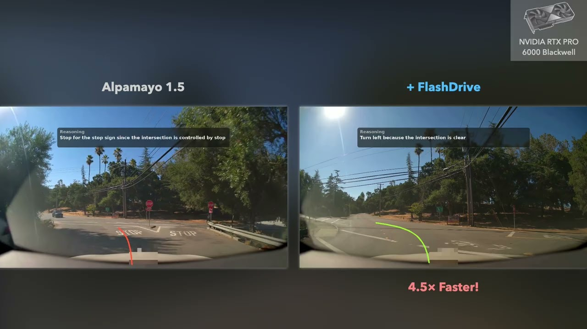

# FlashDrive 논문 분석: Flash Vision-Language-Action Inference For Autonomous Driving

> **작성일**: 2026-09-01 (v2 — 용어 각주·요약 구조 개선·그림 추가. 이전 판: `flashdrive_analysis_v1_backup.md`)
> **분석 대상**: [FlashDrive 프로젝트 페이지](https://z-lab.ai/projects/flashdrive/) (Z Lab, UCSD)
> **상태 주의**: 페이지에 "This is an early preview. The paper and additional results will be available shortly."라고 명시되어 있음. **arXiv 논문은 아직 미공개**(GitHub 배지: "arXiv coming soon"). 본 분석은 프로젝트 페이지(블로그)와 GitHub 저장소를 근거로 한다. [OpenReview 제출 페이지](https://openreview.net/forum?id=kuZrNI5oZM)가 존재하지만 봇 차단으로 접근 불가 — 리뷰/venue 정보는 **확인 불가**.

---

## 1. TL;DR (핵심 요약)

**한 줄 요약**: "생각하는" 자율주행 AI는 너무 느렸다(스텝당 0.7초). FlashDrive는 추론 파이프라인 곳곳에 숨은 4가지 낭비를 각각 제거해, 정확도 손실 없이 4.5배 빠른 159ms — 실시간 주행이 가능한 속도 — 를 만들었다.

### 문제 — 추론(reasoning)에는 시간이 든다

- 최신 자율주행 VLA[^vla] 모델은 chain-of-thought[^cot] 추론으로 희귀 상황(long-tail)을 단계별로 "생각"하며 주행 결정을 내린다. 대표 주자가 NVIDIA의 오픈소스 모델 **Alpamayo 1.5**(10B 파라미터[^param], Qwen3-VL[^qwen] 기반).
- 그런데 이 "생각" 때문에 느리다: RTX PRO 6000 GPU에서 **스텝당 716ms(약 1.4Hz)** — 안전 주행의 실시간 요구에 크게 미달.
- 병목이 한 곳이 아니다. 추론 4단계 — 비전 인코딩(88ms) → 프리필(177ms) → 디코딩(264ms) → 액션 생성(187ms)[^stages] — 에 지연이 고르게 분산되어, **한 단계만 고쳐서는 실시간 도달 불가**.

### 해결 — 단계마다 다른 "중복성"을 찾아 각개격파 (알고리즘-시스템 공동 설계)

| 단계 | 발견한 중복성 | 기법 |
|---|---|---|
| Encode/Prefill | 연속 스텝 간 카메라 프레임 75% 중복 | **Streaming Inference** — KV 캐시[^kv] 재사용으로 새 프레임만 처리 |
| Decode | 주행 추론 토큰(~16개)의 낮은 엔트로피[^entropy] | **Speculative Reasoning** — DFlash 블록 확산[^bd] 드래프터로 8토큰씩 한 번에 제안·검증[^spec] |
| Action | flow matching[^fm] 중간 디노이징 스텝의 속도장 평탄성 | **Adaptive-Step Flow Matching** — 중간 스텝 속도 캐싱·재사용 |
| Prefill+Decode | 가중치의 수치적 여유 | **W4A8 양자화**[^quant] (ParoQuant) — 이상치 억제로 CoT 누적 오차 통제 |
| 전 단계 | GPU 커널 디스패치 오버헤드 | **CUDA Graphs**[^cudagraph] + 커널 융합[^fusion] |

이 중복성들이 서로 **직교**(다른 단계, 다른 원인)라서 가속 효과가 상쇄 없이 누적된다.

### 결과 — 4.5× 가속, 정확도는 오히려 소폭 개선

- **지연**: 716ms → **159ms (4.5×)**, RTX PRO 6000 기준. 모든 단계가 3.4~7×씩 가속.
- **정확도**: ADE@6.4s[^ade] 1.72m → **1.56m (개선)**, minADE@6.4s 0.77 → 0.84m (0.1m 이내 변동).
- **범용성**: 차량용 Jetson Thor부터 데이터센터 GPU까지 5개 플랫폼에서 **4.0–5.7× 일관 가속**, 단일 구현.
- **재현성**: 코드 MIT 라이선스 [공개](https://github.com/z-lab/flashdrive) + HuggingFace 체크포인트.
- 의미: sub-200ms는 chain-of-thought를 포기하지 않는 **실시간 VLA 주행 배포의 진입점**.

**저자**: Zekai Li\*, Yihao Liang\*, Hongfei Zhang, Jian Chen, Zhijian Liu (\*공동 1저자) — [프로젝트 페이지](https://z-lab.ai/projects/flashdrive/). GitHub bibtex에는 Yesheng Liang도 포함 ([README](https://github.com/z-lab/flashdrive)) · **소속**: [Z Lab](https://z-lab.ai/), UCSD ML Systems Group · **연도**: 2026

---

## 2. 대표 그림

*그림 1 — 공식 데모 영상 프레임: 동일 교차로 장면에서 좌측 Alpamayo 1.5, 우측 +FlashDrive("4.5× Faster!"). 각 화면 상단에 모델이 생성한 추론 텍스트("Stop for the stop sign…", "Turn left because the intersection is clear")와 예측 궤적 오버레이가 표시된다. RTX PRO 6000 Blackwell에서 실행.*
*출처: FlashDrive 프로젝트 페이지 프리뷰 영상 — [YouTube tDzMYGD_1dA](https://www.youtube.com/watch?v=tDzMYGD_1dA) (썸네일 캡처, 로컬 사본: `assets/flashdrive_demo_preview.jpg`)*

> **그림 관련 주의**: 논문 PDF가 미공개라 **정적 아키텍처 다이어그램이 아직 존재하지 않는다**. 프로젝트 페이지의 그림(지연 분해 막대, ablation 표, 속도장 U-커브 차트)은 전부 웹에서 동적 렌더링되는 HTML/CSS 컴포넌트로, 이미지 파일이 없다(GitHub 저장소에도 이미지 0개 — API로 확인). 해당 그림들의 데이터는 본 문서 3·4·5장의 표와 [웹페이지 버전](https://z-lab.ai/projects/flashdrive/)의 차트로 재현했다. 논문 공개 시 원본 그림 추가 필요.

---

## 3. 등장 배경

### 3.1 자율주행의 long-tail 문제와 VLA 패러다임

전통적 자율주행 시스템은 인지(perception)와 계획(planning)을 분리한 모듈식 구조인데, 이는 희귀하고 복잡한 "long-tail" 시나리오에서 취약하다. **Vision-Language-Action(VLA) 모델**[^vla]은 chain-of-thought 추론을 end-to-end[^e2e] 주행에 통합해, 낯선 상황을 단계별로 "생각"하며 명시적 추론 흔적(reasoning trace)과 궤적 예측을 함께 산출한다. ([프로젝트 페이지](https://z-lab.ai/projects/flashdrive/))

### 3.2 NVIDIA Alpamayo: 최초의 오픈소스 추론형 주행 VLA

- NVIDIA는 2026년 1월 5일 CES에서 **Alpamayo 1**(10B 파라미터)을 발표 — "업계 최초의 오픈소스 추론형 VLA 주행 모델". Chain-of-Causation[^cot](인과 연쇄) 추론으로 각 주행 결정을 해석·감사 가능하게 만든다. ([NVIDIA 뉴스룸](https://nvidianews.nvidia.com/news/alpamayo-autonomous-vehicle-development), [TechCrunch](https://techcrunch.com/2026/01/05/nvidia-launches-alpamayo-open-ai-models-that-allow-autonomous-vehicles-to-think-like-a-human/))
- 이후 **Alpamayo 1.5**(10B, Qwen3-VL 기반)가 공개됨 ([HuggingFace nvidia/Alpamayo-1.5-10B](https://huggingface.co/nvidia/Alpamayo-1.5-10B); 프로젝트 페이지 기술), 2026년 8월에는 34B 규모 **Alpamayo 2 Super**도 발표됨 ([NVIDIA 기술 블로그](https://developer.nvidia.com/blog/generate-trajectories-reasoning-traces-and-auto-labels-with-nvidia-alpamayo-2-super/))

### 3.3 문제: "추론에는 시간이 든다"

Alpamayo 1.5는 RTX PRO 6000에서 **스텝당 716ms(약 1.4Hz)** — 안전 주행의 실시간 요구에 크게 못 미친다. 추론 능력(CoT 토큰 생성)이 곧 지연의 원천이라는 딜레마가 FlashDrive의 출발점이다. ([프로젝트 페이지](https://z-lab.ai/projects/flashdrive/))

### 3.4 Z Lab의 연구 계보

FlashDrive는 단독 논문이 아니라 Z Lab의 효율 추론 스택을 자율주행 VLA에 집약한 결과물이다. 아래 두 기술은 같은 랩이 먼저 발표한 범용 LLM 가속 기법으로, FlashDrive가 부품처럼 가져다 쓴다 (ICML·ICLR는 머신러닝 분야 최상위 국제 학회 — 두 기법 모두 동료 심사를 통과한 검증된 연구라는 의미):

| 선행 연구 | 내용 | venue | FlashDrive에서의 역할 |
|---|---|---|---|
| [DFlash](https://z-lab.ai/projects/dflash/) | 블록 확산(block diffusion)[^bd] 기반 speculative decoding, 최대 6× 무손실 가속 | ICML 2026 | 추론 토큰 디코딩 가속 |
| [ParoQuant](https://z-lab.ai/projects/paroquant/) ([arXiv:2511.10645](https://arxiv.org/abs/2511.10645)) | Scaled pairwise rotation으로 이상치[^outlier]를 억제하는 4비트 양자화 | ICLR 2026 | W4A8 양자화 |

---

## 4. 문제 정의: 병목은 한 곳이 아니라 모든 곳에 있다

VLA 주행 모델의 추론은 4단계로 나뉜다[^stages]: **① 비전 인코딩 → ② 프롬프트 프리필 → ③ 추론 토큰 디코딩(자동회귀[^autoreg]) → ④ flow matching 액션 생성**.

Alpamayo 1.5 프로파일링 결과(RTX PRO 6000, [프로젝트 페이지](https://z-lab.ai/projects/flashdrive/)):

| 단계 | Encode | Prefill | Decode | Action | 합계 |
|---|---|---|---|---|---|
| 지연(ms) | 88 | 177.2 | 263.8 | 187.4 | **716** |

Decode+Action이 전체의 약 2/3이지만, Encode/Prefill도 무시할 수 없는 크기 — **단일 단계 최적화로는 실시간에 도달 불가**하며 전체 스택을 공략해야 한다. 이것이 이 논문의 핵심 문제 설정이자, "algorithm-system co-design"이라는 접근의 근거다.

---

## 5. 방법론 심층 분석 (5가지 기법)

각 기법은 파이프라인의 서로 다른 단계에서 서로 다른 **중복성(redundancy)** 을 겨냥한다. 이하 내용의 출처는 별도 표기 없는 한 [프로젝트 페이지](https://z-lab.ai/projects/flashdrive/)와 [GitHub README](https://github.com/z-lab/flashdrive).

### 5.1 Streaming Inference — 시간적 중복 제거 (Encode/Prefill 단계)

**관찰**: 챗봇 VLM과 달리 주행 VLA는 연속 멀티카메라 스트림을 처리한다. 매 스텝 슬라이딩 윈도[^window](예: 4프레임 × 4뷰)를 입력받는데, 연속 스텝 간 **프레임 75%가 겹친다**(4프레임 중 3개 동일). 매번 전체 윈도를 재인코딩하는 것은 낭비.

**기법**: 새 프레임만 처리하는 스트리밍 전략.
- **KV 캐시 재사용**[^kv]: 이전 3프레임의 KV 캐시를 유지해 비전 연산 75% 제거
- **Pre-RoPE key 캐싱**[^rope]: rotary embedding을 적용하기 전의 key를 캐싱하고 위치 임베딩은 즉석 적용 — 오래된 프레임 퇴출/새 프레임 도착 시의 동적 위치 이동에 대응
- **커스텀 스트리밍 어텐션 마스크**: view-major 토큰 순서에서 새 프레임이 현재·이전 뷰의 프레임에만 어텐션하도록 하여 인과성 유지

**핵심 통찰 — 비대칭 미세조정**: 스트리밍 KV 캐시는 근사이므로 정확도가 떨어진다(ADE 1.85→2.30m). 직관적 해법인 **VLM 전체 미세조정은 오히려 크게 악화**(4.97m)시킨다. 이유: 자동회귀로 생성되는 추론 토큰은 최근 토큰 위주로 어텐션해 오래된 캐시에 강건하지만, **action expert[^expert]는 cross-attention[^xattn]으로 KV 캐시 전체를 통합**하므로 작은 분포 불일치도 증폭된다. 따라서 **VLM은 동결하고 action expert만 미세조정** — 배포 시 겪을 누적 근사 오차에 노출시키기 위해 여러 스트리밍 스텝을 무그래디언트로 롤아웃[^rollout]해 캐시를 채운 뒤 마지막 스텝에서만 그래디언트를 켠다.

| 구성 (Alpamayo 1 기준) | ADE@6.4s (m)↓ | minADE@6.4s (m)↓ |
|---|---|---|
| Baseline (스트리밍 없음) | 1.85 | 0.80 |
| + Streaming | 2.30 | 1.07 |
| + Streaming, VLM 미세조정 | 4.97 | 3.38 |
| **+ Streaming, expert만 미세조정** | **1.93** | **0.87** |

### 5.2 Speculative Reasoning — 낮은 엔트로피 활용 (Decode 단계)

**관찰**: 주행 도메인 추론 시퀀스는 짧고(~16토큰), 고도로 구조화된 템플릿을 따르며, 풍부한 시각 컨텍스트가 내용 대부분을 이미 결정한다 → 토큰당 엔트로피[^entropy]가 개방형 언어 생성보다 훨씬 낮아 **speculative decoding[^spec]의 수락률(acceptance rate)이 높다**.

**기법**: 자체 개발한 **[DFlash](https://z-lab.ai/projects/dflash/)**(블록 확산 모델[^bd])를 병렬 드래프터로 사용. 기존 방법(EAGLE 계열[^eagle])처럼 토큰을 하나씩 드래프트하지 않고 **한 번의 forward[^fw]로 후보 블록 전체(8토큰)를 생성**해 구조화된 추론의 블록 내 상관관계를 포착하고, 타깃 모델이 한 번의 forward로 검증한다. Speculative verification은 출력 분포가 표준 자동회귀 디코딩과 동일함을 보장하므로 **품질 손실 0**.

(참고 — DFlash 자체 성능: Qwen3-8B에서 GSM8K 5.20×, MATH-500 6.17×, EAGLE-3 대비 평균 2.5×+ 가속. 출처: [DFlash 페이지](https://z-lab.ai/projects/dflash/))

### 5.3 Adaptive-Step Flow Matching — 속도장 평탄성 활용 (Action 단계)

**관찰**: 추론 결과를 궤적 웨이포인트로 변환하는 flow matching[^fm] 헤드는 표준적으로 10 디노이징 스텝을 쓴다. 단순히 스텝 수를 균일하게 줄이면 품질이 떨어지는데, 속도장(velocity field)을 프로파일링하니 **U자형 패턴** 발견:
- 스텝 0→1: 속도 변화 27%
- 중간 스텝: 6% 미만 (코사인 유사도 0.99+)
- 마지막 스텝: 다시 상승

**물리적 해석**: 초기 스텝은 거시적 궤적 구조(차선 선택, 회전 방향)를 결정하고, 마지막 스텝은 물리적으로 타당한 궤적 매니폴드[^manifold]에 스냅(운동학 제약·도로 기하 만족)하며, 중간 스텝은 이미 결정된 경로의 미세 조정만 수행한다. "끝점이 신호를 담고, 중간은 관성만 담는다."

**기법**: 중간 스텝의 속도를 캐싱·재사용해 action expert forward를 건너뛰고, 계산을 궤적을 실제로 결정하는 스텝에 집중.

### 5.4 W4A8 Quantization (ParoQuant) — 수치적 여유 활용 (Prefill+Decode 단계)

**설계 선택 1 — 왜 W4A16이 아니라 W4A8인가**[^quant]: AWQ[^awq] 같은 표준 W4A16은 메모리 바운드인 디코딩만 돕고 컴퓨트 바운드인 프리필은 건드리지 못한다.[^bound] 챗봇 LLM은 디코딩이 지배적이라 괜찮지만, **VLA는 매 프롬프트에 수천 개의 비전 토큰이 있어 프리필이 무시 불가**. W4A8은 4비트 가중치로 디코딩 대역폭을, 8비트 활성값의 INT8 행렬곱으로 프리필 연산을 동시에 공략한다 — "One format, two bottlenecks addressed."

**설계 선택 2 — 왜 ParoQuant인가**: VLA 추론은 CoT 토큰(~16개/스텝)을 생성하고 각 토큰이 다시 모델에 피드백되므로 **양자화 오차가 토큰마다 누적**된다. AWQ는 가중치 이상치[^outlier]를 부분적으로만 처리해 잔여 오차가 궤적 드리프트로 축적된다. 자체 개발한 **[ParoQuant](https://arxiv.org/abs/2511.10645)**의 scaled pairwise rotation(Givens 회전 기반, GPU 병렬 실행 가능한 독립 쌍 회전 8세트 + 채널별 스케일링)이 이상치를 더 철저히 억제해 누적 오차를 통제한다.

**구현 세부**: vLLM의 Marlin 커널[^marlin]로 INT4 가중치/INT8 활성값 실행, **action expert는 bf16[^bf16] 유지** ([README](https://github.com/z-lab/flashdrive)) — 5.1절의 통찰(action expert의 오차 민감성)과 일관된 설계.

### 5.5 System Optimizations — 디스패치 오버헤드 제거 (전 단계)

VLA 파이프라인은 비전 인코딩·언어 처리·자동회귀 디코딩·확산 기반 액션 생성이 섞인 이질적 워크로드로, 알고리즘 개선만으로는 성능을 남긴다:
- **CUDA Graphs**[^cudagraph]: 자동회귀 생성의 수많은 소형 커널 런치로 인한 CPU 디스패치 오버헤드를, 4단계 파이프라인 전체를 CUDA 그래프로 컴파일해 제거 (`torch.compile` + 정적 KV 캐시, [README](https://github.com/z-lab/flashdrive))
- **Kernel Fusion**[^fusion]: Q/K/V 프로젝션을 단일 커널로 융합, MLP의 gate/up 프로젝션 병합, max-autotune 컴파일로 메모리 왕복과 런치 공백 제거

---

## 6. 실험 결과

### 6.1 단계별 지연 (RTX PRO 6000, [프로젝트 페이지](https://z-lab.ai/projects/flashdrive/))

| | Encode | Prefill | Decode | Action | **합계** |
|---|---|---|---|---|---|
| Alpamayo 1.5 | 88 | 177.2 | 263.8 | 187.4 | **716ms** |
| + FlashDrive | 12.5 | 52.5 | 48.2 | 46.2 | **159ms (4.5×)** |

모든 단계가 가속됐고, **어떤 단일 최적화도 전체 가속의 절반을 넘지 않는다** — 중복성이 직교하므로 이득이 포화 없이 누적된다는 논문의 핵심 주장을 뒷받침.

### 6.2 정확도 (RTX PRO 6000, [프로젝트 페이지](https://z-lab.ai/projects/flashdrive/))

| 지표 | Alpamayo 1.5 | + FlashDrive | 해석 |
|---|---|---|---|
| ADE@6.4s[^ade] ↓ | 1.72m | **1.56m** | 소폭 개선 |
| minADE@6.4s ↓ | 0.77m | 0.84m | 0.1m 이내 변동 |

### 6.3 크로스 플랫폼 ([프로젝트 페이지](https://z-lab.ai/projects/flashdrive/))

| | Jetson Thor | RTX 3090 | RTX 4090 | RTX 5090 | RTX PRO 6000 |
|---|---|---|---|---|---|
| Alpamayo 1.5 (ms) | 3770 | 1788 | 1187 | 986 | 716 |
| + FlashDrive (ms) | 944 | 363 | 209 | 192 | 159 |
| Speedup | 4.0× | 4.9× | 5.7× | 5.1× | 4.5× |

차량 탑재용 Jetson Thor[^jetson]부터 데이터센터 GPU까지 **단일 구현으로 4.0–5.7×** — 특정 하드웨어에 과적합된 최적화가 아님을 보여준다. (단, Jetson Thor에서는 944ms로 여전히 실시간 미달 — 아래 한계 참조.)

### 6.4 GitHub 재현 벤치마크 ([README](https://github.com/z-lab/flashdrive), `scripts/infer.py`, RTX PRO 6000, PhysicalAI-AV[^physai] 100클립)

| 모델 | minADE ↓ | 지연/윈도 | Speedup |
|---|---|---|---|
| Alpamayo 1.5 | 1.705 | 717ms | 1.0× |
| + FlashDrive | **1.573** | **151ms** | **4.7×** |
| Alpamayo 1 (R1) | 1.869 | 704ms | 1.0× |
| + FlashDrive | **1.662** | **155ms** | **4.5×** |

단계별: Encode 7.3×, Prefill 3.5×, Decode 6.0×, Action 4.1× (Alpamayo 1.5 기준). **Alpamayo 1과 1.5 양쪽 모두에서 minADE가 개선**되어 일반성을 보인다.

> 참고: 블로그(716→159ms)와 README(717→151ms)의 수치가 미세하게 다르다. 측정 스크립트/조건 차이로 보이며, 블로그의 minADE(0.77/0.84)와 README의 minADE(1.705/1.573)는 평가 설정(샘플 수 등)이 다른 것으로 추정 — **정확한 평가 프로토콜은 논문 공개 전까지 확인 불가**.

---

## 7. 의의와 한계

### 의의
1. **실시간 추론형 VLA의 실용화 진입점**: 단일 GPU sub-200ms는 CoT 추론을 포기하지 않고도 실시간 배포가 가시권에 들어오는 수치. 논문 스스로 "이는 주행을 넘어 지연이 제약인 모든 VLA 배포로 확장된다"고 주장.
2. **"중복성의 직교성"이라는 프레임**: 병목이 분산된 파이프라인에서 단계별로 다른 종류의 중복성을 찾아 각개격파하면 이득이 곱해진다는 관점 — VLA 추론 최적화의 방법론적 템플릿으로 가치.
3. **도메인 특성의 적극 활용**: 주행 추론의 낮은 엔트로피(speculative), 카메라 스트림의 시간 중복(streaming), 궤적 디노이징의 U자형 속도장(adaptive step) 등 자율주행 도메인 지식이 각 기법의 근거.
4. **action expert의 오차 민감성 발견**: cross-attention 기반 연속 출력 헤드가 근사 오차를 증폭한다는 관찰(VLM 미세조정이 오히려 해로움, expert는 bf16 유지)은 VLA 시스템 설계 전반에 시사점.
5. **재현 가능성**: MIT 라이선스 코드 + HuggingFace 체크포인트([z-lab/flashdrive 컬렉션](https://huggingface.co/collections/z-lab/flashdrive)) 공개.

### 한계 및 유보 사항
1. **논문 미공개**: arXiv "coming soon" 상태. Ablation[^abl] 전모, 평가 프로토콜, 관련 연구 비교는 현재 확인 불가. 블로그 수치는 저자 자체 보고이며 동료 심사 여부 미확인(OpenReview 제출은 존재하나 접근 불가).
2. **차량 하드웨어에선 아직 실시간 미달**: Jetson Thor에서 944ms(~1Hz). Sub-200ms는 워크스테이션급 GPU 기준.
3. **대상 모델 특이성**: Alpamayo 1/1.5(10B, Qwen3-VL 기반) 두 모델에서 검증. 다른 VLA 아키텍처로의 일반화는 주장 수준.
4. **주행 품질 평가의 폭**: 공개된 지표는 open-loop[^openloop] 궤적 오차(ADE/minADE)뿐. closed-loop 주행 성능·안전성 평가는 미공개.
5. **라이선스**: 코드 자체는 MIT지만 Alpamayo 가중치는 NVIDIA 비상업 라이선스를 따름 ([README](https://github.com/z-lab/flashdrive)).

---

## 8. 관련 연구 맥락에서의 위치

- **추론형 주행 VLA의 등장**(2025–2026): NVIDIA Alpamayo 계열이 Chain-of-Causation 추론으로 해석 가능한 주행을 열었으나, 추론 비용이 배포 장벽 ([NVIDIA Research: Alpamayo 1](https://research.nvidia.com/publication/2025-10_alpamayo-r1))
- **LLM 추론 가속 기법의 VLA 이식**: speculative decoding(EAGLE-3 → DFlash), 양자화(AWQ → ParoQuant), KV 캐시 재사용 등 LLM 서빙 기법을 VLA의 멀티모달·연속제어 특성(비전 스트림, flow matching 헤드)에 맞게 재설계한 것이 차별점
- **Z Lab의 효율 AI 스택**: SparseVILA(ICCV 2025), SparseLoRA(ICML 2025), DFlash(ICML 2026), ParoQuant(ICLR 2026)에 이은 응용 집약 프로젝트. 같은 랩의 VLASH(비동기 실시간 VLA)와 상보적 ([Z Lab 프로젝트 목록](https://z-lab.ai/))

---

## 9. 참고 자료

| 자료 | URL | 비고 |
|---|---|---|
| FlashDrive 프로젝트 페이지 | https://z-lab.ai/projects/flashdrive/ | 1차 출처 (early preview) |
| FlashDrive 데모 영상 | https://www.youtube.com/watch?v=tDzMYGD_1dA | 그림 1 출처 |
| FlashDrive GitHub | https://github.com/z-lab/flashdrive | 코드·벤치마크·bibtex |
| FlashDrive 모델 | https://huggingface.co/collections/z-lab/flashdrive | 체크포인트 |
| OpenReview 제출 | https://openreview.net/forum?id=kuZrNI5oZM | 접근 불가(봇 차단) — venue/리뷰 확인 불가 |
| DFlash | https://z-lab.ai/projects/dflash/ · arXiv 2602.06036 | ICML 2026 |
| ParoQuant | https://arxiv.org/abs/2511.10645 | ICLR 2026 |
| NVIDIA Alpamayo 발표 | https://nvidianews.nvidia.com/news/alpamayo-autonomous-vehicle-development | 2026-01-05, CES |
| Alpamayo 1.5 모델 | https://huggingface.co/nvidia/Alpamayo-1.5-10B | 비상업 라이선스 |
| Alpamayo 1 연구 페이지 | https://research.nvidia.com/publication/2025-10_alpamayo-r1 | |
| Z Lab | https://z-lab.ai/ | UCSD, PI: Zhijian Liu |

---

## 용어 해설 (각주)

[^vla]: **VLA (Vision-Language-Action)**: 카메라 영상(Vision)을 이해하고, 언어(Language)로 상황을 추론한 뒤, 실제 제어 행동(Action — 여기서는 주행 궤적)까지 한 모델에서 출력하는 통합 모델. "보고 → 말로 생각하고 → 움직이는" 모델.

[^cot]: **Chain-of-Thought (CoT) / Chain-of-Causation (CoC)**: 모델이 답을 바로 내지 않고 중간 추론 과정을 텍스트로 생성하며 단계별로 생각하는 기법. Alpamayo의 CoC는 이를 주행에 특화한 형태로, "정지 표지판이 있다 → 교차로가 통제된다 → 정지한다"처럼 인과 관계로 연결된 추론 흔적을 생성한다.

[^stages]: **추론 4단계**: ① **Encode(인코딩)** — 카메라 이미지를 비전 인코더가 토큰(숫자 벡터)으로 변환. ② **Prefill(프리필)** — 변환된 비전 토큰 + 텍스트 프롬프트 전체를 LLM이 한 번에 병렬 처리해 문맥을 구축(첫 토큰 생성 전 준비 단계). ③ **Decode(디코딩)** — 추론 텍스트를 토큰 하나씩 순차 생성(가장 느린 부분). ④ **Action(액션)** — 추론 결과를 바탕으로 실제 주행 궤적(좌표열)을 생성.

[^kv]: **KV 캐시 (Key-Value cache)**: Transformer의 어텐션 계산에서 각 토큰마다 만들어지는 Key/Value 벡터를 저장해 두는 메모리. 한 번 계산한 토큰의 K/V를 캐시에 보관하면 다음 계산에서 재계산 없이 재사용할 수 있다. FlashDrive는 이를 프레임 단위로 확장 — 이미 본 카메라 프레임의 K/V를 다음 스텝에서 그대로 재사용해 비전 연산 75%를 없앤다.

[^rope]: **RoPE (Rotary Position Embedding) / Pre-RoPE 캐싱**: 토큰의 "위치" 정보를 벡터 회전으로 주입하는 기법. 문제: 슬라이딩 윈도에서 오래된 프레임이 빠지면 남은 프레임들의 위치 번호가 바뀌어, 위치가 이미 새겨진 캐시는 무효가 된다. 해법: 위치를 새기기 **전(pre-RoPE)** 상태의 key를 캐싱하고, 사용 시점에 그때그때 맞는 위치를 새로 새긴다.

[^entropy]: **엔트로피(토큰당)**: 다음 토큰이 얼마나 예측하기 어려운가의 척도. 주행 추론은 짧고(~16토큰) 템플릿화되어 있고 시각 정보가 내용을 거의 결정하므로 엔트로피가 낮다 = 다음 토큰이 뻔하다 = 작은 모델이 미리 맞히기 쉽다.

[^spec]: **Speculative decoding (추측 디코딩)**: 작은 "드래프터" 모델이 다음 토큰들을 미리 여러 개 추측하고, 큰 타깃 모델이 그것들을 한 번의 병렬 forward로 검증-수락/거부하는 가속 기법. 수학적으로 출력 분포가 타깃 모델 단독 실행과 동일함이 보장되어 품질 손실이 없다. **수락률**이 높을수록(추측이 잘 맞을수록) 빨라진다.

[^bd]: **블록 확산 (block diffusion) / DFlash 블록 드래프트**: 일반 드래프터(EAGLE 등)는 토큰을 하나씩 순차 추측하지만, DFlash는 확산(diffusion) 모델 방식으로 **8토큰 블록 전체를 단 한 번의 forward로 동시에** 생성한다. 블록 내 토큰들 사이의 상관관계(구조화된 추론 문장의 패턴)를 자연스럽게 포착하는 것이 장점.

[^fm]: **Flow matching / 디노이징 스텝 / 속도장**: 노이즈에서 시작해 목표 데이터(주행 궤적)로 점진 변환하는 생성 기법. 매 스텝 "지금 어느 방향으로 얼마나 움직일지"를 나타내는 **속도(velocity)** 를 예측해 여러 번(표준 10스텝) 반복한다 — 이 반복이 디노이징. **속도장**은 스텝별 속도 예측의 집합. FlashDrive의 발견: 중간 스텝들의 속도가 거의 안 변하므로(코사인 유사도 0.99+), 다시 계산하지 않고 **이전 스텝의 속도를 캐싱해 재사용**해도 품질이 유지된다 = "중간 스텝 속도 캐싱".

[^quant]: **양자화 표기 W4A8 / W4A16**: W=가중치(Weight), A=활성값(Activation, 중간 계산값)의 비트 수. W4A16 = 가중치만 4비트로 압축(계산은 16비트) → 메모리 로딩만 빨라짐(디코딩에 유리). W4A8 = 가중치 4비트 + 활성값 8비트 → INT8 정수 행렬곱 하드웨어 가속까지 가능(연산량 많은 프리필에도 유리).

[^outlier]: **이상치(outlier)**: 가중치/활성값 분포에서 유독 큰 소수의 값. 낮은 비트로 양자화할 때 이 값들 때문에 표현 범위가 낭비되어 정밀도가 크게 떨어진다. 양자화 기법들의 핵심 과제가 이상치 처리이며, ParoQuant는 채널 쌍 회전(pairwise rotation)으로 이상치를 분산시켜 억제한다.

[^marlin]: **vLLM / Marlin 커널**: vLLM은 가장 널리 쓰이는 오픈소스 LLM 서빙(추론 실행) 엔진. Marlin은 그중 낮은 비트로 압축된 가중치의 행렬곱을 효율적으로 실행하는 고성능 GPU 커널.

[^bf16]: **bf16 (bfloat16)**: 16비트 부동소수점 형식. 여기서는 "양자화하지 않은 원래 정밀도"라는 의미 — 오차에 민감한 action expert만 압축 없이 bf16으로 남겨둔다.

[^cudagraph]: **CUDA Graph**: GPU 작업(커널)들의 실행 순서를 미리 그래프로 "녹화"해 두고 통째로 재생하는 NVIDIA 기술. 자동회귀 생성처럼 작은 커널을 수백 번 실행하는 워크로드에서, 매번 CPU가 커널을 하나씩 지시하는 오버헤드(디스패치 비용)를 제거한다.

[^fusion]: **커널 융합(kernel fusion)**: 연속된 여러 GPU 연산(예: Q, K, V 세 번의 프로젝션)을 하나의 커널로 합쳐 실행하는 최적화. 중간 결과를 GPU 메모리에 썼다가 다시 읽는 왕복과 커널 실행 사이의 공백을 없앤다.

[^autoreg]: **자동회귀(autoregressive) 디코딩**: 토큰을 한 번에 하나씩, 이전 출력을 입력에 더해가며 순차 생성하는 방식. 병렬화가 안 되어 LLM 추론에서 가장 느린 구간이 된다.

[^expert]: **Action expert**: VLA 내부에서 언어 모델의 추론 결과를 받아 연속적인 주행 궤적(좌표)을 생성하는 전용 서브네트워크. Alpamayo에서는 flow matching 방식으로 동작한다.

[^xattn]: **Cross-attention**: 한 모듈(action expert)이 다른 모듈(VLM)의 전체 출력(KV 캐시)을 참조하는 어텐션. 캐시 전체를 통합하므로 캐시에 낀 작은 오차도 궤적 출력에 크게 반영된다 — expert가 스트리밍 근사·양자화에 민감한 이유.

[^ade]: **ADE / minADE (Average Displacement Error)**: 예측 궤적과 실제 주행 궤적 사이의 평균 거리 오차(미터). @6.4s는 6.4초 시계(horizon) 기준. **minADE**는 모델이 여러 후보 궤적을 낼 때 그중 가장 좋은 것의 오차. 낮을수록 좋다.

[^openloop]: **Open-loop vs closed-loop 평가**: open-loop은 기록된 주행 데이터에 대해 궤적 예측 오차만 재는 방식(모델의 출력이 다음 입력에 영향 없음). closed-loop은 모델이 실제/시뮬레이션 차량을 직접 제어하며 누적 효과까지 평가하는 방식 — 실전 성능에 더 가깝지만 FlashDrive는 아직 open-loop 결과만 공개.

[^param]: **10B 파라미터**: 10 Billion = 모델의 학습된 숫자(파라미터) 100억 개. 챗봇용 대형 모델보다 작지만 차량에서 실시간 실행하기엔 큰 규모.

[^qwen]: **Qwen3-VL**: 알리바바가 공개한 오픈소스 비전-언어 모델(VLM). Alpamayo 1.5는 이를 기반으로 주행 추론·액션 생성을 얹어 만들었다.

[^e2e]: **End-to-end**: 인지→계획→제어를 별도 모듈로 나누지 않고, 입력(카메라)부터 출력(궤적)까지 신경망 하나가 통째로 처리하는 방식. 전통적 모듈식 자율주행의 반대 개념.

[^window]: **슬라이딩 윈도**: 최근 N개 프레임만 담는 고정 크기 창. 새 프레임이 오면 가장 오래된 프레임을 밀어내며 한 칸씩 미끄러진다.

[^rollout]: **무그래디언트 롤아웃**: 학습(가중치 갱신) 없이 모델을 여러 스텝 실행만 시키는 것. 실제 배포처럼 오차가 낀 KV 캐시를 만들어 둔 뒤 마지막 스텝에서만 학습을 켠다.

[^eagle]: **EAGLE (계열)**: 현재 널리 쓰이는 speculative decoding 드래프터 계열. 토큰을 하나씩 순차 추측하는 자동회귀 방식이라 가속이 2~3×에 그친다 — DFlash의 비교 기준선.

[^fw]: **Forward (pass)**: 입력을 신경망에 한 번 통과시켜 출력을 얻는 것. LLM 추론 비용의 기본 단위 — "forward 16회" = 모델 전체를 16번 돌린다는 뜻.

[^manifold]: **궤적 매니폴드**: 차량이 물리적으로 실제 그릴 수 있는 궤적들의 집합(급격한 꺾임 불가, 회전 반경 한계 등). "매니폴드에 스냅" = 예측을 이 집합 위의 가장 가까운 타당한 궤적으로 맞춰 넣는다는 뜻.

[^awq]: **AWQ**: Activation-aware Weight Quantization — 널리 쓰이는 대표적 4비트 가중치 양자화 기법(2023). 가중치만 압축(W4A16)하므로 디코딩만 빨라진다. ParoQuant의 비교 기준선.

[^bound]: **메모리 바운드 vs 컴퓨트 바운드**: 속도를 결정하는 병목의 종류. 메모리 바운드 = 메모리에서 데이터를 읽어오는 시간이 병목(디코딩: 토큰마다 전체 가중치를 읽음). 컴퓨트 바운드 = 연산량 자체가 병목(프리필: 수천 토큰을 한꺼번에 행렬곱). W4는 전자를, A8은 후자를 푼다.

[^jetson]: **Jetson Thor**: NVIDIA의 차량 탑재용(온보드) AI 컴퓨터 모듈. 실제 자율주행차에 들어가는 하드웨어라 데이터센터 GPU보다 훨씬 느리다.

[^physai]: **PhysicalAI-AV**: NVIDIA가 공개한 자율주행 주행 영상 데이터셋. FlashDrive 벤치마크는 여기서 100개 클립 사용.

[^abl]: **Ablation**: 구성 요소를 하나씩 빼거나 바꿔가며 각각의 기여도를 측정하는 실험. "5개 기법 중 뭐가 얼마나 기여했나"를 증명하는 표준 절차. 현재는 streaming 미세조정 ablation만 공개됨.
