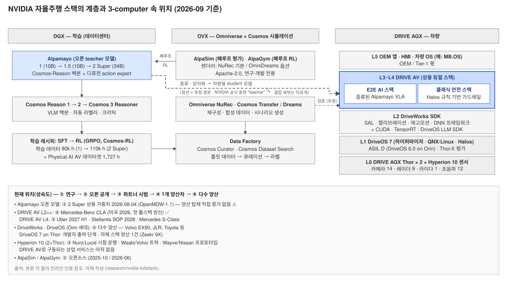
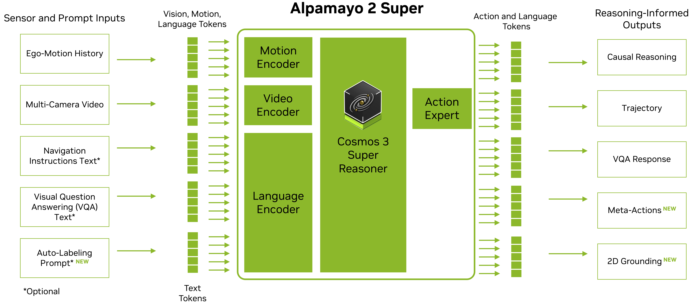
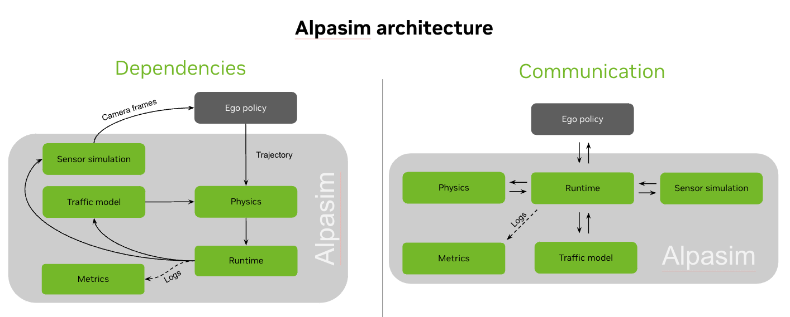
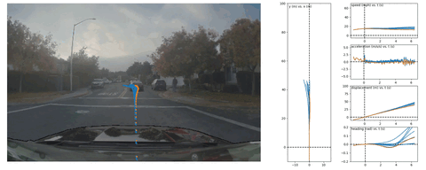

# 3장. 자율주행 스택 — Alpamayo와 DRIVE AV 구성

> **작성일**: 2026-09-02 · **조사 범위**: NVIDIA 자율주행 소프트웨어 스택(3.1 Alpamayo 오픈 모델 패밀리, 3.2 DRIVE AV 상용 스택 구성). Thor/Hyperion 하드웨어 사양은 1장, DriveOS·Halos·인증은 2장, CUDA/NeMo 일반은 4장, TensorRT/추론 일반은 5장 담당이므로 여기서는 참조만 한다.
> **관련 문서**: [7장 Physical AI/Cosmos](07-physical-ai-cosmos.md) · [부록 A Tier-1 관점](appendix-a-tier1-workscope.md) · [출처 목록](reference/references.md) · [이미지 출처](reference/images.md)
> **검증 등급**: ✅ 두 출처 교차검증 · 🔍 1차 출처(GitHub 등) 원문 확인 · 📄 검색 요약·2차 출처만 · ⚠️ 미확인/추정
> **조사 제약**: 이 세션은 nvidia.com·arxiv.org·huggingface.co·언론사 원문에 직접 접근할 수 없었다. NVIDIA 뉴스룸·블로그·논문 인용은 검색 엔진 요약(📄)에 의존하며, GitHub 저장소(README·코드·LICENSE)만 원문(🔍)으로 확인했다. 후속 세션에서 📄 항목의 원문 재확인이 필요하다.

---

## 3.0 한눈 요약 · 전체 그림 속 위치

### 3.0.1 한 줄 요약

NVIDIA의 자율주행 스택은 **"학습된 엔드투엔드 AI 스택 + 병렬로 도는 클래식 안전 스택"의 듀얼 스택**이다. 오픈 모델 **Alpamayo**는 그 AI 스택의 두뇌(추론형 VLA[^vla])이고, **DRIVE AV**는 그것을 안전 스택·센서·차량과 묶어 OEM에 라이선스하는 **상용 제품**이다. 오픈 Alpamayo는 "연구용이며 완전한 주행 스택이 아니다"라고 NVIDIA 스스로 명시하고, 차량용은 Thor에 맞게 증류·양자화된 파생 모델이 DRIVE AV 안에서 돈다.

### 3.0.2 핵심 사실 5가지

1. **DRIVE AV 정의**: "L2++부터 L4까지 가능한 풀스택 자율주행 소프트웨어 플랫폼"이며 "안전 인증된 인식·계획 스택과 엔드투엔드 AI 스택을 짝지은 듀얼 스택 아키텍처" ([NVIDIA DRIVE AV 제품 페이지](https://www.nvidia.com/en-us/solutions/autonomous-vehicles/drive-av/)) 📄. "코어 주행용 AI E2E 스택 + Halos 위에 구축된 병렬 클래식 안전 스택"이라는 설명은 제품 페이지와 Mercedes CLA 블로그가 일치한다 ([NVIDIA 블로그 2026-01-05](https://blogs.nvidia.com/blog/drive-av-software-mercedes-benz-cla/)) ✅.
2. **Alpamayo 계보**: Alpamayo-R1 논문([arXiv 2511.00088](https://arxiv.org/abs/2511.00088), 2025-10/11) → Alpamayo 1(10B, CES 2026-01-05 개명) → Alpamayo 1.5(10B, Cosmos-Reason2 백본, GitHub 릴리스 커밋 2026-03-20) → **Alpamayo 2 Super**(34B = 32B Cosmos 3 Super Reasoner + 2B 디퓨전 expert, 2026-05-31 발표, 2026-08-04 상용 가중치 공개) ([alpamayo-recipes README](https://raw.githubusercontent.com/NVlabs/alpamayo-recipes/main/README.md) 🔍, [alpamayo2 README](https://raw.githubusercontent.com/NVlabs/alpamayo2/main/README.md) 🔍, [NVIDIA 블로그 2026-08](https://blogs.nvidia.com/blog/alpamayo-2-super-open-model-now-available/) 📄).
3. **배포 스탠스**: "차량에서 직접 돌기보다 Alpamayo 모델은 대규모 teacher 모델로서, 개발자가 파인튜닝하고 자기 AV 스택의 백본으로 증류한다" ([HF 블로그](https://huggingface.co/blog/nvidia/nvidia-alpamayo-2)) 📄. 저장소도 "DRIVE AGX Thor에서 차량 내 지연·안전 요구를 만족하는 student 모델로 증류·양자화하기 위한 teacher"라고 쓴다 🔍.
4. **첫 양산**: Mercedes-Benz CLA가 "NVIDIA 풀스택 DRIVE AV 소프트웨어"를 탑재한 첫 차량(미국 L2++ 2026) ✅. NVIDIA는 이를 "Alpamayo를 탑재한 첫 승용차"로 표현했지만([CES 2026 특별 발표](https://blogs.nvidia.com/blog/2026-ces-special-presentation/)) 📄, 오픈 가중치가 그대로 차량에서 도는지는 미확인 ⚠️.
5. **L4 로드맵**: DRIVE Hyperion 10(2×Thor, 카메라 14·레이더 9·라이다 1·초음파 12)이 2025-10-28 발표되었고 ✅, Uber와 "전적으로 NVIDIA 소프트웨어로 구동되는" L4 로보택시를 2027 상반기 LA·SF에서 시작해 2028년까지 28개 도시로 확장한다고 발표했다 ([Uber IR 2026-03-16](https://investor.uber.com/news-events/news/press-release-details/2026/NVIDIA-to-Launch-L4-Software-Driven-Robotaxis-on-Uber-Across-28-Cities-by-2028/default.aspx)) ✅.

### 3.0.3 요약 지도

*그림 3-1. NVIDIA 자율주행 스택의 계층과 3-computer 속 위치. 실선 = 출처로 확인, 점선 = 추정. 자체 작성.*

| 기술 | 3-computer 위치 | 레이어 | 담당 역할 | 현재 위치(성숙도) | 다음 이정표 |
|---|---|---|---|---|---|
| **Alpamayo (오픈 모델)** | DGX(학습·teacher) | L3 모델 | 다중 카메라 영상 + 자차 이력 → 인과 추론 트레이스 + 궤적(+메타액션) | ② 오픈 가중치 공개(2 Super 2026-08-04, OpenMDW-1.1) 🔍 / 양산 탑재 직접 증거 없음 ⚠️ | Uber L4 2027 상반기 📄, AlpaGym 확장 🔍 |
| **DRIVE AV (상용 스택)** | AGX(차량) | L3~L5 | E2E AI 스택 + 클래식 안전 스택, 인식~제어 | ④ 1개 양산차(Mercedes CLA, 2026 미국 L2++) ✅ / L4는 ③ 파트너 시범 | Stellantis SOP 2028 ✅, Mercedes S-Class L4 📄 |
| **DriveWorks SDK** | AGX | L2 SDK | 센서 추상화·캘리브레이션·에고모션·DNN 실행 | ⑤ 다수 양산(Orin 세대), DriveOS 7에 통합 📄 | DriveOS 7.2.5(2026-08) 📄 |
| **Hyperion 10 L4 스택** | AGX | L0~L3 레퍼런스 | 2×Thor + 센서 세트 + DriveOS + DRIVE AV L4 | ③ 파트너 시범(Nuro/Lucid 시험 운행, Waabi/Volvo 트럭) ✅ | Uber 2027, Stellantis 2028 ✅ |
| **AlpaSim / AlpaGym** | OVX(시뮬) | L4 시뮬·데이터 | 폐루프 평가·RL (7장 상세) | ② 오픈소스(Apache-2.0, 2025-10 / 2026-06) 🔍 | Traffic Simulator "coming soon" 🔍 |

성숙도 척도: ① 연구·프리뷰 → ② 오픈 가중치/SDK 공개 → ③ 파트너 시범 → ④ 1개 이상 양산차 → ⑤ 다수 OEM 양산.

### 3.0.4 시사점 (Tier-1 관점 요약, 상세는 부록 A)

- 오픈 Alpamayo를 쓰더라도 **안전 스택·센서 통합·차량 검증은 별도**다. NVIDIA README가 "실세계 센서 입력 접근이 없고, 다중·중복 안전 메커니즘을 포함하지 않으며, 자동차 등급 검증을 거치지 않았다"고 명시한다 ([NVlabs/alpamayo](https://github.com/NVlabs/alpamayo)) 🔍.
- DRIVE AV를 라이선스하면 듀얼 스택까지 받지만, 그래도 "시스템 통합·검증·안전 승인·배포"는 Tier-1 몫이라는 것이 Magna·Bosch 발표의 요지다(부록 A.0).
- 2026년 9월 시점 **양산 증거가 있는 것은 CLA(L2++) 하나**이며, L4는 전부 2027~2028 목표다. 성숙도 판단은 이 구분을 유지해야 한다.

---

## 3.1 Alpamayo

### 3.1.1 정의·포지셔닝·버전 타임라인

| 항목 | 내용 |
|---|---|
| 전체 그림 속 위치 | 3-computer 중 DGX(학습) 쪽에 사는 **teacher 모델**. 레이어 L3(모델). 차량(AGX)에는 증류된 파생 모델이 DRIVE AV E2E 스택 안에서 돈다 |
| 담당 역할 | 입력: 다중 카메라 영상 + 자차 운동 이력(+1.5부터 내비게이션·텍스트) → 출력: Chain-of-Causation[^coc] 추론 트레이스 + 궤적(2 Super는 메타액션·VQA·그라운딩·자동 라벨 추가). 대체하는 것: 인식→계획의 학습된 부분. 대체하지 않는 것: 클래식 안전 스택, 제어기, 센서 드라이버 |
| 현재 위치 | ② 오픈 가중치·코드·레시피 공개. 최신 Alpamayo 2 Super(34B) 2026-08-04 상용 가중치 공개 ✅. 양산 탑재 직접 증거 없음 ⚠️ |
| 다음 이정표 | Uber L4 로보택시 2027 상반기(LA·SF) 📄, AlpaGym 확장·RL 보상 세부 공개 🔍 |

**NVIDIA의 정의.** CES 2026 뉴스룸은 Alpamayo를 "안전하고 추론 기반인 차세대 AV 개발을 가속하기 위해 설계된 오픈 AI 모델·시뮬레이션 도구·데이터셋 패밀리"라고 소개했다 ([NVIDIA 뉴스룸 2026-01-05](https://nvidianews.nvidia.com/news/alpamayo-autonomous-vehicle-development)) 📄. GitHub README의 정의는 더 구체적이다. "Alpamayo 1 Nano는 주행 궤적과 Chain-of-Causation 추론을 짝지은 10B 오픈 추론 VLA 모델"이며 "다중 카메라 영상과 자차 운동 이력으로부터 궤적과 CoC 추론 트레이스를 생성한다" ([NVlabs/alpamayo README](https://raw.githubusercontent.com/NVlabs/alpamayo/main/README.md)) 🔍. TechCrunch는 "센서 입력을 받아 조향·제동·가속을 작동시키면서 자기가 취할 행동의 이유를 설명한다"고 요약했다 ([TechCrunch 2026-01-05](https://techcrunch.com/2026/01/05/nvidia-launches-alpamayo-open-ai-models-that-allow-autonomous-vehicles-to-think-like-a-human/)) 📄.

**스택 안의 위치.** 세 가지 관계가 공개 자료로 확인된다.

- **Cosmos와의 관계**: VLM 백본이 Cosmos-Reason(1) → Cosmos-Reason2 → Cosmos 3 Super Reasoner로 세대 교체됐다 ([alpamayo-recipes README](https://raw.githubusercontent.com/NVlabs/alpamayo-recipes/main/README.md)) 🔍. 즉 Alpamayo는 7장의 Cosmos Reason 위에 주행 전용 행동 디코더를 얹은 구조다.
- **DRIVE AV와의 관계**: DRIVE AV 제품 페이지는 "Alpamayo VLA가 E2E 스택에 배포되어 롱테일 주행이 요구하는 맥락 추론과 의사결정을 제공한다"고 쓴다 ([DRIVE AV 페이지](https://www.nvidia.com/en-us/solutions/autonomous-vehicles/drive-av/)) 📄. 상세는 3.2.8.
- **Hyperion과의 관계**: "DRIVE Hyperion은 Alpamayo 추론 모델과 함께 L4 자율성에 도달하는 확장성과 지능을 제공하는 양산 준비 하드웨어 플랫폼·레퍼런스 아키텍처" ([Alpamayo 제품 페이지](https://www.nvidia.com/en-us/solutions/autonomous-vehicles/alpamayo/)) 📄.

**버전 타임라인** (GitHub 커밋 🔍와 검색 요약 📄 종합)

| 날짜 | 이벤트 | 근거 |
|---|---|---|
| 2025-10-28~11 | Alpamayo-R1 논문 공개(arXiv 2511.00088) | [research.nvidia.com](https://research.nvidia.com/publication/2025-10_alpamayo-r1) 📄 |
| 2025-11-19 | `NVlabs/alpamayo` 초기 커밋 | [커밋 이력](https://github.com/NVlabs/alpamayo/commits/main) 🔍 |
| 2025-12-01 | NeurIPS 2025에서 10B 모델 + 1,727시간 데이터셋 공개 | [TechCrunch](https://techcrunch.com/2025/12/01/nvidia-announces-new-open-ai-models-and-tools-for-autonomous-driving-research) ✅ |
| 2026-01-05 | CES 2026: Alpamayo 패밀리 발표, R1 → **Alpamayo 1** 개명, AlpaSim·데이터셋 동시 공개 | [뉴스룸](https://nvidianews.nvidia.com/news/alpamayo-autonomous-vehicle-development) ✅ |
| 2026-03-20 | `NVlabs/alpamayo1.5` "Release of Alpamayo-1.5-10B" 커밋(GTC 2026 시기) | [커밋 이력](https://github.com/NVlabs/alpamayo1.5/commits/main) 🔍 |
| 2026-04~05 | `alpamayo-recipes` 공개(SFT·RL·양자화 레시피) | [커밋 이력](https://github.com/NVlabs/alpamayo-recipes/commits/main) 🔍 |
| 2026-05-31 / 06-01 | GTC Taipei: **Alpamayo 2 Super** 발표 | [뉴스룸](https://nvidianews.nvidia.com/news/nvidia-alpamayo-2-super-robotaxis) 📄 |
| 2026-06-16 | `NVlabs/alpagym` 공개(폐루프 RL) | [커밋 이력](https://github.com/NVlabs/alpagym/commits/main) 🔍 |
| **2026-08-04** | Alpamayo 2 Super 상용 사용 가능 가중치 공개(OpenMDW-1.1) | [NVIDIA 블로그](https://blogs.nvidia.com/blog/alpamayo-2-super-open-model-now-available/) 📄 + 저장소 README 갱신 커밋 🔍 ✅ |
| 2026-08-29 | `alpamayo`·`alpamayo1.5` 최신 커밋(디퓨전 expert CUDA graph 최적화) | 커밋 이력 🔍 |

명명 정리: Alpamayo-R1 = Alpamayo 1 = "Alpamayo 1 Nano"(10B) → Alpamayo 1.5 Nano(10B) → Alpamayo 2 Super(34B). "Nano/Super" 접미는 Cosmos 3의 Edge/Nano/Super 체계와 닮았으나 "Alpamayo 2 Nano"의 존재는 확인되지 않았다 ⚠️.

### 3.1.2 아키텍처

*그림 3-2. Alpamayo 2 Super 아키텍처. 출처: [NVlabs/alpamayo2](https://github.com/NVlabs/alpamayo2) 저장소 `alpamayo2super_arch.png` (Apache-2.0 코드 저장소 내 자료, © NVIDIA).*

**공통 구조.** 논문 초록은 "Physical AI용으로 사전학습된 VLM인 Cosmos-Reason과, 실시간으로 동역학적으로 실현 가능한 궤적을 생성하는 디퓨전 기반 궤적 디코더를 결합한 모듈형 VLA 아키텍처"라고 설명한다 ([arXiv 2511.00088](https://arxiv.org/abs/2511.00088)) ✅📄. 동작 흐름은 다음과 같다(논문 Fig.1 설명 📄).

1. 다중 카메라 이미지와 자차 운동이 비전 인코더를 거쳐 시각 토큰이 된다.
2. VLM 백본(Cosmos-Reason)이 **CoC 추론과 이산 궤적 토큰을 자기회귀적으로 생성**한다.
3. 추론 시 flow matching[^fm] 기반 action-expert 디코더가 이산 궤적 토큰을 추론 출력에 조건화하여 **연속적·운동학적으로 실현 가능한 웨이포인트**로 변환한다.

GitHub는 이를 "Cosmos-Reason 백본 + action expert(디퓨전 expert)"로 요약한다 🔍.

**세대별 사양**

| 항목 | Alpamayo 1 (R1) | Alpamayo 1.5 | Alpamayo 2 Super |
|---|---|---|---|
| 파라미터 | 10B 🔍 | 10B 🔍 | 34B = 32B VLM + 2B 디퓨전 expert 🔍 (블로그는 디코더 2.3B 📄) |
| 백본 | Cosmos-Reason(1) — 공개 Reason1은 7B 단일이므로 7B VLM + ~3B로 추정 ⚠️ | Cosmos-Reason2(Qwen3-VL 기반) 🔍 | Cosmos 3 Super Reasoner(Qwen3-VL 호환 메시지 규약) 🔍 |
| 입력 카메라 | 4대: cross-left 120°, front-wide 120°, cross-right 120°, front-tele 30° (코드 확인) 🔍 | 가변(적을수록 정확도 저하 가능) 🔍 | 6카메라×4프레임 프로파일(ID 0~6 중 태스크별 6개), 마케팅상 "최대 7카메라 360°" 🔍📄 |
| 이력 | 16스텝@10Hz ≈ 1.6초 자차 운동 🔍 | 동일 | 이력 웨이포인트 16, 이력 토큰 48, 미래 토큰 128 🔍 |
| 출력 | 6.4초 궤적(64 웨이포인트@10Hz) + CoC 트레이스 🔍 | 동일 + 내비게이션·텍스트 조건 🔍 | 궤적 + CoC + 메타액션(종·횡·차선) + VQA + 2D 그라운딩 + 자동 라벨 🔍 |
| 추가 기능 | — | RL 포스트트레이닝, 내비 조건("200m 앞 좌회전"), 일반 VQA 🔍📄 | "한 번의 순회로 궤적·인과 설명·메타액션 생성" 📄 |
| 추론 VRAM | ≥24GB 🔍 | 단일 24GB / 16샘플 40GB / CFG 60GB 🔍 | H100 80GB 테스트 🔍 |

**Chain of Causation.** 논문은 CoC 데이터셋을 "하이브리드 자동 라벨링 + 사람 개입 파이프라인으로 만든, 주행 행동과 정렬된 **결정 기반·인과적으로 연결된 추론 트레이스**"라고 정의한다 ✅📄. Alpamayo 2 자동 라벨링 코드는 4단계 구조를 드러낸다: `critical_components_analysis` → `ego_vehicle_motion_analysis` → `trajectory_analysis` → `chain_of_causation` ([text_tasks.py](https://raw.githubusercontent.com/NVlabs/alpamayo2/main/src/alpamayo2_super/text_tasks.py)) 🔍. 즉 "무엇이 중요한가 → 자차가 무엇을 하고 있나 → 궤적은 어떤가 → 왜 그렇게 하는가" 순으로 인과를 서술한다.

**출처 상충**: 궤적 길이는 README "6.4초" vs 논문 요약 "6초"이나 64×0.1초 = 6.4초가 산술적으로 맞다. 2 Super 크기는 발표 당일 X 포스트 "32B" vs 이후 "34B(32B+2B)"로 정리한다 ⚠️.

### 3.1.3 학습 레시피·데이터

**단계.** 논문은 "추론을 이끌어내는 지도 파인튜닝(SFT)과 강화학습(RL)을 쓰는 다단계 학습 전략"이라고 요약한다 ✅📄. 공개 레시피 기준으로 구체화하면:

| 단계 | 내용 | 근거 |
|---|---|---|
| 사전학습 데이터 | Alpamayo 1은 "80,000시간 주행 데이터의 10억 장 이상 이미지"로 학습 | [recipes README](https://raw.githubusercontent.com/NVlabs/alpamayo-recipes/main/README.md) 🔍 + HF 카드 📄 ✅ |
| 데이터 혼합 | "CoC 추론 트레이스 + Cosmos-Reason Physical AI 데이터셋 + NVIDIA 내부 독점 주행 데이터"(1.5는 공개 주행 데이터 추가) | [HF 모델카드](https://huggingface.co/nvidia/Alpamayo-R1-10B) 📄 |
| CoC 라벨 규모 | "70만 개 CoC 추론 트레이스"; 자동 라벨링은 GPT-5급 teacher VLM이 2Hz 2초 윈도마다 생성, 약 10%는 사람이 2단계 주석, 전문가 감사 2,000클립 대비 92% 일치 | 단일 검색 요약 ⚠️ |
| SFT(공개 레시피) | Stage 1 VLM 파인튜닝 → Stage 2 VLM 동결 후 디퓨전 expert 학습. 8×H100 80GB, 전체 데이터셋 약 97TB | [alpamayo1_sft README](https://raw.githubusercontent.com/NVlabs/alpamayo-recipes/main/recipes/alpamayo1_sft/README.md) 🔍 |
| RL(오픈루프, 공개 레시피) | GRPO[^grpo]를 Cosmos-RL로 실행. 데모 보상 = ADE[^ade] + 승차감(가속·저크·요레이트 범위 내 비율), 오차 3m 초과 시 −1 클램프. 대규모 학습은 640 GPU(정책 512 + 롤아웃 128, 80노드) | [alpamayo1_x_rl README](https://raw.githubusercontent.com/NVlabs/alpamayo-recipes/main/recipes/alpamayo1_x_rl/README.md) 🔍 |
| RL 효과(논문) | "RL 포스트트레이닝이 추론 품질 45%, 추론-행동 일관성 37% 개선" | arXiv ✅📄 |
| Alpamayo 1.5 SFT | Cosmos-Reason2 백본, VQA 데이터로 LingoQA Scenery(148k QA) 사용, DeepSpeed ZeRO-2 | [alpamayo1_5_sft README](https://raw.githubusercontent.com/NVlabs/alpamayo-recipes/main/recipes/alpamayo1_5_sft/README.md) 🔍 |
| Alpamayo 2 Super | "110,000시간 이상 주행 데이터", RL 포스트트레이닝. "올바른 추론을 생성하는 모델과 올바른 행동을 실행하는 모델 사이의 간극(embodiment misalignment)"을 폐루프 RL로 다룸 | recipes README 🔍, [HF 블로그](https://huggingface.co/blog/nvidia/nvidia-alpamayo-2) 📄 |

**폐루프 도구(7장 상세).** AlpaSim은 "연구·개발 전용 오픈소스 AV 시뮬레이션 플랫폼"으로 NuRec 렌더러를 기본으로 쓰고 Alpamayo-R1·1.5 정책을 지원한다 ([NVlabs/alpasim](https://raw.githubusercontent.com/NVlabs/alpasim/main/README.md)) 🔍. AlpaGym은 "E2E 자율주행 정책용 RL 프레임워크"로 AlpaSim을 환경, Cosmos-RL을 분산 학습기로 쓰며 현재 Alpamayo 1.5(10B)만 지원한다 ([NVlabs/alpagym](https://raw.githubusercontent.com/NVlabs/alpagym/main/README.md)) 🔍. Cosmos-RL 자체는 "Cosmos 3로 이관 권고, 유지보수 모드"다 ([cosmos-rl README](https://raw.githubusercontent.com/nvidia-cosmos/cosmos-rl/main/README.md)) 🔍.

**양자화·증류.** 1.5용 양자화 레시피는 FP8(약 11GB, 2.00×)과 FP8+NVFP4 AutoQuant(약 9GB, 2.44×)를 NVIDIA ModelOpt로 제공하며, `--fake_quant`로 "TensorRT 같은 다운스트림 SDK"용 Q/DQ 노드를 삽입한다 ([alpamayo1_5_quant README](https://raw.githubusercontent.com/NVlabs/alpamayo-recipes/main/recipes/alpamayo1_5_quant/README.md)) 🔍. 반면 HF 블로그가 언급한 "증류 스크립트"는 레시피 저장소 커밋 이력에 없다 ⚠️.

### 3.1.4 평가

| 지표 | 값 | 근거 |
|---|---|---|
| 계획 정확도(R1) | 궤적 전용 베이스라인 대비 "어려운 케이스에서 최대 12% 개선" | arXiv 요약 ✅📄 |
| 폐루프(R1) | "폐루프 시뮬레이션에서 근접 조우율 35% 감소" | arXiv 요약 ✅📄 |
| 지연(R1) | "99ms 실시간 지연" — 하드웨어 미상, 2차 단일 출처 | [introl 블로그](https://introl.com/blog/nvidia-neurips-alpamayo-r1-physical-ai-december-2025) ⚠️ |
| LingoQA(2 Super) | 79.2(Lingo-Judge), 약 37~40개 평가 모델 중 1위. Qwen2.5-VL-72B 대비 +17.0, Gemini 2.5 Pro 대비 +15.1, GPT-4o 대비 +23.2 | [NVIDIA 블로그](https://blogs.nvidia.com/blog/alpamayo-2-super-open-model-now-available/) ✅📄 |
| 궤적(2 Super) | minADE₆ 0.911m; AV reasoning 0.433; 메타액션 IoU 종 61.91 / 횡 74.59 / 차선 73.55; VQA 유사도 0.652; 2D 그라운딩 IoU 0.71; AlpaSim Score 1.50±0.13 | [NVIDIA 개발자 블로그](https://developer.nvidia.com/blog/generate-trajectories-reasoning-traces-and-auto-labels-with-nvidia-alpamayo-2-super/) 📄 (평가셋 정의 미확인 ⚠️) |
| 공개 벤치마크 | nuScenes / NAVSIM / Waymo Open E2E 수치는 **발견되지 않음**. 평가는 내부 데이터 + AlpaSim + LingoQA 중심으로 보임 | ⚠️ |

**NVIDIA Physical AI AV 데이터셋.** `nvidia/PhysicalAI-Autonomous-Vehicles`(게이트)는 1,727시간, 25개국 2,500개 이상 도시, 20초 클립 310,895개(멀티카메라 306,152·LiDAR 298,326·레이더 160,761), 미국·EU 약 반반이다 ([HF 데이터셋](https://huggingface.co/datasets/nvidia/PhysicalAI-Autonomous-Vehicles)) ✅📄. 전체 용량은 약 97TB 🔍. 라이선스는 "NVIDIA AV Dataset License, 합성 데이터는 CC-BY-4.0" 🔍. 파생셋으로 `-NuRec`(26.01: 729 장면, 26.04: 1,606 장면, 약 1.5TB), `-NCore`, 합성 시나리오셋이 있다 🔍📄.

**채택 지표.** HF 다운로드 40만+(2026-06) → 50만+(2026-08), "플랫폼에서 가장 많이 채택된 자율주행용 오픈 추론 모델 패밀리" 📄. GitHub 스타(2026-09-02 열람): alpamayo 2.0k, alpasim 1.2k, alpamayo1.5 360, alpamayo2 222 🔍.

### 3.1.5 차량 배포 경로

| 항목 | 내용 | 근거 |
|---|---|---|
| 공식 문구 | "Alpamayo는 NVIDIA DRIVE AGX Thor로의 검증된 차량 배포 경로를 제공한다" | [Alpamayo 페이지](https://www.nvidia.com/en-us/solutions/autonomous-vehicles/alpamayo/) 📄 |
| 실제 스탠스 | "차량에서 직접 돌기보다 … teacher 모델" 📄 + README "Thor에서 차량 내 지연·안전 요구를 만족하는 student로 증류·양자화" 🔍 | ✅ |
| Thor 지연 수치 | 공식 수치 **미공개**. 학술 논문 "Latency Analysis and Optimization of Alpamayo 1"([arXiv 2605.08975](https://arxiv.org/html/2605.08975v1), IEEE RTCSA 2026)이 DGX Spark에서 전처리/비전/프리필/디코드/액션 5개 성분을 프로파일링하고 다중 추론→단일 추론으로 지연을 줄였다고 보고 | 📄 |
| 온보드 런타임 | DriveOS 7의 "DriveOS LLM SDK: 순수 C++ LLM 런타임, 추측 디코딩·KV 캐시·LoRA, FP16/FP8/NVFP4/INT4" ([개발자 블로그](https://developer.nvidia.com/blog/streamline-llm-deployment-for-autonomous-vehicle-applications-with-nvidia-driveos-llm-sdk/)) 📄. Alpamayo와의 명시적 연결 문장은 스니펫 하나뿐 ⚠️. 5장 참조 | |
| Mercedes CLA | Huang: "NVIDIA DRIVE 풀스택 위에 Alpamayo를 탑재한 첫 승용차가 곧 신형 CLA로 도로에 나온다" 📄; "DRIVE AV 소프트웨어가 CLA에서 데뷔, 미국 L2++ 양산 출시는 올해(2026) 말" 📄; Electrek "2026년 1분기 출하" 📄. 실제 고객 인도 증거는 2026-09 기준 미확인 ⚠️ | ✅(스택)/⚠️(모델) |
| Uber 로보택시 | "전적으로 NVIDIA 소프트웨어로 구동되는 자율주행차를 2027 상반기 LA·SF에서 시작, 2028년까지 28개 도시… 핵심은 DRIVE Hyperion과 NVIDIA Alpamayo" | [Uber IR](https://investor.uber.com/news-events/news/press-release-details/2026/NVIDIA-to-Launch-L4-Software-Driven-Robotaxis-on-Uber-Across-28-Cities-by-2028/default.aspx) ✅ |
| CES 파트너 | "JLR, Lucid, Uber 등 모빌리티 리더와 Berkeley DeepDrive 등 연구 커뮤니티" | 뉴스룸 📄 |

### 3.1.6 공개 산출물·라이선스

| 산출물 | 공개 범위 | 라이선스 | 근거 |
|---|---|---|---|
| `NVlabs/alpamayo` (1) | 추론 코드, SFT/RL 스크립트(→recipes 이동) | 코드 Apache-2.0 / 가중치 OpenMDW-1.1[^openmdw] | 🔍 |
| `NVlabs/alpamayo1.5` | 코드 + 가중치 `nvidia/Alpamayo-1.5-10B`, "상용 사용 허용" | Apache-2.0 / OpenMDW-1.1 | 🔍 |
| `NVlabs/alpamayo2` | 코드 + 가중치 `nvidia/Alpamayo2-Super`(게이트) | "소스코드 Apache 2.0 / 가중치 OpenMDW-1.1", 블로그 "수정·재배포·상용 사용 가능" | 🔍📄 |
| `alpamayo-recipes` | SFT(1·1.5), 오픈루프 RL(GRPO), 양자화(FP8/NVFP4) | Apache-2.0 | 🔍 |
| `alpasim` / `alpagym` | 시뮬레이터 전체 / 폐루프 RL 하니스 | Apache-2.0 | 🔍 |
| Physical AI AV 데이터셋 | 1,727시간(게이트) | NVIDIA AV Dataset License, 합성 CC-BY-4.0 | 🔍 |
| **비공개** | 내부 독점 주행 데이터(80k/110k 시간 코퍼스 대부분) 📄, Alpamayo 1의 RL 가중치·내비·VQA 🔍, RL 추론 보상 세부("future releases") 🔍, AlpaSim Traffic Simulator("coming soon") 🔍, DRIVE AV 프로덕션 스택·Thor 배포 엔진 ⚠️, CoC 자동 라벨러 코드 공개 여부 ⚠️ | | |

**라이선스 상충.** Alpamayo-R1-10B HF 카드 초기 문구는 "비상용, 상용은 요청 시"였다는 스니펫이 있으나 같은 가중치가 README에는 OpenMDW-1.1로 표기되고, 1.5/2 Super는 "상용 허용"이다. HF 카드가 개정된 것으로 보이나 원문 확인 불가 ⚠️. OpenMDW-1.1은 Linux Foundation이 2026-05-28 공개한 오픈 모델·데이터·가중치 라이선스로, NVIDIA가 Cosmos·GR00T·Nemotron에 채택했다는 2차 보도가 있다 ([unite.ai](https://www.unite.ai/nvidias-alpamayo-2-super-opens-robotaxi-development-to-commercial-use/)) 📄. Cosmos 저장소 LICENSE 원문은 "Model Materials를 제한 없이 다룰 권리를 무상 부여… 출력물의 사용·수정·공유에 제한이나 의무를 부과하지 않음", 특허 보복 시 종료, 배포 시 고지 유지 조항을 담는다 ([NVIDIA/Cosmos LICENSE](https://raw.githubusercontent.com/NVIDIA/Cosmos/main/LICENSE)) 🔍.

**연구용 한계 고지(원문).** "Alpamayo 1 is not a fully fledged driving stack. Among other limitations, it lacks access to critical real-world sensor inputs, does not incorporate required diverse and redundant safety mechanisms, and has not undergone automotive-grade validation for deployment." 1.5도 동일 문장 ([NVlabs/alpamayo](https://github.com/NVlabs/alpamayo), [alpamayo1.5](https://github.com/NVlabs/alpamayo1.5)) 🔍. 두 저장소 모두 DRIVE·Thor·Hyperion을 언급하지 않는다 🔍.

---

## 3.2 DRIVE AV 구성

### 3.2.1 DRIVE AV 정의와 계층 위치

| 항목 | 내용 |
|---|---|
| 전체 그림 속 위치 | 3-computer 중 AGX(차량). 레이어 L3(모델)~L5(주행 기능)에 걸친 **상용 소프트웨어 스택** |
| 담당 역할 | 센서 입력 → 인식·융합·계획·제어 → 차량 액추에이션 명령. DriveOS·DriveWorks(아래층)와 OEM 차량 OS·HMI(위층) 사이 |
| 현재 위치 | ④ Mercedes CLA(L2++, 2026 미국) 양산 ✅. L4 스택은 ③ 파트너 시범(2027~2028 SOP) ✅ |
| 다음 이정표 | Uber 2027 상반기, Stellantis SOP 2028, Mercedes S-Class L4 |

**정의.** DRIVE AV 제품 페이지 문구는 다음 셋으로 압축된다 ([DRIVE AV 페이지](https://www.nvidia.com/en-us/solutions/autonomous-vehicles/drive-av/)) 📄.

- "양산 준비된 L2++부터 L4까지 안전하고 확장 가능한 자동 주행을 가능하게 하는 풀스택 자율주행 소프트웨어 플랫폼."
- "듀얼 스택 아키텍처는 안전 인증된 인식·계획 스택과 복잡한 실세계 시나리오용으로 설계된 엔드투엔드 AI 스택을 짝짓는다."
- "DRIVE AV는 코어 주행에 AI 엔드투엔드 스택을 쓰고, 그 옆에서 NVIDIA Halos 안전 시스템 위에 구축된 병렬 클래식 안전 스택이 중복성과 안전 가드레일을 더한다." (CLA 블로그와 동일 문장 ✅)

Uber는 2026-03 발표에서 이를 "NVIDIA가 풀스택 L4 소프트웨어 공급자로 진화"하는 것으로 표현했다 ([Uber IR](https://investor.uber.com/news-events/news/press-release-details/2026/NVIDIA-to-Launch-L4-Software-Driven-Robotaxis-on-Uber-Across-28-Cities-by-2028/default.aspx)) ✅. 즉 2026년 기준 DRIVE AV는 레퍼런스 앱이 아니라 **OEM에 라이선스되는 제품화된 스택**이다. NVIDIA 자신이 "하이브리드"라는 단어를 쓴 스니펫은 찾지 못했고, 공식 용어는 "dual-stack", "end-to-end AI stack", "classical safety stack", "independent modular stack"이다 ⚠️.

**계층 위치.** 공개 설명을 층별로 모으면 다음과 같다.

| 층 | 공개 설명 | 근거 |
|---|---|---|
| DRIVE AGX Thor (1장) | "2,000 FP4 TFLOPS 이상(INT8 1,000 TOPS)", "360도 센서 입력을 융합하고 트랜스포머·VLA·생성형 AI 워크로드에 최적화" | [뉴스룸 2025-10-28](https://nvidianews.nvidia.com/news/nvidia-uber-robotaxi) 📄 |
| DriveOS (2장) | "세큐어 부트, 안전 지향 하이퍼바이저와 RTOS, 가속 추론용 CUDA·TensorRT, 그리고 인식·센서 융합·차량 시스템 통합 라이브러리를 가진 DriveWorks SDK를 제공." DriveOS 7은 DriveOS LLM SDK·TensorRT 10 추가 | [Thor 개발 키트 블로그](https://blogs.nvidia.com/blog/drive-agx-developer-kit-general-availability/) 📄 |
| DriveWorks (3.2.3) | DriveOS 안의 미들웨어 | [DriveWorks 페이지](https://developer.nvidia.com/drive/driveworks) 📄 |
| DRIVE Hyperion (1장·3.2.4) | "DRIVE AGX SoC와 레퍼런스 보드 설계, DriveOS, 센서 스위트, 그리고 능동 안전·L2+ 주행 스택"(2025-01 문구), "모듈형이라 고객이 필요한 것만 쓸 수 있음" | [뉴스룸 2025-01-06](https://nvidianews.nvidia.com/news/nvidia-drive-hyperion-platform-achieves-critical-automotive-safety-and-cybersecurity-milestones-for-av-development) 📄 |
| **DRIVE AV** | 위 정의 | |
| OEM 앱 | Mercedes: MB.OS가 차량 OS, MB.DRIVE ASSIST PRO가 고객 기능. NVIDIA는 "AI, 풀스택 DRIVE AV 소프트웨어, DRIVE AGX 컴퓨트 플랫폼" 제공 | [Mercedes 기술 페이지](https://group.mercedes-benz.com/technology/autonomous-driving/driving/mb-drive-assist-pro.html) 📄 |

**개발 루프(3-computer).** "DRIVE는 DGX에서 학습, RTX 위 Omniverse·Cosmos에서 시뮬·검증, DRIVE AGX에서 차량 내 컴퓨팅을 아우르는 3-computer 솔루션을 포함하는 엔드투엔드 풀스택 AV 플랫폼" ([developer.nvidia.com/drive](https://developer.nvidia.com/drive)) 📄. CLA 블로그도 "DGX가 다양한 글로벌 데이터셋으로 DRIVE AV 기반 모델을 학습, Omniverse+Cosmos가 배포 전 수천 개 엣지 케이스를 검증, DRIVE AGX가 인식·센서 융합·의사결정을 실시간 처리"라고 재서술한다 📄.

### 3.2.2 구성 모듈

| 항목 | 내용 |
|---|---|
| 전체 그림 속 위치 | DRIVE AV 내부. L3 모델 층(E2E AI 스택)과 L4 규칙 층(클래식 안전 스택)의 병렬 |
| 담당 역할 | E2E 스택: 데이터로부터 총체적 주행 행동 학습. 클래식 스택: 결정론적 규칙으로 가드레일·중복성 |
| 현재 위치 | 2026년 양산 DRIVE AV의 **모듈별 네트워크 이름은 비공개** ⚠️. 공개 분해는 "E2E AI 스택(Alpamayo급 VLA) + 클래식 안전 스택(규칙 기반 인식·계획·제약 처리)" 수준 |
| 다음 이정표 | — |

**학습형 vs 규칙형 분담(공개 진술 기준)**

| 기능 | 학습형/규칙형 | 공개 자료 | 근거 |
|---|---|---|---|
| 코어 주행(인식→계획) | **학습형, E2E**: "데이터로부터 총체적 주행 행동을 학습하는 AI E2E 스택" | Alpamayo VLA가 "E2E 스택에 배포" | DRIVE AV 페이지 📄 |
| 병렬 안전 스택 | **클래식·규칙형**: "안전 인증된 인식·계획 스택", "결정론적 규칙 기반 기능". "Halos Applications 층은 정의된 범위 안에서 동작하도록 분석·설계된 결정론적 규칙 기반 기능으로 AI에 안전 가드레일을 제공" | 개별 모듈명 비공개 | [Halos 로보택시 블로그](https://blogs.nvidia.com/blog/halos-os-robotaxi-safety/) 📄 |
| 클래식 스택의 구체 역할(2차) | "표지판 인식, 충돌 위험 예측, 명시적 제약 처리를 가드레일 로직으로 담당"; "E2E 모델이 빈 틈을 보고 회전이 물리적으로 가능하다고 판단해도 클래식 스택이 규칙을 강제해 행동을 차단" | 2차 해설 | [Turing Post](https://www.turingpost.com/p/av) ⚠️ |
| 센서 융합 | Thor가 "360도 센서 입력을 융합"; DRIVE AGX가 "인식·센서 융합·의사결정을 실시간 처리" | | 뉴스룸·CLA 블로그 📄 |
| 지도·측위 | CLA 시스템은 "카메라 10·레이더 5·초음파 12에 의존하며 **LiDAR나 사전 지도 없이**" 동작. NVIDIA DRIVE Labs(2025-05) "맵리스 주행 강화" 영상 | DRIVE Map 현황 진술 없음 ⚠️ | [autoevolution](https://www.autoevolution.com/news/nvidia-drive-av-software-debuts-in-the-all-new-mercedes-benz-cla-263671.html) 📄 |
| 제어·액추에이션 | DriveWorks "Vehicle and Motion Actuation(VehicleIO)"이 차량을 작동시키고 상태를 제공. OEM 고유 액추에이션(Mercedes "협조 조향: 시스템 해제 없이 언제든 조향 개입 가능")은 OEM 측 | | DriveWorks 문서·Mercedes 📄 |

**공개된 NVIDIA 인식·계획 모델(제품 포함 여부 미확인)**

- 레거시 인식 DNN(≤2020 DRIVE Software 시대): DriveNet(장애물·거리·TTC), PathNet(주행 가능 공간·램프), LightNet(신호등), SignNet(표지판) ([DRIVE Labs](https://blogs.nvidia.com/blog/drive-labs-autonomous-vehicle-ride/), [DriveWorks 3.5 DriveNet](https://docs.nvidia.com/drive/driveworks-3.5/drivenet_mainsection.html)) 📄. 이들이 2026 DRIVE AV에 남아 있는지는 확인 불가 ⚠️.
- 인식 연구: "최대 10억 파라미터 시각 기반 모델과 3D 점유 예측 대규모 사전학습"(CVPR 챌린지), FB-BEV/FB-OCC([NVlabs/FB-BEV](https://github.com/NVlabs/FB-BEV)), BEVFormer 모델카드(build.nvidia.com) 📄.
- 계획 연구: **Hydra-MDP**는 "사람과 규칙 기반 teacher 양쪽에서 다중 목표 증류를 하는 트랜스포머 기반 E2E 계획 프레임워크"로 CVPR 2024 E2E Driving at Scale 챌린지 우승. 저장소는 "회사 정책으로 코드·모델 공개 지연"이라 쓰고 DRIVE AV나 양산 언급은 없다 ([NVlabs/Hydra-MDP](https://github.com/NVlabs/Hydra-MDP)) 🔍.

**해석.** NVIDIA가 2026년 양산 DRIVE AV의 인식·예측·계획 네트워크를 모듈별로 공개한 자료는 이 세션에서 찾지 못했다. 공개 수준은 "E2E AI 스택(Alpamayo급) + 클래식 안전 스택(규칙 기반)"까지이며, 그 아래 세부는 파트너 계약 정보로 추정된다 ⚠️.

### 3.2.3 DriveWorks SDK

| 항목 | 내용 |
|---|---|
| 전체 그림 속 위치 | AGX 차량. L2 SDK/런타임 층. DriveOS의 일부로 배포 |
| 담당 역할 | 센서 추상화(SAL[^sal])·캘리브레이션·에고모션·이미지/포인트클라우드 처리·DNN 실행 프레임워크·차량 액추에이션 인터페이스 |
| 현재 위치 | ⑤ 다수 양산(Orin 세대, DriveOS 6.0.10 + DriveWorks 5.20) 📄. DriveOS 7(Thor)에서는 별도 버전 SDK가 아니라 DriveOS 문서 안의 내장 구성 요소로 문서화 📄 |
| 다음 이정표 | DriveOS 7.2.5(2026-08경 포럼 공지) 📄 |

**모듈(개발자 문서 문구).** "DriveWorks SDK는 다음 모듈을 포함한다: Sensor Abstraction Layer(SAL), Vehicle and Motion Actuation, Image Processing, Point Cloud Processing, DNN Framework, Calibration, Communication, Utility" ([DriveWorks 모듈 문서](https://developer.nvidia.com/docs/drive/driveworks/latest/nvsdk_dw_html/dwx_modules.html)) 📄.

- **SAL**: "센서 추상화 계층과 센서 플러그인은 NVIDIA DRIVE Software의 핵심 구성 요소" 📄. 커스텀 센서는 "(카메라를 제외하고) 통신 평면과 장치별 디코더 함수를 구현해 `.so` 공유 객체로 컴파일"하여 통합한다 ([DriveWorks 4.0 센서 플러그인](https://docs.nvidia.com/drive/driveworks-4.0/sensorplugins_mainsection.html)) 📄. DriveOS 7.0.3은 라이다·레이더 플러그인 샘플을 포함한다 📄. 실례로 OxTS가 DriveWorks 7.03·Thor 전용 GNSS/IMU 플러그인 `.so`를 GitHub에 배포한다 ([OxTS](https://github.com/OxfordTechnicalSolutions/nvidia-driveworks-plugin)) 🔍.
- **Calibration**: "SAL 호환 카메라·레이더·라이다·IMU의 동적 캘리브레이션, 센서 측정과 차량 운동으로 런타임에 파라미터를 재추정" 📄.
- **Egomotion**: "오도메트리 전용 모델과 IMU+오도메트리 모델 두 종류의 운동 모델로 차량 자세를 추적·예측" 📄.
- **DNN Framework**: "커스텀 레이어 지원과 DRIVE AGX 내장 GPU 가속으로 TensorRT 모델을 로드·추론" 📄(TensorRT 일반은 5장).
- Compute Graph Framework(CGF)의 DriveOS 7 지원 여부는 포럼 스레드 존재만 확인 ⚠️.

**버전·배포 형태**

| 사실 | 근거 | 등급 |
|---|---|---|
| DriveOS 6.0.10(Orin)은 DriveWorks 5.20과 함께 출하 | [NVIDIA 포럼](https://forums.developer.nvidia.com/t/announcement-from-nvidia-drive-os-6-0-10-0-is-now-available/303314) | 📄 |
| DriveOS 7.0.3(Thor) 문서 세트는 "DriveWorks SDK"를 DriveOS Linux SDK 개발자 가이드 안에 포함. 7.0.3은 CUDA 12.8, TensorRT 10.10.10, cuDNN 9.7 번들, 마이그레이션 가이드 2025-07-21 | [7.0.3 문서](https://developer.nvidia.com/docs/drive/drive-os/7.0.3/public/drive-os-linux-sdk/embedded-software-components/DRIVE_AGX_SoC/DriveWorks/DriveWorks_SDK/samples/index.html) | 📄 |
| "DriveWorks는 이제 DriveOS와 깊이 통합되고, 실제 AV 프로그램 배포로 검증되었으며, Thor SoC 아키텍처에 최적화" | [DriveWorks 페이지](https://developer.nvidia.com/drive/driveworks) | 📄 |
| DriveOS 7.x에 번들된 DriveWorks 버전 번호 | 미확인 | ⚠️ |
| 라이선스: 헤더 `SPDX-License-Identifier: LicenseRef-NvidiaProprietary`; "바이너리로 제공된 구성 요소를 리버스 엔지니어링·디컴파일·역어셈블 금지"; 제3자 시연도 서면 승인 필요 | [7.0.3 legal](https://developer.nvidia.com/docs/drive/drive-os/7.0.3/public/drive-os-linux-sdk/embedded-software-components/DRIVE_AGX_SoC/DriveWorks/DriveWorks_SDK/legal.html) | 📄 |
| 소스 공개 범위: 샘플·플러그인 인터페이스 헤더·툴 설정. 핵심 라이브러리는 바이너리. 접근은 "NVIDIA Developer 계정 + DRIVE AGX SDK Developer Program 멤버십" | [DriveWorks 4.0 블로그](https://developer.nvidia.com/blog/nvidia-driveworks-4-0-now-available) | 📄 |
| GitHub에 NVIDIA 공식 DriveWorks 소스 없음(토픽 `driveworks` 검색 결과 OxTS 플러그인뿐) | GitHub 검색 | 🔍 |

### 3.2.4 Hyperion 10과 L4 스택

| 항목 | 내용 |
|---|---|
| 전체 그림 속 위치 | AGX 차량. L0(2×Thor 보드)~L3(DRIVE AV L4 소프트웨어)의 **레퍼런스 아키텍처** |
| 담당 역할 | "어떤 차량이든 L4 준비 상태로 만드는 레퍼런스 양산 컴퓨터·센서 세트 아키텍처" ✅. 소프트웨어 관점: DRIVE AV가 DriveOS 위 2×Thor에서 돌고, 센서는 DriveWorks SAL과 인증 센서 생태계로 들어온다 |
| 현재 위치 | ③ 파트너 시범. Nuro/Lucid 시험 운행(2025-12~), Waabi/Volvo 트럭 통합, Wayve/Nissan 프로토타입. **DRIVE AV로 구동되는 Hyperion 10 차량의 상업 서비스는 아직 없음** ✅ |
| 다음 이정표 | Uber 2027 상반기(NVIDIA 소프트웨어 구동), Stellantis SOP 2028, Mercedes S-Class L4 |

**발표.** 2025-10-28 GTC Washington D.C.에서 발표 ([뉴스룸](https://nvidianews.nvidia.com/news/nvidia-uber-robotaxi), [GlobeNewswire 미러](https://www.globenewswire.com/news-release/2025/10/28/3175830/0/en/NVIDIA-Makes-the-World-Robotaxi-Ready-With-Uber-Partnership-to-Support-Global-Expansion.html)) ✅. "DRIVE AGX Hyperion 10의 핵심은 Blackwell 아키텍처 기반 고성능 DRIVE AGX Thor 차량 플랫폼 두 대"이며, nvidia.com 차량 컴퓨팅 페이지는 "단일 보드 위 DRIVE AGX Thor SoC 두 개, 안전 인증 DriveOS, 완전 인증된 멀티모달 센서 스위트"라고 쓴다 ([in-vehicle computing 페이지](https://www.nvidia.com/en-us/solutions/autonomous-vehicles/in-vehicle-computing/)) ✅. 센서 세트는 "HD 카메라 14, 레이더 9, 라이다 1, 초음파 12" ✅ (사양 상세는 1장). Halos Certified Program도 같은 날 출범 📄.

**소프트웨어가 하드웨어를 소비하는 방식(공개 범위).** Thor는 "360도 센서 입력을 융합하고 트랜스포머·VLA·생성형 AI 워크로드에 최적화"되어 E2E 스택이 Blackwell GPU에서 돈다는 것까지는 공개되어 있으나, **두 Thor 간 주/백업 분담이나 E2E·클래식 스택의 배치는 공개되지 않았다** ⚠️. 2차 자료는 "센서 하나가 고장 나면 중복 시스템이 개입해 안전 정지"라고 서술한다 ([Fierce Sensors](https://www.fiercesensors.com/sensors/sensors-are-key-nvidia-tie-uber-100k-robotaxis)) 📄. 인증 센서 파트너는 Hesai(라이다, CES 2026), Aeva(FMCW 4D 라이다 레퍼런스 센서), Arbe, Omnivision, Sony 📄; Tier-1·통합사는 AUMOVIO, Astemo, Bosch, Magna, Quanta, ZF 📄 ([NVIDIA 블로그 CES 2026](https://blogs.nvidia.com/blog/global-drive-hyperion-ecosystem-full-autonomy/)).

**파트너·일정**

| 파트너 | 내용 | 시점 | 근거 |
|---|---|---|---|
| Uber | "2027년부터 글로벌 자율주행 플릿을 10만 대까지 확장 지원", "Cosmos 기반 공동 AI 데이터 팩토리". 2026-03: LA·SF 2027 상반기 → 28개 도시 2028, 데이터 수집 차량 → 운영자 감독 → 완전 무인 L4 순 | 2027~2028 | [Uber IR 2025-10](https://investor.uber.com/news-events/news/press-release-details/2025/Uber-to-Deploy-One-of-the-Worlds-Largest-Networks-of-Autonomous-Vehicles-Powered-by-NVIDIA-AI-Architecture/default.aspx) ✅ |
| Stellantis | "2028년부터 Uber에 L4 차량 최소 5,000대", LCV·STLA Small AV-Ready 플랫폼에 "L4 Parking·L4 Driving을 포함한 DRIVE AV 소프트웨어(Hyperion 10 기반)", Foxconn 하드웨어·시스템 통합, SOP 2028 | 2028 | [Stellantis](https://www.stellantis.com/en/news/press-releases/2025/october/stellantis-advances-global-robotaxi-strategy-with-new-collaboration-with-nvidia-uber-and-foxconn) ✅ |
| Lucid + Nuro + Uber | Gravity 로보택시(CES 2026). **Nuro Driver**(Nuro 자체 L4 소프트웨어)가 "DRIVE AGX Thor 기반 컴퓨트(Hyperion 플랫폼)" 위에서 동작. 6년간 최대 2만 대, Bay Area 시험 2025-12 시작, 2026년 배치 | 2026 | [Lucid IR](https://ir.lucidmotors.com/news-releases/news-release-details/lucid-nuro-and-uber-unveil-global-robotaxi-ces-announce/) ✅ |
| Mercedes-Benz S-Class | "DRIVE Hyperion 아키텍처와 풀스택 DRIVE AV L4 소프트웨어 … Halos와 E2E AI·클래식 주행 스택 병렬 실행", "조향·제동·컴퓨트·전원 중복" | 시점 미확인 | [NVIDIA 블로그](https://blogs.nvidia.com/blog/mercedes-benz-l4-s-class-drive-av-platform) 📄 |
| Aurora·Volvo AS·Waabi | Thor 기반 L4 트럭. Waabi Driver를 Volvo VNL Autonomous에 "Thor·Hyperion 10 아키텍처 통합" | 2025~2026 | [Waabi](https://waabi.ai/insights/waabi-and-volvo-demonstrate-the-future-of-autonomous-trucking) 📄 |
| GTC 2026 | "BYD·Geely·Isuzu·Nissan이 L4 차량용 DRIVE Hyperion 채택"; Wayve+Nissan LEAF 로보택시 프로토타입(듀얼 Thor); WeRide GXR; Hyundai/Kia 확대 | 2026-03-16 | [뉴스룸](https://nvidianews.nvidia.com/news/drive-hyperion-level-4) ✅ |
| 자체 스택 생태계 | "Avride, May Mobility, Momenta, Nuro, Pony.ai, Wayve, WeRide" | | 뉴스룸 📄 |

### 3.2.5 안전 구조(런타임 관점)

| 항목 | 내용 |
|---|---|
| 전체 그림 속 위치 | DRIVE AV 내부 + Halos Applications 층. Halos 정의·인증은 2장 |
| 담당 역할 | E2E 모델 감시·가드레일·중복성·안전 정지 |
| 현재 위치 | CLA 양산에 적용 ✅. NVIDIA의 MRM[^mrm] 원문 문구는 미확보 ⚠️ |
| 다음 이정표 | Halos Certified Program(2025-10 출범) 📄 |

| 요소 | NVIDIA 문구(또는 최근접) | 근거 |
|---|---|---|
| 듀얼 스택 | "코어 주행용 AI E2E 스택 + Halos 위 병렬 클래식 안전 스택이 중복성과 가드레일" | DRIVE AV 페이지·CLA 블로그 ✅ |
| 독립 모듈형 폴백 | "독립적인 모듈형 스택이 E2E 모델과 병렬로 돌며 주 모델에 중복성과 가드레일을 제공" | [L4 블로그](https://blogs.nvidia.com/blog/level-4-autonomous-driving-ai/) 📄 |
| 가드레일 메커니즘 | "Halos Applications 층은 정의된 범위 안에서 동작하도록 분석·설계된 결정론적 규칙 기반 기능으로 AI에 안전 가드레일 제공" | [Halos 블로그](https://blogs.nvidia.com/blog/halos-os-robotaxi-safety/) 📄 |
| 배포 시 가드레일 | "배포 시 가드레일은 런타임 모니터링과 실시간 자기 점검을 제공"; Halos는 "설계 시·배포 시·검증 시 가드레일로 전체 수명주기를 포괄" | [Halos AV 페이지](https://www.nvidia.com/en-us/ai-trust-center/halos/autonomous-vehicles/), GTC25 세션 S74744 📄 |
| 중복성 범위(CLA) | "센싱·계획·실행에 걸친 중복성. Halos가 정의된 안전 파라미터 안에서 차량이 동작하도록 보장" | NVIDIA 문구 재게시 📄 |
| 클래식 스택의 개입 | "클래식 스택이 규칙을 강제해 행동을 차단", "AI 선택을 감시하다 필요하면 핸들을 잡는 백업 클래식 안전 스택" | 2차 해설 ⚠️ |
| 안전 정지·MRM | 2차: "중복 시스템이 개입해 안전 정지"; S-Class "조향·제동·컴퓨트·전원 중복으로 페일세이프". NVIDIA의 "minimal risk maneuver/condition" 원문은 미확보 | ⚠️ |
| 플랫폼 런타임 안전 | "DRIVE AGX는 하드웨어·소프트웨어 스택 전 층의 런타임 안전을 보장"; DriveOS 7.0.3 "Safety Framework and Error Reporting" 문서 존재 | [DriveOS 7.0.3](https://developer.nvidia.com/docs/drive/drive-os/7.0.3/public/drive-os-linux-sdk/core-concepts/safety_framework_error_reporting.html) 📄 |
| 레거시 | "Safety Force Field" 페이지가 여전히 존재하나 현 클래식 스택과의 관계 미확인 | ⚠️ |
| 실증 결과 | Mercedes CLA "Euro NCAP 2025 Best Performer". NVIDIA는 "DRIVE AV 소프트웨어 플랫폼과 Halos 안전 아키텍처" 덕으로 설명 | [NVIDIA 블로그](https://blogs.nvidia.com/blog/drive-av-mercedes-benz-cla-euro-ncap-safety-award) ✅ |

### 3.2.6 데이터·시뮬레이션 연계 (상세는 7장)

DRIVE AV 개발 루프에 시뮬·데이터 도구가 붙는 지점은 CES 2026 발표 문장이 가장 압축적이다. "실주행 로그는 Omniverse NuRec[^nurec]으로 상호작용 시뮬레이션에 재구성되고, 포토리얼 합성 시나리오는 Cosmos-Dreams로 생성되며, 폐루프 정책 평가는 AlpaSim으로 GPU 규모에서 실행된다" ([뉴스룸 2026-01-05](https://nvidianews.nvidia.com/news/alpamayo-autonomous-vehicle-development)) 📄.

- **AlpaSim**(GitHub 확인): Apache-2.0, "연구·개발 전용", NuRec 기본 렌더러, OmniDreams 비디오 모델 렌더링 옵션, Alpamayo-R1·1.5 정책 지원, 인용일 2025-10 ([NVlabs/alpasim](https://github.com/NVlabs/alpasim)) 🔍. 설계 문서는 "실시간과 매우 정밀한 물리는 비목표"라고 명시한다 🔍.
- **Physical AI Data Factory Blueprint**: "원시 센서 데이터를 고품질 학습 데이터셋으로 변환, Cosmos Curator와 Cosmos Dataset Search가 큐레이션·희귀 시나리오 검색을 자동화" 📄. Uber–NVIDIA "Cosmos 기반 공동 AI 데이터 팩토리" ✅.
- 2026 추가: "오픈소스 Omniverse NuRec Fixer(AV 데이터로 학습한 Cosmos 기반 모델)가 신경 재구성의 아티팩트 제거"; CARLA가 Cosmos Transfer API와 NuRec 도구 통합 ([edge-ai-vision 2026-02](https://www.edge-ai-vision.com/2026/02/into-the-omniverse-openusd-and-nvidia-halos-accelerate-safety-for-robotaxis-physical-ai-systems/)) 📄.
- **DRIVE Sim**(구 명칭)은 2026 자료에서 언급을 찾지 못했고, 2026 어휘는 Omniverse NuRec / Cosmos / AlpaSim이다. 공식 단종 선언은 없다 ⚠️.

*그림 3-3. AlpaSim 마이크로서비스 구조(센서 시뮬 → 카메라 프레임 → 에고 정책 → 궤적 → 물리 → 런타임 → 메트릭, 트래픽 모델). 출처: [NVlabs/alpasim DESIGN.md](https://github.com/NVlabs/alpasim/blob/main/docs/DESIGN.md), Apache-2.0.*

*그림 3-4. AlpaSim 폐루프 시뮬레이션 데모(NuRec 렌더). 출처: [NVlabs/alpasim](https://github.com/NVlabs/alpasim), Apache-2.0.*

### 3.2.7 도입 사례

각 사례가 "칩만 / DriveOS까지 / 풀스택 DRIVE AV / 공동 개발" 중 무엇인지 구분했다.

| OEM/파트너 | 채택 범위 | 차량 | 상태(2026-09-02) | 근거 |
|---|---|---|---|---|
| **Mercedes-Benz CLA** | **풀스택 DRIVE AV** + DRIVE AGX + DGX/Omniverse/Cosmos 인프라. Mercedes는 MB.OS·차량 통합·HMI·협조 조향·브랜딩(MB.DRIVE ASSIST PRO). 센서 30개(카메라 10·레이더 5·초음파 12), 라이다·사전 지도 없음. 중국 CLA는 Momenta | CLA(첫 MB.OS 차) | 양산 출시 2026(미국 시점: Q1 vs 연말 상충 ⚠️). Euro NCAP 2025 Best Performer. **탑재 칩 상충**: Thor(autoevolution) vs "최대 508 TOPS"(Mercedes 페이지, Orin급) ⚠️ | [NVIDIA 블로그](https://blogs.nvidia.com/blog/drive-av-software-mercedes-benz-cla/), [Mercedes](https://group.mercedes-benz.com/technology/autonomous-driving/driving/mb-drive-assist-pro.html) ✅ |
| Mercedes-Benz S-Class | Hyperion(2×Thor) + DRIVE AV L4 + Halos, Uber 로보택시 | 신형 S-Class | 발표 2026-01말, 양산 시점 미확인 | [NVIDIA 블로그](https://blogs.nvidia.com/blog/mercedes-benz-l4-s-class-drive-av-platform) 📄 |
| Jaguar Land Rover | "Hyperion 기반 풀스택: Orin AV 컴퓨터, DRIVE AV·DRIVE IX 소프트웨어, 안전·보안·네트워킹, 서라운드 센서". Orin이 JLR OS 실행 | 신형 Range Rover·Defender·Discovery·Jaguar | "2026년부터"(당초 2025). Thor 발표 없음 | [JLR](https://media.jaguarlandrover.com/news/2022/02/jaguar-land-rover-announces-partnership-nvidia) 📄 ⚠️ |
| Toyota | DRIVE AGX Orin + DriveOS(CES 2025). DRIVE AV 소프트웨어 채택 진술 없음 | 미공개 | SOP 미확인 | [TechCrunch](https://techcrunch.com/2025/01/06/toyotas-next-generation-cars-will-be-built-with-nvidia-supercomputers-and-operating-system/) 📄 |
| Volvo Cars | Orin(EX90 양산, MY2026 업그레이드) + DriveOS, 소프트웨어는 Zenseact 자체. Thor "이번 10년 후반" | EX90 | Orin 양산 중 | [Volvo](https://www.volvocars.com/intl/media/press-releases/9DFE4A251542FAF0/) 📄 |
| Lucid + Nuro | Thor/Hyperion 컴퓨트 + **Nuro Driver**(DRIVE AV 아님) | Gravity 로보택시 | 시험 2025-12~, 배치 2026 | Lucid IR ✅ |
| Stellantis | **DRIVE AV L4 Parking/Driving** on Hyperion 10, Foxconn 통합 | LCV·STLA Small | SOP 2028 | Stellantis ✅ |
| GM | "Blackwell 기반 DRIVE AGX + 안전 인증 DriveOS" 차세대 차량. DRIVE AV 진술 없음 | 미공개 | 발표 2025-03-18 | [GM](https://news.gm.com/home.detail.html/Pages/topic/us/en/2025/mar/0318-nvidia-annc.html) 📄 |
| Hyundai Motor Group | Hyperion 위 "L2부터 L4까지 확장 가능한 통합 자율주행 아키텍처", 일부 차량 L2+ 배포 + Motional L4 | 일부 차량·Motional | 2026-03-16 확대 발표 | [HMG](https://www.hyundaimotorgroup.com/en/news/CONT0000000000206046) ✅ |
| BYD / Geely(Zeekr) / Li Auto / XPeng | BYD·Geely: Hyperion L4 채택(2026-03) 📄. Zeekr 9X: Thor-U 양산(자체 소프트웨어, 2025-09-29 출시, **첫 Thor 양산차**) 📄. Li Auto: Thor + 자체 VLA, 자체 칩 개발 ⚠️. XPeng: Thor 보류, 자체 Turing 칩 보도 ⚠️ | | | [carnewschina](https://carnewschina.com/2025/09/29/zeekr-9x-full-size-suv-from-geely-launched-in-china-for-63910-usd/), [cnevpost](https://cnevpost.com/2025/04/15/xpeng-to-start-using-turing-chip-q2-report/) |
| Nissan+Wayve, WeRide, Aurora, Waabi | Thor/Hyperion 위 자체 스택 | LEAF 프로토타입, GXR, 트럭 | 2026 시연 | 📄 |

**MB.DRIVE 역할 분담(최선의 해석).** NVIDIA = 풀 DRIVE AV 스택(E2E AI + 클래식 안전, Halos) + DRIVE AGX + DGX 학습·Omniverse/Cosmos 검증 인프라. Mercedes = MB.OS 차량 OS, 센서 세트 통합, 기능 정의·브랜딩, 운전자 상호작용 설계, 형식승인·지역 전략(중국은 Momenta). Mercedes 페이지와 NVIDIA 블로그가 "풀스택 DRIVE AV + DRIVE AGX"에서 일치한다 ✅. 정확한 엔지니어 분담은 비공개 ⚠️. 2026-09 기준 **Thor 기반 Mercedes 양산차는 확인되지 않으며**, Thor 양산차로 확인된 것은 Zeekr 9X(자체 소프트웨어)뿐이다 ⚠️.

### 3.2.8 Alpamayo ↔ DRIVE AV 관계

| 항목 | 내용 |
|---|---|
| 전체 그림 속 위치 | Alpamayo(오픈, DGX teacher) ↔ DRIVE AV E2E 스택(상용, AGX 차량) |
| 담당 역할 | Alpamayo: 연구 기준선·teacher·자동 라벨러. DRIVE AV: 증류·검증된 파생 VLA + 클래식 안전 스택의 통합 제품 |
| 현재 위치 | 결합 방식은 NVIDIA 문구로 "Alpamayo VLA가 E2E 스택에 배포" 📄까지만 공개. 양산 CLA에 Alpamayo 파생 모델이 실제로 들었는지는 언론 주장 ⚠️ |
| 다음 이정표 | Uber 2027(Hyperion + Alpamayo 중심) ✅ |

공개 진술을 시간순으로 놓으면 관계가 드러난다.

1. **CES 2026**: "개발자는 모델 릴리스를 자사 플릿 데이터로 파인튜닝하고, Thor 기반 DRIVE Hyperion 아키텍처에 통합하며, 상용 배포 전 시뮬레이션에서 성능을 검증할 수 있다" ([뉴스룸](https://nvidianews.nvidia.com/news/alpamayo-autonomous-vehicle-development)) ✅.
2. **DRIVE AV 페이지**: "Alpamayo VLA가 E2E 스택에 배포" 📄.
3. **GitHub(원문)**: Alpamayo 1·1.5는 "완전한 주행 스택이 아님… 자동차 등급 검증 없음". 두 저장소 모두 DRIVE·Thor·Hyperion 언급 없음 🔍.
4. **Alpamayo 2 Super(2026-06)**: "teacher 모델로 설계되어 DRIVE Hyperion 플랫폼의 가속 컴퓨트, 즉 DRIVE AGX Thor에서 돌아가는 소형 모델로 증류될 수 있다" ([뉴스룸](https://nvidianews.nvidia.com/news/nvidia-alpamayo-2-super-robotaxis)) ✅.
5. **Uber 2026-03**: "이 배포의 중심은 DRIVE Hyperion과 NVIDIA Alpamayo" ✅.
6. **언론**: "CLA가 NVIDIA 전체 AV 스택과 새 Alpamayo 추론 능력을 탑재한 첫 양산차" ([TechSpot](https://www.techspot.com/news/110823-nvidia-alpamayo-ai-platform-autonomous-cars-debut-new.html)) ⚠️.

**해석.** 오픈 Alpamayo 체크포인트는 연구 산출물이고, 상용 DRIVE AV E2E 스택은 NVIDIA가 "Alpamayo VLA"라고 부르는 제품 내부 파생(증류·검증) 모델을 돌린다. 2 Super가 명시적으로 teacher이므로 차량용은 student다. 양산 CLA L2++ 소프트웨어에 Alpamayo 파생 모델이 들어 있다는 것은 언론 주장이며 NVIDIA 원문에서 직접 확인하지 못했다 ⚠️. 2차 해설은 "상용 스택 = Alpamayo의 신경 정책 두뇌 + 클래식 안전 로직"으로 요약한다 ([Turing Post](https://www.turingpost.com/p/av)) ⚠️.

| 구분 | 공개(Alpamayo) | 비공개(DRIVE AV) |
|---|---|---|
| 모델 | 1/1.5/2 Super 가중치·코드·레시피 🔍 | 증류·양자화된 차량용 student 모델 ⚠️ |
| 안전 | 없음(README 명시) 🔍 | 클래식 안전 스택 + Halos 가드레일 ✅ |
| 센서 | 데이터셋 카메라 구성 🔍 | Hyperion 인증 센서 스위트 + SAL 플러그인 📄 |
| 시뮬 | AlpaSim·AlpaGym 🔍 | Omniverse/Cosmos 검증 파이프라인(NVIDIA 내부·파트너) 📄 |
| 인증 | 없음 | DriveOS ASIL D(Orin), TÜV 평가, Halos 검사랩(2장) ✅ |

---

## 3.9 미확인·리스크

| 항목 | 상태 | 확인 방법 |
|---|---|---|
| Mercedes CLA 탑재 칩(Thor vs Orin급 508 TOPS) | 출처 상충 ⚠️ | Mercedes 기술 사양서·NVIDIA 원문 |
| CLA 미국 출시 시점(Q1 2026 vs 연말) 및 실제 인도 | 상충·미확인 ⚠️ | 딜러 인도 보도, Mercedes IR |
| 양산 CLA에 Alpamayo 파생 모델 포함 여부 | 언론 주장만 ⚠️ | NVIDIA/Mercedes 원문 |
| Alpamayo 1.5 백본 표기(GitHub "Cosmos-Reason" vs recipes "Cosmos-Reason2") | recipes 표가 더 구체적, 2 채택 | HF 모델카드 |
| Alpamayo 2 Super 파라미터(32B vs 34B, 디코더 2B vs 2.3B) | 34B(32B+~2.3B)로 정리 | 기술 리포트(미발견) |
| Alpamayo Thor 온보드 지연 공식 수치 | 미공개 ⚠️ | GTC 세션·개발자 블로그 원문 |
| Alpamayo-R1-10B 초기 라이선스(비상용 문구) | 상충 ⚠️ | HF 카드 개정 이력 |
| 증류 스크립트 공개 여부 | 커밋 이력에 없음 ⚠️ | recipes 저장소 추적 |
| nuScenes/NAVSIM/Waymo 공개 벤치마크 수치 | 미발견 ⚠️ | 논문 원문 |
| DriveOS 7.x 번들 DriveWorks 버전, CGF 지원 | 미확인 ⚠️ | 릴리스 노트 |
| 2026 양산 DRIVE AV의 모듈별 네트워크 이름 | 비공개 ⚠️ | 파트너 계약 정보 |
| Hyperion 10의 2×Thor 주/백업 분담, MRM 원문 | 미공개 ⚠️ | Halos 기술 문서 |
| DRIVE Map 현황 | 진술 없음 ⚠️ | — |
| JLR 2026 SOP, Mercedes S-Class L4 SOP, Toyota의 DRIVE AV 채택 | 미확인 ⚠️ | 각사 IR |

---

## 용어집

[^vla]: VLA(Vision-Language-Action): 시각·언어 입력을 받아 행동(여기서는 주행 궤적)을 직접 출력하는 모델. 언어 추론 능력을 행동 생성에 연결한다.
[^coc]: Chain-of-Causation(CoC): NVIDIA가 정의한 주행용 추론 트레이스 형식. 장면의 핵심 요소 → 자차 상황 → 궤적 → 인과 설명 순으로 "왜 이렇게 운전하는가"를 서술한다.
[^fm]: Flow matching: 노이즈에서 목표 분포로 가는 흐름(벡터장)을 학습해 샘플을 생성하는 방법. 디퓨전과 유사하나 더 적은 단계로 생성할 수 있다.
[^grpo]: GRPO(Group Relative Policy Optimization): 여러 샘플을 묶어 상대 보상으로 정책을 갱신하는 강화학습 알고리즘. 별도 가치 모델 없이 동작한다.
[^ade]: ADE(Average Displacement Error): 예측 궤적과 실제 궤적의 평균 거리 오차. minADE는 여러 후보 중 최소값.
[^openmdw]: OpenMDW-1.1(Open Model, Data and Weights): Linux Foundation의 오픈 모델 라이선스. 모델·데이터·가중치의 사용·수정·재배포를 허용하고 출력물에 제한을 두지 않는다(원문 조항은 Cosmos 저장소 LICENSE로 확인).
[^sal]: SAL(Sensor Abstraction Layer): DriveWorks에서 다양한 센서를 공통 API로 다루는 계층. 커스텀 센서는 플러그인(.so)으로 붙인다.
[^mrm]: MRM(Minimal Risk Maneuver): 시스템 한계나 고장 시 차량을 최소 위험 상태(안전 정지 등)로 옮기는 기동.
[^nurec]: NuRec(Neural Reconstruction): 실주행 센서 데이터로 3D 장면을 가우시안 스플래팅 방식으로 재구성해 새 시점·궤적으로 재생하는 NVIDIA Omniverse 기술. 7장 참조.
