# 7장. Physical AI / Cosmos — 세대, 데이터 파이프라인, Omniverse와의 역할 구분, 활용 패턴

> **작성일**: 2026-09-02 · **조사 범위**: NVIDIA Cosmos 세계 기반 모델(WFM[^wfm]) 플랫폼의 세대별 구성, 데이터 파이프라인, Omniverse(물리 기반 시뮬)와의 역할 구분, 자율주행 개발에서의 활용 패턴. NeMo/CUDA 일반은 4장, TensorRT/NIM 일반은 5장, Alpamayo 모델 자체는 3장 담당.
> **관련 문서**: [3장 자율주행 스택](03-autonomous-driving-stack.md) · [부록 A Tier-1 관점](appendix-a-tier1-workscope.md) · [출처 목록](reference/references.md) · [이미지 출처](reference/images.md)
> **검증 등급**: ✅ 두 출처 교차검증 · 🔍 1차 출처(GitHub 등) 원문 확인 · 📄 검색 요약·2차 출처만 · ⚠️ 미확인/추정
> **조사 제약**: nvidia.com·arxiv.org·huggingface.co 원문에 접근할 수 없어 논문·모델카드·뉴스룸 인용은 검색 요약(📄)이다. GitHub 저장소(README·docs·LICENSE·코드)는 원문(🔍)으로 확인했다. Cosmos는 GitHub 공개가 충실해 다른 장보다 🔍 비율이 높다.

---

## 7.0 한눈 요약 · 전체 그림 속 위치

### 7.0.1 한 줄 요약

Cosmos는 **"세계를 예측(Predict)·변환(Transfer)·이해(Reason)하는 모델 3종 + 토크나이저·큐레이터·가드레일·RL 프레임워크"**로 출발해(2025-01), 2026-05 **Cosmos 3**에서 추론기와 생성기를 하나의 Mixture-of-Transformers 옴니모델로 합쳤다. NVIDIA는 이를 3-computer 중 "시뮬레이션 컴퓨터"(Omniverse+Cosmos on OVX)에 두고, **Omniverse가 물리 기반 렌더와 정답 라벨을, Cosmos가 그 위에 다양성·사실감을 "증폭"**하는 역할 분담으로 설명한다. 자율주행에서는 합성 데이터 생성(Transfer), 폐루프 시뮬(Predict/Dreams), 정책 학습(Cosmos-RL), 라벨링·크리틱(Reason)의 네 패턴으로 쓰이며, 3장의 Alpamayo가 Cosmos Reason을 백본으로 삼는 것이 가장 직접적인 연결이다.

### 7.0.2 핵심 사실 5가지

1. **정의**: "NVIDIA Cosmos는 로봇·자율주행차·스마트 인프라 등을 위한 Physical AI를 구축할 수 있게 하는 세계 모델·데이터셋·도구의 오픈 플랫폼" ([NVIDIA/Cosmos README](https://github.com/NVIDIA/Cosmos)) 🔍. 2025-01-06 CES 출시 보도자료는 "생성형 세계 기반 모델, 고급 토크나이저, 가드레일, 가속 비디오 처리 파이프라인"으로 구성을 설명했다 ([뉴스룸](https://nvidianews.nvidia.com/news/nvidia-launches-cosmos-world-foundation-model-platform-to-accelerate-physical-ai-development)) 📄.
2. **세대**: Gen1(2025-01, Predict1·Tokenize1·Guardrail) → Gen2(2025-03~06, Transfer1 7B·Reason1 7B·Predict2·Drive-Dreams) → Gen2.5(2025-10~12, Predict2.5·Transfer2.5 2B·Reason2 2B/8B/32B) → **Cosmos 3**(2026-05-31 HF 공개, Super 64B / Nano 16B / Edge 4B, OpenMDW-1.1). 이전 저장소는 전부 "유지보수 모드, Cosmos 3로 이관" 🔍.
3. **Omniverse와의 분담**: "Cosmos Transfer는 Omniverse에서 만든 3D 시뮬레이션이나 정답(ground truth)을 포토리얼 비디오로 변환" ([GTC 2025 보도자료](https://nvidianews.nvidia.com/news/nvidia-announces-major-release-of-cosmos-world-foundation-models-and-physical-ai-data-tools)) ✅; "Omniverse Blueprint for AV simulation은 Cosmos Transfer로 물리 기반 센서 데이터의 변주를 증폭" 📄. Transfer2.5 README는 두 모드를 "Sim2Real 증강: 3D 시뮬레이션의 고충실도 필요성을 최소화"와 "Real2Real 증강"으로 명시한다 🔍.
4. **자율주행 연결**: Alpamayo는 "Cosmos-Reason 백본 + action expert" 🔍; Cosmos-Drive-Dreams는 실클립 5,843개의 라벨로 합성 클립 81,802개를 생성 🔍; AlpaSim의 기본 렌더러는 NuRec(신경 재구성)이고 Cosmos 계열 비디오 모델은 옵션이다 🔍.
5. **한계(NVIDIA 자인)**: Cosmos 3 README는 "시간적 불일치, 불안정한 카메라·물체 움직임, 부정확한 3D 구조, 비현실적 물리 동역학… 배포 전 추가 검증·가드레일·시스템 수준 안전 분석 필요"를 명시한다 🔍. AlpaSim 설계 문서는 "실시간과 매우 정밀한 물리는 비목표" 🔍.

### 7.0.3 요약 지도

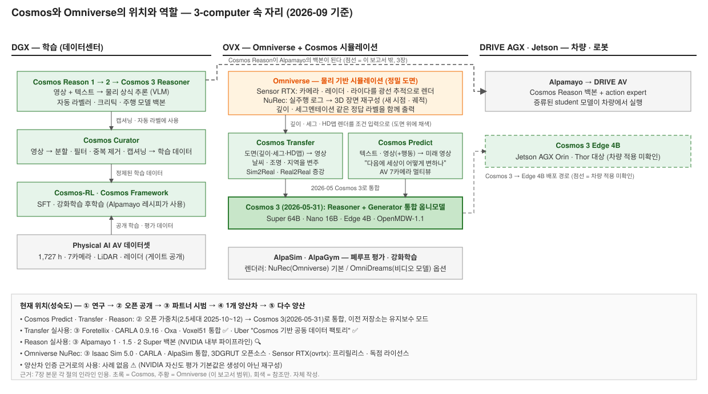

*그림 7-1. Cosmos 모델군과 Omniverse의 위치·역할. 실선 = 출처로 확인, 점선 = 추정. 자체 작성.*

| 기술 | 3-computer 위치 | 레이어 | 담당 역할 | 현재 위치(성숙도) | 다음 이정표 |
|---|---|---|---|---|---|
| **Cosmos Predict** | OVX(시뮬)·DGX(학습) | L3 모델(생성) | 텍스트/이미지/비디오(+행동) → 미래 비디오(세계 예측) | ② Predict2.5(2B/14B) 공개, AV 7카메라 멀티뷰 체크포인트 🔍 → Cosmos 3 Generator로 흡수 | Cosmos 3 FP8/NVFP4 "coming soon" 🔍 |
| **Cosmos Transfer** | OVX | L3 모델(변환) | 깊이·세그·엣지·라이다·HD맵·world-scenario 조건 → 포토리얼 비디오(Sim2Real/Real2Real) | ② Transfer2.5-2B, Distilled Edge(2026-02) 🔍; ③ Foretellix·CARLA·Oxa 통합 ✅ | Cosmos 3 Transfer 컨트롤 🔍 |
| **Cosmos Reason** | DGX | L3 모델(VLM) | 영상+텍스트 → 물리 상식·행동 추론(라벨러·크리틱·플래너 백본) | ② Reason2 32B(2026-04-29) 🔍 → Cosmos 3 Reasoner; ③ Alpamayo 백본으로 채택 🔍 | — |
| **Cosmos 3** | DGX/OVX/AGX(Edge) | L3 옴니모델 | 추론기+생성기 통합, AV 9D 행동 조건 | ② 2026-05-31 공개(OpenMDW-1.1) ✅, Edge 4B는 Jetson Thor 대상 🔍 | Cosmos 3 Edge SIGGRAPH 2026-07 📄 |
| **Cosmos Curator** | DGX | L4 데이터 | 영상 분할·필터·중복제거·캡셔닝·샤딩 | ② 오픈소스(Xenna 기반) 🔍 | — |
| **Omniverse (Sensor RTX·NuRec)** | OVX | L4 시뮬 | 물리 기반 센서 렌더·정답 라벨·신경 재구성 | ③ NuRec가 Isaac Sim 5.0·CARLA 0.9.16·AlpaSim에 통합 🔍; 3DGRUT 오픈소스 🔍; ovrtx는 프리릴리스·독점 라이선스 🔍 | NuRec Fixer(2026) 📄 |
| **Physical AI AV 데이터셋** | DGX | L4 데이터 | 1,727시간 실주행 + NuRec 장면 + 합성 시나리오 | ② 공개(게이트, NVIDIA AV Dataset License) 🔍 | — |

### 7.0.4 시사점

- **Cosmos는 도구이지 결과가 아니다.** 데이터·라벨 정책·검증 논거·컴퓨트 비용은 사용자 몫이며, NVIDIA 자신도 평가 기본값으로 생성 모델이 아니라 재구성(NuRec)을 쓴다(7.4.2).
- **세대 교체가 빠르다.** 2025년 한 해에 Gen1→2→2.5, 2026-05에 Cosmos 3로 통합되며 이전 저장소가 유지보수 모드로 들어갔다. 파이프라인을 특정 세대에 고정하면 6~12개월 내 이관 부담이 생긴다.
- **라이선스가 바뀌었다.** Gen1~2.5는 NVIDIA Open Model License(가드레일 우회 시 종료 조항 등), Cosmos 3와 Alpamayo는 OpenMDW-1.1(제한 없는 사용·출력물 무제한)이다. 상용 도입 시 어느 세대를 쓰는지에 따라 컴플라이언스가 다르다.

---

## 7.1 Cosmos 세대

### 7.1.1 Physical AI·WFM 개념과 3-computer

| 항목 | 내용 |
|---|---|
| 전체 그림 속 위치 | 3-computer 프레임 자체: DGX(학습) / Omniverse+Cosmos on OVX(시뮬·합성 데이터) / AGX(차량·로봇) |
| 담당 역할 | Cosmos는 "시뮬레이션 컴퓨터"에 놓여 데이터 플라이휠을 돌린다 |
| 현재 위치 | NVIDIA 공식 프레임(2025-01~) 📄 |

NVIDIA의 AV용 3-computer 설명은 다음과 같다. "AV 개발은 세 대의 서로 다른 컴퓨터로 가능해진다. 데이터센터에서 AI 스택을 학습하는 DGX, 시뮬레이션과 합성 데이터 생성을 위해 OVX에서 도는 Omniverse, 그리고 안전을 위해 실시간 센서 데이터를 처리하는 차량 내 AGX 컴퓨터." "3-computer 솔루션에 Cosmos가 더해지면 개발자는 수천 마일의 사람 주행을 수십억 마일의 가상 주행으로 바꾸는 데이터 플라이휠을 얻는다" ([NVIDIA 블로그 2025-01](https://blogs.nvidia.com/blog/three-computer-cosmos-ces/)) 📄. 로봇용 설명도 같은 구조(DGX / Omniverse+OVX / Jetson AGX)다 📄.

**왜 세계 모델인가.** CES 2025 보도자료: "Physical AI 모델은 개발 비용이 크고 방대한 실세계 데이터와 테스트가 필요하다. Cosmos WFM은 기존 모델을 학습·평가하기 위한 대량의 포토리얼·물리 기반 합성 데이터를 쉽게 생성하는 방법을 제공한다" 📄. Predict1 README는 WFM의 세 가지 주 분기를 "cosmos-predict, cosmos-transfer, cosmos-reason"으로 정의한다 ([cosmos-predict1](https://github.com/nvidia-cosmos/cosmos-predict1)) 🔍.

**Cosmos 플랫폼 구성(개념).** Cosmos는 모델 하나가 아니라 "세계 모델·데이터셋·도구의 오픈 플랫폼"([NVIDIA/Cosmos README](https://github.com/NVIDIA/Cosmos)) 🔍이다. 구성 부류 6개: (1) Predict — 텍스트·이미지·비디오(+행동) → 다음 장면 비디오; (2) Transfer — 깊이·세그·엣지·LiDAR·HDMap 도면 → 사실적 비디오; (3) Reason — 비디오+질문 → 설명·판단·라벨(VLM); (4) Tokenizer·Guardrail — 비디오↔토큰 압축, 입출력 안전 필터; (5) Curator·Framework·Cosmos-RL·Evaluator — 데이터 정제, 학습·후학습, 생성물 채점; (6) 데이터셋 — Physical AI AV(7카메라 1,700 h대) 등 🔍. 실행 위치: Reason·도구 = DGX, Predict·Transfer = OVX, Cosmos 3 Edge 4B = Jetson·Thor 대상 🔍. 배포: GitHub(`nvidia-cosmos`, `NVIDIA/Cosmos`)·HF·NIM·build.nvidia.com; 라이선스 NOML(1~2.5세대)/OpenMDW-1.1(Cosmos 3) 🔍. 이름 구분: Cosmos(플랫폼) ≠ Cosmos-Drive-Dreams(Transfer 기반 AV 합성 파이프라인) ≠ Cosmos-Dreams(CES 2026 마케팅명, 공개 저장소 없음) ≠ Cosmos Curator(데이터 도구). Cosmos가 아닌 것: 물리 시뮬레이터 엔진(Omniverse), 주행 스택(Alpamayo·DRIVE AV), 물리 정확성 보장(README 한계 목록 🔍).

### 7.1.2 1세대 — CES 2025 (Cosmos 1.0 / Predict1)

| 항목 | 내용 |
|---|---|
| 전체 그림 속 위치 | OVX 시뮬 컴퓨터, L3 생성 모델 |
| 담당 역할 | 텍스트/비디오 → 미래 비디오(디퓨전·자기회귀 두 계열), 토크나이저, 가드레일 |
| 현재 위치 | 유지보수 모드(Cosmos 3 이후) 🔍 |

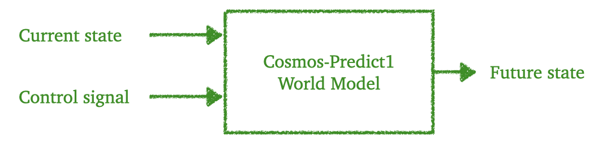

*그림 7-2. Cosmos-Predict1 아키텍처 다이어그램. 출처: [nvidia-cosmos/cosmos-predict1](https://github.com/nvidia-cosmos/cosmos-predict1) `assets/predict1_diagram.png`, 코드 Apache-2.0 / 모델 NVIDIA Open Model License, © NVIDIA.*

| 구성 | 상세 | 근거 |
|---|---|---|
| 논문 | "Cosmos World Foundation Model Platform for Physical AI", arXiv:2501.03575(2025-01-07 제출) | README 링크 🔍 / 📄 |
| 디퓨전 WFM | Predict1-7B/14B Text2World, 7B/14B Video2World, 7B WorldInterpolator | README 🔍 |
| 자기회귀 WFM | Predict1-4B/12B, 5B/13B-Video2World | README 🔍 |
| 토크나이저(Tokenize1) | CV8×8×8-720p(연속, 121프레임), DV8×16×16-720p(이산, 49프레임) 등 8종 | README 🔍 |
| 텍스트 인코더 | T5 | 코드 경로 🔍 |
| 가드레일 | `aegis/`, `blocklist/`, `face_blur_filter/`, `llamaGuard3/`, `video_content_safety_filter/`; "Llama Guard 3는 입력 필터로만 사용, 자체 라이선스 적용" | 코드 트리·README 🔍 |
| 학습 코퍼스 | 약 2,000만 시간 원시 비디오 → 약 1억 클립; 약 1만 H100으로 약 3개월 | 논문·블로그 요약 📄 |
| 추가 | 2025-05 "Cosmos AV Single2MultiView"(단일 비디오→멀티뷰) | README 🔍 |
| 초기 채택사 | "1X, Agile Robots, Agility, Figure AI, Foretellix, Uber, Waabi, XPENG" | 보도자료(미러 다수) ✅ |

### 7.1.3 2세대 — GTC 2025 ~ 2025년 중반

| 항목 | 내용 |
|---|---|
| 전체 그림 속 위치 | Transfer(OVX, Omniverse 출력 소비) · Reason(DGX, 라벨링·크리틱) · Predict2(OVX) |
| 담당 역할 | 조건부 변환, 물리 상식 추론, 고품질 미래 예측 |
| 현재 위치 | Transfer1·Reason1 유지보수, Predict2는 2025-12-03 아카이브 🔍 |

GTC 2025(2025-03-18) 보도자료: "새 Cosmos WFM 주요 릴리스, Physical AI 개발용 오픈·완전 커스터마이즈 가능 추론 모델 도입, 세계 생성에 대한 전례 없는 제어" 📄. 채택사 "Agility Robotics, Figure AI, Foretellix, Skild AI, Uber" 📄.

**Cosmos-Transfer1 (2025-03-18)**

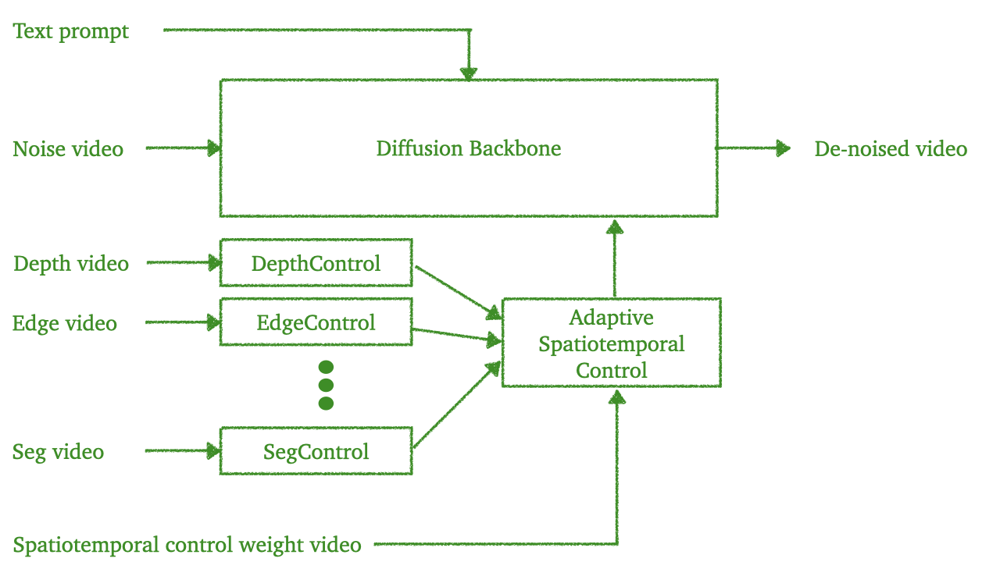

*그림 7-3. Cosmos-Transfer1: 깊이·엣지·세그멘테이션 등 제어 비디오가 각 ControlNet을 거쳐 "Adaptive Spatiotemporal Control"로 가중 결합되어 디퓨전 백본에 들어간다. 출처: [nvidia-cosmos/cosmos-transfer1](https://github.com/nvidia-cosmos/cosmos-transfer1) `assets/transfer1_diagram.png`, © NVIDIA.*

- 정의: "다중 모달 제어 가능 조건부 세계 생성 또는 world2world 변환에 특화된 Cosmos WFM의 핵심 분기" 🔍. 논문(arXiv 2503.14492): "시뮬레이션과 실세계 환경 사이의 지각적 간극을 잇는 world-to-world 변환 모델" 🔍📄.
- 제어 모드: 단일 모달(세그·깊이·엣지·블러·LiDAR·HDMap 비디오) 또는 "MultiControlNet 기반 다중 모달 제어, 공간·시간에 걸쳐 각 모달 강도를 조절하는 시공간 제어 맵" 🔍.
- 모델(모두 7B): Transfer1-7B [Depth|Edge|Keypoint|Segmentation|Vis], **7B-Sample-AV(LiDAR·HDMap 제어)**, 7B-4KUpscaler; 2025-05 Single2MultiView(사전학습 6뷰, Waymo 후학습 5뷰); 2025-08 Edge Distilled(36단계→1단계) 🔍.
- AV 샘플 추론 예: HDMap 가중치 0.3 / LiDAR 0.7, Waymo Open Dataset 변환 툴킷 제공 🔍.
- 라이선스: 코드 Apache-2.0, 모델 NVIDIA Open Model License 🔍.

**Cosmos-Reason1 (논문 2025-03, 가중치 2025-05-17)**

- "Cosmos-Reason1 모델은 Qwen2.5-VL 아키텍처 기반" 🔍. 논문은 7B·56B를 다루나 공개는 7B만 🔍📄.
- 학습: "물리 상식과 체화 추론 데이터로 SFT·RL 포스트트레이닝, 사람 주석 없이 세계 동역학을 이해하는 CoT 추론" 🔍. HF 카드 "370만 VQA 샘플" 📄.
- 결과(논문 요약): 물리 상식 56B 60.2%(OpenAI o1 59.9% 대비), 7B는 Qwen2.5-VL-7B 대비 +6.9%; 체화 추론 7B 61.8% 📄.
- 이후: 2025-06-11 "비디오의 물리적 타당성 판단 능력 강화"(video critic), 2025-08 시공간 추론, 2025-10-28 Cosmos Cookbook 🔍. Predict2.5의 텍스트 인코더로 재사용 🔍.

**Cosmos-Predict2 (2025-06-11)**

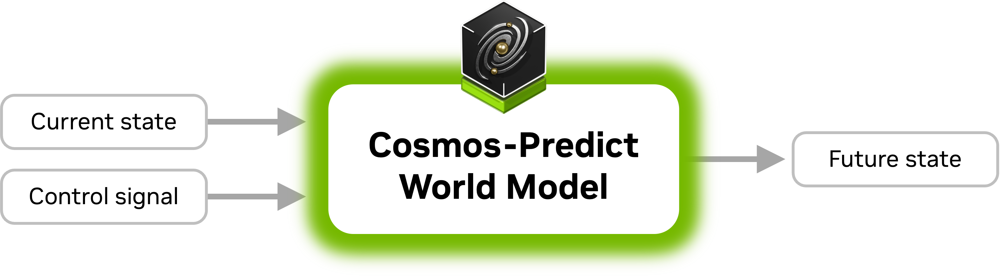

*그림 7-4. Cosmos-Predict2 아키텍처(DiT 기반 text2image / video2world). 출처: [nvidia-cosmos/cosmos-predict2](https://github.com/nvidia-cosmos/cosmos-predict2) `assets/cosmos-predict-diagram.png`, © NVIDIA.*

- Text2Image 0.6B/2B/14B, Video2World 2B/14B; 후학습 변형 GR00T-Dreams-GR1/DROID, 2B-Sample-Action-Conditioned 🔍. 디퓨전 트랜스포머(DiT[^dit]) 🔍. 2025-07 NATTEN 희소 어텐션으로 최대 2.6× 가속 🔍. 2025-12-03 아카이브 → 2.5 이관 📄.

**Cosmos-Drive-Dreams (2025-06-10)** — 7.2.2·7.4.1 참조.

### 7.1.4 2.5세대 이후 — 2025년 하반기 ~ 2026년

| 항목 | 내용 |
|---|---|
| 전체 그림 속 위치 | Predict2.5·Transfer2.5(OVX), Reason2(DGX), Cosmos 3(전 영역, Edge는 AGX) |
| 담당 역할 | 통합 입력(T2W/I2W/V2W), 경량 변환(2B), 장문맥 추론, 옴니모델 |
| 현재 위치 | Cosmos 3 = 최신(2026-05-31). 2.5 계열은 유지보수 🔍 |

**Cosmos-Predict2.5 (2025-10-06)**: "Text2World·Image2World·Video2World를 단일 모델로 통합한 flow 기반 모델, Cosmos-Reason1을 텍스트 인코더로 사용" 🔍. 논문 "World Simulation with Video Foundation Models for Physical AI"(arXiv 2511.00062, Predict2.5+Transfer2.5) 🔍(링크). 2B/14B; **2B/auto/multiview "주행, 7카메라 뷰"** 체크포인트 🔍; 멀티뷰 추론은 8 GPU×80GB 이상 🔍; 자기회귀 슬라이딩 윈도로 장면 연장(최대 30초, CoRL 발표) 🔍📄; 2026-02-23 로봇 정책 모델 🔍. 논문 요약: 2억 큐레이션 클립, RL 포스트트레이닝, 2B가 Wan2.2 5B급 📄.

**Cosmos-Transfer2.5 (2025-10-06)**: "Predict2.5 위에 구축, 다중 공간 제어 입력에 조건화된 고품질 세계 시뮬레이션" 🔍. **2B**(7B→2B, "3.5배 작지만 더 빠르고 선명") 🔍📄. 제어: 깊이·엣지·세그·블러·다중 제어; AV 변형 `2B/auto multiview`는 "기본 7뷰, 7 GPU"이며 **World Scenario**(HD맵+박스의 3D 기하) 렌더에 조건화 🔍. 성능: 720p@16fps 93프레임 청크, 2B VRAM 65.4GB, B200 92초 vs H20 684초, 증류 모델 7.4~7.8× 🔍. 2025-11 합성 LiDAR 생성 레시피, 2026-02-23 Distilled Edge 🔍.

**Cosmos-Reason2 (2025-12-19 2B/8B, 2026-04-29 32B)**: "Qwen3-VL 아키텍처 기반" 🔍. CES 2026 문구 "Physical AI Bench·Physical Reasoning 리더보드 1위 오픈 모델, 256K 토큰 장문맥" 📄. VRAM 2B 24GB / 8B 32GB 🔍. Alpamayo 1.5의 백본(3장).

**Cosmos-RL / Cookbook / Curator**: Cosmos-RL은 "Physical AI 응용에 특화된 유연·확장 가능 RL 프레임워크", 정책/롤아웃 replica 완전 비동기, FP8 학습·FP4 롤아웃, 현재 유지보수 모드 ([cosmos-rl](https://github.com/nvidia-cosmos/cosmos-rl)) 🔍. Cookbook(2025-10-28)에는 "Cosmos Reason 1&2로 3D AV 그라운딩 후학습", "GR00T-Dreams에서 Reason 2를 비디오 크리틱으로 리젝션 샘플링", "Transfer 2.5 Sim2Real(CARLA)", "Reason 2 AV 비디오 캡셔닝·VQA 후학습" 레시피가 있다 ([cosmos-cookbook](https://github.com/nvidia-cosmos/cosmos-cookbook)) 🔍.

**Cosmos 3 (2026-05-31 HF / 06-01 GTC Taipei)**

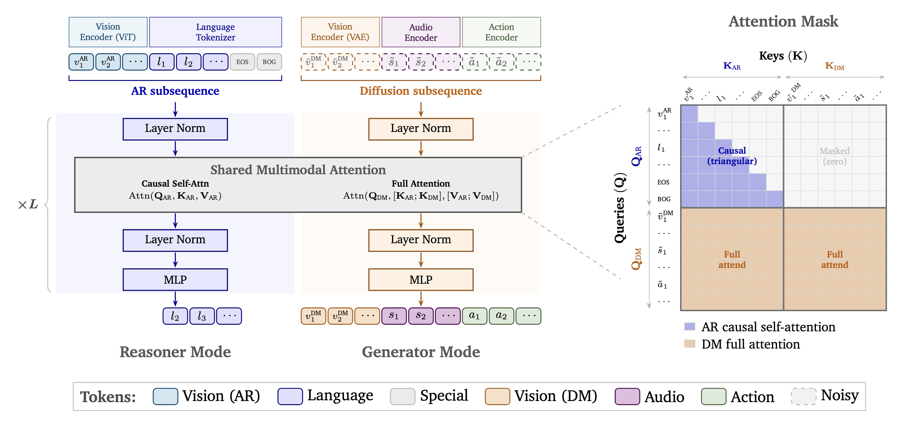

*그림 7-5. Cosmos 3 Mixture-of-Transformers 구조: 자기회귀 추론기(Reasoner)와 디퓨전 생성기(Generator)가 어텐션과 3D mRoPE를 공유한다. 출처: [NVIDIA/Cosmos](https://github.com/NVIDIA/Cosmos) `cookbooks/cosmos3/cosmos3-model-architecture.png`, OpenMDW-1.1, © NVIDIA.*

| 항목 | 내용 | 근거 |
|---|---|---|
| 정의 | "언어·이미지·비디오·오디오·행동 시퀀스를 통합 Mixture-of-Transformers 아키텍처 안에서 함께 처리·생성하도록 설계된 옴니모달 세계 모델 스위트… VLM·비디오 생성기·세계 시뮬레이터·세계-행동 모델을 단일 프레임워크로 포섭" | README 🔍 |
| 아키텍처 | "추론용 자기회귀 트랜스포머(AR)와 멀티모달 생성용 디퓨전 트랜스포머(DM)를 결합한 통합 MoT… 둘은 같은 트랜스포머 아키텍처, 멀티모달 어텐션 층, 통합 3D mRoPE를 공유". 런타임 표면은 **Reasoner**(텍스트+시각→텍스트, Qwen3-VL 호환 규약)와 **Generator**(텍스트/시각/소리/행동→시각/소리/행동) | README 🔍 |
| 기술 리포트 | "Cosmos 3: Omnimodal World Models for Physical AI", arXiv 2606.02800; "각 디코더 층이 추론용·생성용 두 파라미터 세트를 가짐"; Artificial Analysis 오픈소스 T2I·I2V 1위, RoboArena 정책 1위 | README 링크 🔍 / 📄 |
| 모델군 | **Super 64B**(H200/B200/GB200, "증류용 teacher"), **Nano 16B**(RTX Pro 6000/H100/B200), **Edge 4B**(Jetson AGX Orin/Thor/RTX Pro 6000, 256p/480p, V2V 변환 없음). 4-Step 변형 "17~25× 가속". FP8/NVFP4 "coming soon" | README 🔍 |
| 크기 상충 | Cookbook NIM 환경변수 "8B Nano / 32B Super" — 추론기 타워만 센 값으로 추정(MoT 2세트 → 16B/64B). Alpamayo 2 Super "34B = Cosmos 3 Super Reasoner 32B + ~2B"와 정합 | cookbook 🔍 / 해석 ⚠️ |
| 생성 설정 | 256p/480p/720p, 5~300프레임(기본 189 ≈ 7.9초@24fps), 10~30fps | README 🔍 |
| 행동 조건 | "카메라 모션(9D), **자율주행차(9D)**, 1인칭(57D), 단일 팔 로봇(10D), 양팔(20D), 휴머노이드(29D)"; 소리 스테레오 AAC 48kHz | README 🔍 |
| AV 워크플로 | Forward dynamics(AV 행동 조건 생성), Inverse dynamics("입력 AV 비디오에서 자차 궤적 예측"), Reasoner "Action CoT 주행 장면 사고 사슬", Transfer "엣지·블러·깊이·세그·world-scenario 제어" | README 🔍 |
| 가드레일 | Generator는 게이트 `nvidia/Cosmos-1.0-Guardrail` 필요, 비활성화 가능("라이선스 준수는 사용자 책임") | README·cookbook 🔍 |
| 배포 | HF 컬렉션, Diffusers/Transformers(≥5.11), vLLM/vLLM-Omni, TensorRT-LLM, SGLang, NIM(`cosmos3-reasoner:1.7.0`, `Cosmos3-Generator`), build.nvidia.com | README 🔍 (5장 참조) |
| 라이선스 | "소스코드와 모델은 OpenMDW-1.1에 따라 공개" | README·LICENSE 🔍 |
| 한계(원문) | "temporal inconsistency, unstable camera or object motion, inaccurate sound-video alignment, imperfect action-state consistency, object morphing, inaccurate 3D structure, and implausible physical dynamics … need additional validation, guardrails, and system-level safety analysis before deployment" | README 🔍 |
| 생태계 | Cosmos Framework(학습·서빙, SFT 레시피, 8×H100), Cosmos Curator, **Cosmos Evaluator**("세계 생성·추론 출력의 자동 Physical AI 평가 시스템"); Cosmos Coalition "Agile Robots, Black Forest Labs, Generalist, LTX, Runway, Skild AI" | README 🔍 / 📄 |
| 학습 데이터 | README 미공개, 기술 리포트 미열람 | ⚠️ |

2026-07 SIGGRAPH에서 "Cosmos 3 Edge 4B를 Jetson·RTX PRO·DGX·GeForce RTX용 실시간 엣지 배포에 최적화해 공개"했다는 보도가 있으나, Edge는 5월 README 표에 이미 있어 GA·최적화 마일스톤으로 해석된다 ([TechTimes](https://www.techtimes.com/articles/321401/20260723/), [NVIDIA 블로그](https://blogs.nvidia.com/blog/siggraph-news-2026/)) 📄 ⚠️. Alpamayo 2 Super(3장)·AlpaGym·"Cosmos-Dreams"(포토리얼 폐루프 AV 시나리오 생성 세계 모델) 발표도 같은 시기다 📄.

### 7.1.5 세대·모델별 비교표

| 모델 | 세대/날짜 | 아키텍처 | 입력 → 출력 | 파라미터 | 가중치 라이선스 | 배포 | 학습 데이터 공개 |
|---|---|---|---|---|---|---|---|
| Cosmos-Predict1 | Gen1 2025-01-06 | 디퓨전(DiT, T5) + 자기회귀(이산 토큰+디퓨전 디코더) | 텍스트/비디오 → 비디오 | 디퓨전 7B/14B, AR 4B/12B, 5B/13B | NVIDIA Open Model License(NOML) | HF·NGC·GitHub | ~2,000만h → ~1억 클립 📄 |
| Cosmos-Tokenize1 | 2025-01 | 웨이블릿 공간 인과 비디오 토크나이저(연속·이산) | 비디오/이미지 → 잠재/토큰 | — | NOML | HF | — |
| Cosmos-Transfer1 | Gen2 2025-03-18 | 7B DiT + (Multi)ControlNet + 시공간 제어 맵 | 세그/깊이/엣지/블러/키포인트/LiDAR/HDMap + 텍스트 → 비디오 | 7B | NOML | HF·GitHub | 비공개 |
| Cosmos-Reason1 | 2025-03 논문 / 05-17 가중치 | VLM(Qwen2.5-VL-7B 후학습, SFT+RL) | 영상/이미지+텍스트 → 텍스트(CoT) | 7B(56B 논문만) | NOML | HF·GitHub·NIM | 370만 VQA 📄 |
| Cosmos-Predict2 | 2025-06-11 | DiT | 텍스트→이미지; 비디오+텍스트→비디오 | 0.6B/2B/14B T2I; 2B/14B V2W | NOML | HF·GitHub | 비공개 |
| Cosmos-Drive-Dreams | 2025-06-10 | Transfer1/Predict1 AV 샘플 위 파이프라인 | HDMap/LiDAR/World-Scenario + 텍스트 → 멀티뷰 비디오 | 7B | 데이터셋 상용/비상용 허용 🔍 | HF·GitHub | 실클립 5,843 → 합성 81,802 🔍 |
| Cosmos-Predict2.5 | Gen2.5 2025-10-06 | rectified-flow DiT, Reason1 텍스트 인코더, T2W/I2W/V2W 통합 | 텍스트/이미지/비디오/행동 → 비디오 | 2B/14B | NOML | HF·GitHub·Diffusers | 2억 클립 📄 |
| Cosmos-Transfer2.5 | 2025-10-06 | Predict2.5 위 multi-ControlNet | RGB/깊이/세그/엣지/블러/world-scenario(+7뷰) → 비디오 | 2B | NOML | HF·GitHub | 비공개 |
| Cosmos-Reason2 | 2025-12-19 (32B 2026-04-29) | VLM(Qwen3-VL 후학습) | 영상/이미지+텍스트 → 텍스트 | 2B/8B/32B | NOML | HF·GitHub·NIM | 비공개 |
| **Cosmos 3** | 2026-05-31 | MoT: AR 추론기 + 디퓨전 생성기, 3D mRoPE 공유 | 텍스트/이미지/비디오/행동(+소리) → 텍스트/이미지/비디오/소리/행동 | Super 64B / Nano 16B / Edge 4B(추론기만 32B/8B) | **OpenMDW-1.1** | HF·Diffusers/Transformers/vLLM/TRT-LLM/SGLang·NIM | 비공개 ⚠️ |

**NVIDIA Open Model License**(원문 미열람, 검색 요약 📄): 상용 사용·파생 모델 허용, 출력물 소유권 주장 없음, 귀속 불요. 단 "모델에 포함된 기술적 제한·안전 가드레일을 우회·비활성화·약화"하면서 유사 가드레일을 두지 않으면 종료, 사용자 면책 의무(8조). 제3자 분석은 제품·UI에 "Built on NVIDIA Cosmos" 표시 요구와 경쟁 모델 서비스 제한을 들어 "완전 오픈은 아님"이라 평한다 ([shujisado](https://shujisado.org/2025/12/19/nvidia-open-model-license-a-corporate-risk-analysis/)) 📄. OpenMDW-1.1 원문은 3장 3.1.6 참조 🔍.

---

## 7.2 데이터 파이프라인

### 7.2.1 Cosmos Curator

| 항목 | 내용 |
|---|---|
| 전체 그림 속 위치 | DGX 학습 컴퓨터 앞단, L4 데이터 층 |
| 담당 역할 | 원시 비디오 → 분할·필터·중복제거·캡셔닝·임베딩 → 학습용 샤드(webdataset) |
| 현재 위치 | ② 오픈소스(GitHub), Ray 기반 Cosmos-Xenna 위에 구축 🔍. NeMo Curator 일반은 4장 |

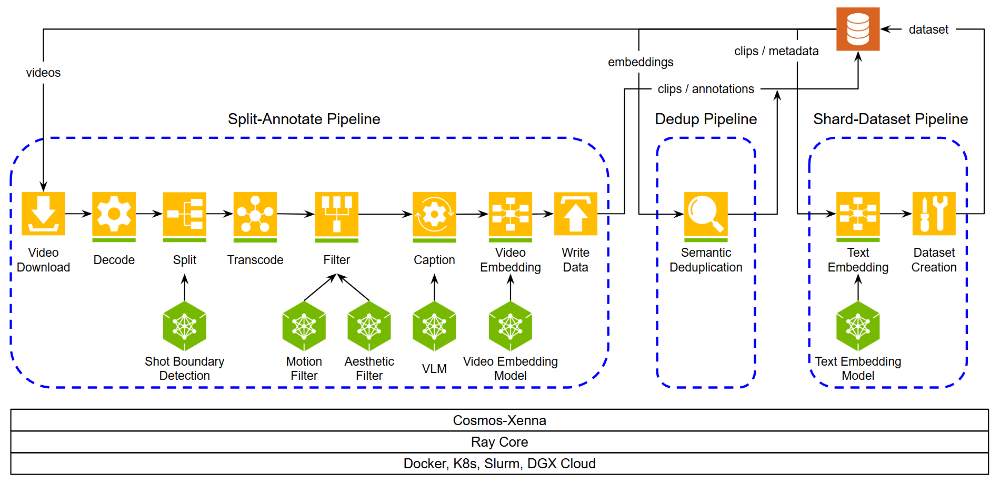

*그림 7-6. Cosmos Curator의 split-annotate / dedup / shard 파이프라인. 출처: [NVIDIA/cosmos-curator](https://github.com/NVIDIA/cosmos-curator) `docs/assets/cosmos-curator-pipelines.png`, © NVIDIA.*

정의: "고급 AI 모델과 분산 컴퓨팅으로 비디오 콘텐츠를 처리·분석·조직하는 강력한 비디오 큐레이션 시스템… GPU 가속 스트리밍 파이프라인에 최적화된 프레임워크 위에 구축되었고, 그 프레임워크는 Cosmos-Xenna로 별도 오픈소스화" ([cosmos-curator README](https://github.com/NVIDIA/cosmos-curator)) 🔍.

| 단계 | 내용(docs 원문 요지) | 근거 |
|---|---|---|
| 다운로드·디코딩·분할 | "TransNetV2 기반 샷 전환 분할" 또는 고정 스트라이드 | docs 🔍 |
| 트랜스코딩 | H264 mp4 | 🔍 |
| 필터링 | "모션·미학" 필터, 인공 텍스트 필터, VLM 기반 의미 필터/분류기 | 🔍 |
| 임베딩 | InternVideo2 기본, Cosmos-Embed1(224p/336p/448p), OpenAI 호환 | 🔍 |
| 캡셔닝 | VLM(로컬 vLLM 또는 OpenAI/Gemini API), 캡션 보강, SAM3 추적 + 이벤트별 캡션, SeedVR2 초해상 옵션 | 🔍 |
| 중복 제거 | "임베딩의 K-Means 군집화와 의미 중복 제거" | 🔍 |
| 샤딩 | T5(t5_xxl) 텍스트 임베딩 + webdataset("Cosmos 파인튜닝용 학습 준비 완료") | 🔍 |
| 기본 캡셔닝 모델 | 메타데이터 필드명(`qwen_rejection_stage` 등)으로 Qwen 계열 추정, 기본값 미명시 | ⚠️ |

GPU 가속 수치: NVDEC/NVENC로 "디코딩·트랜스코딩 3× 가속"(NeMo Curator 문서); NeMo Curator 비디오 파이프라인 "베이스라인 대비 89×, H100 2,000장으로 720p 비디오 약 100만 시간을 하루에 처리"(arXiv 2503.12964) 📄. NVIDIA DRIVE 페이지: "Cosmos Curator는 대량 센서 데이터를 필터·주석·중복 제거하며 … Cosmos Reason VLM을 활용해 데이터 처리 파이프라인을 수개월에서 수일로 단축" ([developer.nvidia.com/drive](https://developer.nvidia.com/drive)) 📄.

### 7.2.2 공개 데이터셋

| 항목 | 내용 |
|---|---|
| 전체 그림 속 위치 | L4 데이터 층, DGX 입력 |
| 담당 역할 | 실주행(멀티카메라·LiDAR·레이더) + NuRec 장면 + 합성 시나리오의 공개 기준 데이터 |
| 현재 위치 | ② 공개(게이트). Physical AI Dataset 누적 1,000만 다운로드(포럼) 📄 |

| 데이터셋 | 내용 | 근거 |
|---|---|---|
| Physical AI Dataset(GTC 2025-03) | "로봇 학습용 32만 궤적 15TB + OpenUSD 자산 최대 1,000개(SimReady 포함)"; AV 클립은 "미국 1,000개 도시·유럽 24개국의 20초 클립, 곧 공개" | [NVIDIA 블로그](https://blogs.nvidia.com/blog/open-physical-ai-dataset) 📄 |
| `nvidia/PhysicalAI-Autonomous-Vehicles` | "25개국 2,500개 이상 도시에서 계획된 수집 주행으로 기록된 1,700시간"; 306,152클립(1,700h); 20초 클립; **7카메라**(front_wide_120, front_tele_30, cross_left/right_120, rear_left/right_70, rear_tele_30; f-theta), 128채널 회전 LiDAR, 레이더 9; NVIDIA AV Dataset License(게이트) | HF 카드 📄 / [physical_ai_av wiki](https://github.com/NVlabs/physical_ai_av) 🔍 |
| 파생 | `-NCore`, `-NuRec`(26.01: 729 장면, 26.04: 1,606 장면, 약 1.5TB), `PhysicalAI-WorldModel-Synthetic-Autonomous-Driving-Scenarios`, `PhysicalAI-Autonomous-Vehicle-Cosmos-Drive-Dreams` | 3장 3.1.4 🔍📄 |
| Cosmos-Drive-Dreams 데이터 | "NVIDIA가 수집한 10초 클립 5,843개의 라벨(HDMap·BBox·LiDAR)과 합성 비디오 81,802개… 121프레임, 비·눈·안개 등"; 약 3TB(합성 700GB); "상용/비상용 사용 준비 완료" | [nv-tlabs/Cosmos-Drive-Dreams](https://github.com/nv-tlabs/Cosmos-Drive-Dreams) 🔍 |

3장 3.1.4의 "1,727시간 / 310,895클립" 수치와 HF 카드의 "1,700시간 / 306,152클립"은 데이터셋 성장 또는 표기 차이로 보인다 ⚠️.

### 7.2.3 자동 라벨링·합성 데이터

| 항목 | 내용 |
|---|---|
| 전체 그림 속 위치 | L4 데이터 층. Reason(DGX)이 라벨러·크리틱, Transfer(OVX)가 증강기 |
| 담당 역할 | 사람 주석을 VLM 자동 라벨로 대체·보강, 실데이터를 조건부 생성으로 증폭 |
| 현재 위치 | ② 레시피·모델 공개, ③ NVIDIA 내부 Alpamayo 파이프라인에 적용 🔍 |

**Reason 기반 라벨링·크리틱**

- Reason1 2025-06-11 "비디오의 물리적 타당성 판단"(video critic 예제) 🔍.
- Cookbook: "GR00T-Dreams… Cosmos Reason 2를 비디오 크리틱으로 리젝션 샘플링" 🔍; "Cosmos Reason 2 같은 비디오-언어 모델은 강력한 자동 라벨러… (주행 결정, 핵심 요소, 인과 설명) 구조화 주석 생성"(AV 캡셔닝·VQA 레시피) 📄.
- Physical AI Data Factory Blueprint: "Cosmos Evaluator(Cosmos Reason 기반)가 생성 데이터를 자동 채점·검증·필터링해 물리 정확성과 학습 준비도를 보장"; 사용자 "FieldAI, Hexagon Robotics, Linker Vision, Milestone Systems, RoboForce, Skild AI, Teradyne Robotics, Uber" ([뉴스룸](https://nvidianews.nvidia.com/news/nvidia-announces-open-physical-ai-data-factory-blueprint-to-accelerate-robotics-vision-ai-agents-and-autonomous-vehicle-development)) 📄 (발표 시점 GTC DC 2025 vs GTC 2026 상충 ⚠️).
- Alpamayo: "CoC 추론 — 사람 개입 하이브리드 자동 라벨링"; "Alpamayo-R1은 Cosmos-Reason을 백본으로 채택, 24.7K 큐레이션 비디오 VQA 샘플 통합"; 의도된 용도에 "추론 기반 자동 라벨링 도구" 포함 🔍📄. Alpamayo 2 Super의 자동 라벨 태스크와 `alpamayo-coc-autolabeler` 저장소 존재 🔍(3장).

**Transfer 기반 증강**

- Drive-Dreams 파이프라인: (1) HDMap/LiDAR 깊이/World Scenario 조건 비디오 렌더 → (2) Qwen3 VLM으로 프롬프트 변주 → (3) Transfer1-7B-Sample-AV로 정면 121프레임 생성 → (4) Single2MultiView로 멀티뷰 확장 → (5) VLM 필터링("coming soon") 🔍.
- Transfer2.5 Cookbook "Sim2Real for Simulator Videos"(CARLA 증강) 🔍; Data Factory "실제·시뮬 입력을 증폭해 환경·조명 조건 전반의 희귀·롱테일 시나리오 포착" 📄.
- 합성 데이터의 AV 정량 효과: Drive-Dreams 논문은 "3D 차선 검출·3D 객체 검출·주행 정책 학습에서 롱테일 완화·일반화 향상"을 주장하나 **수치는 이 세션에서 확보 불가** ⚠️. 로봇 쪽은 Cosmos Policy "RoboCasa 71.1%(Predict2 대비 +4%)" 🔍. 벤더 블로그의 비용 추정("클립 1만 개 GPU 비용 1~1.5만 달러 vs 실수집 50만 달러 이상")은 근거 약함 📄 ⚠️.

### 7.2.4 데이터 플라이휠

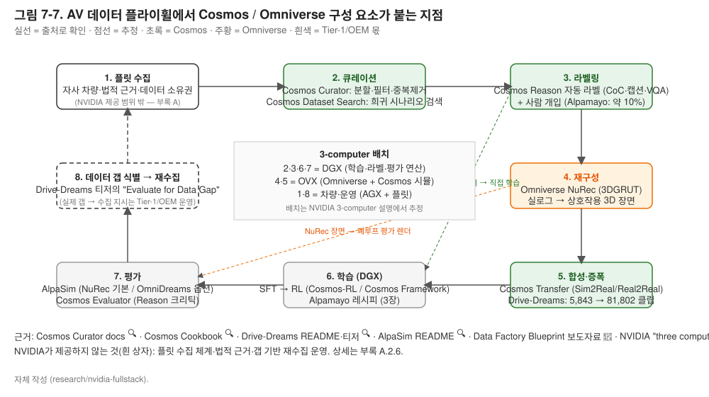

*그림 7-7. AV 데이터 플라이휠에서 Cosmos 각 모델이 붙는 지점. 실선 = 출처로 확인, 점선 = 추정. 자체 작성.*

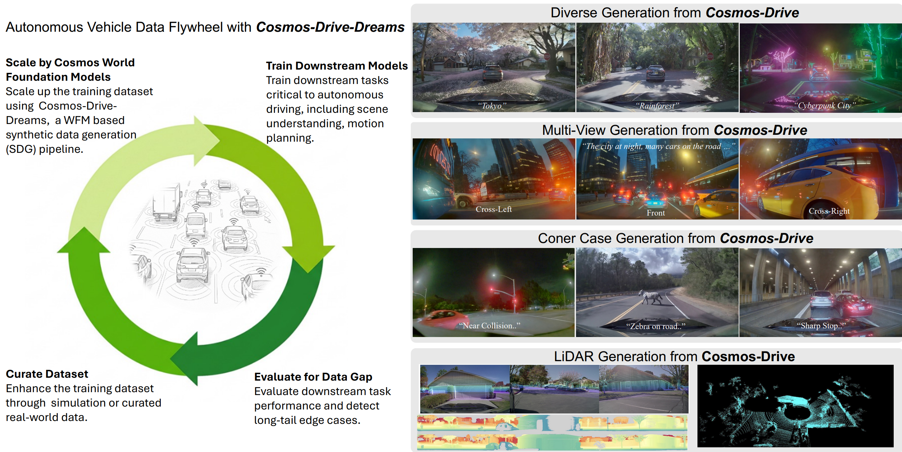

*그림 7-8. Cosmos-Drive-Dreams가 그린 데이터 플라이휠(Cosmos WFM으로 확장 → 다운스트림 학습 → 데이터 갭 평가 → 큐레이션)과 다양성·멀티뷰·코너케이스·LiDAR 생성 예. 출처: [nv-tlabs/Cosmos-Drive-Dreams](https://github.com/nv-tlabs/Cosmos-Drive-Dreams) `assets/teaser.png`, Apache-2.0, © NVIDIA.*

| 루프 단계 | 붙는 Cosmos/Omniverse 구성 요소 | 근거 |
|---|---|---|
| 플릿 수집 | (Tier-1/OEM 몫) → Physical AI AV 데이터셋 형식(7카메라 f-theta, LiDAR, 레이더) | 🔍 |
| 큐레이션 | Cosmos Curator(분할·필터·중복제거·캡셔닝), Cosmos Dataset Search(희귀 시나리오 검색) | 🔍📄 |
| 라벨링 | Cosmos Reason(자동 라벨·CoC), 사람 개입 | 🔍 |
| 재구성 | Omniverse NuRec(실로그 → 상호작용 3D 장면) | 📄🔍 |
| 합성·증폭 | Cosmos Transfer(Omniverse/NuRec/라벨 렌더 → 포토리얼 변주), Drive-Dreams | 🔍 |
| 학습 | DGX + Cosmos-RL/Cosmos Framework(3장 Alpamayo 레시피) | 🔍 |
| 평가 | AlpaSim(NuRec 기본 / OmniDreams 옵션), Cosmos Evaluator(Reason 크리틱) | 🔍📄 |
| 갭 식별 → 재수집 | Drive-Dreams 티저의 "Evaluate for Data Gap → Curate Dataset" | 🔍 |

---

## 7.3 Omniverse와의 역할 구분

### 7.3.0 Omniverse 개념

- **정의**: NVIDIA의 3D 시뮬레이션·디지털 트윈 플랫폼. 공통 데이터 모델 OpenUSD, 렌더링 RTX 광선 추적. AV용 문구: "물리적으로 정확한 센서 시뮬레이션을 가능하게 하는 마이크로서비스… OpenUSD 프레임워크 위에 RTX 광선 추적·신경 렌더링"(Sensor RTX, CVPR 2024) ✅. 앱 프레임워크 Omniverse Kit는 클로즈드 🔍.
- **자율주행에서 쓰는 부품**: Sensor RTX/ovrtx(센서 물리 렌더; ovrtx 0.4 프리릴리스, NVIDIA Software License) 🔍 · Replicator(깊이·법선·세그 정답 라벨 합성 데이터; 2022 자료 기준 결정론) 📄 · NuRec + 3DGRUT(실주행 로그 → 3D 가우시안 재구성, AlpaSim 기본 렌더러; 3DGRUT Apache-2.0, 재구성 서비스는 NVIDIA 제공) 🔍 · Blueprint for AV simulation(참조 워크플로, CES 2025; 자가 서비스 다운로드 미확인) ✅⚠️ · Isaac Sim 5.0(로봇용, NuRec·Cosmos Transfer용 Replicator 라이터 포함, 오픈소스) 🔍 · DRIVE Sim(옛 이름, 단종 선언 없음) ⚠️.
- **Cosmos와의 차이 한 줄**: Omniverse는 물리를 계산해 장면과 정답 라벨을 만들고, Cosmos는 학습한 분포대로 그린다(다양하지만 정확성 미보장).
- **3-computer 위치**: OVX(Cosmos Predict·Transfer와 같은 자리).

### 7.3.1 Omniverse 쪽: 물리 기반 렌더, 정답 라벨, 신경 재구성

| 항목 | 내용 |
|---|---|
| 전체 그림 속 위치 | OVX 시뮬 컴퓨터, L4 시뮬 층 |
| 담당 역할 | OpenUSD[^usd] 장면 + RTX 광선 추적으로 카메라·레이더·라이다를 물리적으로 시뮬레이션하고 깊이·세그멘테이션 등 **정답 라벨**을 낸다. NuRec은 실로그를 3D 장면으로 재구성해 새 시점·궤적으로 재생한다 |
| 현재 위치 | ③ NuRec가 Isaac Sim 5.0(2025-08)·CARLA 0.9.16(2025-09)·AlpaSim에 통합 🔍; 3DGRUT 오픈소스(Apache-2.0) 🔍; Sensor RTX는 라이브러리 ovrtx 0.4 프리릴리스(독점 라이선스) 🔍; Omniverse Kit는 클로즈드 🔍 |
| 다음 이정표 | NuRec Fixer(2026), Isaac Sim 6.0의 USD ParticleField 표준화 🔍 |

- **Sensor RTX**: "물리적으로 정확한 센서 시뮬레이션을 가능하게 하는 마이크로서비스… OpenUSD 프레임워크 위에 RTX 광선 추적·신경 렌더링" (CVPR 2024 발표) ✅; CES 2025 조기 접근 "카메라·레이더·라이다" 📄. 오픈 라이브러리 형태 **ovrtx**: "카메라·라이다·레이더 등 센서의 물리적으로 정확한 시뮬레이션", "RL in-the-loop 초당 수만 프레임부터 실시간 포토리얼 뷰포트까지"; 0.4 프리릴리스, NVIDIA Software License(오픈소스 아님) ([NVIDIA-Omniverse/ovrtx](https://github.com/NVIDIA-Omniverse/ovrtx)) 🔍.
- **정답 라벨·결정론**: 2022 DRIVE Sim/Replicator 블로그 "RTX 렌더러가 RGB 카메라와 깊이·법선·세그멘테이션 정답 센서를 물리 기반 광선 추적으로 시뮬레이션… 시간 정확·결정론적이라 반복 생성 가능", LED 플리커·모션 블러·롤링 셔터·라이다 빔 발산·도플러 효과 반영 📄. 2025~26 Blueprint/ovrtx에 대한 결정론 재확인 문장은 찾지 못함 ⚠️.
- **NuRec**: "실센서 데이터를 받아 OpenUSD로 상호작용 시뮬레이션을 재구성·렌더링하는 에이전트 친화적 3D 가우시안 스플래팅 라이브러리 집합" ([NuRec 페이지](https://developer.nvidia.com/omniverse/nurec)) 📄; "Isaac Sim(로봇)과 AlpaSim·CARLA(자율주행) 두 영역 지원" 📄. 오픈소스 코어는 **3DGRUT**(3DGRT SIGGRAPH Asia 2024 + 3DGUT[^3dgut] CVPR 2025): "왜곡 카메라와 롤링 셔터 같은 시간 의존 효과를 래스터화 프레임워크 안에서 지원", 1차 광선 래스터·2차 광선 광선추적 하이브리드; USD/NuRec USDZ/PLY 내보내기; 2026-01 ISP 지원, 2026-06 v2.0 ([nv-tlabs/3dgrut](https://github.com/nv-tlabs/3dgrut)) 🔍. **재구성 서비스 자체는 CARLA에서 NVIDIA Docker 서비스로 호출되므로 소스가 아니다** 🔍⚠️.
- **DRIVE Sim 상태**: 개발자 페이지는 남아 있으나 2025~26 제품 언어는 "Omniverse Blueprint for AV simulation + Sensor RTX API". 공식 단종·개명 선언은 없음 ⚠️.
- **Blueprint for AV simulation**(CES 2025): "Sensor RTX API 등 API·서비스로 실센서 데이터에서 디지털 트윈을 구축·강화하고, 동적 물체의 물리·행동을 모델링하며, 물리적으로 정확하고 다양한 센서 데이터를 생성… 주행 데이터 재생, 새 정답 생성, 폐루프 테스트" ✅. 자가 서비스 오픈소스 다운로드는 확인되지 않음 ⚠️.

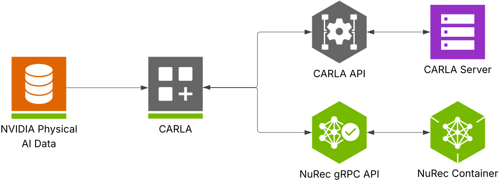

*그림 7-9. CARLA 0.9.16의 NuRec 연동 구조. 출처: [carla-simulator/carla Docs/img/carla-nurec-api.svg](https://github.com/carla-simulator/carla/blob/ue4-dev/Docs/nvidia_nurec.md), MIT(CARLA), © CARLA.*

### 7.3.2 Cosmos 쪽: 생성형 변주·증폭

| 항목 | 내용 |
|---|---|
| 전체 그림 속 위치 | OVX(Transfer·Predict), DGX(Reason) |
| 담당 역할 | Omniverse/NuRec/라벨 렌더를 조건으로 받아 **외형·날씨·조명·지역을 변주**하고, 비디오 세계 모델로 미래를 롤아웃하며, 물리 타당성을 판단한다 |
| 현재 위치 | ② 모델 공개, ③ 파트너 통합(Foretellix·CARLA·Oxa) ✅ |

Transfer2.5 README의 두 모드가 역할을 가장 정확히 말한다. "**Simulation 2 Real Augmentation**: 3D 시뮬레이션에서 고충실도를 달성할 필요를 최소화" / "**Real 2 Real Augmentation**: 센서로 캡처한 RGB 증강" ([cosmos-transfer2.5](https://raw.githubusercontent.com/nvidia-cosmos/cosmos-transfer2.5/main/README.md)) 🔍. 즉 Omniverse가 완벽한 사실감을 낼 필요가 없고, 기하·라벨만 정확하면 외형은 Cosmos가 채운다는 분담이다.

- CES 2025 키노트 요약: "Omniverse와 새 Cosmos WFM이 짝을 이뤄 **합성 데이터 증식 엔진**을 만든다" 📄; "Omniverse에서 만든 제어된 3D 시나리오로부터 Cosmos가 포토리얼 비디오 생성" ✅.
- GTC 2025 키노트 3자 요약: "Omniverse는 지도와 이미지를 융합해 4D 주행 환경과 디지털 트윈을 만들고, 픽셀별 분류(세그멘테이션)로 Cosmos를 유도" 📄 ⚠️(3자 표현).
- 비결정론·물리 한계: Cosmos 3 README의 한계 목록(7.1.4) 🔍; Cosmos 1.0 논문 "자기회귀 WFM 생성 비디오에서 물체가 아래에서 예기치 않게 나타나는 실패 사례" 📄.

**확인하지 못한 문구**: "simulation vs amplification", "Omniverse produces ground truth, Cosmos multiplies"를 NVIDIA 원문 그대로는 찾지 못했다. 가장 가까운 확인 문구는 "Omniverse에서 만든 정답을 Cosmos Transfer로 포토리얼 비디오로 변환"(GTC 2025 ✅)과 "물리 기반 센서 데이터의 변주를 증폭"(📄)이다 ⚠️.

### 7.3.3 결합 패턴

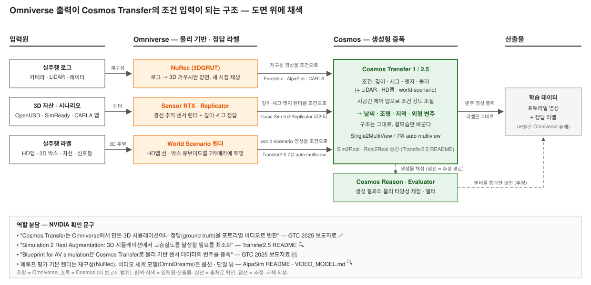

*그림 7-10. Omniverse(물리 렌더·NuRec) 출력이 Cosmos Transfer의 조건 입력이 되는 결합 구조. 실선 = 출처로 확인, 점선 = 추정. 자체 작성.*

| 패턴 | 구체 연결 | 근거 |
|---|---|---|
| Omniverse Replicator → Transfer | Isaac Sim 5.0: "Cosmos Transfer 입력에 최적화된 새 Replicator 라이터로 고품질 합성 데이터 생성·내보내기" | [IsaacSim 5.0 릴리스](https://github.com/isaac-sim/IsaacSim/discussions/133) 🔍 |
| CARLA → Transfer | "CARLA가 RGB·세그·깊이·엣지 비디오를 생성해 Cosmos Transfer를 제어"; `carla_cosmos_gen.py`; 왕복 1~2분; H100급 GPU("8×H100 클러스터 권장, 저부하는 H100 1장") | [CARLA docs](https://raw.githubusercontent.com/carla-simulator/carla/ue4-dev/Docs/nvidia_cosmos_transfer.md) 🔍 |
| NuRec 재구성 + Transfer 변주 | NuRec 페이지: "Omniverse 시뮬레이션을 지시 비디오로 Cosmos Transfer에 입력해 제어 가능한 포토리얼 합성 데이터 생성" 📄; Foretellix: "Sensor RTX가 렌더한 센서 데이터의 다양성을 Cosmos Transfer로 증폭 — 날씨·낙서·더러운 렌즈·새 ODD까지" ([Foretellix](https://www.foretellix.com/data-automation-toolchain-for-ai-powered-av-development/)) 📄; NVIDIA 2025-08: Foretellix가 "NuRec·Sensor RTX·Cosmos Transfer 통합" ✅ | |
| 라벨 렌더 → Transfer2.5 (Real2Real) | World Scenario 렌더: "폴리라인·폴리곤·큐보이드 3D 요소"로 도로 지도·차량 박스·차선·신호등을 7카메라에 투영(OpenGL GPU 렌더), Transfer2.5 조건 입력 | [world_scenario_video_generation.md](https://raw.githubusercontent.com/nvidia-cosmos/cosmos-transfer2.5/main/docs/world_scenario_video_generation.md) 🔍 |
| Blueprint | "Omniverse Blueprint for AV simulation은 Cosmos Transfer로 물리 기반 센서 데이터 변주 증폭"(GTC 2025) 📄; GTC 2025 세션 DD40002 📄 | |
| CARLA 0.9.16 통합 | NuRec(재구성 주행, 게이트 HF 1.52TB, 시점·카메라 편집·객체 추가·랜덤화) + Cosmos Transfer(스타일·날씨 변주) 동시 통합 | [CARLA NuRec docs](https://raw.githubusercontent.com/carla-simulator/carla/ue4-dev/Docs/nvidia_nurec.md) 🔍 ✅ |

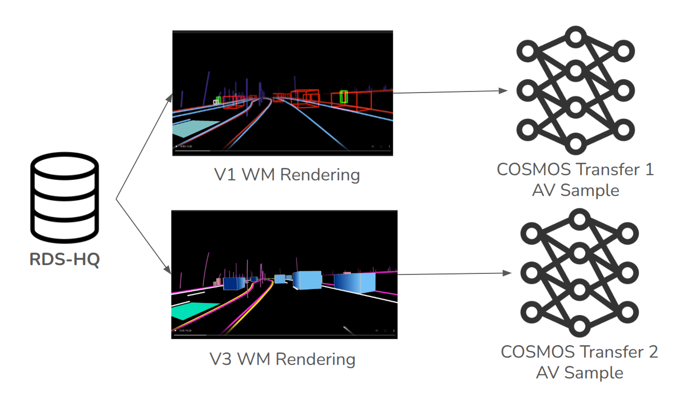

*그림 7-11. RDS-HQ 라벨을 HD맵 선+박스(V1) 또는 3D "world scenario"(V3)로 렌더해 Transfer 1/2 AV 모델의 조건으로 쓰는 방식. 출처: [nvidia-cosmos/cosmos-transfer2.5 docs](https://github.com/nvidia-cosmos/cosmos-transfer2.5/blob/main/docs/world_scenario_video_generation.md), © NVIDIA.*

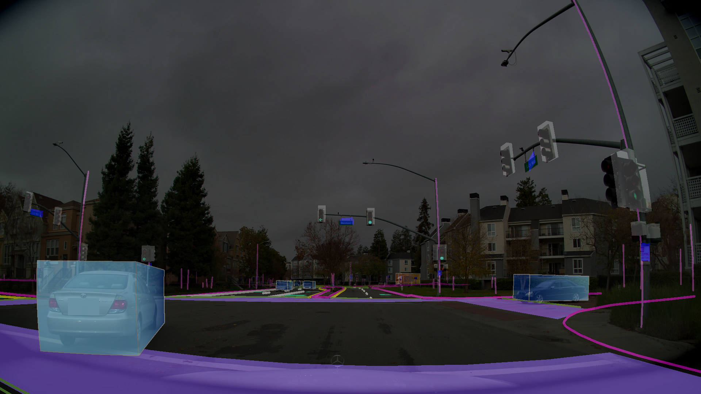

*그림 7-12. AlpaSim의 OmniDreams 비디오 세계 모델 렌더러가 조건으로 받는 HD맵 2D 렌더 오버레이. 출처: [NVlabs/alpasim VIDEO_MODEL.md](https://github.com/NVlabs/alpasim/blob/main/docs/VIDEO_MODEL.md), Apache-2.0, © NVIDIA.*

### 7.3.4 역할 구분표

| 축 | Omniverse (Sensor RTX / NuRec) | Cosmos (Transfer / Predict / Reason) | 근거 |
|---|---|---|---|
| 물리 정확도 | 광선 추적 기반 센서 물리(빔 발산·도플러·롤링 셔터) 📄; NuRec은 실데이터 재구성이라 기하가 실측 기반 🔍 | 학습된 근사. NVIDIA 자인 한계: "부정확한 3D 구조, 비현실적 물리 동역학" 🔍 | 7.3.1·7.1.4 |
| 다양성·외형 | 자산·재질 제작 비용에 종속 | 텍스트·조건으로 날씨·조명·지역 무제한 변주("Sim2Real 증강") 🔍 | Transfer2.5 README |
| 정답 라벨 | 깊이·세그·박스 등 정답 직접 산출 📄 | 라벨을 **입력**으로 받음(Transfer); Reason은 VLM 주석 생성 | 7.2.3 |
| 결정론·재현성 | Replicator "시간 정확·결정론적"(2022) 📄; 현행 재확인 없음 ⚠️ | 확률적 생성. 시드 고정 가능하나 물리 일관성 미보장 | ⚠️ |
| 비용 | 장면 제작 인력 + RTX/OVX 렌더 | H100급 추론(CARLA 왕복 1~2분/클립, 7뷰=7~8 GPU, OmniDreams 48~96GB) 🔍 | 7.3.3 |
| 개방성 | 3DGRUT 오픈소스; ovrtx·Kit·NuRec 서비스는 독점/게이트 🔍 | Gen1~2.5 NOML, Cosmos 3 OpenMDW-1.1 🔍 | 7.1.5 |
| 적합 용도 | 규제·인증급 센서 물리 검증(Mcity/MITRE는 Omniverse만 사용 📄), 폐루프 기본 렌더(AlpaSim 기본=NuRec 🔍) | 롱테일·외형 증강, 코너케이스 탐색(Wayve "평가 중" 📄), 라벨링·크리틱 | 7.4 |

---

## 7.4 활용 패턴

### 7.4.1 패턴 A — 합성 데이터·증강 (Transfer)

| 항목 | 내용 |
|---|---|
| 담당 역할 | 라벨·시뮬 렌더 → 날씨·조명·지역·롱테일 변주 비디오 |
| 현재 위치 | ② 모델·파이프라인 공개(Drive-Dreams), ③ Foretellix·CARLA·Oxa·Voxel51 통합 ✅ |

- **Cosmos-Drive-Dreams**: "AV 용도의 다양하고 도전적인 시나리오를 생성하기 위해 Cosmos WFM 위에 구축된 합성 데이터 생성(SDG) 파이프라인" 🔍. 실클립 5,843 → 합성 81,802(121프레임, 비·눈·안개), 4뷰(정면·좌·우·후방) 🔍. 파생 모델 5종(AV-Sample, Multiview-AV-Sample, Transfer1-Sample-AV, Single2Multiview, LiDAR-GEN) 🔍. 2025-10 LiDAR 토크나이저·디퓨전, World Scenario 렌더링 추가 🔍. 제3자 TeraSim-World(arXiv 2509.13164)가 "포토리얼·지리 기반 센서 렌더링"에 Cosmos-Drive 사용 📄.
- **채택 사례**: Foretellix(Foretify 시나리오 + Sensor RTX + Transfer 변주) ✅; CARLA 0.9.16 🔍; Oxa "Cosmos Transfer를 자체 툴체인 Oxa Foundry에 통합" 📄; Voxel51 "Cosmos Transfer가 만든 데이터를 관리·시각화·정제하는 툴킷(FiftyOne)" 📄.
- **정량 효과**: AV 수치 미확보 ⚠️(7.2.3).

### 7.4.2 패턴 B — 폐루프 평가·세계모델 시뮬 (Predict / Dreams + NuRec)

| 항목 | 내용 |
|---|---|
| 담당 역할 | 정책의 행동 결과를 시뮬에서 되먹여 평가. 렌더는 NuRec(재구성) 또는 비디오 세계 모델(생성) |
| 현재 위치 | ② AlpaSim 오픈소스(2025-10), "Cosmos-Dreams" 발표(CES 2026) 📄, 공개 저장소 없음 ⚠️ |

- **AlpaSim**: "실제 센서 데이터·차량 동역학·교통 시나리오를 시뮬레이션해 E2E AV 정책을 폐루프로 테스트"; 렌더러 플러그형 "NuRec 기본 지원 + FlashDreams를 통한 OmniDreams 비디오 모델 렌더링"; Python gRPC 마이크로서비스; 지원 정책 Alpamayo-R1·1.5, VaVAM, LTFv6(NAVSIM); 데이터 `PhysicalAI-Autonomous-Vehicles-NuRec 26.01` ([NVlabs/alpasim](https://github.com/NVlabs/alpasim)) 🔍. 설계: "월드 상태가 바운딩 박스로 trafficsim에 전달되어 비자차 액터를 구동", "**실시간과 매우 정밀한 물리는 비목표**", 평가 모듈은 루프 밖에서 로그로 메트릭 계산 🔍.
- **OmniDreams(비디오 세계 모델 렌더러)**: "상태 유지 렌더러… 롤아웃 세션을 열고 청크 단위로 비디오 생성"; "특히 동적·비강체 물체에서 더 나은 시각 품질"; HD맵 렌더+액터 큐보이드 조건; **단일 뷰만 지원**; VRAM 48GB(FlashDreams)/96GB(Alpamayo1.5); 카메라 오버라이드 시 "생성 비디오가 드리프트·정렬 이탈 가능"; 기반 Cosmos 모델명 미기재 ([VIDEO_MODEL.md](https://raw.githubusercontent.com/NVlabs/alpasim/main/docs/VIDEO_MODEL.md)) 🔍.
- **Cosmos-Dreams**(CES 2026 마케팅명): "대규모로 희귀·롱테일 주행 시나리오를 시뮬레이션하는 포토리얼 폐루프 AV 시나리오 생성 세계 모델" 📄. nvidia-cosmos 조직에 `cosmos-dreams` 저장소 없음(2026-09-02 확인) 🔍 → AlpaSim의 OmniDreams/FlashDreams가 구현 표면으로 추정 ⚠️.
- **Predict 멀티뷰**: Predict2.5 `2B/auto/multiview`(7카메라) 🔍; Oxa "Cosmos Predict로 자율주행 시스템 고도화" 📄.
- **관찰**: NVIDIA 자신의 폐루프 평가 기본값은 생성이 아니라 **재구성(NuRec)**이다 🔍(저장소 기본값에서 추론).

### 7.4.3 패턴 C — 정책 학습·RL (Cosmos-RL, AlpaGym)

| 항목 | 내용 |
|---|---|
| 담당 역할 | 시뮬 환경에서 롤아웃을 돌려 정책(VLA)을 강화학습으로 후학습 |
| 현재 위치 | ② Cosmos-RL(유지보수)·AlpaGym(2026-06, "초기 활발 개발") 🔍 |

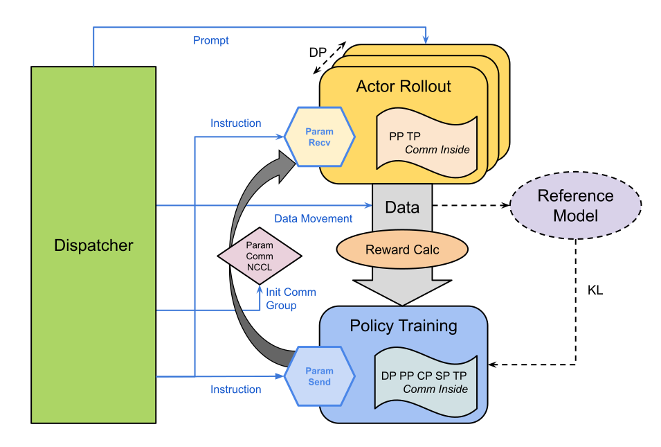

*그림 7-13. Cosmos-RL의 정책–롤아웃–컨트롤러 분리 구조. 출처: [nvidia-cosmos/cosmos-rl](https://github.com/nvidia-cosmos/cosmos-rl) `assets/rl_infra.svg`, Apache-2.0, © NVIDIA.*

- Cosmos-RL: 정책/롤아웃 replica 비동기, TP/SP/CP/FSDP/PP, FP8 학습·FP8/FP4 롤아웃, 단일 컨트롤러·동적 NCCL 그룹 🔍. Alpamayo 오픈루프 RL(GRPO, 640 GPU) 레시피가 이를 사용(3장 3.1.3) 🔍.
- AlpaGym: AlpaSim=환경, Cosmos-RL=분산 롤아웃·학습, 보상 예 `progress_safety`, Alpamayo 1.5(10B)만 지원, 처리량 수치 미공개 🔍.
- 로봇 쪽 대응(맥락): GR00T-Dreams는 "Cosmos WFM으로 이미지 1장+언어 지시에서 대량 합성 궤적 생성" → IDM으로 행동 추출 → GR00T N1 파인튜닝 ([NVIDIA/GR00T-Dreams](https://github.com/NVIDIA/GR00T-Dreams)) 🔍; Cosmos Policy "LIBERO 98.33%, RoboCasa 71.1%" 🔍. Jetson Thor는 DRIVE Thor와 같은 SoC 계열 📄(1장).

### 7.4.4 패턴 D — 추론 VLM 백본 (Reason)

| 항목 | 내용 |
|---|---|
| 담당 역할 | 라벨러·크리틱·플래너 백본 |
| 현재 위치 | ③ Alpamayo 1/1.5/2 Super 백본으로 채택(NVIDIA 내부 양산 파이프라인) 🔍 |

- 백본: Alpamayo "Cosmos-Reason 백본 + action expert" 🔍; 세대 매핑 Reason1 → Reason2 → Cosmos 3 Super Reasoner(3장 3.1.2) 🔍.
- 크리틱: Reason1 video critic 🔍, Reason2 리젝션 샘플링 🔍, Cosmos Evaluator 📄.
- 라벨러: AV 캡셔닝·VQA 레시피 📄, 3D AV 그라운딩 후학습 레시피 🔍, Curator의 Reason 활용 📄.

### 7.4.5 채택사·사례

| 회사 | 사용 패턴 | 공개 진술 | 근거 | 등급 |
|---|---|---|---|---|
| Uber | A·B·D(데이터 팩토리) | CES 2025 Cosmos+DGX Cloud; GTC DC 2025 "2027년부터 10만 대, Cosmos 기반 공동 AI 데이터 팩토리"; Data Factory Blueprint 사용자 | [Uber IR](https://investor.uber.com/news-events/news/press-release-details/2025/Uber-to-Deploy-One-of-the-Worlds-Largest-Networks-of-Autonomous-Vehicles-Powered-by-NVIDIA-AI-Architecture/default.aspx), [TechCrunch 2025-01](https://techcrunch.com/2025/01/07/at-ces-2025-uber-teams-up-with-nvidia-to-scale-autonomous-driving-faster/) | ✅ |
| Foretellix | A(+Omniverse) | Sensor RTX 조기 접근(2024-06) → "Cosmos로 검증·밸리데이션용 시나리오 다양성 확대" → NuRec+Sensor RTX+Transfer 통합(2025-08) | [Foretellix](https://www.foretellix.com/foretellix-nvidia-ai-centric/) | ✅ |
| CARLA | A·B(NuRec) | 0.9.16에 NuRec·Cosmos Transfer 통합, "15만 AV 개발자" | CARLA docs 🔍 | ✅ |
| Wayve | 코너케이스 탐색 | "안전·검증용 엣지·코너케이스 주행 시나리오 탐색 도구로 Cosmos 평가 중"(CES 2025, 2026 재언급); 2026-02 NVIDIA·Uber 등 12억 달러 투자 | [Wayve](https://wayve.ai/thinking/wayve-nvidia-collaboration/) | 📄 |
| Waabi | A·큐레이션 | "시뮬레이션·데이터 큐레이션에 Cosmos WFM 사용, DRIVE Thor 통합"; 자체 Waabi World 병행 | [Waabi](https://waabi.ai/insights/nvidia-drivethor) | 📄 |
| Plus(PlusAI) | 개발·테스트 | "SuperDrive 테스트·개발 가속에 Cosmos WFM 사용", "Cosmos Physical AI 모델을 SuperDrive에 내장" | [NVIDIA 블로그](https://blogs.nvidia.com/blog/auto-ecosystem-physical-ai/) | 📄 |
| Oxa | A·B | "Cosmos Transfer를 Oxa Foundry에 통합", "Cosmos Predict 사용" | NVIDIA 개발자 블로그 | 📄 |
| Voxel51 | 데이터 관리 | FiftyOne으로 Transfer 생성 데이터 관리 | [Voxel51](https://voxel51.com/gtc-dc-2025) | 📄 |
| Mcity / MITRE | Omniverse만(규제급 검증) | "Sensor RTX API로 물리 기반 센서 시뮬레이션… 32에이커 시험장 디지털 트윈" | [NVIDIA 블로그](https://blogs.nvidia.com/blog/mitre-digital-proving-ground/) | ✅ |
| XPENG | 초기 채택 명단 | CES 2025 명단, 구체 진술 없음 | 보도자료 | 📄 ⚠️ |
| Li Auto | 명단 | "Cosmos 플랫폼 위에 AV 구축"(2026 스니펫) | — | ⚠️ |
| Toyota·Aurora·Continental·Zoox·Nuro·Helm.ai·Applied Intuition | 미확인 | 플랫폼 일반 설명 또는 자료 없음 | — | ⚠️ |

### 7.4.6 한계

| 한계 | 근거 |
|---|---|
| **물리 충실도·환각**: Cosmos 3 README의 한계 목록(시간 불일치, 물체 변형, 부정확 3D, 비현실 동역학) 🔍; Cosmos 1.0 논문 "아래에서 예기치 않게 나타나는 물체" 📄; 제3자 벤치마크 "물리 일관성은 제한적이고 파편적… 시각 사실성과 물리 정확성은 함께 오르지 않는다"(PhysicsMind arXiv 2601.16007, Pebblous 보고서) 📄 | 7.1.4 |
| **sim2real·분포 이동**: 서베이 "생성 세계 모델과 E2E 정책은 분포 내 성능은 강하나 분포 이동 시 급격히 저하"(arXiv 2501.11260) 📄 | |
| **평가의 순환성**: 세계 모델로 정책을 평가하면 모델 오류가 평가 오류가 된다. NVIDIA 자신도 AlpaSim 기본 렌더러를 재구성(NuRec)으로 두고, OmniDreams는 "단일 뷰, 드리프트 가능"이라 명시 🔍. 인증 근거로의 수용 여부는 미정 ⚠️ | 7.4.2 |
| **컴퓨트 비용**: CARLA→Transfer 왕복 1~2분/클립, 8×H100 권장; Transfer2.5 7뷰=7~8 GPU; OmniDreams 48~96GB; Transfer1 실시간은 GB200 NVL72 랙 🔍📄 | 7.3.3 |
| **라이선스·개방성**: NOML의 가드레일 우회 종료·표시 의무 📄; ovrtx·Omniverse Kit·NuRec 서비스 독점 🔍; NuRec 데이터셋 게이트 🔍. Cosmos 3는 OpenMDW-1.1로 완화 🔍 | 7.1.5 |
| **세대 교체 속도**: 12개월 내 4세대, 이전 저장소 유지보수 모드 🔍 | 7.0.4 |
| **정량 근거 부족**: AV 다운스트림 개선 수치는 공개 자료에서 확보 불가 ⚠️ | 7.2.3 |

---

## 7.9 미확인·리스크

| 항목 | 상태 | 확인 방법 |
|---|---|---|
| Cosmos 3 파라미터(64B/16B/4B vs 추론기 32B/8B) 해석 | 추정 ⚠️ | 기술 리포트 arXiv 2606.02800 |
| Cosmos 3 발표일(GTC 2026-03 프리뷰 vs 2026-05-31 공개) | 상충 ⚠️ | GitHub/HF 기준 채택 |
| Cosmos 3 학습 코퍼스 | 미공개 ⚠️ | 기술 리포트 |
| Data Factory Blueprint 발표 시점(GTC DC 2025 vs GTC 2026) | 상충 ⚠️ | 뉴스룸 원문 |
| "Cosmos-Dreams" 실체와 AlpaSim OmniDreams의 관계 | 추정 ⚠️ | NVIDIA 원문·저장소 공개 대기 |
| Drive-Dreams VLM 필터링(논문 "있음" vs 저장소 "coming soon") | 상충 ⚠️ | 논문 원문 |
| Drive-Dreams·Cosmos 합성 데이터의 AV 정량 효과 | 미확보 ⚠️ | arXiv 2506.09042 원문 |
| Omniverse vs Cosmos 역할 키노트 원문 문장 | 3자 요약만 ⚠️ | 키노트 트랜스크립트 |
| DRIVE Sim 단종 여부 | 진술 없음 ⚠️ | NVIDIA 제품 페이지 |
| Blueprint/ovrtx 결정론 재확인 | 2022 자료만 ⚠️ | Sensor RTX 문서 |
| NVIDIA Open Model License 정확 조항 | 원문 미열람 ⚠️ | 라이선스 PDF |
| Curator 기본 캡셔닝 모델 | 미명시 ⚠️ | docs |
| Physical AI AV 데이터셋 규모 표기(1,700h/306k vs 1,727h/311k) | 표기 차 ⚠️ | HF 카드 |
| XPENG·Li Auto·Toyota 등 구체 사용 진술 | 미확인 ⚠️ | 각사 자료 |

---

## 용어집

[^wfm]: WFM(World Foundation Model, 세계 기반 모델): 물리 세계의 시공간 동역학을 학습해 미래 상태(주로 비디오)를 예측·생성하는 대규모 모델. NVIDIA는 Predict(예측)·Transfer(변환)·Reason(추론) 세 분기로 나눈다.
[^dit]: DiT(Diffusion Transformer): 디퓨전 모델의 노이즈 제거 네트워크를 트랜스포머로 구성한 구조. Cosmos Predict·Transfer 계열의 생성 백본.
[^usd]: OpenUSD(Universal Scene Description): Pixar가 만든 3D 장면 기술 형식. Omniverse의 공통 데이터 모델이며 NuRec 출력도 USD로 내보낸다.
[^3dgut]: 3DGUT(3D Gaussian Unscented Transform): 3D 가우시안 스플래팅을 왜곡 카메라(어안 등)와 롤링 셔터까지 지원하도록 확장한 렌더링 기법(CVPR 2025). 3DGRT(가우시안 광선 추적)와 합쳐 3DGRUT로 공개.
